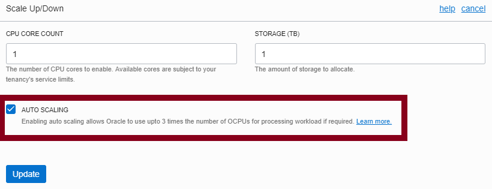

# Lab 100: First steps with ATP

## Objectives
- Configure auto-scaling in our ATP instance 
- Access the Performance Hub and learn how to monitor your ATP running your APEX applications
- Prepare the APEX workspace

# Steps

- Login to Oracle Cloud. You will have received a welcome email with the subject "Get Started Now With Oracle Cloud".

- On the left hand menu, choose Autonomous Transaction Processing.

  

- You should already have an ATP instance named "WORKSHOP". Click it.
  

## Configuring auto-scaling
Auto-scaling is a very powerful feature that lets our application handle peaks of traffic, while keeping costs under control at the same time. We will define a minimum number of OCPUs that our ATP will provision and the database will automatically scale up to three times that number, in case the demand arrives.

- Click on Scale Up/Down.
	

- Activate the AUTO SCALING checkbox: once you turn this on, the database will use up to three times the number of original cores to 
  execute its workloads. 
	

## Accesing the Performance Hub
The Performance Hub is a great tool to monitor our ATP status and activity. It is accessible from the Service Console.

- Open the Autonomous Database Details page and click on Performance Hub.
	

- In the upper part we will see the consumption of resources and waits of our sessions along time. In the lower part, we will be able to check the ASH (Active Session History) analysis, access the SQL Monitoring to analyze individual queries or even submit a session kill command.
	

# Prepare the APEX workspace

  - Go to the details of the autonomous database and open the Service Console.

  
  
  - Go to Development and open APEX.
  
  
  
  -  You will see the login page fof APEX Administration Services. Use the ADMIN password that you entered when you provisioned ATP.

  

  - Follow the instructions to create a new workspace.
  
  

  - In this case let's call the workspace and database user "WORKSHOPATP".
    Keep a note of the password as you will need it later.

  
  
# Follow-up questions

[juan.cabrera@oracle.com](mailto:juan.cabrera@oracle.com)
