# Lab 200: Adding Spatial to your APEX application
In this lab we will extend an existing APEX application with geospatial functionality. Imagine a fictional use case where citizens that wish to fly a drone have to formally request this. The APEX application will be used by an institution to process these requests and decide whether the drone-flight is allowed. 
A drone flight will be allowed when its location is not within an urban area. 

## Objectives
- Understand how to geocode an address with APEX.
- Understand how to perform geospatial calculations by using Spatial SQL functions from within APEX.

Follow these [prerequisites](./prereq.md) to set up the required Oracle Cloud Free Tier account and Autonomous Transaction Processing instance.

# Steps

## Import the APEX application

Our starting point is an unfinished APEX application. 

- First download the application that we will install.
  You can find it [here](./install/f105.sql). 
  
  To download it first click the link, then click the Download button of GIT and then Right Click "Save As" as f105.sql in your browser.
  
  
  

- Open APEX. If you have don't have the direct link, go to the Service Console of the database, then Development, then APEX.

  
  
  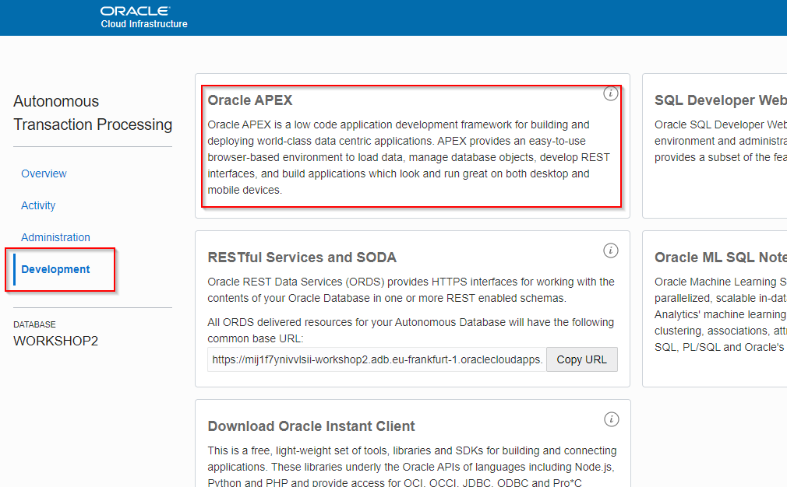
  
  - Login to the workspace that we created earlier.
  
  Workspace name: WORKSHOPATP, User name: WORKSHOPATP, use the password that you entered when you created the workspace.
  
  

  - Import the example APEX application.
    Go to "App Builder", then "Import".
  
  
  
  - Click through the wizard, keep the defaults. Import the application and the supporting objects by clicking "Next" several times and finaly "Install Application".
  
  

  
  
  - At the end of the wizard, choose "Edit Application".
  
## Review the APEX application (situation before Spatial functionality)

- Run the "Drone Flight Requests - Interactive Report" page
  
  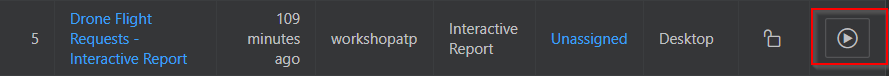

- You see the Drone Flight Request application, with a list of requests.

- Open one of the Drone Flight requests. Notice how we only have a textual address here at the moment, without coordinates.

## Adding Geocoding

The application currently has textual addresses that have not yet been verified in any way.
Our goal is to check whether the address is within an urban area. 
However, before we can do that we must first convert the address into a geo-location (long-lat). The process of converting an address from text format to coordinates is called Geo-coding.

There are several publicly available web services that provide this service. Oracle provides the so-called eLocation service for this. Please read the license and usage terms [here](http://elocation.oracle.com/elocation/home.html) before using the service.

There's a plugin in APEX called "Elocation Geocoder", which takes care of the communication with this webservice.
The input parameters for the plugin are: 
* 1. The street, postal code and city, concatenated with commas. 
* 2. The country. 

The output of the plugin is an APEX collection, of which the following columns are most important for us:
* "N002": The geocoded address's longitude
* "N003": The geocoded address's latitude

In case you don't know what APEX collections are: These provide a mechanism for you to store information on the user session level. An APEX collection is a matrix of values (rows + columns). We will use it as a way to retrieve the output from the geocoding webservice call, wherein the rows are the returned unique locations and N002 and N003 are the long-lat components. 
Note that geocoding could in some cases return multiple possible coordinates for the same written address. 
In our (simplified) example we will only look at the first row, and ignore any additional rows.

- Open the page "Drone Flight Request - Details" for editing.

- Withtin "Items", right click and "Create Page Item" to add a new field that will hold the concatenated value of various address fields, name it "P6_CONCATENATED_ADDRESS".

  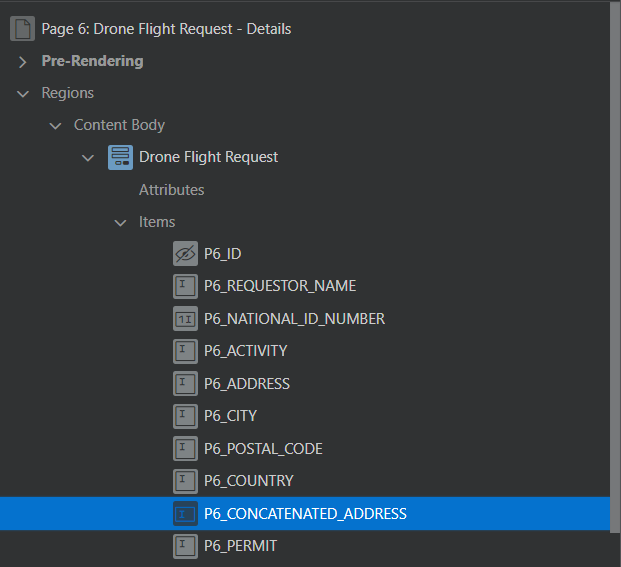
  
  Set its type to hidden.
  
  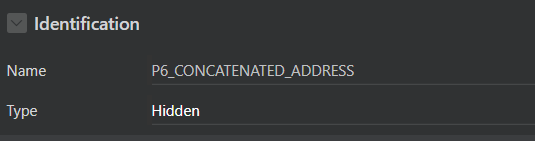

  Within "Region Buttons", right click and "Create button" to add a button called "OBTAIN_FLY_ZONE_INFO", label "Obtain Fly Zone Info".

  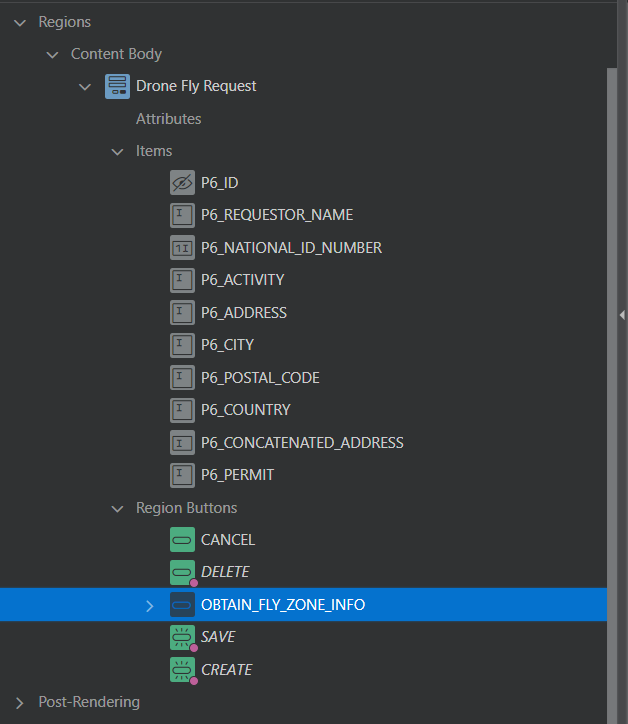
  
- We're first going to prepare the concatenated address field for the webservice. 

  On the new button right click and "Create Dynamic Action".

  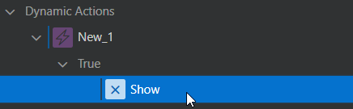
  
  Change the properties as follows:

  Action => "Set value". 
  
  Set Type => "JavaScript Expression".
  
  JavaScript Expression => 
  ```
  $v("P6_ADDRESS").replace(",", " ") + 
  ", " +
  $v("P6_POSTAL_CODE").replace(",", " ") + 
  ", " +
  $v("P6_CITY").replace(",", " ")
  ```
  
  Affected Elements, Items => P6_CONCATENATED_ADDRESS
  
  Fire on Initialization: No
  
  The result should look like:
  
  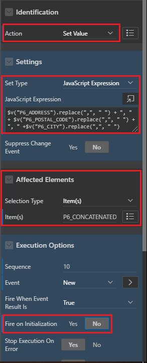
  
- Now we're ready to configure the actual web service call

  On the new Dynamic Action, rightclick and "Create TRUE action". This creates a new action below the "Set Value" action.
  
  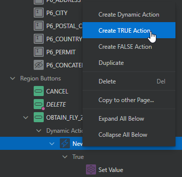
  
  We will now the configure the second action item that you see in the screenshot: "Oracle Elocation Geocoder".
  
  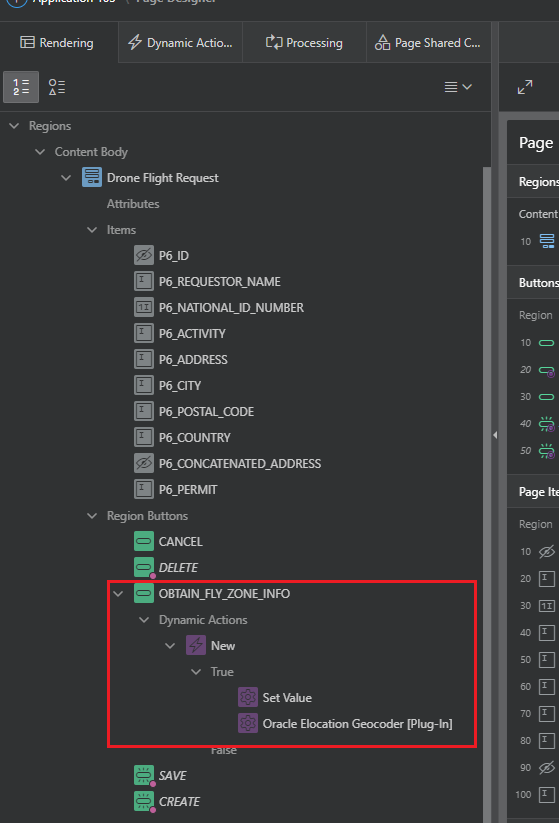
  
  Change the properties as follows:
  
  Action: "Oracle Elocation Geocoder [Plugin-In]"
  
  Geocoding type "Geocoding"
  
  Collection Name "GEOCODER_RESULTS"
  
  Item contains Country Code: "P6_COUNTRY"
  
  Item containing address lines: "P6_CONCATENATED ADDRESS" (This is the Page Item we created earlier)
  
  Separator for address elements: Select a comma here ","
  
  Fire on Initialization: No
  
  The resulting configuration should look like this:
  
  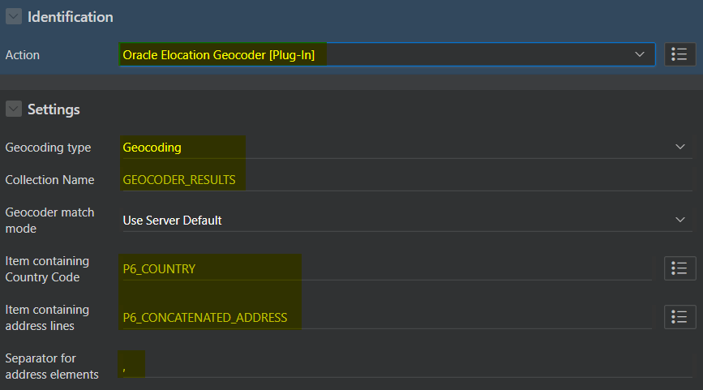

- The web service call is an asynchronous process. This means that an event will be raised when the call completes.
  It is our task to correctly handle this event.
  
  Go to the Dynamic Action tab, on "Events" rightclick and "Create Dynamic Action".
  
  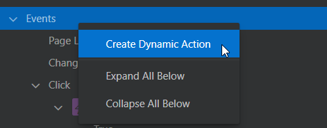
  
- Update the new Dynamic Action (by default named "New_1" and set the When-properties as follows:

  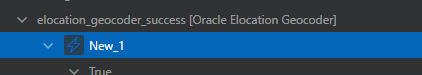

  Event => elocation_geocoder_success
  
  Selection Type => JavaScript Expression
  
  JavaScript Expression => document

  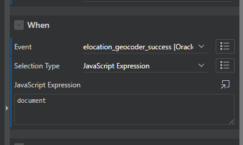

- Next, Click the True action of the newly created Dynamic Action.

  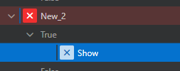

  Set the action to "Execute PL/SQL Code".
  
  Add the following PL/SQL.
  ```
  declare
      cursor c_geocoded_address
      is
          SELECT n002, n003
          from apex_collections where collection_name = 'GEOCODER_RESULTS'
          and n002 is not null and n003 is not null
          order by seq_id;
      r_geocoded_address c_geocoded_address%rowtype;
      lon varchar2(100);
      lat varchar2(100);
      coordinates MDSYS.SDO_GEOMETRY;
      overlap_count number;
      result varchar2(100) := '';
  begin
      open c_geocoded_address;
      fetch c_geocoded_address into r_geocoded_address;
      lon := r_geocoded_address.n002;
      lat := r_geocoded_address.n003;
      close c_geocoded_address;
      if lon is not null and lat is not null then
          result := result || 'Address found: ' || '[' || lon || ',' || lat || ']';
      else
        result := result || 'Address not found';
      end if;
      :P6_PERMIT := result;
  exception
      when others then
          :P6_PERMIT := sqlerrm;
  end;
  ```
  
  Set "Fire on Initialization" to "No".

- Set "Items to Return" to "P6_PERMIT".

  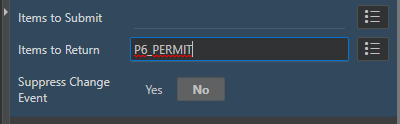
  
- Save and double-check that everything is correct by going to the "Dynamic Actions" tab. It should look similar to this:

  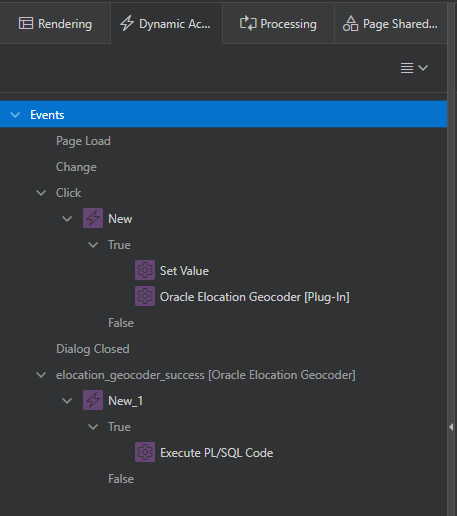
  
  You see one Click event that will a) construct the concatenated address and b) call the webservice. You see the elocator "success" event that is called to process the results of the geocoder service.

- Go to the "Drone Flight Requests - Interactive Report" page and run it.
  
  

  Edit any request, and click the "Obtain Fly Zone Info" button.
  
  You should now see either "Address Found" with the long-lat combination or "Address Not Found".

  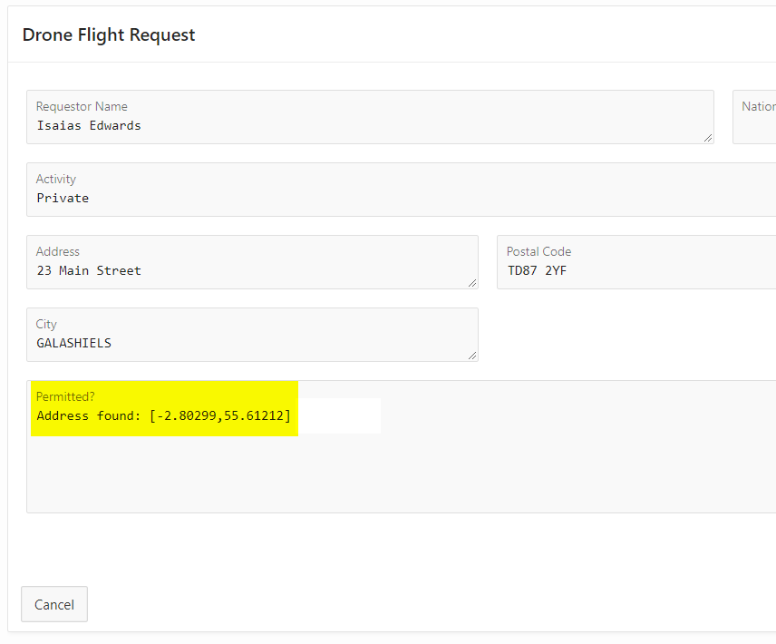
  

## Add verification that the flight will not take place in an urban zone

To do this, we need access to a list poligons for all the urban areas. Such a data set could be prepared using the [Spatial Studio](https://www.oracle.com/database/technologies/spatial-studio.html) tool, which can be used in conjunction with the autonomous database or in any situation where there's a license for the Spatial database option.
In our exercise, the urban areas can be considered a given; the collection of poligons is already provided in a database table (URBAN_AREAS_UK).

The Oracle Autonomous database comes preconfigured with Oracle Spatial. Highlights of the enabled features are; native storage and indexing of point/line/polygon geometries, spatial analysis and processing, such as proximity, containment, combining geometries, distance/area calculations, geofencing to monitor objects entering and exiting areas of interest, and linear referencing to analyze events and activities located along linear networks such as roads and utilities.

In our case we will verify that the coordinate of the proposed drone flight is not within any urban area by using the [Oracle Spatial operators](https://docs.oracle.com/database/121/SPATL/spatial-operators.htm#SPATL110). The operator SDO_ANYINTERACT will check if the coordinate overlaps/is inside any of the urban area poligons.

- Go back to the PL/SQL that's executed when the web service returns its result (edit the "Drone Flight Request - Details" page, then go to the Dynamic Actions tab and select the code under the TRUE 

  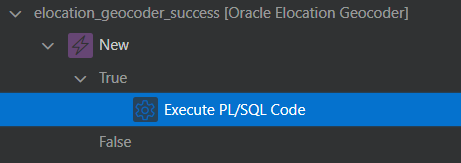
  
  Change the PL/SQL code to the following:
  
  ```
  declare
      cursor c_geocoded_address
      is
          SELECT n002, n003
          from apex_collections where collection_name = 'GEOCODER_RESULTS'
          and n002 is not null and n003 is not null
          order by seq_id;
      r_geocoded_address c_geocoded_address%rowtype;
      lon varchar2(100);
      lat varchar2(100);
      result varchar2(100) := '';
      coordinates MDSYS.SDO_GEOMETRY; --Add
      overlap_count number; --Add
  begin
      open c_geocoded_address;
      fetch c_geocoded_address into r_geocoded_address;
      lon := r_geocoded_address.n002;
      lat := r_geocoded_address.n003;
      close c_geocoded_address;
      if lon is not null and lat is not null then
          result := result || 'Address found: ' || '[' || lon || ',' || lat || ']';
          
          --Added code for urban area check
          coordinates := MDSYS.SDO_GEOMETRY(2001, 4326, MDSYS.SDO_POINT_TYPE(lon, lat, NULL), NULL, NULL);
          SELECT COUNT(*) INTO overlap_count
          FROM URBAN_AREA_UK "t2"
          WHERE SDO_ANYINTERACT("t2"."GEOM", coordinates) = 'TRUE';
          if overlap_count = 0 then
              result := result || ' - ALLOWED';
          else
              result := result || ' - NO FLY ZONE';
          end if;
          --End of added code for urban area check
          
      else
        result := result || 'Address not found';
      end if;
      :P6_PERMIT := result;
  exception
      when others then
          :P6_PERMIT := sqlerrm;
  end;
  ```

- Run the "Drone Flight Requests - Interactive Report" page
  
  Edit the request for "Isaias Edwards" in Galashiels, and click the "Obtain Fly Zone Info" button.
  
  You see that this address is not in an urban area, therefore the permit results is "Allowed".
  
  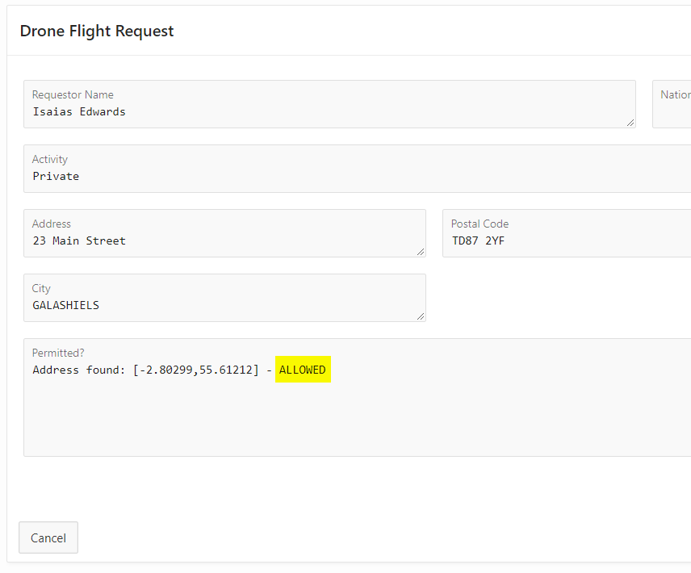


- Edit the request for "Nayeli Neal" in Belfast, and click the "Obtain Fly Zone Info" button. 
  
  You see that this address is inside an urban area (Belfast in fact), therefore the permit results is "No Fly Zone".
  
  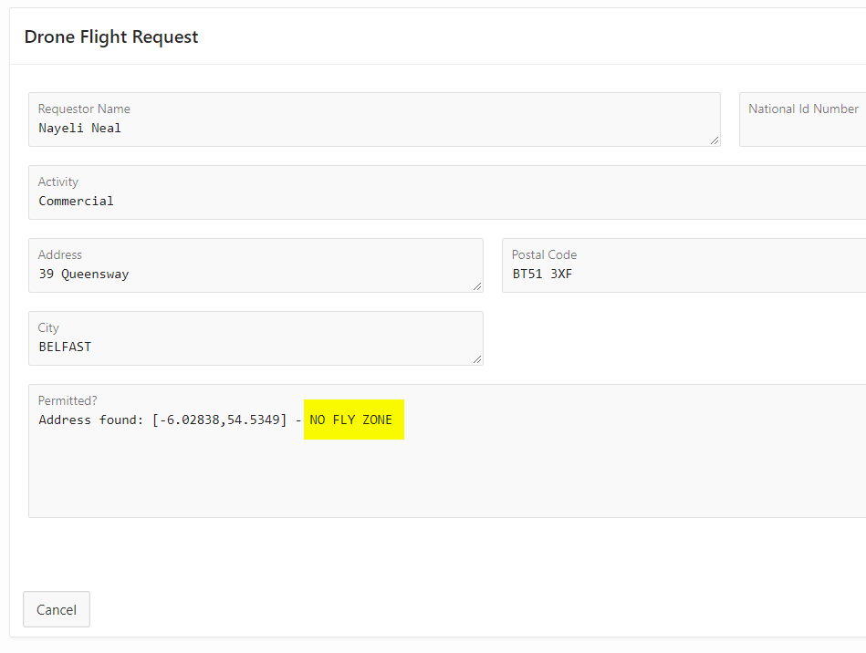


# Conclusion

  You have learned how work with geospatial information in your APEX application.
  You geocoded an address by calling the Oracle ELocation web service.
  You learned how to perform spatial validations by using Spatial SQL operators.

# Follow-up questions


[jeroen.kloosterman@oracle.com](mailto:jeroen.kloosterman@oracle.com)
