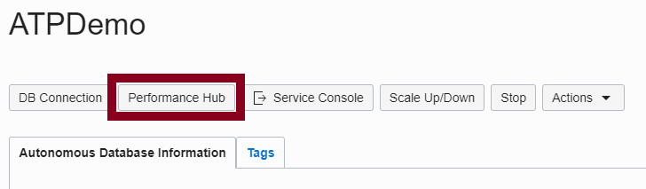
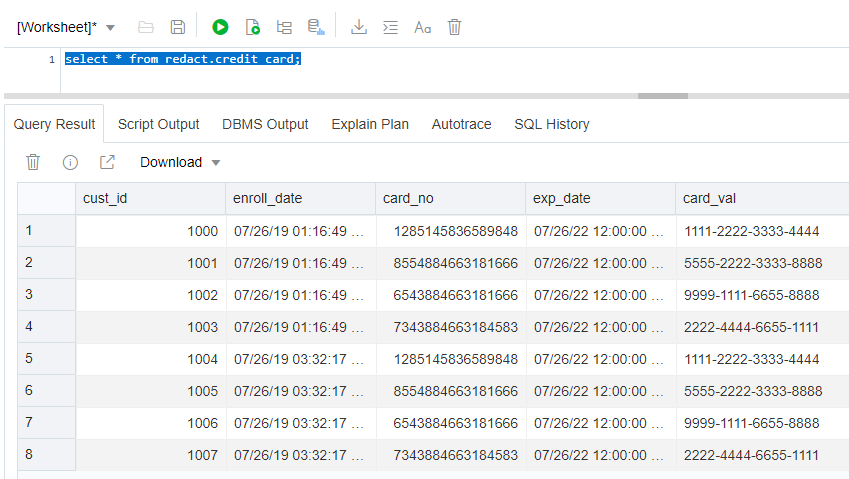
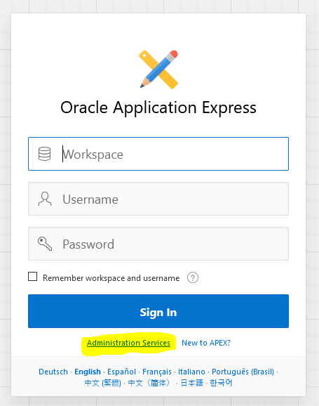
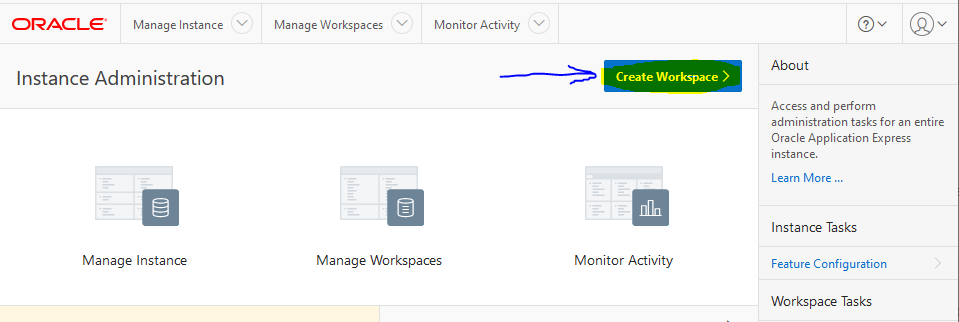
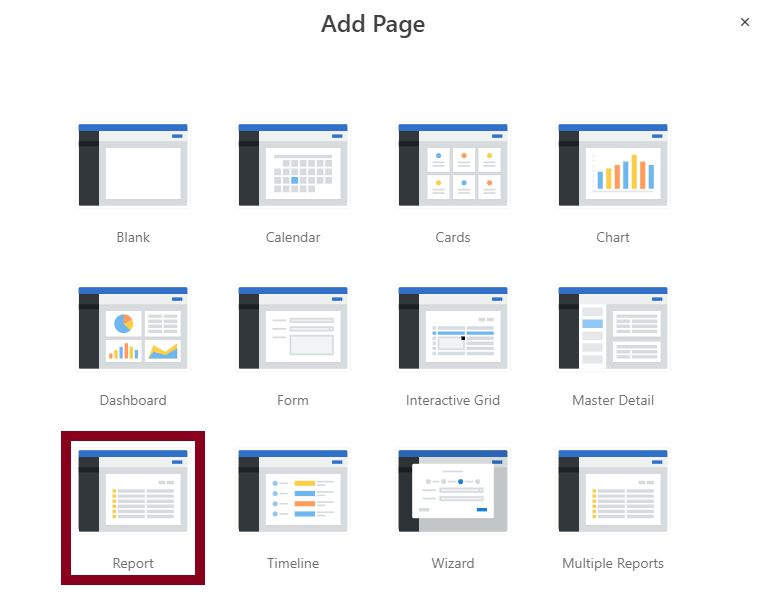
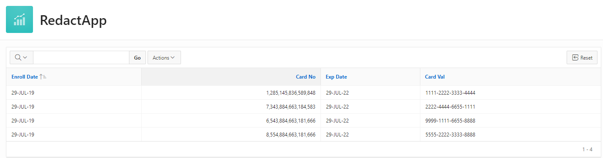

# Lab 400: Adding Security to your APEX application

<!--
The Oracle Database Enterprise Edition options offer formidable enhancements to security, scalability, availability and performance to any application built on top. All together, they are a very important asset to ensure the success and durability of our applications.

The autonomous database includes most of the Enterprise Edition options. Those APEX applications that are built on top of the Enterprise Edition Database already know their benefits but there are many implementations that could greatly profit from them. This is a golden chance for it!

Techniques used by the ATP's machine learning and artificial intelligence algorithms should include query optimization, automatic memory management, and automatic storage management to provide a completely self-tuning database. Auto-scaling will improve our elasticity in case of demand peaks, while reducing costs. The Performance Hub allows us to monitor our database continuously.
-->
The autonomous philosophy takes our security to the next dimension. Keeping up to date in terms of security patches is very difficult. But in the scope of the ATP and its self-securing approach, the latest security patches will be applied transparently to our databases and that the best industry standards will be respected.

Transparent Data Encryption and Data Redaction are two very powerful features to protect our application data and both are native to the ATP due to the presence of the Advanced Security option of the Oracle database.

<!--
In this lab, we will take a walkthrough around some of the improvements that the ATP provides to APEX developers, in areas such as performance, monitoring and security. 
-->

<!--
## Objectives
- Configure auto-scaling in our ATP instance and access the Performance Hub and learn how to monitor your ATP running your APEX applications.
- Learn what the how our application data will be secured in the ATP.
- Check the encryption of our data in our database.
- Create an schema on the database on SQL Developer Web with data redaction to be leveraged by an APEX application.
- Create an application on APEX that leverages the Advanced Security option to protect credit card information.


# Steps

## Configuring auto-scaling
Auto-scaling is a very powerful feature that lets our application handle peaks of traffic, while keeping costs under control at the same time. We will define a minimum number of OCPUs that our ATP will provision and the database will automatically scale up to three times that number, in case the demand arrives.

- Open the Autonomous Database Details page and click on Scale Up/Down.
	

- Select the number of CPU Cores we will use. This will be our minimum. Activate the AUTO SCALING checkbox: since then, the database will use up to three times the number of original cores to execute its workloads.
	

## Accesing our Performance Hub
The Performance Hub is a great tool to monitor our ATP status and activity. It is accessible from the Service Console.

- Open the Autonomous Database Details page and click on Performance Hub.
	

- In the upper part we will see the consumption of resources and waits of our sessions along time. In the lower part, we will be able to check the ASH (Active Session History) analysis, access the SQL Monitoring to analyze individual queries or even submit a session kill command.
	
-->

Follow these [prerequisites](./prereq.md) to set up the required Oracle Cloud Free Tier account and Autonomous Transaction Processing instance.

## Checking our data encryption
Another immediate consequence of choosing the ATP as our database is that our database will be in the Cloud and, thus, our data will be encrypted everywhere: SQLNet Traffic, tablespaces, backups... everything. Even if an attacker achieved to get into the physical machine, the data would still be secure.

The Transparent Data Encryption (TDE) option takes care of all the details. To prevent unauthorized decryption, TDE stores the encryption keys in a security module external to the database, called a keystore.

- Open SQL Developer Web. If you have don't have the direct link, go to the Service Console of the autonomous database, then Developer, then SQL Developer Web. You will need to input "ADMIN" as your user name and the password we provided when we provisioned the instance.

  
  
  
  
- Let's first check our data tablespaces and if they are encrypted. Query our tablespaces and their encryption status.

	- We can see that, in our example, we have two data tablespaces, which belong to tablespaces number 4 and 5.
	
	```
	select * from V$TABLESPACE;
	```
	
	
	
	- When we check the encryption status of both tablespaces, we find that by default they are encrypted.
	
	```
	select tablespace_name, status,encrypted  from USER_TABLESPACES;
	```
	
	
	- It is even more important to know that this status cannot change: any attempt to change their encrypted status in the Cloud will result in failure.

## Securing our sensitive information using data redaction
Even if the access to our application stays internal in our organization, sometimes data is allowed to be obtained only partially, with restrictions or even transformed. Data redaction is a powerful tool to enhance data governance security at the user level. Now we will create a new schema, configure it and populate it with the data we need to leverage data redaction in an APEX application. Execute the following script:

```
create user redact identified by "4P3X%ATP_sec_1";
grant create session to redact;
grant unlimited tablespace to redact;
create table redact.credit_card 
(cust_id number(10) GENERATED ALWAYS AS IDENTITY START WITH 1000,
enroll_date date NOT NULL,card_no number(16) NOT NULL,exp_date date NOT NULL,card_val varchar2(20));
insert into redact.credit_card(enroll_date,card_no,exp_date,card_val) values  (sysdate,1285145836589848,TRUNC(ADD_MONTHS(SYSDATE,36)),'1111-2222-3333-4444');
insert into redact.credit_card(enroll_date,card_no,exp_date,card_val) values (sysdate,8554884663181666,TRUNC(ADD_MONTHS(SYSDATE,36)),'5555-2222-3333-8888');
insert into redact.credit_card(enroll_date,card_no,exp_date,card_val) values (sysdate,6543884663181666,TRUNC(ADD_MONTHS(SYSDATE,36)),'9999-1111-6655-8888');
insert into redact.credit_card(enroll_date,card_no,exp_date,card_val) values (sysdate,7343884663184583,TRUNC(ADD_MONTHS(SYSDATE,36)),'2222-4444-6655-1111');
commit;
```


- If we run a select on the table we should get the following rows:

	```
	select * from redact.credit_card;
	```
	

- We are ready to create our application on APEX. Open APEX from the Service Console of the autonomous database, then Developer, then APEX. 

  Go to Administration Services.
  
  

  Enter your admin password.
  
  

  Click Create Workspace
  
  

- Click on the Icon at the side of Database User and select the REDACT user:

	

- Enter a password for the workspace (for example, "4P3X%ATP_sec_1") and leave REDACT as the workspace name. Click on Create Workspace.

	
	
- Sign out and in again with the REDACT user in APEX. Provide your email address and use "4P3X%ATP_sec_1" again as the account password, when prompted:

	

- Now we will create our application. Click on the App Builder icon, then Create and finally on New Application.

	
	
- Add "RedactApp" as the name of our new Application and click on Add Page. Select Report in the list of available options.

	
	
- Enter "Credit Card" as the name of the new page and click on the List icon to the right of "Table or View". Select the CREDIT_CARD table from the list. Under Advanced, activate "Set as Home Page" andm finally, click on Add page.

	
		

- The configuration is ready and now we can create our app. Click on Create Application at the bottom of the window. When the app is ready, click on Run Application to see the result!
	
	

- Authenticate in our new application with the REDACT user and the password we chose (e.g. "4P3X%ATP_sec_1"). We will see our application with the values from the CREDIT_CARD table.

	
	
	
- As we anticipated, we have sensitive data in our table. The card_val column requires data redaction to avoid exposing the full credit card numbers to the users. In our example, we will show only the last four numbers. Let's go back to SQL Developer Web and run the following PL/SQL snippet to create the proper policy on it:

	```
	BEGIN
	DBMS_REDACT.ADD_POLICY(
	object_schema          => 'redact', 
	object_name            => 'credit_card', 
	column_name            => 'card_val',
	policy_name            => 'redact_REG_EXP', 
	 function_type       => DBMS_REDACT.PARTIAL,
	   function_parameters => 'VVVVFVVVVFVVVVFVVVV,VVVV-VVVV-VVVV-VVVV,*,1,12',
	   expression          => '1=1',
	   policy_description  => 'Partially redacts our credit card numbers',
	   column_description  => 'card_val contains credit card numbers in VARCHAR2 format');
	END;
	/
	```
- Once the snippet has been executed successfully, refresh the page in our application. The credit card numbers now will be protected by the data redaction. They will not leave our database in a vulnerable condition anymore.


# Conclusion

<!--Performance tuning, scalability, monitoring, security... are all important points to consider that have a direct impact on the success of our applications. The autonomous database has a myriad of features that provide additional value to our applications. Some of them based on the autonomous philosophy, some of them out of the database options that belong to the Oracle Database Enterprise Edition.

In this lab:

  - You have configured auto scaling to be ready for demand peaks.
  - You have learnt how to monitor the performance and status of your ATP for your APEX application.-->
  - You have checked the encryption status of your application data in the ATP.
  - You have learned how to leverage the data redaction from the Advanced Security feature in order to protect your sensitive data in your application even before it leaves your ATP.

# Follow-up questions


[juan.cabrera@oracle.com](mailto:juan.cabrera@oracle.com)
