# Lab 500: Adding Analytics to your APEX application

Follow these [prerequisites](./prereq.md) to set up the required Oracle Cloud Free Tier account and Autonomous Transaction Processing instance.

# Review existing APEX application

Our starting point is an existing time entry application used by a fictional IT consulting company. It contains basic time and rates of their consultants.

- First download the application that we will install.
  You can find it [here](./install/f109.sql). 
  
  To download it first click the link, then click the Download button of GIT and then Right Click "Save As" as f109.sql in your browser.
  
  
  

- Open APEX. If you have don't have the direct link, go to the Service Console of the database, then Development, then APEX.

  
  
  
  
  - Login to the workspace that we created earlier.
  
  Workspace name: WORKSHOPATP, User name: WORKSHOPATP, use the password that you entered when you created the workspace.
  
  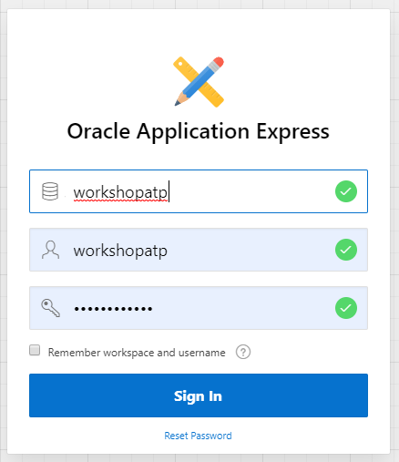

  - Import the example APEX application.
    Go to "App Builder", then "Import".
  
  
  
  - Select the file that you downloaded earlier, then "Import", "Next" and "Install Application".
  
  

  - On the dialog for supporting objects, choose "Next", then "Install". You should now see the following:

  
  
## Review the APEX application (situation before ML)

- Open the existing application by clicking on "Run Application".

  

  Login using the password that you used when creating the workspace.

- Have a look at the Time Registrations screen. This shows a list of employees, customers and time entry. 
  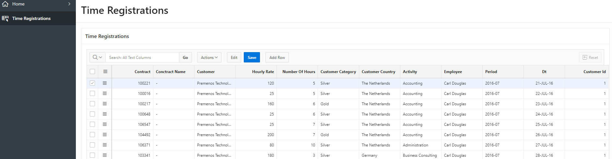
  
- Next, have a look at the Customer Report screen. 
  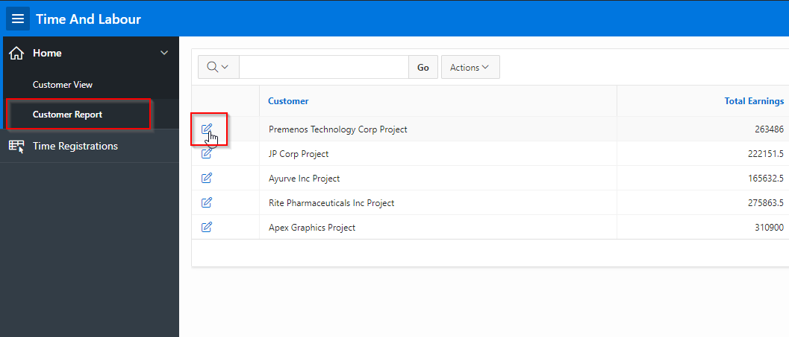
  
  => Later on in this workshop we will come back to the Customers page and embed an OAC Data Visualization into it.

# Create an Oracle Analytics Cloud (OAC) instance

Imagine that the end user of the application has analytical questions about the billing data.
We could provide him/her with some default charts prebuilt in APEX, however that would not allow the end user to create entirely new analysis.
Because of this, we are going to create an Oracle Analytics Cloud instance, to give our end users a self service approach to analytics.

- In the main cloud console, click on the menu icon on the left.

- Then navigate to Analytics => Analytics Cloud. 

  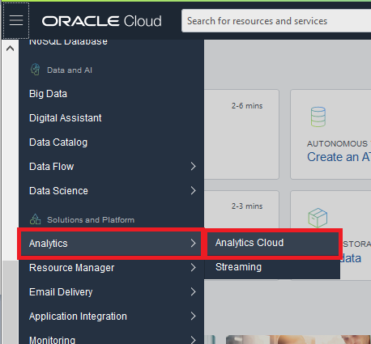

- Create a new instance.

  
  
- In the creation dialog, please choose the following values:
  
  Compartment: <A valid compartment in your tenancy>

  Instance Name: WORKSHOPATP
  
  Description: <Optional>

  Feature set: "Enterprise Analytics" (important)

  Capacity: "1 - Non Production"

  License Type: "Subscribe to a new Analytics Cloud software license and the Analytics Cloud." (You will use this service as part of the free Oracle Cloud trial that you requested for this workshop)

  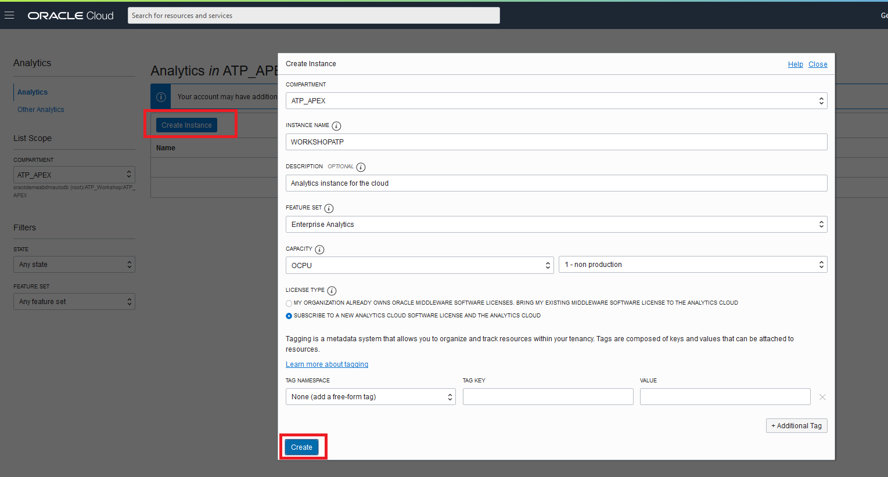

- Wait until the service has been created. This will take about 30 minutes.

  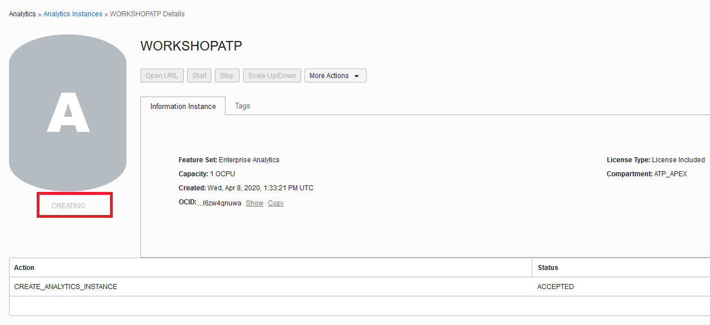

# Create a connection from OAC to ATP.

For any SQL client to make a connection to ATP it requires a *wallet*. A wallet is a ZIP file that contains the connection information for the ATP instance.
For example, a wallet can be used to connect a local SQL Developer client to ATP. In our case, we will use this same wallet mechanism to make a connection from OAC to ATP.

- First download the wallet from ATP as follows.
  Go to the Service Console of your ATP instance, then choose Administration, and click "Download Client Credentials (Wallet)".
  
  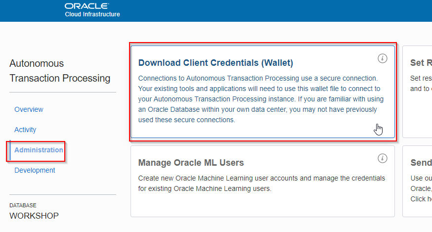
  
- You'll be asked to provide a password. Please make a note of this.
  
  
- Save the wallet file (ZIP) locally.

# Create a connection from Oracle Analytics Cloud to our ATP database

- Open your OAC. Remember you can reach it from the cloud console by going to Platform Services -> Analytics

  Then open the cloud analytics URL as follows:
  
  

- Click Create, then Connection.

  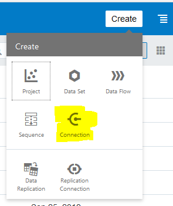
  
- Choose "Oracle Autonomous Transaction Processing"

  
  
- Configure the connection as follows:

  Connection Name: WORKSHOPATP
  
  Client Credentials: Upload the wallet file (the ZIP file) that you download earlier from ATP
  
  Username: WORKSHOPATP
  
  Password: The password that you used when you created the workspace at the beginning of the workshop
  
  Service Name: Choose the name of your database followed by the _high suffix
  
  
  
# Prepare the dataset

- Click Create, choose Data Set.

  

- Choose the connection to our schema

  
  
- Choose the WORKSHOPATP schema

  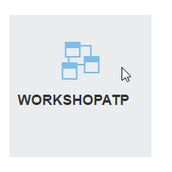

- Choose the DEM_PROJECT_HOUR table

  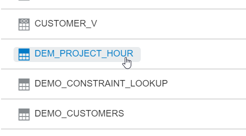
  
- Click "Add All" to select all columns, and then "Add" to create the Data Set.

  

- Make sure the ID column is used as an identifier by clicking it, then change the "Treat As" (left bottom of screen) setting to "Attribute".

  
  
  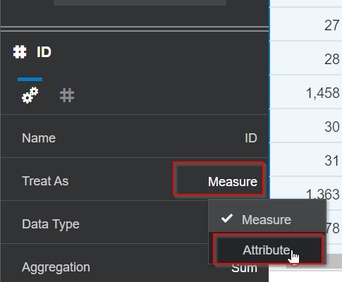

- Create a new self service project by clicking "Create Project".
  
  
  
  Apply Data Set changes if needed.
  
  

# Create Self Service analysis

The following is for you to experience how an end user can use OAC to create self service analytics on APEX application data.

- Imagine we ask ourselves "Which employees work the most hours as a consultant and at which company"? 

  Create the following visualization. You can do this by dragging the fields from the left onto the canvas.

  The following fields are required: NUMBER_OF_HOURS, EMPLOYEE and CUSTOMER.
  
  

  Choose the "Stacked Bar" chart type.
  
- Imagine we ask ourselves "Are the employees that work the most hours also the ones that earn most money for our company?"

  First of all we will create a Revenue field. Right click on "Calculations" and select "Add Calculation". 
  
  
  Drag the NUMBER_OF_HOURS and HOURLY_RATE fields into the formula space.
  
  
  Create the following formula: HOURLY_RATE * NUMBER_OF_HOURS
  and name the new field "Revenue".
  
  
  Then press Save.

  Now duplicate the original chart, by right clicking it, then "Edit" and "Duplicate Visualization".
  
  
  The result is:
  
  
  On the newly created chart, replace NUMBER_OF_HOURS with the new "Revenue" field. You can do this by a drag-and-drop of the "Revenue" field on NUMBER_OF_HOURS.
  
  
  Finally, change the aggregation method of Revenue by selecting the new chart, then clicking on Revenue and setting the "Aggregation Method" to "Sum" and "By" to "Id".
  
  
  
  The result is:
  
  
  Conclusions:
  
  => Lisa Jones bills a lot of hours, but is not one of the highest earners for our company.
  
  => Other employees, such as Cindy Cochran, earn more for our company with less billable hours.
  
- Imagine we have the question "Does a higher hourly rate also mean higher total earnings per employee"?

  Create a *Scatter* chart using Revenue, HOURLY_RATE and EMPLOYEE.
  
  For the HOURLY_RATE, set the Aggregation Method to "Average" and By to "Id".
  For the Revenue, set the Aggregation Method to "Sum".
  
  The result should like as follows:
  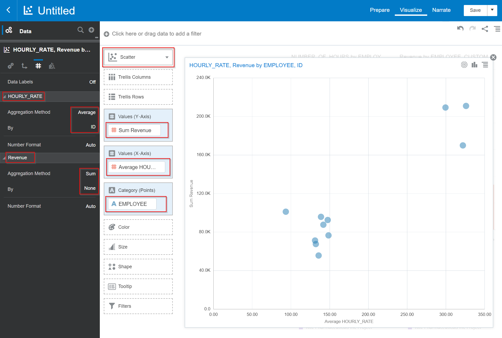
  
  Conclusion:
  
  => There is a group of employees that work a relatively low amount of hours, but still they succeed in earning the highest amount for our company.

- Imagine we ask ourselves "What is the secret of these high earners? Does a particular training for communication of these employees have something to do with their high earnings?"
  
  The training information is not stored in our APEX Time and Labour application. Instead, this data will be provided to the end user by Human Resources, by means of an Excel file.
  
  Download the training file from [here](./install/traininghistory.xlsx). 
  
  Add the dataset by clicking the "+" icon in the top left.

  

  Choose "Create Data Set"
  
  
  Drag the training Excel file on top of the icon.
  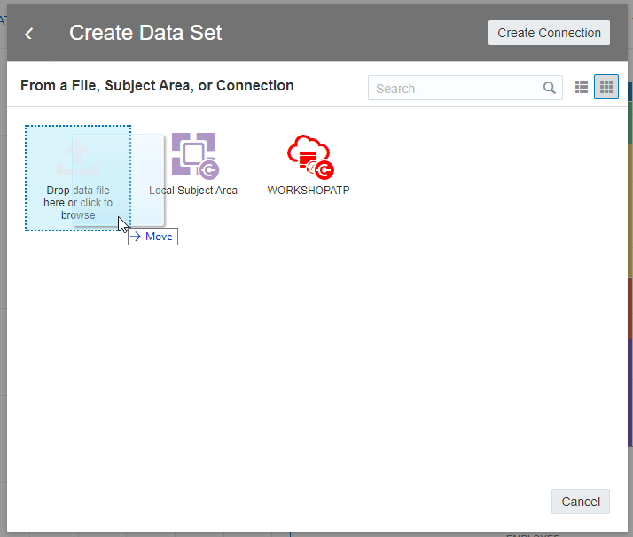
  
  You see that the file contains information on which employee has start/finished the training. 
  Click Add.
  
  
  To be able to link this new Data Set with our own, we need to link the employee names. However, our original Data Set (from the database) has the full name, including First and Last Name.
  Therefore we will create the same concatenation on the new training Data Set. On the Data Preparation screen you see several suggestions on the right hand side.
  Click on "Concatenate First Name and Last Name to first_last_name".
  
  
  
  Rename the newly created column to "Trainee Name", then press "Save". 
  
  
  
  
  Apply the change to the Data Set.
  
  
  Now we will link the two Data Sets. Click on the "Data Diagram" in the bottom.
  
  
  Create a new relationship by clicking on the "0". Then "Add Another Match" and select the two columns that contain the full employee name.
  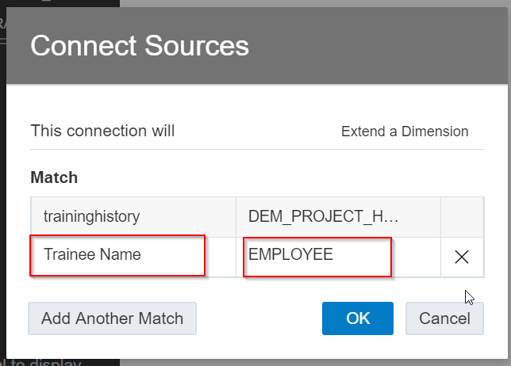
  
  Now add the training Status as the Shape of the Scatter chart. You can do this by dragging the Status field to the Shape of the Scatter chart.
  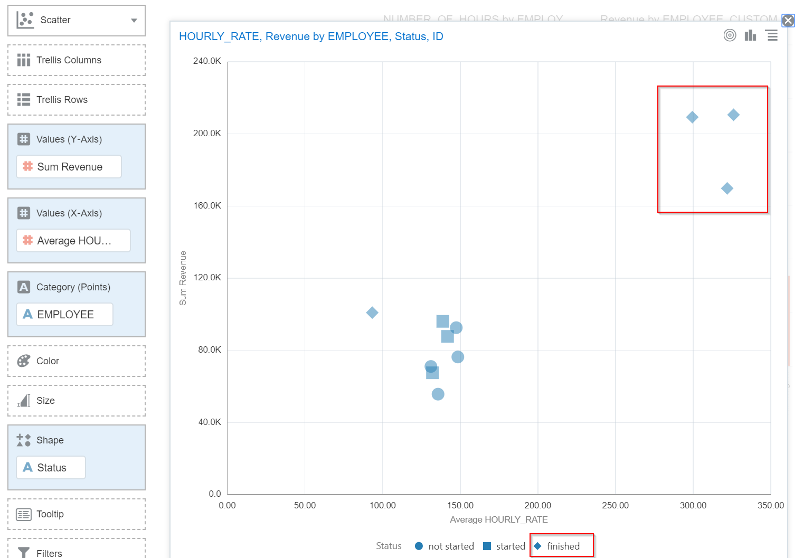
  
  Conclusion:
  
  => The highest earnest have all completed this particular training. It might be a good idea to let more employees participate in this training.
  
  => You've seen how an end user can answer their own questions by combining data from the APEX application with external data.

  Save the project as "Labour".
  
# Embed the OAC Data Visualization project into APEX

Our goal is to integrate the "Labour" DV project inside of our APEX application. The project should automatically filter using the context of the customer of the APEX screen.

- Still in the OAC Data Visualization project, go to the "Developer" option as follows:

  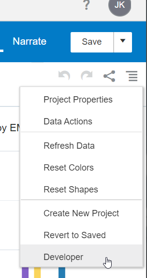
  
  Click on "Embed"
  
  Make a note of the HTML "Embedding Script To Include" and "Default" that you see here, as you will need them later.
  
  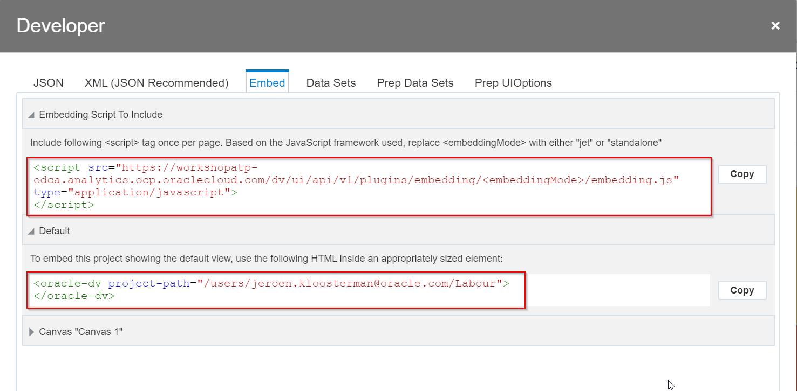
  
  For security reasons, you are not allowed to add external content to reports or embed your reports in other applications unless your administrator considers it safe to do so. Only administrators can add safe domains to the whitelist. Whitelisting allows or approves access to specific content.
  
- Access the OAC console by selecting the menu button in the top-left of your page and then **Console.**
  

- Select **Safe Domains**
  

- To locate the correct URL to add to this page, open a browser to the **Service Console** for your Autonomous Database. 

- Select the **Development** link in the left-hand menu. In the region **RESTful Services and SODA**  copy this link.  You need to remove the /ords at the end of the link before adding it to your list of Safe Domains. 

- For example: If your link is
`https://faw1dalxtmqfgcp-melapex.adb.eu-frankfurt-1.oraclecloudapps.com/ords/`
Then the URL to whitelist will be 
`https://faw1dalxtmqfgcp-melapex.adb.eu-frankfurt-1.oraclecloudapps.com`

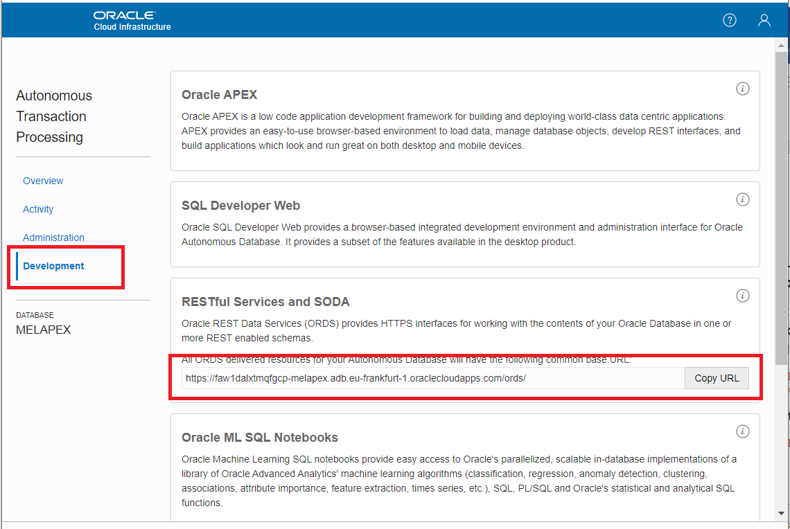

- Use this amended URL as Domain Name on the Safe Domains page.

- For this lab, tick all the boxes for your domain, in a production situation you should deselect any permissions that are not required. The changes on this page are automatically saved, so use the back arrow to exit this screen.


- Open APEX. If you have don't have the direct link, go to the Service Console of the database, then Development, then APEX.

  
  
  
  
  - Login to the workspace that we created earlier.
  
  Workspace name: WORKSHOPATP, User name: WORKSHOPATP, use the password that you entered when you created the workspace.
  
  

  - Edit the Time and Labour application
  
  - Edit the page named "Customer Form".
  
  - Add the region where the OAC content will be rendered. Add a new Region.
  
    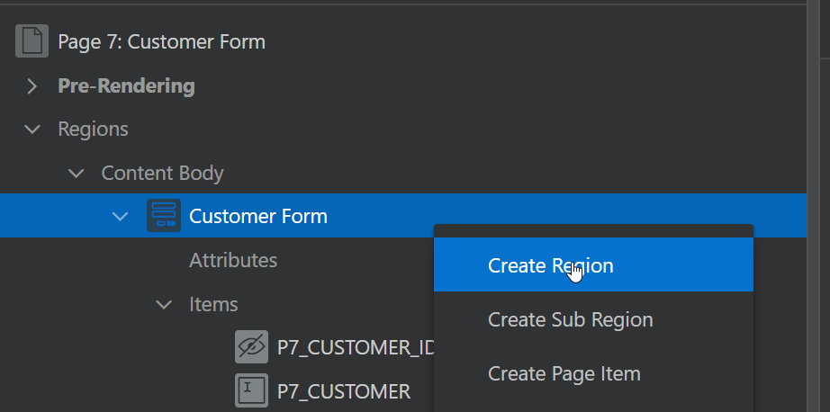
    
    Name it "OAC Region" of type "Static Content".
    
    And set its Source to:
    
    ```
    <div style="height: 600px; width: 100%;">
    
    <oracle-dv project-path="{{projectPath}}" filters="{{filters}}">
    </oracle-dv>
    
    </div>
    ```
    
    The result should look like this:
    
  
  - On the top level of the page (named "Page 7: Customer Form"), in the property JavaScript File URLs, add the HTML that you found in Developer - Embed - Embedding Script To Include. The URL will be specific for your environment.
    Change the embeddingMode to "standalone". 
    
    ```
    https://workshopatp-odca.analytics.ocp.oraclecloud.com/dv/ui/api/v1/plugins/embedding/standalone/embedding.js
    ```

    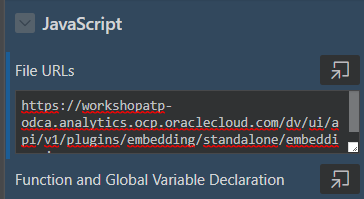
    
  - On the top level of the page, add the following under JavaScript "Execute when Page Loads". First replace "youremail@youdomain.com" with the email address that you use to login to Oracle Cloud (and OAC).
    You see the code to create the Deep Link by filtering on the in-context Customer.
  
    ```
    requirejs(['knockout', 'ojs/ojcore', 'ojs/ojknockout', 'ojs/ojcomposite', 'jet-composites/oracle-dv/loader'], function(ko) {
       function MyProject() {
          var idFilter = document.getElementsByName("P7_CUSTOMER")[0].value;
          var self = this;
          self.projectPath =  ko.observable("/users/youremail@yourdomain.com/Labour");
          self.filters = ko.observableArray([{
             "sColFormula": "XSA('youremail@yourdomain.com'.'DEM_PROJECT_HOUR').\"Columns\".\"CUSTOMER\"",
             "sColName": "Customer Label",
             "sOperator": "in", /* One of in, notIn, between, less, lessOrEqual, greater, greaterOrequal */
             "isNumericCol": false,
             "bIsDoubleColumn": false,
             "aCodeValues": [],
             "aDisplayValues": [idFilter]
          }]);
       }
       ko.applyBindings(MyProject);
    });
    ```

  

- Test the result. Go back to the application page overview, and run the page "Customer Report".
  
  
  Click on the Edit icon for one of the customers.
  
  You will now see the OAC Data Visualization project that we created earlier, filtered by the Customer that's in context of the APEX application.
  
  
- This is a simplified example, and it can be extended by working on the aspects of SSO and/or data visibility, depending on what's required.

# Conclusion

  => You've experienced how an end user can answer their own questions by combining data from the APEX application with external data.

  => You've learned how to integrate a DV project in an APEX application including deep linking.

# Follow-up questions


[jeroen.kloosterman@oracle.com](mailto:jeroen.kloosterman@oracle.com)


<!--
Working configuration

File URL
https://workshopatp-odca.analytics.ocp.oraclecloud.com/dv/ui/api/v1/plugins/embedding/standalone/embedding.js


requirejs(['knockout', 'ojs/ojcore', 'ojs/ojknockout', 'ojs/ojcomposite', 'jet-composites/oracle-dv/loader'], function(ko) {
   function MyProject() {
      var idFilter = document.getElementsByName("P7_CUSTOMER")[0].value;
      var self = this;
      self.projectPath =  ko.observable("/users/jeroen.kloosterman@oracle.com/Labour");
      self.filters = ko.observableArray([{
         "sColFormula": "XSA('jeroen.kloosterman@oracle.com'.'DEM_PROJECT_HOUR').\"Columns\".\"CUSTOMER\"",
         "sColName": "Customer Label",
         "sOperator": "in", /* One of in, notIn, between, less, lessOrEqual, greater, greaterOrequal */
         "isNumericCol": false,
         "bIsDoubleColumn": false,
         "aCodeValues": [],
         "aDisplayValues": [idFilter]
      }]);
   }
   ko.applyBindings(MyProject);
});
-->
