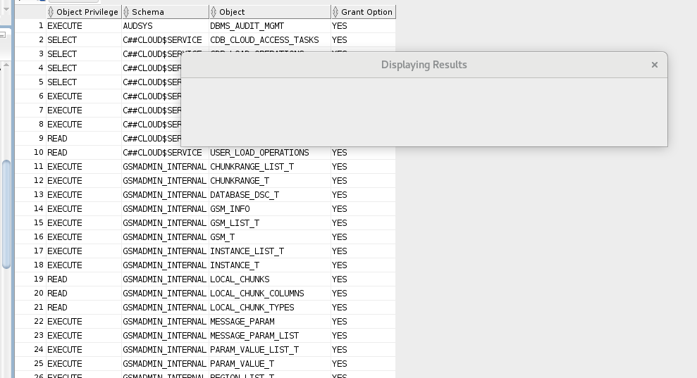
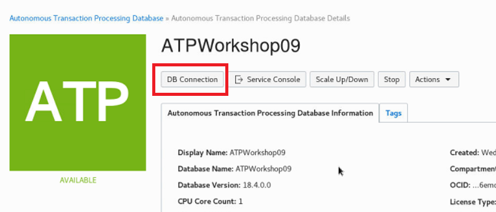
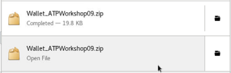

# Instructors Guide # 

This is a hybrid workshop to showcase the ATP database alongside Kubernetes and other developer specific features. The environment can be used to showcase the DBA features, but this is not integrated into the GIT markdown language. 

## What you have received ##

You will have received access to an OraDocs folder. 

In there you have

- The list of Lab VMs and their VNC connection information.
- Specific connection and auth token information for the tenancy.
- A pdf of the DBA Labs (only if needed). This tenancy is provided for cloud native activities and should not be used to showcase purely DBA features.

## Troubleshooting Section 1 ##

### SQL Developer Blank Dialog Boxes ###

 

​                                                  

 

Seen intermittently on the V4 of the VM image. No known fix or cause, only workaround is to restart  SQL Developer

 

### VNC on Macs

#### Using the built in VNC viewer ####

This requires you to specify the full port number not just the desktop number e.g. :5901 rather than :1

#### VNC Sessions Terminating on Macs ####

Observed on first run of the lab in Brussels. Not able to reproduce as do not have Apple computers. Seems to be a keepalive/timeout problem. You can start a new terminal session in the VNC and run 'top' in it and leave it running and this seems to keep the session 'busy' enough to not disconnect.

### Part 1. Connecting to the Oracle Cloud ###

No troubleshooting steps recorded for this section.

### Part 2 Securely Connecting to ATP ###

#### Wallet names ####

If a customer downloads the wallet from the DB connection link on the console page it currently downloads with a slightly different name

                                                 

 

 'Wallet_<dbname>.zip' rather than 'wallet_<dbname>.zip'

 

   

 

This means some of the copy and unzip commands will not work pasted from the guide.

 

#### Services ####

**Can you create a new service?** Nope! Admin does not have access to dbms_service package (or srvctl or lsnrctl)

 

### Secure access to your Autonomous Database using Access Control Lists ###

#### Can still connect despite setting the address to 192.168.28.1 ####

 

This usually indicates that their SQL Developer session is connecting to the wrong DB Service.

 

Verify the 'admin_high' configuration by right clicking on the connection name and selecting 'Properties'

   

 

Usually what has happened is they have not selected their DB in the Service window, and just taken the first on the list. The wallet tnsnames.ora includes ALL autonomous DB in the tenancy, not just theirs.

 

You can also check what DB they are connected to in SQL Developer

 

`Select name from v$pdbs;`

 

The returned name will be of the format

 

<SOME RANDOM STRING>_<THEIR DB NAME>

 

E.g. 

`NAME`                                                                                                                            

`\---------------------------------------------------------------------`

`FAW1DALXTMQFGCP_MELATPTRAIN01`

 

#### Cannot connect to the database despite setting the ACL to the VM's public IP. ####

 

Check they are using the correct IP address. This is the one from the Lab handover sheet under the heading 'VNC Connection' without the ':1' desktop number.

 

If they have set the ACL IP address to  something like 10.0.X.X they have taken the private IP from VM operating system level.

 

Worst case, you can delete the 'bad' ACL completely by clicking the 'x' next to the entry and selecting 'Update'

 

 

