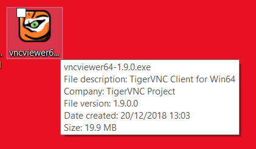
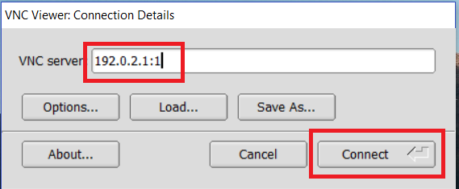
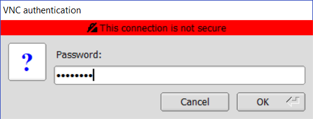
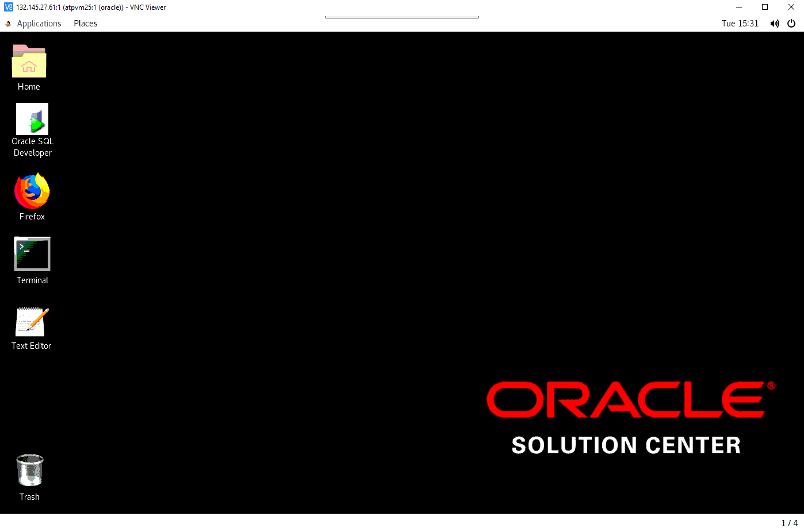
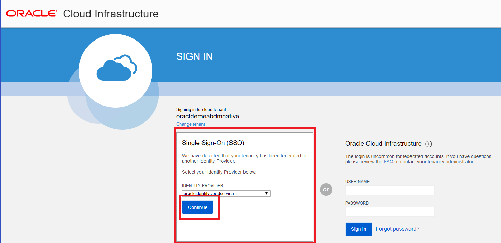
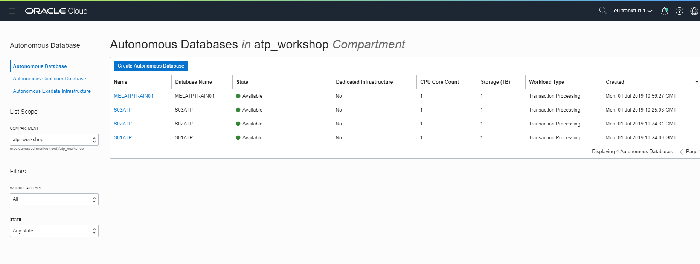
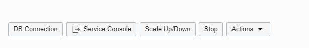

 

# Part 1 . Connecting to the Oracle Cloud #

**Objectives:**

- Learn how to login to the Oracle Cloud Console
- Locate your ATP instance.

## Connecting to your Lab Virtual Machine

To reduce the amount of software that needs to be installed on your local machine we have prepared a Linux virtual machine to act as your desktop.

 

Start TigerVNC viewer (or your choice of VNC viewer) by double clicking on the icon on your local desktop.

 

Enter connection information provided by your lab leader and select **Connect**. You will use a different IP address than the example in the screenshot below.

 

Enter the supplied password and hit OK  

 

The VNC session will open, and an Oracle Linux desktop session will be displayed.

 

## Signing in to the OCI Console ##

Start Firefox on your Lab VM by double clicking on the Firefox Logo.

 

Go to the [OCI console](https://console.eu-frankfurt-1.oraclecloud.com).  https://console.eu-frankfurt-1.oraclecloud.com For this lab we are using the Frankfurt region, even though other regions may be geographically closer as this is where our tenancy has capacity to support the workshop. 

Enter a cloud tenancy of "**oractdemeabdmnative**" and click continue.   

On the left-hand section of the page under the title “Single Sign-On” press the ‘**Continue’** button. 

 

Enter your username and password. Click “**Sign In**”.

  

This will bring you to the console home page. 

 

Verify that your region is set to eu-frankfurt-1 on the top right hand side of your screen, if not, use the drop down list to select ‘eu-frankfurt-1’

 

   

 

## Locating your ATP Instance ##

As part of the preparation for this lab, ATP instances have been pre-created. Your lab leader will have demonstrated a provisioning process live and the process is documented using screenshots in   [Appendix A](./LabGuideOSCAppendixA.md)

Click on the **MENU** link at the top left of the page. 

 

This will produce a drop-down menu, where you should select “**Autonomous Transaction Processing”**

   

 

This will take you to the management console page for ATP in the root compartment of the tenancy. There should be 'No Items' displayed. If there is a red warning icon "**Forbidden**", this  indicates that the Policies within the tenancy does not allow your user to view ATP Instances in the root compartment, and it is not an error or problem.

 

 

To locate your ATP instance in this tenancy you need to select a compartment.

 

Click on the pulldown menu marked **Compartment**. We will be using the **atp_workshop** compartment. Please select this from the drop down list

 

   

 

*Note – Your list of compartments may be different to the one shown above. In these lab notes we will use the compartment called atp_workshop in all the screenshots/ examples. **Your compartment may be different.***

 

The main page will now change to show the list of ATP instances within your compartment, as shown below:

*Note - this lab uses the same tenancy and compartment for all lab attendees. You will see ATP instances listed on this page which have already been provisioned in preparation for this lab.*

   

 

*Note: the list of instances is sorted by provisioning date, not by name. Refer to your lab information sheet to check which ATP instance has been assigned to you for this lab.*

 

Click on the name of your ATP instance from the list of instances. You may have to scroll down to locate it in the list.

 

   

 

This will display more information about your instance and you should notice the various menu buttons that help you manage your new instance .

   

 

A summary of your instance lifecycle status is shown in the large box on the left.

 

Additional summary information about your instance is displayed, including the workload type. You can also see the Lifecycle Status reported in this region.

Return to the main page which list all your ATP instances by clicking on the Autonomous Database link at the top of the page:

 

   

 

 

[Return to the Lab Introduction Page](readme.md)

