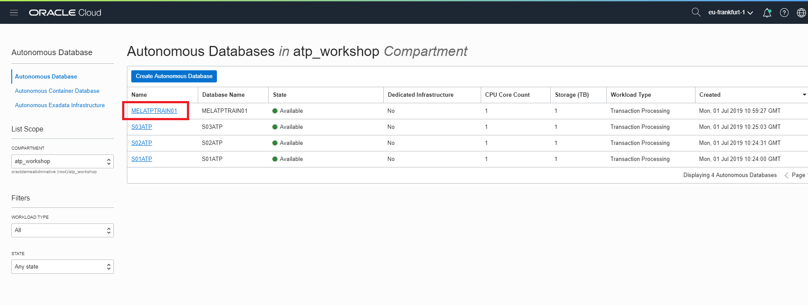
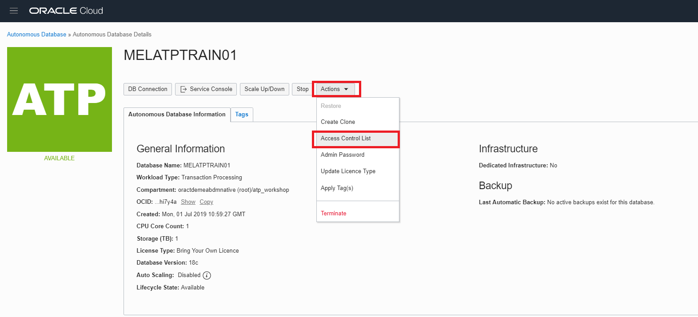
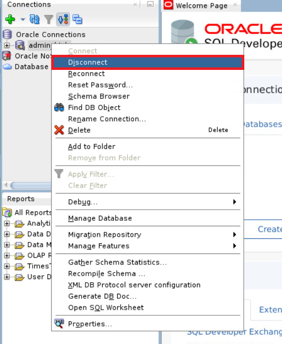
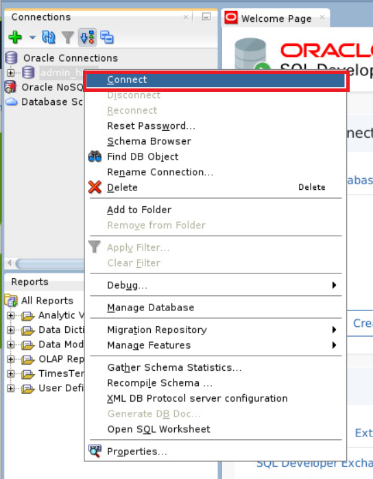
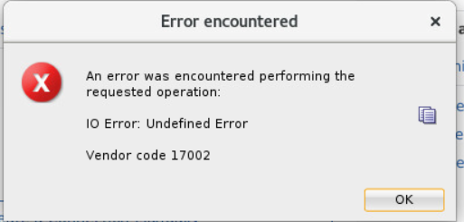
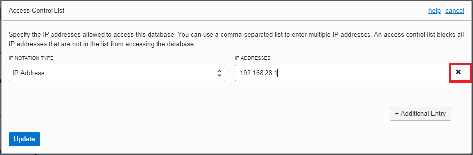
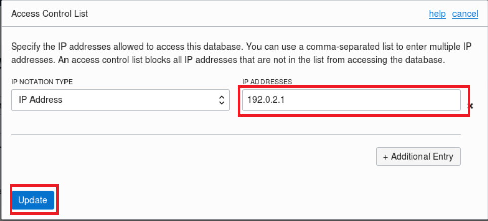
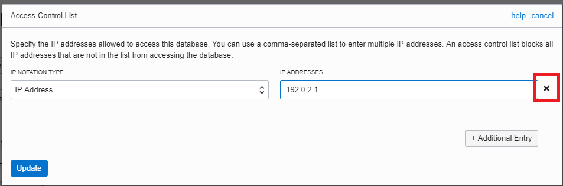
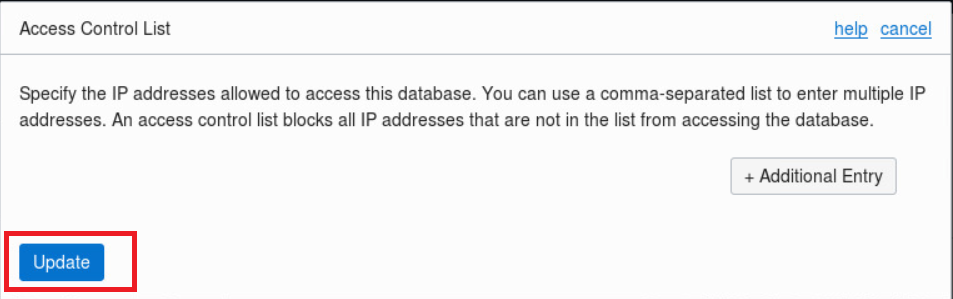

# Part 2.  Securely Connecting to Autonomous Transaction Processing #

**Objectives:**

•                Learn about access lists (ACL's) to further secure access to your database

## Secure access to your Autonomous Database using Access Control Lists ##

An Access Control List (ACL) provides additional protection for your Autonomous Database by allowing only the IP addresses in the list to connect to the database.

 

When you provision a new Autonomous Database, it does not have an initial ACL. You can use the Oracle Cloud Infrastructure Console, API, or CLI to create an ACL for the database by adding a minimum of one entry to the list. An entry can be a comma-separated list of CIDR blocks or public IP addresses. You can modify the list at any time. Setting the ACL for the Autonomous Database does not block administration activities via the Service Console or the Oracle Cloud Infrastructure Console. Removing all entries from the list makes the database accessible to all clients with the applicable credentials.

 

In this exercise you will:

·       Create an ACL that will block your access to your Autonomous Database.

·       Alter this ACL to only allow your lab VM access to your Autonomous Database.

It is important to complete this exercise successfully to allow subsequent labs to complete.

 

 

#### Creating your initial ACL ####

 

Navigate back to the **Autonomous Transaction Processing** page in the lab compartment.

 

Click on the name of your database to open the instance details screen.

 

   

 

In the **Actions** drop down select **"Access Control List"**

 

In the pop up box enter the IP Address **192.168.28.1** and select **"Update".** This is a non-routable IP address that is not in use in the lab environment. Once you set an ACL only new connections from IP addresses that match the ACL will be allowed to connect.

 

   

 

The Lifecycle status will change to **"Updating".**

 

​    

Wait until the Lifecycle status is **"Available"**

 

   

 

Return to your SQL Developer window. Select your **"admin_high"** connection, right click to bring up the menu and select "**Disconnect".** 

 

   

 

Connect to your database again. Select your **"admin_high"** connection, right click to bring up the menu and select "**Connect".** 

 

   

 

 

 

The connection to the database should fail with **"IO Error: Undefined Error"**

 

   

 

*Note – If your connection to the database succeeds, this usually means that there is a problem with the definition of your admin_high connection and the 'Service Name' was not set to your database.*

 

#### Correcting the ACL to allow connections ####

 

To ensure Return to your Firefox browser and navigate back to the **Autonomous Transaction Processing** page in the lab compartment.

 

Click on the name of your database to open the instance details screen.

 

   

In the **Actions** drop down select **"Access Control List"**

 

   

 

In the pop up box use the small x next to the IP address to delete the existing entry.

   

 

Select the **"Additional Entry"** button to create a new ACL entry.

 

   

Enter the IP Address of your Lab Virtual Machine. This is the address you used to connect using the VNC viewer, without the ':1' on the end.  Each Virtual Machine has its own IP address.

 

For example: if your VNC connection was to 192.0.2.1:1 the IP address you enter will be 192.0.2.1.

 

   

 

Select **"Update".** 

 

The Lifecycle status will change to **"Updating".**

 

​    

Wait until the Lifecycle status is **"Available"**

 

   

 

Return to your SQL Developer window.  Connect to your database again. Select your **"admin_high"** connection, right click to bring up the menu and select "**Connect".** 

 

   

 

The connection should succeed. Test this by running a simple SQL query in SQL Worksheet.

 

In the SQL Worksheet enter the following SQL:

 

`select country_region, count(country_name) from sh.countries group by country_region;`

 

and press the ‘Run Script’ button or press F5. 

   

*Note – If your connection to the database still fails, verify that the IP address that you have specified for your ACL is correct.*

 

#### Remove all the ACL entries

 

Return to your Firefox browser and navigate back to the **Autonomous Transaction Processing** page in the lab compartment.

 

Click on the name of your database to open the instance details screen.

 

   

 

In the **Actions** drop down select **"Access Control List"**

 

   

 

In the pop up box use the small x next to the IP address to delete the existing entry.

   

The pop-up will now have no IP Addresses or CIDR blocks specified.  Select "Update" to save this change.

The Lifecycle status will change to **"Updating".**

 

​    

Wait until the Lifecycle status is **"Available"**

 

   

 

 

Once you have successfully removed all the ACL entries you have completed Part 2. [Return to the Lab Introduction Page](readme.md)

 

 

 

 

 

 

 

 
