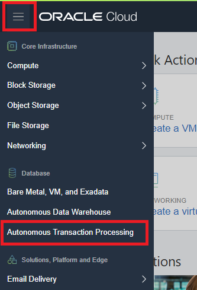
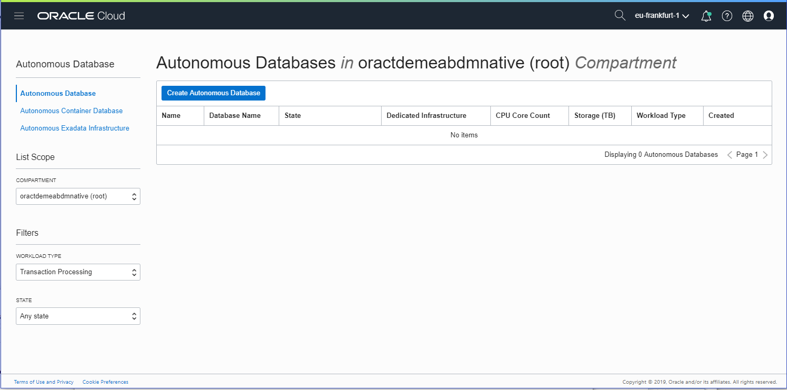
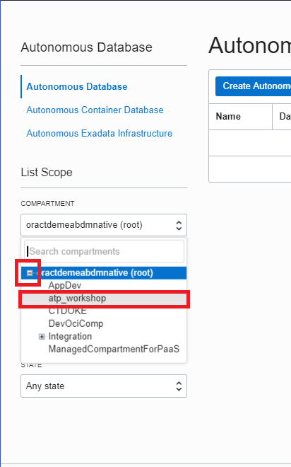
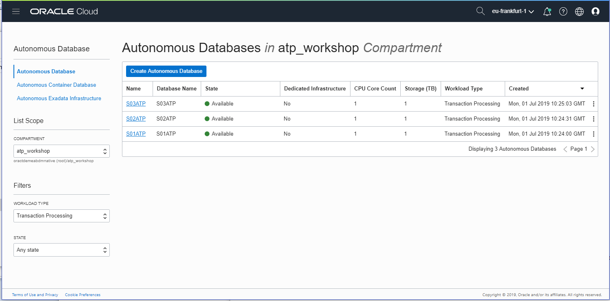
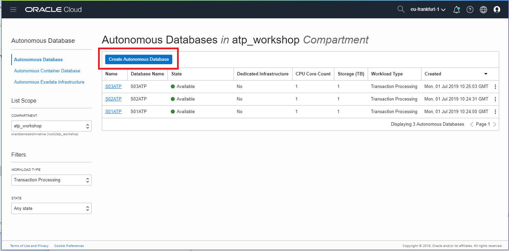
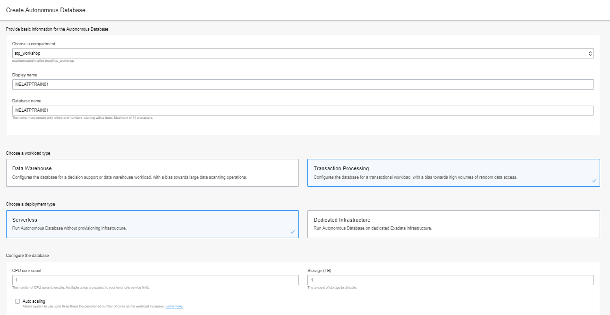
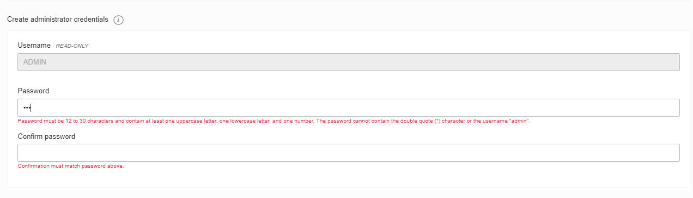
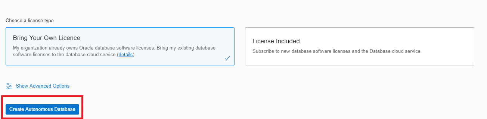
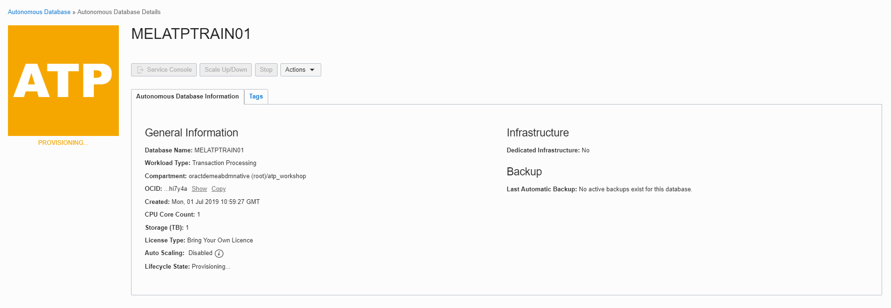
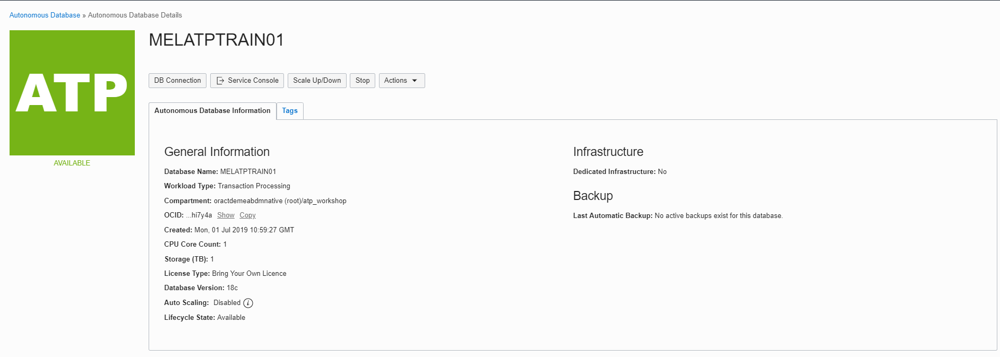

# Appendix A – Provisioning Process Walkthrough #

This is a walkthrough of the process used to create an ATP instance. This was demonstrated live during your lab session.

## Creating your Autonomous Transaction Processing Database ##

Click on the **MENU** link at the top left of the page. 

 

This will produce a drop-down menu, where you should select “**Autonomous Transaction Processing”**

​                                               

This will take you to the management console page for ATP in the root compartment of the tenancy. There should be 'No Items' displayed. If there is a red warning icon "**Forbidden**", this  indicates that the Policies within the tenancy does not allow your user to view ATP Instances in the root compartment, and it is not an error or problem.

 

To begin the process of creating your ATP instance in this tenancy you need to select a compartment. 

 

Click on the pulldown menu marked **Compartment**. Expand the menu under the root compartment by clicking the **‘+’.** Select the compartment that is given by the instructor. It may differ from ***'atp_workshop'*** shown below.

 

   

 

*Note – Your list of compartments may be different to the one shown above.*

 

The main page will now change to show the list of ATP instances within your compartment, as shown below:

 

*Note: this lab uses the same tenancy and compartment for all lab attendees, therefore, it is possible that you may see ATP instances listed on this page which have already been created by other users attending this lab.*

 

 

To create a new instance, click the blue "**Create Autonomous Database**" button.

 

   

 

Enter the required information and click the **"Create Autonomous Database**" button at the bottom of the form. For the purposes of this lab, use the information below:

 

**Compartment:** Verify that the correct compartment is selected. You will not be able to create instances outside this compartment due to Identity Management policies.

**Display Name:** Enter the display name for your ATP Instance. (Hint- use your username so you can identify your instance more easily) 

**Database Name:** Enter any database name you choose that fits the requirements for ATP. The database name must consist of letters and numbers only, starting with a letter. The maximum length is 14 characters. (Hint- use your username so you can identify your instance more easily)

**Workload Type**: Autonomous Transaction Processing

**Deployment Type**: Serverless

**CPU Count:** 1

**Storage Capacity (TB):** 1

**Auto Scaling**: Not Checked

**Administrator Password:** Enter any password you wish to use noting the specific requirements imposed by ATP. A suggested password for this lab is ATPwelcome-1234

When you enter the administrator password, note the specific requirements imposed by ATP:

​    

 

Select the appropriate license type for your organization. 

When you have completed the required fields, scroll down and click on the blue **Create Autonomous Database** button at the bottom of the form:

 

 

   

The Database Details page will show the message "Provisioning"  under the lifecycle status page. The Database Details page will display more information about your instance and you should notice the various menu buttons that help you manage your new instance – because the instance is currently being provisioned all the management buttons are grayed out.

 

   

 

A summary of your instance status is shown in the large box on the left. In this example, the color is amber and the status is **Provisioning**

 

   

 

 

After a short while the status will change to **Available** and the “ATP” box will change color to green:

 

   

Once the Lifecycle Status is **Available**, additional summary information about your instance is populated, including workload type. You can also see the Lifecycle Status reported in this region.

 

   

 

Congratulations you have created your first ATP instance!

[Return to the Lab Introduction Page](readme.md)
