# Adding Analytics to your APEX application

## Introduction
Oracle Analytics Cloud provides the industry’s most comprehensive cloud analytics in a single unified platform, including everything from self-service visualization and powerful inline data preparation to enterprise reporting, advanced analytics, and self-learning analytics that deliver proactive insights.

You will expand an existing application to add Oracle Analytics functionality. Imagine that the end user of your application has questions about the billing data. You could provide them with some fixed, prebuilt charts built into the APEX application, however that would not allow the end user to create entirely new analysis. You are going to use an Oracle Analytics Cloud instance to give our end users a self-service approach to analyzing the data.

### Objectives
- Create a connection from Oracle Analytics Cloud to Autonomous Database.
- Create Visualizations to analyze the data.
- Add Analytics functionality to your application.

### Prerequisites

* An Oracle Cloud paid account or free trial. To sign up for a trial account with $300 in credits for 30 days, click [here](http://oracle.com/cloud/free).
* An Oracle Autonomous Transaction Process instance
* An APEX Workspace
* *Please note:* Your free trial must have credits remaining for this lab.
* The user you use to login must be a federated user (prefixed with oraclecloudidentityservice)

## **STEP 1**: Review existing APEX application

Our starting point is an existing time entry application used by a fictional IT consulting company. It contains basic time and rates of their consultants.

1. First, click this link to [**download the application**](./files/f109.sql) that we will install.

  *If you are already logged into your APEX Workspace, skip to Step 4.*

2. Open APEX. If you have don't have the direct link, click **Tools**, then click **Open APEX** on the Oracle Application Express tile.

  

  

3. Login to the workspace that we created earlier. Workspace name: WORKSHOPATP, User name: WORKSHOPATP, use the password that you entered when you created the workspace.

  

4. Import the example APEX application. Click **App Builder**, then **Import**.

  

  

5. Click **Browse**, locate the `f109.sql` file and click **Next**.

  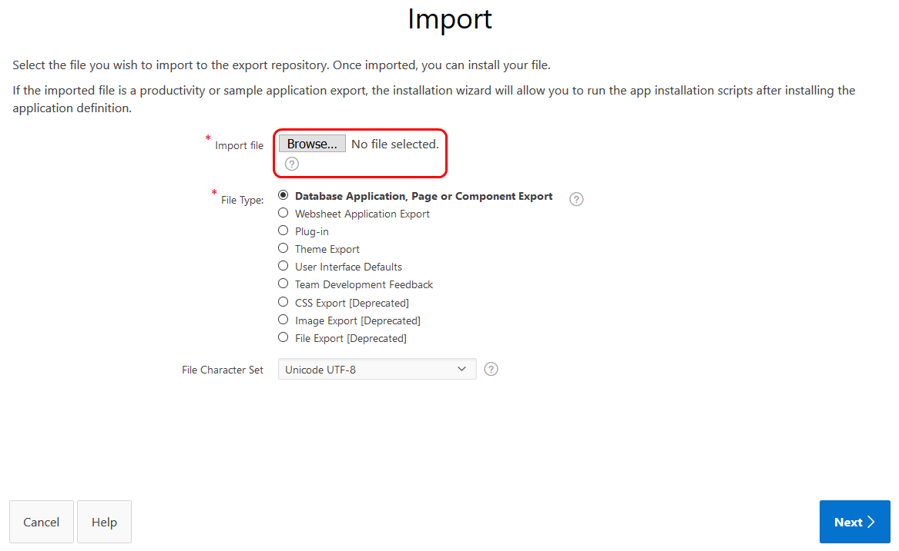

6. Keep the defaults and click **Next**. When you get to the Install Database Application screen, click **Install Application**.

  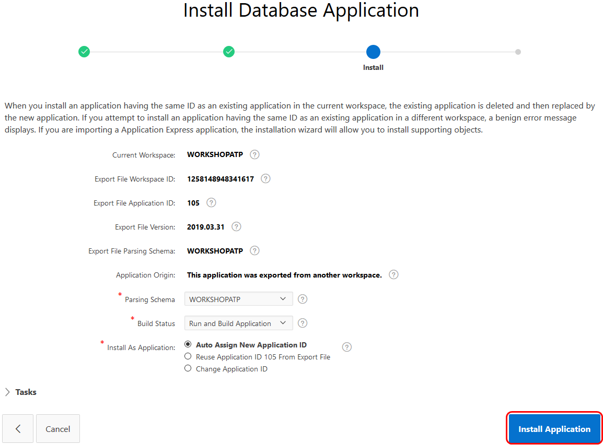

7. On the Install Application Screen, click **Next**, and on the next screen click **Install**.

  


## **STEP 2**: Review the APEX application

1. Open the existing application by click **Run Application**.

  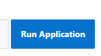

  Login using the password that you used when creating the workspace.

2. Click **Time Registrations**. Have a look at the Time Registrations screen. This shows a list of employees, customers and time entry.
  

3. Next, click **HOME** and have a look at the Customer Report screen.
  

  Later on in this workshop we will come back to the Customers page and embed an OAC Data Visualization into it.

## **STEP 3**: Create an Oracle Analytics Cloud (OAC) instance

Imagine that the end user of the application has analytical questions about the billing data. We could provide some default charts prebuilt in APEX, however, that would not allow the end user to create entirely new analysis. Instead, we are going to create an Oracle Analytics Cloud instance, and give our end users a self service approach to analytics.

1. In the main cloud console, click on the menu icon on the left.

  

2. Navigate to **Solutions and Platforms** -> **Analytics** -> **Analytics Cloud**.

  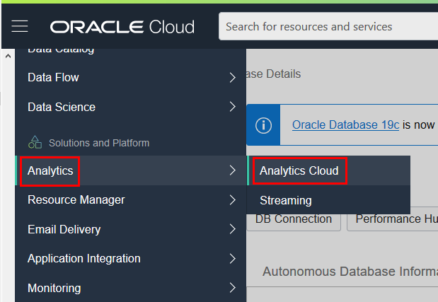

3. Click **Create Instance**.

  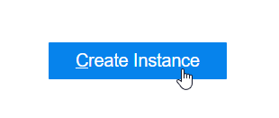

4. In the creation dialog, please choose the following values:

    - **Instance Name**: WORKSHOPATP
    - **License Type**: "Subscribe to a new Analytics Cloud software license and the Analytics Cloud." (You will use this service as part of the Oracle Cloud Free Tier account that you requested for this workshop)
    - **Feature Set**: "Enterprise Analytics" (important)
    - **Number of OCPUs**: "1 - Non Production"

  

5. Wait until the service has been created. This will take about 30 minutes.

## **STEP 4**: Create a connection from Oracle Analytics Cloud to our ATP database

For any SQL client to make a connection to ATP it requires a *wallet*. A wallet is a ZIP file that contains the connection information for the ATP instance. For example, a wallet can be used to connect a local SQL Developer client to ATP. In our case, we will use this same wallet mechanism to make a connection from OAC to ATP.

1. Go to the Service Console of your ATP instance and click **DBConnection**.

  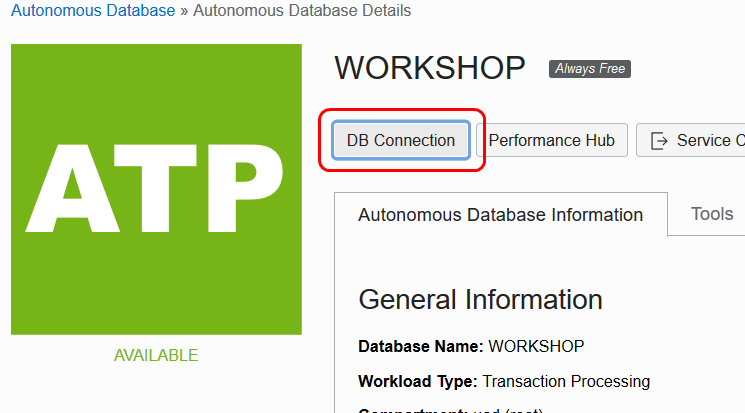

2. Click **Download Wallet**.

  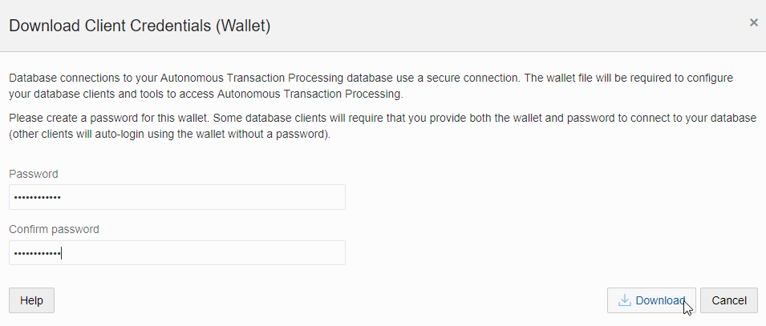

3. You'll be asked to provide a password. Please make a note of this. Click **Download**.

  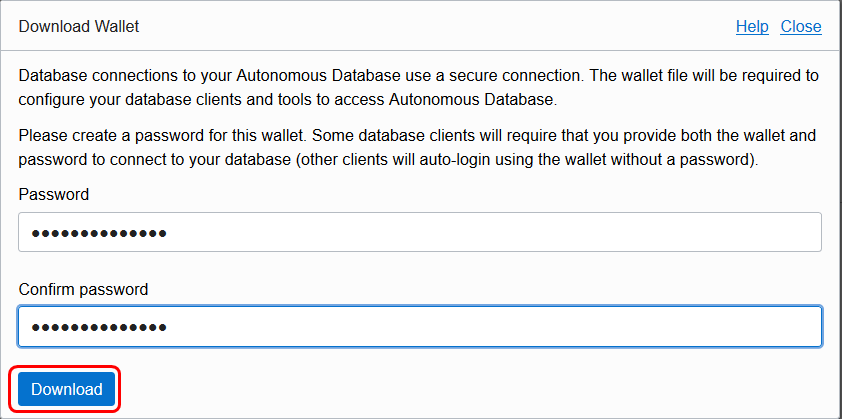

3. Save the wallet file (ZIP) locally and click **Close**.

4. Open your OAC. Remember you can reach it from the cloud console by going to **Solutions and Platforms** -> **Analytics** -> **Analytics Cloud**

  Then open the cloud analytics URL as follows:

  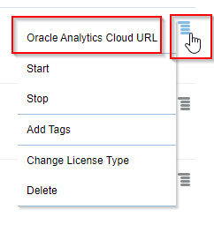

5. Click **Create**, then **Connection**.

  

6. Select **Oracle Autonomous Transaction Processing**.

  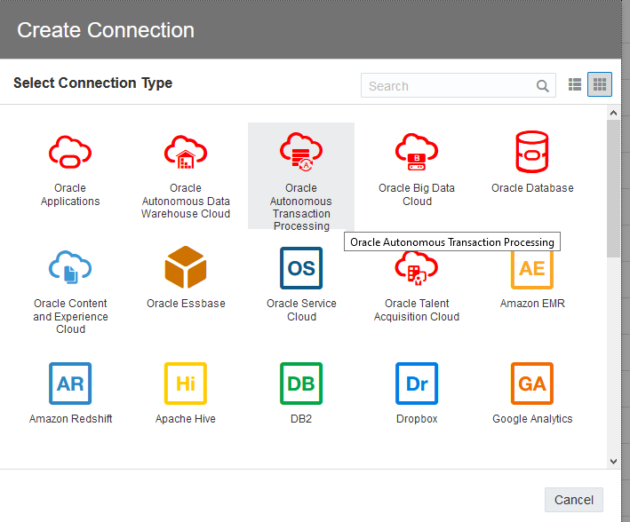

7. Configure the connection as follows and click **Save**:

    - **Connection Name**: WORKSHOPATP
    - **Client Credentials**: Upload the wallet file (the ZIP file) that you download earlier from ATP
    - **Service Name**: Choose the name of your database followed by the \_high suffix
    - **Username**: WORKSHOPATP
    - **Password**: The password that you used when you created the workspace at the beginning of the workshop

  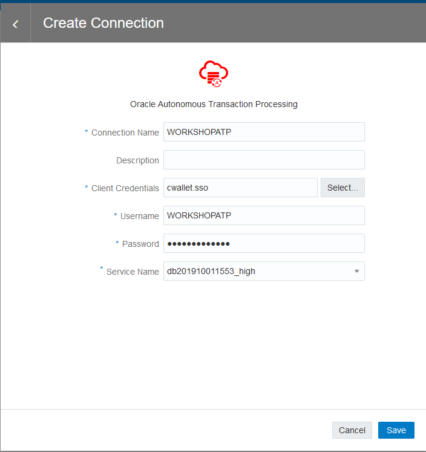

## **STEP 5**: Prepare the dataset

1. Click **Create**, select **Data Set**.

  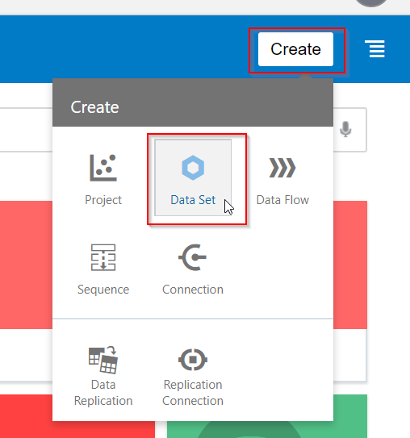

2. Select the connection to our schema.

  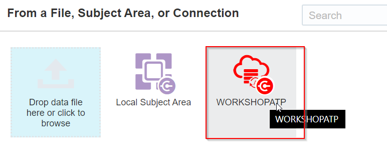

3. Select the WORKSHOPATP schema.

  

4. Select the `DEM_PROJECT_HOUR` table

  

5. Click **Add All** to select all columns, and then **Add** to create the Data Set.

  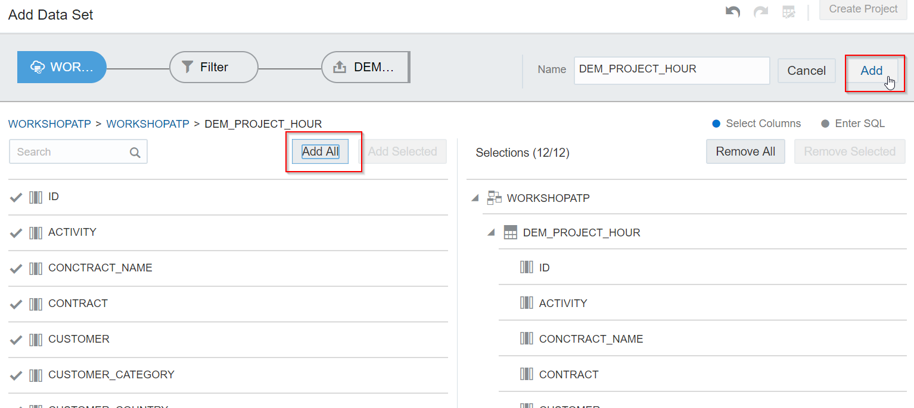

6. Make sure the ID column is used as an identifier by clicking it, then change the "Treat As" (left bottom of screen) setting to "Attribute".

  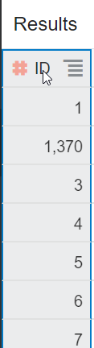

  

7. Create a new self service project by clicking **Create Project**.

  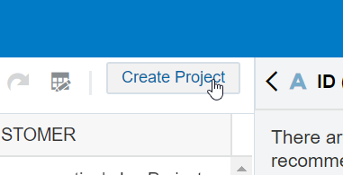

  Click **Apply Data Set** changes if needed.

  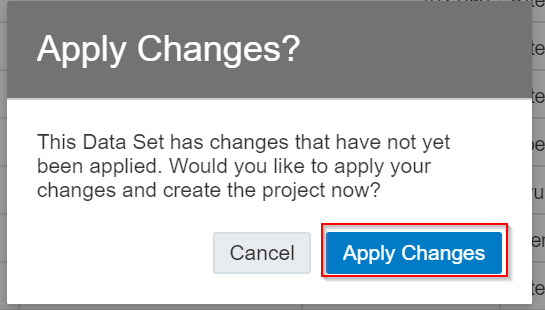

## **STEP 6**: Create Self Service analysis

The following is for you to experience how an end user can use OAC to create self service analytics on APEX application data.
Imagine we ask ourselves "Which employees work the most hours as a consultant and at which company"?

1. Click **Visualizations**.

  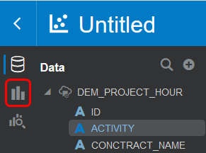

2. Drag **Stacked Bar** to the Visualizations pane.

  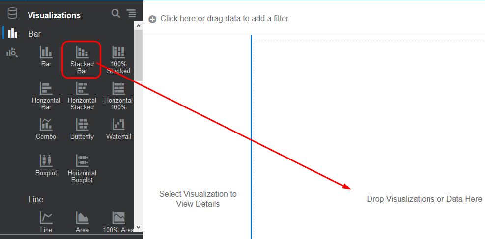

3. Click Data and drag `CUSTOMER` to Color, `NUMBER_OF_HOURS` to Values (Y-Axis), and `EMPLOYEE` to Category (X-axis).

  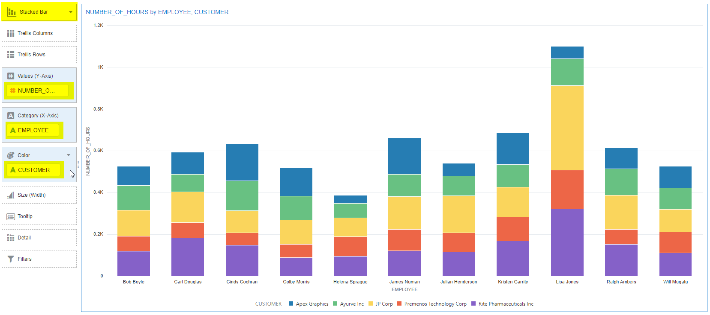

  Imagine we ask ourselves "Are the employees that work the most hours also the ones that earn most money for our company?"

4. Create a Revenue field. Right-click **My Calculations** and select **Add Calculation**.
  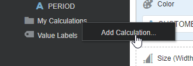

5. Drag the `NUMBER_OF_HOURS` and `HOURLY_RATE` fields into the formula space.
  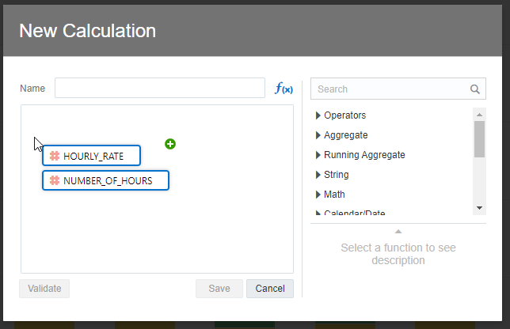

6. Create the following formula: `HOURLY_RATE * NUMBER_OF_HOURS` and name the new field `Revenue`. Click **Save**.
  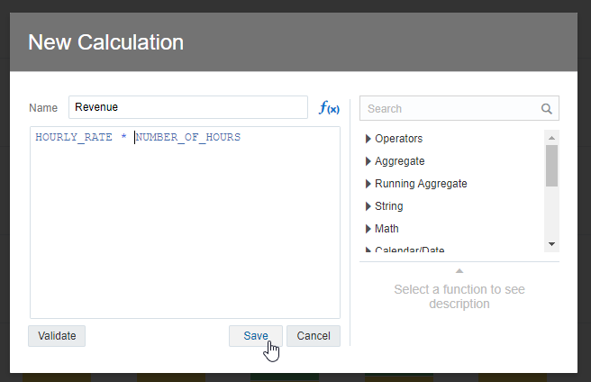

7. Now duplicate the original chart, by right selecting it, then click **Edit** and select **Duplicate Visualization**.
  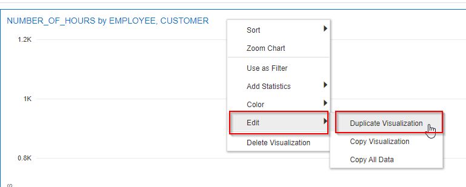

  The result is:
  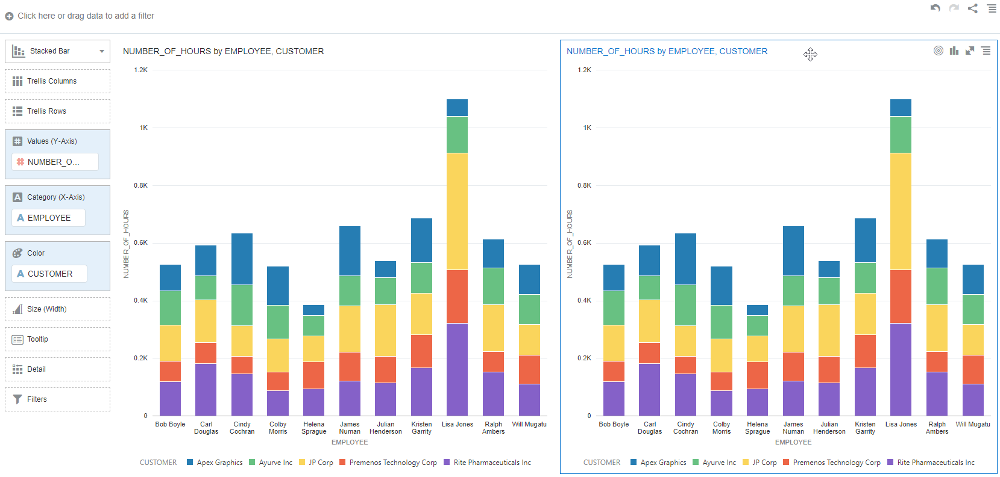

8. On the newly created chart, replace `NUMBER_OF_HOURS` with the new `Revenue` field. You can do this by a drag-and-drop of the `Revenue` field on `NUMBER_OF_HOURS`.
  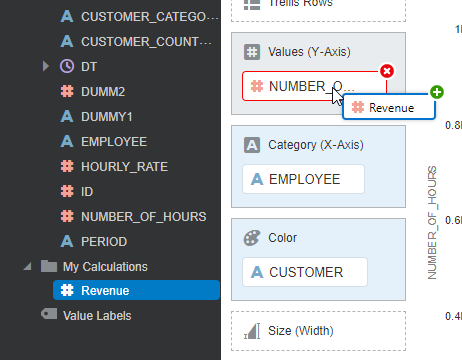

9. Finally, change the aggregation method of Revenue by selecting the new chart, then click **Revenue** and setting the "Aggregation Method" to "Sum" and "By" to "Id".

  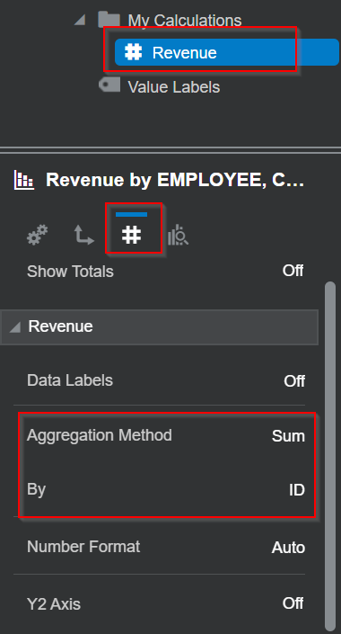

  The result is:
  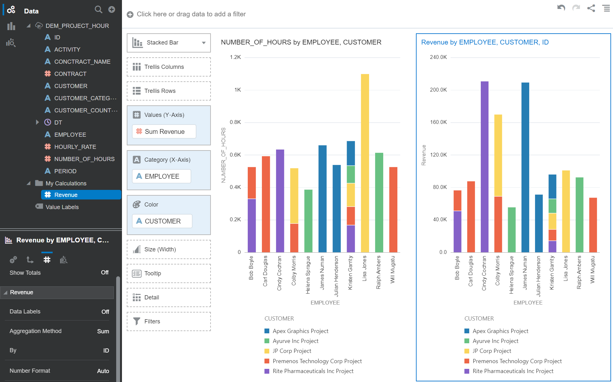

  What can we conclude?
    - Lisa Jones bills a lot of hours, but is not one of the highest earners for our company.
    - Other employees, such as Cindy Cochran, earn more for our company with less billable hours.

## **STEP 7**: Create a Scatter Plot

Imagine we have the question "Does a higher hourly rate also mean higher total earnings per employee"?

1. Click Add Canvas (at the bottom).

  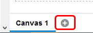

2. Drag a *Scatter* chart to the Visualizations pane and use `Sum Revenue` for the Y-Axis, `HOURLY_RATE` for the X-axis and `EMPLOYEE` for the Category.

3. For the `HOURLY_RATE`, set the Aggregation Method to "Average" and By to "Id". For the Revenue, set the Aggregation Method to "Sum" (Remove the By Id attribute.)

  The result should like as follows:
  

  What can we conclude?
    - There is a group of employees that work a relatively low amount of hours, but still they succeed in earning the highest amount for our company.

## **STEP 8**: Add Training History Data
Imagine we ask ourselves "What is the secret of these high earners? Does a particular training for communication of these employees have something to do with their high earnings?"

The training information is not stored in our APEX Time and Labour application. Instead, this data will be provided to the end user by Human Resources, by means of an Excel file.

1. Click this link to [**download the training file**](./files/traininghistory.xlsx).

2. Add the dataset by clicking the "+" icon in the top left.

  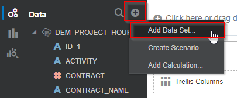

3. Click **Create Data Set**
  

4. Drag the training Excel file on top of the icon.
  

  You see that the file contains information on which employee has start/finished the training.

  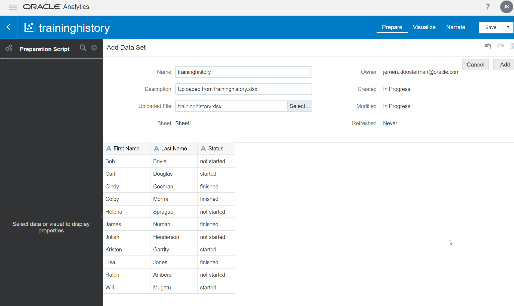

  To be able to link this new Data Set with our own, we need to link the employee names. However, our original Data Set (from the database) has the full name, including First and Last Name.
  Therefore we will create the same concatenation on the new training Data Set.

5. Right-click on **First Name** and select **Concatenate**.

  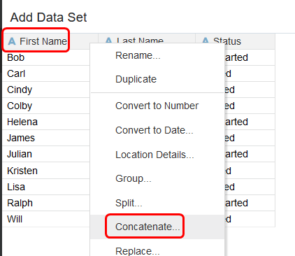

6. Rename the newly created column to "Trainee Name", click on **First Name** in the With section and select **Last Name**.
  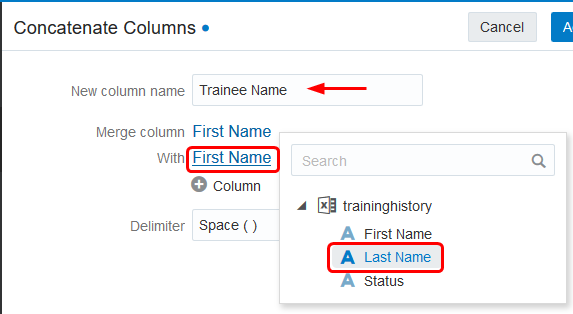

7. Click **Save**.

  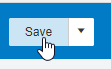

8. Apply the change to the Data Set.
  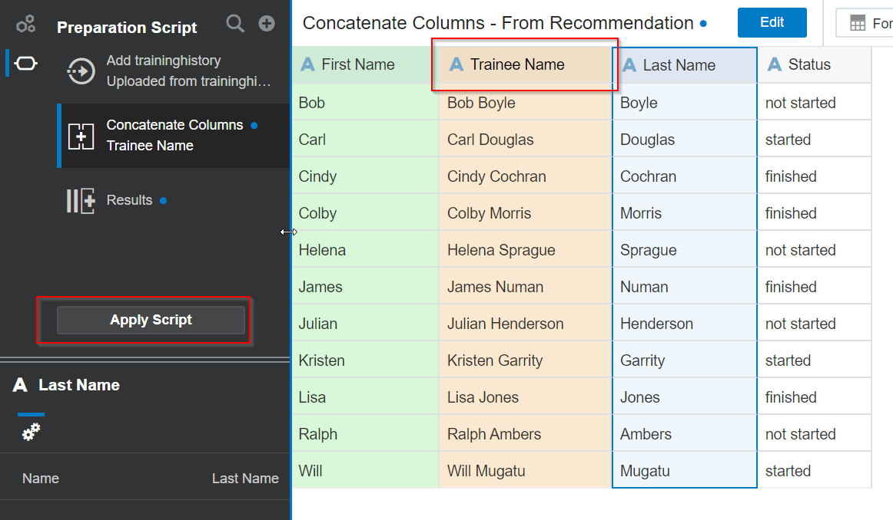

9. Now we will link the two Data Sets. Click **Data Diagram** in the bottom.
  

10. Create a new relationship by clicking on **0**.

  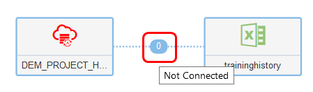

11. Click  **Add Another Match** and select `Trainee Name `from **traininghistory** and `EMPLOYEE` from **DEM\_PROJECT_HOUR** and click **OK**.
  

12. Click **Visualize** in the upper right.

13. Now add the training Status as the Shape of the Scatter chart. You can do this by dragging the Status field to the Shape of the Scatter chart.

  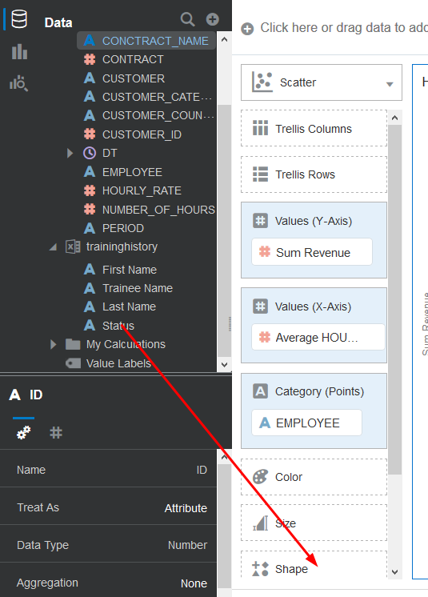

  This is the result:

  

  What can we conclude?
    - The highest earnest have all completed this particular training. It might be a good idea to let more employees participate in this training.

  You've seen how an end user can answer their own questions by combining data from the APEX application with external data.

12. Save the project as "Labour".

## **STEP 9**: Embed the OAC Data Visualization project into APEX

Our goal is to integrate the "Labour" DV project inside of our APEX application. The project should automatically filter using the context of the customer of the APEX screen.

1. Still in the OAC Data Visualization project, select the **Developer** option:

  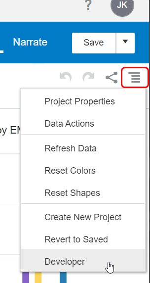

2. Click **Embed**.

3. Copy the HTML "Embedding Script To Include" and "Default" that you see here, as you will need them later. Click **OK**.

  

  For security reasons, you are not allowed to add external content to reports or embed your reports in other applications unless your administrator considers it safe to do so. Only administrators can add safe domains to the whitelist. Whitelisting allows or approves access to specific content.

4. Access the OAC console by selecting the menu button in the top-left of your page and then **Console.**
  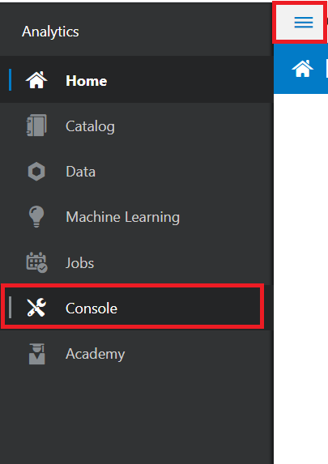

5. Select **Safe Domains**
  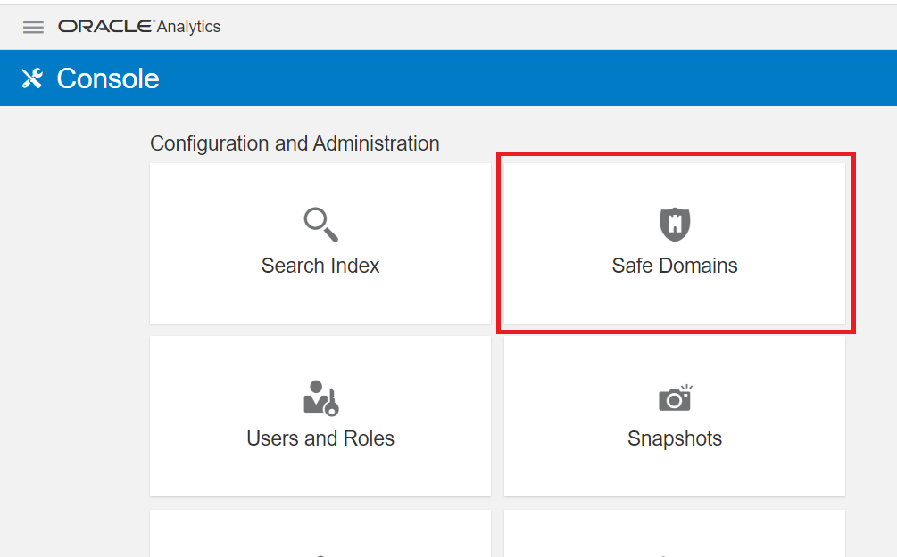

6. To locate the correct URL to add to this page, open a browser to the **Service Console** for your Autonomous Database.

  

7. Select the **Development** link in the left-hand menu. In the region **RESTful Services and SODA**  copy this link.  You need to remove the /ords at the end of the link before adding it to your list of Safe Domains.

    - For example: If your link is
    `https://faw1dalxtmqfgcp-melapex.adb.eu-frankfurt-1.oraclecloudapps.com/ords/`
    then the URL to whitelist will be
    `https://faw1dalxtmqfgcp-melapex.adb.eu-frankfurt-1.oraclecloudapps.com`

  

8. Use this amended URL as Domain Name on the Safe Domains page.

9. For this lab, tick all the boxes for your domain, in a production situation you should deselect any permissions that are not required. The changes on this page are automatically saved, so use the back arrow to exit this screen.

  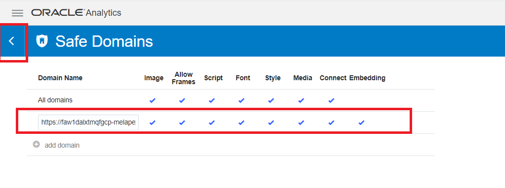

10. Open APEX. If you have don't have the direct link, click **Tools**, then click **Open APEX** on the Oracle Application Express tile.

  

  

11. Login to the workspace that we created earlier.

  Workspace name: WORKSHOPATP, User name: WORKSHOPATP, use the password that you entered when you created the workspace.

  

12. Edit the Time and Labour application

13. Edit the page named "Customer Form".

14. Add the region where the OAC content will be rendered. Add a new Region.

    

15. Name it "OAC Region" of type "Static Content".

  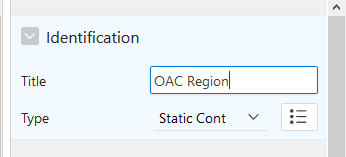

    And set its Source to:

    ```
    <copy>&ltdiv style="height: 600px; width: 100%;"&gt

    &ltoracle-dv project-path="{{projectPath}}" filters="{{filters}}"&gt
    &lt/oracle-dv&gt

    &lt/div&gt</copy>
    ```

    The result should look like this:
    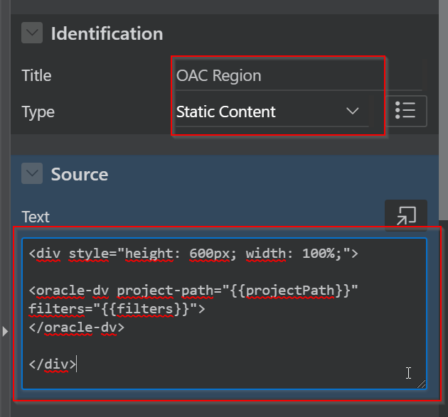

16. On the top level of the page (named "Page 7: Customer Form"), in the property JavaScript File URLs, add the HTML that you found in Developer - Embed - Embedding Script To Include. The URL will be specific for your environment.
    Change `<embeddingMode>` to `standalone`.


    

17. On the top level of the page, add the following under JavaScript "Execute when Page Loads". First replace "youremail@youdomain.com" with the email address that you use to login to Oracle Cloud (and OAC).
    You see the code to create the Deep Link by filtering on the in-context Customer.

    ```
    <copy>requirejs(['knockout', 'ojs/ojcore', 'ojs/ojknockout', 'ojs/ojcomposite', 'jet-composites/oracle-dv/loader'], function(ko) {
       function MyProject() {
          var idFilter = document.getElementsByName("P7_CUSTOMER")[0].value;
          var self = this;
          self.projectPath =  ko.observable("/users/youremail@yourdomain.com/Labour");
          self.filters = ko.observableArray([{
             "sColFormula": "XSA('youremail@yourdomain.com'.'DEM_PROJECT_HOUR').\"Columns\".\"CUSTOMER\"",
             "sColName": "Customer Label",
             "sOperator": "in", /* One of in, notIn, between, less, lessOrEqual, greater, greaterOrequal */
             "isNumericCol": false,
             "bIsDoubleColumn": false,
             "aCodeValues": [],
             "aDisplayValues": [idFilter]
          }]);
       }
       ko.applyBindings(MyProject);
    });</copy>
    ```

  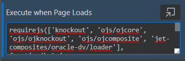

  Click **Save**.

18. Test the result. Go back to the application page overview, and run the page "Customer Report".
  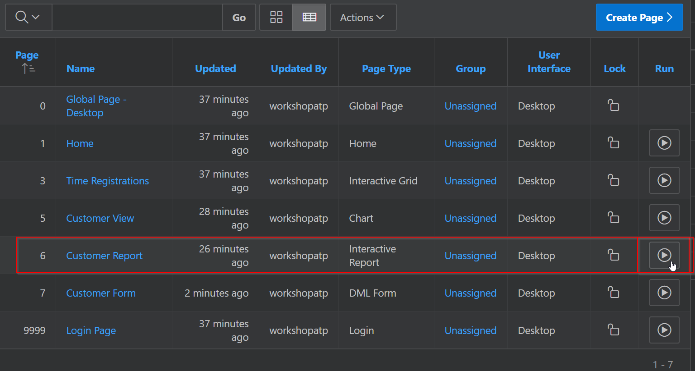

19. Click on the Edit icon for one of the customers. You will now see the OAC Data Visualization project that we created earlier, filtered by the Customer that's in context of the APEX application.

  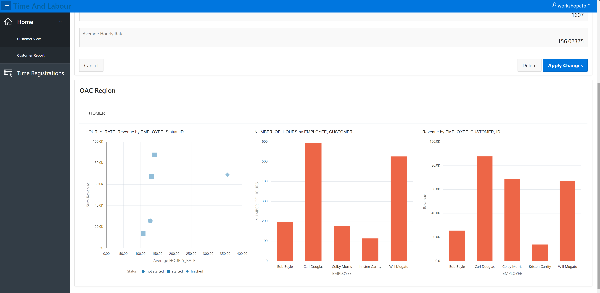

20. This is a simplified example, and it can be extended by working on the aspects of SSO and/or data visibility, depending on what's required.

## Conclusion

- You've experienced how an end user can answer their own questions by combining data from the APEX application with external data.
- You've learned how to integrate a DV project in an APEX application including deep linking.

## Acknowledgements
* **Author** - Juan Cabrera Eisman, Senior Technology Solution Engineer, Oracle Digital, Melanie Ashworth-March, Principal Sales Consultant, EMEA Oracle Solution Center
* **Last Updated By/Date** - Tom McGinn, Database Innovations Architect, Database Product Management, July 2020

See an issue?  Please open up a request [here](https://github.com/oracle/learning-library/issues).   Please include the workshop name and lab in your request.
