# Add Spatial to Your APEX application
## Introduction
In this lab we will extend an existing APEX application with geospatial functionality. Imagine a fictional use case where citizens that wish to fly a drone have to formally request this. The APEX application will be used by an institution to process these requests and decide whether the drone-flight is allowed.
A drone flight will be allowed when its location is not within an urban area.

Estimated Time: 60 minutes

### Objectives
- Understand how to geocode an address with APEX.
- Understand how to perform geospatial calculations by using Spatial SQL functions from within APEX.

### Prerequisites

* An Oracle Cloud paid account or free trial. To sign up for a trial account with $300 in credits for 30 days, click [here](http://oracle.com/cloud/free).
* An Oracle Autonomous Transaction Process instance
* An APEX Workspace

## **STEP 1**: Import the APEX application

Our starting point is an unfinished APEX application.

1. First, click this link to [**download the application**](files/f105.sql) that we will install.

  *If you are already logged into your APEX Workspace, skip to Step 4.*

2. Open APEX. If you have don't have the direct link, click **Tools**, then click **Open APEX** on the Oracle Application Express tile.

  

  

3. Login to the workspace that we created earlier. Workspace name: WORKSHOPATP, User name: WORKSHOPATP, use the password that you entered when you created the workspace.

  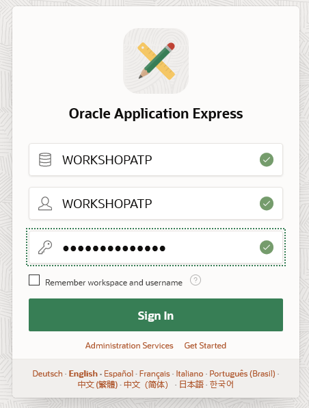

4. Import the example APEX application. Click **App Builder**, then **Import**.

  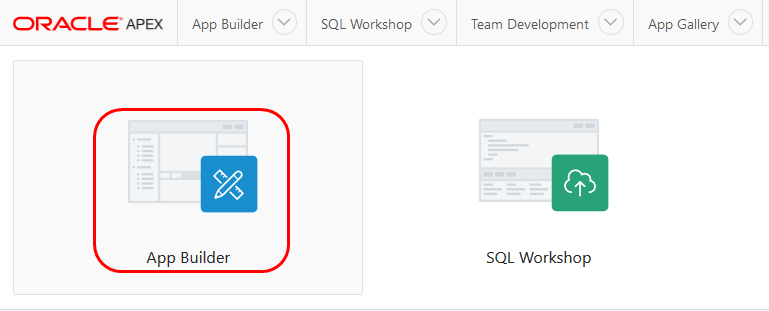

  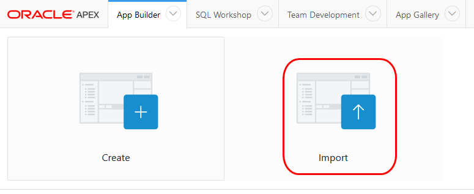

5. Click **Choose File** and locate the `f105.sql` file.

  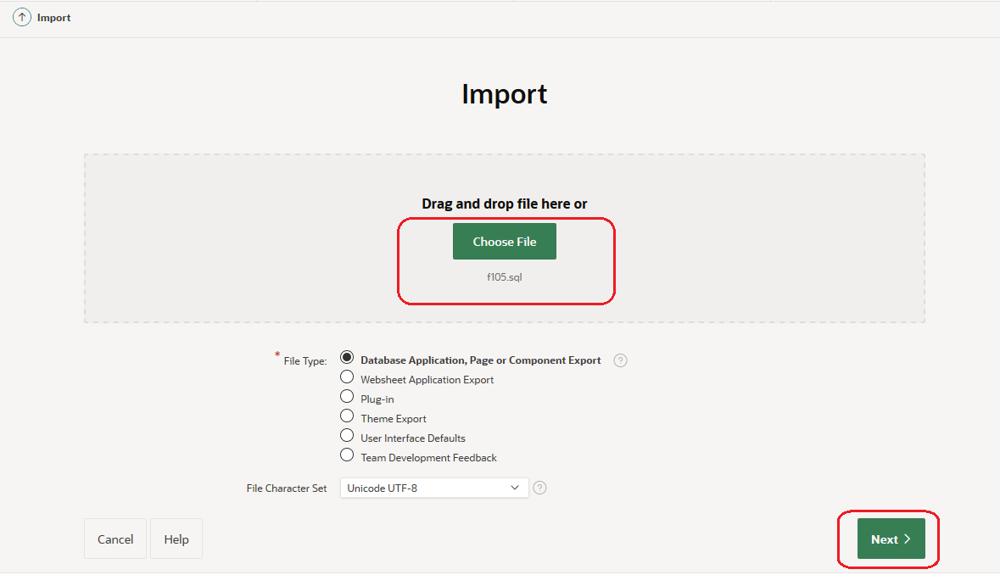

6. Click **Next**, and keep the defaults. When you get to the Install Database Application screen, click **Install Application**.

  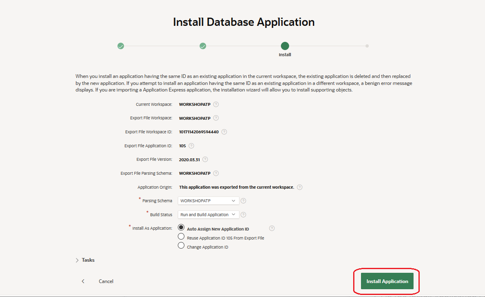

7. On the *Install Application - Supporting Objects* Screen, click **Next**, and on the next screen  *Install Application - Confirmation* click **Install**.

  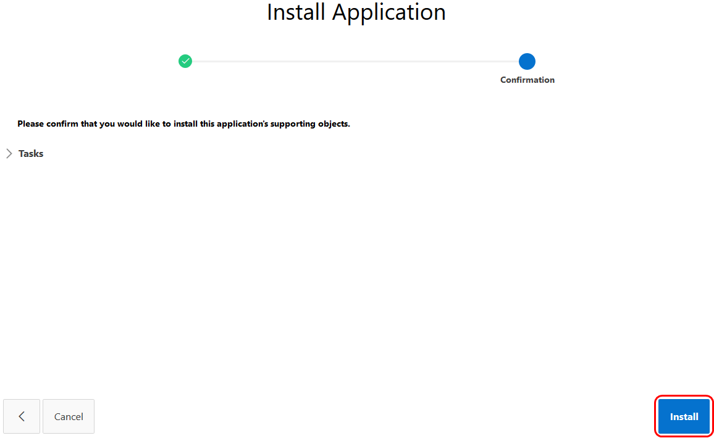

8. At the end of the wizard, choose **Edit Application**.

  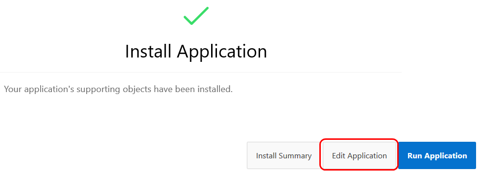

## **STEP 2**: Review the APEX application (before Spatial functionality)

1. On the  Drone Permits App page, click **5 - Drone Flights Requests - Interactive Report** page.

  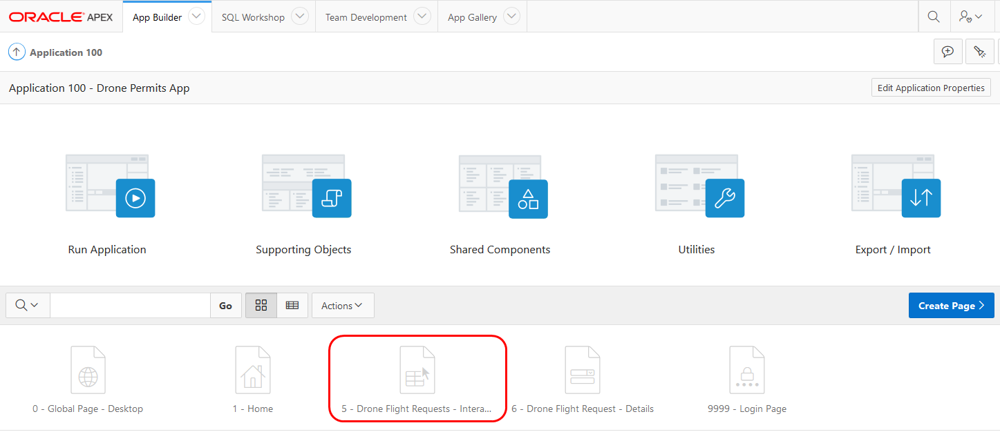

2. In the upper right corner, click **Run**.

  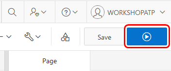

If prompted, sign in to the **Drone Permits App**  using the WORKSHOPATP username and password.

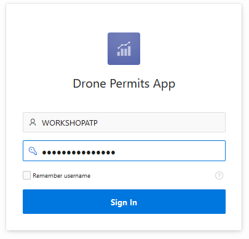

 You will see the Drone Flight Request application, with a list of requests.

  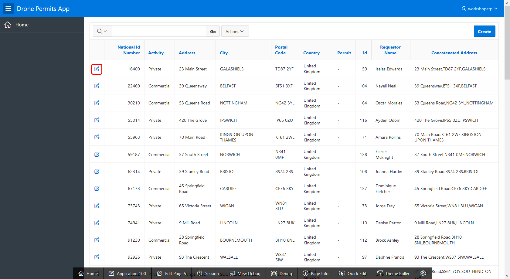

2. Open one of the Drone Flight requests. Notice how we only have a textual address here at the moment, without coordinates.

    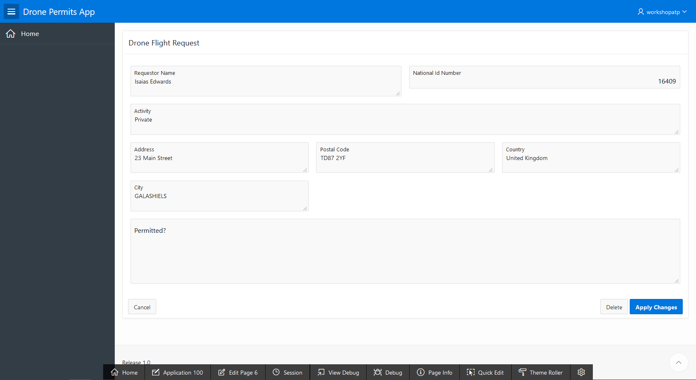

## **STEP 3**: Adding Geocoding

The application currently has textual addresses that have not yet been verified in any way.
Our goal is to check whether the address is within an urban area.
However, before we can do that we must first convert the address into a geo-location (latitude and longitude). The process of converting an address from text format to coordinates is called Geo-coding.

There are several publicly available web services that provide this service. Oracle provides the  eLocation service for this. Please read the license and usage terms [here](http://elocation.oracle.com/elocation/home.html) before using the service.

There's a plugin in APEX called "Elocation Geocoder", which takes care of the communication with this webservice.
The input parameters for the plugin are:

* The street, postal code and city, concatenated with commas.
* The country.

The output of the plugin is an APEX collection, of which the following columns are most important for us:
* "N002": The geocoded address' longitude
* "N003": The geocoded address' latitude

In case you don't know what APEX collections are: These provide a mechanism for you to store information on the user session level. An APEX collection is a matrix of values (rows + columns). We will use it as a way to retrieve the output from the geocoding webservice call, wherein the rows are the returned unique locations and N002 and N003 are the long-lat components.
Note that geocoding could in some cases return multiple possible coordinates for the same written address.
In our (simplified) example we will only look at the first row, and ignore any additional rows.

1. Open the page "Drone Flight Request - Details" for editing.

  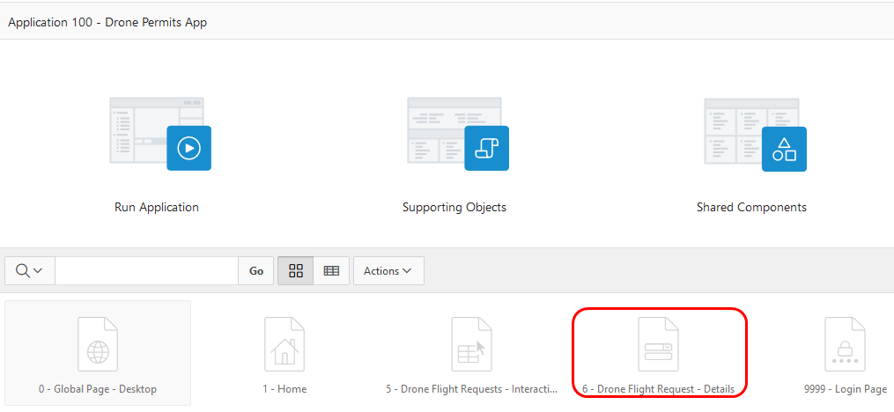

2. Right-click **Items** and select **Create Page Item** to add a new field that will hold the concatenated value of various address fields.

  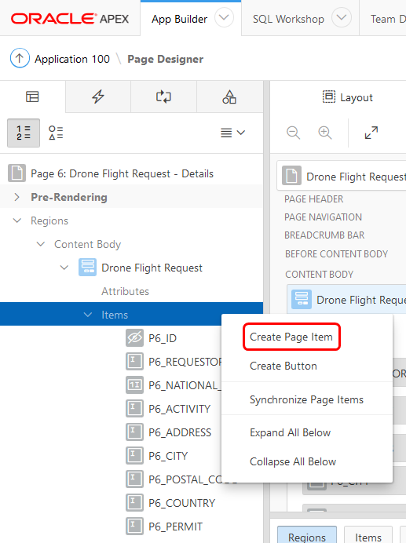

3. Under the Page Item tab, change the page name to `P6_CONCATENATED_ADDRESS` and select **Hidden** from the drop down list for the Type.

  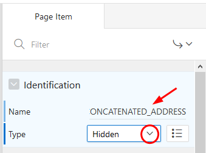

4. Within "Region Buttons", right click and select "Create button".

  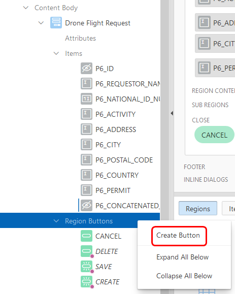

5. Under the Button tab, change the button name to `OBTAIN_FLY_ZONE_INFO`, and the label to "Obtain Fly Zone Info".

  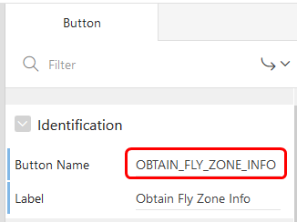

6. We're first going to prepare the concatenated address field for the webservice. On the new button right click and select **Create Dynamic Action**.

  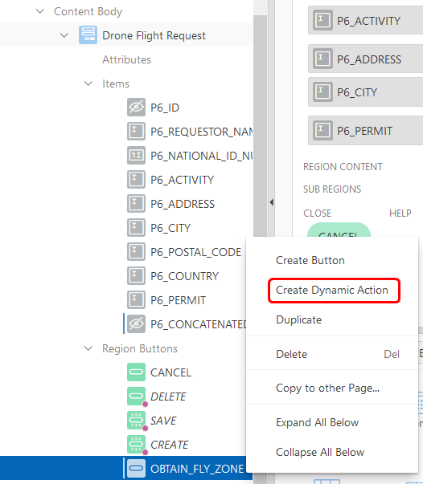

7. Click **Show** under True.

  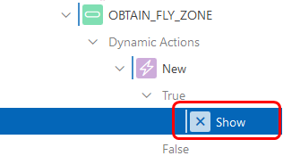

8. Change the Action properties as follows:

    - **Action**: "Set value".
    - **Set Type**: "JavaScript Expression".
    - **JavaScript Expression**:

    ```javascript
    $v("P6_ADDRESS").replace(",", " ") + ", " +
    $v("P6_POSTAL_CODE").replace(",", " ") + ", " +
    $v("P6_CITY").replace(",", " ")
    ```
    - **Affected Elements, Items**: `P6_CONCATENATED_ADDRESS`
    - **Fire on Initialization**: Off

  The result should look like:

  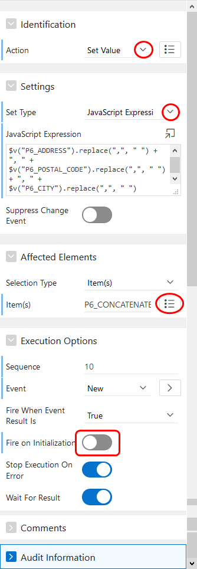

9. Now we're ready to configure the actual web service call. On the new Dynamic Action, right-click and select **Create TRUE action**. This creates a new action below the "Set Value" action.

  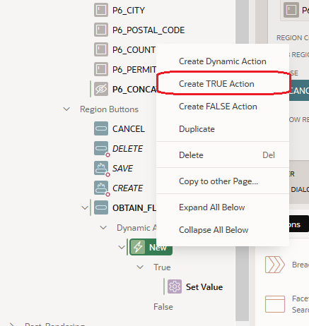

10. We will now the configure the second action item that you see in the screenshot: "Oracle Elocation Geocoder".

  

11. Change the properties as follows:

    - **Action**: "Oracle Elocation Geocoder [Plugin-In]"
    - **Geocoding type**: "Geocoding"
    - **Collection Name**: `GEOCODER_RESULTS`
    - **Item containing Country Code**: `P6_COUNTRY`
    - **Item containing address lines**: `P6_CONCATENATED_ADDRESS` (This is the Page Item we created earlier)
    - **Separator for address elements**: ","
    - **Fire on Initialization**: Off

  The resulting configuration should look like this:

  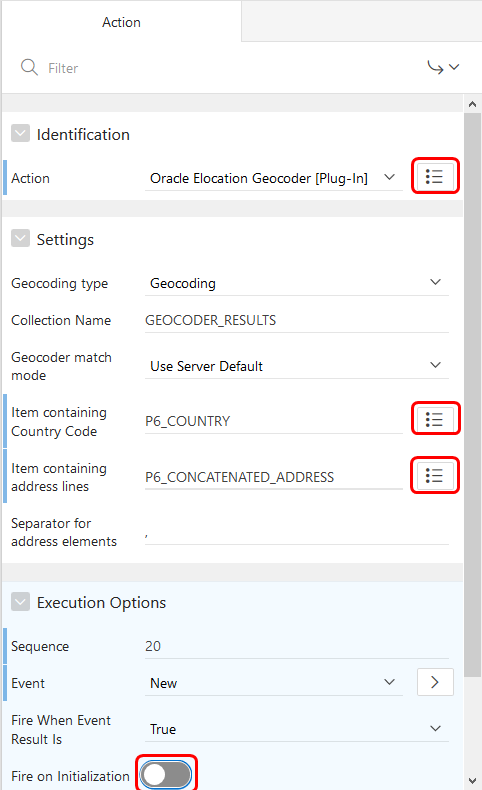

12. The web service call is an asynchronous process. This means that an event will be raised when the call completes. It is our task to correctly handle this event. Go to the Dynamic Action tab, right-click **Events** and select **Create Dynamic Action**.

  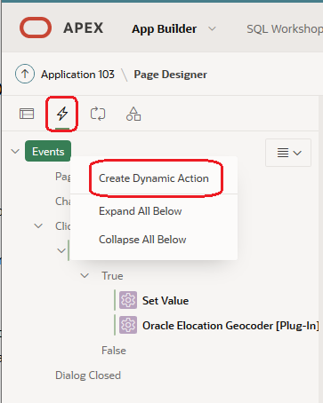

13. Update the new Dynamic Action (by default named `New_1`) and set the `When` properties as follows:

  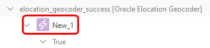


- **Event**: elocation_geocoder_success

- **Selection type**: JavaScript Expression

- **JavaScript Expression**: `document`

  

  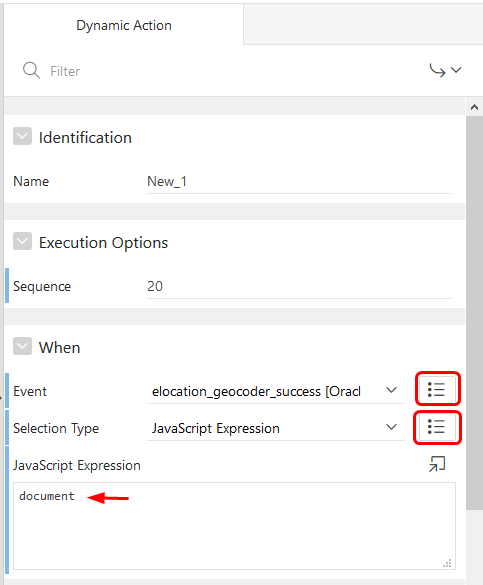

14. Next, select the True action of the newly created Dynamic Action.

  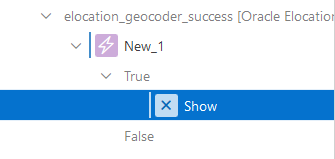

15. On the Action tab:

    - **Action**: "Execute PL/SQL Code".
    
- Add the following PL/SQL:
  
  ```plsql
  declare
      cursor c_geocoded_address
      is
          SELECT n002, n003
          from apex_collections where collection_name = 'GEOCODER_RESULTS'
          and n002 is not null and n003 is not null
          order by seq_id;
      r_geocoded_address c_geocoded_address%rowtype;
      lon varchar2(100);
      lat varchar2(100);
      coordinates MDSYS.SDO_GEOMETRY;
      overlap_count number;
      result varchar2(100) := '';
  begin
      open c_geocoded_address;
      fetch c_geocoded_address into r_geocoded_address;
      lon := r_geocoded_address.n002;
      lat := r_geocoded_address.n003;
      close c_geocoded_address;
      if lon is not null and lat is not null then
          result := result || 'Address found: ' || '[' || lat || ',' || lon || ']';
      else
        result := result || 'Address not found';
      end if;
      :P6_PERMIT := result;
  exception
      when others then
          :P6_PERMIT := sqlerrm;
  end;
  ```
  
     - **Items to Return**: "P6_PERMIT".
    
     - **Fire on Initialization**: Off.
    
       

  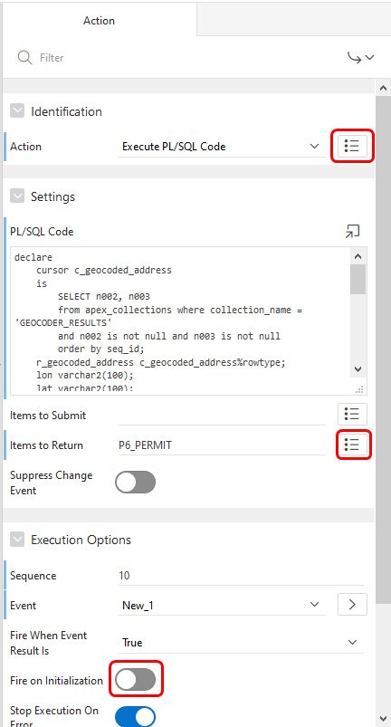

16. Click **Save** and double-check that everything is correct by going to the "Dynamic Actions" tab. It should look similar to this:

  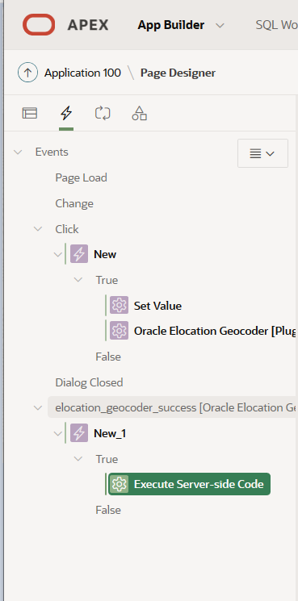

You see one Click event that will a) construct the concatenated address and b) call the webservice. You see the elocator "success" event that is called to process the results of the geocoder service.

17. Go to the "Drone Flight Requests - Interactive Report" page and run it.

  

18. Edit any request, and click **Obtain Fly Zone Info**.

  You should now see either "Address Found" with the latitude-longitude combination or "Address Not Found".

  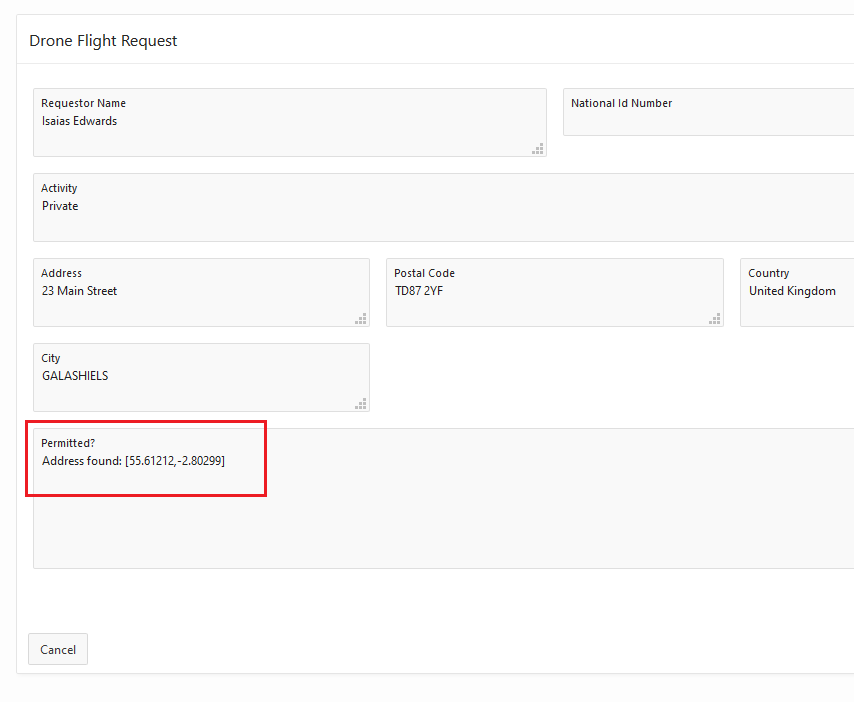


## **STEP 4**: Add verification that the flight will not take place in an urban zone

To do this, we need access to a list of polygons for all the urban areas. Such a data set could be prepared using the [Spatial Studio](https://www.oracle.com/database/technologies/spatial-studio.html) tool, which can be used in conjunction with the autonomous database or in any situation where there's a license for the Spatial database option.
In our exercise, the urban areas can be considered a given; the collection of polygons is already provided in a database table (URBAN\_AREAS_UK).

Oracle Autonomous database comes preconfigured with Oracle Spatial. Highlights of the enabled features are; native storage and indexing of point/line/polygon geometries, spatial analysis and processing, such as proximity, containment, combining geometries, distance/area calculations, geofencing to monitor objects entering and exiting areas of interest, and linear referencing to analyze events and activities located along linear networks such as roads and utilities.

In our case we will verify that the coordinate of the proposed drone flight is not within any urban area by using the [Oracle Spatial operators](https://docs.oracle.com/database/121/SPATL/spatial-operators.htm#SPATL110). The operator `SDO_ANYINTERACT` will check if the coordinate overlaps/is inside any of the urban area polygons.

1. Go back to the PL/SQL that's executed when the web service returns its result (edit the "Drone Flight Request - Details" page, then go to the Dynamic Actions tab and select the Execute PL/SQL Code under the TRUE

  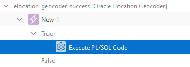

2. Change the PL/SQL code to the following and click **Save**:

    ```pl/sql
    declare
        cursor c_geocoded_address
        is
            SELECT n002, n003
            from apex_collections where collection_name = 'GEOCODER_RESULTS'
            and n002 is not null and n003 is not null
            order by seq_id;
        r_geocoded_address c_geocoded_address%rowtype;
        lon varchar2(100);
        lat varchar2(100);
        result varchar2(100) := '';
        coordinates MDSYS.SDO_GEOMETRY; --Add
        overlap_count number; --Add
    begin
        open c_geocoded_address;
        fetch c_geocoded_address into r_geocoded_address;
        lon := r_geocoded_address.n002;
        lat := r_geocoded_address.n003;
        close c_geocoded_address;
        if lon is not null and lat is not null then
            result := result || 'Address found: ' || '[' || lat || ',' || lon || ']';

            --Added code for urban area check
            coordinates := MDSYS.SDO_GEOMETRY(2001, 4326, MDSYS.SDO_POINT_TYPE(lon, lat, NULL), NULL, NULL);
            SELECT COUNT(*) INTO overlap_count
            FROM URBAN_AREA_UK "t2"
            WHERE SDO_ANYINTERACT("t2"."GEOM", coordinates) = 'TRUE';
            if overlap_count = 0 then
                result := result || ' - ALLOWED';
            else
                result := result || ' - NO FLY ZONE';
            end if;
            --End of added code for urban area check

        else
          result := result || 'Address not found';
        end if;
        :P6_PERMIT := result;
    exception
        when others then
            :P6_PERMIT := sqlerrm;
    end;
    ```

3. Run the "Drone Flight Requests - Interactive Report" page.

  

4. Edit the request for "Isaias Edwards" in Galashiels (National ID 16409), and click **Obtain Fly Zone Info**.

  You see that this address is not in an urban area, therefore the permit results is "Allowed".

  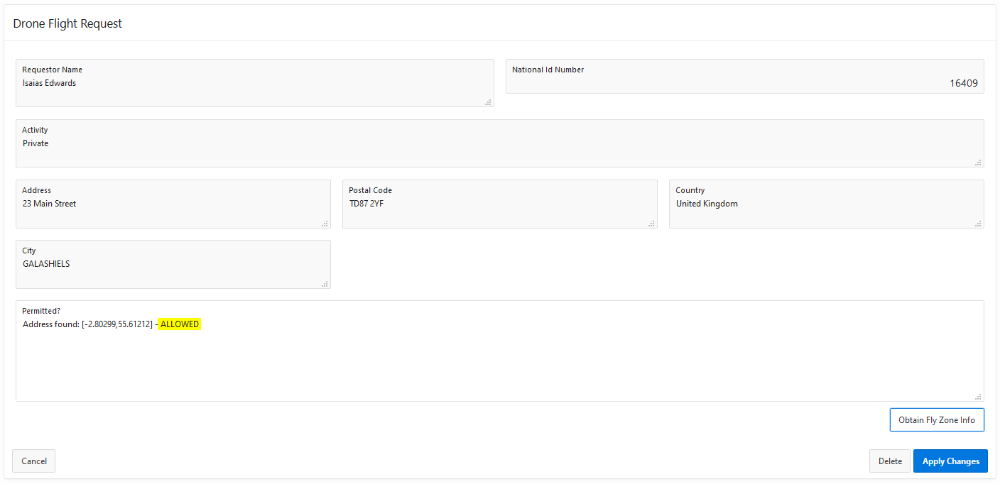

  Click **Cancel** to return to the menu.

5. Type "maverick rich" in the Search field and click **Go**.

  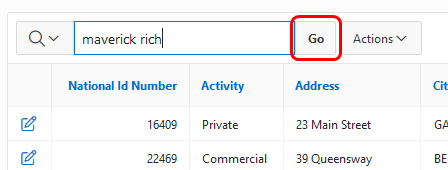

6. Edit the request for "Maverick Rich" in Belfast (National ID 290002), and click **Obtain Fly Zone Info**.

  You see that this address is inside an urban area, therefore the permit results is "No Fly Zone".

  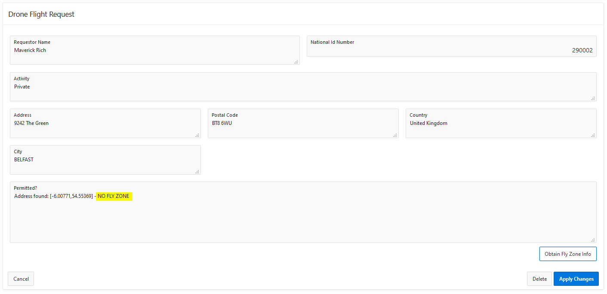


## Conclusion

* You have learned how work with geospatial information in your APEX application.
* You geocoded an address by calling the Oracle ELocation web service.
* You learned how to perform spatial validations by using Spatial SQL operators.

## Acknowledgements
* **Author** - Jeroen Kloosterman, Technology Product Strategy Manager, Melanie Ashworth-March, Principal Sales Consultant, EMEA Oracle Solution Center
* **Last Updated By/Date** - Tom McGinn, Database Innovations Architect, Database Product Management, July 2020

See an issue?  Please open up a request [here](https://github.com/oracle/learning-library/issues).   Please include the workshop name and lab in your request.
