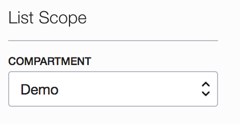
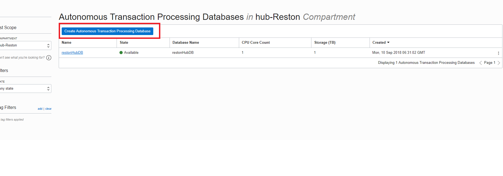
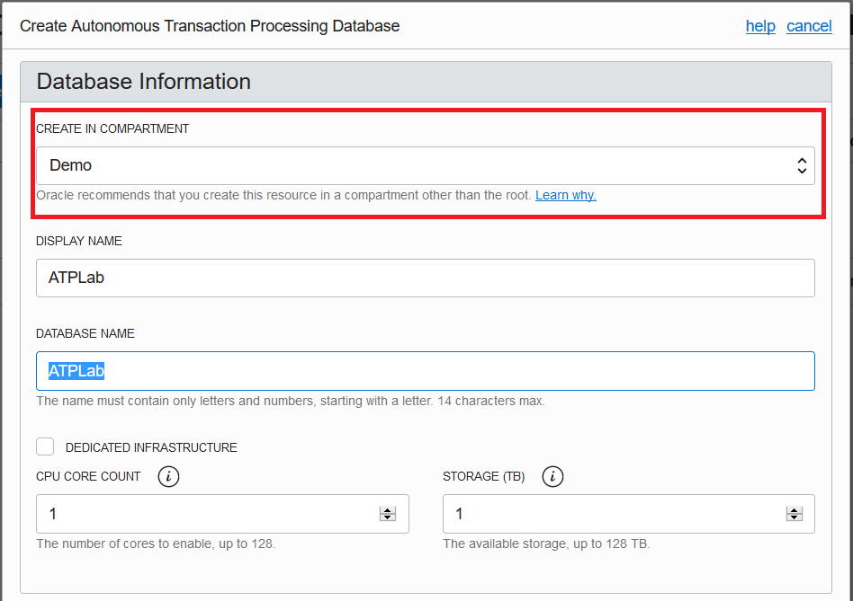
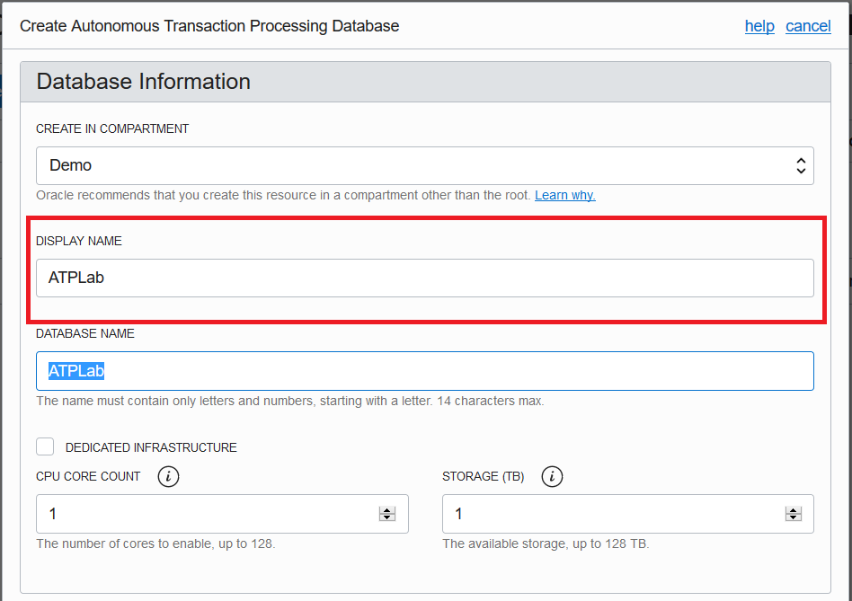
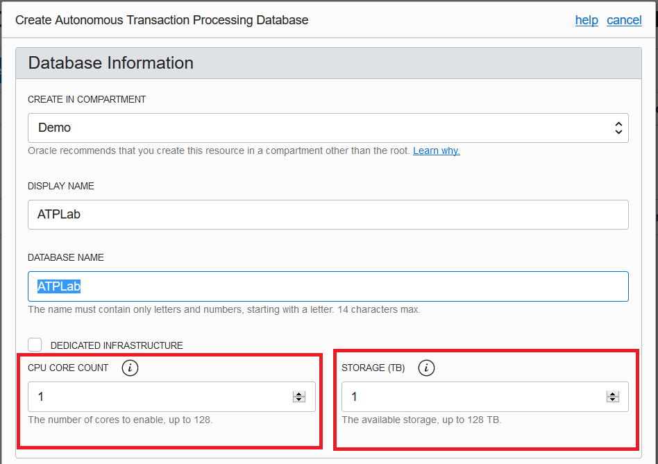
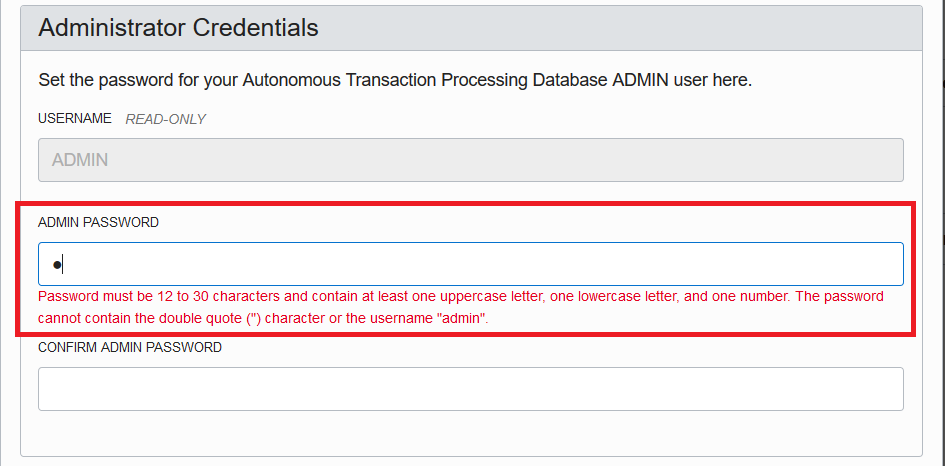
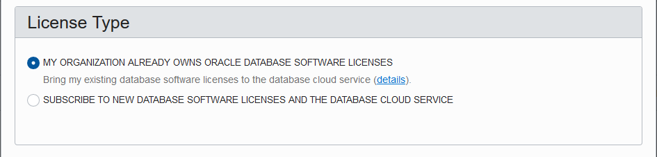
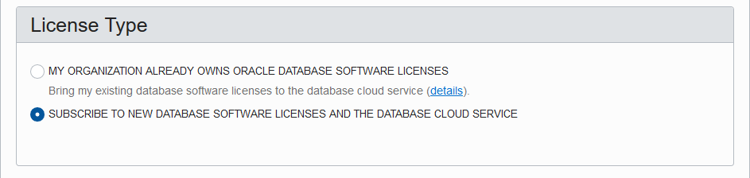
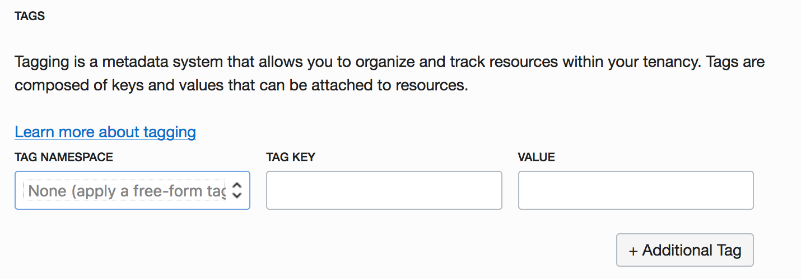
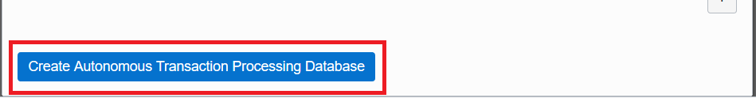

[Go to Overview Page](README.md)


# Microservices on ATP

## Part 1 - Provisioning an Autonomous Transaction Processing Database


#### **Introduction**

This lab walks you through the steps to get started using the Oracle Autonomous Transaction Processing Database on Oracle Cloud Infrastructure (OCI). You will provision a new database.


## Steps


### **STEP 1: Create an ATP Instance**

-  Click on the hamburger menu icon on the top left of the screen


-  Click on **Autonomous Transaction Processing** from the menu


- Select the compartment you created previously 



-  Click on **Create Autonomous Transaction Processing Database** button to start the instance creation process



-  This will bring up Create ATP Database screen where you specify the configurations of the instance


#### Note: Oracle Cloud Infrastructure allows logical isolation of users within a tenant through Compartments. This allows multiple users and business units to share a tenant account while being isolated from each other.

If you have chosen the compartment you do not have privileges on, you will not be able to see or provision instance in it.

More information about Compartments and Policies is provided in the OCI Identity and Access Management documentation [here](https://docs.cloud.oracle.com/iaas/Content/Identity/Tasks/managingcompartments.htm?tocpath=Services%7CIAM%7C_____13).

-  Verify your own compartment is selected



-  Specify a name for the instance, for example containing your initials for easy reference



- For this lab we are not checking Dedicate Infrastructure

-  You can choose an instance shape, specified by the CPU count and storage size. Default CPU count is 1 and storage is 1 TB.



-  Specify the password for the instance

#### For this lab, we will be using the following as password

```
WElcome_123#
```



- License Type: You will see 2 options under licensing options. 

**My organization already owns Oracle database software licenses**: Oracle allows you to bring your unused on-prem licenses to the cloud and your instances are billed at a discounted rate. This is the default option so ensure you have the right license type for this subscription.




**Subscribe to new database software licenses and the database cloud service**: Your cloud service instance should include database license. This is an all-inclusive cost and you do not need to bring any additional licenses to cloud.



- Tagging is a metadata system that allows you to organize and track resources within your tenancy. Tags are composed of keys and values that can be attached to resources. 

More information about Tags and Tag Namespaces is provided in the OCI Identity and Access Management documentation [here](https://docs.cloud.oracle.com/iaas/Content/Identity/Concepts/taggingoverview.htm).




For this workshop we will not be creating any TAG NAMESPACE. 

- Make sure you have everything filled all required details

-  Click on **Create Autonomous Transaction Processing Database** to start provisioning the instance



- Once you create ATP Database it would take 2-3 minutes for the instance to be provisioned.


-  Once it finishes provisioning, you can click on the instance name to see details of it


You now have created your first Autonomous Transaction Processing Cloud instance.

-   You are now ready to move to the next lab.


------

[Go to Overview Page](README.md)

