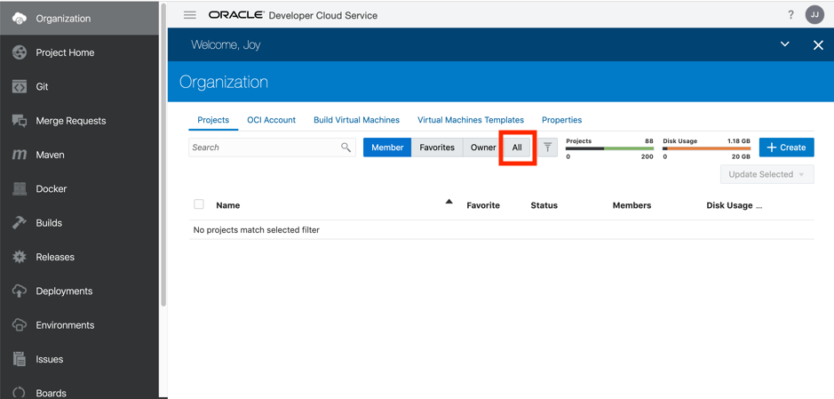

# Microservices on ATP #

## Part 1 - Setting up your Developer Cloud Project ##

## Introduction ##

In this lab, you’ll learn how to set up a new Developer project, based on a Github repository, and start modifying and automating the CI/CD steps for your environment.

You will work with DevCS and learn about some of its most important features.  

Let’s get started! 

## Steps

### Step 1: Create a project environment for your team

In this section, you’ll provision a complete development platform for your team by leveraging DevCS’s web interface.

- Access your Developer Cloud Instance by following the link provided to you in the access document

We pre-created a Developer Cloud project environment for you to use.  In order to access this environment, perform following steps : 

- On the Welcome page, click **All** to see all projects in the environment.

  

- Locate the project you have been assigned to according to the **Number** your instructor will have assigned to you : for example if you are **participant 09**, and your event is called **my_event**, please use project **09_myevent**.

- Now click on the hamburger icon on the right of your project, and select the option **Assign me as Owner**.

- You can now access your project and are ready to start the exercise.

Let’s take a look at this page (you may need to scroll to see the whole thing): 
- On the left side is an activity feed. 
- Tabs on the right side show you where the Git source code and Maven repositories are located.
- Also on the right you can see project statistics, as well as the UI where you can manage team members.  Let’s take a look at that UI now. 

### Step 2:  Fetch and review code from the Git repository

- With the **Project Home** selected on the left menu, look to the right and select **Repositories**, then click **+ Create** button.

  

- In the New Repository dialog, enter these details: 
  - Type **ATPDocker** in the **Name** field.  In case you are sharing a repository with other participants, add your initials at the end of the name, like for example **ATPDocker_JLE**

  - Type **Microservices and ATP** in the **Description** field

  - Choose **Import Existing Repository** under **Initial content**

  - Enter https://github.com/CloudTestDrive/ATPDocker.git in the text box: 

    

- Click **Create**.

  You should now be on the Code tab, which shows that you have a new DevCS git repository, NodeJSDocker.git.  This new repository contains imported code from the GitHub repository you specified.

  

- **Running on your personal Trial instance** ?  Then you have [one more step](LabGuide250Devcs-proj_own1.md) to perform, cloning the Developer git repository to your local environment.  

You are now ready to start configuring your CI/CD flows in this project!

- create the necessary database objects
- build your application Docker Container
- deploy the container to a Kubernetes cluster

---

Use the **Back Button** of your browser to go back to the overview page and select the next lab step to continue.

