# Microservices on ATP

## Part 2: Data Loading into ATP
#### **Introduction**

In this lab, you will be creating a few tables and inserting data into the ATP database using the CI/CD features of Developer Cloud.  We'll use the Build engine of DevCS to set up a flow that will create the necessary objects in the database, and insert data into the tables.  In case these elements are changed in the repository, the script will trigger again and re-create the database elements.

In real life, you would want to set up a more sophisticated logic to manage your database objects, see [these blogs on the topic by Shay Schmeltzer](https://blogs.oracle.com/shay/devcs).

#### **Objectives**

- Personalize the SQL script with your initials in the db table
- Create and run a Build to create your database objects
- Validate creation via SQLDeveloper

## Steps

### **STEP 1: Personalize the table creation script**

As all participants will be using the same ATP database, we will first personalize the database table creation script so you can see your table in the database after running the build job.

- Go to the Developer Cloud web interface, 
- Navigate to the **aone** folder
- Open the file **create_schema_simple.sql**, hit the Edit pencil 
- Replace all occurences of "ITEMS_CTD" by "ITEMS_<your_initials>".
- Safe the changes 

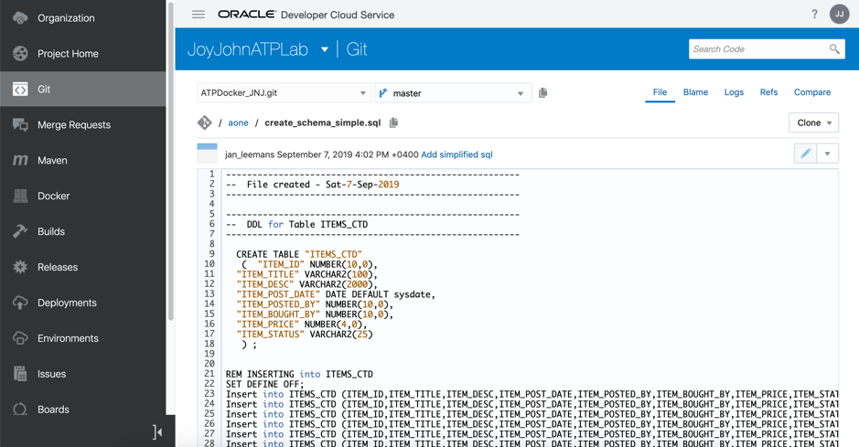

### **STEP 2: Create and load your data in the database**

- In Developer Cloud, navigate to the "Builds" tab and select **+Create Job**.
  - Enter a name : **CreateDBObjects**
  - Select the Software Template **OKE2**
  - Hit **Create Job**

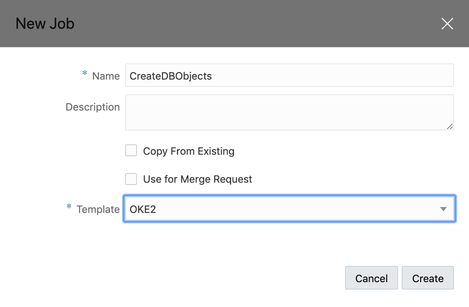

- Add a  GIT Source repository

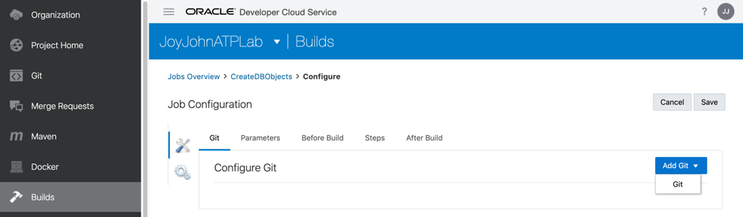

- Select your repository from the list
- Do **not** select the Automatic build on Commit

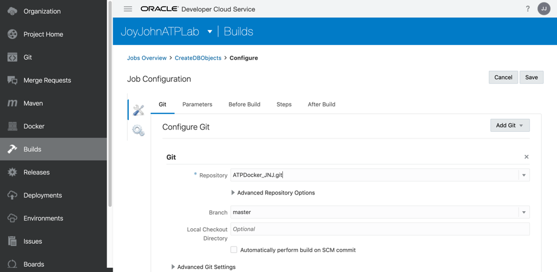

- Select the tab **Steps** to add a **SQLcl** build step from the dropdown

 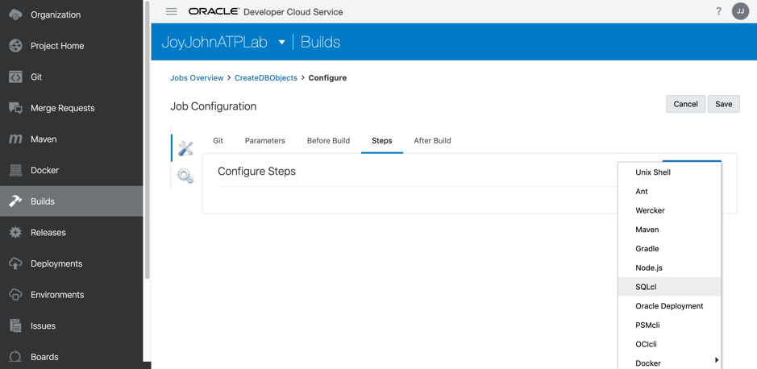

- Fill in the parameters:
  - username of the ATP instance : **admin**
  - password of the ATP instance (see access document provided by instructor)
  - the wallet .zip file **CTD_OOW.zip** that is already pre-loaded in your repository
  - your connect string, for example **jleoow_high**, where *jleoow* is the name of the database
  - the sql file containing the create script: **aone/create_schema_simple.sql**

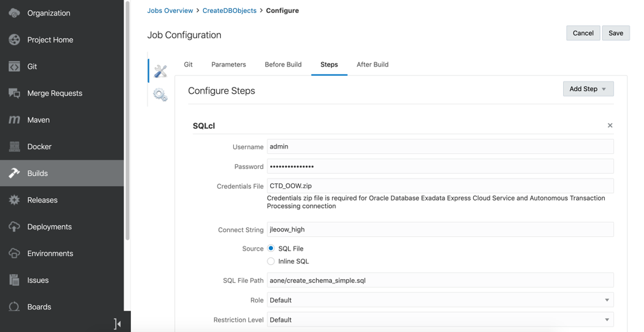

 -   Now save your Build Config and hit the **Build Now** button.  

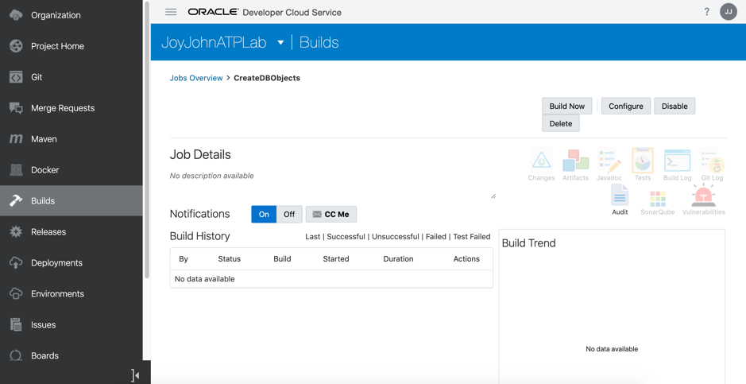

In case this is the first build job in your environment, the startup of the Build engine might take up to 10 minutes to complete.  You will notice the build to be "Waiting for Executioner"

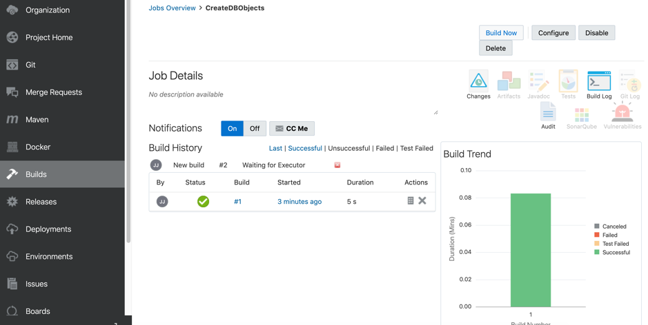

You can visualize the log file of your virtual machine, to check any errors you might encounter on this level: 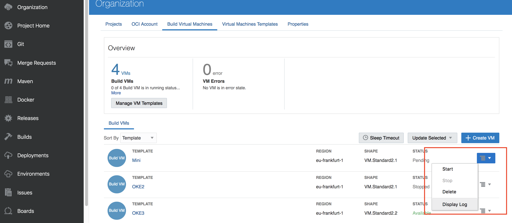

Now navigate back to the Build job you launched.

 -   After a successfull build you should see following screen :

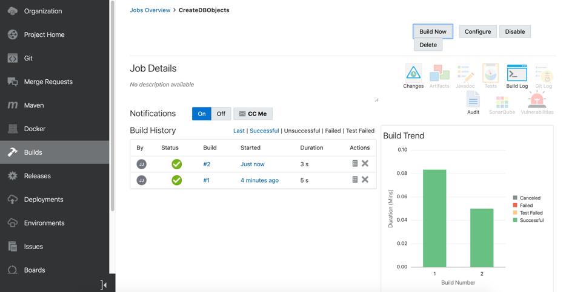

- You can check the detailed content of the SQL execution in the log file of the build job.

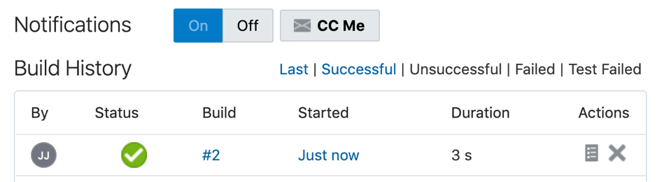

- Optionally you can now re-connect with SQLDeveloper to your database and verify the objects were created correctly.

---

**Congratulations**, You are now ready to move to the next lab.

Use the **Back Button** of your browser to go back to the overview page and select the next lab step to continue.
