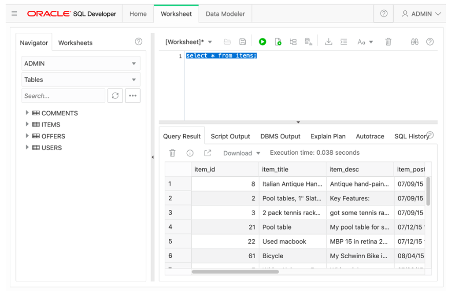

# Microservices on ATP - Part 2


## Data Loading into ATP
#### **Introduction**

In this lab, you will be creating a few tables and inserting data into the ATP database using the CI/CD features of Visual Builder Studio.  We'll use the Build engine of Visual Builder Studio to set up a flow that will create the necessary objects in the database, and insert data into the tables.  In case these elements are changed in the repository, the script will trigger again and re-create the database elements.

In real life, you would want to set up a more sophisticated logic to manage your database objects, see [these blogs on the topic by Shay Schmeltzer](https://blogs.oracle.com/shay/devcs).


#### **Objectives**

- Personalize the SQL script with your initials in the db table
- Create and run a Build to create your database objects
- Validate creation via SQL Developer Web


## STEP 1: Set up your ATP Database Wallet

We need to extract the ATP Database wallet file into the OCI Cloud shell. Open the OCI Cloud shell.

```bash
# Position yourself in the git repo, replace ATPDocker with your repo name if you used a different one
cd $HOME/dev/ATPDocker

# Download the file via the OCI CLI, replacing the database OCID with the OCID of your database and the password with the one of the admin user
oci db autonomous-database generate-wallet --file Wallet.zip --password 'Pa$$w0rd' --autonomous-database-id ocid1.autonomousdatabase.oc1.eu-frankfurt-1.abtheljtn3slgmzqr2benreqkrs55gwg3v3tz6lgwhgfgzaccrb

# Unzip the file
unzip Wallet.zip -d Wallet
```

- Note you need to replace the database OCID with the correct OCID of the database you are using.
- In the  above sequence of commands, we used the "OCI CLI", or the **Oracle Cloud Command Line Interface**  to interact with elements in the infrastructure, in this case the database.  For more information on how this works, you can look at the [documentation](https://docs.cloud.oracle.com/en-us/iaas/tools/oci-cli/2.9.9/oci_cli_docs/cmdref/db/autonomous-database/generate-wallet.html).

- Navigate into your database wallet folder, and edit the file **sqlnet.ora**, using your favorite editor (vi or nano)

  - In this file, replace the default line below:

    ```
    WALLET_LOCATION = (SOURCE = (METHOD = file) (METHOD_DATA = (DIRECTORY="?/network/admin")))
    ```

  - by this line:

    ```
    WALLET_LOCATION = (SOURCE = (METHOD = file) (METHOD_DATA = (DIRECTORY=$TNS_ADMIN)))
    ```

  - This will allow us to simply set the environment variable $TNS_ADMIN to the correct path.

- Reposition yourself in the root directory of your project

  ```
  cd ..
  ```

- On the command line, add the new files to the git repository, commit them and push them to Visual Builder Studio with the following commands:

```bash
# add the new files to the git repository
git add .

# Setup git to be able to commit changes
git config --global user.email "you@example.com"
git config --global user.name "Your Name"
git config --global push.default simple

# Commit the change with the appropriate comment
git commit -m "Add wallet"

# Push the change from your laptop back into the repository
git push
```


- Your wallet is now visible in Visual Builder Studio - you might have to refresh your browser window to see the changes


## STEP 2: Create and load your data in the database

- In Visual Builder Studio, navigate to the "Builds" tab and select **+Create Job**.
  - Enter a name : **CreateDBObjects**
  - Select the Software Template **OKE2**
  - Hit **Create Job**


- Add a  GIT Source repository


- Select your repository from the list
- Do **not** select the Automatic build on Commit


- Select the tab **Steps** to add a **SQLcl** build step from the dropdown

 


- Fill in the parameters:
  - username of the ATP instance : **admin**
  - password of the ATP instance
  - The location of the credentials file incide the repo. E.g. **Wallet.zip**
  - your connect string, for example **jleoow_high**, where *jleoow* is the name of the database.
    Check out your **tnsnames.ora** file inside the wallet folder for a list of available connections.
  - the sql file containing the create script: **aone/create_schema.sql**


 -   Now save your Build Config and hit the **Build Now** button.  


In case this is the first build job in your environment, the startup of the Build engine might take up to 10 minutes to complete.  You will notice the build to be "Waiting for Executioner"


## Step 3: Verify the results

You can visualize the log file of your virtual machine, to check any errors you might encounter on this level: 


Now navigate back to the Build job you launched.

 -   After a successfull build you should see following screen :


- You can check the detailed content of the SQL execution in the log file of the build job.


- You can now re-connect with **SQL Developer Web** to your database and verify the objects were created correctly:

`select * from items`

To execute the query, hit the green arrow "Run Statement" icon




---

**Congratulations**, You are now ready to move to the next step of the lab!

