# Microservices on ATP - Part 4

## Build a Container image with the aone application runing on ATP

#### **Introduction**

In this lab, you’ll learn how to build a Docker image for a Node.js REST service on Visual Builder Studio, using an ATP database as it's data source.

Let’s get started! 

## Step 1: Configure the connection to your OCIR Docker Repository

Open your project in Visual Builder Studio, and follow the steps below:

- Click **Docker** in the left navigation bar, then click **Link External Repository**.

  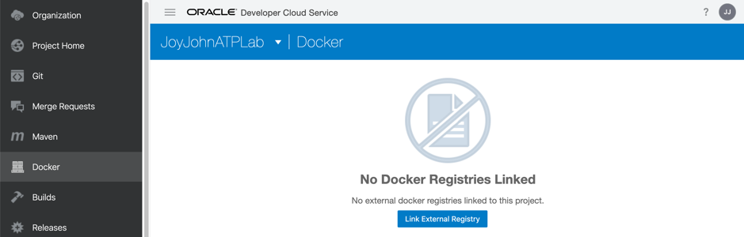

- In the Dialog Box, enter following parameters

  - Registry Name: **MyOCIR**

  - Registry URL: fill in the URL of your OCI Repository.  Example for an instance based in Frankfurt:
     https://fra.ocir.io  , but replace the "fra" by the correct code : **phx** for Phoenix,  **lhr** for London, ...
  
- The **Username** is composed of {object namespace}/oracleidentitycloudservice/{username}, for example **oractdemeabdmnative/api.user** 
  
- To get your **object-storage-namespace** name, you must navigate to the "Administration" and "Tenancy Details" menu:
  
   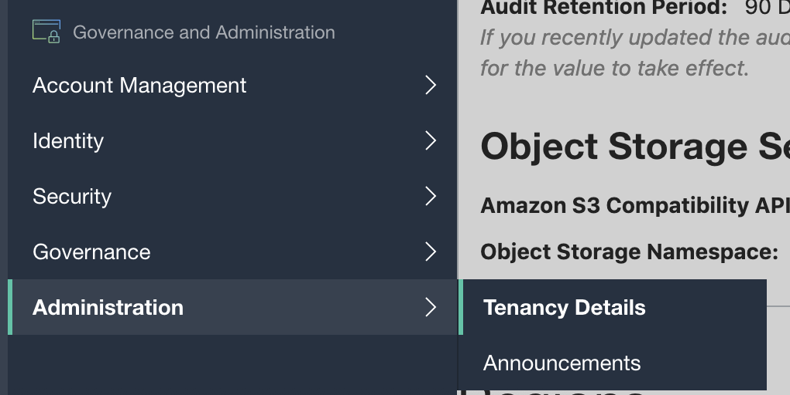
  
   Here  you can see the name of your Object Storage Namespace
  
   

  - Type your password **token** in the **Password** field - **attention, this is not the password** ! Typically a string looking like : i!co>5426CWaLZ&_Zh!r

  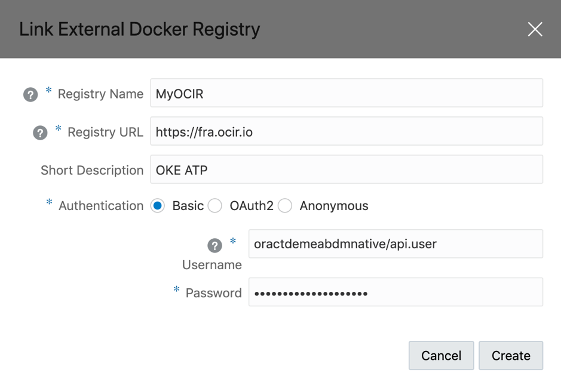

- Now click **Create**.  Your credentials will be checked, and if they are correct you should see the list of objects that are already in the repository (this will look different on your instance)

  - 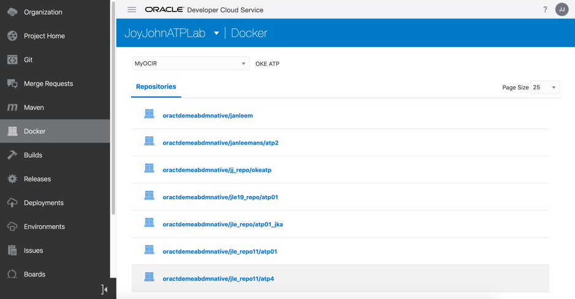

## Step 2: Configure the Docker build job

- Click **Build** in the left nav bar, then click Create Job**. 

  

- In the New Job dialog: 
  - Type **NodeJSDockerOCIR** in the **Job Name** field 

  - Type Build and push Docker image to OCIR in the **Description** field 

  - Select the build template you set up, for example **OKE2** from the **Software Template** drop-down  

  - Click **Create Job**.

    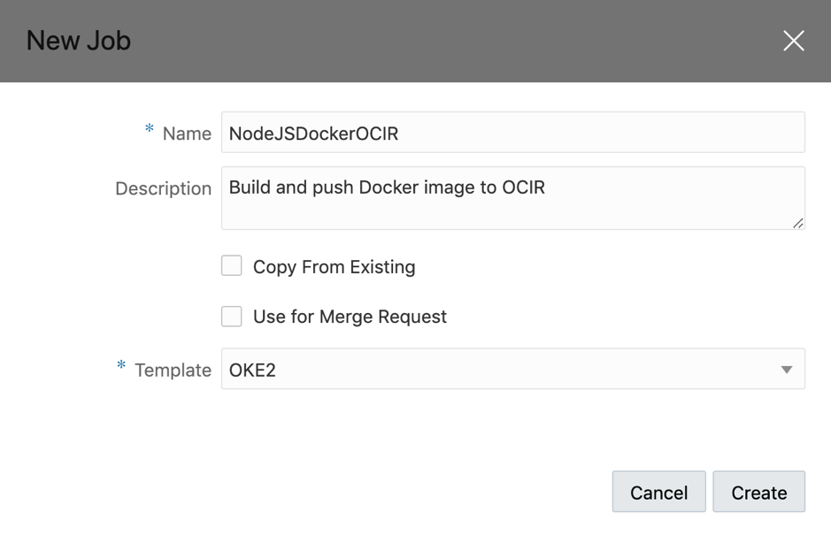

- From the **Add Source Control** dropdown, select Git.

  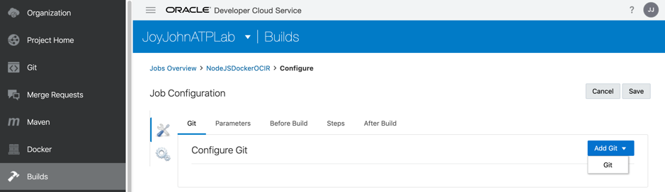

- Select your **Repository.git** from the **Repository** drop-down.

- Select master from the **Branch** drop-down.

- Leave the **Automatically perform build on SCM commit** check box **unchecked**.

  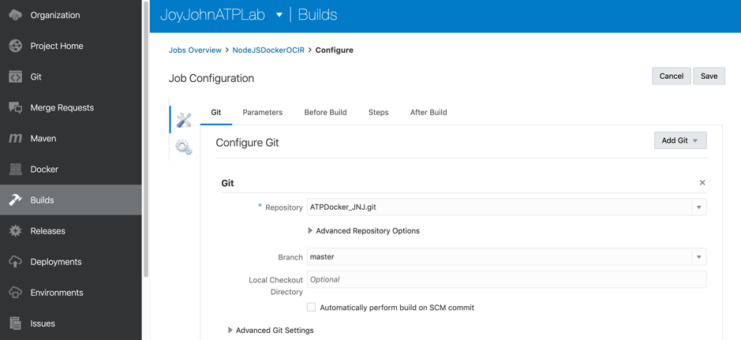

  

## Step 3: Add steps to the build: Execute the Docker commands

- Use the **Add Step** button and add a step of type **Docker -> Docker login**. 

- 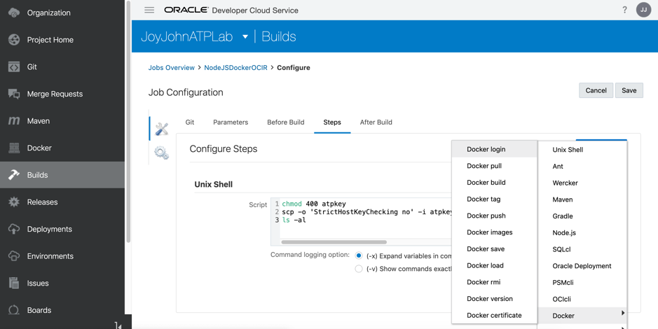

  

  
  
  - Use the dropdown of the field **Registry Host** to select the Repository configuration you just ceated (named **MyOCIR**.  The username and password field are automatically filled in now.
  
    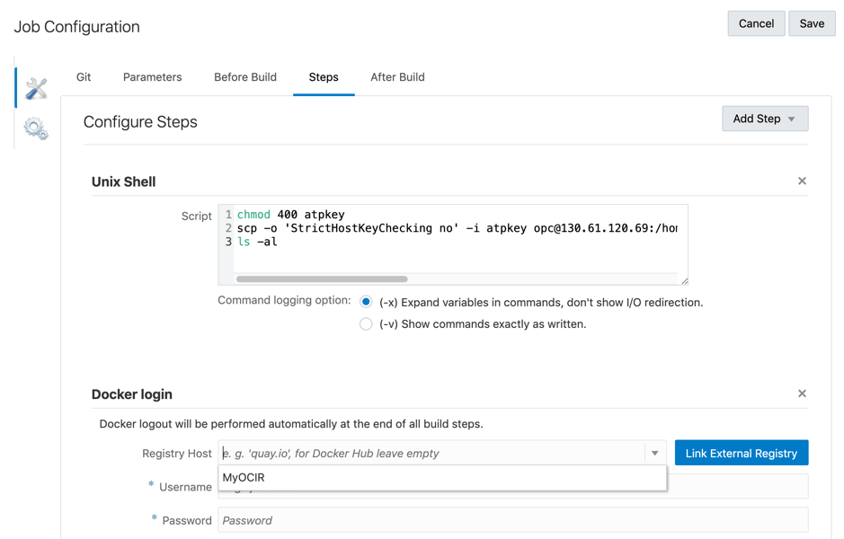

- Using the **Add Step** drop-down, select **Docker->Docker build**. 

  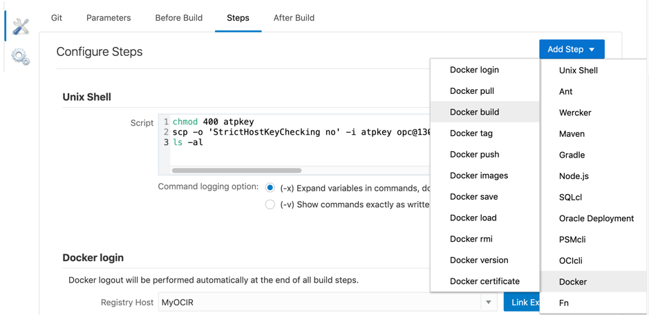

  - Select the **MyOCIR** registry from the dropdown field of the  **Registry Host** field (should be pre-filled in)

  - The **Image Name** is composed as follows: MyTenancyStorageNamespace/YourRepoName/ImageName

    - MyTenancyStorageNamespace: this is the name of your storage namespace you collected earlier
    - YourRepoName: a name you can choose, for example including your initials in case you are sharing a tenancy with other participants
    - ImageName: name of the image you want to create

  - Example : oractdemeabdmnative/jle_repo/atp01

  - In the **Source** radio buttons, click **Context root in Workspace**.

    

- Using the **Add Step** drop-down, select **Docker->Docker push**. 
  - Your **Registry Host** and **Image Name** should be pre-filled with the previously specified values.

  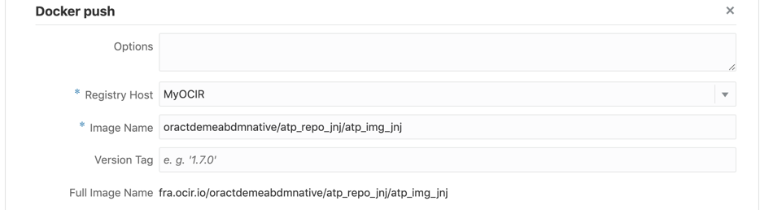

- Make sure to check the **Full Image Name** displaying on the Docker Build and Docker Deploy steps, they should be the same !

- Click **Save**.

  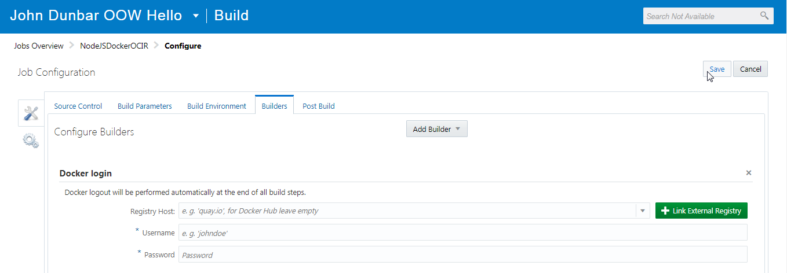

## Step 4: Configure some scripts to point to your environment

Before we can run the Build Job we just created, we need to parametrize some scripts to be pointing to your specific environment.

- Navigate to the **Git** page of your Visual Builder Studio project

- You need to ensure the docker image has the right connection information for connecting to the database.  Navigate to the folder **aone/scripts**, and locate the file called **dbconfig.js**

  - In this file, enter the username, password and connect string of your ATP database.  This is just a crude way of simply setting up connectivity, this should be parametrized in a real-world deployment!
  - The connect string is composed as **\<db_name\>_high**, for example :   **jleoow_high**, where jleoow is your database name.
  - Hit the **Commit** button to save the modifications.

You are now ready to try out your Build Job in the next step!

## Step 5: Run the Build Job

Before we move on, we want to ensure the job we just created works correctly. 

- Hit the **Build Now** button to kick off the build. 

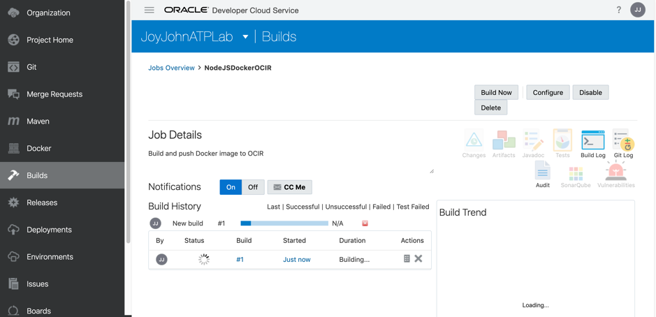

If this is the very first time you invoke the executor, this might take some time (up to 10 minutes), as the Executioner needs to be instantiated and launched.  Consecutive builds will start almost immediately.

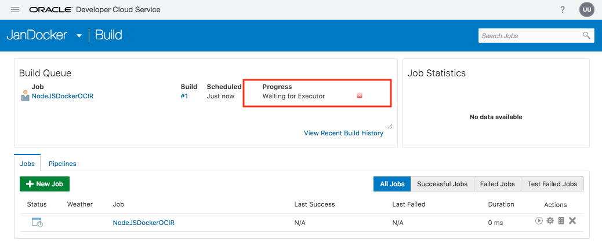

Once the job finished successfully, you should see something like this :

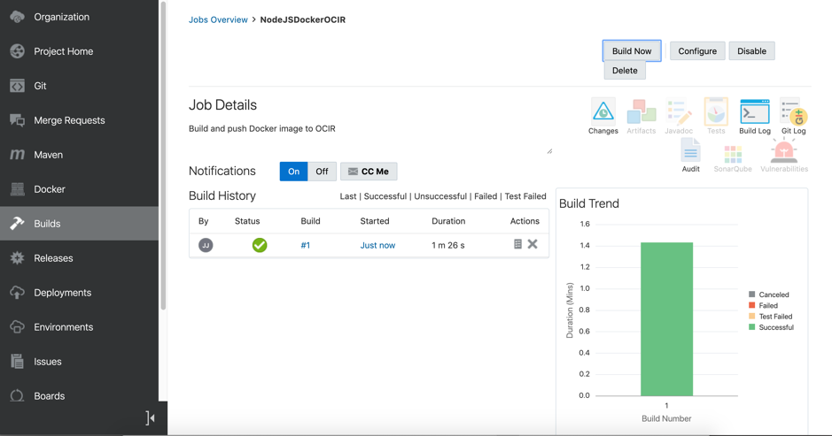

- Navigate to your OCI console to check the container has indeed been uploaded
  - On the menu, select **Developer Services**, and then **Registry**

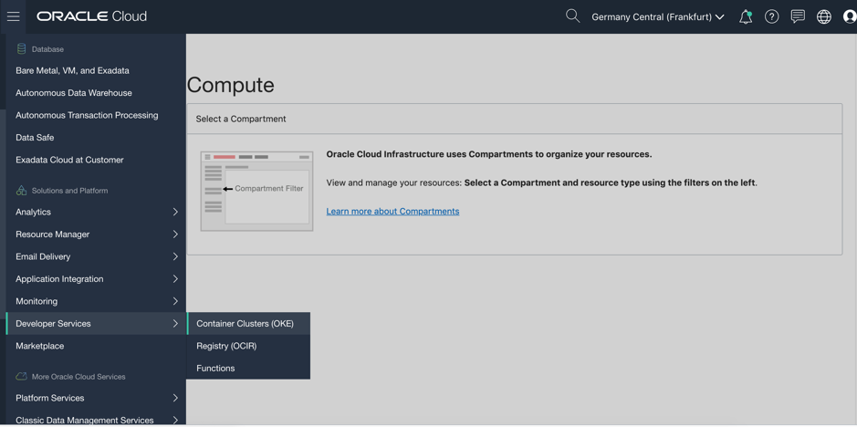

- You should see your container in the list, deployed just a few minutes ago
  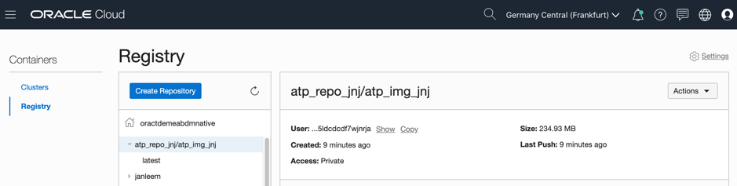

---

You have finished this part of the lab, navigate to the next step to continue!

