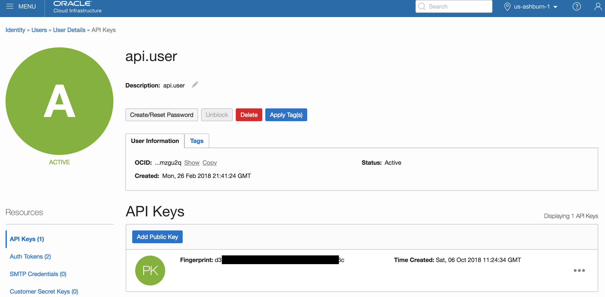
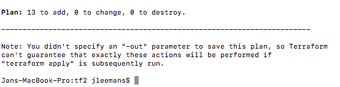

[Go to ATP Overview Page](../../ATP/readme.md)


# Microservices on ATP

## Part 3: Setup your Managed Kubernetes Instance

This Lab describes how to instantiate an **Oracle Managed Kubernetes cluster using Terraform**, including all the required network elements such as VNC's, subnets and access lists.

#### **Introduction**

In this lab we will perform the steps described below : 

- Open a command prompt and navigate to the **terraform** folder in the ATPDocker git repository folder
- Edit the file terraform.tfvars and enter your instance OCID's on the first lines
- run ```terraform init``` , `terraform plan` and `terraform apply` to spin up your infrastructure
- validate the resulting K8S infrastructure via `kubectl`, using the file **mykubeconfig** that was created 

Below you find a detailed description of these steps, with screendumps and explanations where to find the various OCID's and how to install the required commands `terraform` and `kubectl` on your local machine.


### Step 1: Collect Infrastructure Info for your environment: ###

You need to collect a series of OCID's from your instance in order for Terraform to access your instance:
- Tenancy OCID
- Region name
- Compartiment OCID
- User OCID
- API Key fingerprint
- Private key API local path


Screen shots of the various locations to find this information

- **Tenancy OCID** and **Region Name**:
  - Navigate to "Administration", "Tenancy Details"
  
  
- **Compartment OCID**
  - Navigate to "Identity", "Compartments"
  - Select the compartment where you want to create the cluser (for example "Demo")
  
  
- **User OCID** and **API Key Fingerprint**
  - Navigate to "Identity", "Users"
  - Select the user you created
  
  
- **Private Key API Path**
  - This is the local path on your laptop where the private key file is located.  
  - In case you are running Terraform on a Linux instance that was provided to you, you can download the private key using the Firefox browser and the document link provided by your instructor.


### Step 2: Set the Terraform parameters and run the script ###

- Open a new Terminal window, and navigate to the **terraform_0.12** folder in the **ATPDocker** git repository folder

- Edit the file terraform.tfvars and enter your instance OCID's on the first lines, using the information collected in the previous section

- Now edit the file **k8s.tf** and add your initials to the **name** of the kubernetes cluster:

   ```
   resource "oci_containerengine_cluster" "k8s_cluster" {
   	compartment_id = "${var.compartment_ocid}"
   	kubernetes_version = "v1.12.6"
   	name = "k8s_cluster_atp_myInitials"
   	vcn_id = "${oci_core_virtual_network.K8SVNC.id}"
   ```

- Edit the file **network.tf** and do the same for the **display_name** of the Virtual Network:

```
resource "oci_core_virtual_network" "K8SVNC" {
  cidr_block     = "${var.VPC-CIDR}"
  compartment_id = "${var.compartment_ocid}"
  display_name   = "K8S-VNC-ATP-MyInitials"
  dns_label      = "k8s"
}
```


- Run `terraform init` in this directory, all dependencies, including oci v3 should download
- 
- run `terraform plan` to validate your config

   - You should see 13 objects to be created

   - 
   - **Attention:** you might get an error on the version of your kubernetes cluster.  The version of Kubernetes specified in the file "k8s.ft" might be a too old version as compared to the versions made available by the OKE service.  If you encounter this error, verify the available versions on the OKE console that are available.
- run `terraform apply` to spin up your infrastructure

   - 
- type "yes"
- Observe the resulting files that were created on your machine : 
   - **terraform.tfstate**: this file contains the details of the created elements.  Terraform will require this file when you do an update to your configuration file and you want top apply this change to the infrastructure.
   -  **mykubeconfig**: this is the config file that allows you to connect to your newly created Kubernetes cluster.  You will need it in the next steps to access the kubernetes management console.

### Step 3: Validate and connect to the Kubernetes cluster

- validate the resulting K8S infrastructure :

   - ```bash
     export KUBECONFIG=./mykubeconfig
     kubectl version
     kubectl get nodes
     ```

   - If you execute the last command immediately after the creation of the cluster, you might get the following result:

      - ```
         No resources found.
         ```

   - In that case, wait a few minutes, you can re-execute the **get nodes** command untill you see something like the below:

      - ```
         NAME        STATUS   ROLES   AGE   VERSION
         10.0.10.2   Ready    node    23s   v1.12.6
         10.0.11.2   Ready    node    30s   v1.12.6
         10.0.12.2   Ready    node    14s   v1.12.6
         ```

         

- To access the Kubernetes console:

   - ```
     kubectl proxy
     ```

     

   - Then navigate in a browser on your VNC Viewer to the following address:   
     http://localhost:8001/api/v1/namespaces/kube-system/services/https:kubernetes-dashboard:/proxy/#!/login


- Set up a "Secret" to allow you to pull images from your private repository:

  - Run the following command, where you need to insert your specific parameters:

    ```bash
    kubectl create secret docker-registry <your-initials>-ocirsecret
    --docker-server=<region-code>.ocir.io --docker-username='<tenancy-name>/<oci-username>' --docker-password='<oci-auth-token>' --docker-email='<email-address>'
    ```

    - **your-initials** as part of the name of the secret so this is your individual secret in case you are working in a shared environment
    - **region-code** is for example **fra** for Frankfurt, **iad** for Ashburn, etc.  See [here](https://docs.cloud.oracle.com/iaas/Content/Registry/Concepts/registryprerequisites.htm#Availab) for details.
    - **tenancy-name** is the name of your Cloud tenancy
    - **oci-username** is the name of the **api.user** you just created
    - **oci-auth-token** is the **Auth Token** you just created and noted down
  - **email-address** is mandatory but not used, can be jdoe@acme.com
  
- Example command:
  
    ```bash
    kubectl create secret docker-registry jle-ocirsecret --docker-server=fra.ocir.io --docker-username='mytenancy/api.user' --docker-password='k]j64r{1sJSSF-;)K8' --docker-email='jdoe@acme.com'
  ```
  
  The result should be 
  
    ```
    secret/jle-ocirsecret created
    ```
  
    


---

[Go to ATP Overview Page](../../ATP/readme.md)
