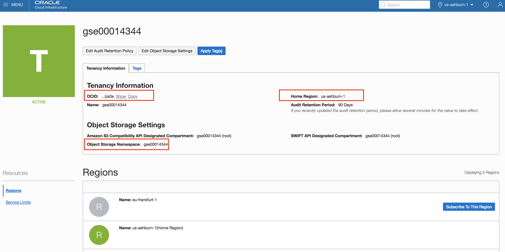
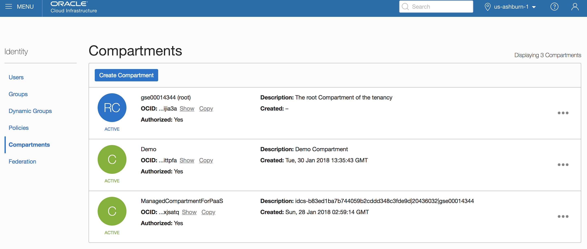
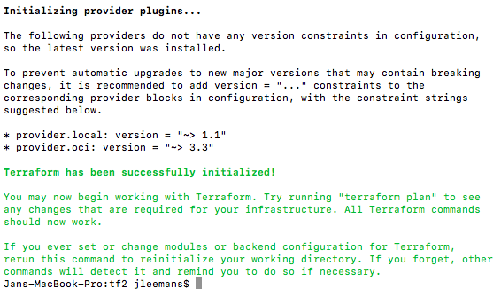
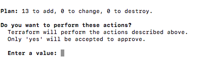

# Microservices on ATP - Part 3

## Setup your Managed Kubernetes Instance

This Lab describes how to instantiate an **Oracle Managed Kubernetes cluster using Terraform**, including all the required network elements such as VNC's, subnets and access lists.

#### **Introduction**

In this lab we will perform the steps described below : 

- Use the Cloud Shell Open a command prompt and navigate to the **terraform_0.12** folder in the main git repository folder you cloned previously
- Edit the file terraform.tfvars and enter your instance OCID's on the first lines
- run ```terraform init``` , `terraform plan` and `terraform apply` to spin up your infrastructure
- validate the resulting K8S infrastructure via `kubectl`, using the file **mykubeconfig** that was created 

Below you find a detailed description of these steps, with screendumps and explanations where to find the various OCID's and how to install the required commands `terraform` and `kubectl` on your local machine.


## Step 1: Collect Infrastructure Info for your environment: ##

You need to collect a series of OCID's from your instance in order for Terraform to access your instance, you may have previously collected some of this information when you were configuring the Visual Builder Studio:
- Tenancy OCID
- Region name
- Object Storage Namespace
- Compartment OCID


Screen shots of the various locations to find this information

- **Tenancy OCID, Object Storage Namespace** and **Region Name**:
  - Navigate to "Administration", "Tenancy Details"
  
  
- **Compartment OCID**
  - Navigate to "Identity", "Compartments"
  - Select the compartment where you want to create the cluser (for example "Demo")
  
  
  
  

## Step 2: Set the Terraform parameters and run the script ##

- In your **Cloud Shell**,  navigate to the **terraform_0.12** folder in the **$HOME/dev/ATPDocker** git repository folder

- Edit the file terraform.tfvars using your preferred editor: vi or nano.

   - Enter your instance OCID's on the first lines, using the information collected in the previous section
   - Enter your initials for the  the parameter **Participant_Initials**

   

- Run `terraform init` in this directory, all dependencies should download.  Actual versions will differ from screenshot below, as this evolves over time.

- 

- run `terraform plan` to validate your config

   - You should see 10 objects to be created
   
   
   - **Attention**: In case you are running your tenancy in a datacenter with only 1 Availability Domain, you will get an error at this point, saying "**Error: Invalid index**.  Edit your **k8s.tf** and remove the last 2 elements of the Node Pool configuration referring to AD's no. 2 and 3.  
     Re-run the **terraform plan** command to validate it passes this time.
   
- run `terraform apply` to spin up your infrastructure

   - 
   
- type "yes"
   - **Attention:** you might get an error on the version of your kubernetes cluster.  The version of Kubernetes specified in the file **k8s.tf** might be a too old version as compared to the versions made available by the OKE service.  If you encounter this error, verify the available versions on the OKE console that are available.
   - **Attention:** You might also get an error on the version of the Linux Image to use for the Worker Nodes.  If you encounter this, please check available Linux versions in your datacenter and correct the file **k8s.tf** accordingly.
   
- Observe the resulting files that were created on your machine : 
   - **terraform.tfstate**: this file contains the details of the created elements.  Terraform will require this file when you do an update to your configuration file and you want top apply this change to the infrastructure.
   -  **mykubeconfig_0**: this is the config file that allows you to connect to your newly created Kubernetes cluster.  You will need it in the next steps to access the kubernetes management console.

## Step 3: Validate and connect to the Kubernetes cluster

- validate the resulting K8S infrastructure :

   - ```bash
     export KUBECONFIG=$PWD/mykubeconfig_0
     kubectl version
     kubectl get nodes
     ```

   - If you execute the last command immediately after the creation of the cluster, you might get the following result:

      - ```
         No resources found.
         ```

   - In that case, wait a few minutes, you can re-execute the **get nodes** command untill you see something like the below:

      - ```
         NAME        STATUS   ROLES   AGE   VERSION
         10.0.10.2   Ready    node    23s   v1.12.6
         10.0.11.2   Ready    node    30s   v1.12.6
         10.0.12.2   Ready    node    14s   v1.12.6
         ```


- Set up a "Secret" to allow you to pull images from your private repository:

  - Run the following command, where you need to insert your specific parameters:

    ```bash
    kubectl create secret docker-registry <your-initials>-ocirsecret --docker-server=<region-code>.ocir.io --docker-username='<Object-Storage-Namespace>/oracleidentitycloudservice/<oci-username>' --docker-password='<oci-auth-token>' --docker-email='<email-address>'
    ```
  
- **your-initials** as part of the name of the secret so this is your individual secret in case you are working in a shared environment
  
    - **region-code** is for example **fra** for Frankfurt, **iad** for Ashburn, etc.  See [here](https://docs.cloud.oracle.com/iaas/Content/Registry/Concepts/registryprerequisites.htm#Availab) for details.
    - **Object-Storage-Namespace** is the name of Object Storage Namespace you noted down.
    - **oci-username** is the name of the user you used to log into the console
    - **oci-auth-token** is the **Auth Token** you just created and noted down
    
  - **email-address** is mandatory but not used, can be jdoe@acme.com
  
  - Example command:
  
    ```bash
    kubectl create secret docker-registry jle-ocirsecret --docker-server=fra.ocir.io --docker-username='epqldntjs/oracleidentitycloudservice/ppan@oracle.com' --docker-password='k]j64r{1sJSSF-;)K8' --docker-email='jdoe@acme.com'
    ```
  
    
  
    The result should be 
  
    ```
    secret/jle-ocirsecret created
    ```
  


- Create a secret for making the database wallet available as a mounted volume inside your pods

  - Run the following command :

    ```
    #First move up one level to the root of your repository
    cd ..
    # Now create a second secret
    kubectl create secret generic db-wallet --from-file=<wallet_directory>
    ```

    - `<wallet_directory>` is the location of your wallet folder.  This can be a relative or a full path, finishing with a "/"

      Example : 
      `kubectl create secret generic db-wallet --from-file=./Wallet_JLEOOW/`


---

**Congratulations**, You are now ready to move to the next step of the lab!
