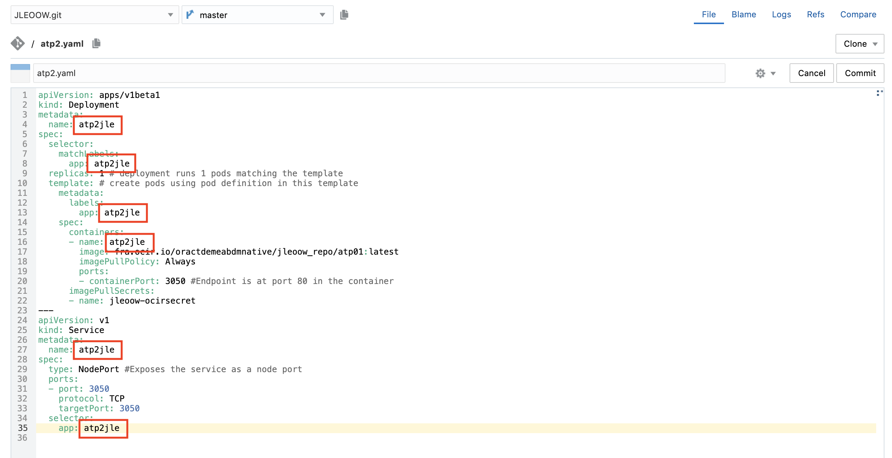
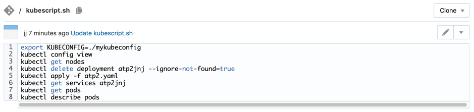
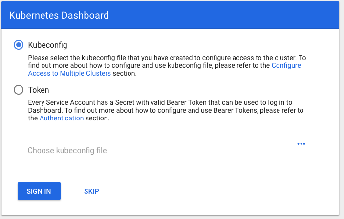
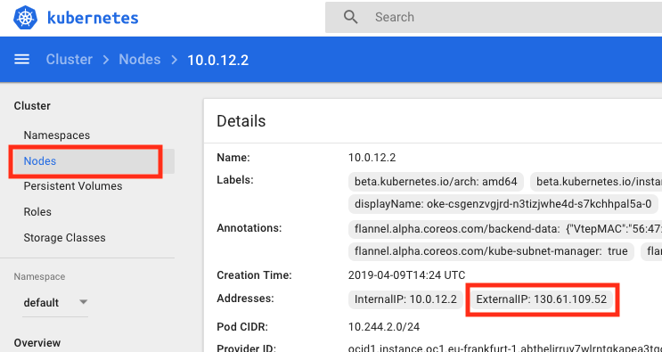
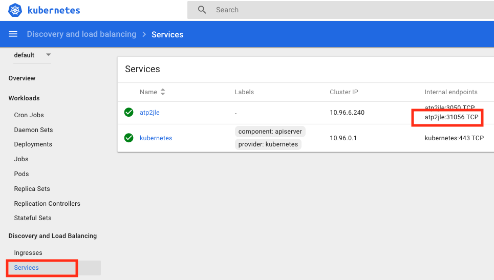

[Go to ATP Overview Page](../../ATP/readme.md)


# Microservices on ATP

## Part 5: Deploy your container on top of your Kubernetes Cluster

#### **Introduction**

In this section we will create a second build job to run the container we created on the Kubernetes Cluster we set up.

Let’s get started! 

### Step 1: Set up your Deploy Build Job

- Navigate to the **Build** tab and hit the **New Job** button.

  - Enter a name, for example OKEDeploy
  - Select your build template, we named it DockerOCIOKE in the previous steps

  

  - Now hit  **Create Job**, and the Job Configuration dialog will pop up. 

- In the Git tab, select your git repository.

  

  - Do **not** select the "Automatically perform Build" option for this job, we will link it with the previous job using a pipeline.

- In the Builders tab, add the following Builder steps:

  - Docker Login : use the predefined Repository definition **MyOCIR** as you did in the previous job

    

  - Unix Shell Builder:

    - launch the script "kubescript.sh" that is in your repository.  We will edit this script after completing the Build definition to adapt it to your needs.

      ``bash -ex kubescript.sh``

  

- You have finished setting up the Build job !

  ==> Don't forget to **Save** the job !

  

### Step 2: Configure the environment to point to your cloud instance

- Upload the kubeconfig file into the repository.  During the creation of the cluster, a file called **mykubeconfig** was generated.  This file is required to connect to your cluster from within the build job.  In case you skipped the optional step 3 to create your own cluster, your instructor will provide you with the appropriate kubeconfig file.

  - In Developer Cloud, navigate to the top level of your git repository, and hit the **+ File** button:

    

  - Enter the name of the file "mykubeconfig"

  - Open your local **mykubeconfig** file **with a plain text editor** and copy the content into the editor window of your browser:

    
    
    **Attention** : make sure NOT to accidentally insert any line feeds in the long lines 4 and 17 that contain a certificate.  See picture above how the file should look after the paste command.
    
  - Commit the new file

  

- Now open the file **atp2.yaml**.  This is the deployment profile of your container on the Cluster.  You need to make following changes:

  - Line 17: set the correct image location as you configured it in the BuildContainer job

  - Example for datacenter in Frankfurt (**fra**), tenancy name **mytenancy**, repo path **oowhol** and image name joduatp2:latest container name: 

    `fra.ocir.io/mytenancy/oowhol/joduatp2:latest`

    

  - Use the **Commit** button to save your changes.

  

### Step 3:  Personalize the deployment on the cluster

<u>In case you are sharing a Kubernetes instance with other participants</u>, you need to make sure your deployment can be distinguished from the ones belonging to your colleagues.  You can perform the below steps to achieve this:

- In the **Git** tab of Developer Cloud, re-open the file **atp2.yaml**.  You need to make following changes:

  - Line 4, 8, 13, 16, 27 and 35 : replace the string **atp2** with a string containing your initials, for example for "jle" : **atp2jle**
  

  
- Hit **Commit** to save your changes.
  

  
- In the **Git** tab of Developer Cloud, open the file **kubescript.sh** by clicking on it, and go into editing mode by clicking on the small pencil in the upper right

  - On line 4 and 6, add your initials in front of the strings beginning with **atp2**
  
  - This should match exactly the personalization done in the previous step !
  
    
  
    
  
  - Hit **Commit** to save the changes
  
  - As you can see, this shell script refers to the actual Kubernetes deployment configuration file **atp2.yaml**.  

### Step 4: Execute and validate your new job

- In the **Builds** menu, select the job you just created and hit the **Build Now** button.

- Wait for the job to finish, then check the build log:

   

- Inspect the build job log file to validate correct execution

  

- Although we included a few commands in the build job to show the resulting state of the cluster, the best way to visualize this is by launching the **kubernetes Dashboard**.  This is explained in the next step.


### Step 5: Setting up kubectl

First download and set up the **kubectl** executable on your machine.  You can follow [the detailed steps on this page](env-setup-kubectl.md) for more information.

Next you need to configure your terminal window to point to the kubeconfig configuration file that belongs to the cluster you just created. This file has been generated during the terraform setup of your cluster.

The *kubeconfig* file contains the necessary details and parameters to connect to Oracle Container Engine (Kubernetes cluster). The *clusters* parameter defines the available clusters. 

When you execute a `kubectl` command first it tries to read the default configuration file: *config* file from default location. On Linux it is `~/.kube` and on Windows it is `c:\Users\<USERNAME>\.kube`. But you can store *config* file at different path and even with different name e.g.*kubeconfig*. Just set the configuration file location as KUBECONFIG environment variable in your command line terminal where you want to execute `kubectl` commands.

```
export KUBECONFIG=~/Downloads/kubeconfig
```


*Remark: in case you are running these commands on a Windows machine, the correct syntax is:*

```
				set KUBECONFIG=c:\Downloads\kubeconfig
```


Now `kubectl` is ready to use. Test again using the version option.

```
$ kubectl version
Client Version: version.Info{Major:"1", Minor:"8", GitVersion:"v1.8.4", GitCommit:"9befc2b8928a9426501d3bf62f72849d5cbcd5a3", GitTreeState:"clean", BuildDate:"2017-11-20T05:28:34Z", GoVersion:"go1.8.3", Compiler:"gc", Platform:"linux/amd64"}
Server Version: version.Info{Major:"1", Minor:"7+", GitVersion:"v1.7.4-2+af88312fe58fec", GitCommit:"af88312fe58fec576aed346d707bf58f0132ef2a", GitTreeState:"clean", BuildDate:"2017-10-24T20:06:27Z", GoVersion:"go1.8.3", Compiler:"gc", Platform:"linux/amd64"}
$ 
```

Check the output, it has to contain both client and server version information.

### Step 6: Kubectl Web UI (dashboard)

Dashboard is a web-based Kubernetes user interface what is deployed by default on Oracle Container Engine. You can use Dashboard to deploy containerized applications to a Kubernetes cluster, troubleshoot your containerized application, and manage the cluster itself along with its attendant resources. You can use Dashboard to get an overview of applications running on your cluster, as well as for creating or modifying individual Kubernetes resources (such as Deployments, Jobs, DaemonSets, etc).

You can access Dashboard using the kubectl command-line tool by running the following command:

```
$ kubectl proxy
Starting to serve on 127.0.0.1:8001
```

This command runs `kubectl` in a mode where it acts as a reverse proxy. It handles locating the apiserver and authenticating and make Dashboard available at the following link:

http://localhost:8001/api/v1/namespaces/kube-system/services/https:kubernetes-dashboard:/proxy/#%21/overview?namespace=default.

The default port used by the proxy command is port 8001. In case this port is already in use by another application you can easily specify to use another port using following syntax:

```
kubectl proxy --port=8333
```

You will be asked to provide the kubeconfig file before you can access the console.

- Choose the Kubeconfig option
- Click on the "Choose kubeconfig file" area and select the kubeconfig file you have downloaded on your machine
- Click "Sign In"



REMARK: the screen you will get might look slightly different, as this depends on the state of the cluster you are visualizing.

	


### Step 7: Visualize the Service to obtain the URL of your application

In order to see the application you just deployed, we need to construct the URL where the container is listening.  You can do this via the command line and kubectl, or via the Kubernetes dashboard.

Using the command line:

- ```
  kubectl get nodes -o wide
  
  NAME        STATUS   ROLES   AGE   VERSION   INTERNAL-IP   EXTERNAL-IP     OS-IMAGE                  KERNEL-VERSION                   CONTAINER-RUNTIME
  10.0.10.2   Ready    node    16h   v1.12.6   10.0.10.2     130.61.56.185   Oracle Linux Server 7.5   4.14.35-1818.3.3.el7uek.x86_64   docker://18.9.1
  10.0.11.2   Ready    node    16h   v1.12.6   10.0.11.2     130.61.34.50    Oracle Linux Server 7.5   4.14.35-1818.3.3.el7uek.x86_64   docker://18.9.1
  10.0.12.2   Ready    node    16h   v1.12.6   10.0.12.2     130.61.109.52   Oracle Linux Server 7.5   4.14.35-1818.3.3.el7uek.x86_64   docker://18.9.1
  ```

  

- ```
  kubectl get services
  
  NAME         TYPE        CLUSTER-IP    EXTERNAL-IP   PORT(S)          AGE
  atp2jle      NodePort    10.96.6.240   <none>        3050:31056/TCP   15h
  kubernetes   ClusterIP   10.96.0.1     <none>        443/TCP          16h
  ```

  Now elect any of the external IP addresses of the nodes, and combine it with the external port of your service : in the above example : 130.61.56.185:31056

You can obtain the same info using the Kubernetes dashboard:

- Navigate to the **Cluster - Nodes** screen and select a node to get its external IP addres
  - 

- Navigate to the **Discovery and Load Balancing - Services** menu to view the port
  - 


When you enter this URL in your browser, you should see the below result:


Congratulations, you have finished this lab !!!!

- You created an Autonomous database and populated it with some tables and data
- You created a Kubernetes cluster and deployed a container with a Node application
- You accessed this application via your browser

Because you did all this via a CI/CD chain, making a small change in the source code of your application will trigger the re-deployment and make your change immediately visible.

---
[Go to ATP Overview Page](../../ATP/readme.md)

