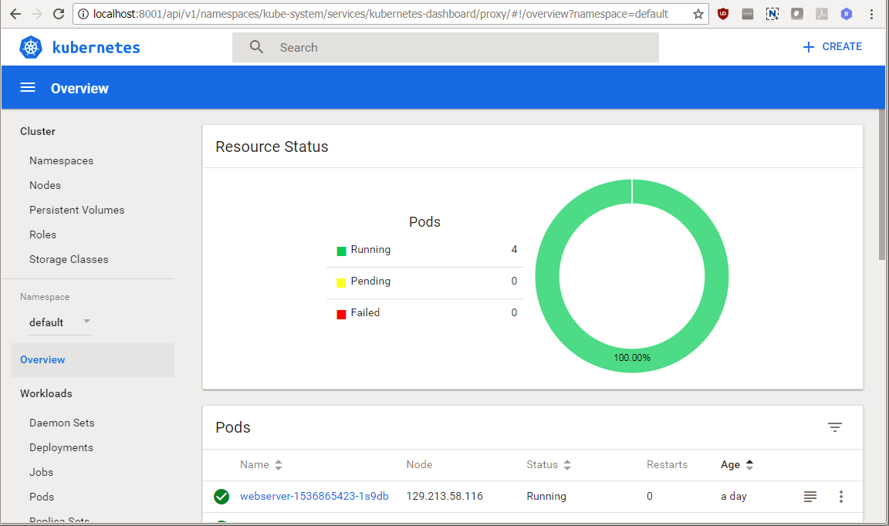

[Go to Container Lab Overview Page](readme.md)


# Container Native labs #

## Installing Kubectl ##

This page covers how to install the Kubernetes command line interface and connect to your Kubernetes cluster

Choose the section that corresponds to your machine:

#### MacOS

Download the latest release with the following `curl` command:

```
$ curl -LO https://storage.googleapis.com/kubernetes-release/release/$(curl -s https://storage.googleapis.com/kubernetes-release/release/stable.txt)/bin/darwin/amd64/kubectl
  % Total    % Received % Xferd  Average Speed   Time    Time     Time  Current
                                 Dload  Upload   Total   Spent    Left  Speed
100 49.9M  100 49.9M    0     0  4289k      0  0:00:11  0:00:11 --:--:-- 4150k
```

Make the kubectl binary executable.

```
$ chmod +x ./kubectl
```

Move the binary in to your PATH.

```
$ mv ./kubectl /usr/local/bin/kubectl
```

Verify the installation using the version command.

```
$ kubectl version
Client Version: version.Info{Major:"1", Minor:"8", GitVersion:"v1.8.4", GitCommit:"9befc2b8928a9426501d3bf62f72849d5cbcd5a3", GitTreeState:"clean", BuildDate:"2017-11-20T05:28:34Z", GoVersion:"go1.8.3", Compiler:"gc", Platform:"linux/amd64"}
The connection to the server localhost:8080 was refused - did you specify the right host or port?
```

At this step the server connection failure is normal. For easier usage it is recommended to setup the autocomplete for bash.

```
$ source <(kubectl completion bash)
```


#### Linux machines ####

For Linux, use the same sequence as described above for Linux, only replace the CURL command with the following:

```
$ curl -LO https://storage.googleapis.com/kubernetes-release/release/$(curl -s https://storage.googleapis.com/kubernetes-release/release/stable.txt)/bin/linux/amd64/kubectl
  % Total    % Received % Xferd  Average Speed   Time    Time     Time  Current
                                 Dload  Upload   Total   Spent    Left  Speed
100 49.9M  100 49.9M    0     0  4289k      0  0:00:11  0:00:11 --:--:-- 4150k
```
​	
Note the difference: you are using /bin/linux/... instead of /bin/darwin/...
​	
​	

#### Windows ####

To find out the latest stable version take a look at [https://storage.googleapis.com/kubernetes-release/release/stable.txt](https://storage.googleapis.com/kubernetes-release/release/stable.txt)

For example if latest stable version is: **v1.8.4** then construct the download link in the following way: *https://storage.googleapis.com/kubernetes-release/release/VERSION_NUMBER/bin/windows/amd64/kubectl.exe*. Thus in case of **v1.8.4** the link looks like this:

[https://storage.googleapis.com/kubernetes-release/release/v1.8.4/bin/windows/amd64/kubectl.exe](https://storage.googleapis.com/kubernetes-release/release/v1.8.4/bin/windows/amd64/kubectl.exe)

Once you have the executable binary add to your PATH variable.

	set PATH=%PATH%;c:\download_folder\kubectl.exe

Verify the installation using the version command.

	C:\Users\pnagy>kubectl version
	Client Version: version.Info{Major:"1", Minor:"7", GitVersion:"v1.7.0", GitCommit:"d3ada0119e776222f11ec7945e6d860061339aad", GitTreeState:"clean", BuildDate:"2
	017-06-29T23:15:59Z", GoVersion:"go1.8.3", Compiler:"gc", Platform:"windows/amd64"}
	Unable to connect to the server: dial tcp 192.168.99.100:8443: connectex: A connection attempt failed because the connected party did not properly respond after a period of time, or established connection failed because connected host has failed to respond.

---


### Verifying the installation ###

After the successful installation you need to get the kubeconfig configuration file that belongs to your cluster. This file will be included in the package provided to you by the instructors, or obtained in the course of the setup of your personal cluster.

- Copy the file to a location on your local machine (for example the "Downloads" folder)

The *kubeconfig* file contains the necessary details and parameters to connect to Oracle Container Engine (Kubernetes cluster). The *clusters* parameter defines the available clusters. The minimum set of the properties are the address of the master node, the certification and it's name to refer. For later usage copy your server address. 

In the example above it is:
​	*https://c9f1b2bbcs1.prod.cluster.us-ashburn-1.oracledx.com:6443*.

When you execute a `kubectl` command first it tries to read the default configuration file: *config* file from default location. On Linux it is `~/.kube` and on Windows it is `c:\Users\<USERNAME>\.kube`. But you can store *config* file at different path and even with different name e.g.*kubeconfig*. Just set the configuration file location as KUBECONFIG environment variable in your command line terminal where you want to execute `kubectl` commands.

Linux & MacOS:

	export KUBECONFIG=~/Downloads/kubeconfig

Windows:

	set KUBECONFIG=c:\Downloads\kubeconfig 

Now `kubectl` is ready to use. Test again using the version option.

	$ kubectl version
	Client Version: version.Info{Major:"1", Minor:"8", GitVersion:"v1.8.4", GitCommit:"9befc2b8928a9426501d3bf62f72849d5cbcd5a3", GitTreeState:"clean", BuildDate:"2017-11-20T05:28:34Z", GoVersion:"go1.8.3", Compiler:"gc", Platform:"linux/amd64"}
	Server Version: version.Info{Major:"1", Minor:"7+", GitVersion:"v1.7.4-2+af88312fe58fec", GitCommit:"af88312fe58fec576aed346d707bf58f0132ef2a", GitTreeState:"clean", BuildDate:"2017-10-24T20:06:27Z", GoVersion:"go1.8.3", Compiler:"gc", Platform:"linux/amd64"}
	$ 

Check the output, now it has to contain the server version information.


### Kubectl Web UI (dashboard) ###

Dashboard is a web-based Kubernetes user interface what is deployed by default on Oracle Container Engine. You can use Dashboard to deploy containerized applications to a Kubernetes cluster, troubleshoot your containerized application, and manage the cluster itself along with its attendant resources. You can use Dashboard to get an overview of applications running on your cluster, as well as for creating or modifying individual Kubernetes resources (such as Deployments, Jobs, DaemonSets, etc).

You can access Dashboard using the kubectl command-line tool by running the following command:

	$ kubectl proxy
	Starting to serve on 127.0.0.1:8001

This command runs `kubectl` in a mode where it acts as a reverse proxy. It handles locating the apiserver and authenticating and make Dashboard available at the following link:

 [http://localhost:8001/api/v1/namespaces/kube-system/services/https:kubernetes-dashboard:/proxy/#%21/overview?namespace=default](http://localhost:8001/api/v1/namespaces/kube-system/services/https:kubernetes-dashboard:/proxy/#%21/overview?namespace=default).  

For older versions of K8S, you might have to use this URL: [http://localhost:8001/ui](http://localhost:8001/ui).
Please note the UI can only be accessed from the machine where the proxy command is running.

The default port used by the proxy command is port 8001.  If on your laptop this port is already in use by another application you can easily specify to use another port using following syntax:

	kubectl proxy --port=8333

You will be asked to provide the kubeconfig file before you can access the console.
- Choose the Kubeconfig option
- Click on the "Choose kubeconfig file" area and select the kubeconfig file you have downloaded on your machine
- Click "Sign In"


REMARK: the screen you will get might look slightly different, as this depends on the state of the cluster you are visualizing.



Dashboard shows most Kubernetes object kinds and groups them in a few menu categories.

When there are Kubernetes objects defined in the cluster, Dashboard shows them in the initial view. By default only objects from the default namespace are shown and this can be changed using the namespace selector located in the navigation menu. Later your sample application will be deployed to a new namespace called your Oracle Container Pipelines (Wercker) username.


### Manage deployment using Kubernetes Web UI ###

Kubernetes supports multiple virtual clusters backed by the same physical cluster. These virtual clusters are called namespaces. Namespaces are intended for use in environments with many users spread across multiple teams, or projects. Namespaces provide a scope for names. Names of resources need to be unique within a namespace, but not across namespaces.

The sample application's Kubernetes deployment configuration created a new namespace for your application. To filter the deployments according namespaces on Oracle Container Engine select your namespace (namespace selector you will find above "Overview" link; namespace selector is not available when you select "Namespaces"; by default namespace selector is displaying the value "default"), what is your Oracle Pipelines (Wercker) user name on the left navigation menu.


---


This is the end of the kubectl installation page

**==> Now use the "Back" button of your browser to return to your original tutorial**


