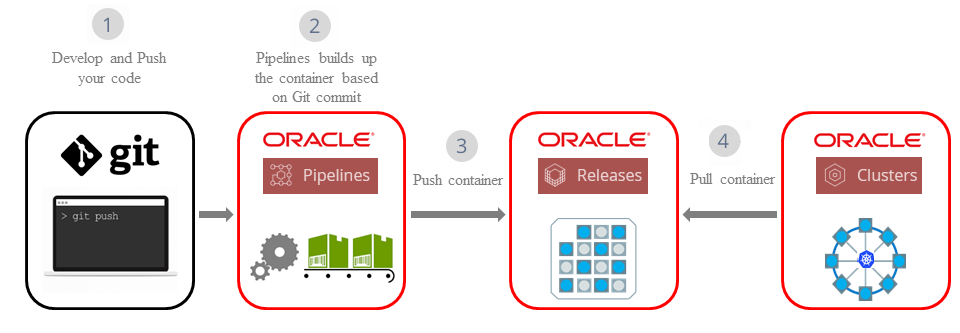

[Go to Overview Page](../../README.md)

# Container Native labs - Container Pipelines to Kubernetes #

## Introduction

This lab is designed for people with no prior experience with Docker, Node.js, AngularJS and want to learn the core concepts and basics of Container Native DevOps.
It combines the (optional) creation of a Kubernetes cluster on OCI infrastructure, and the setup of a CI/CD pipeline for setting up your development environment.

The demo application is a simple Credit Scoring application. It has a Node.js backend microservice which calculates the credit score based on name, date of birth and SSN. The application UI which invokes the backend miscroservice using REST interface is built on AngularJS.

Oracle services being used during the hands-on are the following:

+ **Oracle Container Pipelines (OCP - former Wercker)** is a Docker-Native CI/CD  Automation platform for Kubernetes & Microservice Deployments. OCP is integrated with Docker containers, which package up application code and can be easily moved from server to server. Each build artifact can be a Docker container. The user can take the container from the Docker Hub or his private registry and build the code before shipping it. Its SaaS platform enables developers to test and deploy code often. They can push software updates incrementally as they are ready, rather than in bundled dumps. It makes it easier for coders to practice continuous integration, a software engineering practice in which each change a developer makes to the codebase is constantly tested in the process so that software doesn’t break when it goes live.

+ **Oracle Container Registry** is a v2 container registry to store and retrieve containers.

+ **Oracle Container Engine** is an Oracle managed Kubernetes Cluster enviroment to deploy and run container packaged applications.

**Architecture**

## Prerequisites ##

To run these labs you will need access to an Oracle Cloud Account.  If you are participating in a live event, your instructor will provide you the required credentials.

If you are running these labs on your own, please get a [Trial account](https://myservices.us.oraclecloud.com/mycloud/signup?sourceType=:ex:tb:::RC_EMMK181016P00010:Virtual_WS_DEV&SC=:ex:tb:::RC_EMMK181016P00010:Virtual_WS_DEV&pcode=EMMK181016P00010) or set up your corporate UC subscription for this lab.

For this lab you will also need a **Github** and **Wercker** Account.  You can use your existing account, create a new one or use a pre-created instance provided to you by your instructor.  In the case of an instructor-provided environment, all participants will work on a common environment, so we need to use "prefixes" throughout this exercise to distinguish between participants.

**Please be carefull to read the instructions and use your "userxx" label for the appropriate objects.**

## Steps to follow in this hands-on session are: ##

1. (*Optional Step*) Setting up your own Kubernetes cluster on Oracle Cloud OCI infrastructure
    - if you are following this lab using an **instructor-provided environment**, you probably already have a cluster set up for you, and you can skip this step.
    - if you want to **manually set up** the whole network configuration for your cluster and the different elements of the cluster itself, you can follow [these detailed instructions](http://www.oracle.com/webfolder/technetwork/tutorials/obe/oci/oke-full/index.html).
    - You can also **use Terraform to spin up the infrastructure**.  A few manual steps are required, then the rest of the process is automated.  Follow [the instructions on this page](https://github.com/janleemans/terraform-oci/tree/master/OKE) and use the back button to return to this location.

2. [Create Oracle Container Pipelines to build, test and package sample application](sample.app.OKE2.md)
2. [Application Lifecycle Management (Web - Github)](change.application.md)

---
[Go to the Cloud Test Drive Overview](../../README.md)
