[Go to Container Lab Overview Page](readme.md)

# Container Native labs - Pipelines to K8S #

## Create Oracle Container Pipeline to build, test and package sample application ##

### Prerequisite in case you created your own OKE K8S instance ###

In case you created your own K8S instance, you first need to install a loadbalancer to reach your worker nodes.
[Instructions on this page](loadbalance.md)

### Setting up your screens ###

- Open a **new** browser window, navigate to *github.com*, and sign in using **your group user_id** that was provided in the access document.
- Open **another browser tab** and navigate to https://app.wercker.com and use the "Sign in with GitHub" button.

The steps we will go through for setting up the simplified Continuous Integration/Continuous Deployment (CI/CD) are the following using Oracle Container Pipelines:

1. Get the application sources
2. Build the application. (In case of Node.js it's about installation of packages.)
3. Validate the application using functional test
4. Store the containerized application to Oracle Container Registry 
5. Deploy the application to Oracle Container Engine

### Create the sample application source repository on Github ###

First you need a github.com based source code repository for the sample application that will feeds the Oracle Container Pipelines. 

- Open the browser window/tab where github.com is opened
- Click on the "+" icon on the top right of the Github menu bar
- Select "Import Repository"

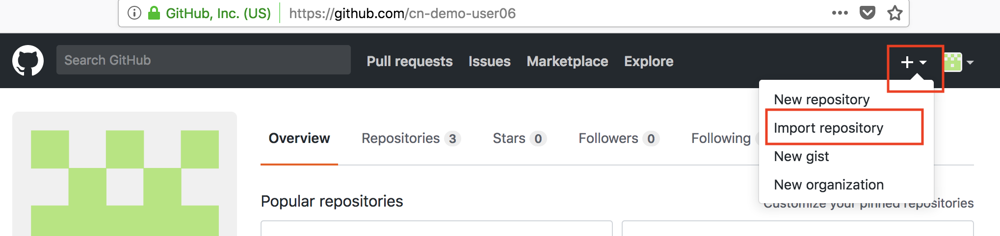

Now enter the source repository URL and your new repository name:
- Enter the following URL into "Your old repository’s clone URL" : https://github.com/CloudTestDrive/angular-node-creditscore-mini
- Enter the name of your new repository, using your "userxx" prefix: for example "user04-angular-node".  Only use small caps in the name of the repository !!

**ATTENTION : read the above AGAIN : ONLY SMALL CAPS FOR THE NAME OF YOUR REPOSITORY !!!**

- After removing the uppercases from your repository name, click on "Begin Import"

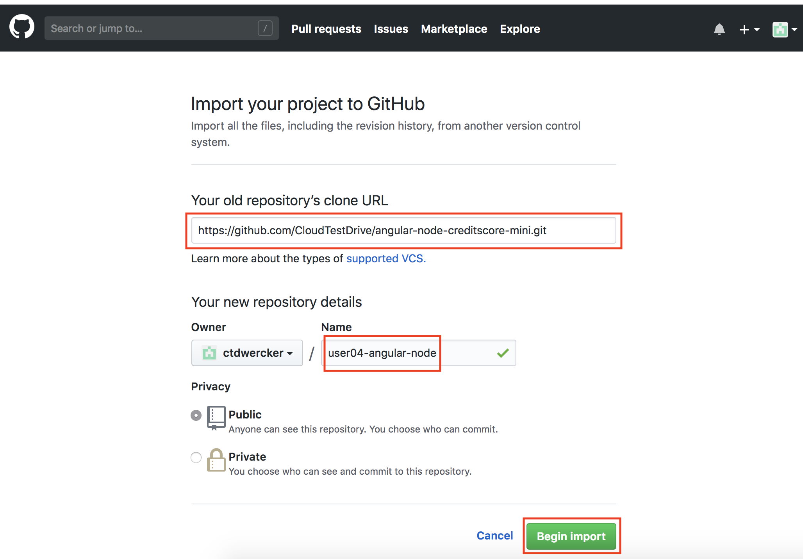

Now your repository is created, navigate to the top level page.

### Config files for Wercker pipelines ###
On the top level of your repository, click on the "wercker.yml" file.  The configuration should look like the below:

	box: node:6.10
	build:
	  steps:
	    - script:
	        name: A step that executes `npm install` command
	        code: npm install  
	
	push-to-releases:
	  steps:
	    # Push to public docker repo Container Registry (CR)
	    - internal/docker-push:
	        username: $DOCKER_USERNAME
	            password: $DOCKER_PASSWORD
	            repository: $DOCKER_REPO
	            registry: $DOCKER_REGISTRY
	        tag: $WERCKER_GIT_BRANCH-$WERCKER_GIT_COMMIT
	        cmd: node /pipeline/source/app.js
	
	deploy-to-oke:
	  box:
	        id: alpine
	        cmd: /bin/sh
	  steps:
	    - bash-template
	    
	    - kubectl:
	        name: delete namespace
	        server: $KUBERNETES_MASTER
	        token: $KUBERNETES_TOKEN
	        insecure-skip-tls-verify: true
	        command: delete namespace $WERCKER_APPLICATION_OWNER_NAME --ignore-not-found=true
	    ...	        
	    - kubectl:
	        name: create deplyoment
	        server: $KUBERNETES_MASTER
	        token: $KUBERNETES_TOKEN
	        insecure-skip-tls-verify: true
	        command: create -f $WERCKER_ROOT/kubernetes-deployment.yml --namespace=$WERCKER_APPLICATION_OWNER_NAME
		...	
	
	rest-functional-test:
	  steps:
	    - script:
	        name: Test Microservice
	        code: |
	              mkdir -p "/pipeline"
	              node $WERCKER_ROOT/app.js &
				  ...

The *wercker.yml* defines the configuration of your automation pipelines with a collection of Steps that you wish to execute.
In your *wercker.yml* you can specify any pipeline you like. Examples of pipeline names: *build*, *push-to-releases, rest-functional-test*, etc.

A pipeline can have its own base box (Docker container), like in this example the *node:6.10* official Node.js Docker container. You can use different base boxes per pipeline.

As you can see in this configuration we have the default pipeline *build* which executes the *npm-install* build, a *push-to-releases* pipeline which will upload the container packaged application to Oracle Container Registry, a *deploy-to-oke* pipeline which deploys the application to Oracle Container Engine and the *rest-functional-test* pipeline which is intended to test the application during the CI/CD workflow. You will create these pipelines in the next steps.

Please also note the environment variables ($KUBERNETES_MASTER, $KUBERNETES_TOKEN) usage which enables flexible configuration and safe authentication. When the pipelines and the workflow created you will define these variables and set the values.

### Modifying the kubernetes-deployment.yml.template and ingress.yml.template files ###

As all participants will be deploying to the same Kubernetes environment, we will now change the configuration files to make them specific for you by adding your user number to a few K8S artifacts.

- Open your github page, navigate to the top level of your repositoy
- open the kubernetes-deployment.yml.template file and click the "Edit" icon

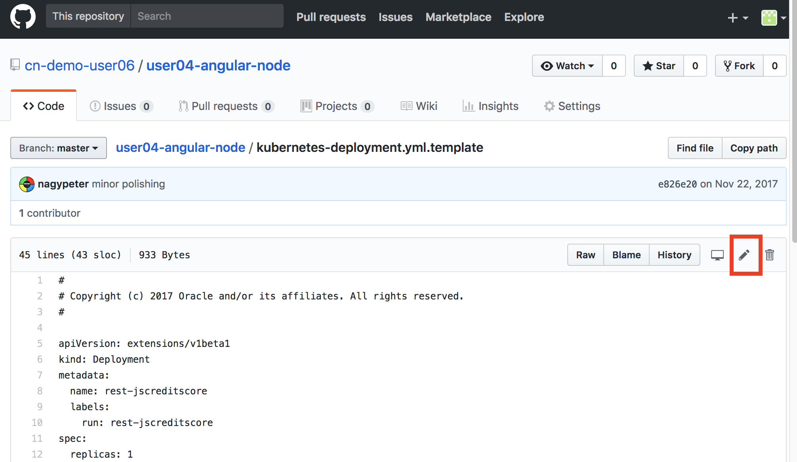

- Change all objects named "rest-jscreditscore" by adding your user number at the end: for example "rest-jscreditscore03"
- Change the port number of your Service to "81xx", where xx is your user number (01, 02, ... 20)

The resulting file for user03 should now look like this :

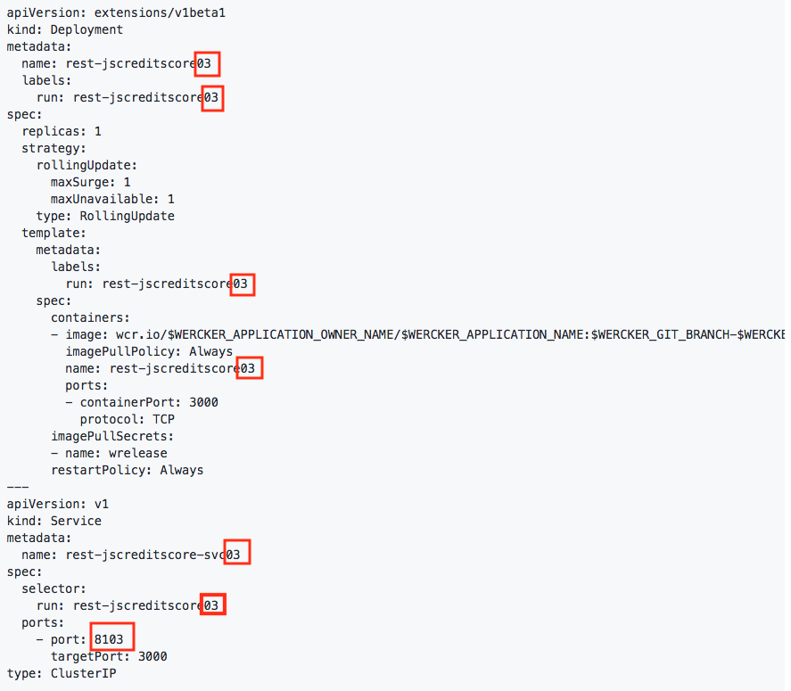

Commit the changes to the master branch of your repository (at the bottom of the screen)

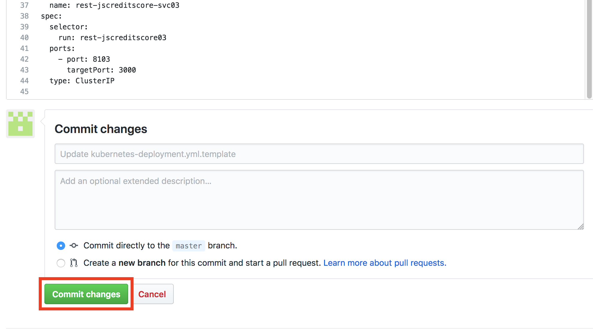

Now edit the file called "ingress.yml.template".  This file controls the load balancer that provides external access to your application running on one ore more pods inside the K8S environment.

- Change the name "rest-jscreditscore-ing" to "rest-jscreditscore-ingxx" where xx is your user number
- Change the port number to use the same port "81xx" you specified in the previous file
- Change the path to comprise "userxx" at the end

As an example, the resulting file for user03 would look like below:
​		  
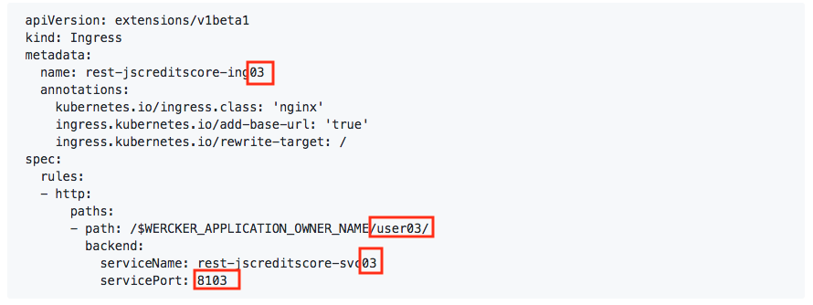

Commit the changes before moving to the next step.

### Create application pipelines ###

Change to the browser where [https://app.wercker.com](https://app.wercker.com) is open. Select **Pipelines** and click **Create an application** to create a new pipeline. (You can click on the plus sign at the top right corner and select **Add application** too.)

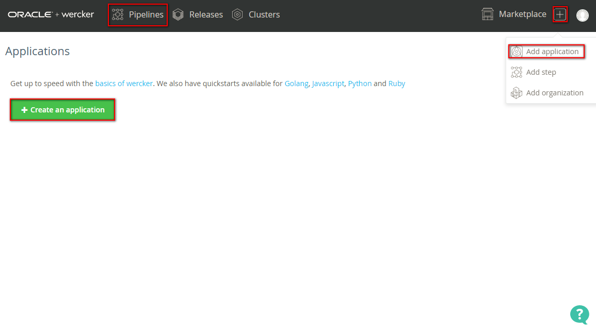

Select the application owner. Use the default user and don't select the organization if exists.

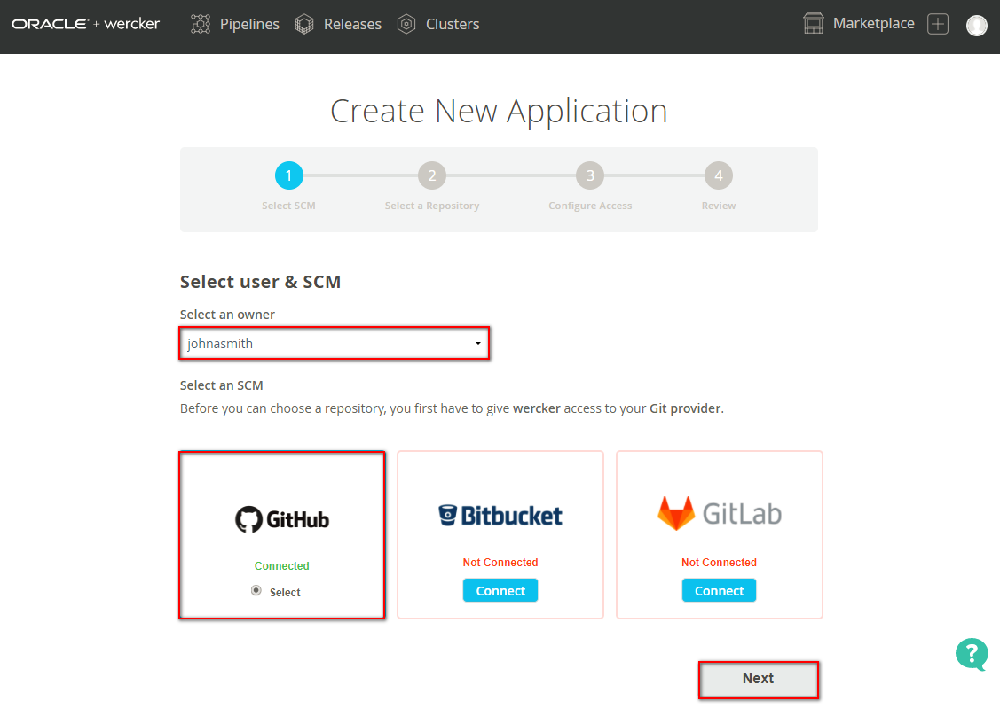

Now select the repository you just created and that contains your "userxx" prefix.  Next click **Use selected repo**.

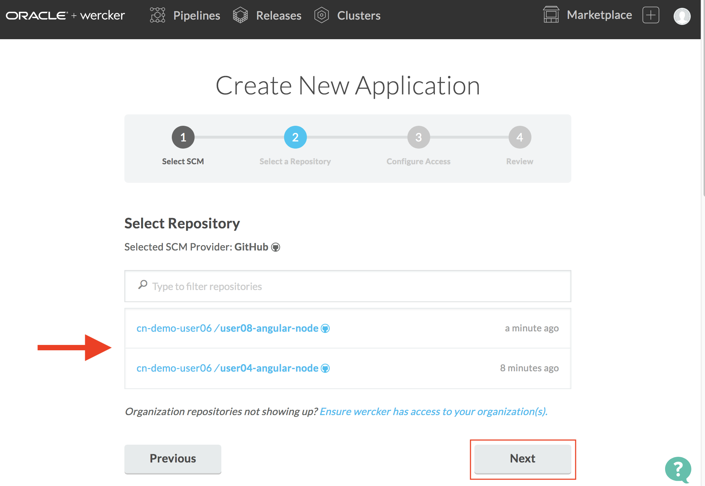

In case of private repositories you should define the access method. Since the the sample repository created as public you can leave the default checkout method. Click **Next step**.

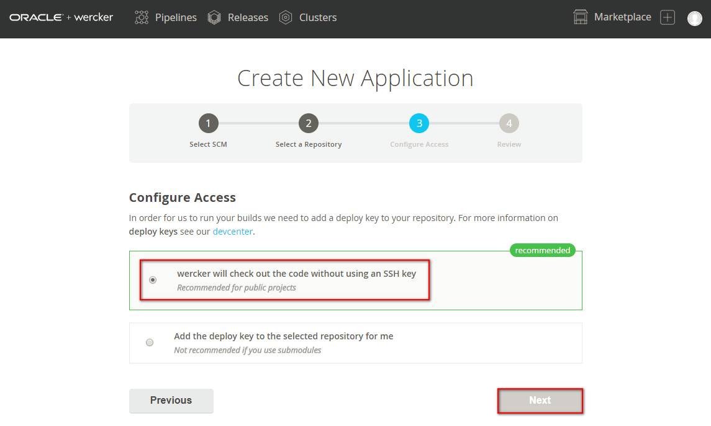

Finally you can choose whether your application is public or not. We recommend to leave default which means the application will be private. Click **Finish** to create your application.

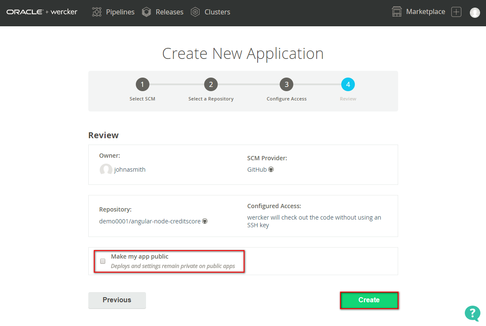

You will now land on a page where you are invited to create a new wercker.yml file

**We will not do this here, as our wercker.yml file is already on the top level of our Github repository**

### Define CI/CD workflow ###

In this use case our CI/CD workflow has two potential forked routes of the flow. One for non-master (any patch) branch to test the application changes. The a second one for master branch to store and deploy the modified and tested application.

Now select the **Workflow** tab and define the first pipeline. As mentioned upon creating a project in Wercker, it creates a *build* Workflow with a Git hook which executes a build pipeline. This means whenever you push changes into your github repository then a new build will be triggered. Now add a new pipeline what will do the Docker container image push to Oracle Container Registry. Click **Add new pipeline**.

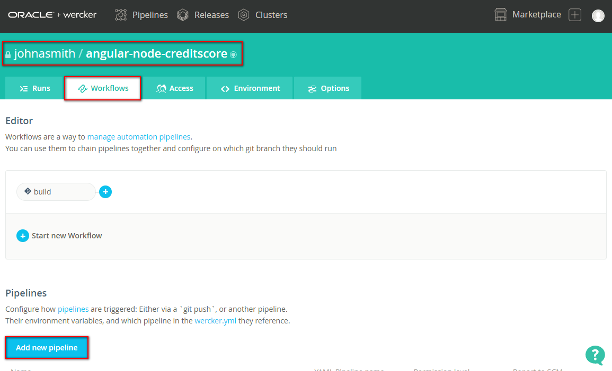

+ **Name**: *push-to-OCR* (but can be anything else)
+ **YML Pipeline name**: it has to be *push-to-releases*, because we already defined this pipeline using this name in  the *wercker.yml*.
+ **Hook type**: leave default to chain this Pipeline.

Finally click **Create**.

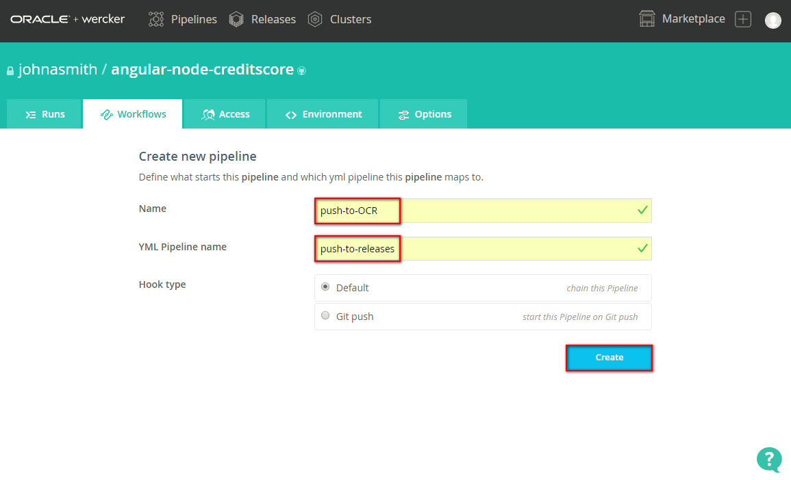

Go back to the Workflow page and click **Add new pipeline** again.

+ **Name**: *functional-test* (but can be anything else)
+ **YML Pipeline name**: it has to be *rest-functional-test*, because we already defined this pipeline using this name in  the *wercker.yml*.
+ **Hook type**: leave default to chain this Pipeline.

Finally click **Create**.

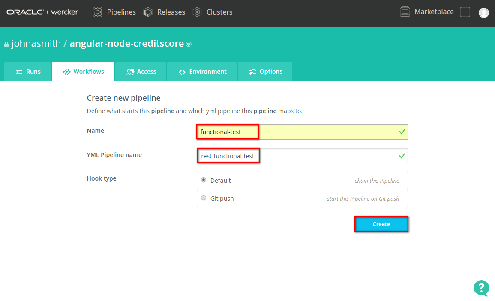

Go back to the Workflow page and click **Add new pipeline** again.

+ **Name**: *deploy-to-Prod* (but can be anything else)
+ **YML Pipeline name**: it has to be *deploy-to-oke*, because we already defined this pipeline using this name in  the *wercker.yml*.
+ **Hook type**: leave default to chain this Pipeline.

Finally click **Create**.

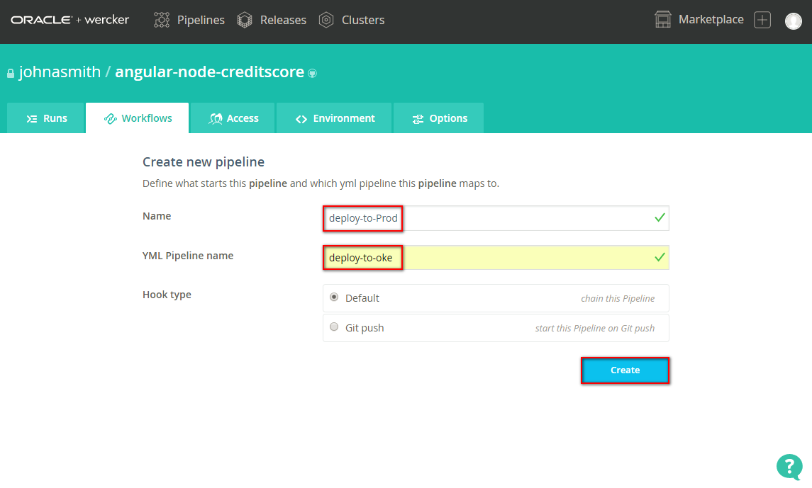

Go back to the Workflow page and you have to see your new pipelines.

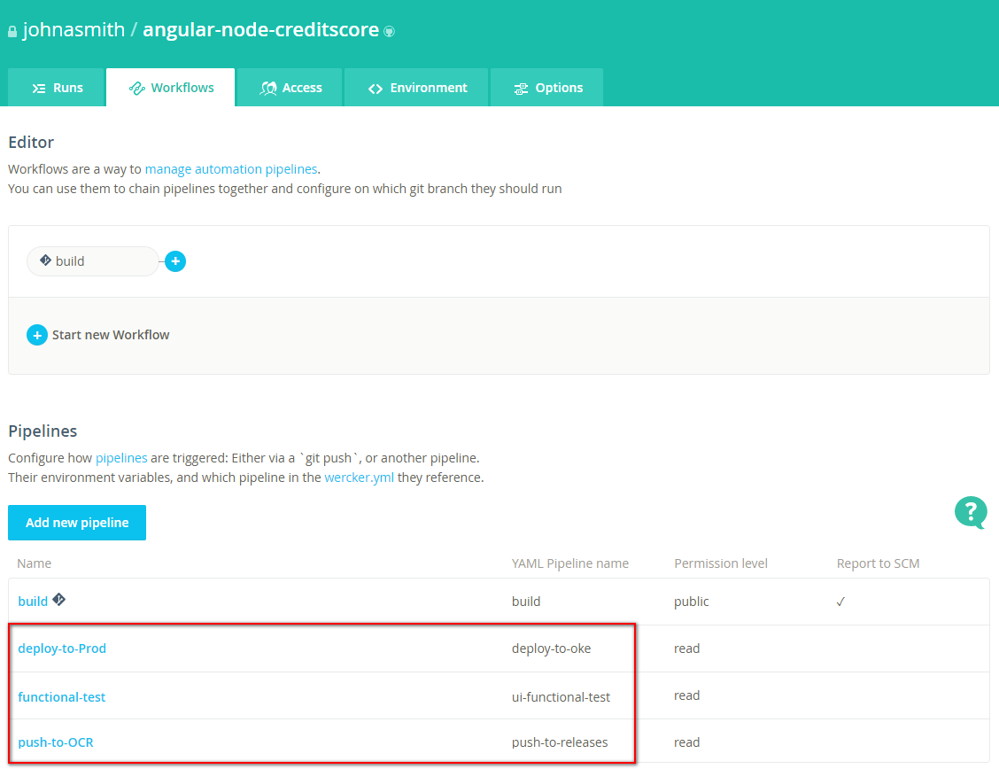

The next step is to define the workflow using the pipelines. First define the workflow route for master (tested application allowed to store and deploy) branch. Click the blue plus icon after the *build* pipeline to add the container registry store pipeline. Set *master* branch as routing filter and select the *push-to-OCR* pipeline from the **Execute pipeline** dropdown list. Click **Add**.

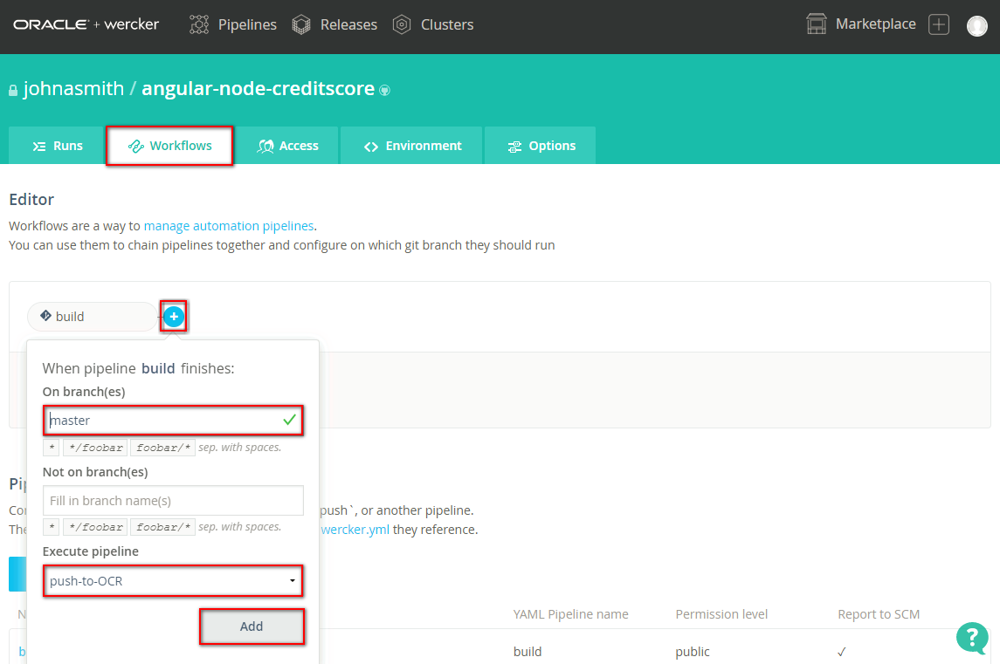

Click the blue plus icon after the *push-to-OCR* pipeline to add the container engine deploy pipeline. Leave the default *master* branch as routing filter and select the *deploy-to-Prod* pipeline from the **Execute pipeline** dropdown list. Click **Add**.

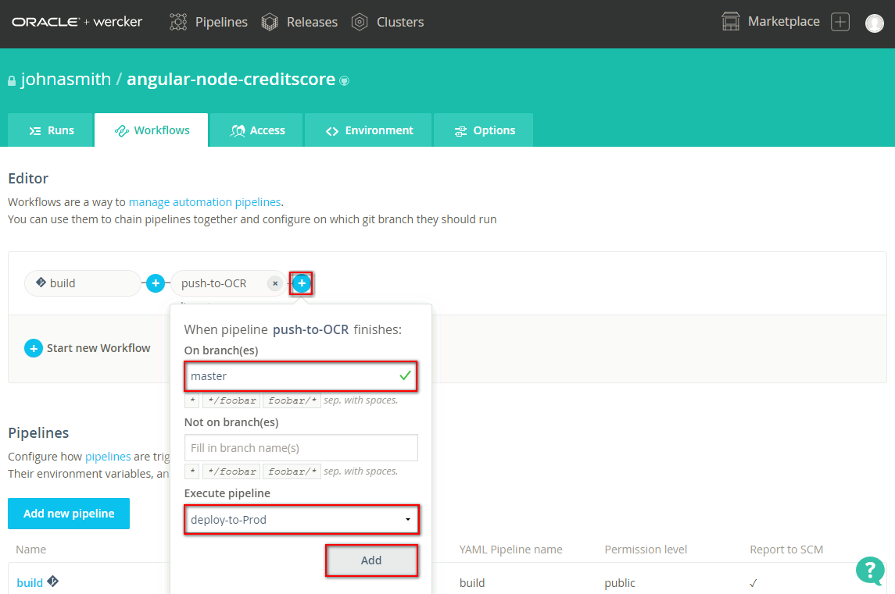

Now define the test route of the workflow for non-master (patching) branches. Click the blue plus icon after the *build* pipeline to add the functional test pipeline. Set *master* for **Not on branch(es)** as routing filter and select the *functional-test* pipeline from the **Execute pipeline** dropdown list. Click **Add**.

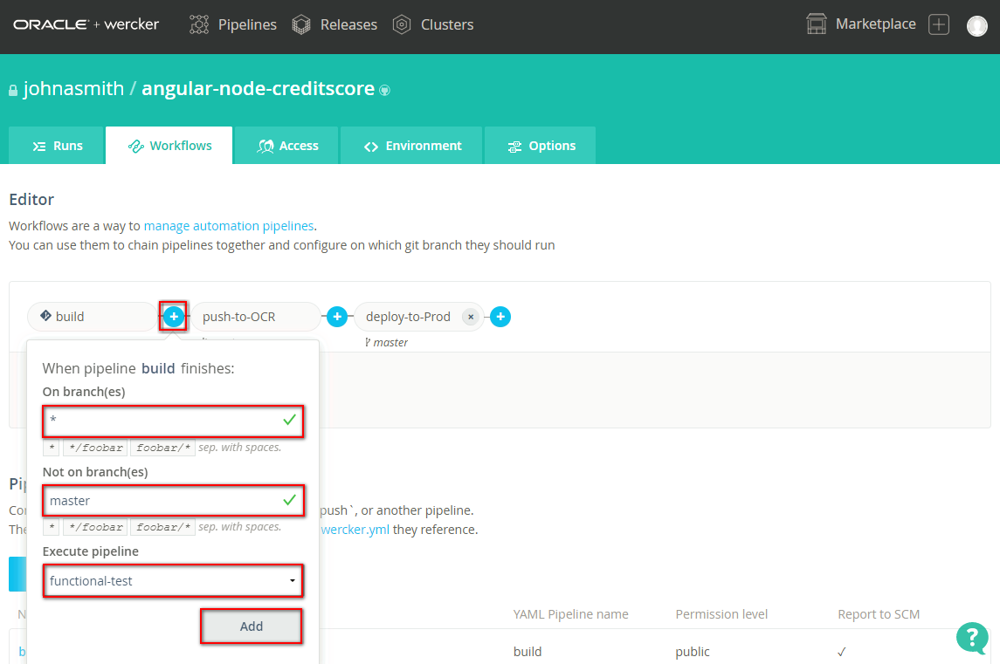

Now the workflow for simple DevOps use case is ready.

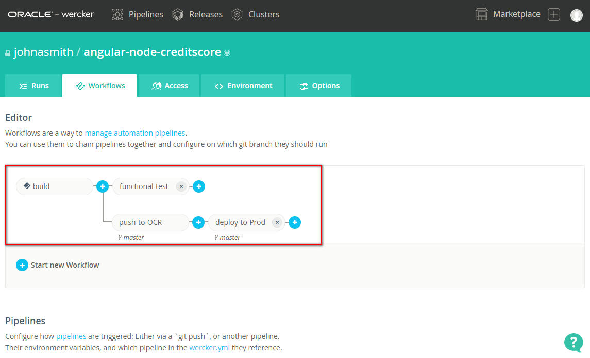

### Define configuration variables ###

The only thing what is missing to run the workflow is the enviroment configuration. The pipelines basically run within Oracle Container Pipelines but at the and of a successful build the workflow stores the packaged application to Oracle Container Releases (~Docker Registry) and deploy to Oracle Container Engine (Kubernetes Cluster) what require authentication and address. At the beginning of this tutorial you created personal token and gathered the Oracle Container Engine instance (master node) adddress. These two parameters will determine the deployment environment and ensure the access.

First you need to collect some information to populate these variables.  Copy these strings in a text editor window on the side for easy manipulation

- Open the kubeconfig file you downloaded previously, and copy following 2 elements 
- Copy the Kubernetes Server address 
- Copy the user token

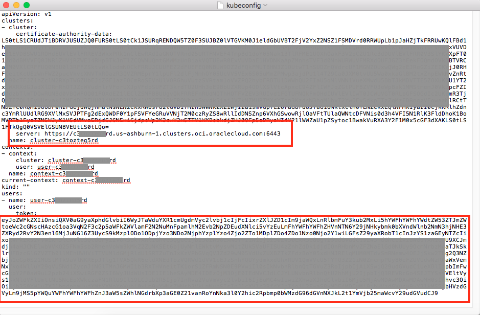

You will also need to use the "Region Key", depending on the datacenter where your cluster has been launched.  You can see your current region on all screens of the OCI console, in the upper right corner.

Depending on your datacenter, use the below codes:

|Region Location|Region Name|Region Key|
|------|------|------|
|Phoenix, AZ metropolitan area|us-phoenix-1|PHX|
|Ashburn, VA|us-ashburn-1|IAD|
|Frankfurt, Germany|eu-frankfurt-1|FRA|
|London, United Kingdom|uk-london-1|LHR|

Identify your Tenancy Name by navigating to "Administration", "Tenancy Details"

Go back your application select **Pipelines** and your application **userxx-angular-node**.

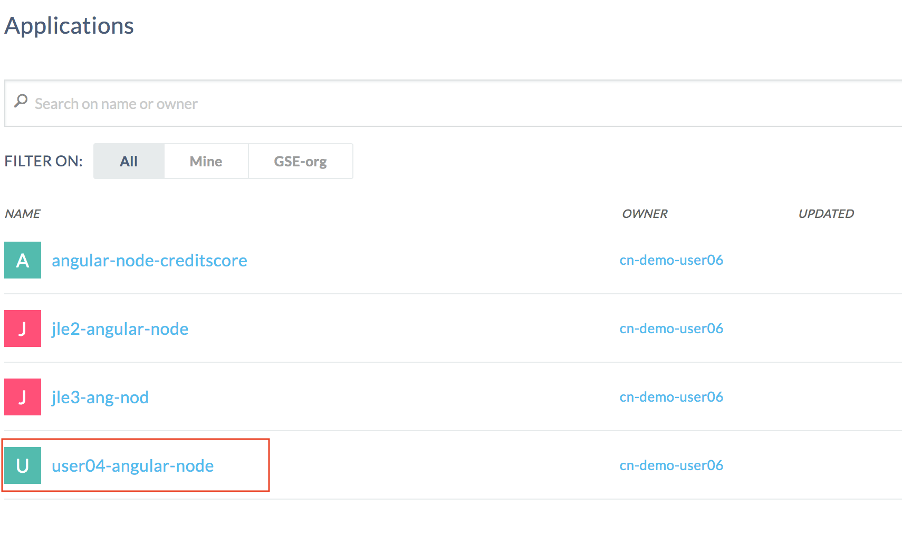

The pipelines can have independent variables per pipelines or *global* scope variables. To simplify the configuration define *global* scope variables. Click the **Workflow** tab then select **Environment** tab. Set the name and value pairs for the following configuration variables.

+ **KUBERNETES\_MASTER** = Use the Kubernetes Server address you copied from the kubeconfig file 
+ **KUBERNETES\_TOKEN** = the user token you copied from the kubeconfig file
+ **DOCKER_REGISTRY** = https://fra.ocir.io/v2 . 
   + Replace the "fra" if required by the Region Key of your region
+ **DOCKER_REPO** = fra.ocir.io/oractdemeabdmnative/userxx
   + Replace the "fra" if required by the Region Key of your region
   + Replace "oractdemeabdmnative" by the name of your Tenancy
   + where xx at the end is your prefix ID (example 03) or initials
+ **DOCKER_SERVER** = fra.ocir.io 
   + Replace the "fra" if required by the Region Key of your region
+ **DOCKER_USERNAME** = oractdemeabdmnative/api.user
   + Replace "oractdemeabdmnative" by the name of your Tenancy Name
+ **DOCKER_PASSWORD** = this is the Authentication Token of the OCI account you used to create the K8S cluster.  
   + When using an instructor-provided OKE instance, this token will be provided by your instructor in separate file called "docker_password_token".  
   + If you created your own OKE instance, you need to create yourself a token for your user, via the "Identity", "Users" tab of the menu.

When you need to add new variable click **Add** button which saves the current row and add a new one. You can use the **Protected** tick box to store safely your value e.g. personal token.

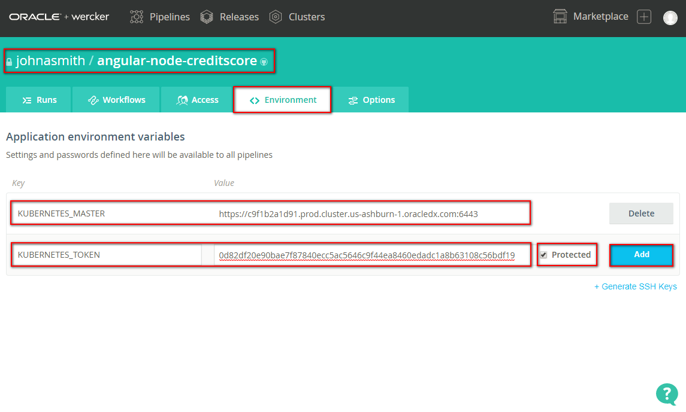

### Execute the workflow ###

In general the workflow is triggered by git changes, but first time you need to start. Switch to **Runs** tab and select **trigger a build now** link.

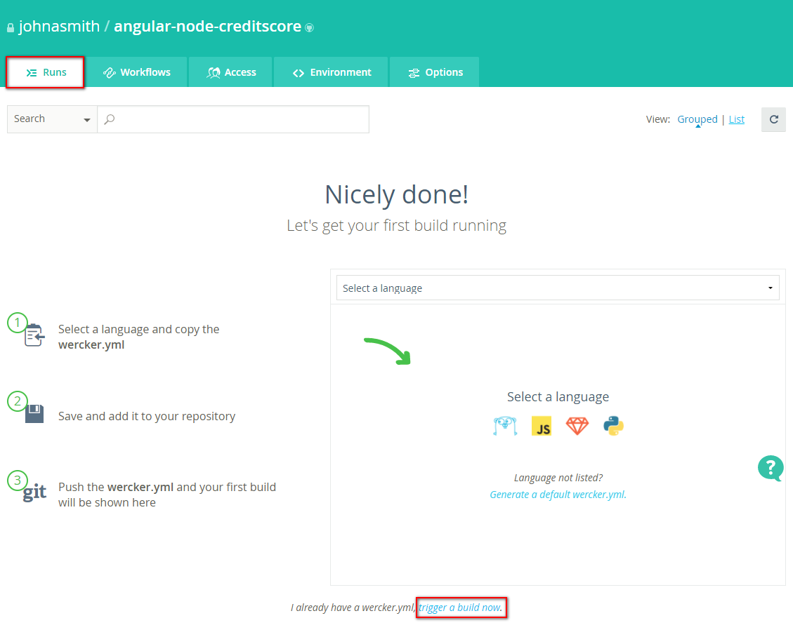

When the build started it change to the build step's logs.

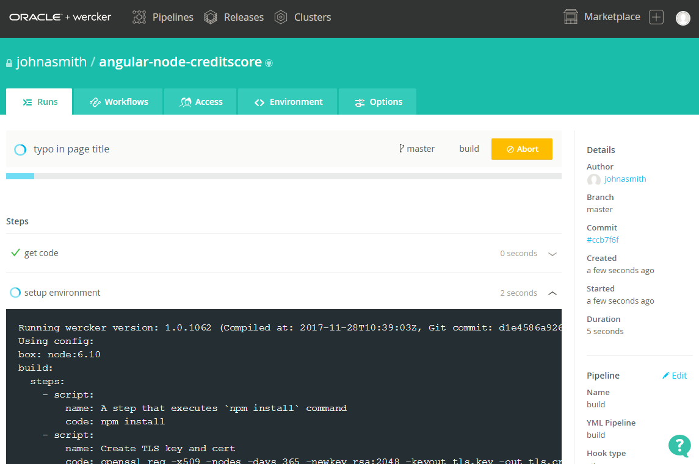

Select **Runs** tab to monitor the workflow status.

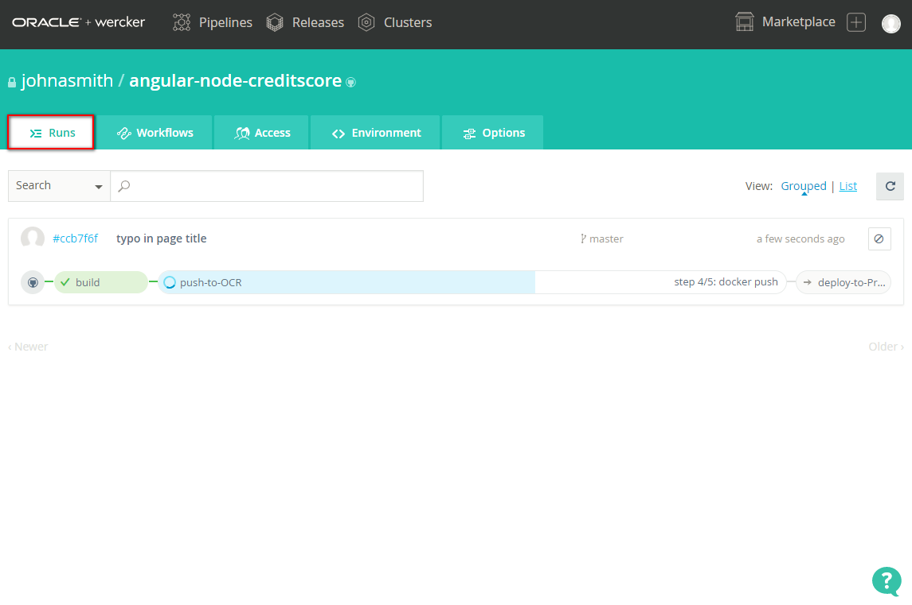

When the workflow is completed click on the last *deploy-to-Prod* pipeline.

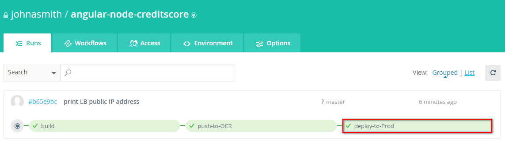

Scroll down to open the *get LoadBalancer public IP address* step and check the log. At the end of the log copy the Public IP address of the Ingress controller.

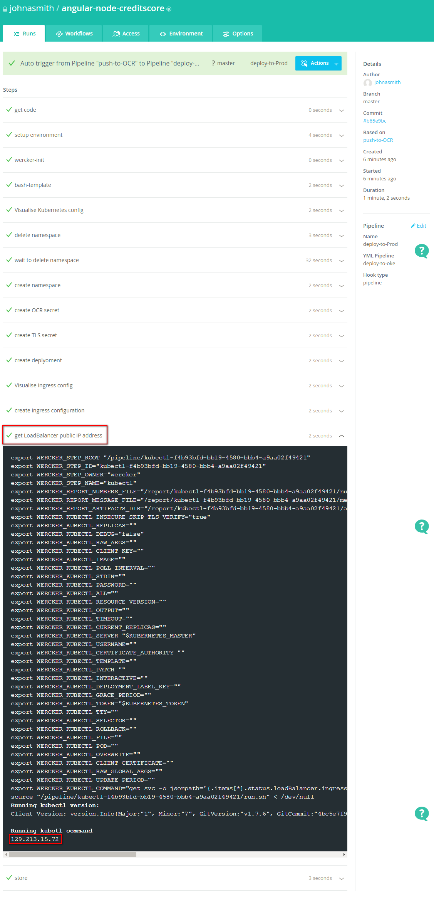

Open a new browser window or tab and open your sample application using the following URL: `https://PUBLIC_IP_ADDRESS/USERNAME/userxx/`. Where the USERNAME is your Oracle Container Pipelines (Wercker) user name. It should be a similar to: `https://129.213.15.72/ctdwercker/userxx/`

Due to the reason that the proper certification hasn't been configured you get a security warning. Ignore and allow to open the page.

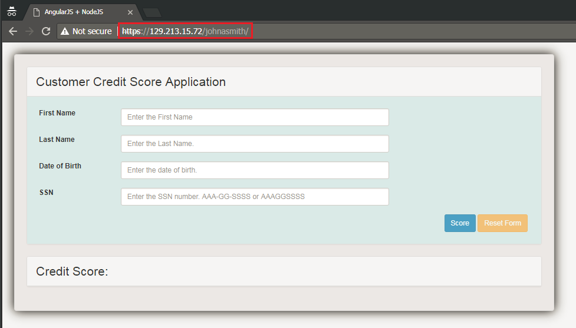

Test your Credit Score application using sample data.

#### Making a change to your application ####

So you spend quite some time setting up this CI/CD pipeline.  But as a result, changing your application and immediately making that change available is extremly easy!

+ Return to your github repository **ctdwercker/userxx** and navigate to the file "views/index.ejs
+ Hit the "Edit" icon and scroll to line 12 of the file: this is the title of the application.
+ Edit the text to include something specific to you, for example change the title :
	+ from "Container Native Customer Credit Score Application" 
	+ to "John Doe's Container Native Customer Credit Score Application"

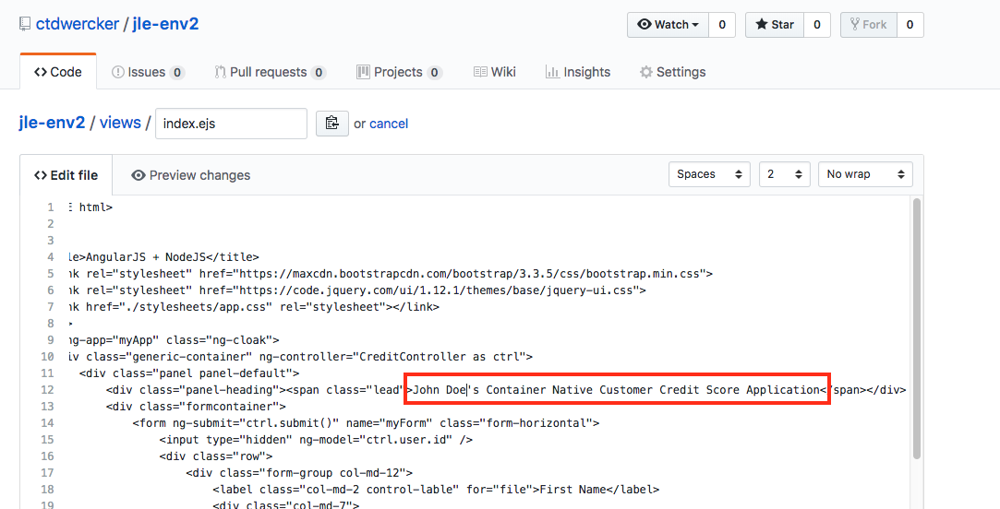

+ Now hit the "Commit Changes" button below to kick-off the workflow
+ Navigate to your wercker window, and click the "Runs" tab on top if necessary.  You will see a new build has started, building and deploying your changes to the server.
+ Once the build is finished, navigate back to the sample application and hit the refresh button of your browser ... your changes have been deployed!

### Install Kubernetes command line interface ###

You now need to install the kubectl command line interface on your local machine:

[Instructions to Install kubectl](kubectl_install.md)

In case you installed your own cluster you probably already performed this step, so you can skip this step.

### Validate your deployment via the Kubernetes Web UI ###

Launch your dashboard as described in the previous session (using the kubectl proxy commans), and navigate to the dashboard from your local machine:

​	 [http://localhost:8001/api/v1/namespaces/kube-system/services/https:kubernetes-dashboard:/proxy/#%21/overview?namespace=default](http://localhost:8001/api/v1/namespaces/kube-system/services/https:kubernetes-dashboard:/proxy/#%21/overview?namespace=default).  

If you used a different proxy port, replace the port number in the above link as appropriate. 

Now navigate to the namespace where you deployed your application.  If you followed the tutorial so far, this namespace will have the same name as your github and wercker user: **ctdwercker**.

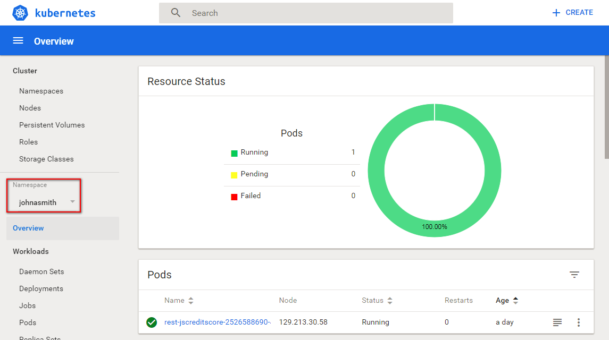

There you can see your Pods, Deployments, Services, etc. and their status. Basically your container deployed (rest-jscreditscore deployment) on a pod (rest-jscreditscore-25265xxxxxx pod) and exposed through a service (rest-jscreditscore-svc service). To have external IP address you created an Ingress rule (rest-jscreditscore-ing ingress) what configure your name as context path on the shared (common) Ingress controller. The shared Ingress controller is a NGINX deployment which has an External Public IP address.

### Scale out horizontally your application ###

Currently you have one application instance (pod) up and running what you deployed manually. Because of replica definition it created a Replica Set. A Replica Set ensures that a specified number of pod replicas are running at any one time. In other words, a Replica Sets makes sure that a pod or a homogeneous set of pods is always up and available. 

To scale your application first use the dashboard. Find your *rest-jscreditscore<Your Number>* deployment and click on the option menu on the right side and select **Scale**.

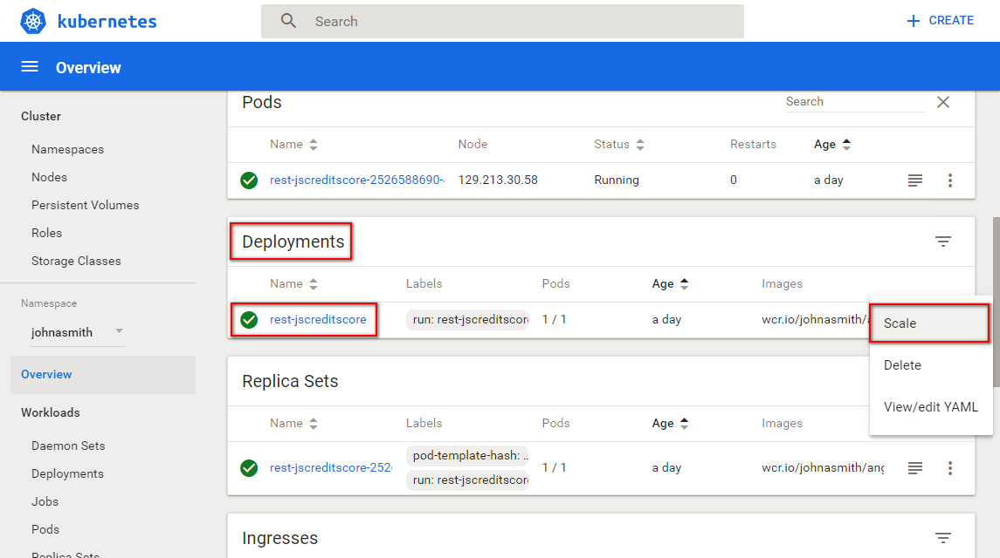

Define the desired number of instances and click **OK** to confirm.

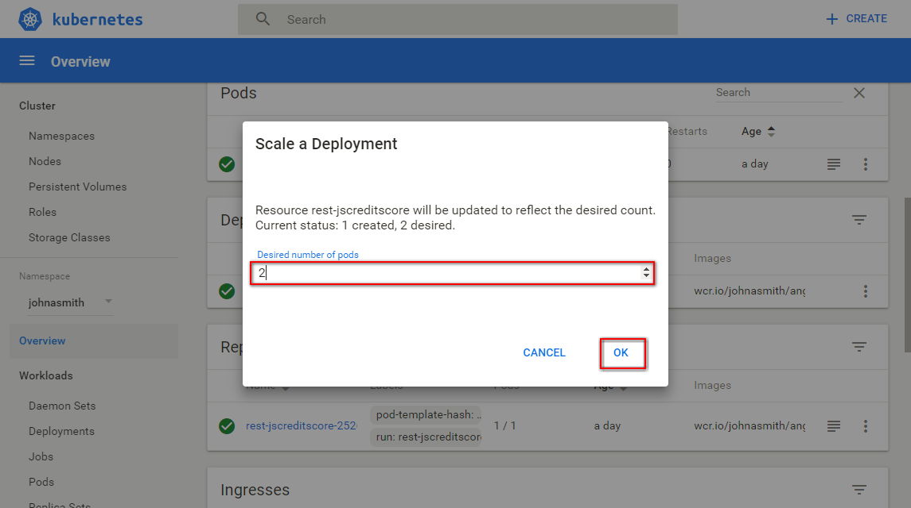

Wait till the new pod is up and running.

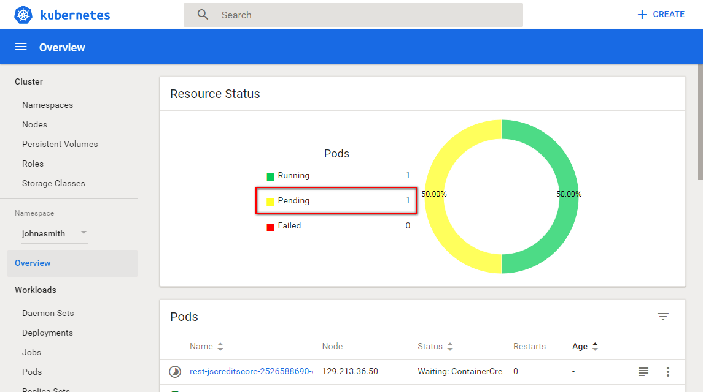

### Manage deployment using `kubectl` ###

The dashboard is nice, but mostly CLI is the preferred tool. So let's get familiar with `kubectl` beyond the version command.

#### Scale in horizontally your application ####

In the previous step you scaled out your application using the Web UI now shrink it using `kubectl`. Open a terminal and if necessary set KUBECONFIG variable to point your kubeconfig file location. First list your pods.

	$ kubectl get pod -n=<YOUR_WERCKER_USERNAME>
	NAME                                  READY     STATUS    RESTARTS   AGE
	rest-jscreditscore-2526588690-4tvrm   1/1       Running   0          1d
	rest-jscreditscore-2526588690-cc38l   1/1       Running   0          16m

All the running pods listed. To decrease the number of pods simply set a new size for Replica Set by using the scale command.  Identify the Replica Set using your deployment name and user number. Please note and change(!) properly your namespace's name before execute the scale command.

	$ kubectl scale --replicas=1 deployment/rest-jscreditscore<YOUR_ID> -n=<YOUR_WERCKER_USERNAME>

The scale down is fast so probably when you refresh your Web UI (dashboard) you already can see only one pod is running. You can also check the number of pods using the previous *get pod* command. Instead of this get more detail about your deployment using the following command. (Don't forget to change the namespace parameter value.)

	$ kubectl describe deployment rest-jscreditscore<YOUR_ID> -n=<YOUR_WERCKER_ID>
	Name:                   rest-jscreditscore
	Namespace:              johnasmith
	CreationTimestamp:      Mon, 04 Dec 2017 16:35:44 -0500
	Labels:                 run=rest-jscreditscore
	Annotations:            deployment.kubernetes.io/revision=1
	Selector:               run=rest-jscreditscore
	Replicas:               1 desired | 1 updated | 1 total | 1 available | 0 unavailable
	StrategyType:           RollingUpdate
	MinReadySeconds:        0
	RollingUpdateStrategy:  1 max unavailable, 1 max surge
	Pod Template:
	  Labels:  run=rest-jscreditscore
	  Containers:
	   rest-jscreditscore:
	    Image:        wcr.io/johnasmith/angular-node-creditscore:master-fded509347eb44a3d82d93a021cb4439a158b09e
	    Port:         3000/TCP
	    Environment:  <none>
	    Mounts:       <none>
	  Volumes:        <none>
	Conditions:
	  Type           Status  Reason
	  ----           ------  ------
	  Available      True    MinimumReplicasAvailable
	OldReplicaSets:  <none>
	NewReplicaSet:   rest-jscreditscore-2526588690 (1/1 replicas created)
	Events:
	  Type    Reason             Age               From                   Message
	  ----    ------             ----              ----                   -------
	  Normal  ScalingReplicaSet  47s (x2 over 6h)  deployment-controller  Scaled down replica set rest-jscreditscore-2526588690 to 1

This is a more detailed description of your deployment where you can see the count and status of *Replicas*.

	Replicas:               1 desired | 1 updated | 1 total | 1 available | 0 unavailable

Please note the entry at the *Events*:

	Events:
	  Type    Reason             Age               From                   Message
	  ----    ------             ----              ----                   -------
	  Normal  ScalingReplicaSet  47s (x2 over 6h)  deployment-controller  Scaled down replica set rest-jscreditscore-2526588690 to 1

The event is about the scale down operation.

## Next Steps ##

This is the end of the first exercise on Container pipelines. Follow the link below to go back to the main Container Native page, where other steps are available.

---
[Go to Container Lab Overview Page](readme.md)
