[Go to Overview Page](README.md)


# Building Multi-Cloud Apps

## Initial setup on Microsoft Azure: Creating VNet with subnets and virtual network gateway


#### **Introduction**

In this lab you will prepare your Azure account for hosting .NET application. You will first create an Azure [Virtual Network (VNet)](https://docs.microsoft.com/en-us/azure/virtual-network/virtual-networks-overview) with the application [subnet ](https://docs.microsoft.com/en-us/azure/virtual-network/virtual-network-manage-subnet), that host a virtual machine. Then, in order to enable private connection to the Autonomous Database, which resides in Oracle Cloud Infrastructure, you will create an Azure [Virtual Network Gateway](https://docs.microsoft.com/en-us/azure/expressroute/expressroute-about-virtual-network-gateways) The last step of the initial configuration on Azure side is to create a VM and connect to it. You will use it later for developing and deploying .NET application.

Here is the architecture, which you are going to create.

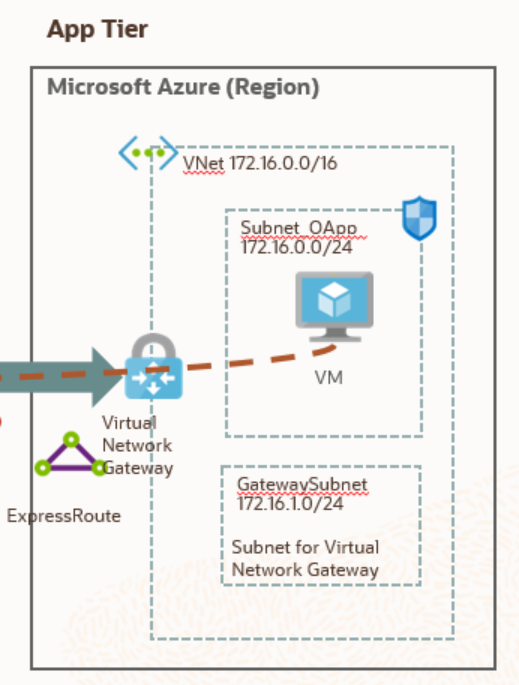

Lets get started!

## Steps

### **STEP 1: Create an Azure Virtual Network (VNet)**

- Sign in to the [Azure portal](https://portal.azure.com/). 

  On the upper-left side of the screen, select Create a resource >  Networking > Virtual network.

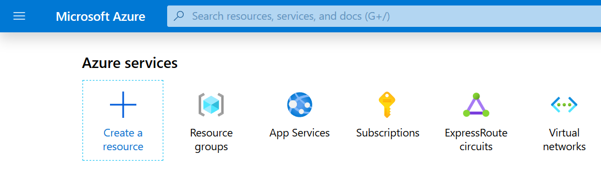

- Once you clicked on Virtual network, provide the required information:

  -  Enter a **Name**, such as **VNet_Azure_OCI**.

  -  Provide an **Address space** for virtual network in CIDR notation, such as **172.16.0.0/16**.

  -  Choose your **Subscription** (Free Trial, Pay-As-You-Go, Other).

  - Under **Resource Group**, click **Create New** and enter a **Name**, such as **OCI_Interconnection**. 

    See more about [Resource groups](https://docs.microsoft.com/en-us/azure/azure-resource-manager/management/overview#resource-groups).

  - Select **Location** for your VNet. 

     Keep in mind, that OCI/Azure Interconnections is only available at the moment in:

     - (Europe) UK South

     - (US) East US

     - (Canada) Canada Central

  -  Enter a **Name** of the Subnet, such as **AppSubnet**.

  - Provide an **Address range** for a subnet in CIDR notation, such as **172.16.0.0/24**.

    It must be contained by the address space of the virtual network.
  
  -  Leave the rest of settings to default.
  
  -  Click **Create**.
  
     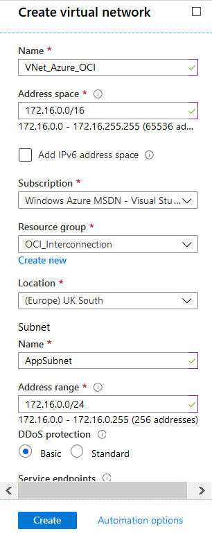

- Once your VNet with a Subnet is created, you will get notification on the upper-right side of the screen:

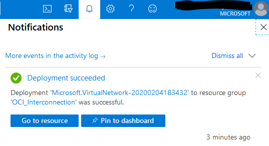

This creates a virtual network (VNet) and a subnet, which are scoped to a single region within an Azure. Resources within a virtual network can communicate outbound with the internet, by default. An inbound connection can be achieved by attaching a public IP with the resource. You can also connect a virtual network with your on-premises network or other public clouds like Oracle Cloud Infrastructure by using [Azure ExpressRoute](https://docs.microsoft.com/en-us/azure/vpn-gateway/vpn-gateway-about-vpngateways?toc=%2fazure%2fvirtual-network%2ftoc.json#ExpressRoute). This connection is private and traffic does not go over the internet.

In order to create the interconnect between Azure virtual network and Oracle Cloud Infrastructure virtual cloud network (VCN), you must create a virtual network gateway. A virtual network gateway serves two  purposes: exchange IP routes between the networks and route network traffic.

### **STEP 2: Create a Virtual Network Gateway**

- On the upper-left side of the screen, search for ‘virtual network gateway’ resource and click on it. This is an easy way to search for any resource.

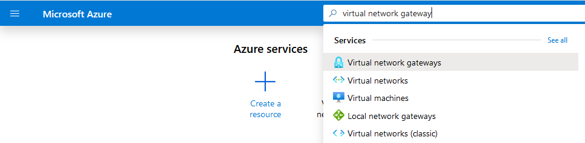

-  Click **Add** button on the left or **Create virtual network gateway** button in the middle of the Virtual network gateways screen:

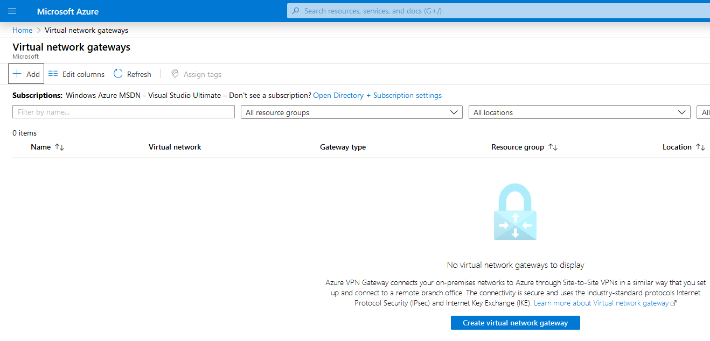

- Once you are on the Create virtual network gateway page, provide the required details:
  - Select your **Subscription** in Project Details section (if you have just one, it will be populated automatically).
  - In the **Instance Details **section, please provide:
    - A **Name** for a gateway, such as **Gateway_to_OCI**.
    - Select your **Region**, **(Europe) UK South** in this example.
    - Select **ExpressRoute** as a **Gateway type**.
    - Leave **SKU** type as **Standard** in order to don't generate big charges.
    - Select the **Virtual Network** you just created in the previous step: **VNet_Azure_OCI**.
    - A **Gateway subnet address range** should be automatically populated as **172.16.1.0/24**.       You can change it, if you want.
  - In the **Public IP address** section, please provide:
    - Select **Create new** as **the Public IP address**.
    - Enter **Public IP address name**, such as **OCI_Azure.**
- Click **Review + create** button at the bottom of the screen.

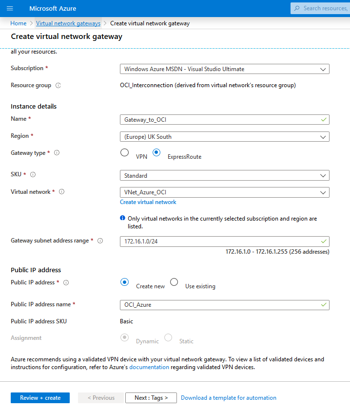

- Confirm a Virtual Gateway creation by clicking on **Create** button at the bottom of the screen.

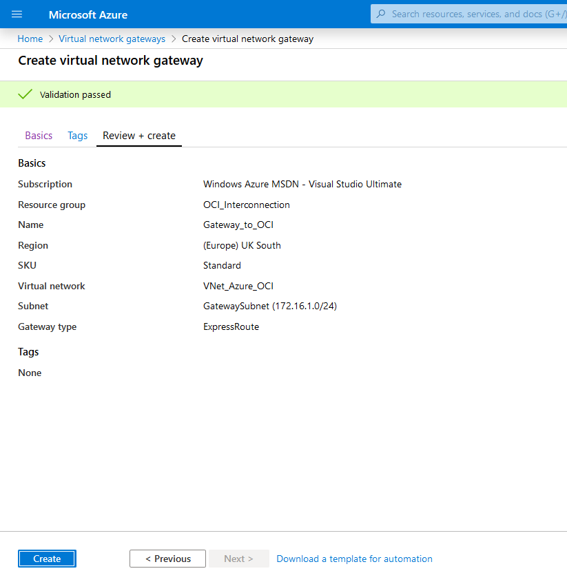

It make take up to 15-20 minutes for creating the virtual network gateway. 

### STEP 3: Create a Virtual Machine and connect to it

In the meantime, lets setup a virtual machine in your virtual network, where you will deploy your .NET application and test the connectivity to the database, once the interconnect is successfully setup.

- On the upper-left side of the screen click on hamburger menu, select **Create a resource** (you can see also Create a resource button under Azure services in the middle of the screen if you are in Azure Home screen).

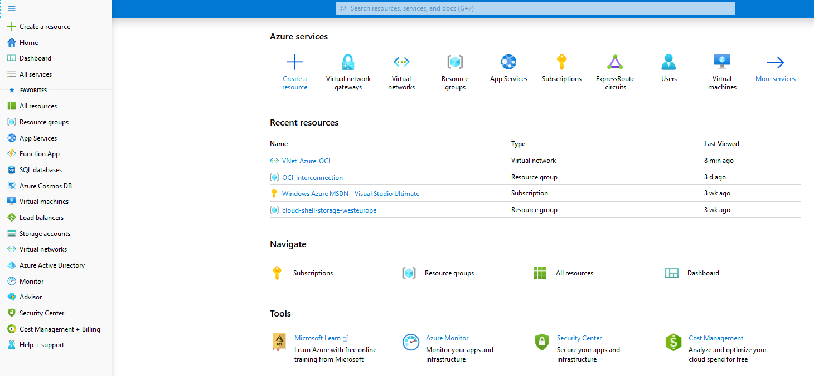

- On the next screen, please select **Compute** and then **Virtual Machine**.

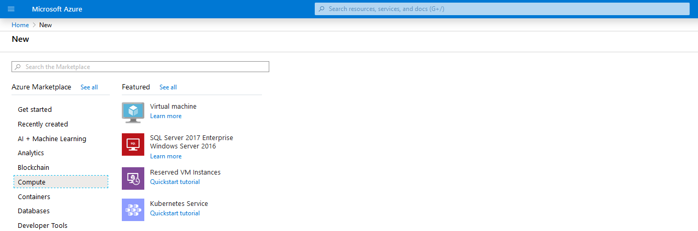

- On the **Create a virtual machine** screen provide the following details:
  - Select your **Subscription** in case you have many. Otherwise it will be selected automatically.
  - Select your **Resource Group**: **OCI_Interconnection**.
  - Enter a **Virtual machine name**, such as **MyApplication**.
  - Select your **Region**; (Europe) UK South in this example.
  - Select **Image** as **Windows Server 2019 Datacenter**.
  - **Availability Options** and **Azure Spot Instance** leave as default.

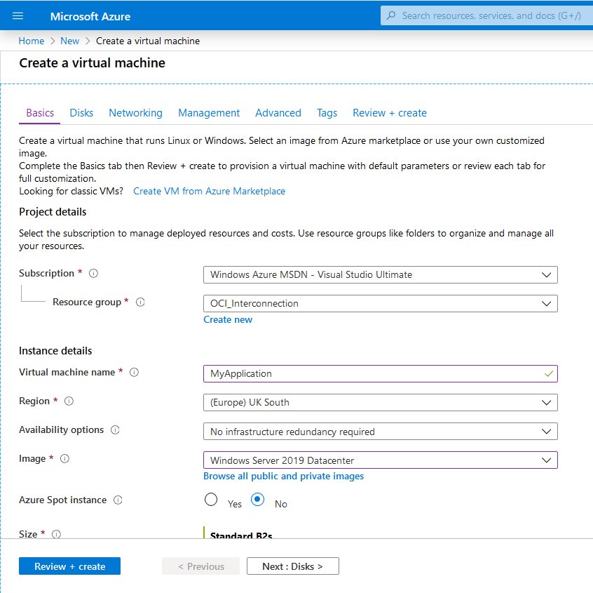

- Scroll down and provide the rest of the details:

  - Change the **Size** to **Standard B2s**.
  
- Specify the username and password for the **Administrator Account** as the below example: 
  
```
Username: myadmin
Password: WElcome_123#
```

  - Select **RDP (3389)** as the only allowed inbound port at the moment.
  - Click **Next : Disks >** at the bottom of the screen.


- Leave the Disk Option as default and click **Next : Networking >**.

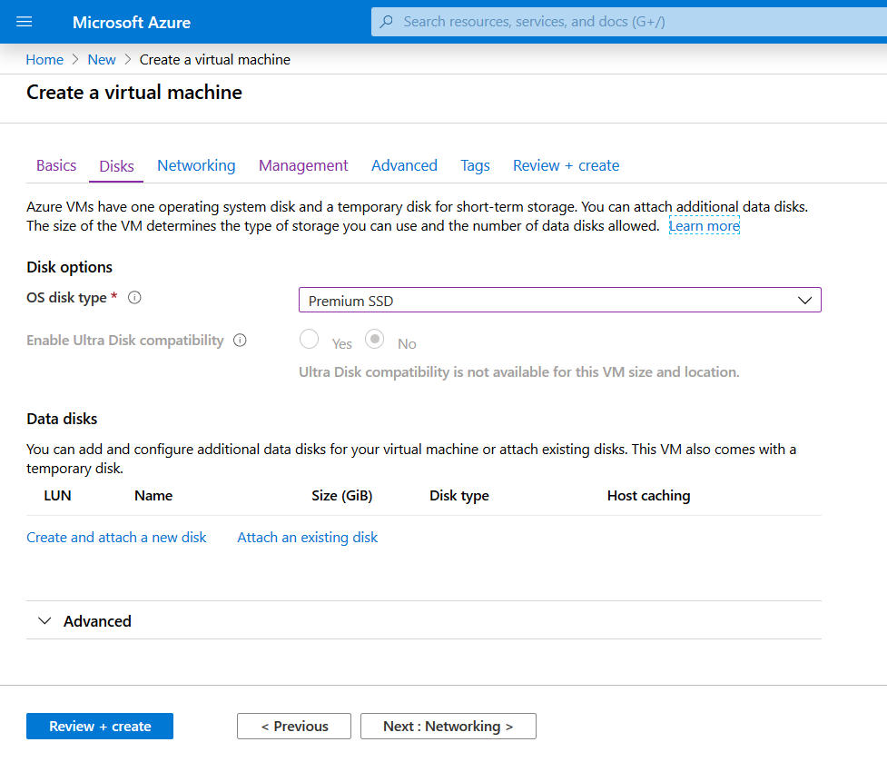

- Verify, that created previously **Virtual Network** and **Subnet** have been selected, as well as the **Inbound port RDP 3389**.

- Leave the rest of the options as default.

- Click **Review + create**. 

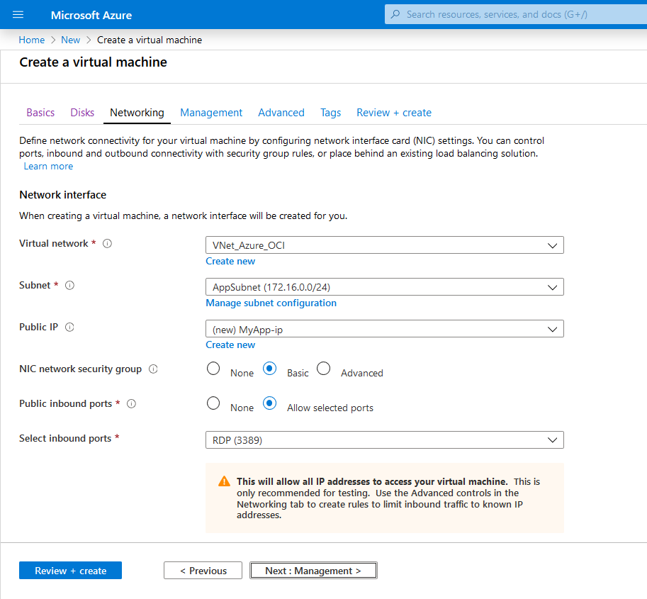

- Confirm the VM creation and click **Create**.

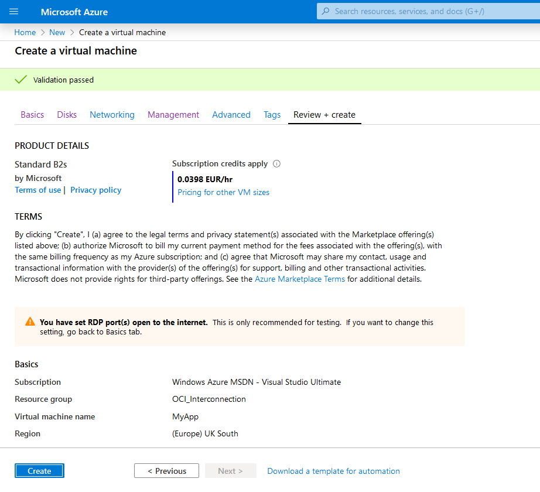

- Within a few minutes, you should get the message **Your deployment is complete**.
- Click **Go to resource** in order to check your VM details. 

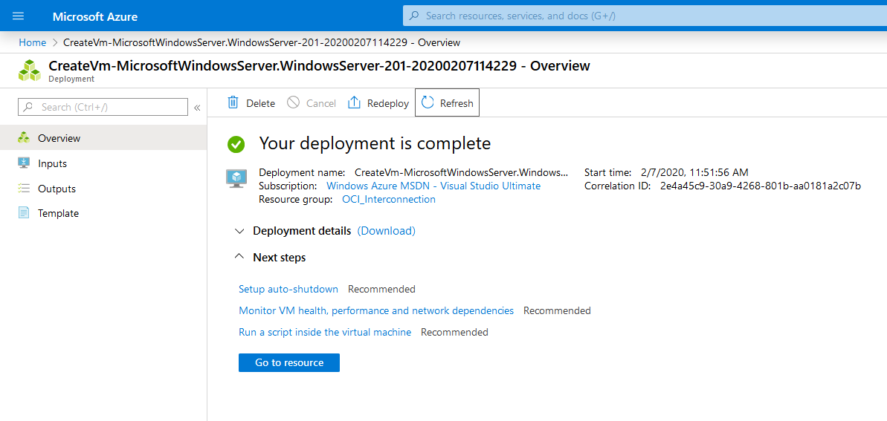

- On the Virtual Machine details page, you will find all relevant information about VM status, location, OS, Size and Public/Private IPs and more.

  - Click **Connect** and then **Download RDP file**.

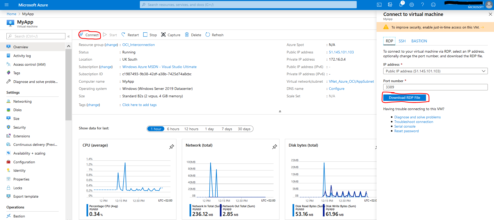

- New windows will pop up, select **Open** MyApp.rdp connection and click **OK**. You should see **Windows Security** window where you have to provide your Admin Account credentials and click again "OK".

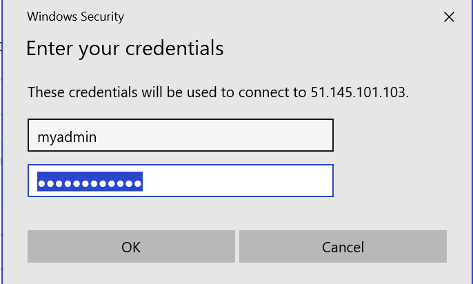

  - Click **Yes** on the next screen and you should be connected to your VM.

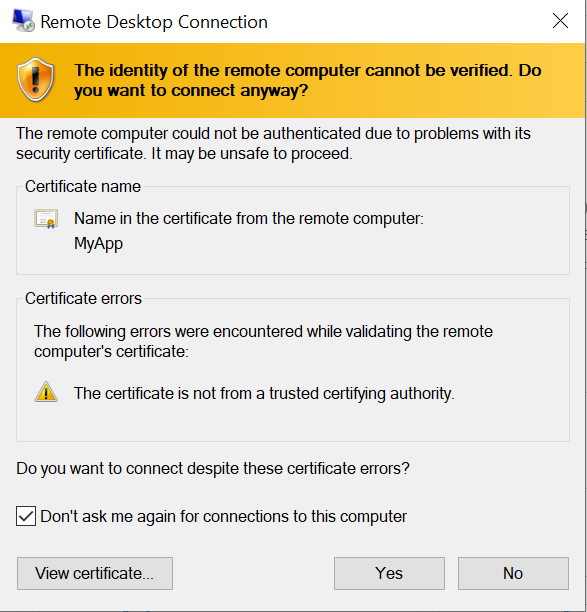

- Now you should be connected to your VM and this completes the initial configuration for Microsoft Azure.

Congratulations, you are now ready to move to the [next lab](LabGuide200CreateVCNandGateways.md).

------

[Go to Overview Page](README.md)

