[Go to Overview Page](README.md)

# Building Multi-Cloud Apps

## Initial setup on Oracle Cloud: Creating VCN with Dynamic Routing Gateway (DRG)  and Service Gateway (SGW)

#### **Introduction**

In this lab you will complete some initial steps on Oracle Cloud Infrastructure, in order to be able to create interconnection link afterwards. The first step is to create a transit [Virtual Cloud Network (VCN)](https://docs.cloud.oracle.com/en-us/iaas/Content/Network/Tasks/managingVCNs.htm). Let's expand now the concept of transit routing, which was already described on the main page.                            In order to enable traffic routing through a VCN to an Autonomous Database, you will create a [Dynamic Routing Gateway (DRG)](https://docs.cloud.oracle.com/en-us/iaas/Content/Network/Tasks/managingDRGs.htm) and a [Service Gateway (SWG)](https://docs.cloud.oracle.com/en-us/iaas/Content/Network/Tasks/servicegateway.htm) and attach them the VCN. Then, for each gateway (virtual router), you have to create a separate route table with appropriate routing rules. On one hand you will direct incoming traffic from Azure VNet through private interconnection link between Azure ExpressRoute and Oracle FastConnect to DRG and then through SWG to the Autonomous DB residing in the Oracle Services Network. Respectively, outcoming traffic from Autonomous DB will transit firstly through SWG, then to DRG and through the interconnection link and Virtual Network Gateway on Azure site to the application hosting on VM residing in Azure VNet. 

Lets get started!

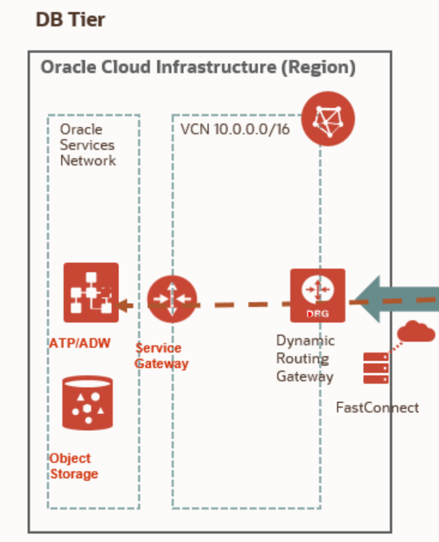

## Steps

### **STEP 1: Create Virtual Cloud Network (VCN)**

- Sign in to [OCI console](https://console.uk-london-1.oraclecloud.com).                                                                                                                                            For this lab we use the OCI UK South (London) region in order to match the Azure UK South (London) region. For the UK South (London), please use Availability Domain 1 (AD1) in OCI when deploying the inter-connect for lower latencies. However two other region pairs are available: Azure East US with OCI US East (Ashburn) and Azure Canada Central with OCI Canada Southeast (Toronto) as per [preview limitations](https://docs.microsoft.com/en-us/azure/virtual-machines/workloads/oracle/oracle-oci-overview#preview-limitations).

  -  Select the appropriate region if available.

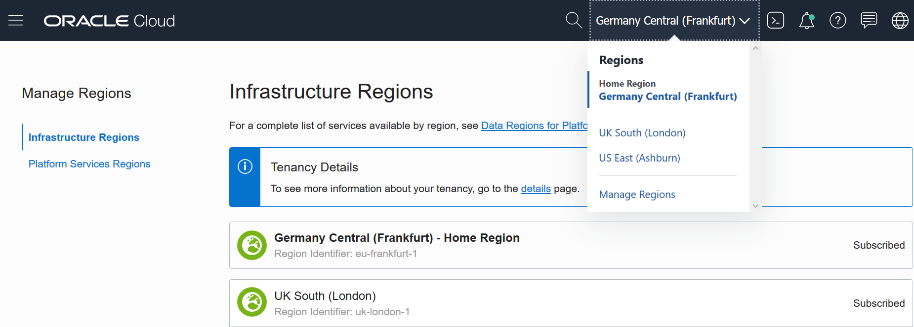

  -  In case the desired region is not visible on the list, click **Manage Regions** and then **Subscribe** button next to the appropiate region. Afterwards, the green circle should appear next to the region and you should be able to select it.

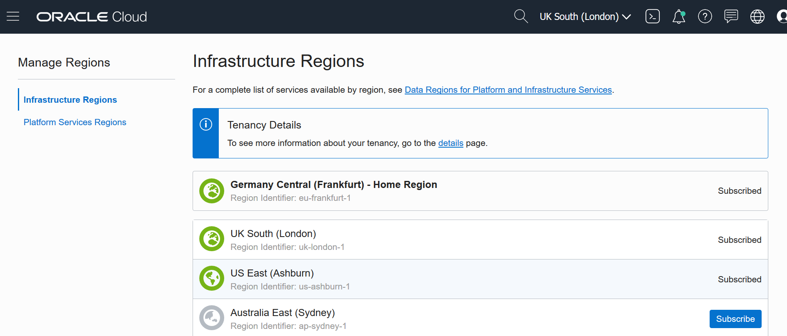

- Click on the hamburger menu icon on the top left of the screen, under **Core Infratsructure** section select **Networking** and then click on **Virtual Cloud Networks**.

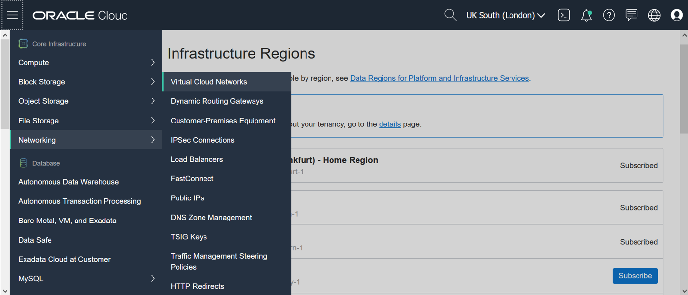

- On the Networking page, click on **Create Virtual Cloud Network** button in the middle of the screen to start the VCN creation process.

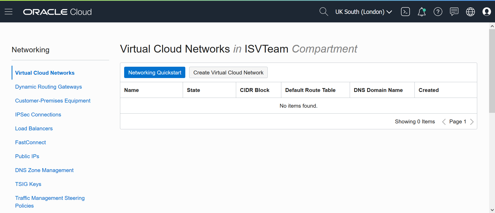

-  This will bring up **Create a Virtual Cloud Network** screen where you specify the following:
   -  Enter a **Name**, such as **VCN_OCI_Azure**.
   -  Choose the **Compartment** where you want to create your VCN.  [The compartments](https://docs.cloud.oracle.com/en-us/iaas/Content/Identity/Tasks/managingcompartments.htm?Highlight=compartments) are used to  organize and isolate logically your cloud resources. For the lab purpose, you can use your **(root)** compartment. Use the same compartment for all resources you are going to create.
   -  Provide a **CIDR Block** for your VCN, such as **10.0.0.0/16**.
   -  Leave the rest of settings to default.
   -  Click **Create Virtual Cloud Network**. 

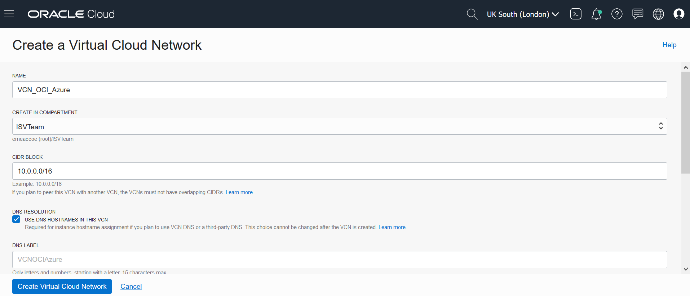

- After your VCN is created, you should see your **Virtual Cloud Network Details** screen.

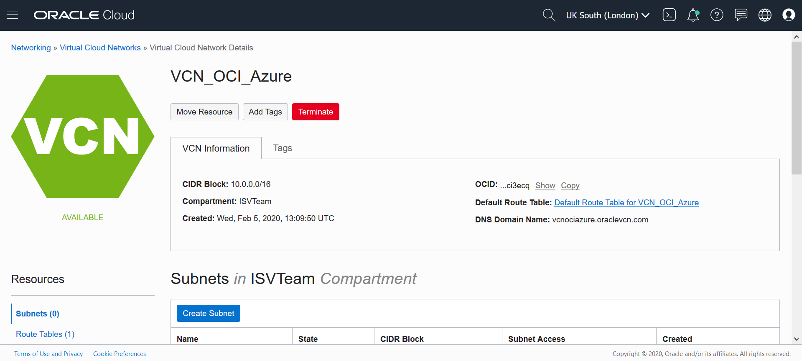

### **STEP 2: Create Dynamic Routing Gateway (DRG) and attach it to the created Virtual Cloud Network (VCN)**

- Go one step back by clicking on **Virtual Cloud Networks**, you should see your created VCN in the middle of the screen and on the left side Networkin menu select **Dynamic Routing Gateways.**

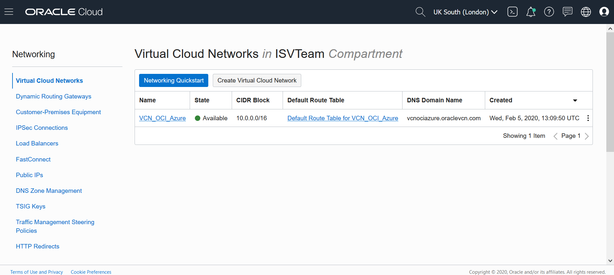

- Then click on **Create Dynamic Routing Gateway** blue button.

- On the **Create Dynamic Routing Gateway** screen provide the following:

  - Choose your **Compartment**.
  - Enter a **Name** for your DRG, such as **Gateway_to_Azure**.
  - Click **Create Dynamic Routing Gateway** button.

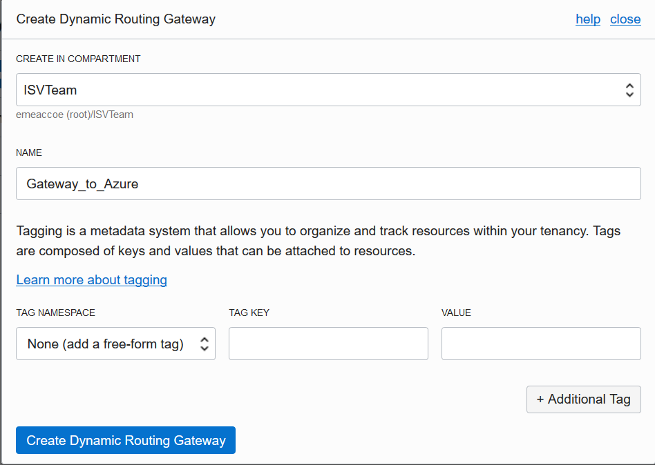

- As soon as your DRG is created, you should see that it is available (green sign). Let's attach it to our VCN by selecting **Virtual Cloud Networks** on the left under **Resources** section and then click on **Attach to  Virtual Cloud Network** blue button.

- The new window will pop up. Select your VCN **VCN_OCI_Azure** and click again on **Attach to Virtual Cloud Network** button.

- Under **Virtual Cloud Networks** section, you can see the **Attachment State** with status **Attached** and green point next to it.

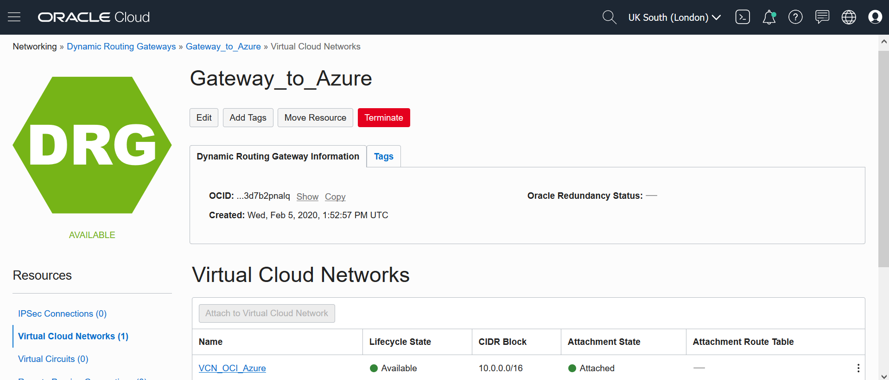

### **STEP 3: Create Service Gateway (SWG)**

- Navigate back to the **Virtual Cloud Networks** page (Hamburger menu on the left --> Networking --> Virtual Cloud Networks) and click on the name of your created VCN.

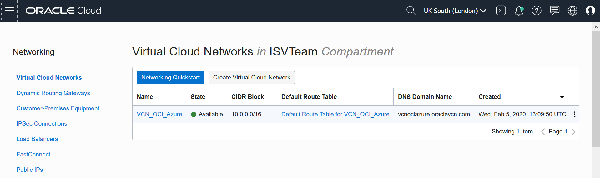

- Under **Resources** section on the left, select **Service Gateways** and click on **Create Service Gateway** blue button.

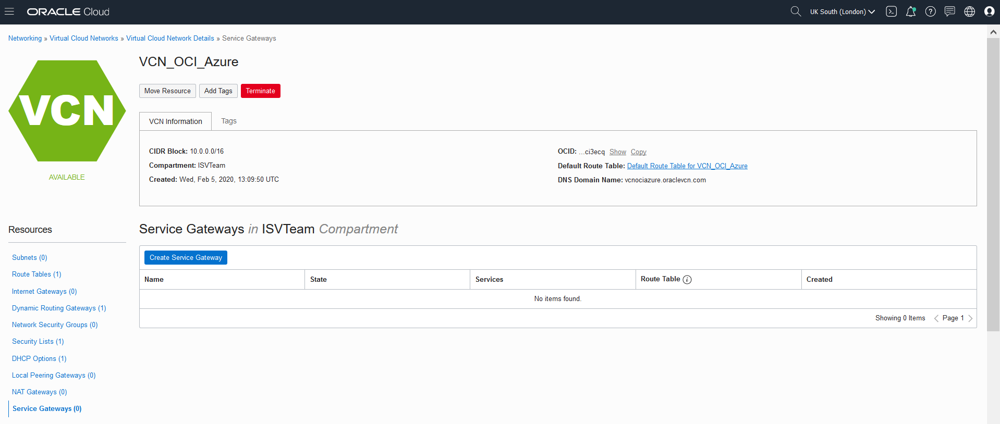

- On the **Create Service Gateway** screen provide the following:

  - Enter a **Name**, such as **Gateway_to_Autonomous**.
  - Choose your **Compartment**.
  - Select **All LHR Services in Oracle Service Network** under **Services**.
  - Click **Create Service Gateway** button.

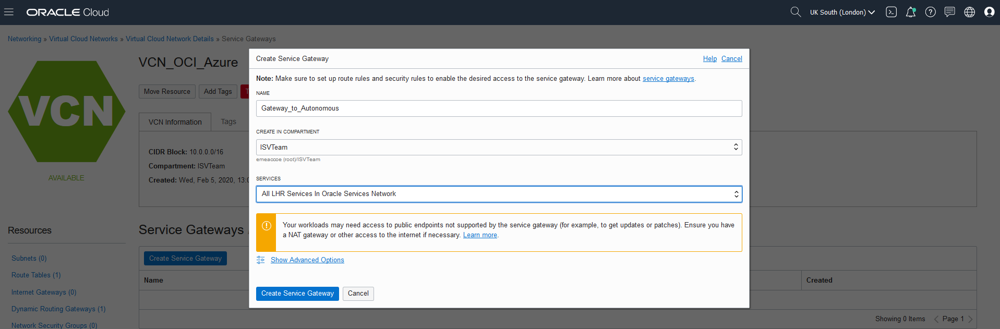

- You will see the message **Your service gateway has been created**, then click **Close**.

- Confirm, that your Service Gateway is in **Available** state.

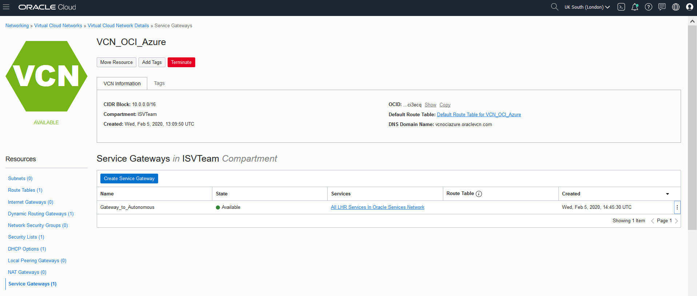

### STEP 4: Create first route table and associate it with DRG

- Select **Route Tables** under **Resources** section on the left and click **Create Route Table** button.

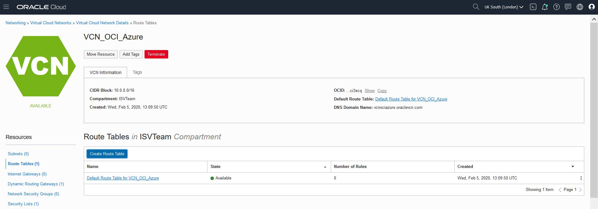

You will see also Default Route Table for VCN, but we will not use it here.

- When the **Create Route Table** window will pop up, please provide:

  - Enter a **Name**, such as **DRG_Route_Table**.

  - Choose your **Compartment**.

  - Under **Route Rules** click on **+ Additional Route Rule** button and select **Target Type** as **Service Gateway**.

  - Select **Destination Service** as **All LHR Services in Oracle Service Network**.

  - Select **Target Service Gateway** you created **Gateway_to_Autonomous**.

  - Click **Create Route Table** button.

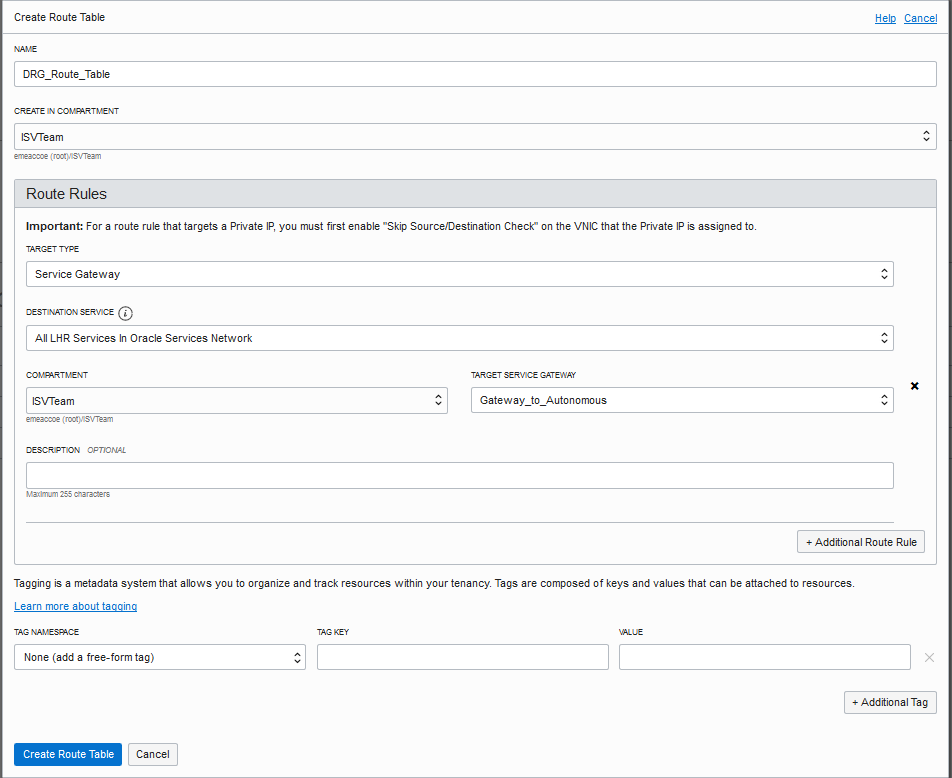

- Newly created Route Table for DRG will appear on the list.

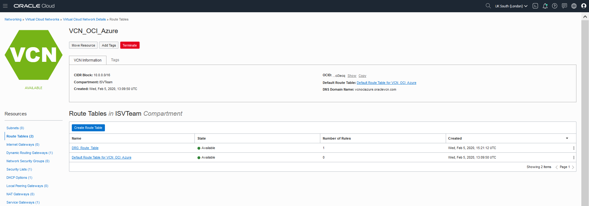

- Click on the **Dynamic Routing Gateways** under **Resources** section on the left menu, then on **3 vertical dots** on the right next to your DRG and select **Associate Route Table**.

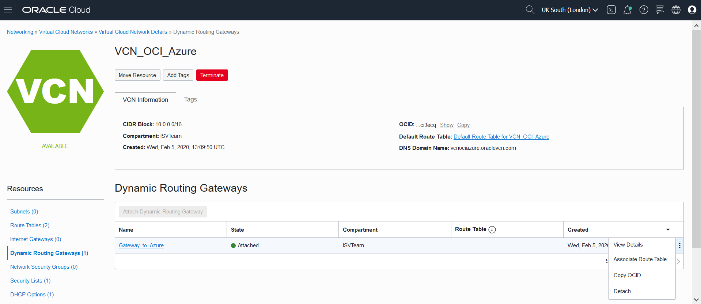

- The **Associate Route Table** window will pop up, select previously created route table **DRG_Route_Table** and click **Associate**.

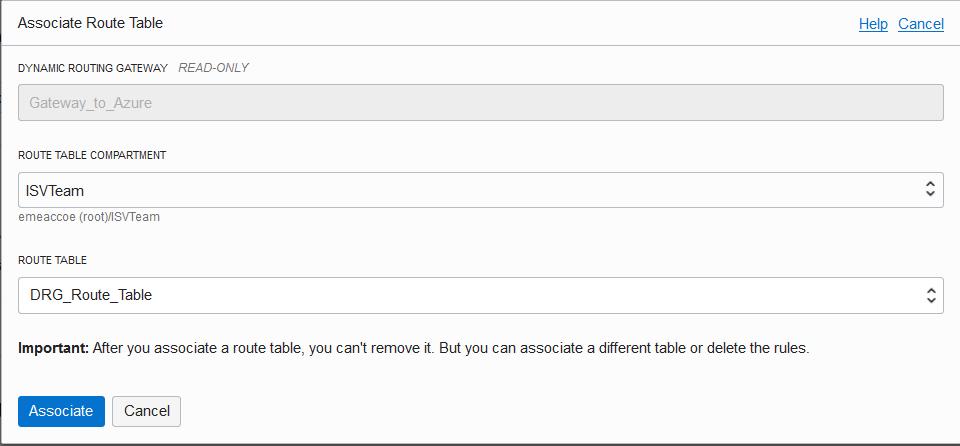

- Associated route table will appear next to your DRG.

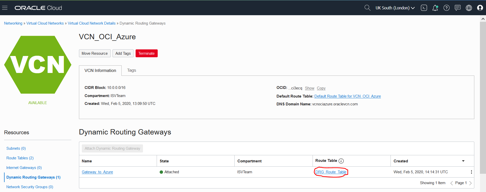

### STEP 5: Create second route table and associate it with SWG

- Select again **Route Tables** under **Resources** section on the left and click **Create Route Table** button.

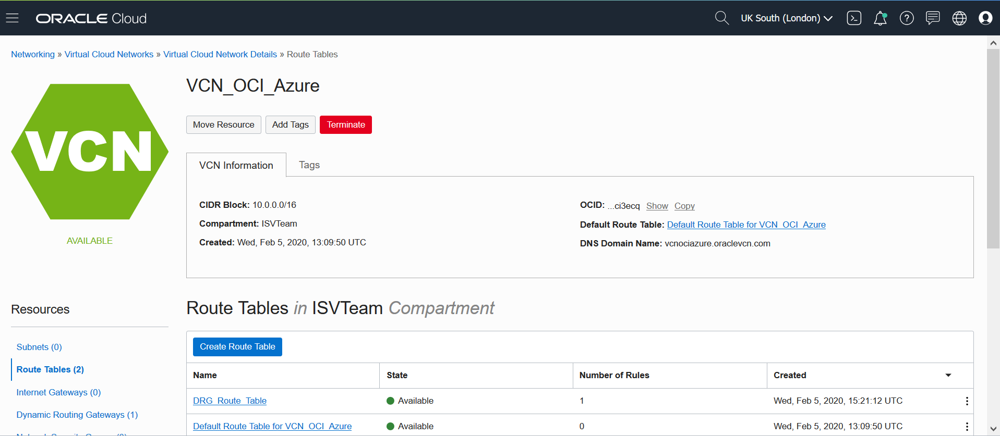

- When the **Create Route Table** window will pop up, please provide:
  - Enter a **Name**, such as **SWG_Route_Table**.
  - Choose your **Compartment**.
  - Under **Route Rules** click on **+ Additional Route Rule** button and select **Target Type** as **Dynamic Routing Gateway**.
  - Enter **Destination CIDR Block** as **172.16.0.0/16** (CIDR Block of Azure VNet).
  - Click **Create Route Table** button.

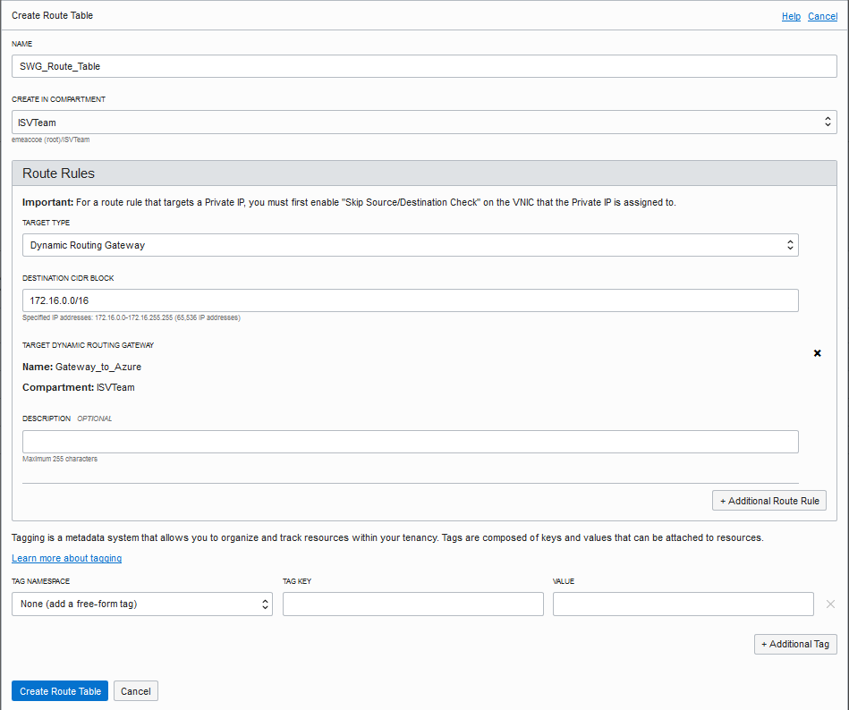

- Newly created Route Table for SWG will appear on the list.

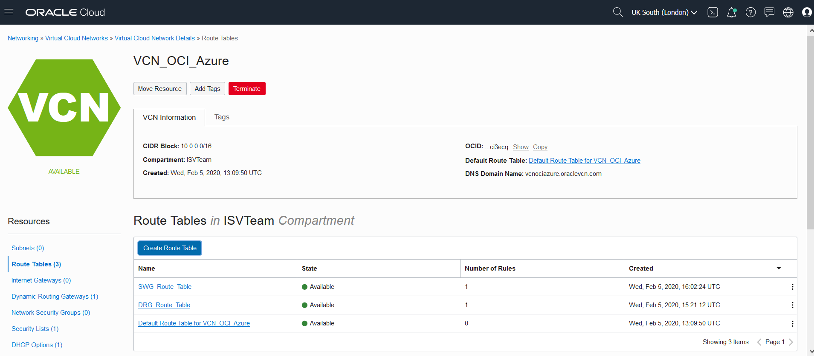

- Click on the **Service Gateways** under **Resources** section on the left menu, then on **3 vertical dots** on the right next to your SWG and select **Associate Route Table**.

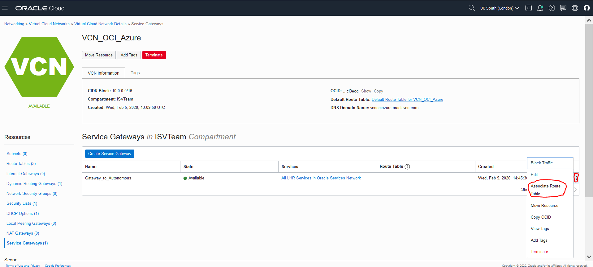

- The **Associate Route Table** window will pop up, select previously created route table **SWG_Route_Table** and click **Associate**.

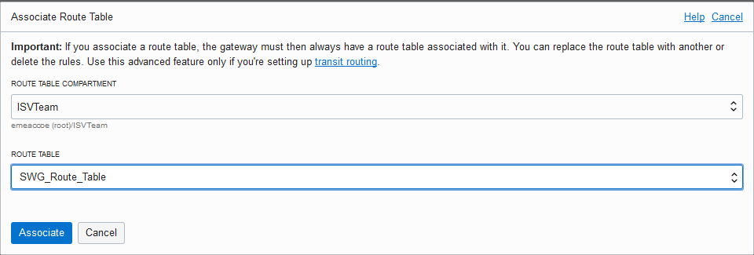

- Associated route table will appear next to your SWG.

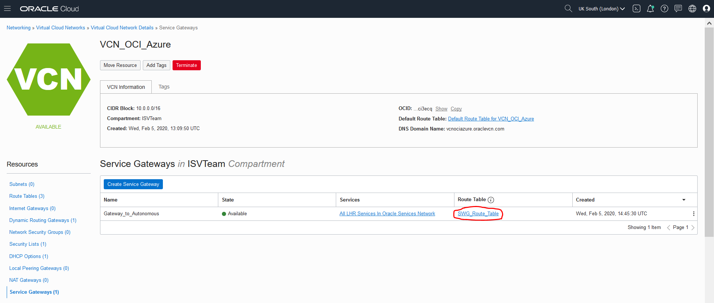

The initial configuration on Oracle Cloud is completed.

Congratulations, you are now ready to move to the [next lab](LabGuide300ProvisionAutonomousDatabase.md) and provision the Autonomous Transaction Processing Database on OCI.

------

[Go to Overview Page](README.md)

