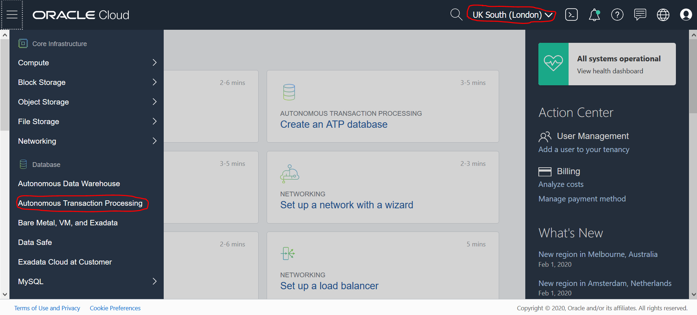
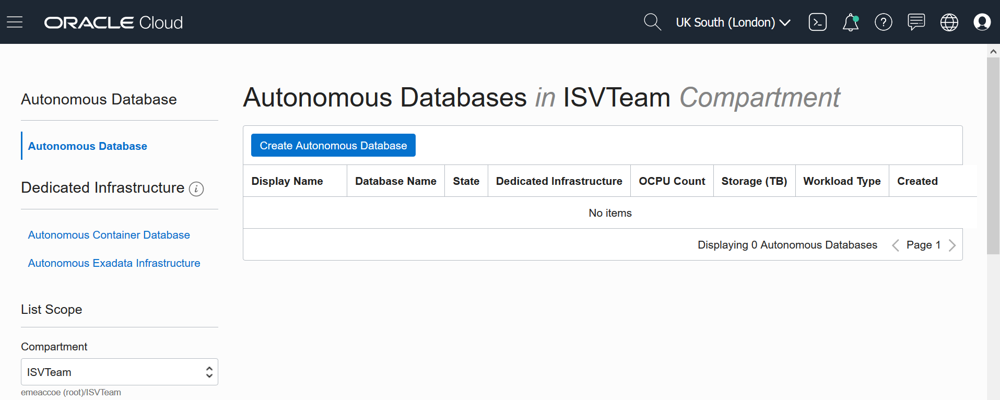
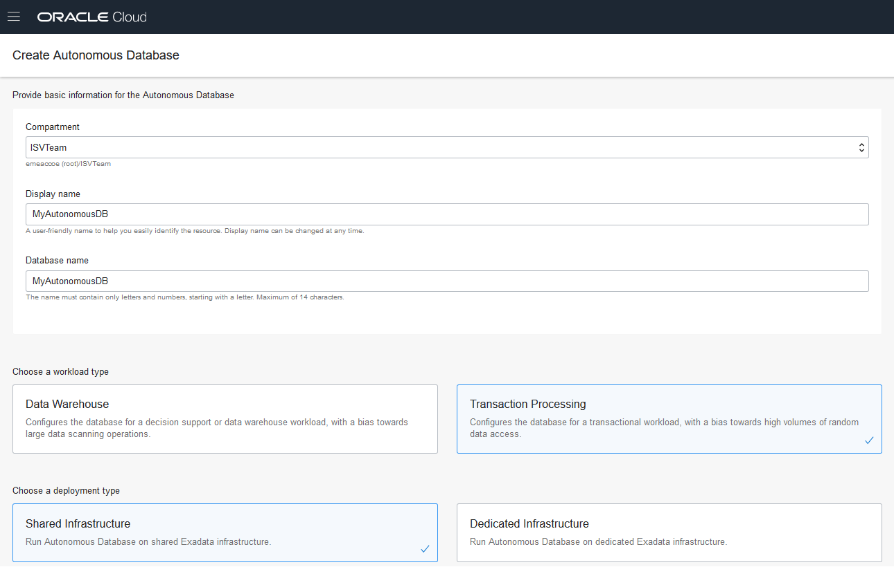
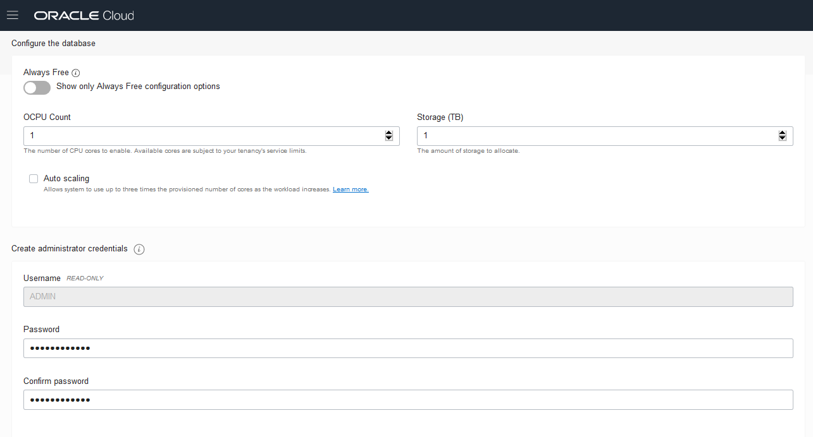
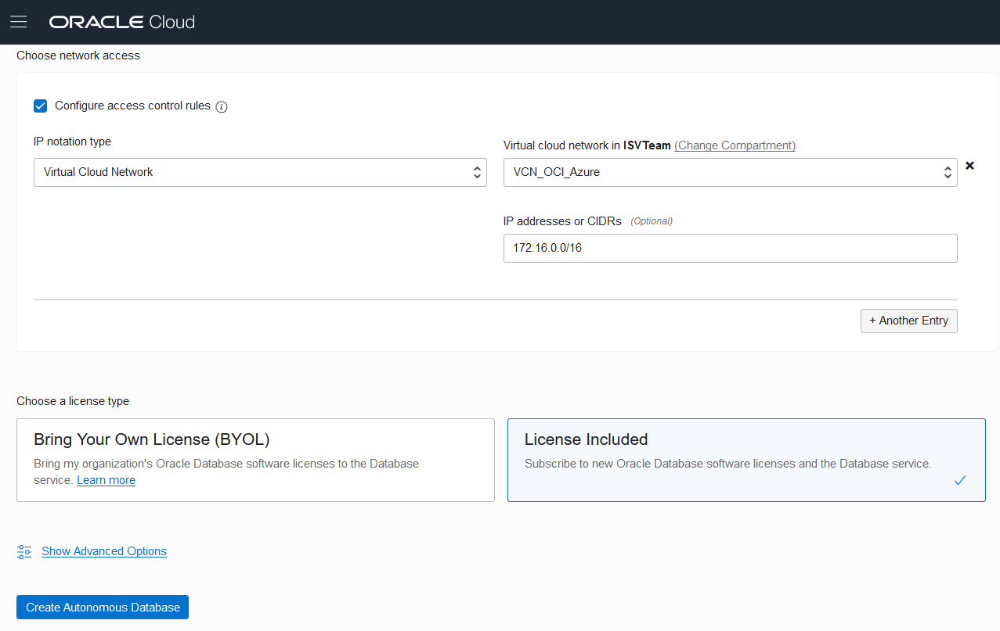
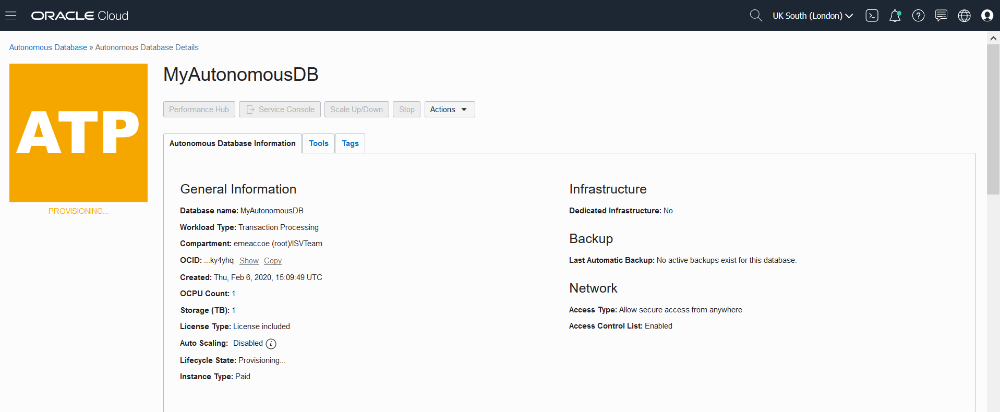
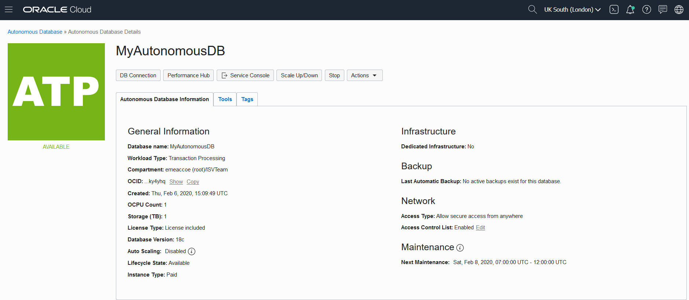
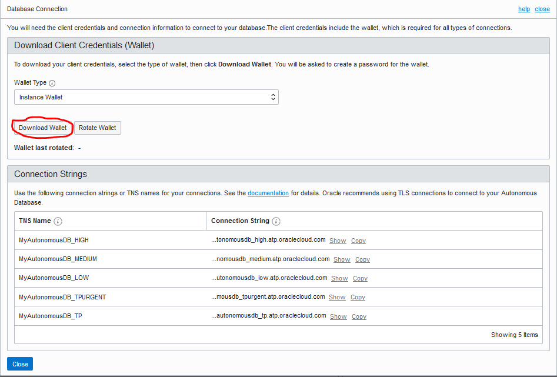
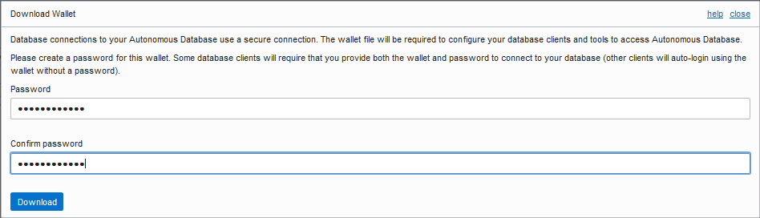

[[Go]() to Overview Page](README.md)


# Building Multi-Cloud Apps

## Provisioning an Autonomous Transaction Processing Database


#### **Introduction**

This lab walks you through the steps to get started using the Oracle [Autonomous Transaction Processing Database (ATP)](https://docs.cloud.oracle.com/en-us/iaas/Content/Database/Concepts/adboverview.htm) on Oracle Cloud Infrastructure (OCI). You will provision a new database and configure network [Access Control List](https://docs.oracle.com/en/cloud/paas/atp-cloud/atpug/autonomous-acess-control-list.html#GUID-B6389402-3F4D-45A2-A4DE-EAF1B31D8E50) in order to restrict access to the database only from Azure VNet, where your .NET application resides. In the last step, you will download [Client Credentials Wallet](https://docs.oracle.com/en/cloud/paas/atp-cloud/atpug/connect-download-wallet.html#GUID-B06202D2-0597-41AA-9481-3B174F75D4B1), which will by used by the application to connect to the database.

## Steps

### **STEP 1: Create an ATP Instance**

-  Being in the OCI console, make sure, that you are in the right region and then click on the hamburger menu icon on the top left of the screen and then on **Autonomous Transaction Processing** under **Database** section.



- Select your **Compartment**.
- Click on **Create Autonomous Database** button to start the instance creation process.



-  This will bring up Create Autonomous Database screen where you specify the configurations of the instance:
   -  Select again your **Compartment**.
   -  Specify a name for the instance, such as **MyAutonomousDB**.
   -  Select **Transaction Processing**.
   -  Select **Shared Infrastructure**.



- Set a **OCPU Count** to **1**.

- Set **Storage** to **1 TB**.

- Untick **Auto scaling** option to keep costs lower.

- Specify the password for the instance, for example : 

```
WElcome_123#
```




- Tick **Configure access control rules** under **Choose network access** section.
  - Under **IP notation type** select **Virtual Cloud Network** from the dropdown menu.

  - Under  **Virtual cloud network in "your compartment"** select your **VCN_OCI_Azure**.

  - Under **IP addresses or CIDRs**, enter the CIDR of Azure VNet: **172.16.0.0/16**.

    This configuration will assure, that only clients from Azure VNet will be able to connect to your Autonomous Database.

- Choose a license type **Lincense Included** from these 2 options: 
  - **Bring Your Own License (BYOL)** :  Oracle allows you to bring your unused on-prem licenses to the cloud and your instances are billed at a discounted rate. This is the default option so ensure you have the right license type for this subscription.
  - If you do not have available on-premise Licenses, select the option **License Included**, in this case License fees will be included in the hourly rate of your database.

- Click on **Create Autonomous Database** to start provisioning the instance.




- Once you create ATP Database it would take 2-3 minutes for the instance to be provisioned.



-  Once provisioning is finished, you can click on the instance name to see more details. 



You now have created your first Autonomous Transaction Processing Cloud instance.

### **STEP 2: Download the secure connection wallet for your ATP instance**

- Once you are on **Autonomous Database Details** page, please click on **DB Connection** button.


- New window will pop up and then click on **Download Wallet** leaving the default "Instance Wallet" type.



- Supply a password for the wallet and download your client credentials.

#### Example password:

```
WElcome_123#
```



- Once you have downloaded your wallet on your local computer, you can close the **Database Connection** window.

- The credentials zip file contains the encryption wallet, Java keystore and other relevant files to make a secure TLS 1.2 connection to your database from client applications.                                                          You will have to copy the credentials wallet on to Azure VM in the next lab in order to allow secure connection between the application and the database.

  

Congratulations, you are now ready to move to the [next lab](LabGuide400DevelopAppASP.NET.md).

------

[Go to Overview Page](README.md)

