[Go to Overview Page](README.md)


# Building Multi-Cloud Apps

## **Developing an ASP.NET App for ADB (on Azure VM)**


#### **Introduction**

Interest in using Oracle Autonomous  Database (ADB) is high. In fact, many developers ask how to connect  their App Tier on Azure to ADB. Let’s first build a basic ASP.NET Web application in Visual Studio that connects to ADB. You will be using Visual Studio 2017, but steps in other Visual Studio versions should be similar. You will use managed ODP.NET for data access between the application and database, but ODP.NET Core should work as well with these instructions.

Let's get started.

## Steps

### **STEP 1: Install Visual Studio**

- Download free Visual Studio Community 2019 edition from [here](https://visualstudio.microsoft.com/vs/cloud-connected/) on your Azure VM (in case you have the issue with downloading the software, please follow [this document](https://improveandrepeat.com/2018/03/internet-explorer-on-windows-server-enable-file-downloads/) to change the settings in IE).

- Run the installation of Visual Studio and select **ASP.NET and web development** and **Azure development** as the workloads and click **Install**.

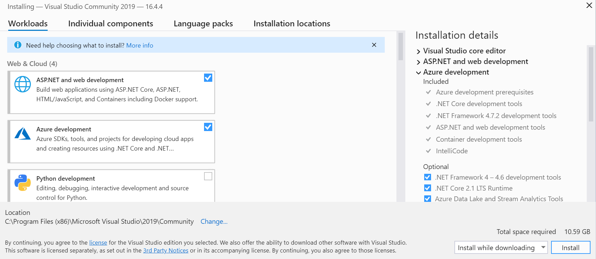

Full installation guide of Visual Studio you can find [here](https://docs.microsoft.com/en-us/visualstudio/install/install-visual-studio?view=vs-2019).

- In about 10-15 minutes, Visual Studio should be ready to go. Click **Start Visual Studio**.

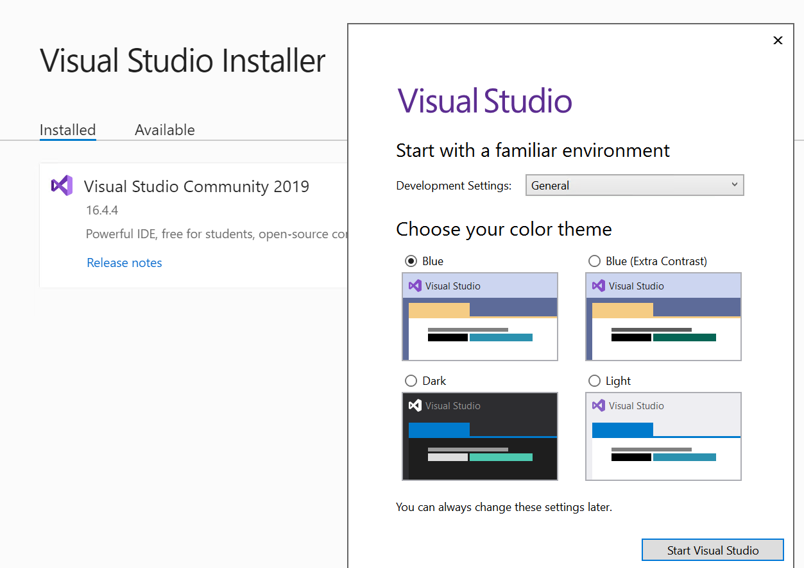

### **STEP 2: Create a new ASP.NET Web Application**

- Click **Create a new project**.

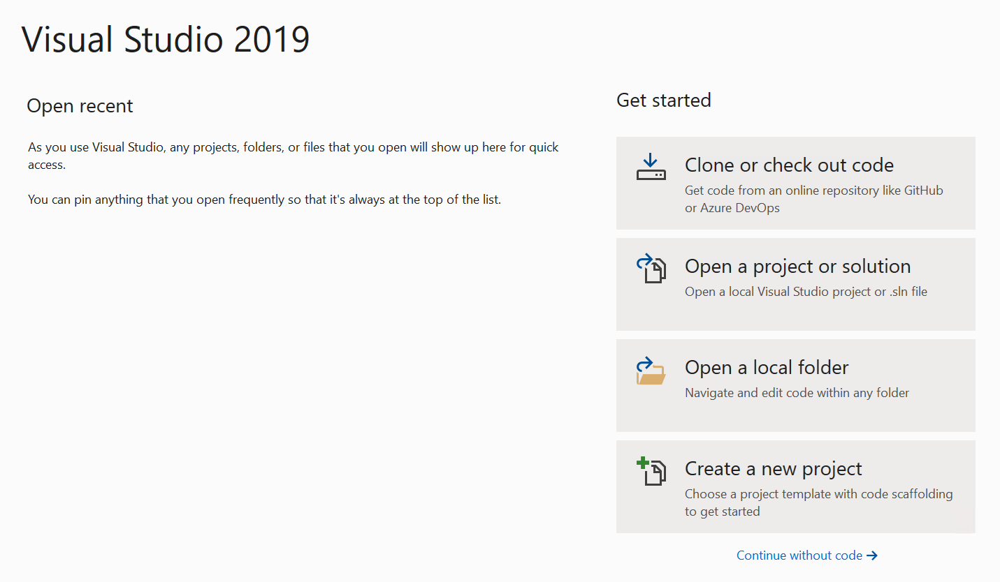

- Select a new ASP.NET Web Application (.NET Framework) and click **Next**. 

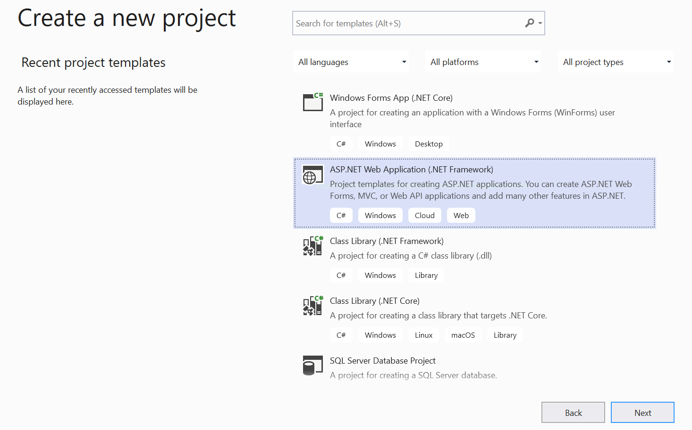

- On the **Configure your new project** screen, please provide the following details:
  - Enter a **Name** for your project, such as **MyWebApp**.
  - Provide the desired location for your project and write it down for later usage.
  - Leave a **Solution name** the same as **Project name** and tick the box **Place solution and project in the same directory**.
  - Click **Create**. 

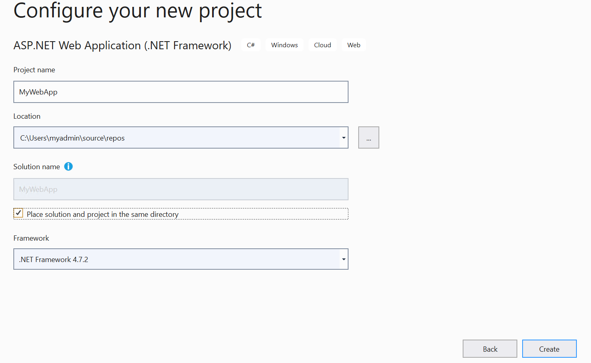

- Select an **Empty** project on the next screen and hit **Create** again.

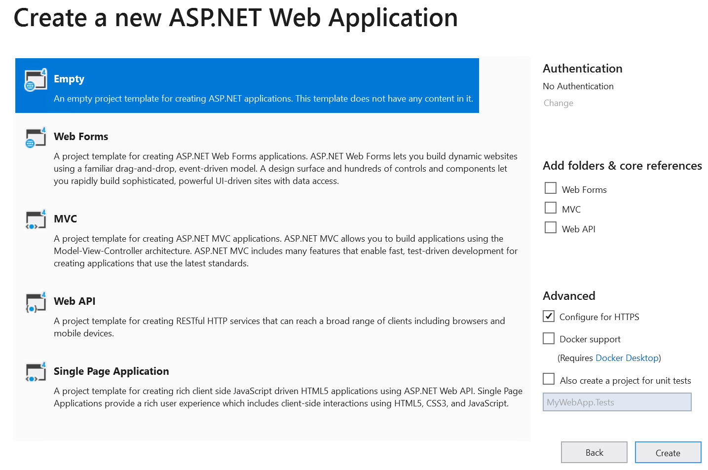

- Copy the following three files from the [Oracle .NET GitHub sample code site](https://github.com/oracle/dotnet-db-samples/tree/master/samples/autonomous-db/managed-odp/web-app) into your web project root directory (C:\Users\myadmin\source\repos\MyWebApp in this case). The easy way is to fork the repository (you need your GitHub account) and then clone or download a ZIP file. Then copy these 3 files to your web project root directory.
  - autonomous-managed-odp.aspx
  - autonomous-managed-odp.aspx.cs
  - autonomous-managed-odp.aspx.designer.cs

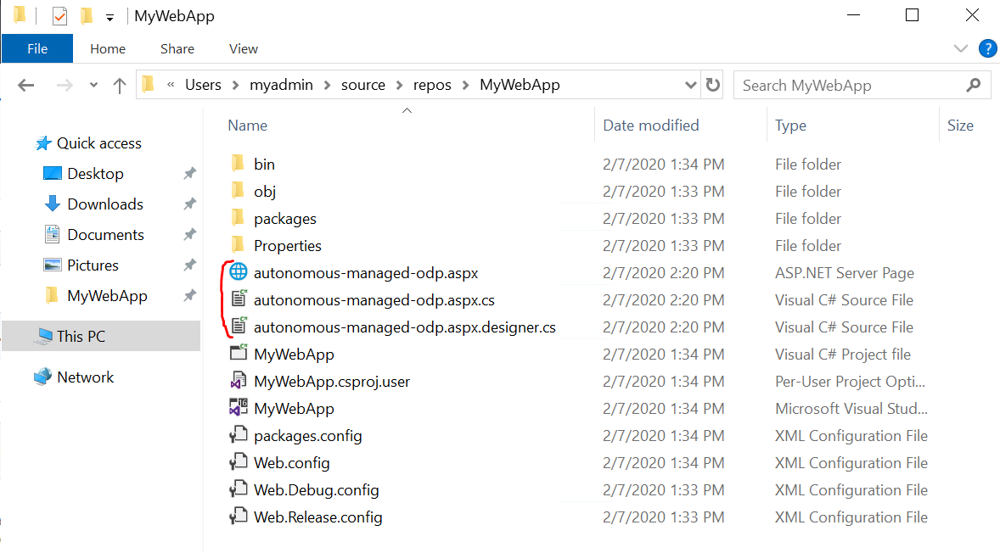

These files constitute a web page that connects to ADB and returns the database version it is using to demonstrate basic connectivity.

- Click on **Project** tab and select **Add Existing Item** in order to add these files to your project in Visual Studio.

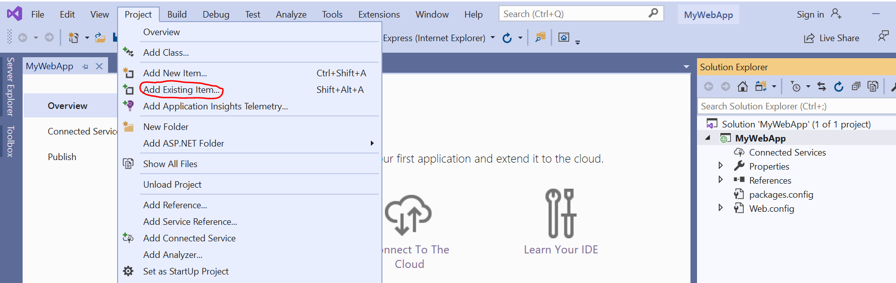

- Add **managed ODP.NET assembly driver** (Oracle.ManagedDataAccess) to your project.

  - Right click on the **References** in the Solution Explorer and select **Manage NuGet Packages**.

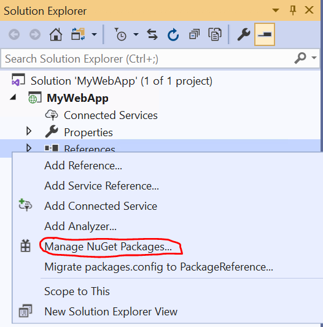

  - Browse for **Oracle**, select **Oracle.ManagedDataAccess** and click **Install**.

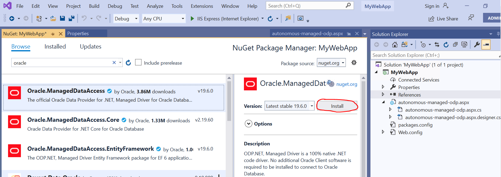

  -  After accepting the license terms for the package, the ODP.NET **readme.txt** file opens. In the **Solution Explorer** window, expand **References** and verify that ODP.NET assembly was added to the project meaning, that these assembly was successfully downloaded and installed.

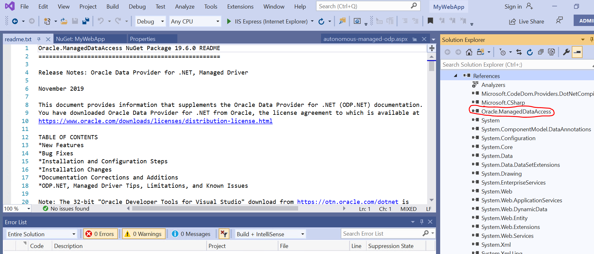


- Open the **autonomous-managed-odp.aspx.cs** file in the Visual Studio:


- Modify the User Id and Password credentials in the connection string  specific to your ADB instance. 


```
//Enter in the user id and password.

string conString = "User Id=<USER ID>;Password=<PASSWORD>;";

Example: string conString = "User Id=ADMIN;Password=WElcome_123#;";

```

- On the next connection string line, modify the following settings for your ADB instance:


```
//Enter port, host name or IP, service name, and wallet directory for your Oracle Autonomous DB.

conString += "Data Source=(description=(address=(protocol=tcps)(port=<PORT>)(host=<HOSTNAME OR IP>))(connect_data=(service_name=<SERVICE NAME>))(SECURITY = (MY_WALLET_DIRECTORY = <DIRECTORY LOCATION>)));";

Example: 
conString += "Data Source=(description=(address=(protocol=tcps)(port=1522)(host=adb.uk-london-1.oraclecloud.com))(connect_data=(service_name=d4qvm7rtgjikgr5_myautonomousdb_high.atp.oraclecloud.com))(SECURITY = (MY_WALLET_DIRECTORY = C:\\Users\\myadmin\\source\\repos\\MyWebApp)));";
```

You will find these entries in the **tnsnames.ora** file from **Wallet_MyAutonomousDB.zip** downloaded 		in the previous lab. The wallet directory must be set to the local machine directory where your ADB   		wallet file will reside. For this tutorial, you will copy the wallet zip file to the web project’s root directory. 

In this example **C:\\\Users\\\myadmin\\\source\\\repos\\\MyWebApp.**

Additionally, add the wallet file, *cwallet.sso*, from the credentials zip file to the web project root 		         	directory in line with the **MY_WALLET_DIRECTORY** setting. 

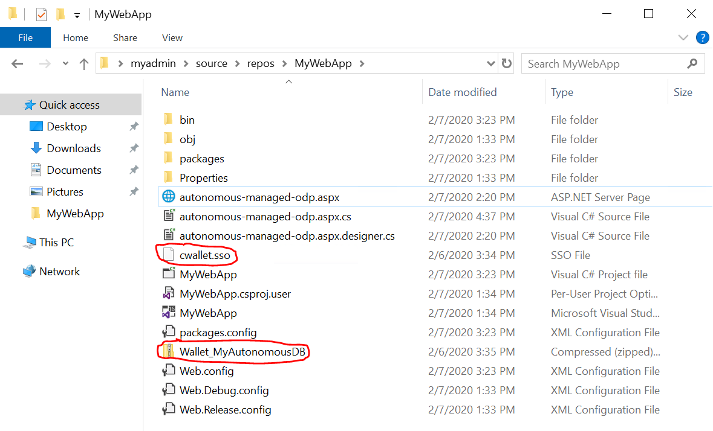

- Save all changes made in the **autonomous-managed-odp.aspx.cs** file.


### **STEP 3: Install WebServer (IIS)**

- If it’s not already installed, install WebServer(IIS) and configure your local IIS attribute **Load User Profile** to "true" so that you can use the local wallet.

  - Open **Server Manager** o your Azure VM, select **Local Server** on the left menu and then click **Manage** and select **Add Roles and Features**.

  - Under **Server Roles** tick **WebServer (IIS)**, the new window will pop up and then click **Add Features**.

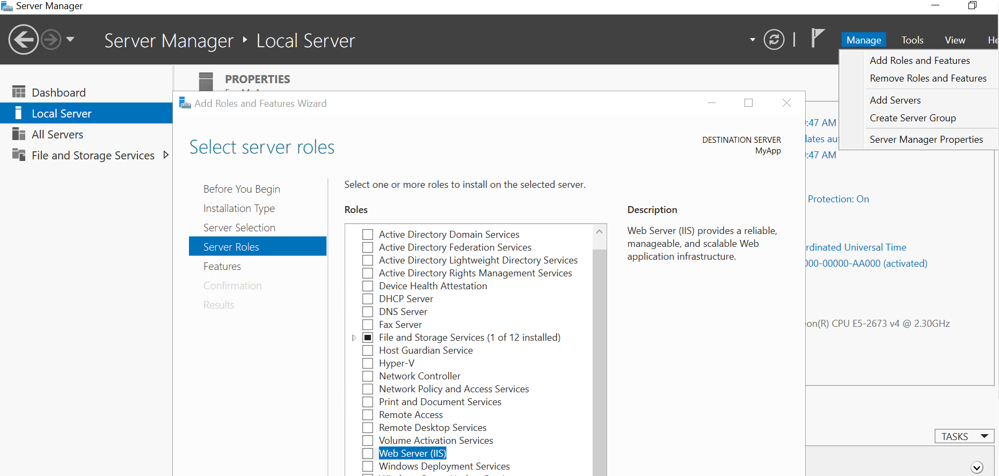

  - Click **Next** few times until you get to the **Confirmation** page and then click **Install** (as soon as installation is completed close the wizard).

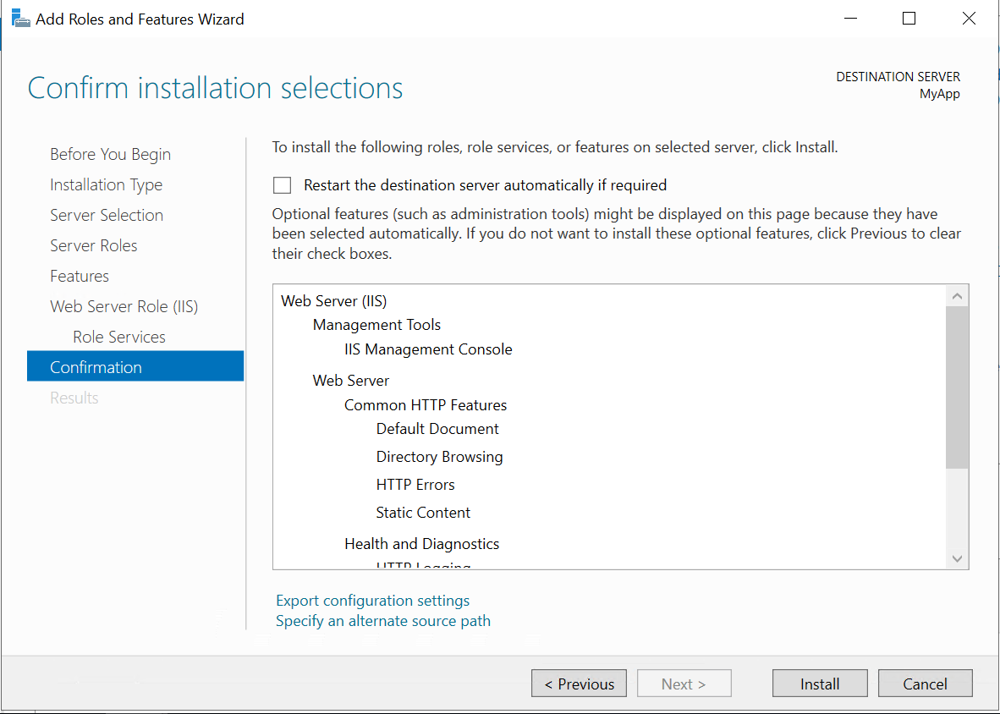

  - IIS should appear on list, right click on your Server Name and select **Internet Information Services (IIS) Manager** in order to open it.

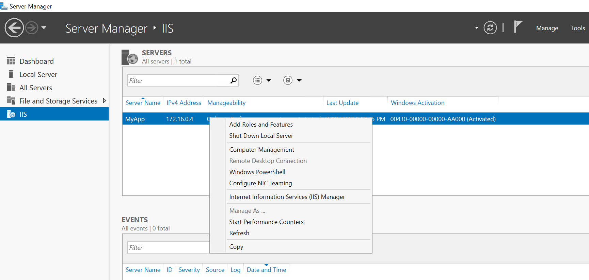

  - IIS Manager window will appear, expand **MyApp** and select **Application Pools**, click on **DefaultAppPool** and then **Advanced Settings**.

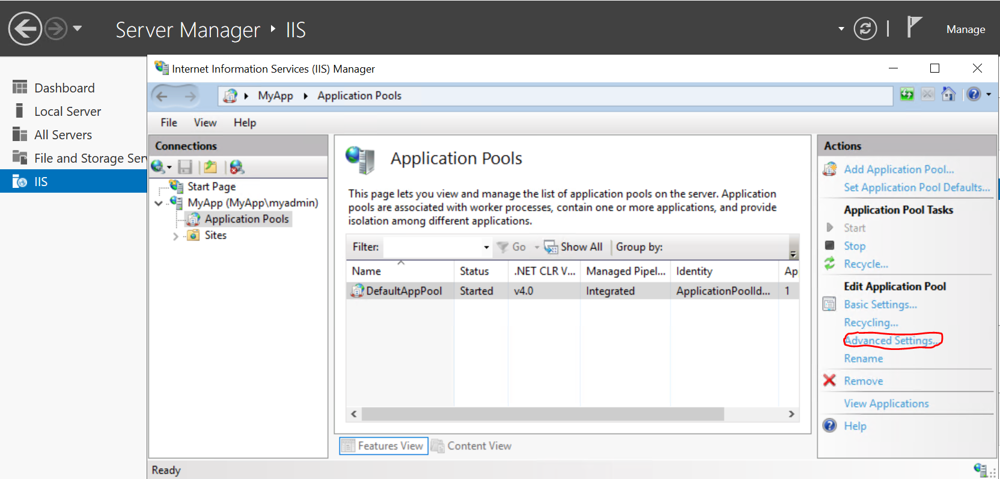

  - In the **Advanced Settings** window, set **Load User Profile** as **True** and click **OK** (you can close **Server Manager**).

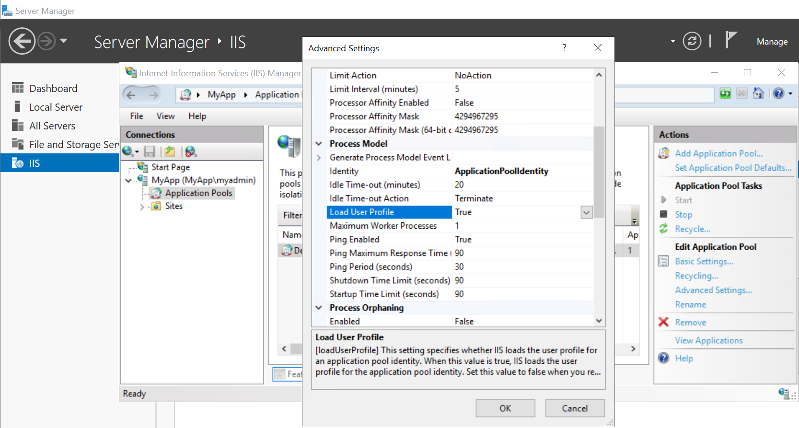

### **STEP 4: Run your .NET Web Application**

- Run your web application by clicking **IIS Express (Internet Explorer)** button in Visual Studio.

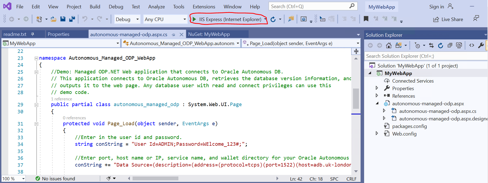

-  You should get an error, which is expected as you haven't established yet interconnection link to the Autonomous Database. The connection will be allowed only through the private connection based on restriction you setup in Access Control List in the previous lab.

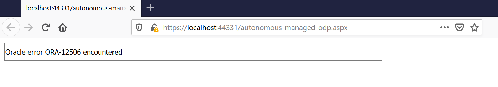

Congratulations, you are now ready to move to the [next lab](LabGuide500CreateInterConnection.md).

------

[Go to Overview Page](README.md)