[Go to Overview Page](README.md)

# Building Multi-Cloud Apps

## Create Cross-Cloud Interconnect

#### **Introduction**

Oracle and Microsoft have built a dedicated, high-throughput, low-latency, private network connection between Azure and Oracle Cloud Infrastructure data centers in the Ashburn, London and Toronto region that provides a data conduit between the two clouds. You can use the connection to securely transfer data at a high enough rate for offline handoffs and to support the performance required for primary applications that span the two clouds. You can access the connection by using either Oracle FastConnect or Microsoft ExpressRoute, as shown below, and you don’t need to deal with configuration details or third-party carriers.

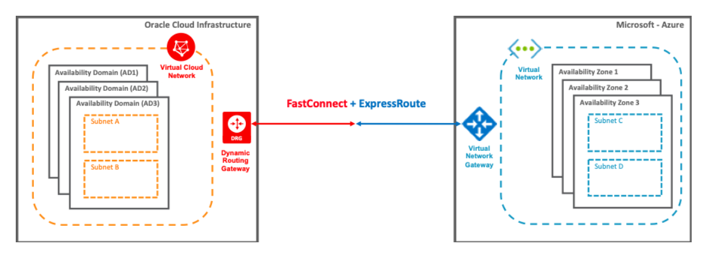

FastConnect and ExpressRoute together create a path for workloads on both clouds to communicate directly and efficiently, which gives you flexibility on how to develop and deploy services and solutions across Oracle Cloud Infrastructure and Microsoft Azure.

You will experience the following benefits when you interconnect the Oracle and Microsoft clouds:

- Secure private connection between the two clouds. No exposure to the internet.
- High availability and reliability. Built-in redundant 10-Gbps physical connections between the clouds.
- High performance, low latency, predictable performance compared to the internet or routing through an on-premises network.
- Straightforward, one-time setup.
- No intermediate service provider required to enable the connection.

Let's get started in order to connect developed and deployed application on Azure VM with Autonomous Database on Oracle Cloud.

## Steps

### Step 1: Setup Azure ExpressRoute

- On the upper-left side of the Azure home screen, select **Create a resource** and type in the search bar **ExpressRoute** and click **Create.** 

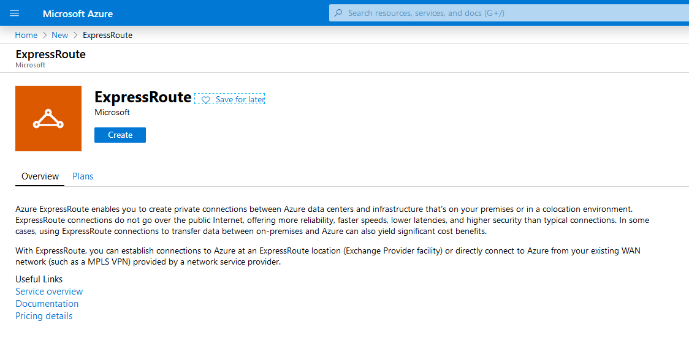

- Add in the required details the following:

  - Provide **Circuit Name**, such as **Azure_OCI_ExpressRoute**.

  - Select **Provider**, such as **Oracle Cloud FastConnect**.

  - Select **Peering Location**, it is **London** in this example.

  - Choose the **Bandwidth**, it is enough **50Mbps** for testing purposes.

  - Leave **SKU** as **Standard**.

  - Change **Billing model** to **Metered**.

  - Choose your **Subscription**.

  - Select the **Resource group** you created before: **OCI_Interconnection**.

  - Select **Location** as **UK South**.

  - Click **Create**.

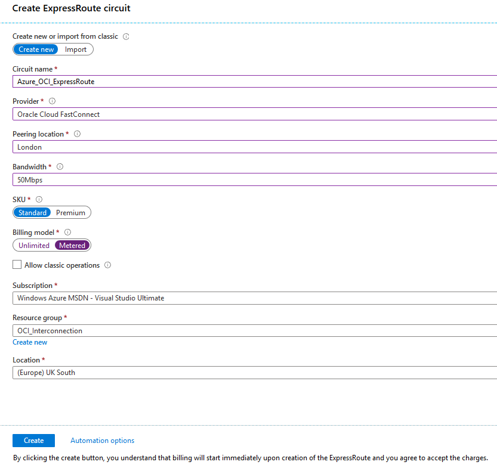

- This creates an ExpressRoute circuit, however it isn't currently provisioned and doesn’t provide any connectivity details. Note down the service key as you will use this in the next step in Oracle Cloud Infrastructure console.

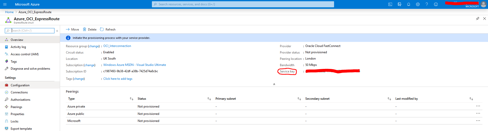

### Step 2: Setup Oracle Cloud Infrastructure FastConnect

- In OCI Console, navigate to the **Menu > Networking > FastConnect**.

- Click **Create FastConnect**.

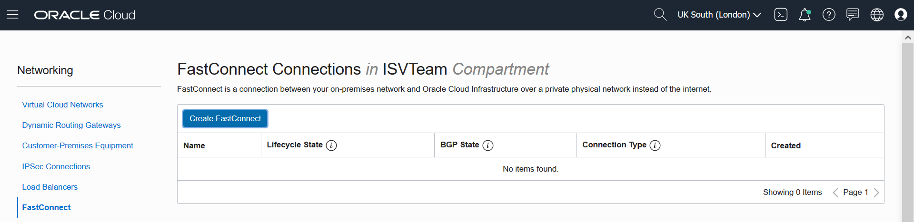

- On the **Create Connection** screen provide the following:

  - Select **Use Oracle Provider**.

  - Select **Microsoft Azure: ExpressRoute** as a **Provider**.

  - Click **Next**.

- Under **Configuration** tab, please provide the following:

  - Provide **Name**, such as **OCI_Azure_FastConnect**.
  - Select your **Compartment**.
  - Select **Virtual Circuit Type** as **Private Virtual Circuit**.
  - Choose **Dynamic Routing Gateway** you created before.
  - Choose **Provisioned Bandwidth** for testing purposes as **1 Gbps**.
  - Provide **Provider Service Key**, you noted down in the previous step.

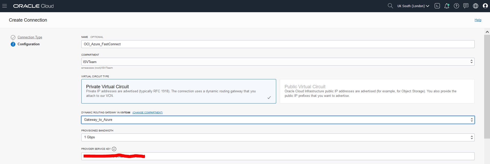

  - The connection between Azure VNet and OCI VCN uses BGP dynamic routing. Scroll down and provide the **BGP IP addresses** that will be used for the two redundant BGP sessions between Oracle and Azure:
    - A primary pair of BGP addresses:
      - **Customer Primary BGP IP Address**: **10.0.0.22/30**.
      - **Oracle Primary BGP IP Address**: **10.0.0.21/30.**
    - A separate, secondary pair of BGP addresses:
      - **Customer Secondary BGP IP Address**: **10.0.0.26/30**.
      - **Oracle Secondary BGP IP Address:** **10.0.0.25/30**.

You provide /30 addresses here for the BGP connection. The second and third in each /30 are used as BGP IP address pair. The second address in the block is for the Oracle side of the BGP session and the third address in the block is for the Azure side of the BGP session.

- Click **Create**

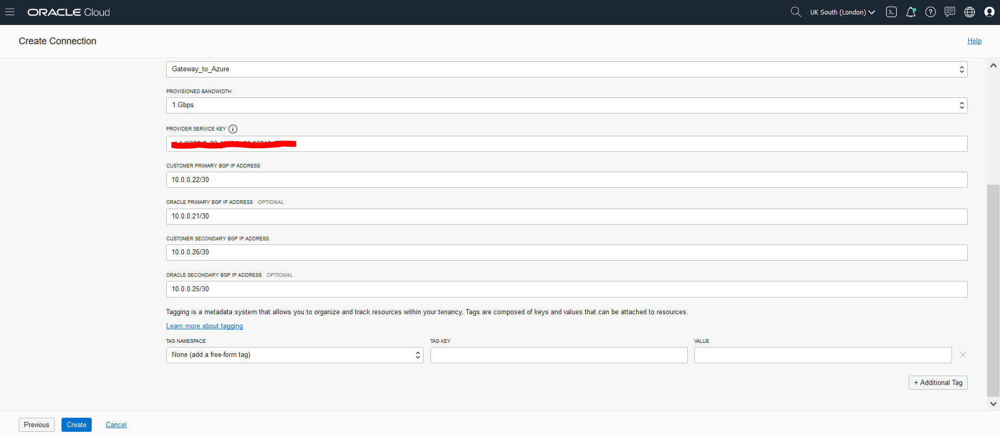

- Initially the circuit will go into **PROVISIONING** state.

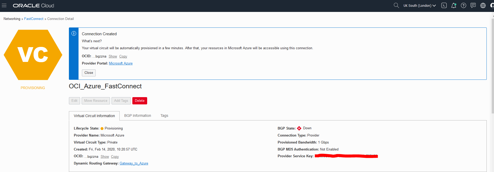

- Shortly after the circuit goes into ‘**UP**’ status with its lifecycle state as **Provisioned**.

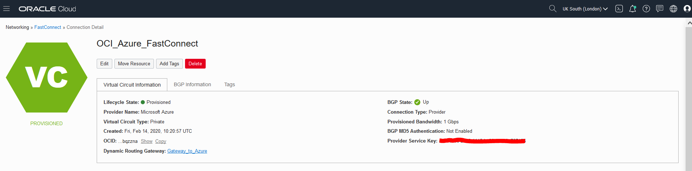

- Similarly on the Azure side, the circuit status has changed into **Provisioned** as well.

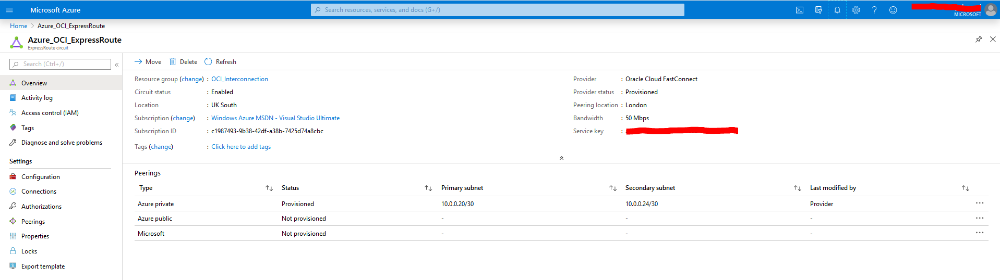

### Step 3: Link VNet to Azure ExpressRoute

Next step is to create a link between the Azure Virtual Network (VNet) and ExpressRoute circuit.

- On your Azure dashboard navigate to your virtual network gateway created before and click **Connections** under **Settings**.

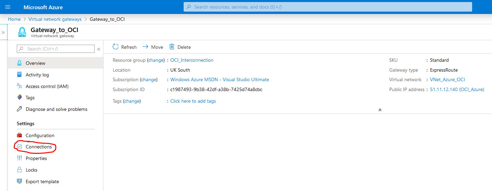

- Click **Add** button.

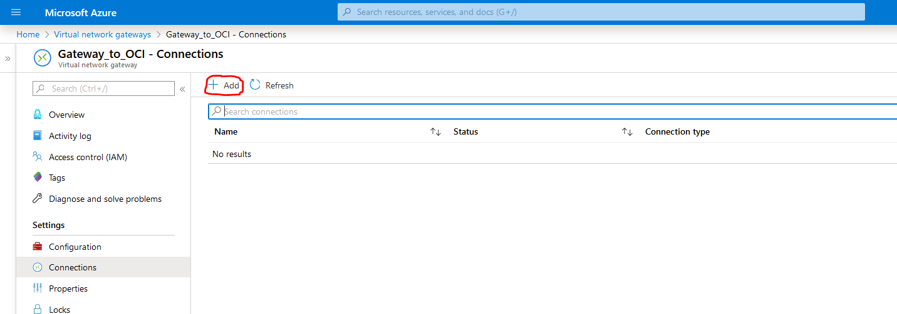

- On the **Add Connection** screen provide the following:

  - Name for the connection, such as **OCI_connection**.

  - Choose **Connection Type** as **ExpressRoute**.

  - Select your **ExpressRoute circuit** you created before.

  - Click **OK**.

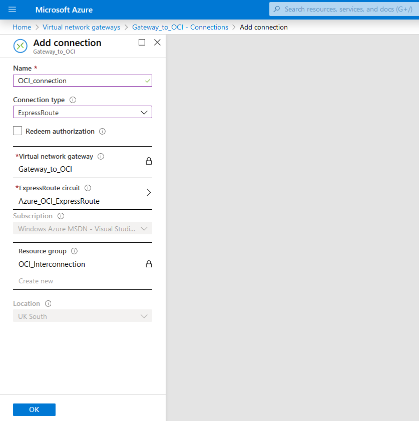

- Connection to ExpressRoute should appear on the list with status **Succeeded**.

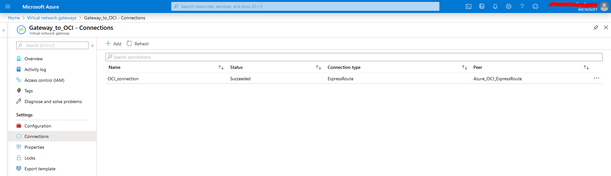

### Step 4: Associate Network Security group to Azure AppSubnet and create Inbound Security rules

You will reuse Network Security Group created automatically while creating Virtual Machine for your application

- Search for **Network security groups** in the search field and click on it.

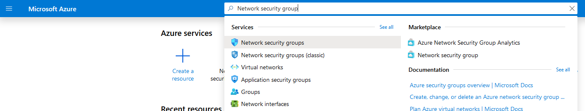

- Click on **MyApp-nsg**, which is associated with your virtual machine.

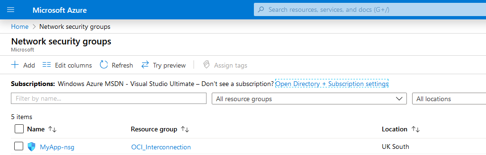

- Under **Settings** select **Subnets**, then click on **Associate** button and provide the following:

  - Select **Virtual network**: **VNet_Azure_OCI**.

  - Select **Subnet**: **AppSubnet**.

  - Click **OK**.

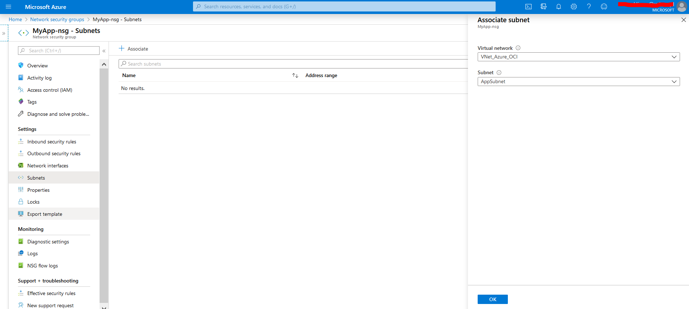

- The associated subnet and VNet should appear on the list as below: 

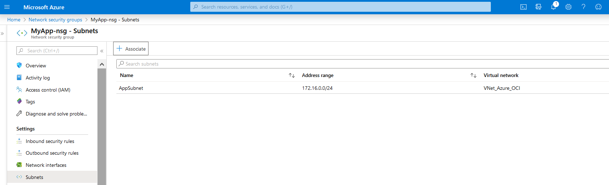

- Click on the **Inbound security rules** under **Settings** and then **Add** button in order to add relevant security group rules to allow traffic from Virtual Cloud Network on Oracle Cloud Infrastructure. 

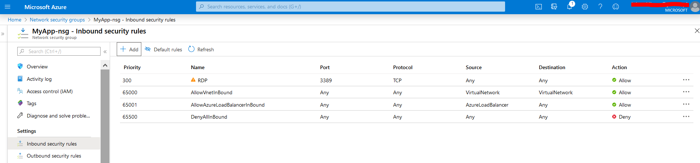

- You will add two rules, one for port 443 and another for 1521-1522 in order to enable connection to Autonomous Database through OCI VCN (10.0.0.0/16) from your Application running on Virtual Machine in Azure VNet Subnet (172.16.0.0/24).

  - Provide all the details as shown below.
  - Click **Add** button.

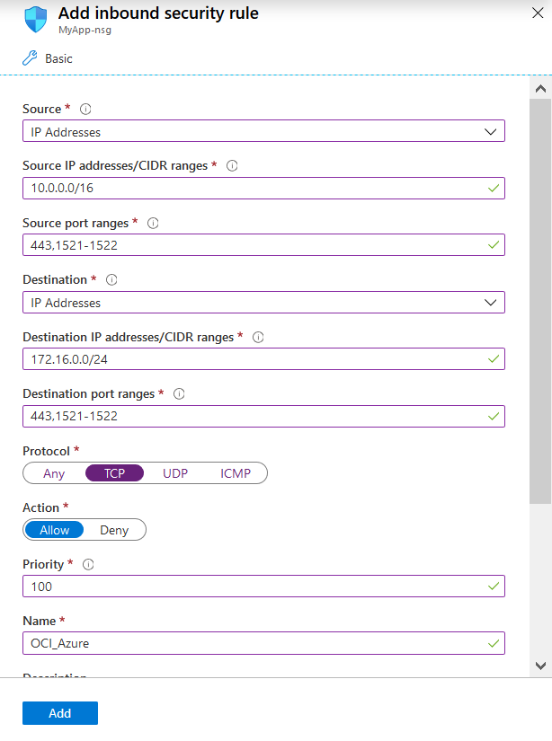

- Created **Inbound Security Rules** should appear on the list.

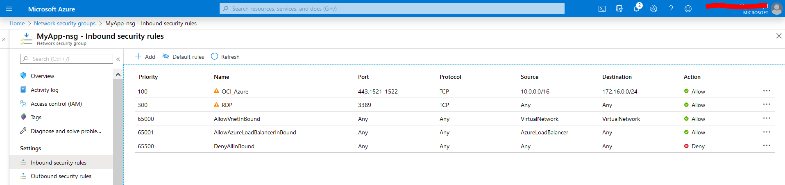

### **Step 5: Create Route table and associate it with Azure VNet**

- Search for **Route tables** in the search field and click on it.

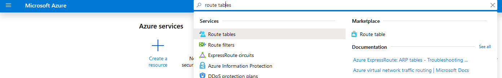

- On the **Route tables** screen, click **Add** or **Create Route Table** button.

- Under **Create Route Table** screen provide the following details:

  - Provide a **Name**, such as **OCI_Route_Table**.

  - Select your **Resource Group**: **OCI_Interconnection**.

  - Leave the rest as default.

  - Click **Create** button.

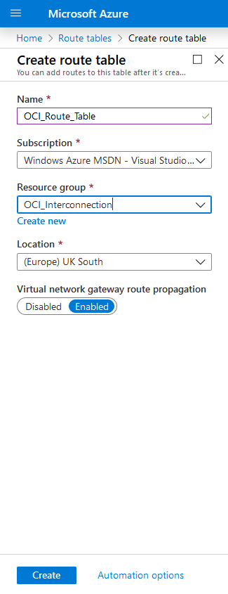

- Once the new route table is created, go to the resource, select **Routes** under **Settings** and click **Add** button in order to add a route. 

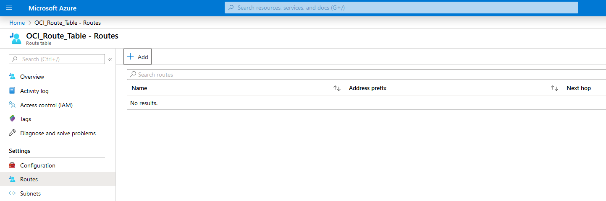

- On the **Add route** provide the following:

  - Name for the route, such as **Route_to_OCI**.

  - Address prefix of the OCI VCN: **10.0.0.0/16**.

  - Leave **Next Hop Type** as **Virtual Network Gateway**.

  - Click **OK**.

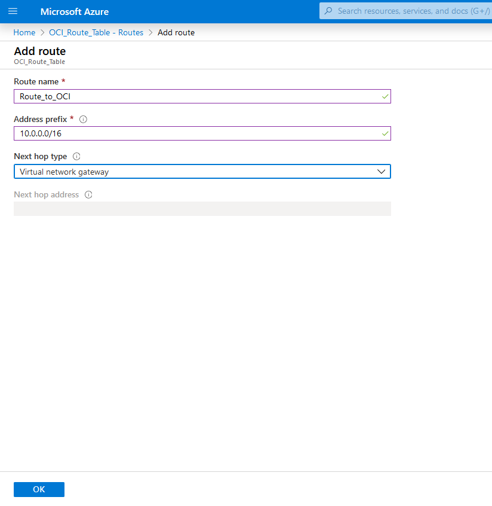

- The Route should appear on the list.

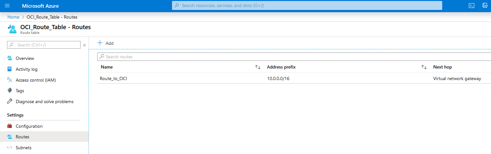

- Select **Subnets** under **Settings** and click **Associate** in order to associate created route table with AppSubnet.

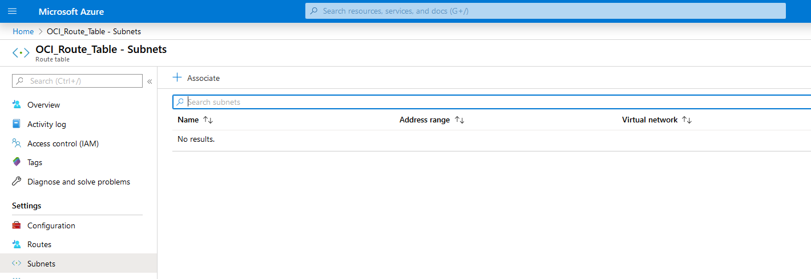

- On the **Associate subnet** screen please do the following:

  - Select **VNet_Azure_OCI** as Virtual network.

  - Select **AppSubnet** as Subnet.

  - Click **OK** to associate.

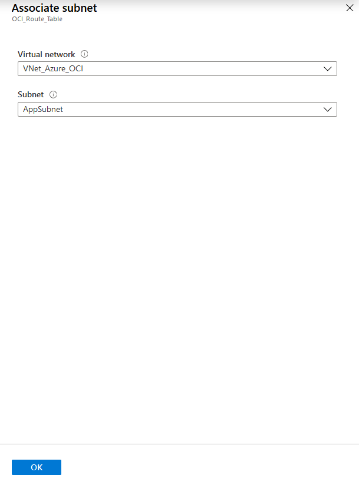

​    

- Associated subnet should appear on the list.

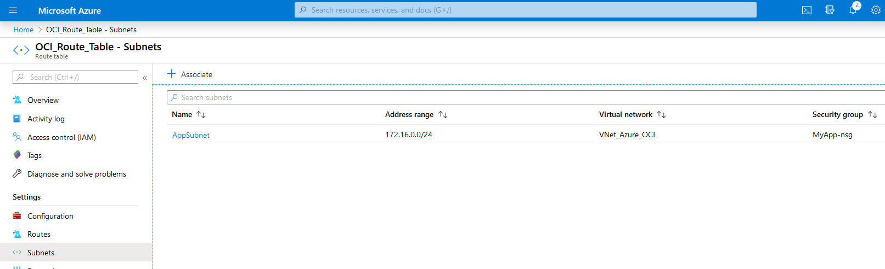

You have created an ExpressRoute, linked it with our Virtual Network  Gateway and configured network security group and route table to allow traffic connectivity with OCI VCN.

### Step 6: Test your Connection again

- Go to your Visual Studio installed on **MyApp** VM on Azure.

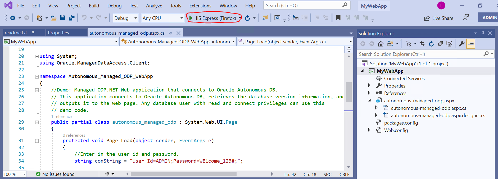

- Confirm that your application is connected to the Autonomous Database.

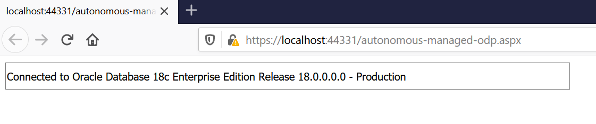

Congratulations! You are connected to Oracle Autonomous Database and have completed all laboratories.

------

#### **ATTENTION: If you are not going to use Cross-Cloud Interconnection, we recommend you to terminate it as soon as you finish the labs in order to avoid unnecessary costs**. You will find the steps in the [optional lab](LabGuide600TerminateInterConnection.md).

------

[Go to Overview Page](README.md)

