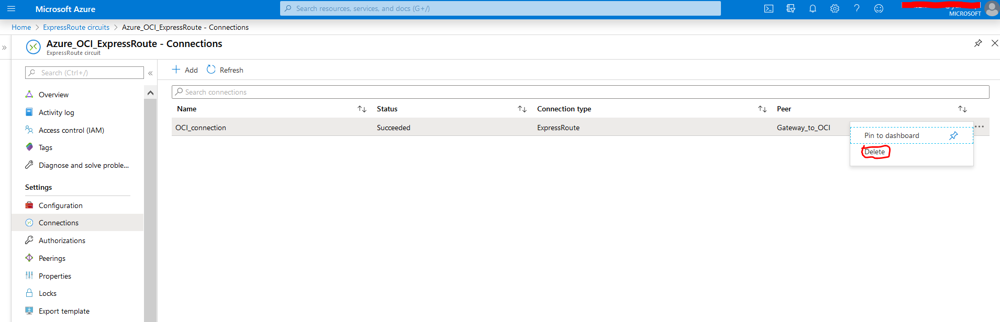
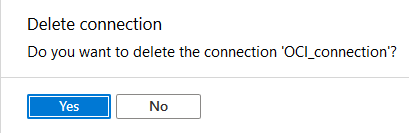
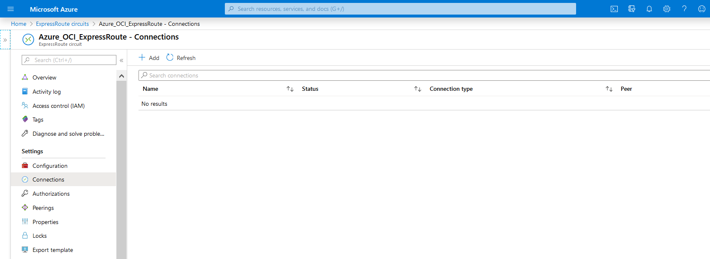
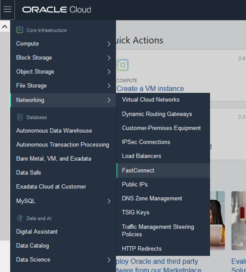
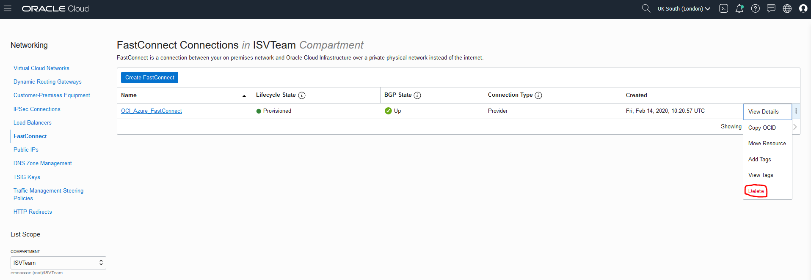
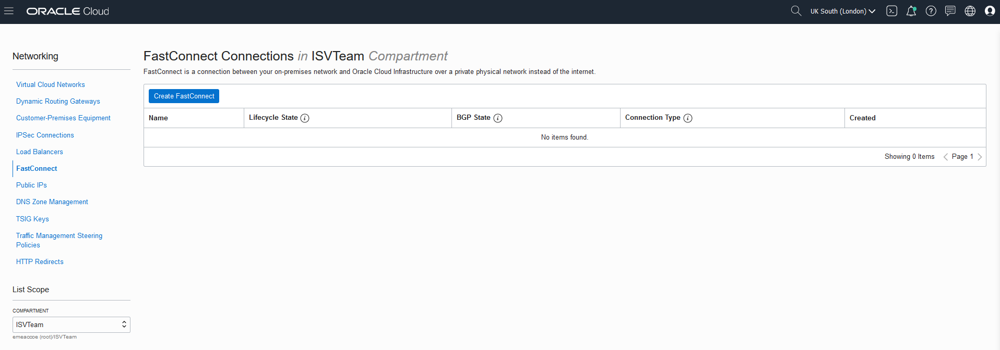
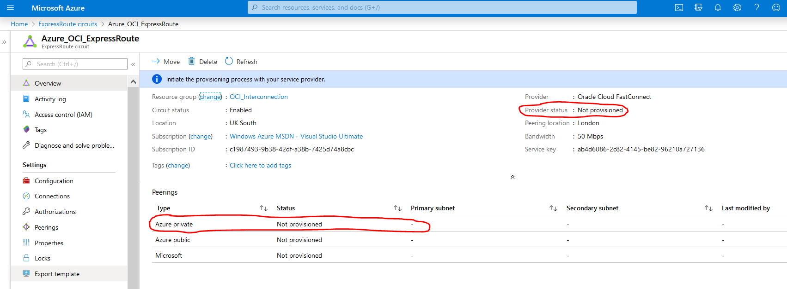
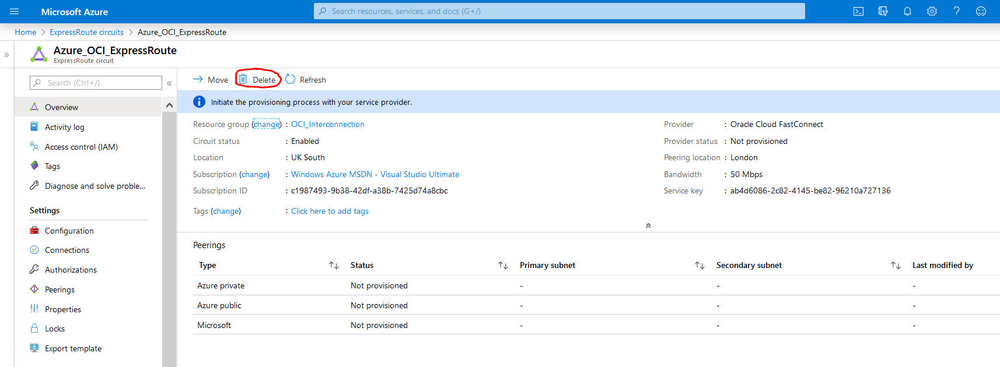
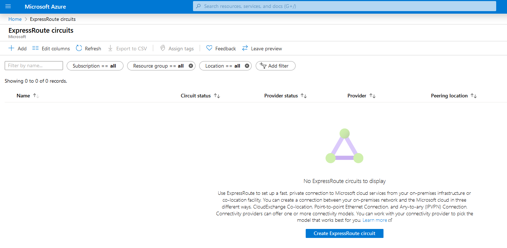

 

# Building Multi-Cloud Apps #

## Terminate Cross-Cloud Interconnect

#### **Introduction**

This optional lab will guide you through the steps of terminating the cross-cloud interconnection. The required steps have to be performed in the right order. You can look also into the [official documentation](https://docs.cloud.oracle.com/en-us/iaas/Content/Network/Concepts/azure.htm#set_up_cxn).

## Steps

### STEP 1: Delete connection from ExpressRoute circuit

- In the Azure portal, view the ExpressRoute circuit, then view its **Connections**. Click on 3 dots next to the existing connection and then **Delete**.

- Click **Yes** to confirm.

- Confirm that there are no **Connections** still in existence for the ExpressRoute circuit. All **Connections** must first be deleted before proceeding. 

### **STEP 2: Delete FastConnect circuit in Oracle portal**

- Open the navigation menu. Under **Core Infrastructure**, go to **Networking** and click **FastConnect**.

- Select the compartment where the connection resides, click the **3 dots** next to your connection and then select **Delete**.

            

- Confirm when prompted by clicking **Delete** again.

- Verify, that the FastConnect has been deleted.

### **STEP 3: Delete the ExpressRoute circuit** in Azure

- Confirm that the private peering for the ExpressRoute circuit has been deleted and the ExpressRoute circuit's status has changed to "Not Provisioned".

- Click **Delete** and confirm deletion.

- Confirm that there is no **ExpressRoute circuits** available.

Congratulations! You have terminated successfully Cross-Cloud Interconnection link. 

------

[Go to Overview Page](README.md)

