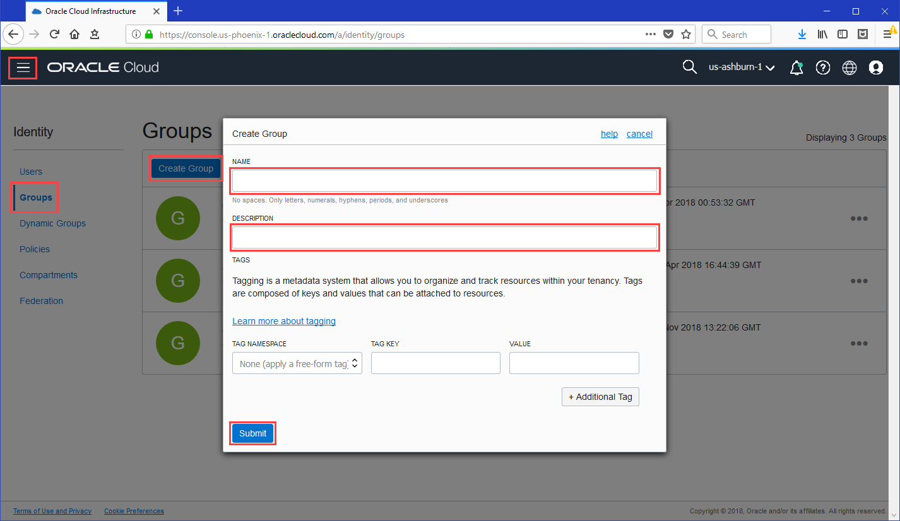
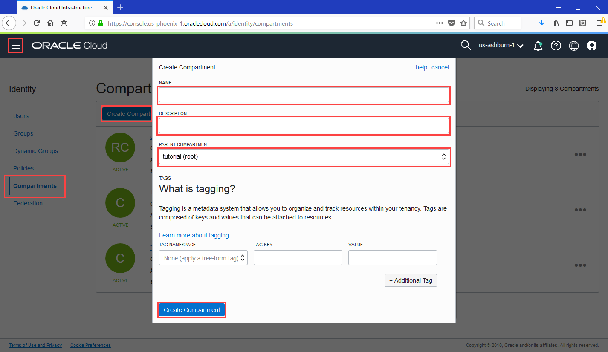
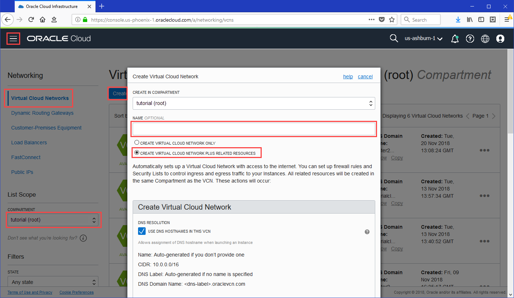
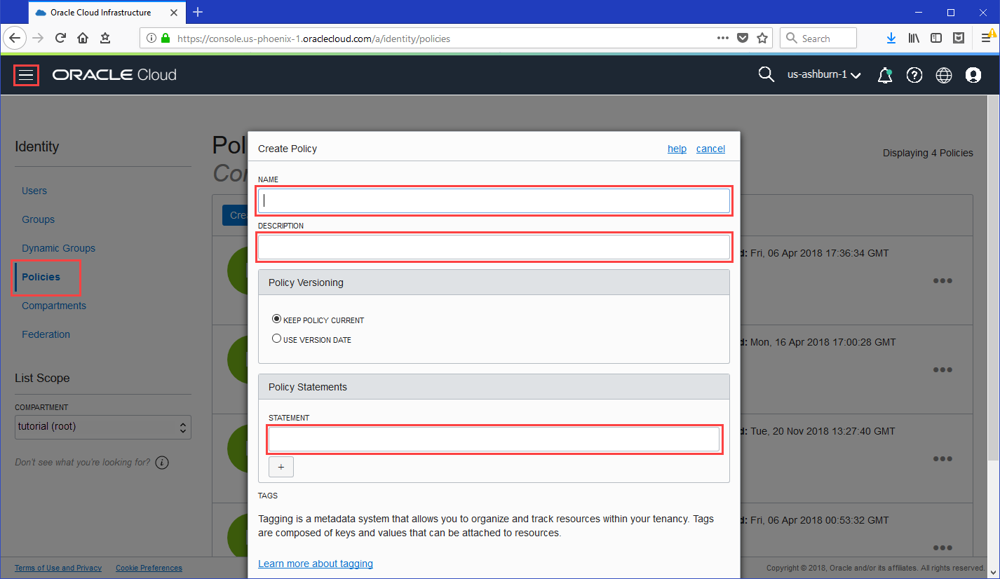

## A. Set up your **tenancy**

#### 1 Create groups and users




If suitable users and groups don't exist already, log in to the Console as a tenancy administrator and under **Governance and Administration**, go to **Identity** and then:


Create a new group by clicking **Groups** and then **Create Group**.


Create a new user by clicking **Users** and then **Create User**.


Add a user to a group by clicking **Groups**, then the name of the group, and then **Add User to Group**.


See [documentation](https://docs.cloud.oracle.com/iaas/Content/Functions/Tasks/functionscreatinggroupsusers.htm) for more details.


#### 2Create compartment




If a suitable compartment in which to create network resources and Oracle Functions resources doesn't exist already, log in to the Console as a tenancy administrator and under **Governance and Administration**, go to **Identity** and then:


Click **Compartments** and then **Create Compartment**.


See [documentation](https://docs.cloud.oracle.com/iaas/Content/Functions/Tasks/functionscreatingcompartment.htm) for more details.


#### 3Create VCN and subnets




If a suitable VCN in which to create network resources doesn't exist already, log in to the Console as a tenancy administrator and under **Core Infrastructure**, go to **Networking** and then:


Click **Virtual Cloud Networks** and choose a compartment.


Click **Create Virtual Cloud Network**, enter a name, and select the **Create Virtual Cloud Network Plus Related Resources** option.


See [documentation](https://docs.cloud.oracle.com/iaas/Content/Functions/Tasks/functionscreatingvcn.htm) for more details.

#### 4 Create IAM policies




Log in to the Console as a tenancy administrator and under **Governance and Administration**, go to **Identity** and click **Policies** and then:


Select the tenancy's root compartment, and create a new policy with the following two policy statements for the Oracle Functions service:

```
Allow service FaaS to read repos in tenancy
Allow service FaaS to use virtual-network-family in compartment <compartment-name>
```


If one or more Oracle Functions users is not a tenancy administrator, add the following policy statements to the new policy:

```
Allow group <group-name> to manage repos in tenancy
Allow group <group-name> to use virtual-network-family in compartment <compartment-name>
Allow group <group-name> to manage functions-family in compartment <compartment-name>
Allow group <group-name> to read metrics in compartment <compartment-name>
```


See [documentation](https://docs.cloud.oracle.com/iaas/Content/Functions/Tasks/functionscreatingpolicies.htm) for more details.

## B. Set up a **local machine** as a dev environment...

You can set up a local machine to be your Oracle Functions development environment. For most users, this will be the easiest way to start working with Oracle Functions.

#### 1Set up signing key


Log in to your local machine as a functions developer and:


Generate a private key encrypted with a passphrase that you provide by entering:

```
$ openssl genrsa -out ~/.oci/<private-key-file-name>.pem -aes128 2048
```


Change permissions on the file to ensure that only you can read it.

```
$ chmod go-rwx ~/.oci/<private-key-file-name>.pem
```


Generate a public key (encrypted with the same passphrase that you provided when creating the private key, and in the same location as the private key file) by entering:

```
$ openssl rsa -pubout -in ~/.oci/<private-key-file-name>.pem -out ~/.oci/<public-key-file-name>.pem
```


Copy the contents of the public key file you just created, by entering:

```
$ cat ~/.oci/<public-key-file-name>.pem | pbcopy
```


Log in to the Console as a functions developer, open the **User** menu () and go to **User Settings**. On the **API Keys** page, click **Add Public Key**. Paste the public key's value into the window and click **Add**. The key is uploaded and its fingerprint is displayed.


See [documentation](https://docs.cloud.oracle.com/iaas/Content/Functions/Tasks/functionssetupapikey.htm) for more details.

#### 2Set up OCI profile


Log in to your local machine as a functions developer and:


Open the file ~/.oci/config in a text editor. (If the directory and/or the file don't already exist, create them).


Add a new profile to the ~.oci/config file as follows:

```
[<profile-name>]user=<user-ocid>fingerprint=<public-key-fingerprint>key_file=<full-path-to-private-key-pem-file>tenancy=<tenancy-ocid>region=<region-name>pass_phrase=<passphrase>
```


Save and close the file.


See [documentation](https://docs.cloud.oracle.com/iaas/Content/Functions/Tasks/functionsconfigureocicli.htm) for more details.

## ...Or ... set up an **OCI compute instance** as a dev environment

Alternatively, you can set up an Oracle Cloud Infrastructure compute instance to be your Oracle Functions development environment. For some users, this will be more convenient than setting up a local machine.

#### 1Create Instance and obtain OCID


Log in to the Console as a tenancy administrator and:


Under **Core Infrastructure**, go to **Compute** and click **Instances**.

Select the compartment in which to create network resources and Oracle Functions resources.


If a suitable compute instance doesn't exist in the compartment already, click **Create Instance** and:

• select the compartment, VCN, and subnets for use with Oracle Functions

• specify that a public IP address is to be assigned to the new compute instance

• select the file that contains the SSH key to access the new compute instance


On the **Instance Details** page, copy the OCID and public IP address of the compute instance to use as the development environment.


See [documentation](https://docs.cloud.oracle.com/iaas/Content/Compute/Tasks/launchinginstance.htm) for more details.

#### 2Create a dynamic group


Create a new dynamic group to include the compute instance:


Under **Governance and Administration**, go to **Identity** and click **Dynamic Groups**.


Create a new dynamic group.


Enter a rule that includes the compute instance's OCID:

```
ANY {instance.id = '<instance-ocid>'}
```


See [documentation](https://docs.cloud.oracle.com/iaas/Content/Identity/Tasks/managingdynamicgroups.htm#three) for more details.

#### 3Create policy


Create a policy to give the new dynamic group access to function resources, network resources, and repositories in Oracle Cloud Infrastructure Registry:


Under **Governance and Administration**, go to **Identity** and click **Policies**.


Select the tenancy's root compartment and create a new policy with three policy statements:

```
Allow dynamic-group <dynamic-group-name> to manage functions-family in compartment <compartment-name>
Allow dynamic-group <dynamic-group-name> to use virtual-network-family in compartment <compartment-name>
Allow dynamic-group <dynamic-group-name> to manage repos in tenancy
```


See [documentation](https://docs.cloud.oracle.com/iaas/Content/Identity/Tasks/managingpolicies.htm#three) for more details.

## C. Complete **dev environment** setup

#### 1Install and start Docker


Log in to your development environment as a functions developer and:


Confirm that Docker is installed by entering:

```
$ docker version
```


If you see an error message indicating that Docker is not installed, you have to install Docker before proceeding. See the [Docker documentation](https://docs.docker.com/) for your platform (for Oracle Linux, see [here](https://docs.oracle.com/cd/E52668_01/E87205/html/docker_install_upgrade.html)).


Assuming Docker is installed, go to the [Prerequisites section of the Fn Project home page on GitHub](https://github.com/fnproject/fn#pre-requisites) and confirm that the installed version of Docker is at least the minimum version specified there. If not, re-install Docker before proceeding.


Launch the standard hello-world Docker image as a container to confirm that Docker is running by entering:

```
$ docker run hello-world
```


If you see an error message indicating that Docker is not running, you have to start the Docker daemon before proceeding. See the [Docker documentation](https://docs.docker.com/).


See [documentation](https://docs.cloud.oracle.com/iaas/Content/Functions/Tasks/functionsstartdocker.htm) for more details.

#### 2Install Fn Project CLI


Log in to your development environment as a functions developer and:


Open the [Fn Project CLI README.md](https://github.com/fnproject/cli/blob/master/README.md) file on GitHub and follow the appropriate instructions for installing the Fn Project CLI. As a convenient overview, the instructions are summarized below:

• **Linux or MacOS:** Enter:

```
$ curl -LSs https://raw.githubusercontent.com/fnproject/cli/master/install | sh
```

• **MacOS using Homebrew:** Enter:

```
$ brew install fn
```

• **Linux, MacOS, or Windows:** Download and run the binary from the [Fn Project Releases page on GitHub](https://github.com/fnproject/cli/releases).


Confirm that the CLI has been installed by entering:

```
$ fn version
```


See [documentation](https://docs.cloud.oracle.com/iaas/Content/Functions/Tasks/functionsinstallfncli.htm) for more details.

#### 3Create and configure Fn Project CLI context


Log in to your development environment as a functions developer and:


If you have set up a local machine as your development environment:

• Create a new Fn CLI context by entering:

```
$ fn create context <my-context> --provider oracle
```

• Specify that the Fn Project CLI is to use the new context by entering:

```
$ fn use context <my-context>
```

• Configure the new context with the name of the OCI profile you've created for use with Oracle Functions by entering:

```
$ fn update context oracle.profile <profile-name>
```


If you have set up an OCI compute instance as your development environment:

• Create a new Fn CLI context by entering:

```
$ fn create context <my-context> --provider oracle-ip
```

• Specify that the Fn Project CLI is to use the new context by entering:

```
$ fn use context <my-context>
```


Configure the new context with the OCID of the compartment you want to own deployed functions:

```
$ fn update context oracle.compartment-id <compartment-ocid>
```


Configure the new context with the api-url endpoint to use when calling the OCI API by entering:

```
$ fn update context api-url <api-endpoint>
```

For example:

```
$ fn update context api-url https://functions.us-phoenix-1.oci.oraclecloud.com
```


Configure the new context with the address of the registry and repository that you want to use with Oracle Functions by entering:

```
$ fn update context registry <region-code>.ocir.io/<tenancy-namespace>/<repo-name>
```

where <region-code> is a three character code indicating the registry location (see [here](https://docs.cloud.oracle.com/iaas/Content/Registry/Concepts/registryprerequisites.htm#regional-availability)), and <tenancy-namespace> is the tenancy's auto-generated Object Storage namespace string shown on the Tenancy Information page.

For example:

```
$ fn update context registry phx.ocir.io/ansh81vru1zp/acme-repo
```


See [documentation](https://docs.cloud.oracle.com/iaas/Content/Functions/Tasks/functionscreatefncontext.htm) for more details.

#### 4Generate auth token


Log in to the Console as a functions developer and:


Open the **User** menu () and go to **User Settings**. On the **Auth Tokens** page, click **Generate Token**. 


Enter a meaningful description for the auth token in the Generate Token dialog, and click **Generate Token**. The new auth token is displayed.


Copy the auth token immediately to a secure location from where you can retrieve it later, because you won't see the auth token again in the Console.


Close the Generate Token dialog.


See [documentation](https://docs.cloud.oracle.com/iaas/Content/Functions/Tasks/functionsgenerateauthtokens.htm) for more details.

#### 5Log in to Registry


Log in to your development environment as a functions developer and:


Log in to Oracle Cloud Infrastructure Registry by entering:

```
$ docker login <region-code>.ocir.io
```

where <region-code> is the same three character code you specified when configuring the Fn Project CLI context.

For example:

```
$ docker login phx.ocir.io
```


When prompted, enter the name of the user you will be using with Oracle Functions to create and deploy functions, in the format <tenancy-namespace>/<username>. For example, ansh81vru1zp/jdoe@acme.com. If your tenancy is federated with Oracle Identity Cloud Service, use the format <tenancy-namespace>/oracleidentitycloudservice/<username>.


When prompted for a password, enter the user's Oracle Cloud Infrastructure auth token.

You're now ready to start creating, deploying, and invoking functions.


See [documentation](https://docs.cloud.oracle.com/iaas/Content/Functions/Tasks/functionslogintoocir.htm) for more details.

## D. Create, deploy, and invoke your **function**

#### 1Create your first application


Log in to the Console as a functions developer and under **Solutions and Platform**, go to **Developer Services** and click **Functions**, and:


Select the region you intend to use for Oracle Functions (recommended to be the same region as the Docker registry specified in the Fn Project CLI context).


Select the compartment specified in the Fn Project CLI context.


Click **Create Application** and specify:

• `helloworld-app` as the name for the new application. You'll deploy your first function in this application, and specify this application when invoking the function.

• The VCN and subnet in which to run the function.


Click **Create**.


See [documentation](https://docs.cloud.oracle.com/iaas/Content/Functions/Tasks/functionscreatingfirst.htm) for more details.

#### 2Create your first function


Log in to your development environment as a functions developer and:


Create a helloworld java function by entering:

```
$ fn init --runtime java helloworld-func
```

A directory called helloworld-func is created, containing:

• a function definition file called func.yaml

• a /src directory containing source files and directories for the helloworld function

• a Maven configuration file called pom.xml that specifies the dependencies required to compile the function


See [documentation](https://docs.cloud.oracle.com/iaas/Content/Functions/Tasks/functionscreatingfirst.htm) for more details.

#### 3Deploy your first function


Log in to your development environment as a functions developer and:


Change directory to the helloworld-func directory created in the previous step:

```
$ cd helloworld-func
```


Enter the following single Fn Project command to build the function and its dependencies as a Docker image called helloworld-func, push the image to the specified Docker registry, and deploy the function to Oracle Functions in the helloworld-app application that you created earlier:

```
$ fn deploy --app helloworld-app
```


(Optional) Confirm that the helloworld-func image has been pushed to Oracle Cloud Infrastructure Registry by logging in to the Console as a functions developer. Under **Solutions and Platform**, go to **Developer Services** and click **Registry**. Choose the registry's region, then click the name of the repository you specified in the Fn Project CLI context to see the helloworld-func function within it.


(Optional) Confirm that the function has been deployed to Oracle Functions by logging in to the Console as a functions developer. Under **Solutions and Platform**, go to **Developer Services** and click **Functions**. Select the compartment you specified in the Fn Project CLI context, then click the helloworld-app on the Applications page to see that the helloworld-func function has been deployed to Oracle Functions.


See [documentation](https://docs.cloud.oracle.com/iaas/Content/Functions/Tasks/functionscreatingfirst.htm) for more details.

#### 4Invoke your first function


Log in to your development environment as a functions developer and:


Invoke the helloworld-func function in the helloworld-app that you created earlier by entering:

```
$ fn invoke helloworld-app helloworld-func
```

The 'Hello World !' message is displayed.

Congratulations! You've just created, deployed, and invoked your first function using Oracle Functions!


See [documentation](https://docs.cloud.oracle.com/iaas/Content/Functions/Tasks/functionscreatingfirst.htm) for more details.

#### 5Next steps


Now that you've created, deployed, and invoked a function, read the [documentation](https://docs.cloud.oracle.com/iaas/Content/Functions/Concepts/functionsoverview.htm) to find out how to:

• export function logs by configuring a syslog URL or sending logs to a storage bucket (see [Storing and Viewing Function Logs](https://docs.cloud.oracle.com/iaas/Content/Functions/Tasks/functionsexportingfunctionlogfiles.htm))

• pass parameters when invoking a function (see [Using the Fn Project CLI Commands to Invoke Functions](https://docs.cloud.oracle.com/iaas/Content/Functions/Tasks/functionsinvokingfunctions.htm#usingfncli))

• invoke a function using oci-curl (see [Sending a Signed Request to a Function's Invoke Endpoint (using oci-curl)](https://docs.cloud.oracle.com/iaas/Content/Functions/Tasks/functionsinvokingfunctions.htm#ocicurlinvoke))

• invoke a function using SDKs (see [Using SDKs to Invoke Functions](https://docs.cloud.oracle.com/iaas/Content/Functions/Tasks/functionsinvokingfunctions.htm#usingsdks))

####  You're done!

###### Find out more about **Oracle Cloud Infrastructure and Oracle Functions**

**Product Information**

See: User Guide ([HTML](https://docs.cloud.oracle.com/iaas/Content/Functions/Concepts/functionsoverview.htm) and [PDF](https://docs.cloud.oracle.com/iaas/pdf/ug/OCI_User_Guide.pdf)), [docs.cloud.oracle.com](https://docs.cloud.oracle.com/iaas/Content/home.htm), [Fn Project](https://github.com/fnproject/fn/)

**Attend Oracle Cloud Events**

See: [events.oracle.com](http://events.oracle.com/), [blogs.oracle.com](https://blogs.oracle.com/cloud-infrastructure/)

**Join the Community**

See: [Customer Community](https://cloud.oracle.com/community), [Forums](https://cloud.oracle.com/forums)

**Follow Oracle Cloud**

[ Facebook](https://www.facebook.com/OracleCloud)     [ Twitter](https://twitter.com/hashtag/OracleCloudZone)     [ YouTube](https://www.youtube.com/channel/UC60OcDzeEtn194-UPYNJs8A)

 

[About Oracle](http://www.oracle.com/corporate/index.html)

[Contact Us](http://www.oracle.com/us/corporate/contact/index.html)

[Legal Notices](http://www.oracle.com/us/legal/index.html)

[Terms of Use](http://www.oracle.com/us/legal/terms/index.html)

[Your Privacy Rights](http://www.oracle.com/us/legal/privacy/index.html)


[Copyright © 2018, 2019, Oracle and/or its affiliates. All rights reserved.](http://www.oracle.com/pls/topic/lookup?ctx=cpyr&id=en)