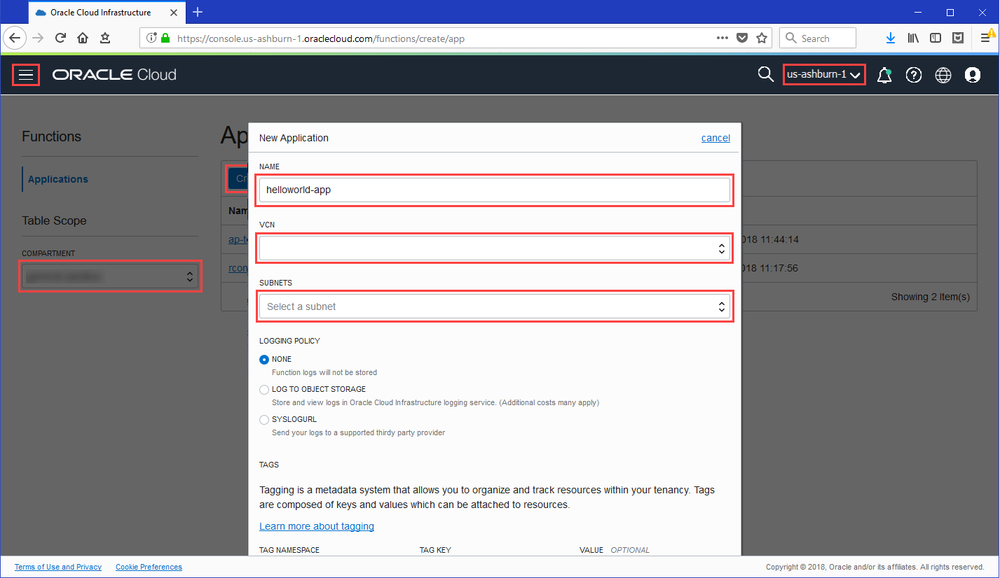
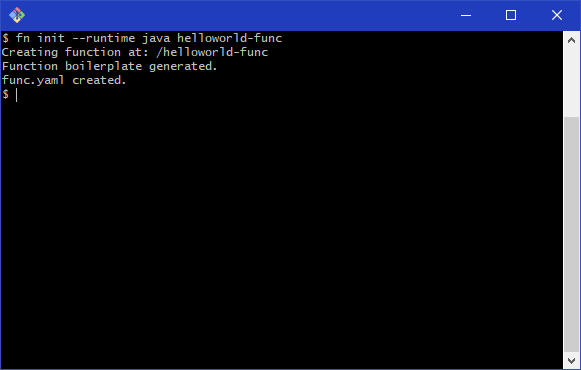
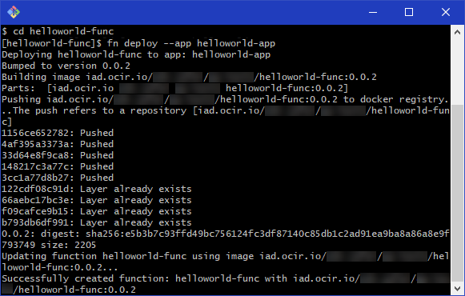
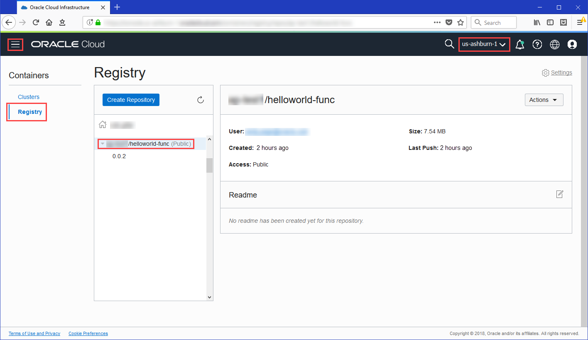
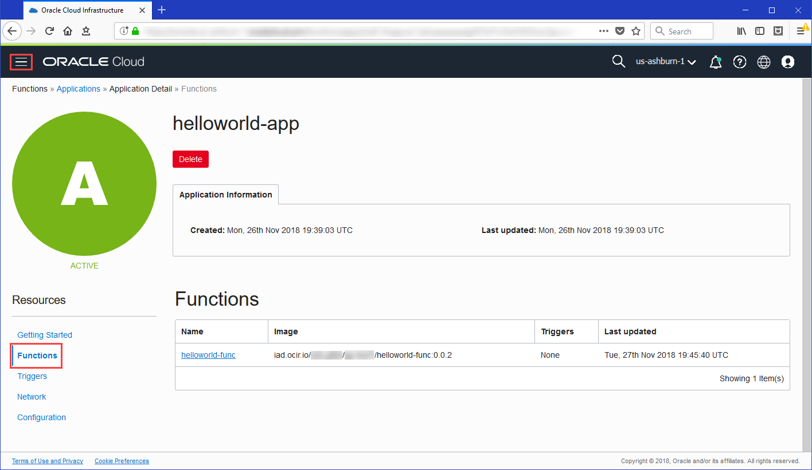
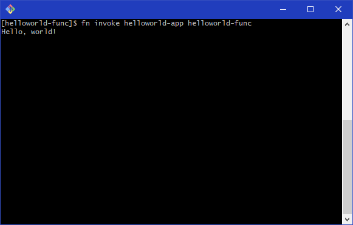

## Set up your Linux VM machine as a dev environment

#### Set up OCI profile

- Copy the file **config** from your lab documentation into the /home/oracle/.oci folder


#### Create and configure Fn Project CLI context

- Create a new Fn CLI context by entering:

```
$ fn create context faas --provider oracle
```

- Specify that the Fn Project CLI is to use the new context by entering:

```
$ fn use context faas
```

- Configure the new context with the name of the OCI profile you've created for use with Oracle Functions by entering:

```
$ fn update context oracle.profile mycontext
```

- Configure the new context with the OCID of the compartment you want to own deployed functions:

```
$ fn update context oracle.compartment-id <compartment-ocid>
```

- Configure the new context with the api-url endpoint to use when calling the OCI API by entering:

```
$ fn update context api-url https://functions.eu-frankfurt-1.oci.oraclecloud.com
```

- Configure the new context with the address of the registry and repository that you want to use with Oracle Functions by entering:

```
$ fn update context registry fra.ocir.io/<tenancy-namespace>/<your-repo-name>
```

where "tenancy-namespace" is the tenancy's auto-generated Object Storage namespace string shown on the Tenancy Information page.

and the "your-repo-name" parameter is the repository name you can choose, for example using your initials : jle-fn-repo

For example:

```
$ fn update context registry fra.ocir.io/oractdemeabdmnative/jle-fn-repo
```


#### Log in to Registry

Log in to Oracle Cloud Infrastructure Registry by entering:

```
$ docker login fra.ocir.io
```

When prompted, enter the name of the user you will be using  : api.user - this needs to be entered as 
"tenancy-namespace/api.user" .

When prompted for a password, enter api.user's  auth token as provided in your access document

You're now ready to start creating, deploying, and invoking functions.


## Create, deploy, and invoke your **function**

#### Create your first application



Log in to the Console as a functions developer and under **Solutions and Platform**, go to **Developer Services** and click **Functions**, and:

- Select the compartment **CTDOKE**

Click **Create Application** and specify:

• `helloworld-app` as the name for the new application. You'll deploy your first function in this application, and specify this application when invoking the function.

• The VCN and subnet in which to run the function.

Click **Create**.


#### Create your first function




Log in to your development environment as a functions developer and:

Create a helloworld java function by entering:

```
$ fn init --runtime java helloworld-func
```

A directory called helloworld-func is created, containing:

• a function definition file called func.yaml

• a /src directory containing source files and directories for the helloworld function

• a Maven configuration file called pom.xml that specifies the dependencies required to compile the function


See [documentation](https://docs.cloud.oracle.com/iaas/Content/Functions/Tasks/functionscreatingfirst.htm) for more details.


#### Deploy your first function



Log in to your development environment as a functions developer and:

Change directory to the helloworld-func directory created in the previous step:

```
$ cd helloworld-func
```

Enter the following single Fn Project command to build the function and its dependencies as a Docker image called helloworld-func, push the image to the specified Docker registry, and deploy the function to Oracle Functions in the helloworld-app application that you created earlier:

```
$ fn deploy --app helloworld-app
```



(Optional) Confirm that the helloworld-func image has been pushed to Oracle Cloud Infrastructure Registry by logging in to the Console as a functions developer. Under **Solutions and Platform**, go to **Developer Services** and click **Registry**. Choose the registry's region, then click the name of the repository you specified in the Fn Project CLI context to see the helloworld-func function within it.




(Optional) Confirm that the function has been deployed to Oracle Functions by logging in to the Console as a functions developer. Under **Solutions and Platform**, go to **Developer Services** and click **Functions**. Select the compartment you specified in the Fn Project CLI context, then click the helloworld-app on the Applications page to see that the helloworld-func function has been deployed to Oracle Functions.


See [documentation](https://docs.cloud.oracle.com/iaas/Content/Functions/Tasks/functionscreatingfirst.htm) for more details.


#### Invoke your first function




Log in to your development environment as a functions developer and:

Invoke the helloworld-func function in the helloworld-app that you created earlier by entering:

```
$ fn invoke helloworld-app helloworld-func
```

The 'Hello World !' message is displayed.

Congratulations! You've just created, deployed, and invoked your first function using Oracle Functions!


See [documentation](https://docs.cloud.oracle.com/iaas/Content/Functions/Tasks/functionscreatingfirst.htm) for more details.


#### Next steps

Now that you've created, deployed, and invoked a function, read the [documentation](https://docs.cloud.oracle.com/iaas/Content/Functions/Concepts/functionsoverview.htm) to find out how to:

• export function logs by configuring a syslog URL or sending logs to a storage bucket (see [Storing and Viewing Function Logs](https://docs.cloud.oracle.com/iaas/Content/Functions/Tasks/functionsexportingfunctionlogfiles.htm))

• pass parameters when invoking a function (see [Using the Fn Project CLI Commands to Invoke Functions](https://docs.cloud.oracle.com/iaas/Content/Functions/Tasks/functionsinvokingfunctions.htm#usingfncli))

• invoke a function using oci-curl (see [Sending a Signed Request to a Function's Invoke Endpoint (using oci-curl)](https://docs.cloud.oracle.com/iaas/Content/Functions/Tasks/functionsinvokingfunctions.htm#ocicurlinvoke))

• invoke a function using SDKs (see [Using SDKs to Invoke Functions](https://docs.cloud.oracle.com/iaas/Content/Functions/Tasks/functionsinvokingfunctions.htm#usingsdks))

####  You're done!


### Find out more about **Oracle Cloud Infrastructure and Oracle Functions**

**Product Information**

See: User Guide ([HTML](https://docs.cloud.oracle.com/iaas/Content/Functions/Concepts/functionsoverview.htm) and [PDF](https://docs.cloud.oracle.com/iaas/pdf/ug/OCI_User_Guide.pdf)), [docs.cloud.oracle.com](https://docs.cloud.oracle.com/iaas/Content/home.htm), [Fn Project](https://github.com/fnproject/fn/)

**Attend Oracle Cloud Events**

See: [events.oracle.com](http://events.oracle.com/), [blogs.oracle.com](https://blogs.oracle.com/cloud-infrastructure/)

**Join the Community**

See: [Customer Community](https://cloud.oracle.com/community), [Forums](https://cloud.oracle.com/forums)

http://www.oracle.com/pls/topic/lookup?ctx=cpyr&id=en)