# Part 1 – Provisioning OKE Cluster: # 

In order to begin the first part, you need to login to your cloud tenant: 

1.	Enter the following link: http://cloud.oracle.com/
2.	Input your tenant name, and click **Next**: 


       
3.	In the next screen, click on **Continue** using your SSO: 
       
4.	Enter your email address and password, and you're in.  
After you have logged in to your Oracle cloud account, you will see the following dashboard: 

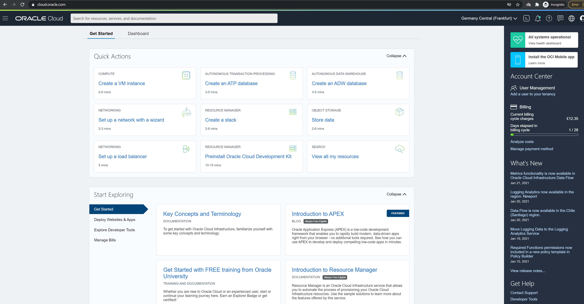

Now we can begin the workshop. 
## Creating the Cluster: ## 

In this step, we are going to create our OKE managed Kubernetes, as well as a few network settings, we will need for our workshop. After we will finish this step, we will validate that we can access the cluster. 

Creating the Kubernetes cluster: 
1.	Open the menu on the left side, by clicking on the Hamburger menu.
Scroll down to **Developer Services**, it will open a sub menu, click on **Kubernetes Clusters**.

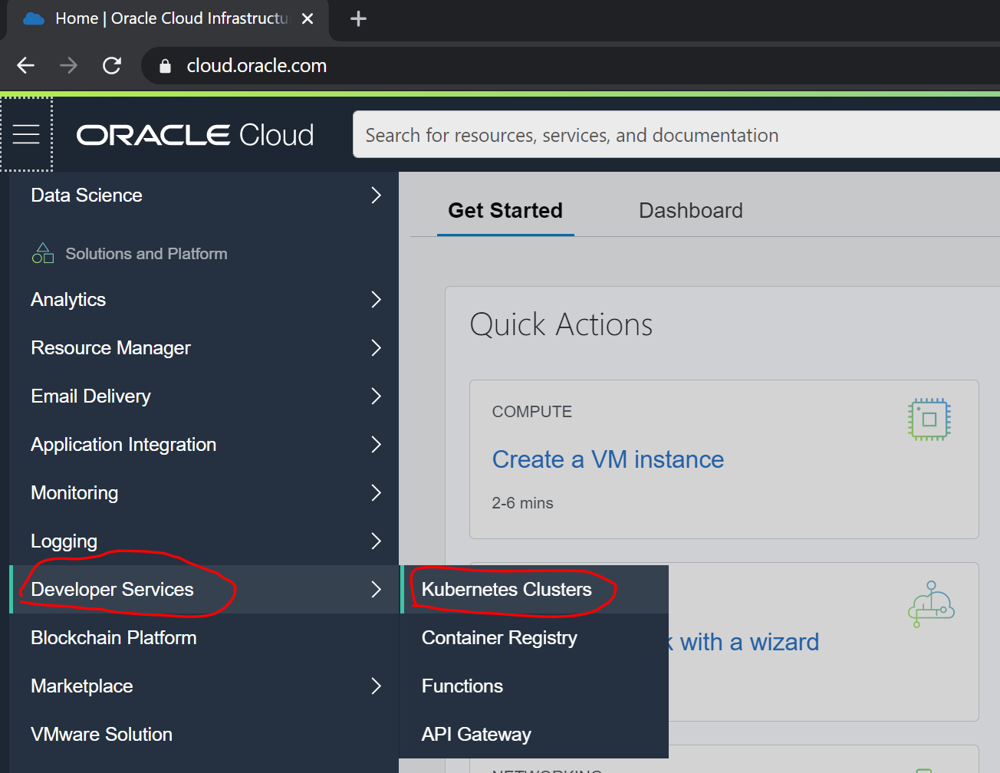
       
2.	In the next screen click on the **Create Cluster**. 

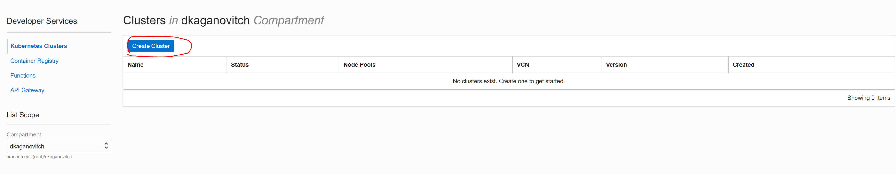
       
3.	In the next screen the default choice is **Quick Create**, for our workshop it is fine, but if you want to customize your networks and cloud resources for your Kubernetes cluster, I suggest doing custom create. 
Quick create, creates all the cloud resources for you. 
Click on **Launch Workflow** 

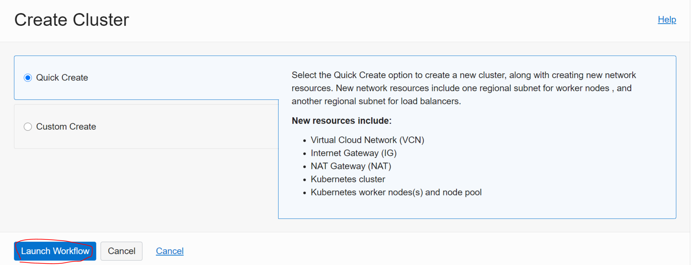

       
4.	In the following menu, you will have some parameters you will need to change for our workshop. 
Name: "Give your cluster a name, you can use **my-kube-cluster** or something else"
Compartment: "This is the compartment you want to create the cluster in" 
Kubernetes Version: "Leave it as the latest version available"
Choose Visibility Type: **Public**
(Will need the nodes, to have public access, for Grafana and the dashboard – later)
Shape: for our workshop I suggest choosing a small shape like **VM.Standard1.1** or **VM.Standard1.2**, 
the shape defines the amount of CPU per each worker node. 
Number of Nodes:  **3** (Leave it with 3 worker nodes) 

Now click on **Next**.

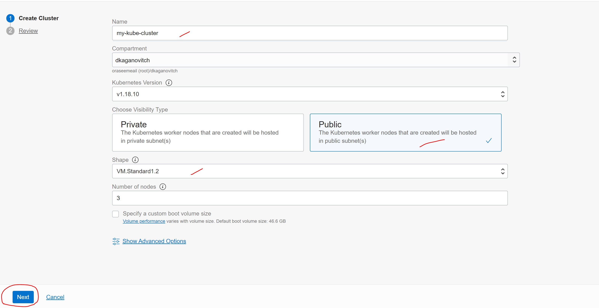

5.	Review and click on **Create Cluster**

This process will take a few minutes, sit back relax. 
Your Kubernetes cluster will be created. 

## Setting public IP and access to Kubernetes Nodes: ## 

Now we are going to set a secured public access to nodes as well as opening the ports we will need for this workshop. 

1.	Open google.com in your browser and search for: **show my ip** , copy the IP Address.

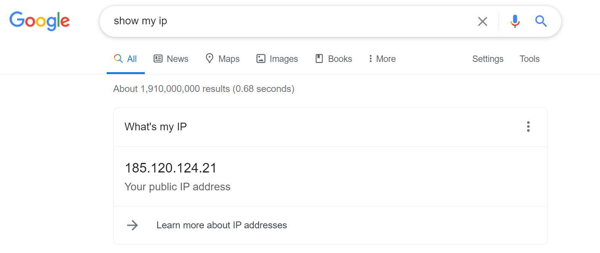
       
2.	Go back to Oracle Cloud, open the Hamburger menu and select **Networking** > **Virtual Cloud Networks**


       
3.	Choose your OKE VCN – the Virtual Cloud Network was created as part of the quick create action by Kubernetes. 

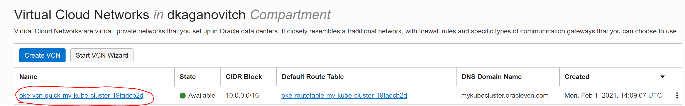
       
4.	On the bottom left menu click on **Security Lists** 

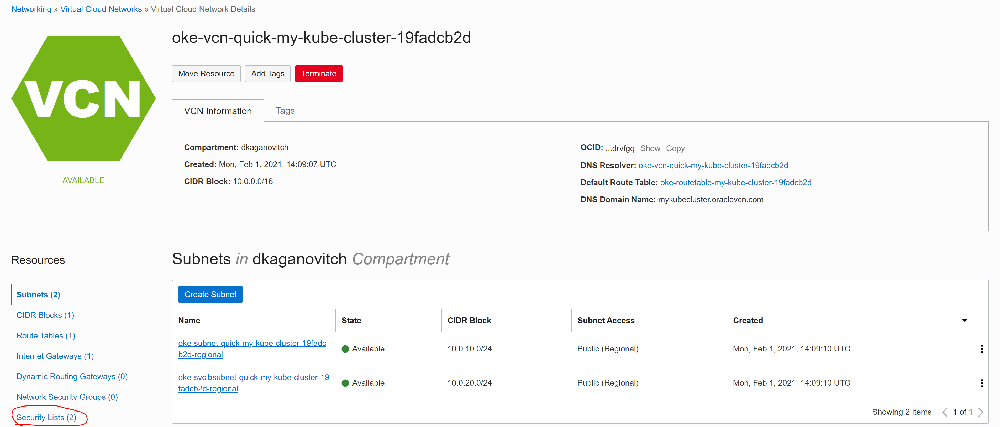
       
5.	Click on the **oke-seclist-quick-{generatedtext}**

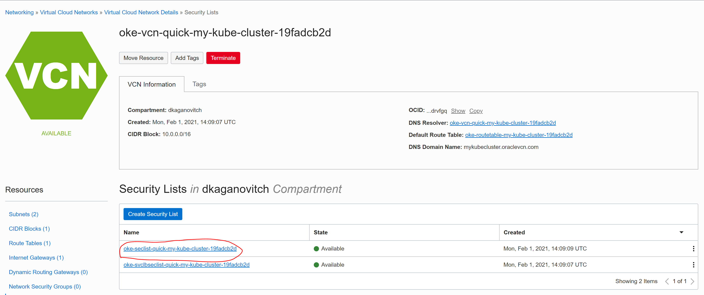
       
6.	Now the security list for the node network will open, you will want to update the 0.0.0.0/0 to your IP address, because you don't want it to be open for the whole internet. Go to the bottom of the security list and check the rule with the following destination port range: 30000-32767 (These are the Nodeports Kubernetes uses to expose service through worker node access) 
after you checked the rule, click on the edit button.

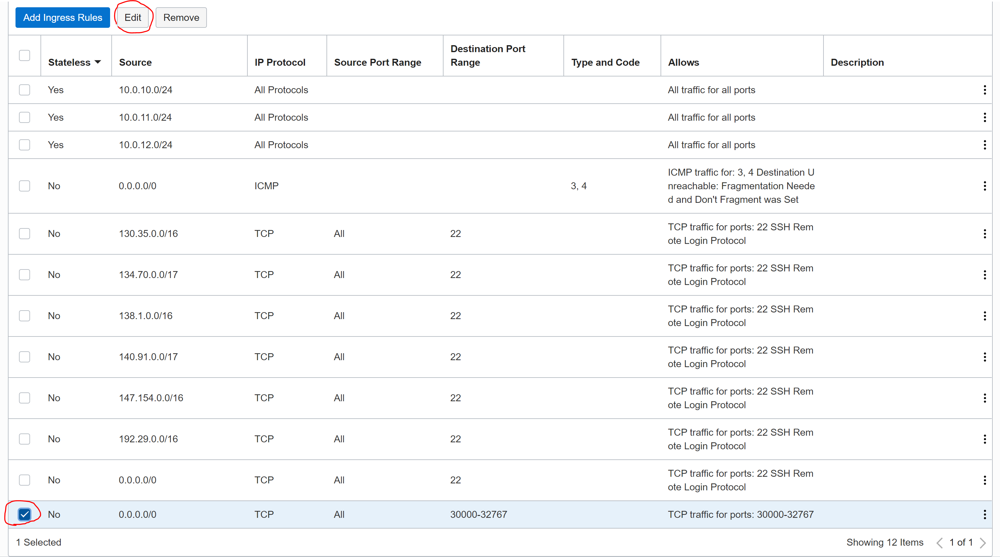

7.	Now edit the place where it has SOURCE CIDR to your IP address you copied from google and put the following prefix /32. It should look like this example:

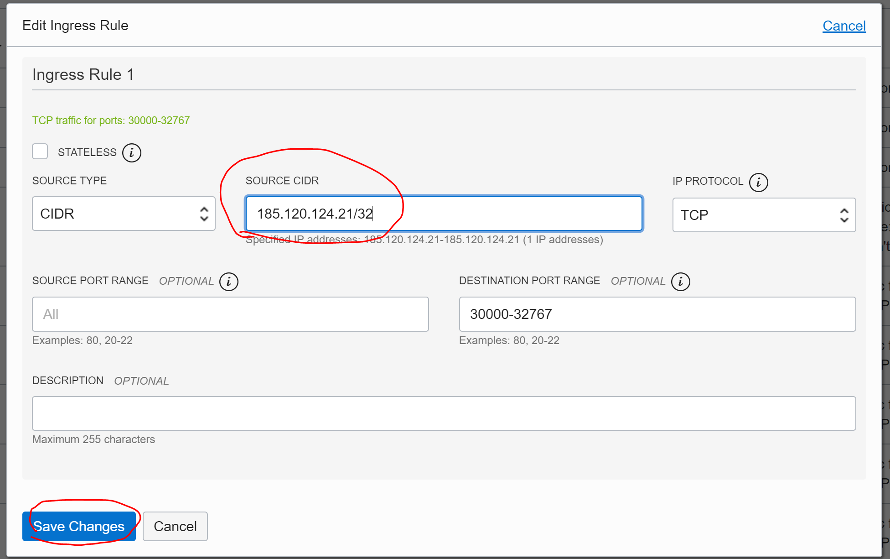

Finally, you have secured public access from your PC. 

### Access to your Kubernetes cluster: ###

1.	Open the menu on the left side, by clicking on the Hamburger menu.
Scroll down to **Developer Services**, it will open a sub menu, click on **Kubernetes Clusters**.


       
2.	Click on your OKE cluster 

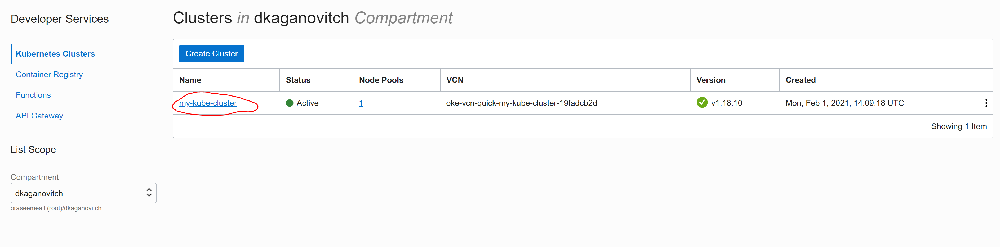


The OCI Cloud Shell is a great tool, it gives you a cloud terminal window, where it has all the tool set you need to manage and deploy on your cloud.
The tools we need now is OCI CLI, git, helm and Kubectl commands, in order to create the kubeconfig file and access it.

3.  Click on 'Launch Cloud Shell', after it comes up about 10~20 seconds, click on the copy button below to copy the command and paste it inside the Cloud Shell. 

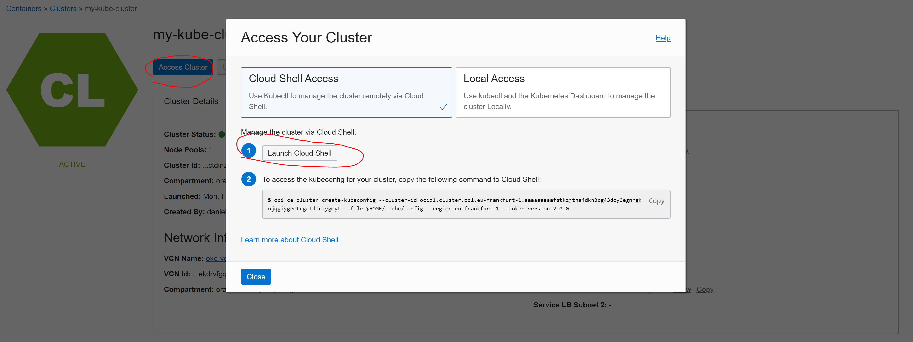
       
If you did it correctly, you should get the following response:
```
New config written to the Kubeconfig file /home/account/.kube/config
```
Or, if you have an existing cluster:
```
Existing Kubeconfig file found at /home/account/.kube/config and new config merged into it
```
Now, from your Cloud Shell, run the following command:
```
kubectl get ns
```
This will retrieve a list of all the created namespaces on your OKE cluster:

```
NAME              STATUS   AGE
cattle-system     Active   11h
default           Active   11h
kube-node-lease   Active   11h
kube-public       Active   11h
kube-system       Active   11h

```
Good job! Now you have a Kubernetes cluster up and running. 

[Continue to Part 2 Provisioning Flux](part2.md) 

If you want to return to the workshop homepage:

[Back to the general workshop section](README.md)
