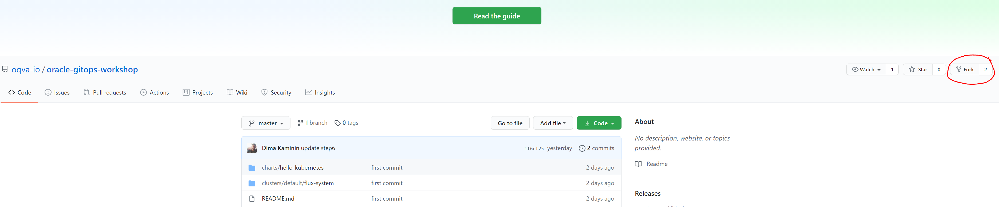
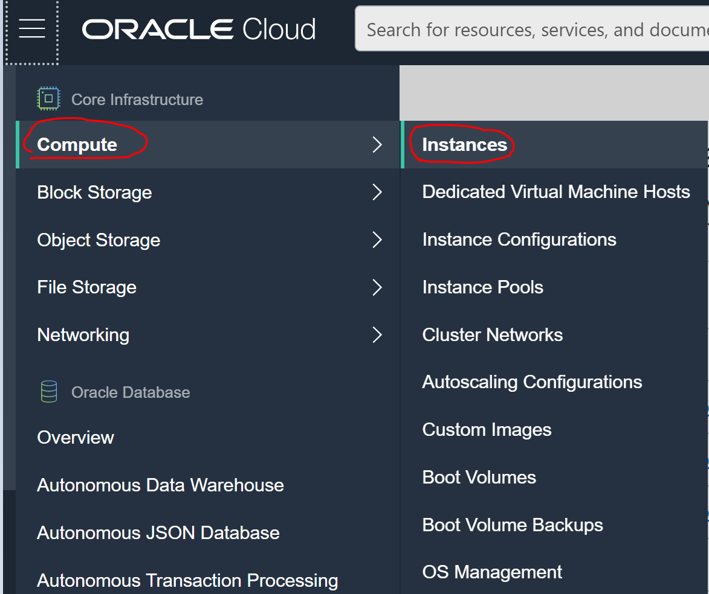
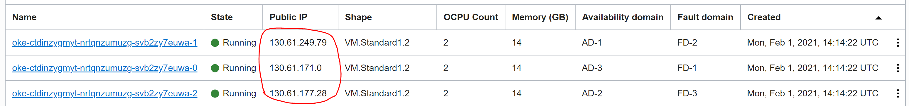
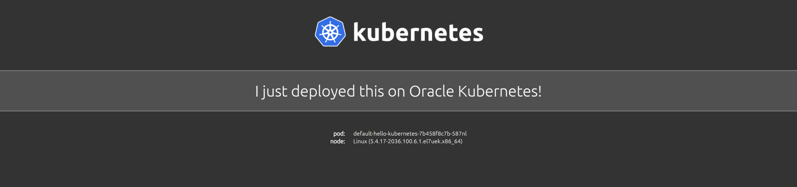

# Part 3 – Provision hello-kubernetes Application from GitHub # 

In this part we are going to provision the application, directly from your repository in GitHub, 
you will create a fork of the main project into your repository and you will deploy the hello-kubernetes application on your Kubernetes Cluster. 

1.	If you have a GitHub account, please go to https://github.com/ and login. 
If you don't have a GitHub account, you can simply create it here: https://github.com/join

2.	After you have logged in,
create a fork  https://github.com/oqva-io/oracle-gitops-workshop to your GitHub account



After clicking on fork - choose your repository, after the fork action – you should see the workshop files under your repository. 

Copy the URL of your GitHub forked project, it should be something like this: 
https://github.com/{username}/oracle-gitops-workshop
you just need to change the username in the URL.

3.	Open the CloudShell and add a variable for your GitHub repo: 
```
export GITHUB_REPO=https://github.com/{username}/oracle-gitops-workshop
```
*don't forget to replace the username
 
4.	Run the following command to create a source repo in Flux:
```
./flux create source git oracle-gitops-workshop \
--url=${GITHUB_REPO} \
--branch=master \
--interval=30s
```

output: 
```
> --url=${GITHUB_REPO} \
> --branch=master \
> --interval=30s
✚ generating GitRepository source
► applying GitRepository source
✔ GitRepository source created
◎ waiting for GitRepository source reconciliation
✔ GitRepository source reconciliation completed
✔ fetched revision: master/1f6cf257a81a9a5a43a2988a5b81e6ab9851adcd
```

5.	We are going to see the custom resource we added to Flux. We will see the oracle-gitops-meetup as flux git source, by running the following command: 
```
kubectl get gitrepositories.source.toolkit.fluxcd.io -A
```

output:
```
NAMESPACE     NAME                     URL                                                 READY   STATUS                                                              AGE
flux-system   oracle-gitops-workshop   https://github.com/deton57/oracle-gitops-workshop   True    Fetched revision: master/1f6cf257a81a9a5a43a2988a5b81e6ab9851adcd   4m23s
```

6.	Now it's time to provision the application, in this example we will use the hello-kubernetes application as an example. 
Run the following command:
```
./flux create kustomization oracle-gitops-workshop \
--source=oracle-gitops-workshop \
--path="./clusters/default/flux-system" \
--prune=true \
--interval=30s
```

output: 
```
► applying Kustomization
✔ Kustomization created
◎ waiting for Kustomization reconciliation
✔ Kustomization oracle-gitops-workshop is ready
✔ applied revision master/1f6cf257a81a9a5a43a2988a5b81e6ab9851adcd
```

In previous step, flux created Kustomization resource with all manifests from /clusters/default/flux-system path which is hello-kubernetes.yaml, 
the manifest of our helm chart.

7.	Lets check that Kustomize resource is added and synced to the latest git commit 
```
kubectl get kustomizations.kustomize.toolkit.fluxcd.io -A
```

output: 
```
NAMESPACE     NAME                     READY   STATUS                                                              AGE
flux-system   oracle-gitops-workshop   True    Applied revision: master/1f6cf257a81a9a5a43a2988a5b81e6ab9851adcd   63s
```

8.	When we added our Kustomize resource, flux detected the hello-kubernetes.yaml  helm manifest and applied him , lets observe the hello-kubernetes Helm charts are synced
```
kubectl get helmcharts.source.toolkit.fluxcd.io -A
```

output:
```
NAMESPACE     NAME                           CHART                       VERSION   SOURCE KIND     SOURCE NAME              READY   STATUS                                 AGE
flux-system   flux-system-hello-kubernetes   ./charts/hello-kubernetes   *         GitRepository   oracle-gitops-workshop   True    Fetched and packaged revision: 0.1.2   2m21s
```

9.	Let's review the installed Helm Charts 
```
kubectl get helmreleases.helm.toolkit.fluxcd.io -A
```

output:
```
NAMESPACE     NAME               READY   STATUS                             AGE
flux-system   hello-kubernetes   True    Release reconciliation succeeded   3m32s
```

10.	Verify that all resource is in running state:
```
kubectl get pod
```

output:
```
NAME                                        READY   STATUS    RESTARTS   AGE
default-hello-kubernetes-7b458f8c7b-4l285   1/1     Running   0          4m20s
default-hello-kubernetes-7b458f8c7b-587nl   1/1     Running   0          4m21s
default-hello-kubernetes-7b458f8c7b-j6cnh   1/1     Running   0          4m20s
```

11.	After we have checked that everything is up and running, it's to check our deployed application. For this step, you will need the cloud console. You can use the same or window in your browser, now go to the hamburger menu on the left, click on **Compute** > **Instances** 



12.	You can copy any public IP Address of one of the Kubernetes worker nodes: 



 
13.	Paste it in the web browser with the following port 30002 
http://workerIP:30002




Good job, your app is live and running! 


[Continue to Part 4 Release Upgrade with New Values](part4.md) 

If you want to return to the workshop homepage:

[Back to the general workshop section](README.md)

