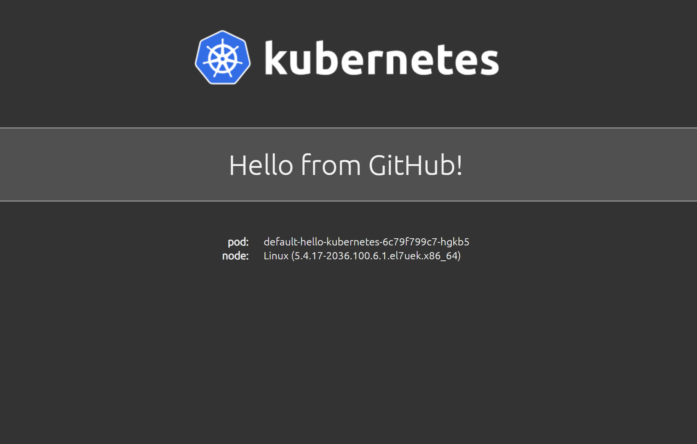

# Part 5 – Pause/Resume Features #

When you are doing git maintenance, 
like merging restructuring and etc.. 
and you don't want the flow to push every single change you make, 
you have the ability to pause and resume.

Let's start by pausing the Git repository hello-kubernetes reconcile

1.	Run the following command from your CloudShell: 
```
./flux suspend source git oracle-gitops-workshop
```

Output: 
```
► suspending source git oracle-gitops-workshop in flux-system namespace
✔ source git suspended
```
2.	Set watching for pods:

```
watch kubectl get pod
```

3.	Now we are going to make another update in our application. 
Go to your GitHub account and enter the new forked project.
Open oracle-gitops-workshop, then go to **clusters/default/flux-system**
Click on the following file: **hello-kubernetes.yaml**
Next click on the pencil and it will open the GitHub editor. 
 
Under the values section add new message, your result file should look like this:

```
apiVersion: helm.toolkit.fluxcd.io/v2beta1
kind: HelmRelease
metadata:
  name: hello-kubernetes
  namespace: flux-system
spec:
  interval: 1m
  timeout: 1m
  chart:
    spec:
      chart: ./charts/hello-kubernetes
      sourceRef:
        kind: GitRepository
        name: oracle-gitops-workshop
      interval: 1m
  targetNamespace: default
  values:
    message: Hello from GitHub V2!
```

•	Note if you are not sure and you are new to YAML and GitHub you can just copy the whole section from above and replace it with your file. 

 After you finished editing, it's time to commit the changes.
 In the bottom you will have a green button that says **Commit Changes**

Once you committed, go back to the watch screen in the Cloud Shell, and watch that the pods are not updated.  

4.	Stop the watch command by holding **CTRL + C** in the CloudShell.
Enter the following command, to get the reconciled git repository with latest commit:
```  
kubectl get gitrepositories.source.toolkit.fluxcd.io -A
```

Output:
```
NAMESPACE     NAME                     URL                                                 READY   STATUS                                                              AGE
flux-system   oracle-gitops-workshop   https://github.com/deton57/oracle-gitops-workshop   True    Fetched revision: master/72477914c0eb179327a9c410b1917447f0b13705   18h
```

You will notice that the latest Fetched version is the same as the previous age, 
and that's the expected result we want to get as we decided to suspend the operations. 


5.	Time to resume the reconcile:
```
./flux resume source git oracle-gitops-workshop
```

Output:
```
► resuming source git oracle-gitops-workshop in flux-system namespace
✔ source git resumed
◎ waiting for GitRepository reconciliation
✔ GitRepository reconciliation completed
✔ fetched revision master/84bcb305477df3f096cfe800894daddd5f530398
```

6.	Watch the pods being in a rolling upgrade process: 
```
watch kubectl get pod
```

7.	Let's see the present change from your browser:

http://workerIP:30002



Fantastic! You now know how to take control of the reconcile process if you need to do some maintenance on your repository.


[Continue to Part 6 ConfigMap Approach](part6.md) 

If you want to return to the workshop homepage:

[Back to the general workshop section](README.md)
