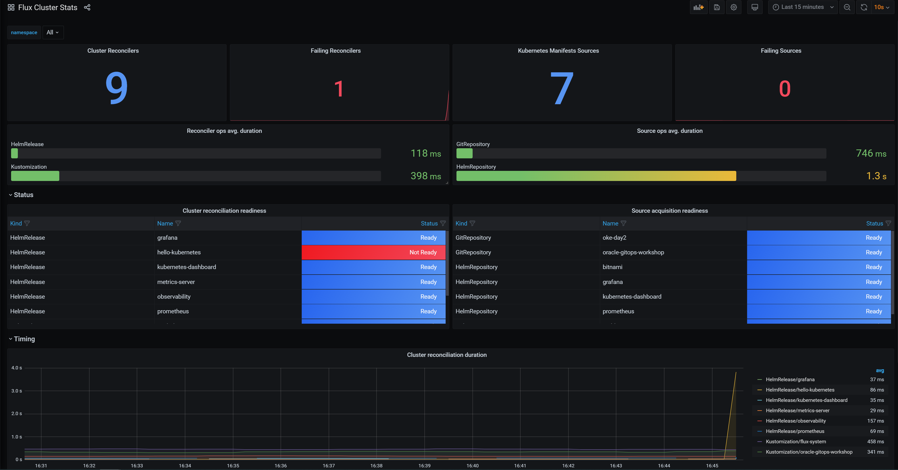
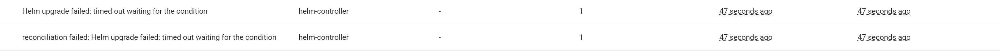
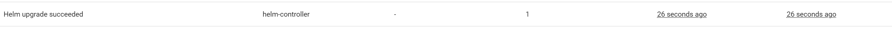
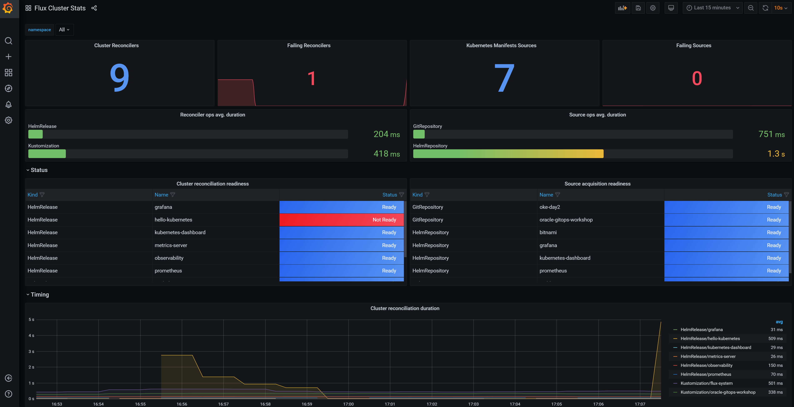
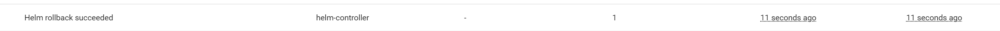

# Part 8 - Breaking the Helm Release #


In this part we are going to create an error, and we are going to see how we can notice it in our toolset. 

1.	Let's begin by watching the pods, run the following command from CloudShell:
```
watch kubectl get pod 
```

Before starting the commit, make sure **CloudShell**, **Grafana** and **Kubernetes Dashboard**,
if not go back to step 7 and open them from the last point where we finished the previous part.  

2.	Now it's time to commit the broken image in the repository

i.	Open **oracle-gitops-workshop** repository in your GitHub webpage

ii.	Go to **clusters/default/flux-system/hello-kubernetes.yaml** file

iii.	Сlick on the pencil to edit the file

iv.	Under the values section and broken image repository and click on **Commit changes**

```
apiVersion: helm.toolkit.fluxcd.io/v2beta1
kind: HelmRelease
metadata:
  name: hello-kubernetes
  namespace: flux-system
spec:
  interval: 1m
  timeout: 1m
  chart:
    spec:
      chart: ./charts/hello-kubernetes
      sourceRef:
        kind: GitRepository
        name: oracle-gitops-workshop
      interval: 1m
  targetNamespace: default
  values:
    message: This is new one
    image:
      repository: not-exists
  valuesFrom:
  - kind: ConfigMap
    name: myconfig
 ````
 
•	Note you can copy & paste the values to the GitHub editor

3.	Open the following 3 tabs: 

Grafana



Kubernetes Dashboard



Helm upgrade failed: timed out waiting for the condition
CloudShell

output:
```
NAME                                        READY   STATUS             RESTARTS   AGE
default-hello-kubernetes-58df79b9f9-tp2kz   0/1     ImagePullBackOff   0          6m50s
default-hello-kubernetes-784d569bb5-5nfpk   1/1     Running            0          37m
default-hello-kubernetes-784d569bb5-5s66w   1/1     Running            0          37m
```

The more tools you have the more insights about the deployment issue you will get, if you want alerts you can configure it in Grafana, 
if you want to see failures, you can see the events in the Kubernetes Dashboard. 
After we see the broken change, we can now revert to fix this. 
Alternatively, before reverting this change as mentioned in the next step, you can revert to your previous commit before you broke it.  


4.	Revert change of broken image repository

i.	Open **oracle-gitops-workshop** repository in your GitHub webpage

ii.	Go to **clusters/default/flux-system/hello-kubernetes.yaml** file

iii.	Сlick on the pencil to edit the file

iv.	Under the values remove image section and click on **Commit changes**


```
apiVersion: helm.toolkit.fluxcd.io/v2beta1
kind: HelmRelease
metadata:
  name: hello-kubernetes
  namespace: flux-system
spec:
  interval: 1m
  timeout: 1m
  chart:
    spec:
      chart: ./charts/hello-kubernetes
      sourceRef:
        kind: GitRepository
        name: oracle-gitops-workshop
      interval: 1m
  targetNamespace: default
  values:
    message: This is new one
  valuesFrom:
  - kind: ConfigMap
    name: myconfig
```

•	Note you can copy & paste the values to the GitHub editor

5.	Now it's time to open the 3 tabs to review the change and everything works fine. Open the following 3 tabs: 

Grafana


Kubernetes Dashboard



CloudShell

output:

```
NAME                                        READY   STATUS    RESTARTS   AGE
default-hello-kubernetes-784d569bb5-5nfpk   1/1     Running   0          42m
default-hello-kubernetes-784d569bb5-5s66w   1/1     Running   0          42m
```


6.	Now let's commit an invalid value to break the helm release with remediation
Verify that you are in watch in the CloudShell:

```
	  watch kubectl get pod 
```

7.	Commit broken image repository

i.	Open **oracle-gitops-workshop** repository in your GitHub webpage

ii.	Go to **clusters/default/flux-system/hello-kubernetes.yaml** file

iii.	Сlick on the pencil to edit the file

iv.	Under the values section and broken image repository and click on **Commit changes**

```
apiVersion: helm.toolkit.fluxcd.io/v2beta1
kind: HelmRelease
metadata:
  name: hello-kubernetes
  namespace: flux-system
spec:
  interval: 1m
  timeout: 1m
  chart:
    spec:
      chart: ./charts/hello-kubernetes
      sourceRef:
        kind: GitRepository
        name: oracle-gitops-workshop
      interval: 1m
  targetNamespace: default
  values:
    message: This is new one
    image:
      repository: not-exists
  upgrade:
      remediation:
          remediateLastFailure: true
  valuesFrom:
  - kind: ConfigMap
    name: myconfig
```

•	Note you can copy & paste the values to the GitHub editor


Grafana

	
Kubernetes Dashboard



CloudShell

output:
```
NAME                                        READY   STATUS             RESTARTS   AGE
default-hello-kubernetes-58df79b9f9-kn2sw   0/1     ImagePullBackOff   0          24s
default-hello-kubernetes-784d569bb5-5nfpk   1/1     Running            0          53m
default-hello-kubernetes-784d569bb5-5s66w   1/1     Running            0          53m
```


Don't worry about the broken pod, we configured remediation in the YAML and the deployment will heal itself. 


Excellent, now you have provisioned oke-day2 tools, and you have more eyes on your system. 


[Continue to Part 9 Sealed Secrets](part9.md) 

If you want to return to the workshop homepage:

[Back to the general workshop section](README.md)
