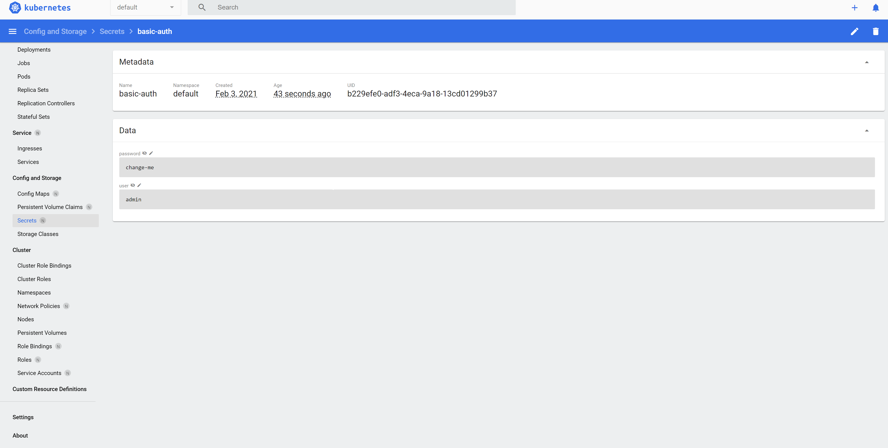

# Part 9 - Sealed Secrets #

A Kubernetes controller and tool for one-way encrypted Secrets
Sealed Secrets is composed of two parts:

•	A cluster-side controller / operator(oke-day2 included)

•	A client-side utility: kubeseal

The kubeseal utility uses asymmetric crypto to encrypt secrets that only the controller can decrypt.

1.	Let's start – first step Install Kubeseal , open CloudShell and run the following Commands: 
```
wget https://github.com/bitnami-labs/sealed-secrets/releases/download/v0.14.1/kubeseal-linux-amd64 -O kubeseal
chmod +x Kubeseal
```

2.	At startup, the sealed-secrets controller generates a 4096-bit RSA key pair and persists the private and public keys as Kubernetes secrets in the flux-system namespace. 
The public key can be safely stored in Git and can be used to encrypt secrets without direct access to the Kubernetes cluster.

You can retrieve the public key with the following command:
```
./kubeseal --fetch-cert \
--controller-name=sealed-secrets \
--controller-namespace=flux-system \
> pub-sealed-secrets.pem
```

3.	Let's view the content of the public key
```
cat pub-sealed-secrets.pem
```
example output: 
```
-----BEGIN CERTIFICATE-----
MIIErjCCApagAwIBAgIRAN2djC0YoBwYRhk+t/Ihwx4wDQYJKoZIhvcNAQELBQAw
ADAeFw0yMTAyMDMxNDE5MDFaFw0zMTAyMDExNDE5MDFaMAAwggIiMA0GCSqGSIb3
DQEBAQUAA4ICDwAwggIKAoICAQCvA8KPcGdocdxb8IWvmsyxYafxbivz/WJghYiH
KHyxgzOpLVrR/fMYG5t8k9+MH5hyfxGLx55h9N/MXnLLO7tVI8QdSyOJ+VooGxPA
ZjW2rfsx//UN7qLWS/pKPRW8v/ATnqt6/KvrRxK4FE836hCy+IG6mQV73Qb2SJkg
8Eo8AfspZZ0LtCISzgl9h2PF1h7ucAAPqBrgSTlds58MH5IRWa7PNf23BLyoOaZU
NtfmgFvtCM/aRYbTB7dw2d9rgKRx8M602AvENZBz+OUhM36RBH6XxlZNA/snVjLJ
rt0AR7SoKli8yVoNBVTdRkMNM3FqKPS6VSjBW2tLGyAoVX3SSazeDOZPmOR6enQG
pNoDE6U35i4TEigbAxMUahiBmz92AysJtFyd8UI3dYKNXEgEY9uoBQHI8fCj51OG
S6/w5Yj/RQlvaVA+jF1YfVcMc7Ot9pgp57qzR36sjRJ/6CTTOUAS3VU8jY61Qejy
DAmxIZ9P1OC62Vpsj0Bdi9p18uiX8kJBE0umZ+xUbtKg+WQCekdhUzkiwxp+c8Ks
uhevg8/bKp0fJIzZ1XwPKGH9YdGfqUX8/3t6nhNIA9v3h/F/XZiD/XcoTVoihhTX
BIDYaxWSDq9PZdtfePxaw5ORkK9FKajAAQb+D9yiB6U+caPip+f1AKMkmfCOXLJs
l1ni3wIDAQABoyMwITAOBgNVHQ8BAf8EBAMCAAEwDwYDVR0TAQH/BAUwAwEB/zAN
BgkqhkiG9w0BAQsFAAOCAgEAkD5G4MXsWOFJrvxLFaJJeVVznslqzGExZNxoCLTJ
D62IT8OTF9wU5p7DP15kNWcg69aSc0umwnHKY4wGFt58avlIid9kFJAufzsS3okA
GpPhZPPcN94h4+4FCxKiSHe1utdVA8j50piBCfD+elJxAVR3JZ5nwUxc4/gtD2VK
UIe4yigkp3jhjUn/Iui3k/4rmQeJ5sRiJzTqLqOI0fGeRsuV7rtUpqnOViAHDb7m
wQyuPGLK3IaDC9zuuaHxd4bqdIJiWI2zv0+o7OUCHR1wjR3fdWZ9WA8BK+r9SGGr
GEhtpousN3hxtWg39HMKQqSymciY1g1DI39ApNAgT/YPSBCX4hixL/VCwbmMErev
ptQqI+wrIZ4JEUNGUTVHmj8wUEhR+fgBNrvE/cfzSSbyq71DPX7nT5tVBU8Nff4i
Q11J1ywuTFRpi34JZpXzPXVVNNRQ6ICswWpzIgTKGQ0Ql7TMwPpZ2Llrvexx5BfT
qySrrrD43EhheAAqvOwwXJayGF0wPcAJFCrczt6cWj3QHD+49cZJ8f4FgwcxH48N
GTPgrtNxk3q7l10R8GPtGjSdrz2LK0llFZfmtRS+ejlTIxZeOyKVxE96LdxmpcdY
QRC2Ge5/OOItTNOQ7hSiSCjwJNpDeecUzltKTbLkxXTaBcSxleEpOelE3UVyhKpq
cvw=
-----END CERTIFICATE-----
```

4.	Next generate a Kubernetes secret manifest:
```
kubectl -n default create secret generic basic-auth \
--from-literal=user=admin \
--from-literal=password=change-me \
--dry-run \
-o yaml > basic-auth.yaml
```

5.	let's view the secret manifest content
```
cat basic-auth.yaml
```

example output:
```
apiVersion: v1
data:
  password: Y2hhbmdlLW1l
  user: YWRtaW4=
kind: Secret
metadata:
  creationTimestamp: null
  name: basic-auth
  namespace: default
```

6.	Let's encrypt the secret with Kubeseal:
```
./kubeseal --format=yaml --cert=pub-sealed-secrets.pem \
< basic-auth.yaml > basic-auth-sealed.yaml
```

7.	Let's see the content of the encrypted secret
```
cat basic-auth-sealed.yaml
```

example output: 
```
apiVersion: bitnami.com/v1alpha1
kind: SealedSecret
metadata:
  creationTimestamp: null
  name: basic-auth
  namespace: default
spec:
  encryptedData:
    password: AgBnXipn+UEfxni8P43BqGofln/fnzfh3pHAWRpexHSNb/+qRRKh3CjA4G0eyjlgBHT3QVlFbw81Nwxu3yJUev92pwSIFUTDQeQzKu60xSZPCMYJwwMadUdwGajmtf67Z32mANqjVaQz3Na71PEyZSJPGdmkKwmDEMg8Ecr4WMAYel99XKsCrgZ1PRr0EeoUSUHhqaHKkNppH9vyyM/oVJeCTuK9FWH7zTc5WfuHmF/rL4qEWXBfCgtjEoca0vad6qTqSp6HCbiB9nfCD9m7ElGrw9c56nfLiItu1ig6sq5iRnVG/wtsolheG4SVbN0+nKYg9dmCXo40pZShhrgp7tq2+dMf9v0t7QzSK8U1YMXtUMyDXJkjZdoDM1EHtmKsw/ShDGRvm2GU2RYp5nIUPEeB9gbi0649BW7bUp7GFXzBr2skrgyB2dirJCE+gYmQLzN5MzhbZQEBvB8Xm7t1KOpeogs5ulHI5UkNi+O7Oq+tfTcRAXeW1A5DvmiNKwqVGuhnHtgj9fuBbK8Q7BAEWVMGhcEjUT81WqLYhEX2n673cUouHrc1ey2LYXVq3AQLTW3VAEVnbHlv530qP//TW7rKTgmCJAoI4iRl8BhdM5RRJn5ES5sfmXNNiVHdmdFrYKLxqWkS0Q1jly9jG+k3Tb5kEfRjvFgxqPYYLl7CPYpBXsC2iycmO5esxBGPVDPF1RZNOjduwlro/Ac=
    user: AgCZuS24YowKAQzVLyEIqNaQ50p0cEQG5ije2/scGylXC6oLsmjekzGiCPg0wQ5g/IGBDqkfH0I6Prf17rXu8SoLtrJOJ0C2or11qZJSXMdzAsh4X/pYbtiuMJz1WLNYduFVRhBgKZ+uxpkZGlK7EuhwBM8CaDsM7Zz6dOXDA813JannMAT3IAF2/oJIZAwXhsFCwV1vuugulphMbJZ5NqQMsTzEdqmNscj4iTKua+ZK4dT6BXalcXGO3eRmqNaGV6KlicEd9qKGv+fpFSTqIH2o9D485SIK/ixqwc+dkeTHLRp3gwj5gTj7o8tzp6QEh0e70/tK+9pUdcv9M439h19es8v2aoyXRmME6iizhR+7O5jFBZEIv4byN4lraDTLC1q0NlzAnLc0mWTDCgJcvv9BnSd7QpexmIt3NFfAIG0vxsInQFtsdoAd1CSEZWFlo8ha8rMj/BBaz2R0Nuy1c3n0TiY2pBpV+CuV4reXNqfOd9vsxpJdKvgly6dbiRFOiP8C2S1GFfMxzf3ToEIjcHE3zW2rDnZn2b6mK2oNuEckxZfa/kQi8IuJldraX8mfrl7Rme9JWb4XBPWxAuwQQyhcMNA0uIb3sCAMEXIC2U6Cn3IRCvUl7VYv1mlgLC+byFZFgwdGgcQYWW0zpGW3m/tbOFJch5QggiO5pTmexizhBCoSAbPi4jU/0PuHWAqoXq3sUpiDFA==
  template:
    metadata:
      creationTimestamp: null
      name: basic-auth
      namespace: default
```


8.	After we finished let's commit the manifests basic-auth-sealed.yaml to our Git repository 

i.	Open oracle-gitops-workshop repository in your GitHub webpage

ii.	Go to **clusters/default/flux-system/** directory

iii.	Сlick on **Add file** -> **Create new file**

iv.	Fill filename **basic-auth-sealed.yaml** to Name your file... field

v.	Copy & Paste basic-auth-sealed.yaml content to text area and click on **Commit changes**


9.	Let's validate the secret manifest decrypted inside Kubernetes from the Kubernetes dashboard

i.	Open the Kubernetes dashboard from your browser http://workerIp:30000

ii.	Click on Secrets

iii.	Click on basic-auth

iv.	Click password and user eye to see real values




Well done! You finished the last part of this workshop, you learned about GitOps on OKE, about how the process works, 
how to operate it and which tool set can help you in debugging the day to day operation with deploying to Kubernetes. 

If you want to delete the environment from your Cloud Account:

[Click here for Cleaning all Resources Guide](clean.md) 

If you want to return to the workshop homepage:

[Back to the general workshop section](README.md)
