# Setup Oracle APEX in Autonomous Database/Sign up for Workspace in apex.oracle.com

## Introduction

Oracle Application Express (APEX) is a feature of Oracle Database, including the Autonomous Data Warehouse (ADW) and Autonomous Transaction Processing (ATP) services. To start, you will need to decide which Oracle Database you are going to use for the workshop, and then create an APEX workspace in that database.

If you already have an APEX 20.1 Workspace provisioned, you can skip this lab.

Estimated Lab Time: 15 minutes

### Objectives

* Setup Oracle APEX Workspace with wizard

### Prerequisites

- An Oracle Cloud Infrastructure account with IAM privileges to provision Autonomous database
- Alternatively , an user account with apex.oracle.com can also be used for Oracle APEX


## About Oracle APEX

### What is an APEX Workspace?
An APEX Workspace is a logical domain where you define APEX applications. Each workspace is associated with one or more database schemas (database users) which are used to store the database objects, such as tables, views, packages, and more. APEX applications are built on top of these database objects.

### How Do I Find My APEX Release Version?
To determine which release of Oracle Application Express you are currently running, do one of the following:
* View the release number on the Workspace home page:
    - Sign in to Oracle Application Express. The Workspace home page appears. The current release version displays in bottom right corner.

    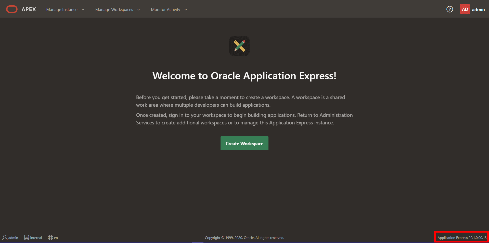
    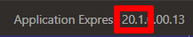

* View the About Application Express page:
    - Sign in to Oracle Application Express. The Workspace home page appears.
    - Click the Help menu at the top of the page and select About. The About Application Express page appears.


    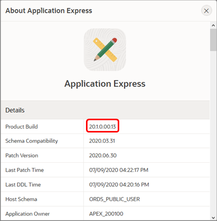

### Where to Run the Lab
You can run this lab in any Oracle Database with APEX 20.1 installed. This includes the "Always Free" Oracle Autonomous Database, the free, "Development Only" apex.oracle.com service, your on-premises Oracle Database (providing APEX 20.1 is installed), on a third party cloud provider where APEX 20.1 is installed, or even on your laptop by installing Oracle XE or Oracle VirtualBox App Dev VM and installing APEX 20.1.

Below are steps on how to sign up for either an *Oracle Autonomous Database* cloud service or *apex.oracle.com* service. The Always Free Oracle Autonomous Database is ideal for learning about the Oracle Database and APEX, and provides 1 OCPU and 20 GB of compressed storage. This service can also be utilized for production applications, and can readily be upgraded to a paid service as necessary. On the other hand, apex.oracle.com is also a free service; however, it is only designated for development purposes, and running production apps is not allowed. For conducting labs in this workshop, either service can be utilized.

Click one of the options below to proceed.

## **Option 1**: Oracle Autonomous Database

In this part, you will create an Oracle Cloud trial account. Once you have signed up for the service, you will create an *Autonomous Transaction Processing* database. The final step in the process is to provision Oracle APEX.

1.  Please [click this link to create your free account](https://myservices.us.oraclecloud.com/mycloud/signup?language=en). When you complete the registration process, you'll receive an account with a $300 credit and several "forever free" services that will enable you to complete the workshop for free. You can then use any remaining credit to continue to explore the Oracle Cloud. The forever free services will continue to work after the trial expires.

2.  Soon after requesting your trial, you will receive a  **Get Started Now with Oracle Cloud** email.   
    Make note of your **Username**, **Password**, and **Cloud Account Name**.

    

3. Now that you have a service, you will log into your Oracle Cloud account, so that you can start working with various services.        
    From any browser go to [https://cloud.oracle.com/en_US/sign-in](https://cloud.oracle.com/en_US/sign-in).

    Enter your **Cloud Account Name** in the input field and click the **Next** button.

    

4. Enter your **User Name** and **Password** in the input fields, and click **Sign In**.

    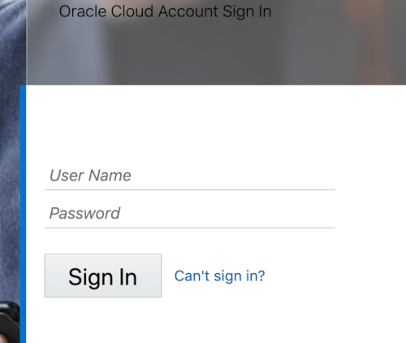

5. From within your Oracle Cloud environment, you will create an instance of the Autonomous Transaction Processing database service.

    From the Cloud Dashboard, select the navigation menu icon in the upper left-hand corner and then select **Autonomous Transaction Processing**.

    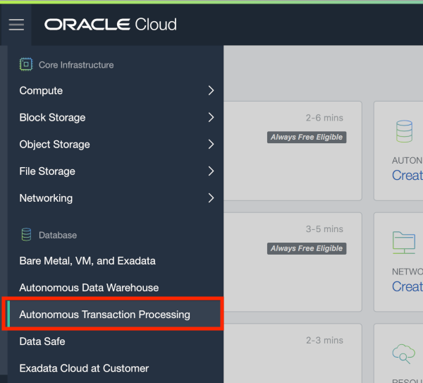

6. Click **Create Autonomous Database**.

    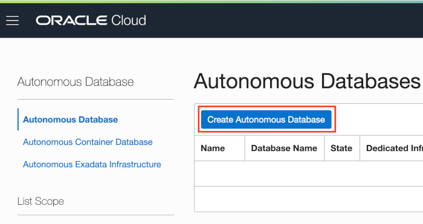

7. Select the **Always Free** option, enter **```SecretPassw0rd```** for the ADMIN password, then click **Create Autonomous Database**.

    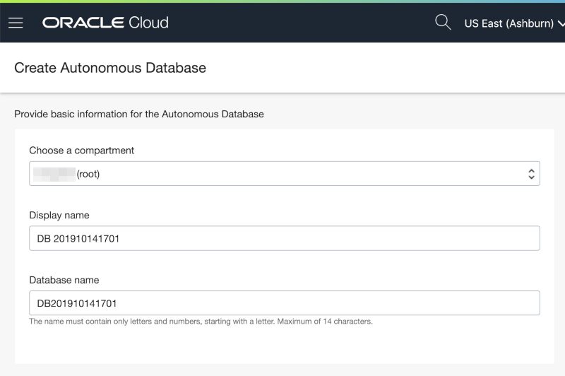
    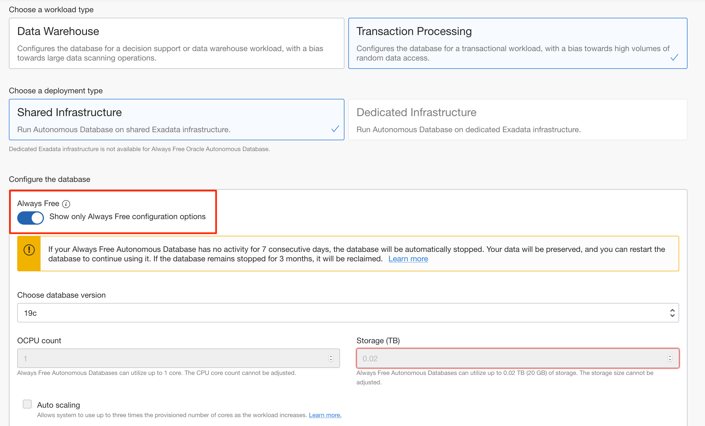
    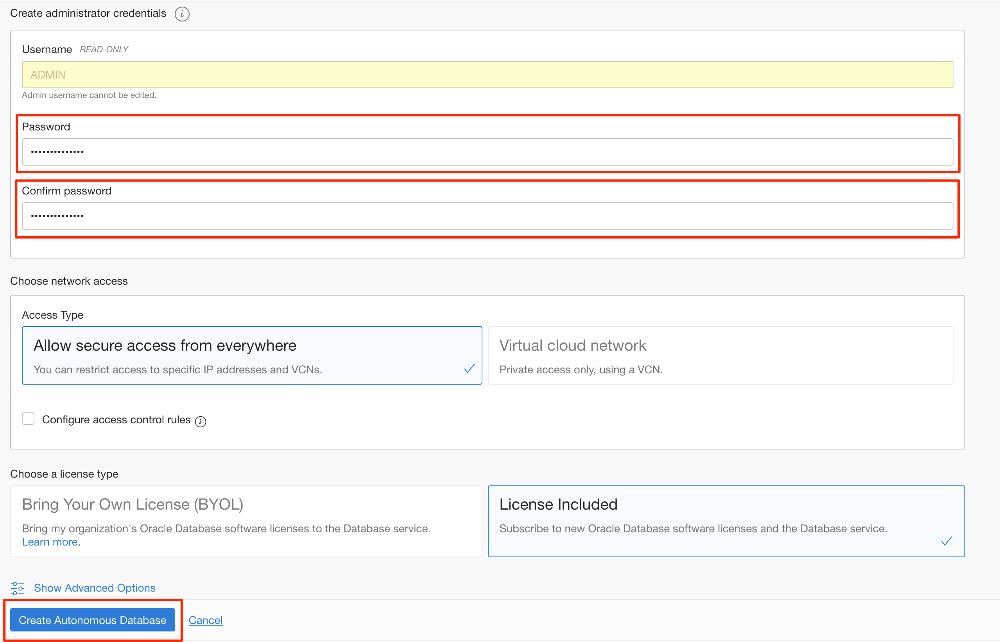

8. After clicking **Create Autonomous Database**, you will be redirected to the Autonomous Database Details page for the new instance.

    Continue when the status changes from:

    

    to:

    

9. Within your new database, APEX is not yet configured. Therefore, when you first access APEX, you will need to log in as an APEX Instance Administrator to create a workspace.

    Click the **Tools** tab.
    Click **Open APEX**.

    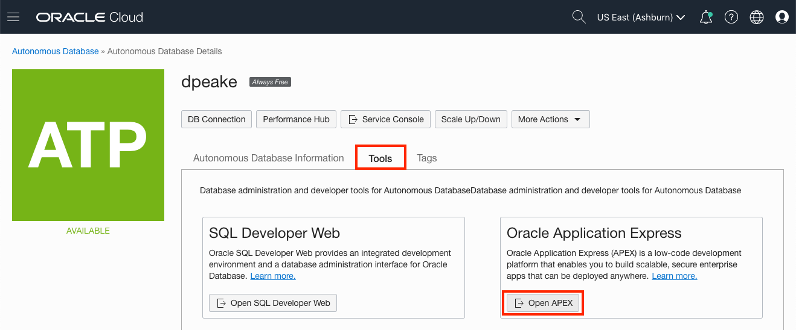

    *Note: Always Free Autonomous Database will be stopped after being inactive for 7 days. If that happens, you need to click **More Actions** and then **Start** to start your Autonomous Database, and then **Open APEX**.*

10. Enter the password for the Administration Services and click **Sign In to Administration**.     
    The password is the same as the one entered for the ADMIN user when creating the ATP instance: **```SecretPassw0rd```**

    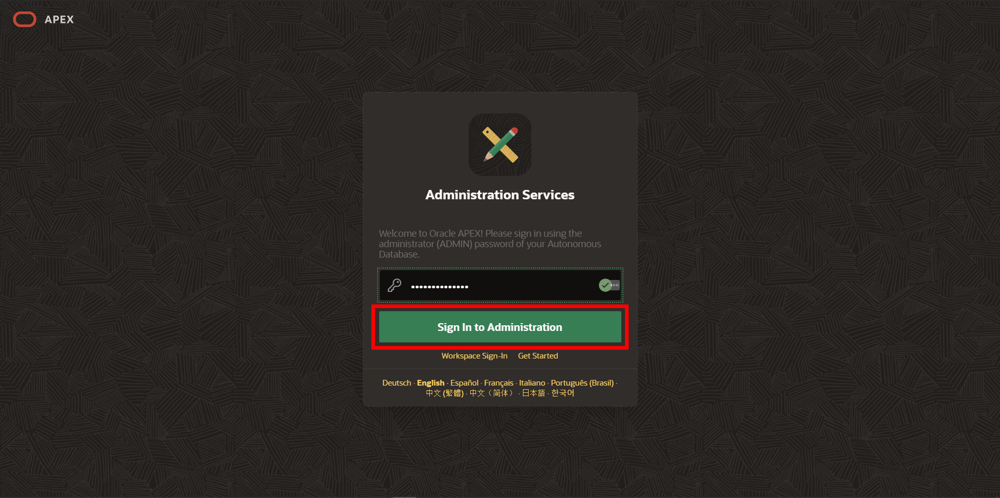

11. Click **Create Workspace**.

    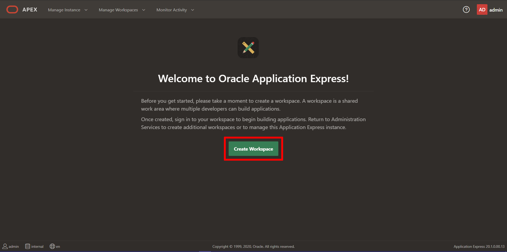

12. In the Create Workspace dialog, enter the following:

    | Property | Value |
    | --- | --- |
    | Database User | DEMO |
    | Password | **`SecretPassw0rd`** |
    | Workspace Name | DEMO |

    Click **Create Workspace**.

    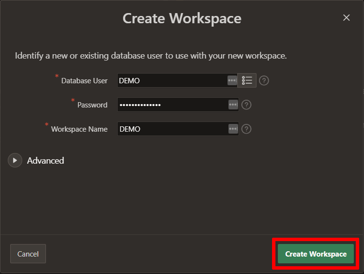

13. In the APEX Instance Administration page, click the **DEMO** link in the success message.         
    *Note: This will log you out of APEX Administration so that you can log into your new workspace.*

    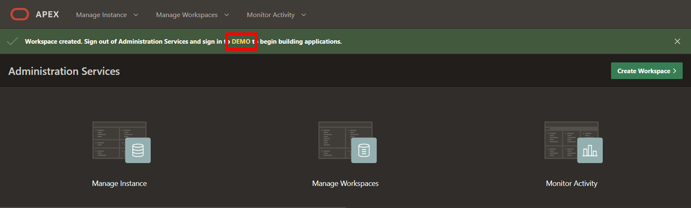

14. On the APEX Workspace log in page, enter **``SecretPassw0rd``** for the password, check the **Remember workspace and username** checkbox, and then click **Sign In**.

    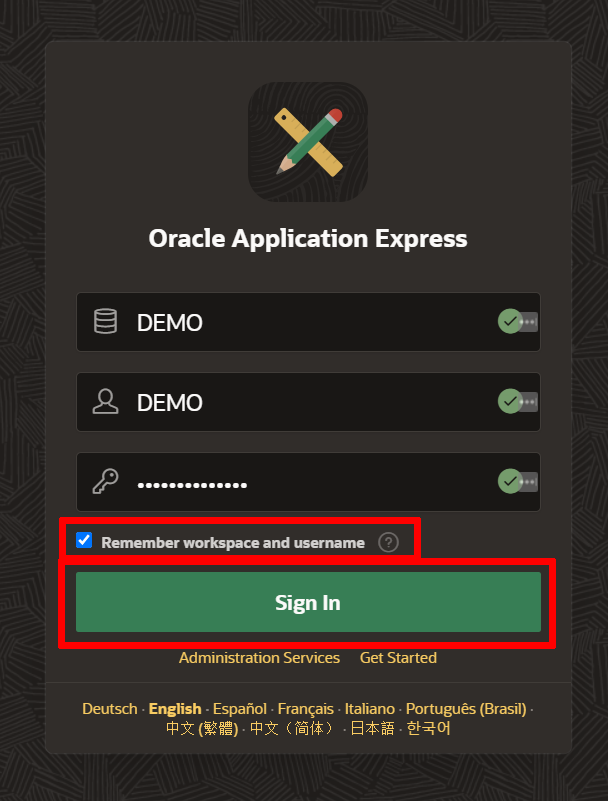

## **Option 2**: apex.oracle.com
Signing up for apex.oracle.com is simply a matter of providing details on the workspace you wish to create and then waiting for the approval email.

1. Go to [https://apex.oracle.com](https://apex.oracle.com.).
2. Click **Get Started for Free**.

    

3. Scroll down until you see details for apex.oracle.com.  Click **Request a Free Workspace**.

    

4. On the Request a Workspace dialog, enter your Identification details – First Name, Last Name, Email, Workspace.
   *Note: For workspace, enter a unique name, such as first initial and last name.*

    Click **Next**.

    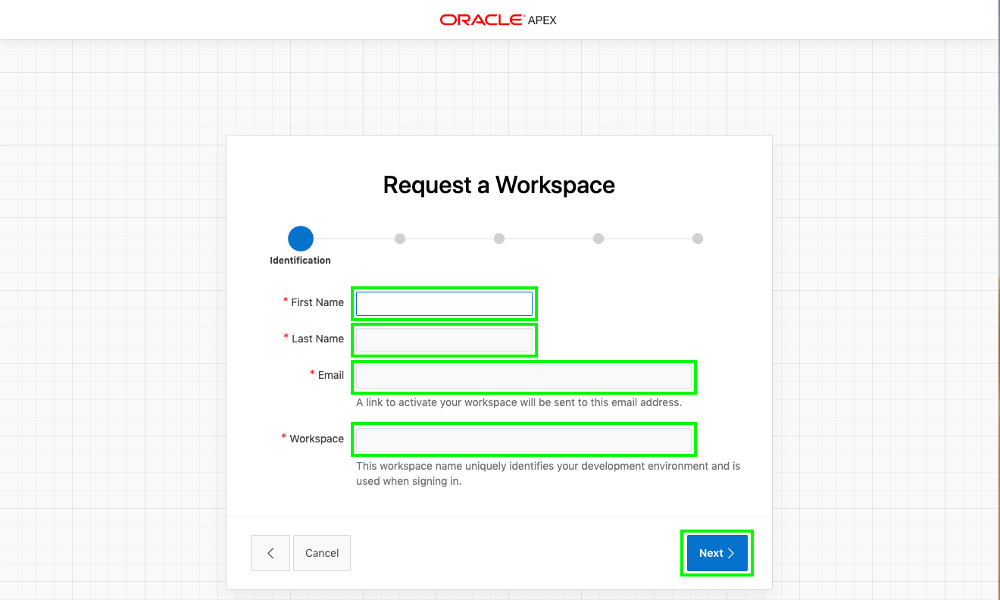

5. Complete the remaining wizard steps.

6. Check your email. You should get an email from `oracle-application-express_ww@oracle.com` within a few minutes.  
   *Note: If you don’t get an email go back to Step 3 and make sure to enter your email correctly.*

    Within the email body, click **Create Workspace**.

    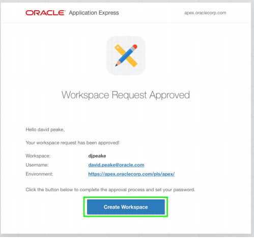

7. Click **Continue to Sign In Screen**.
8. Enter your password, and click **Apply Changes**.
9. You should now be in the APEX Builder.

    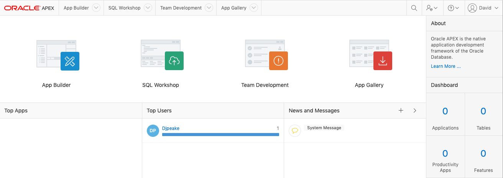

## Summary

 At this point, you know how to create an APEX Workspace and you are now ready to start migrating forms Application.

You may now *proceed to the next lab*.

## Acknowledgements

- **Author** -  Vanitha Subramanyam, Senior Solution Architect
- **Contributors** - Abhinav Jain, Staff Cloud Engineer, Sakthikumar Periyasamy Senior Cloud Engineer, Nayan Karumuri Staff Cloud Engineer
- **Last Updated By/Date** - Vanitha Subramanyam, Senior Solution Architect, December 2020


## Need Help?

Please submit feedback or ask for help using our [LiveLabs Support Forum](https://community.oracle.com/tech/developers/categories/oracle-apex-development-workshops). Please click the **Log In** button and login using your Oracle Account. Click the **Ask A Question** button to the left to start a *New Discussion* or *Ask a Question*.  Please include your workshop name and lab name.  You can also include screenshots and attach files.  Engage directly with the author of the workshop.

 If you do not have an Oracle Account, click [here](https://profile.oracle.com/myprofile/account/create-account.jspx) to create one.
