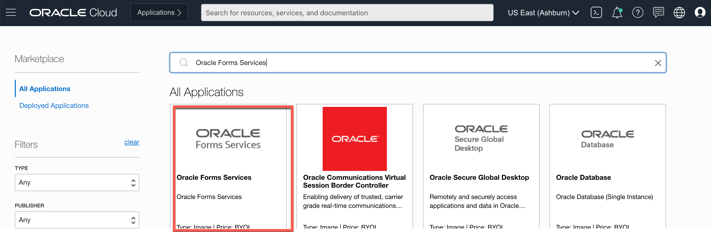
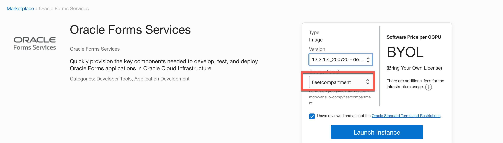
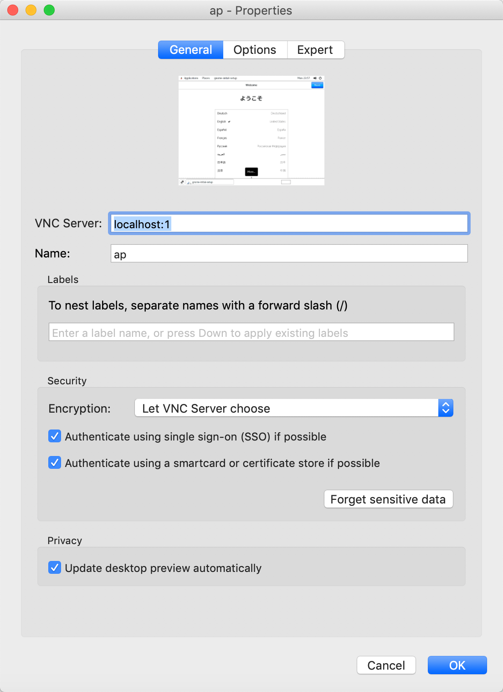
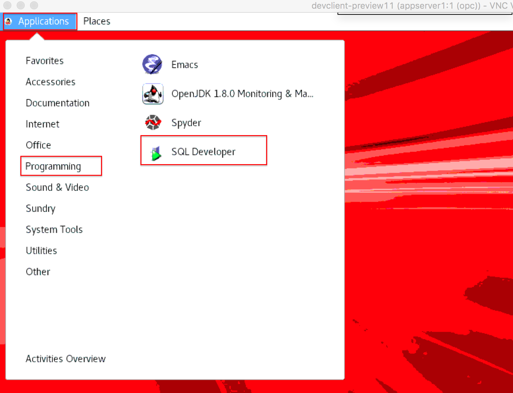
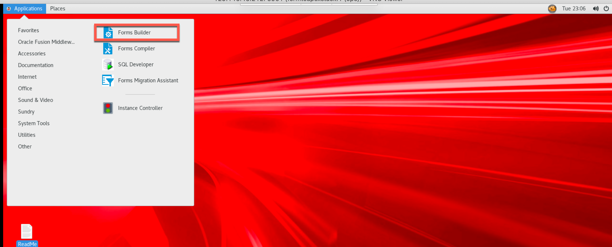
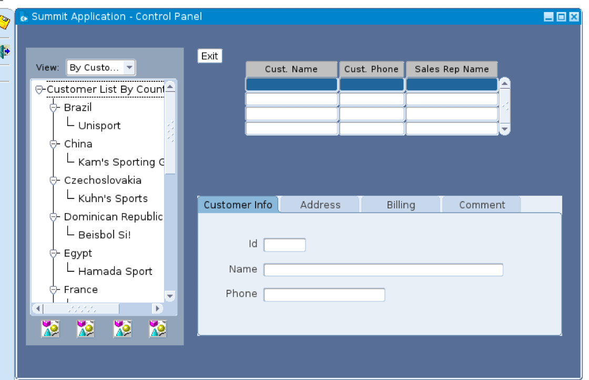
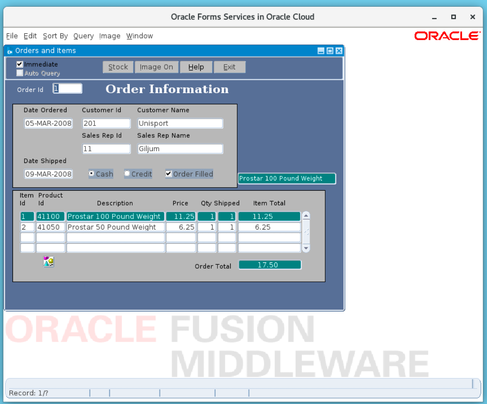

# Configuring a Development System for Oracle Forms Application from Marketplace in OCI

## Introduction
The Oracle Cloud Infrastructure marketplace provides a pre-built Oracle Forms image with necessary client tools and drivers to build the applications.

The image is pre-configured with tools and language drivers so that you can change/compile Oracle Forms Applications.
For a complete list of features, login to your OCI account, select 'Marketplace' from the top left menu and browse details on the 'Oracle Forms Services'
    

Estimated Lab Time: 30 minutes

### Objectives

As a database user, DBA or application developer,
- Configure a Oracle Forms system from a pre-built marketplace image
- Connect with SSH and complete the Forms Installation
- Copy the SQL Scripts and Sample Forms files to your development system
- Connect to your DB in Development system using SQL Developer.
- Run the scripts to create sample schema and insert sample data.
- Open the forms file and compile it
- Convert the forms to XML

### Prerequisites

- An Oracle Cloud Infrastructure account with IAM privileges to provision compute instances
- VNC Viewer or other suitable VNC client on your local laptop

## **STEP 1**: Provision an OCI Marketplace Forms Services image

We start with deploying a pre-configured client machine instance from the OCI marketplace.

1. Log into your cloud account using your tenant name, username and password.
2. Click on Hamburger Menu, Select Marketplace and Click on All Applications
      

3. Search for Oracle Forms Service.
      

4. Choose Oracle Forms Service image from Oracle Image section.

5. Choose the compartment before launching the instance.
    

6. Choose VCN and subnet you have created in the previous step. This would likely be the public subnet created in previous labs.

    *Note:
    Please ensure you have picked the right compartments where network resources exist.*

7. Ensure the public IP address button is selected. You would need to ssh into this instance over public internet.

8. Add SSH key, you can choose to import ssh public key or paste ssh public key.

9. Click on create
    

10. Within a few mins your development instance will be available and a public IP address assigned (if it is provisioned in a public subnet).

11. Once provisioned, you can click on the instance name to see details.
    


## **STEP 2**: Connect from your local laptop into your development system to complete the forms installation

First we ssh into the dev client and invoke the VNC server that comes pre-installed.

1. SSH into your dev client compute instance with public ip details we got from instance details.

    ```
    <copy>
    $ ssh -i <private-key> opc@PublicIP
    </copy>
    ```
2. When you login, the Oracle Forms Installation will continue and you will be prompted with if you want to use DBCS, choose N

    ```

    Use Oracle Database Cloud Service with this instance? (Y/N) N
    Use Oracle Database Cloud Service with this instance? (Y/N) N
    ****************************************************************
    *                                                              *
    *   Please provide the following credentials below:            *
    *                                                              *
    *   - VNC password  (Must be 6-8 chars long)                   *
    *      Should contain numbers and letters.                     *
    *      Should contain upper and lower case letters.            *
    *                                                              *
    *   - Database sys/system password (Must be 8-30 chars long)   *
    *      Should contain numbers and letters.                     *
    *      Should contain upper and lower case letters.            *
    *                                                              *
    *   - WLS Repository schema password (Must be 8-30 chars long) *
    *      Should contain upper and lower case letters.            *
    *      Should contain numbers and letters.                     *
    *      Only 3 special characters permitted: # $ _              *
    *                                                              *
    *   - WLS administrator password (Must be 8-12 chars long)     *
    *      Should contain numbers and letters.                     *
    *      Should contain upper and lower case letters.            *
    *                                                              *
    ****************************************************************
    Enter a password for VNC:
    Enter database sys/system user password:
    Enter WLS Repository schema password:
    Enter Weblogic domain administrator password:

    ****************************************************************
    *      Provisioning Oracle FMW Domain                          *
    ****************************************************************

    Oracle Forms Fusion Middleware domain successfully provisioned.
    All Servers have been started and are ready for use.
    ```

    Make a note of all the passwords
3.   All the installation details of software installed, ORACLE_HOME, ORACLE_SID, MIDDLEWARE_HOME, FORMS_PATH
    can be found in readme file under Desktop folder

    ```
    <copy>
    $ cd Desktop
    $ vi Readme
    </copy>
    ```

    ```
    Excerpt from Readme file, make a note off these details.
    ------------------------------
    Software Installation Details
    ------------------------------
    All software has been installed and is owned by the "opc" user.

    o Software locations:
    o  Database software is installed only if you choose to have a local database during provisioning.
    o  Database ORACLE_HOME:  /u01/oracle/database/base/Oracle_Home
            o Database connect string: orcl

    o  Middleware ORACLE_HOME:  /u01/oracle/middleware/Oracle_Home
    o  Middleware DOMAIN_HOME:  /u01/oracle/middleware/user_projects/domains/base_domain

    o WebLogic Server repository (RCU) schema prefix: FRM
    o WebLogic Server Administrator username:  weblogic

    o  JDK 8 HOME: /u01/oracle/jdk

    o  FORMS_PATH in frmbld.sh and default.env includes:  /home/opc/oracle/formsmodules


    ------------------------------
    Server Information
    ------------------------------
    o Server Ports:
        Database Listener Port:  1521
        WLS Administration Server : 7001
        WLS_FORMS : 9001
        OHS : 7777 & 4443 (7777 & 4443 opened in Linux firewall)

    ```
4.   Start your VNC server with the following command,

    ```
    <copy>
    $ vncserver -geometry 1280x1024
    </copy>
    ```

    ```
    VNC Server will be started with below output
    New 'formstoapexstack:1 (opc)' desktop is formstoapexstack:1

    Starting applications specified in /home/opc/.vnc/xstartup
    Log file is /home/opc/.vnc/formstoapexstack:1.log
    ```

    Note down what comes after your stack name which is :1 here.

    Open the Log file to check which port the VNC connection will be listening on and note down the port number which is usually 5901 .

    Excerpt from Log file:

    ```
    vncext:      VNC extension running!
    vncext:      Listening for VNC connections on all interface(s), port 5901
    vncext:      Listening for HTTP connections on all interface(s), port 5801
    vncext:      created VNC server for screen 0
    ```

5. Your development system may now be ready for accepting VNC connections.

    *Note: As mentioned earlier, you need a VNC client installed on your laptop. This lab uses VNC Viewer.*

6. Create a tunnel for VNC through SSH, in a terminal window , issue the following command, with your public IP address at the end. This will create the SSH tunnel for you to use for VNC.
    ```
    ssh -N -L 5901:127.0.0.1:5901 -i ~/<privatekey> opc@<publicIP>
    ```

7. Start VNC Viewer on your laptop and configure a client connection using the settings as shown.

    

    Note how the connect string for VNC Server is simply localhost:1

8. Connect to your VNC desktop and provide the password you provided on the host earlier.

9. If all goes well, you should now see a linux desktop in your VNC window.

## **STEP 3**: Copy the SQL Scripts, Shell Scripts and Sample Forms files to your development system

1. We have sample forms and sample database scripts that can be downloaded from [here](https://objectstorage.us-ashburn-1.oraclecloud.com/p/QP5J-CoMLxkdSxU25SaE8_B5t1A18b6qe7j_Xv7TckRgD3yDxilgfJhp-TAJir1V/n/c4u03/b/developer-library/o/setup-oracle-forms.zip)

2. Unzip the files and Copy the files over to your development system from your local Desktop

    ````
    <copy>
    scp -i  ~/.ssh/<privake key> ./files/customers.fmb opc@<public ip>:/home/opc/oracle/formsmodules
    scp -i  ~/.ssh/<privake key> ./files/ORDERS.fmb opc@<public ip>:/home/opc/oracle/formsmodules
    scp -i  ~/.ssh/<privake key> ./files/forms_conversion.sql opc@<public ip>:/home/opc/oracle/formsmodules
    scp -i  ~/.ssh/<privake key> ./files/forms_conversion_data_insert.sql opc@<public ip>:/home/opc/oracle/formsmodules
    scp -i  ~/.ssh/<privake key> ./files/frmf2xml.sh opc@<public ip>:/home/opc/oracle/formsmodules
    scp -i  ~/.ssh/<privake key> ./filesformsXMLconvert.sh opc@<public ip>:/home/opc/oracle/formsmodules
    </copy>
    ````

## **STEP 4**: Connect to your DB in Development system using SQL Developer

1. In your VNC session, invoke SQL Developer from the top left Applications menu as shown below.
    


    *Note: In the event you have issues launching SQL Developer and it prompts with a java classpath error, simply add the following line to ~/.sqldeveloper/19.1.0/product.conf and retry.*

    ````
    <copy>
    SetJavaHome /usr/java/jdk1.8.0_231-amd64
    </copy>
    ````

2. Create an new connection in sql*developer and provide the following information,

    **Connection Name**: Name for your connection

    **Username**: sys as sysdba

    **Password**: <password>

    **Connection Type**: Basic

    **Hostname**: localhost
    **Port**: 1521
    **SID**: orcl

3. Test your connection and save. The *Status* bar will show *Success* if it is a successful connection!


## **STEP 5**: Run the scripts to create sample schema and insert sample data

  1.  Open the script  forms\_conversion\_ddl.sql in SQL developer in VNC and execute the script. Make a note of the credential for order user in the script.
  2.  The script creates the orders schema and orders user
  3.  In the same session connect to orders user and run the insert script forms\_conversion\_data\_insert.sql

## **STEP 6**: Compile the forms files.

  1. In your VNC session, invoke Forms Builder from the top left Applications menu as shown below.
      

  2. Open the customers.fmb from the /home/opc/oracle/formsmodules in Forms Builder, you will get warnings as shown below, click OK and open the form
      
    and also warning about unsupported older version of forms ignore that and continue to open
      

  3. Compile and Run the form
    when trying to compile/run the form it will prompt to connect to database. Enter the Order schema credentials created in step 5 

  4. If you are successfully able to compile then the customer form will look like below
      

  5. Open the orders.fmb from the /home/opc/oracle/formsmodules in Forms Builder, you will get warnings as shown below, click OK and open the form
      
  and also warning about unsupported older version of forms ignore that and continue to open
      

  6. Compile and Run the form
  when trying to compile/run the form it will prompt to connect to database. Enter the Order schema credentials created in step 5
      

  7. If you are successfully able to compile then the customer form will look like below
      

    *Note: If you have forms compiled in 11g version you will encounter errors if you have disable_item and enable_item procedures in your triggers and process as these functions are deprecated, if you do see errors then make the following changes .*

    ```
    <copy>
    procedure enable_disable_regular_items is
    begin
    SET_MENU_ITEM_PROPERTY('Query.Last_Criteria',ENABLED, PROPERTY_FALSE);
    SET_MENU_ITEM_PROPERTY('Query.Cancel',ENABLED, PROPERTY_FALSE);
    SET_MENU_ITEM_PROPERTY('Query.Cancel_Query',ENABLED, PROPERTY_FALSE);
    SET_MENU_ITEM_PROPERTY('Action.Save',ENABLED, PROPERTY_TRUE);
    SET_MENU_ITEM_PROPERTY('Action.Exit',ENABLED, PROPERTY_TRUE);
    SET_MENU_ITEM_PROPERTY('Block.Previous',ENABLED, PROPERTY_TRUE);
    SET_MENU_ITEM_PROPERTY('Block.Next',ENABLED, PROPERTY_TRUE);
    SET_MENU_ITEM_PROPERTY('Record.Previous',ENABLED, PROPERTY_TRUE);
    SET_MENU_ITEM_PROPERTY('Record.Next',ENABLED, PROPERTY_TRUE);
    SET_MENU_ITEM_PROPERTY('Record.Scroll_up',ENABLED, PROPERTY_TRUE);
    SET_MENU_ITEM_PROPERTY('Record.Scroll_down',ENABLED, PROPERTY_TRUE);
    SET_MENU_ITEM_PROPERTY('Record.Insert',ENABLED, PROPERTY_TRUE);
    SET_MENU_ITEM_PROPERTY('Record.Remove',ENABLED, PROPERTY_TRUE);
    SET_MENU_ITEM_PROPERTY('Record.Duplicate',ENABLED, PROPERTY_TRUE);
    SET_MENU_ITEM_PROPERTY('Record.Lock',ENABLED, PROPERTY_TRUE);
    SET_MENU_ITEM_PROPERTY('Query.Enter',ENABLED, PROPERTY_TRUE);
    SET_MENU_ITEM_PROPERTY('Query.Enter_Query',ENABLED, PROPERTY_TRUE);
    SET_MENU_ITEM_PROPERTY('Query.Insert_Record',ENABLED, PROPERTY_TRUE);
    SET_MENU_ITEM_PROPERTY('Query.Remove_Record',ENABLED, PROPERTY_TRUE);
    SET_MENU_ITEM_PROPERTY('Query.Lock_Record',ENABLED, PROPERTY_TRUE);
    SET_MENU_ITEM_PROPERTY('Query.HIDE_BLOCK_PREV',ENABLED, PROPERTY_TRUE);
    SET_MENU_ITEM_PROPERTY('Query.HIDE_RECORD_PREV',ENABLED, PROPERTY_TRUE);
    SET_MENU_ITEM_PROPERTY('Query.HIDE_RECORD_NEXT',ENABLED, PROPERTY_TRUE);
    SET_MENU_ITEM_PROPERTY('Query.HIDE_BLOCK_NEXT',ENABLED, PROPERTY_TRUE);
    end;
    procedure enable_disable_query_items is
    begin

    SET_MENU_ITEM_PROPERTY('Query.Last_Criteria',ENABLED, PROPERTY_TRUE);
    SET_MENU_ITEM_PROPERTY('Query.Cancel',ENABLED, PROPERTY_TRUE);
    SET_MENU_ITEM_PROPERTY('Query.Cancel_Query',ENABLED, PROPERTY_TRUE);
    SET_MENU_ITEM_PROPERTY('Query.Enter',ENABLED, PROPERTY_FALSE);
    SET_MENU_ITEM_PROPERTY('Query.Enter_Query',ENABLED, PROPERTY_FALSE);
    SET_MENU_ITEM_PROPERTY('Query.Insert_Record',ENABLED, PROPERTY_FALSE);
    SET_MENU_ITEM_PROPERTY('Query.Remove_Record',ENABLED, PROPERTY_FALSE);
    SET_MENU_ITEM_PROPERTY('Query.Lock_Record',ENABLED, PROPERTY_FALSE);
    SET_MENU_ITEM_PROPERTY('Query.HIDE_BLOCK_PREV',ENABLED, PROPERTY_FALSE);
    SET_MENU_ITEM_PROPERTY('Query.HIDE_RECORD_PREV',ENABLED, PROPERTY_FALSE);
    SET_MENU_ITEM_PROPERTY('Query.HIDE_RECORD_NEXT',ENABLED, PROPERTY_FALSE);
    SET_MENU_ITEM_PROPERTY('Query.HIDE_BLOCK_NEXT',ENABLED, PROPERTY_FALSE);
    SET_MENU_ITEM_PROPERTY('Action.Save',ENABLED, PROPERTY_FALSE);
    SET_MENU_ITEM_PROPERTY('Action.Exit',ENABLED, PROPERTY_FALSE);
    SET_MENU_ITEM_PROPERTY('Block.Previous',ENABLED, PROPERTY_FALSE);
    SET_MENU_ITEM_PROPERTY('Block.Next',ENABLED, PROPERTY_FALSE);
    SET_MENU_ITEM_PROPERTY('Record.Previous',ENABLED, PROPERTY_FALSE);
    SET_MENU_ITEM_PROPERTY('Record.Next',ENABLED, PROPERTY_FALSE);
    SET_MENU_ITEM_PROPERTY('Record.Scroll_up',ENABLED, PROPERTY_FALSE);
    SET_MENU_ITEM_PROPERTY('Record.Scroll_down',ENABLED, PROPERTY_FALSE);
    SET_MENU_ITEM_PROPERTY('Record.Insert',ENABLED, PROPERTY_FALSE);
    SET_MENU_ITEM_PROPERTY('Record.Remove',ENABLED, PROPERTY_FALSE);
    SET_MENU_ITEM_PROPERTY('Record.Duplicate',ENABLED, PROPERTY_FALSE);
    SET_MENU_ITEM_PROPERTY('Record.Lock',ENABLED, PROPERTY_FALSE);

    end;

    </copy>
    ```

## **STEP 7**: Convert the Forms to XML files

1. Before migrating  to Oracle Applications Express, Forms file have to be converted to XML file using frmf2xml utility provided with Oracle Forms Service Image. In the downloaded scripts, formsXMLconvert.sh script that can be run to convert all the Forms files in the directory where it is run from.

    ```
    <copy>
    cd oracle/formsmodules/
    sh formsXMLconvert.sh
    </copy>
    ```

2. After the script is run verify that you can see customers\_fmb.xml and orders\_fmb.xml

You may now *proceed to the next lab*.

## Acknowledgements

- **Author** -  Vanitha Subramanyam, Senior Solution Architect
- **Contributors** - Abhinav Jain, Staff Cloud Engineer, Sakthikumar Periyasamy Senior Cloud Engineer, Nayan Karumuri Staff Cloud Engineer
- **Last Updated By/Date** - Vanitha Subramanyam, Senior Solution Architect, December 2020

## Need Help?

Please submit feedback or ask for help using our [LiveLabs Support Forum](https://community.oracle.com/tech/developers/categories/oracle-apex-development-workshops). Please click the **Log In** button and login using your Oracle Account. Click the **Ask A Question** button to the left to start a *New Discussion* or *Ask a Question*.  Please include your workshop name and lab name.  You can also include screenshots and attach files.  Engage directly with the author of the workshop.

 If you do not have an Oracle Account, click [here](https://profile.oracle.com/myprofile/account/create-account.jspx) to create one.
