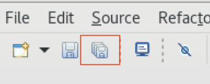
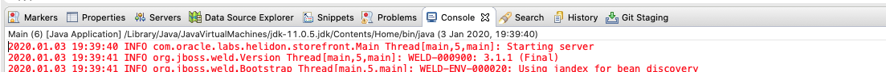
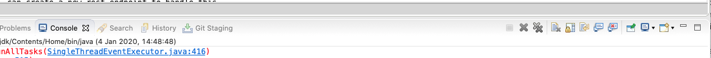

[Go to Helidon for Cloud Native Page](../Helidon-labs.md)


# Migration of Monolith to Cloud Native

## A. Helidon for Cloud Native

## 1. The Helidon core


<details><summary><b>Self guided student - video introduction</b></summary>
<p>

This video is an introduction to the Helidon core capabilities lab. Once you've watched it please press the "Back" button on your browser to return to the labs.

[](https://youtu.be/QCeQ6aKyBHU "Helidon core capabilities lab introduction video")

</p>
</details>

---

#### Where we look at our initial java classes and REST enable them.

- Open the Eclipse IDE. There is an Eclipse icon on the desktop, double click it, and wait for Eclipse to start.

For all of the steps in this section of the lab we will be using the **helidon-labs-storefront** project in Eclipse. Generally we will not be updating the Maven pom.xml file with the specific imports needed as we are focusing on the code side of things here, if you are going to be coding your own services we encourage you to look at the pom.xml file to see what dependencies we are making available to the project.

The main class we will be using is **StorefrontResource.java**.   Locate it in the Eclipse project explorer (Hierarchical browser on the left of the Eclipse window) and open it.

- Navigate to the **StorefrontResource** class:
  - Open the project *helidon-labs-storefront*
  - Expand *src/main/java*, then *resources*, then double-click *StoreFrontResource.java*
  
  

---

<details><summary><b>What are the @Slf4j and @NoArgsConstructor annotations ?</b></summary>
<p>


You see a couple of annotations already on place on the class definition (`@Slf4j` and `@NoArgsConstructor`) These are being processed by [Lombok](https://projectlombok.org/).  Lombok is a set of Java based tools that use annotations to perform common tasks for us. In this case the `@Slf4j` annotation tells Lombok to automatically generate a Java logger (Actually we use the simple logging facade, which makes is easy to switch the logging engine) using the class name as the loggers name. The `@NoArgsConstructor` does what the name suggests and creates a constructor for us without any arguments. 

Lombok provides a wide variety of other useful annotations to speed up development, for example rather than manually creating getters and setters, hash codes and equals we can just use the @Lombok `@Data` annotation to create them for us automatically. As Lombok is executed when a class if compiled as we change the class any new fields would have getters / setters automatically created for us and any fields that had been removed would no longer have getters / setters created.

It's not required that people use Lombok for java development of course, but I'm using it here to as to not clutter up the code, and also I'm lazy when it comes to coding and Lombok is a great tool for lazy coders :-)

Enough on Lombok. Let's get to the Helidon work !

---

</p>
</details>


### Make the list stock REST Service available
The first thing a REST service must do is provide a REST end point that can be called. Helidon makes this process very easy.

For our first bit of Helidon work we're going to REST enable a Java method that returns data, it doesn't take any input.

Firstly we need to tell Helidon that the StorefrontResource class responds to REST messages. 

- On top of the **StorefrontResource** *class definition* add the following 2 annotations:
  - ```java
    @Path("/store")
    @RequestScoped
    ```


Your class definition now should look something like

```java
@Path("/store")
@RequestScoped
@Slf4j
@NoArgsConstructor
public class StorefrontResource {
   .....
```

<details><summary><b>Java Imports</b></summary>
<p>

You may need to add the following imports to the class

```java
import javax.enterprise.context.RequestScoped;
import javax.ws.rs.Path;
```

---
</p></details>

<details><summary><b>About the annotations</b></summary>
<p>


The `@Path("/store")` annotation means that each time the Helidon framework brings the StorefromtResource in as a REST service that all of the capabilities will be registered under the /store url (the application can provide a higher level URL if it wants, but we're not going to do that here.)

The `@RequestScoped` annotation means that the Helidon framework will create a new instance of the class automatically each time a rest request is made, and that the instance will be used for the duration of that request. This would allow us to modify the internal state of the class as the request is being processed and we can be sure that those modifications woudln't interfere with other subsequent or concurrent requests (well as long as we limit out changes to the StorefrontResource class of course)
</p>
</details>

---

Helidon will now REST enable the class, but it needs to know what specific methods will be REST endpoints.

- Scroll to the **listAllStock** method in the StorefrontResource.java file

```java
	public Collection<ItemDetails> listAllStock() {
		// log the request
		log.info("Requesting listing of all stock");
		// get the list from the stock management service
		try {
			Collection<ItemDetails> items = stockManager.getAllStockLevels();
			// log the response
			log.info("Found " + items.size() + " items");
			// return the items
			return items;
		} catch (Exception e) {
			e.printStackTrace();
			throw e;
		}
	}
```

It's pretty simple, when called it does some logging, then gets a Collection of ItemDetails and returns it, doing a bit of Exception handling as it does so. Hopefully this type of thing will be very familiar to you.

<details><summary><b>Where is the logging configuration loaded ?</b></summary>
<p>

In a capability introduced in Helidon 2.0 the Helidon framework  will automatically locate a logging.propoerties if one exists in the classpath (or current working directory) and will use that to configure the logging for us, so we don't need to explicitly configure logging. Makes things a little easier.

---

</p></details>

- Add the following annotations on the **listAllStock** method:

  - ```java
    @GET
    @Path("/stocklevel")
    @Produces(MediaType.APPLICATION_JSON)
    ```

    

Your code now should look like : 

```java
@GET
@Path("/stocklevel")
@Produces(MediaType.APPLICATION_JSON)
public Collection<ItemDetails> listAllStock() {
	// log the request
	log.info("Requesting listing of all stock");
```

- Save the changes you've just made, Control-s will do this.

---
<details><summary><b>Java Imports</b></summary>
<p>

You may need to add the following imports to the class

```java
import javax.ws.rs.GET;
import javax.ws.rs.Produces;
import javax.ws.rs.core.MediaType;
```

---
</p></details>

<details><summary><b>The annotations explained</b></summary>
<p>


`@GET` the method will be called in response to http GET requests, For REST services by convention the GET method is the one called when retrieving data.

`@Path("/stocklevel")` on the method specifies that it will respond to the relative (to the class) path /stocklevel As the class as a whole has a path annotation of `/stock` the actual effective path combined the two so it's `/stock/stocklevel` 

`@Produces(MediaType.APPLICATION_JSON)` means that the framework will convert the resulting object into JSON format (there are other formats available, for example APPLICATION_XML, but JSON is nice for humans to read and parse, and it also relatively compact compared to XML)

This Produces annotation is very important to understand. It means that the framework handles all of the work in getting the right data type from the result for us and embedding it in the body of the REST response. We don't have to modify our code to generate the JSON (this is often a non trivial bit of work. We could if we wanted support multiple data formats as the return and the framework will chose the right format based on the type the headers in the incoming request asked for. This single annotation is doing a *lot* of work for us behind the scenes.

</p>
</details>

---


### But how does the framework know what to make available?
We've updated a single class, but in a traditional Java program something else would be calling that class and starting the rest of the program. We need to have a class that does that for us and tells Helidon that this is a class we want enabled as a REST service.

The com.oracle.labs.helidon.storefront.Main class starts the process. We're going to look into sections of this in more detail soon, but the main point here is to that the main method of the main class creates a Helidon server instance. Let's have a quick look at that.

- Open the file **Main.java**, located in the project *helidon-labs-storefront*, and in the folder *src/main/java*

```java
	public static void main(final String[] args) throws IOException {
		// Helidon will automatically locate a logging.propoerties if one exists in the
		// classpath or current working directory and will use that to configure the
		// logging for us, so we don't need to explicitly configure logging
		
		log.info("Starting server");
		Server server = Server.builder().config(buildConfig()).build().start();

		log.info("Running on http://localhost:" + server.port() + "/store");
	}
```

The core line is 

```java
Server server = Server.builder().config(buildConfig()).build().start();
```

This creates a server builder, specifies a configuration, builds the server and starts it. For now you can close the Main.java file.


<details><summary><b>Why do I need a main class ?</b></summary>
<p>

Helidon  does not require you to use a main class, you can if you want actually use a class thats part of the Context and Dependency Injection (CDI) framework (we will do more on CDI later) which will locate all `Application`  classes for you. 

In this case the class is called Main, but that's really just so we can easily identify the class with the `main` method and can specify it in the packaging tools later on. As with any Java program the class with the `main` method could be called anything you want, you just need to know the class name so you can run it, and define it in any runnable .jar files. 

The problem with using CDI to do this however is that you won't have the chance alter aspects of the configuration to meet your project needs, or override the logging setup process. For a simple application that's not a problem, but in most cases you will want to setup your own configuration properties and so on, which is why we're using our own startup class.

---

</p></details>

---

### How does Helidon know what classes it needs to create REST endpoints for ?

We need to define a new class which extents the `Application` to provide this information. Helidon will scan for classes that implement `Application` and then use the `getClasses()` method to build the full set of classes it will process.

- Locate and open the class **StorefrontApplication**

- add the following 2 annotations:

  - ```java
    @ApplicationScoped
    @ApplicationPath("/")
    ```

The result should look like : 

```java
@ApplicationScoped
@ApplicationPath("/")
public class StorefrontApplication extends Application {

	@Override
	public Set<Class<?>> getClasses() {
		// here we have two classes to operate on, the store front, and the
		// configuration manager
		return Set.Of(StorefrontResource.class);
	}
}
```

<details><summary><b>Java Imports</b></summary>
<p>

You may need to add the following imports to the class

```java
import javax.enterprise.context.ApplicationScoped;
import javax.ws.rs.ApplicationPath;
```

---
</p></details>

<details><summary><b>Explaining the annotations</b></summary>
<p>

`@ApplicationScoped` Means that the Helidon framework will automatically create a *single* instance of the class for the entire application, whenever the framework is asked for an instance of StorefrontApplication that single instance will be returned.

`@ApplicationPath("/")` Means that all the classes that provide REST services for the application will have a URL path starting with `/` So our listAllStock method will be `/store/stocklevel` If however the StorefrontAplication has been annotated `@ApplicationPath("/postroom")` then our listAllStock method would be on the path `/postroom/store/stocklevel` (the `/postroom` coming from the @ApplicationPath annotation on StorefrontApplication, `/store` from the @Path annotation on the StorefrontResource class and `/stocklevel` from the @Path annotation on the listAllStock method.


---

</p></details>


- Save your changes to the StorefrontResource file with Control-s, or you can save all your changes to all files by hitting this icon: 

### Running the storefront program.
- locate the. file **Main.java**. 
- Right-click on it and chose **Run As**, then **Java Application**


Eclipse may automatically switch to the console for you, but if not in the lower portion of the screen below the Java code window click the "Console" tab



In the console you'll see a bunch of output representing the logging information generated as the storefront starts up.

```
... 
2020.01.03 19:39:42 INFO io.helidon.webserver.NettyWebServer Thread[nioEventLoopGroup-2-2,10,main]: Channel '@default' started: [id: 0xe4f91c20, L:/0:0:0:0:0:0:0:0:8080]
2020.01.03 19:39:42 INFO io.helidon.microprofile.server.ServerImpl Thread[nioEventLoopGroup-2-2,10,main]: Server started on http://localhost:8080 (and all other host addresses) in 71 milliseconds.
2020.01.03 19:39:42 INFO com.oracle.labs.helidon.storefront.Main Thread[main,5,main]: Running on http://localhost:8080
```

On the last line of the output, we can see the URL that our server is running on http://localhost:8080 (8080 is the port we've chosen in the Heldion config, we'll look at this later)

- Open a Terminal window on the desktop (use the icon *Terminal* or click right on the Linux desktop in the client VM and take the Terminal option)
- Issue the following **curl** command to test the http://localhost:8080/store/stocklevel REST endpoint
  - ` curl -i -X GET http://localhost:8080/store/stocklevel`

Example Result : 

```
HTTP/1.1 200 OK
Content-Type: application/json
Date: Fri, 3 Jan 2020 19:45:16 GMT
connection: keep-alive
content-length: 107

[{"itemCount":2,"itemName":"Pen"},{"itemCount":12,"itemName":"Pencil"},{"itemCount":27,"itemName":"Brush"}]
```

In the Eclipse console tab you'll see the request being processed

```
2020.01.04 14:46:57 INFO com.oracle.labs.helidon.storefront.resources.StorefrontResource Thread[helidon-1,5,server]: Requesting listing of all stock
2020.01.04 14:46:57 INFO com.oracle.labs.helidon.storefront.resources.StorefrontResource Thread[helidon-1,5,server]: Found 3 items
```

We've got data ! Admittedly this is using fake data for now for testing purposes, but it's always a good idea to do that so you have predictable data to run your test cases against (the test data is for now generated using the com.oracle.labs.helidon.storefront.dummy.StockManagerDummy)

- **Stop** the service by clicking on the square stop button on the console tab


Congratulations on creating your first REST API of the lab !

### Make the reserveStock REST service available
We've seen how simple it is to make a existing Java method REST enabled and how to use the framework to start up a server for us. The next step is to look at how we REST enable a Java method that needs to take parameters from the REST request to do it's processing.

- Re-open the file **StorefrontResource.java** 
- locate the **reserveStockItem** method.

```java
	public ItemDetails reserveStockItem(ItemRequest itemRequest)
			throws MinimumChangeException, UnknownItemException, NotEnoughItemsException {
		log.info("Requesting the reservation of " + itemRequest.getRequestedCount() + " items of "
				+ itemRequest.getRequestedItem());
		// make sure the change is within the minimum change allowed
		// :-)
		if (itemRequest.getRequestedCount() < minimumChange.getMinimumChange()) {
.....
```

We're going to make this class respond to a POST request (in REST terms POST calls are used to update existing data)

- **Add** the following annotations to the **reserveStockItem** method:

  - ```java
    @POST
    @Path("/reserveStock")
    @Produces(MediaType.APPLICATION_JSON)
    @Consumes(MediaType.APPLICATION_JSON)
    ```

The result should look like this : 

```java
	@POST
	@Path("/reserveStock")
	@Produces(MediaType.APPLICATION_JSON)
	@Consumes(MediaType.APPLICATION_JSON)
	public ItemDetails reserveStockItem(ItemRequest itemRequest)
			throws MinimumChangeException, UnknownItemException, NotEnoughItemsException {
		log.info("Requesting the reservation of " + itemRequest.getRequestedCount() + " items of "
.....
```

---


<details><summary><b>Java Imports</b></summary>
<p>

You may need to add the following imports to the class

```java
import javax.ws.rs.POST;
import javax.ws.rs.Consumes;
```

---
</p></details> 

<details><summary><b>The annotations explained</b></summary>
<p>

`@POST` as indicated above means the method will respond to http POST requests

`@Path("/reserveStock")` as you'd expect means it will do it on /reserveStock but as the class itself has a path of /store the absolute Path is /store/reserveStock (remember in the application it specifies a path starting at /)

`@Produces(MediaType.APPLICATION_JSON)` as before means that the returned objects will be converted into JSON and embedded in the body of REST response, this is the same as the usage with the listAllStock method

`@Consumes(MediaType.APPLICATION_JSON)` is an annotation that specifies that the input is expected to be in JSON format.

The latter is very interesting here, it means that the Helidon framework will convert the JSON in the body of the incoming request into a ItemRequest object automatically for us. If that's not possible (for example because the incoming data is not JSON or it is JSON but the JSON attributes don't match the fields in ItemRequest class) then the framework will deal with creating an error and our reserveStock method won't even get called.

So these four annotations specify that this method will be accessible using HTTP POST requests on /store/reserveStock and will take JSON as input and produce JSON as output. Not bad for four lines of annotation !

Basically in addition to running the server and configuring things Helidon is now doing all of the work of converting incoming JSON into the expected method parameters and of converting the outgoing object back into JSON !

</p>

</details>

---

- Save the changes to the StorefrontResource.java file
- Run the **storefront.Main** class by clicking right on it, then choosing the "Run As" sub menu and "Java Application"

---

<details><summary><b>Did you have an error running it ?</b></summary>
<p>

If when running you get Exception messages in the console about "Failed to start server" and a whole bunch of stack trace including a "Bind Exception: Address already in use" then you forgot to stop the server in the last part of the lab. You will need to close the current console tab by clicking on the X in the console tab options.



This should switch to the still running tab. Click the square red stop icon in this tab to stop the previous sections still running code.


Once the red stop icon turns grey the program is stopped and you can try re-starting the Main program as described above.

</p>

</details>

---

Once you see the server running line

```
2020.01.04 14:55:34 INFO com.oracle.labs.helidon.storefront.Main Thread[main,5,main]: Running on http://localhost:8080

```

Then we can use curl to test it.

- **Get the initial set of data:**

  `curl -i -X GET http://localhost:8080/store/stocklevel`

Example result:

```
HTTP/1.1 200 OK
Content-Type: application/json
Date: Sat, 4 Jan 2020 14:56:12 GMT
connection: keep-alive
content-length: 107

[{"itemCount":2,"itemName":"Pen"},{"itemCount":12,"itemName":"Pencil"},{"itemCount":27,"itemName":"Brush"}]
```

As we're using a test data system this is exactly as we had before.

Note that we have 12 Pencils

Now we'll use curl to send a REST request that will reserve 4 pencils (Note we have to specify the content type in the header, this is an http standard thing)

- **Reserve** 4 pencils:

  `curl -i -X POST -H "Content-Type:application/json" -d '{"requestedItem":"Pencil", "requestedCount":4}' http://localhost:8080/store/reserveStock`

Result:

```
HTTP/1.1 200 OK
Content-Type: application/json
Date: Sun, 5 Jan 2020 11:09:11 GMT
connection: keep-alive
content-length: 35

{"itemCount":8,"itemName":"Pencil"}
```

The returned object represents the updated view of the Pencil stock, as expected it's no longer 12 pencils, but 8.

- Check this calling the **stocklevel** method again:

  `curl -i -X GET http://localhost:8080/store/stocklevel`

Result:

```
HTTP/1.1 200 OK
Content-Type: application/json
Date: Sun, 5 Jan 2020 11:14:02 GMT
connection: keep-alive
content-length: 106

[{"itemCount":2,"itemName":"Pen"},{"itemCount":8,"itemName":"Pencil"},{"itemCount":27,"itemName":"Brush"}]
```
Now you've seen how Helidon can not only REST enable methods, but also handle the processing of method parameters as well as returned objects to and from the REST request.


### Authentication
---

<details><summary><b>The theory</b></summary>
<p>

The problem is anyone who has access to the IP address and post can access our service, in this case that may not be a problem when retrieving data (though in most cases is woudl be) but we don;t want anyone causing problems by making people thing there are no pencils in the post room !

So we need to add some security. Fortunately Helidon makes this very easy, we just add @Authenticated to the StorefrontResource class, this is applied to every REST call in the class.  If we wanted to limit it authentication as required to specific methods we'd just place it on those methods.

This simple single annotation tells Helidon that before even reaching your actual code that for all incoming requests the framework must check that the request includes valid authentication in some form. Note that @Authenticated does *not* specify what authentication mechanism is used, it could be basic auth (the obscured user name and password are in the request headers) or something more powerful like oauth2. We'll see in a bit more detail later in the section how the security is defined.

</p>

</details>

---

- **Add** the annotation to the **StorefrontResource** class
  - `@Authenticated`

Result:

```java
@Path("/store")
@RequestScoped
@Authenticated
@Slf4j
@NoArgsConstructor
public class StorefrontResource {
   .....
```

<details><summary><b>Java Imports</b></summary>
<p>

You may need to add the following import to the class

```java
import io.helidon.security.annotations.Authenticated;
```

---
</p></details> 

- Save the changes to the StorefrontResource.java file 
- Stop the program if it's running
- Run the service again (Main class -> Run As -> Java Application)

Try accessing the list endpoint, without setting the user details - we **expect an error** now:

- Run the **curl** command : 
  - `curl -i -X GET http://localhost:8080/store/stocklevel`

Result:

```
HTTP/1.1 401 Unauthorized
Content-Length: 0
Date: Sun, 5 Jan 2020 11:27:55 GMT
WWW-Authenticate: Basic realm="helidon"
connection: keep-alive
```

As we would expect with no user details we get a 401 unauthorized error.

If we try with a user / password, in this case username jill, password password (Yes, I know password is a very bad password, but this is for demo lab purposes only !)

- **Curl command**

  `curl -i -X GET -u jill:password http://localhost:8080/store/stocklevel`

Result:

```
HTTP/1.1 200 OK
Content-Type: application/json
Date: Sun, 5 Jan 2020 11:29:54 GMT
connection: keep-alive
content-length: 107

[{"itemCount":2,"itemName":"Pen"},{"itemCount":12,"itemName":"Pencil"},{"itemCount":27,"itemName":"Brush"}]
```

---

<details><summary><b>How does this work?</b></summary>
<p>

So how does the Authorized annotation determine what's allowed and what's not ? Basically it's defined using configuration properties that are imported from a configuration file. We'll see later how Helidon is told where it's configuration files are, but for for your reference the content of the security configuration we're using is below.

```yaml
security:
  providers:
    # enable the "ABAC" security provider (also handles RBAC)
    - abac:
    # enabled the HTTP Basic authentication provider
    - http-basic-auth:
        realm: "helidon"
        users:
          - login: "jack"
            password: "password"
            roles: ["admin"]    
          - login: "jill"
            password: "password"
            roles: ["user"]
          - login: "joe"
            password: "password"
```

This defined a very basic provider which is useful for testing (There are many other providers available that can be configured including Oracles Identity Cloud Services, and Google Login as well as any provider that implements JSON Web Tokens)

The config here has users named jack, jill, joe password for all is password. It also supports the concept of roles, where the code can check if a user has a role, thus allowing the framework to be instructed that anyone with role admin can access an endpoint, but disallowing other non admin users (even if they are authenticated)

</p>

</details>

---

- **Stop** the application using the square stop button on the console tab.

With a single annotation and a config file we've now ensured that our service is secured !


### Adding extra endpoints to the application (and scope implications)
A big application may have multiple sets of services, grouped into resources, so far we're looking at the StorefrontResource that handles the stock interactions. But what if we want to have other resources for other parts of the application ? 

---

<details><summary><b>Looking at the class ConfigurationResource</b></summary>
<p>

Let's look at the reserveStockItem method, you'll see that the code uses a minimumChange to ensure that at least a certain number of items are taken.

```java
if (itemRequest.getRequestedCount() < minimumChange.getMinimumChange()) {
			// didn't meet the minimum requirement, log the failed request and throw the log
			// message as an error
			String problemDetails = "The reservation of " + itemRequest.getRequestedCount() + " items of "
					+ itemRequest.getRequestedItem() + " fails because it's less than the minimum delta of "
					+ minimumChange.getMinimumChange();
			log.warning(problemDetails);
			throw new MinimumChangeException(problemDetails);
		}
```

We can test this by running the service (from now on we're going to assume that you remember to stop the old instance of the program before starting the new one) requesting the reservation of a single item (by default MinimumChange contains a value of 3, so lets see what happens when we request two Pencils)

- Run a **curl** command, we **expect an error**
  - `curl -i -X POST -H "Content-Type:application/json" -u jill:password  -d '{"requestedItem":"Pencil", "requestedCount":2}' http://localhost:8080/store/reserveStock`

```
HTTP/1.1 500 Internal Server Error
Content-Length: 0
Date: Sun, 5 Jan 2020 13:25:30 GMT
connection: keep-alive
```

The code has generated an error, if we look at the logs in the Console tab we'll see the details.

```

2020.01.05 13:25:31 INFO com.oracle.labs.helidon.storefront.resources.StorefrontResource Thread[helidon-1,5,server]: Requesting the reservation of 2 items of Pencil
2020.01.05 13:25:31 WARNING com.oracle.labs.helidon.storefront.resources.StorefrontResource Thread[helidon-1,5,server]: The reservation of 2 items of Pencil fails because it's less than the minimum delta of 2
2020.01.05 13:25:31 WARNING io.helidon.microprofile.server.ServerImpl.jersey Thread[helidon-1,5,server]: Internal server error
com.oracle.labs.helidon.storefront.exceptions.MinimumChangeException: The reservation of 2 items of Pencil fails because it's less than the minimum delta of 3
	at com.oracle.labs.helidon.storefront.resources.StorefrontResource.reserveStockItem(StorefrontResource.java:153)
	at com.oracle.labs.helidon.storefront.resources.StorefrontResource$Proxy$_$$_WeldClientProxy.reserveStockItem(Unknown Source)
```

We could of course change the value of the minimumChange by modifying our code, but that's overkill, we could also put the minimum change value into a configuration file, but what if we want to modify the minimum change dynamically via a remote call. 

Simple ! We just create a new resource with REST endpoints to handle this.

- Navigate to the folder **resources**
- Open the file **ConfigurationResource.java**

You'll see it sets up a minimumChange value, and has methods for getting and setting the minimum change value. 

These methods differ from the ones in StorefrontResource in a few ways.

There is a `@Path` annotation on the class itself, but no `@Path` annotation on the methods, Helidon will apply class level annotations to all methods in a class (unless they override the setting specifically per method.) So here both methods inherit the path set on the class, (/minimumChange)

They return an http Response rather than just returning an object. This isn't something you'd usually do in this situation, but I included it to show that it's possible if you need to manipulate the response, say if you need to set http response codes in the event of an exception (we'll look at handling exceptions later in the lab) Also I wanted to provide an example of how to use Responses should you have other reasons to do so.

The set method has `@Authenticated` and `@RolesAllowed({ "admin" })` annotations. These together tell Helidon that not only must the user be authenticated, but also that the user once authenticated must be in the admin role. For this class we have not applied `@Authenticated` to the class, so as the getMinimumChange method does not have a `2authenticated` annotation that method can be called with no authentication required, this is useful if you have some endpoints that you want to make accessible to everyone, but to restrict others.

Lastly the get method has a produces media type of plain text, the response isn't wrapped into JSON (again this is just to show it's possible to do this, the return type of your data will vary depending on your application, for example if you're returning chunks of pure unstructured text than it is more efficient to do this as text than wrapping it into a structured data format like JSON)

So we've created code that will set and get the minimum change value it contains. Next we need to tell Helidon that it's a resource that should be processed, we do that by adding our new resource to the list of application classes.

</p>

</details>

---

We do now need to tell Helidon that the endpoints in ConfigurationResource are to be made available. 

- Open the **StorefrontApplication.java** file
- On the last line, containing `return Set.of`, add the **ConfigurationResource.class** to the set of returned classes as in the below example:

```java
@ApplicationScoped
@ApplicationPath("/")
public class StorefrontApplication extends Application {

	@Override
	public Set<Class<?>> getClasses() {
		// here we have two classes to operate on, the store front, and the
		// configuration manager
		return Set.of(StorefrontResource.class, ConfigurationResource.class);
	}
}
```

<details><summary><b>Java Imports</b></summary>
<p>

You may need to add the following import to the class

```java
import io.helidon.security.annotations.import com.oracle.labs.helidon.storefront.resources.ConfigurationResource;;
```

---
</p></details> 

- Save the modified StorefrontApplication, and run the program.

- Run **curl** to see what the current value is:
  -  `curl -i -X GET http://localhost:8080/minimumChange`

Result:

```
HTTP/1.1 200 OK
Content-Type: text/plain
Date: Sun, 5 Jan 2020 13:49:44 GMT
connection: keep-alive
content-length: 1

3
```

The result is 3, this is the default defined in the MinimumChange class. There is no @Authenticated on the class or the get method, so no need to provide user details.

- Now let's try and change the value - **expect an error**:
  -  `curl -i -X POST -u jill:password -d "4"  -H "Content-type:application/json" http://localhost:8080/minimumChange`

Result:

```
http://localhost:8080/minimumChange
HTTP/1.1 403 Forbidden
Content-Length: 0
Date: Sun, 5 Jan 2020 13:58:22 GMT
connection: keep-alive
```

Well, that's a new error message, we're forbidden to access the resource, even though we've provided a valid username and password. This is because of the `@RolesAllowed({ "admin" })`  annotation. User Jill is not one of the admins, to access a method with this annotation we need an admin, and that's jack. Let's try again using jack as the user

- Retry the change, using **jack** as user:
  -  `curl -i -X POST -u jack:password -d "4"  -H "Content-type:application/json" http://localhost:8080/minimumChange`

Result:

```
http://localhost:8080/minimumChange
HTTP/1.1 200 OK
Content-Type: application/json
Date: Sun, 5 Jan 2020 13:58:08 GMT
connection: keep-alive
content-length: 1

4
```

Success, we've changed it.

- Let's see what we actually have there:
  -  `curl -i -X GET http://localhost:8080/minimumChange`

Result:

```
HTTP/1.1 200 OK
Content-Type: text/plain
Date: Sun, 5 Jan 2020 14:02:05 GMT
connection: keep-alive
content-length: 1

3
```

It's still 3 ! How come ?

The answer relates to the **scope** of the ConfigurationResource class. It's currently set it to be `@RequestScoped`, so Helidon creates a new ConfigurationResource instance for each request, and the new instance creates a new instance of the MinimumChange with the default value of 3. That's a problem, we need to be able to make this change and not have it immediately revert the next time it's accessed !

How do we fix this ? Simple, we just change the ConfigurationResource class from being `@RequestScoped` to `@ApplicationScoped` The Helidon framework will now create only a single instance of the ConfigurationResource class and re-use it whenever Helidon needs it.

- Open the file **ConfigurationResourse.java**

- Change `@RequestScoped` to `@ApplicationScoped` in the ConfigurationRecourse class and save it

```java
@Path("/minimumChange")
@ApplicationScoped
// Have Lombok create a logger for us
@Slf4j
public class ConfigurationResource {
```

<details><summary><b>Java Imports</b></summary>
<p>

You may need to add the following import to the class

```java
import javax.enterprise.context.ApplicationScoped;
```

---
</p></details> 

- Stop the current version of the program running, then re-start it which will use the updated versions of the code.

- Let's just check the current value is 3 as we expect
  -  `curl -i -X GET http://localhost:8080/minimumChange`

```
HTTP/1.1 200 OK
Content-Type: text/plain
Date: Sun, 5 Jan 2020 14:11:40 GMT
connection: keep-alive
content-length: 1

3
```

It is, we get 4 as a result, as expected.

- Now let's make the change again
  -   `curl -i -X POST -u jack:password -d 4  -H "Content-type:application/json" http://localhost:8080/minimumChange`

```
HTTP/1.1 200 OK
Content-Type: application/json
Date: Sun, 5 Jan 2020 14:11:48 GMT
connection: keep-alive
content-length: 1

4
```

- And check that the change has held across requests
  -  `curl -i -X GET http://localhost:8080/minimumChange`

```
HTTP/1.1 200 OK
Content-Type: text/plain
Date: Sun, 5 Jan 2020 14:11:52 GMT
connection: keep-alive
content-length: 1

4
```

Great, it's done what we want and maintained the new value.

- Stop the program as usual.

So we can see how to add additional sections of the application easily, just by adding additional resources providing them, but we've also seen how careful consideration needs to be made for the scope of an object.

While we're here we're also going to add the StatusResource.class to the com.oracle.labs.helidon.storefront.StorefrontApplication classes list.

- Navigate to **StorefrontApplication.java**
- Add another class to the list:
  -  `StatusResource.class`

```
	public Set<Class<?>> getClasses() {
		// here we have the classes to operate on
		return Set.of(StorefrontResource.class, ConfigurationResource.class, StatusResource.class);
	}
```

<details><summary><b>Java Imports</b></summary>
<p>

You may need to add the following import to the class

```java
import com.oracle.labs.helidon.storefront.resources.StatusResource;
```

---
</p></details> 

- Save the StorefrontApplication.java file and restart the program

- We'll test the status is there:
  -  `curl -i -X GET http://localhost:8080/status`

```
HTTP/1.1 200 OK
Content-Type: application/json
Date: Tue, 7 Jan 2020 16:30:30 GMT
connection: keep-alive
content-length: 54

{"name":"Name Not Set","alive":true,"version":"0.0.1","timestamp":"2020-09-22 10:46:19.713"}
```


We'll look at what the StatusResource is used for later


### Injecting classes and resources

---

<details><summary><b>Sharing resources between classes</b></summary>
<p>

We've now got ways to setup the MinimumChange and have it persistent, but it's now being used in multiple locations, in the ConfigurationResource and the StorefrontResource, and at the moment they both create an instance, so though the Configuration resource (being application scoped) only exists once it's not actually using the same instance of the MinimumChange as the StorefrontResource. So a change to the value via the ConfigurationResource won't actually be reflected in the behavior of the Storefront resource. Bit of a problem that !

Java itself can be used to solve this, we could create a factory to create a single instance, then and hide the MinimumChange constructor so it couldn't be created outside the factory, but that's a lot of hassle if we were to have to do this for all classes in an application. Fortunately for us Helidon has a solution which is connected with a capability called the Dependence Injection system which helps us with this, as well as providing a way to inject the object instances it creates.

The actual creation of the instances is handled for us by Helidon, we just need to define the scope of the class as being ApplicationScoped (only a single instance per application) RequestScoped (An instances is created for the request and is used wherever needed within the request) There is also support for @SessionScoped where the created instance will be used across multiple http requests that together from a session, but we're not going to look into that further here.

</p>

</details>

---

- In the storefront application, navigate to the folder **data** and open the file **MinimumChange.java**
- Make the class **ApplicationScoped**, so only one instance no matter how often it's used in the application by adding an annotation to the class:
  -  `@ApplicationScoped`

```java
@ApplicationScoped
public class MinimumChange {
```

<details><summary><b>Java Imports</b></summary>
<p>

You may need to add the following import to the class

```java
import javax.enterprise.context.ApplicationScoped;
```

---
</p></details> 

- Edit the file **ConfigurationResource.java** 
- Replace the creation of an instance of MinimumChange with the **@Inject annotation** on the field. 

```java
  public class ConfigurationResource {
	  private static final JsonBuilderFactory JSON = Json.createBuilderFactory(Collections.emptyMap());
	  @Inject
	  private MinimumChange minimumChange;
```

<details><summary><b>Java Imports</b></summary>
<p>

You may need to add the following import to the class

```java
import javax.inject.Inject;
```

---
</p></details> 

This tells Helidon that when creating an instance of the Configuration resource it should find the one instance of MinimumChange and set the field to use it (creating the MinimumChange instance if there isn't already one)

- Edit the file **StorefrontResource.java**
- **@Inject** the miniumumChange instead of creating an instance as well. 

  - ```java
	  @Inject
	  private MinimumChange minimumChange;
	  ```

<details><summary><b>Java Imports</b></summary>
<p>

You may need to add the following import to the class

```java
import javax.inject.Inject;
```

---
</p></details> 

As the Helidon framework knows that MinimumChange is ApplicationScoped this means that every time a new StorefrontResource is created (once per request) the **same** instance of MinimumChange will be used (which is also the instance used in the ConfigurationResource)

- **Save** all of the class files
- **Stop** any previously running instance of the program 
- **Start** it again with the saved changes.

First we'll try and make a change that is less than the default minimum by requesting 2 pencils

-  `curl -i -X POST -H "Content-Type:application/json" -u jill:password  -d '{"requestedItem":"Pencil", "requestedCount":2}' http://localhost:8080/store/reserveStock`

```
HTTP/1.1 500 Internal Server Error
Content-Length: 0
Date: Sun, 5 Jan 2020 14:40:05 GMT
connection: keep-alive
```

As expected this generates a server error which we can also see in the console tab

```
2020.01.05 14:42:19 INFO com.oracle.labs.helidon.storefront.resources.StorefrontResource Thread[helidon-1,5,server]: Requesting the reservation of 2 items of Pencil
2020.01.05 14:42:19 WARNING com.oracle.labs.helidon.storefront.resources.StorefrontResource Thread[helidon-1,5,server]: The reservation of 2 items of Pencil fails because it's less than the minimum delta of 3
2020.01.05 14:42:19 WARNING io.helidon.microprofile.server.ServerImpl.jersey Thread[helidon-1,5,server]: Internal server error
com.oracle.labs.helidon.storefront.exceptions.MinimumChangeException: The reservation of 2 items of Pencil fails because it's less than the minimum delta of 2
	at com.oracle.labs.helidon.storefront.resources.StorefrontResource.reserveStockItem(StorefrontResource.java:154)
```

If we try and get 3 pencils then of course it will work

-  `curl -i -X POST -H "Content-Type:application/json" -u jill:password  -d '{"requestedItem":"Pencil", "requestedCount":3}' http://localhost:8080/store/reserveStock`

```
HTTP/1.1 200 OK
Content-Type: application/json
Date: Sun, 5 Jan 2020 14:46:43 GMT
connection: keep-alive
content-length: 35

{"itemCount":9,"itemName":"Pencil"}
```

And if we check the minimum change it is of course 3

-  `curl -i -X GET http://localhost:8080/minimumChange`

```
HTTP/1.1 200 OK
Content-Type: text/plain
Date: Sun, 5 Jan 2020 14:44:54 GMT
connection: keep-alive
content-length: 1

3
```

Let's use Jacks admin rights to change the minimum change to 1

-  `curl -i -X POST -u jack:password -d 1  -H "Content-type:application/json" http://localhost:8080/minimumChange`

```
HTTP/1.1 200 OK
Content-Type: application/json
Date: Sun, 5 Jan 2020 14:47:51 GMT
connection: keep-alive
content-length: 1

1
```

We can confirm that the Configuration resource recognizes the update

-  `curl -i -X GET http://localhost:8080/minimumChange`

```
HTTP/1.1 200 OK
Content-Type: text/plain
Date: Sun, 5 Jan 2020 14:48:33 GMT
connection: keep-alive
content-length: 1

1
```

Now let have Jill try getting 2 pencils again

-  `curl -i -X POST -H "Content-Type:application/json" -u jill:password  -d '{"requestedItem":"Pencil", "requestedCount":2}' http://localhost:8080/store/reserveStock`

```
HTTP/1.1 200 OK
Content-Type: application/json
Date: Sun, 5 Jan 2020 14:49:59 GMT
connection: keep-alive
content-length: 35

{"itemCount":7,"itemName":"Pencil"}
```

This time the request worked as the business logic in the StorefrontResource class is using the same MinimumChange instance as the Configuration resource.

Of course there are lots of situations where you'd want to use dependency injection like this which are different situations, for example you may just not want to have to deal with constructors !


### Constructors and Injecting properties from configuration
<details><summary><b>Some theory</b></summary>
<p>

Those with more Java experience will be wondering how Helidon knows which constructor to use when creating an instance to `@Inject` The answer is simple, unless instructed differently Helidon will use the no  args constructor. In fact it couldn't use anything different as how would it know what values to use for parameters ?

This of course may be a problem if the constructor if you want to use does actually require values for it's parameters.

To use a constructor that is not the default no args constructor then you need to use the @Inject annotation on the constructor to use. Then you have to get the arguments for it.

Fortunately for us Helidon can get values to use for a constructor from the configuration, using the `@ConfigProperty` annotation on a constructors arguments

---

</p>

</details>


- In folder **data**, open the file **MinimumChange.java**
- Add an additional constructor after the no args constructor:

  ```java
    @Inject
    	public MinimumChange(@ConfigProperty(name = "app.minimumchange") Integer initialMinimumChange) {
    		this.minimumChange.set(initialMinimumChange);
    	}
  ```
  

The result should look like :

```java
...
	public MinimumChange() {
		this.minimumChange.set(3);
	}
	
	@Inject
	public MinimumChange(@ConfigProperty(name = "app.minimumchange") Integer initialMinimumChange) {
		this.minimumChange.set(initialMinimumChange);
	}
	
	public Integer getMinimumChange() {
		return minimumChange.get();
	}
...
```
<details><summary><b>Java Imports</b></summary>
<p>

You may need to add the following imports to the class

```java
import javax.inject.Inject;
import org.eclipse.microprofile.config.inject.ConfigProperty;
```

---
</p></details> 

The `@Inject` on  constructor means to use this constructor when creating instances for use with `@Inject` annotation on a field (Yes it would have been nicer if the two uses had different names).  The syntax `@ConfigProperty(name = "app.minimumchange")` tells Helidon to locate the property `app.minimumchange` in the Helidon configuration system.


- **Save** this change and **restart** the program
- Request the value for minimum change,  we'll see that it has a value of 4 (which comes from a config property)
  -  `curl -i -X GET http://localhost:8080/minimumChange`

```
HTTP/1.1 200 OK
Content-Type: text/plain
Date: Sun, 5 Jan 2020 15:04:30 GMT
connection: keep-alive
content-length: 1

4
```

---

<details><summary><b>Where does that value come from?</b></summary>
<p>

Helidon by default looks for properties in the Java system properties (-D on the java command) then environment variables, then a resource called `META-INF/microprofile-config.properties` in it's classpath. You can override this, in which case it will look in the Java system properties, then environment variables, then the locations you specify in local files and the class path. Note that if you do specify locations then the `META-INF/microprofile-config.properties` is not included automatically.

Here we will look at using config information in  `META-INF/microprofile-config.properties` 

By convention the `microprofile-config.properties` is the place where you put default values that you want your program to use so you can guarantee that a property has at least one value set (although as we will see later there are other mechanisms to do this.) This is because `META-INF/microprofile-config.properties` is a classpath resource, so it's packaged up in your jar file, and will therefore be delivered along with your code. 

You would use default property values for things that probably need to have a value, and there is a sensible default value that can be chosen, but in some situation would change. For example the minimum size of a password might have a default value (say 8 characters), but in some situations your users may want to override it (say requiring a minimum password of 12 characters.) There are of course some values that should **not** have a default value, for example a database password should be set for each deployment, the program should error immediately without a deployment specific DB password (rather than some random error part way through processing) and absolutely should not be packaged up where anyone can see it.

Open the `META-INF/microprofile-config.properties` in Eclipse, this is in the src/main/resources folder.

Amongst other content it has a line `microprofile-config.properties`

```
app.minimumchange=4
```

That's great of course, especially as we need those defaults (if they are not specified then your program won't be able to start and you'll get missing property exceptions) but how do we change that minimum value if we want to use a different value ?

Well Helidon has a quite powerful properties inheritance model based on different levels overriding any properties of the same name that are at lower levels. The priority order is Java system properties (e.g. set with -D to the Java run command) then Operating System environment variables and then configuration files in the order they are specified. The Helidon config system will return the first value found based on that order.

---

</p>

</details>

<details><summary><b>What if there is no value available ?</b></summary>
<p>

If there is no value in the configuration files or default specified then the program will error when Helidon asked the content injection to wire things together (remember this is lazy initialization, so that might not be immediately)

This is a perfectly reasonable thing to do in **some** situations, for example if you must have a value for your database password, clearly in this situation there is no default value that would make sense, and even if there was (say your development DB password is "password") that default would have no meaning externally.

Where you deliberately do not want a default value it's far better to fail at the point when you try to get the value as that will make the specifics of the problem a lot more obvious. Looking at the database password if the failure is that the config property is not available then it's pretty clear what the problem is, that's far better than getting a null pointer when you try to access the database and have to determine if it's a password value issue, or perhaps somewhere in your code there is an invalid assignment that wipes out the password.

---

</p></details>

<details><summary><b>Setting a default using @ConfigProperty</b></summary>
<p>

In some situations the `@ConfigProperty` annotation is intended to provide a mechanism to override a reasonable default specified in the code. That default can be specified in a developer provided config file, but in some cases (for example the size of a buffer) you might reasonably want to have a guaranteed value that is always there and could only be removed by code changes (presumabaly by a knowlegable person !)

To allow this the  `@ConfigProperty` annotation supports an additional option called defaultValue, for example `@ConfigProperty(name = "app.minimumchange", defaultValue = "4")` The value is provided as a string, but the runtime will try and convert the string to whatever the actual object type is.

---

</p></details>


Let's go an add a new config file to the list !


- Open the file **Main.java** in the *src/main/java* folder
- Locate the **buildConfig** method at the end of the file
- Add the **conf/storefront-config.yaml** source as the ***first element*** in the list of property sources to scan.
  -  `configSourcesToScan.add(ConfigSources.file("conf/storefront-config.yaml").optional().build());`

Result should look like : 

```java
	private static Config buildConfig() {
		// Build up a list of config sources, as we will have 4 in the end, we need to
		// create a list of built config sources. if we were only creating 3 or less we
		// could use them directly in the Config.builder.sources(source1, sources2)
		// mechanism, but for reasons unclear sources does not use varargs
		//
		// Note that the ConfigSources.{sourcetype} methods produce a builder, so we
		// need to
		// build it before we can add it to the list. again if there were three or less
		// we could pass the ConfigSource builder directly into the sources method of
		// the
		// config builder.
		List<Supplier<? extends ConfigSource>> configSourcesToScan = new ArrayList<>(5);
		configSourcesToScan.add(ConfigSources.file("conf/storefront-config.yaml").optional().build());
		configSourcesToScan.add(ConfigSources.file("confsecure/storefront-security.yaml").build());
		configSourcesToScan.add(ConfigSources.classpath("META-INF/microprofile-config.properties").build());
		return Config.builder().sources(configSourcesToScan).build();
	}
```

---


Note the `conf/storefront-config.yaml` config source is optional, if the file is not there no error, it's just skipped. if the configuration file is non optional (it **must** be there) leaving the .optional() out will generate an exception at start up. That may be harsh, but it's far better to know immediately there's a problem than to only find out a while later when your program seems to be using values you didn't expect !

Here we are using a file for configuration information, but later when we look at databases we will see how we can use other sources like environment variables or Java system properties. 


<details><summary><b>What formats can the config parser process ?</b></summary>
<p>

The example the `conf/storefront-config.yaml` is in YAML format, but the Helidon configuration system can process other formats based on the files suffix

 - JSON (.json)
 - YAML (.yaml)
 - Java Properties (.properties)
 - HOCON (.conf)
 
There is also a feature introduced in Helidon 2.0 that allows you to use program code to manipulate the configuration directly, including creating your own configuration tools (for example you could create a configuration module that read the properties from a database table to allow more centralized configuration management.)

---

</p></details>

<details><summary><b>Other types of configuration sources</b></summary>
<p>

Helidon allows you to bring in configuration from a file in the class path (in the resources part of the class path, but other sources are available as well :

- A file in the local file system, this can be in several formats (a list is provided later)

- A Java system property defined with -D for the Java command e.g. -Dapp.minimumchange=4 Note this is the JSON naming structure for the property here, and matches the name used in the code.

- An environment variable with the same name as the property, the environment variable name is actually modified based on the property name, so app.minimumchange is checked against an environment variable APP_MINIMUMCHANGE (So converted to upper case and `.` replaced with `_` This is done to meet the rules of the various operating system shell names for environment variables.

- A directory, the names of files in the directory are matched against the desired configuration property name, then if a match is found the contents of the file is used as the configuration property value, useful for very large properties (e.g. an html template file !)

- A URL, it's retrieved then the contents treated as if they were a file

You can even if you want have a meta configuration file that defines the actual configuration sources to use.

Finally you can if you want use code to modify the configuration dynamically.

For more details on exactly how user defined sources (files, classpath, directories, and URL's) work see the [Helidon advanced configuration documentation](https://helidon.io/docs/latest/#/mp/guides/03_config#config/06_advanced-configuration.adoc)


---

</p></details>

<details><summary><b>Precedence of configuration sources</b></summary>
<p>

The configuration code scans a number of locations to locate the value of any given configuration property. The first matching name it finds will return the associated value.

The order is :

- 1. Any Java system property (defined with -D for the Java command, so -Dapp.minimumchange=4) Note this is the JSON naming structure for the property here, and matches the name used in the code.

- 2. Any environment variable with the same name as the property, the environment variable name is actually modified based on the property name, so app.minimumchange is checked against an environment variable APP_MINIMUMCHANGE (So converted to upper case and `.` replaced with `_` This is done to meet the rules of the various operating system shell names for environment variables.

- 3. Any sources defined as in the class path **or** files, **or** directories, **or** URL's (**in the order they were defined**)

Note that if you want to your code can expressly disable the system properties and environment based properties

---

</p></details>


We'll see later in the Kubernetes labs why we're using configuration files in the conf and confsecure directories, but it does demonstrate that you don't need to have all of your config in the same place

Look at the conf/storefront-config.yaml file, 

```yaml
app:
  storename: "My Shop"
  minimumchange: 2
```

It has two active properties, the minimumchange of 2 here will override the default of 4 specified in the microprofile-config.properties file, which (because we're using a different constructor with an `@Inject` property) will override the default constructor of MinimumChange setting the value to 3.

Configuration properties are stored as basic strings and Helidon will convert them automatically for numbers, booleans and the other basic Java types. If you need to have a configuration property converted into a different type (say an object representing an IP address) then you can create a converter that is given the String from the configuration properties and returns the new object type. This way you can place any type you have (or can write) a converted for as a property.


- **Save** the changes to the files, **stop** and **restart** the program. 
- Let's check that the minimum change value is now 2:
  -  `curl -i -X GET http://localhost:8080/minimumChange`

```
HTTP/1.1 200 OK
Content-Type: text/plain
Date: Sun, 5 Jan 2020 15:19:09 GMT
connection: keep-alive
content-length: 1

2
```


### Monitoring the configuration for changes
<details><summary><b>How it works</b></summary>
<p>

By default configuration files are read at startup, but it's also possible to define a configuration source that periodically checks for changes, enabling modifications to the configuration to be dynamically reflected in the properties used by the Injection system.

This is obtained by using the *pollingStrategy* method.

Now as well as being optional it's also got a polling strategy. In this case the strategy will look for changes to the file on a regular basis and if it detects any it will re-load the file bringing in the latest settings for the properties in that file. This is important because when the information is retrieved from the config it will reflect the latest version.

When allowing for changing the configuration consideration needs to be given to when the data is actually extracted from the configuration. If you look at the StatusResource class you'll see that it's RequestScoped. This means that a new instance is created per request, and the properties that are @Injected reflect the value of those properties at the time the instance was created. If it had been application scoped like the MinimumChange class this would have been true as well, but as application scoped means there is only one per application we would have got the value when it was created, and no updates when the configuration changed (which is actually the right behavior in that case, so all is fine :-)

---

</p>

</details>

Let's see how we can update the configuration when the file changes.


- Open the Main.java file
- Update the configuration for the storefront-config config file as follows:

```java
  configSourcesToScan.add(ConfigSources.file("conf/storefront-config.yaml")
            .pollingStrategy(PollingStrategies.regular(Duration.ofSeconds(5))).optional().build());
```

Note here that we are specifying a check with a Duration of 5 seconds. That's great for a lab, but in reality you'd want to chose an interval that reflects the overhead of checking for a change vs the implications of not picking the change up immediately, and I suspect in most cases that would possibly be 5 mins rather than 5 seconds. 

The resulting method will look like this

```java
private static Config buildConfig() {
		// Build up a list of config sources, as we will have 4 in the end, we need to
		// create a list of built config sources. if we were only creating 3 or less we
		// could use them directly in the Config.builder.sources(source1, sources2)
		// mechanism, but for reasons unclear sources does not use varargs
		//
		// Note that the ConfigSources.{sourcetype} methods produce a builder, so we
		// need to
		// build it before we can add it to the list. again if there were three or less
		// we could pass the ConfigSource builder directly into the sources method of
		// the
		// config builder.
		List<Supplier<? extends ConfigSource>> configSourcesToScan = new ArrayList<>(5);
		configSourcesToScan.add(ConfigSources.file("conf/storefront-config.yaml")
				.pollingStrategy(PollingStrategies.regular(Duration.ofSeconds(5))).optional().build());
		configSourcesToScan.add(ConfigSources.file("confsecure/storefront-security.yaml").build());
		configSourcesToScan.add(ConfigSources.classpath("META-INF/microprofile-config.properties").build());
		return Config.builder().sources(configSourcesToScan).build();
	}
```


- Run the program and access the status resource:
  -  `curl -i -X GET http://localhost:8080/status`

```
HTTP/1.1 200 OK
Content-Type: application/json
Date: Sun, 5 Jan 2020 15:37:12 GMT
connection: keep-alive
content-length: 49

{"name":"My Shop","alive":true,"version":"0.0.1","timestamp":"2020-09-22 11:46:46.683"}
```

Note that it returns a name of "My Shop", (the default value in META-INF/microprofile-config.properties is "Name Not Set", but the conf/storefront-config.yaml overrides that)

***LEAVE THE PROGRAM RUNNING !***

- Edit the **conf/storefront-config.yaml** file and change the **storename** property to something unique to you (Say your name) then save the file. This is my updated version

```
app:
  storename: "Tims Shop"
  minimumchange: 1
```

- Access the status resource again:
  -  `curl -i -X GET http://localhost:8080/status`

```
HTTP/1.1 200 OK
Content-Type: application/json
Date: Sun, 5 Jan 2020 15:40:32 GMT
connection: keep-alive
content-length: 51

{"name":"Tims Shop","alive":true,"version":"0.0.1","timestamp":"2020-09-22 11:47:21.706"}
```

Note that the name is now what you changed it to ("Tims Shop" in my case)

(It may take a short while for the modified file to be recognized and loaded, Helidon checks for config modifications in the background, this us the 5 second duration we set earlier with the pollingStrategy)


<details><summary><b>Injecting values into an objects fields using @ConfigProperty</b></summary>
<p>

We've seen the use of `@ConfigProperty` with constructors (it also works the same way with methods) but we can use the same approach to set a field in a class. Simply place `@Inject` and `@ConfigProperty` annotations before the field is declared.

```Java
	@Inject
	@ConfigProperty(name = "service.name", defaultValue = "Storefront")
	private String serviceName ;
```

The value is injected **after** the classes constructor has been run, so if the constructor does set the field then the `@ConfigProperty` will override that. This also means that you cannot refer to that value in the constructor,

---

</p></details>

### Separating functionality by port
Helidon can deliver service using multiple ports, for example separating out the administration functions (e.g. metrics, health etc.) from the operational functions.

Look at the contents config file in conf/storefront-network.yaml 

```yaml
server:
  port: 8080
  host: "0.0.0.0"
  sockets:
    admin:
      port: 9080
      bind-address: "0.0.0.0"

metrics:
  routing: "admin"

health:
  routing: "admin"
```
You will see that it defines two network ports, the primary one on port 8080 and an additional one on port 9080, then it specifies which port the metrics and health services will bind to (the 0.0.0.0 means listen  on all interfaces, not a specific IP address)

-  Open the file **Main.java**
- Include the conf/storefront-network.yaml file into the config properties
  -  `configSourcesToScan.add(ConfigSources.file("conf/storefront-network.yaml").optional().build());`

```java
	private static Config buildConfig() {
		// Build up a list of config sources, as we will have 4 in the end, we need to
		// create a list of built config sources. if we were only creating 3 or less we
		// could use them directly in the Config.builder.sources(source1, sources2)
		// mechanism, but for reasons unclear sources does not use varargs
		//
		// Note that the ConfigSources.{sourcetype} methods produce a builder, so we
		// need to
		// build it before we can add it to the list. again if there were three or less
		// we could pass the ConfigSource builder directly into the sources method of
		// the
		// config builder.
		List<Supplier<? extends ConfigSource>> configSourcesToScan = new ArrayList<>(5);
		configSourcesToScan.add(ConfigSources.file("conf/storefront-config.yaml")
				.pollingStrategy(PollingStrategies.regular(Duration.ofSeconds(5))).optional().build());
		configSourcesToScan.add(ConfigSources.file("conf/storefront-network.yaml").optional().build());
		configSourcesToScan.add(ConfigSources.file("confsecure/storefront-security.yaml").build());
		configSourcesToScan.add(ConfigSources.classpath("META-INF/microprofile-config.properties").build());
		return Config.builder().sources(configSourcesToScan).build();
	}
```

- **Save** the file and then **restart** the service
- Check the diagnostic output :  two channels are now in use, the default on 8080 and admin on 9080.

```
2020.01.05 15:24:03 INFO io.helidon.webserver.NettyWebServer Thread[nioEventLoopGroup-2-2,10,main]: Channel '@default' started: [id: 0x415dfcba, L:/0:0:0:0:0:0:0:0:8080]
2020.01.05 15:24:03 INFO io.helidon.webserver.NettyWebServer Thread[nioEventLoopGroup-2-1,10,main]: Channel 'admin' started: [id: 0x6a962ef3, L:/0:0:0:0:0:0:0:0:9080]
```

We will look more in the the services like health that are available on the admin port in a later exercise.


### Handling failures
It's a fact of life that problems sometimes occur. We saw in the console output earlier that the reserveStockItem method will throw a MinimumChangeException if the request does not exceed the specified minimum change.

The problem is that at the moment all the caller gets to find out is that there's been a 500 server error. That's not a lot of help debugging things !

Let's **force an error**. 

- Open **StorefrontResource.java**
- Change the instantiation of the stockManager so it's now null and doesn't use the dummy implementation:

```java
	private StockManager stockManager = null;
```

- **Save** and **run** it, then make a request - **we expect an error**:
  -  `curl -i -X GET -u jill:password http://localhost:8080/store/stocklevel`

```
HTTP/1.1 500 Internal Server Error
Content-Length: 0
Date: Sun, 5 Jan 2020 15:52:22 GMT
connection: keep-alive
```

Hardly surprisingly the request fails. Note the null pointer in the console tab logs (you may need to scroll to find this)

```
2020.01.05 15:52:22 INFO com.oracle.labs.helidon.storefront.resources.StorefrontResource Thread[helidon-1,5,server]: Requesting listing of all stock
java.lang.NullPointerException
	at 
	...
```

Fortunately for us Helidon provides a simple way to handle the problem. 

- Locate the **listAllStock** method
- Add the annotation `@Fallback(fallbackMethod = "failedListStockItem")`

```java
	@GET
	@Path("/stocklevel")
	@Produces(MediaType.APPLICATION_JSON)
	/*
	 * In the event of an error call the failedListStockItem method in this class,
	 * that method must have an identical signature to this one. This will also
	 * trigger the automatic generation of counters based on how often the method
	 * fails or succeeds
	 */
	@Fallback(fallbackMethod = "failedListStockItem")
	public Collection<ItemDetails> listAllStock() {
```


<details><summary><b>Java Imports</b></summary>
<p>

You may need to add the following imports to the class

```java
import org.eclipse.microprofile.faulttolerance.Fallback;
```

---
</p></details>

The `fallbackMethod` is the name of the method you want to call if there is a problem. If you look at the end of the StorefrontResource class you'll see it.

```java
	public Collection<ItemDetails> failedListStockItem() {
		log.info("The listing of items failed for some reason");
		throw new WebApplicationException(
				Response.status(424, "Failed Dependency")
						.entity(JSON.createObjectBuilder()
								.add("errormessage", "Unable to connect to the stock manager service").build())
						.build());
	}
```

Note that the fallback method must have **exactly** the same method signature (params, return value, exceptions) as the origional method.

In this case we are building a WebApplicationException which has a response of 424 (Failed Dependency) but you could if desired do something completely different, for example construct and return a default set of data (as long as the data you returned matched the return type of the original method.)

- **Save** and **Run** the program again
- Call the REST endpoint : 
  - `curl -i -X GET -u jill:password http://localhost:8080/store/stocklevel` 

```
HTTP/1.1 424 Failed Dependency
Content-Type: application/json
Date: Sun, 5 Jan 2020 16:01:34 GMT
transfer-encoding: chunked
connection: keep-alive

{"errormessage":"Unable to connect to the stock manager service"}
```

At least now the caller is getting something useful !


### Handling code exceptions
Helidon has another approach error handling we're going to look at here that does let us get a *lot* of information around the error and why it happened. Unfortunately there isn't a simple way for the developer to process that data, but let's see an example of it.

- Navigate to folder *resources* and open the file **StorefrontResource.java**
- Add the annotation `@Fallback(StorefrontFallbackHandler.class)`

```java
	@POST
	@Path("/reserveStock")
	@Produces(MediaType.APPLICATION_JSON)
	@Consumes(MediaType.APPLICATION_JSON)
	@Fallback(StorefrontFallbackHandler.class)
	public ItemDetails reserveStockItem(ItemRequest itemRequest)
			throws MinimumChangeException, UnknownItemException, NotEnoughItemsException {
		log.info("Requesting the reservation of " + itemRequest.getRequestedCount() + " items of "
				+ itemRequest.getRequestedItem());
		// make sure the change is within the minimum change allowed
```


<details><summary><b>Java Imports</b></summary>
<p>

You may need to add the following imports to the class

```java
import org.eclipse.microprofile.faulttolerance.Fallback;
```

---
</p></details>


This annotation means the in the event of an exception Helidon will call a method on the handler class (look at the class if you like) which generates a response for you. It has available lots more info on what the error cause was.

- Let's save the change and run the program, 
- Make a call to the reserveStockItem REST API endpoint:
  -  `curl -i -X POST -H "Content-Type:application/json" -u jill:password  -d '{"requestedItem":"Pencil", "requestedCount":6}' http://localhost:8080/store/reserveStock`

```
HTTP/1.1 500 Internal Server Error
Content-Type: application/json
Date: Sun, 5 Jan 2020 16:16:54 GMT
transfer-encoding: chunked
connection: keep-alive

{"Problem processing request in ":"com.oracle.labs.helidon.storefront.resources.StorefrontResource.reserveStockItem(com.oracle.labs.helidon.storefront.data.ItemRequest)","param values":["ItemRequest(requestedItem=Pencil, requestedCount=6)"],"Exception":"Message is null"}
```

Now the caller has lots of details on what went wrong.

The fallback class is com.oracle.labs.helidon.storefront.resources.fallback.StorefrontFallbackHandler. If you're interested do have a look at it, but be warned it has quite a lot of slightly complex Java code for manipulating stacks, parameters and so on.

### Handling runtime exceptions
<details><summary><b>About exceptions</b></summary>
<p>

Some problems occur just because the environment hasn't behaved the way we want. For example it's not unknown for a service to make a call to another service (more on this coming up) and that other service just doesn't respond in time due to a network error.

To help handle this type of thing and at least get a response back to the called Helidon supports a number of fault tolerance annotations in addition to the @Fallback annotation.

These fall into four basic types

Timeouts - Stops a program waiting forever by limiting how long a REST call can take, even it it's currently occupied waiting for something else to respond.

Retrys - Defines the criteria where the Helidon framework should automatically retry an operation rather than immediately giving up

CircuitBreakers - Defines the situation were a load may be sufficiently high that accepting new requests would cause system wise problems, on the basis it's better to abandon a few requests than have all of them fail due to poor performance or resource starvation.

Fallbacks - we've already looked at these

</p>

</details>

---


It's hard to actually simulate these in action, but we're going to show how to define a timeout.

- Open the file **StorefrontResource.java** class 
- Add the annotation 
  - `@Timeout(value = 15, unit = ChronoUnit.SECONDS)`

```java
@Path("/store")
@RequestScoped
@Authenticated
@Timeout(value = 15, unit = ChronoUnit.SECONDS)
@Slf4j
@NoArgsConstructor
public class StorefrontResource {
```

<details><summary><b>Java Imports</b></summary>
<p>

You may need to add the following imports to the class

```java
import org.eclipse.microprofile.faulttolerance.Timeout;
import java.time.temporal.ChronoUnit;
```

---
</p></details>

Now every REST call that does not finish in 15 will generate a timed out http response automatically. If there is an `@Fallback` in place that will trigger the fallback, if there isn't an `@Fallback` then the caller will get a 408 Request Timed out" message and can determine if it's going to retry itself or not.

Short of going and deliberately putting delays into the code for now we can't test this.

### Finished the helidon code functionality
Congratulations, you've finished the core Helidon functionality section of the lab.

You've seen how we can use Helidon to place a REST service environment around existing code, to make that code deliver rest services and to transfer data to and from the existing code and the REST requests / responses.

We've seen how Helidon can make out lives easier by automatically creating instanced of classes for us, and how that process can be provided with configuration data through the configuration system.

By combining the Helidon REST framework with a security provider we're able to add security to our newly created REST APIs

Finally we've looked at the functionality Helidon provides for handling problems when the code is running.


### Next Lab

The next lab in the *Helidon for Cloud Native* section is 

**2. Databases and Helidon** : This looks at how you can access databases within a Helidon based application.

[The database lab](../Helidon-data/helidon-data.md)


---


[Go to *Helidon for Cloud Native* overview Page](../Helidon-labs.md)

```

```

```

```