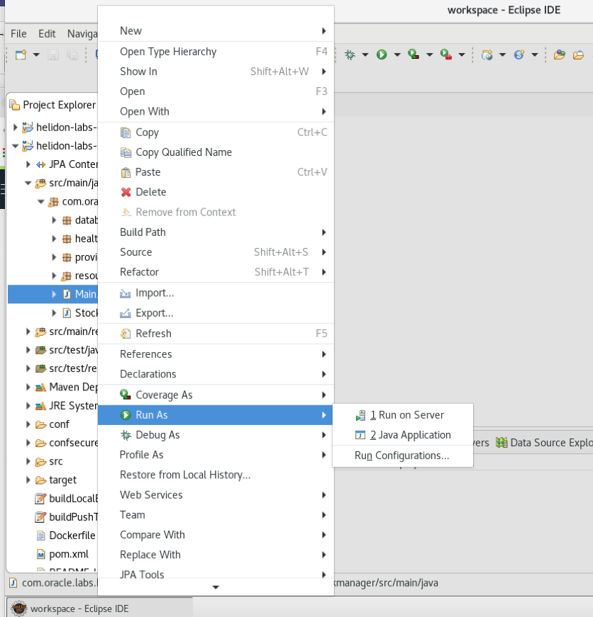

[Go to Helidon for Cloud Native Page](../Helidon-labs.md)


# Migration of Monolith to Cloud Native

## A. Helidon for Cloud Native

## 2. Helidon and Databases

<details><summary><b>Self guided student - video introduction</b></summary>
<p>

This video is an introduction to the Helidon database capabilities lab. Once you've watched it please press the "Back" button on your browser to return to the labs.

[](https://youtu.be/-qNDJtjGfhQ "Helidon database capabilities lab introduction video")

</p>
</details>

---

<details><summary><b>Introduction to Databases</b></summary>
<p>


Unlike SPRING with the SPRINGData projects microprofile (and thus Helidon) does not currently have a built in mechanism for accessing databases. This is however something that is being looked at and hopefully at some point there will be a Microprofile standard for accessing data which Helidon can implement. At that point these labs will be updated to reflect the changes.

However, just because Microprofile and thus Helidon do not have a set of data access annotations and abstractions themselves does not mean you can't access databases (and other persistence solutions) from with Helidon microservices. You simply use the existing technologies such as the Java Persistence API (JPA) and the JTA (Java Transaction API)

In this set of lab modules we will look at how we can combine those with Helidon techniques such as the configuration mechanisms to implement database accesses.

For the labs we will be using the **Oracle Autonomous Transaction Processing database** running in the Oracle Cloud, and have already installed in the client VM maven repository the required OJDBC jar files to support this. We have also downloaded into the environment the "Wallet" file for the database which defines the database configuration, access information and such like.

We are using the Hibernate implementation of the JPA standard to actually do the work of accessing the database. 

If you wanted to change the database instance or the JPA implementation in a deployment it's simply the case of getting the right driver classes and updating the configuration to use them.

As mentioned in the helidon core labs we are only looking at the programming aspects here. We do not cover the Maven pom.xml file. If you want to use this code as a starting point for your own projects then we strongly recommend looking at the pom.xml file so you can see what dependencies are made available to the projects.

**What's in the lab**
We will be looking at the helidon-labs-stockmanager project. This set of classes operate on the database and provides Create Read, Update, Delete (CRUD) functionality for the database front end, specifically modifying the database tables. It will be called by the storefront.

**What's not in this lab**
This lab does not attempt to go into all of the detail or JPA and JTA, the goal is to see how they can be handled in a Helidon based microservice. Because of that the lab does not go into great about how those Java API's operate. 

If you want to understand JPA and JTA in a lot of detail there are courses available, and of course lots of books on the subject

</p></details>

---


### Configuring the project to be personal to you
For some version of this lab all attendees will are operating on a shared database, updating the same table. To ensure that your work doesn't interfere with other peoples work you need to provide a unique identity for yourself

- In Eclipse, switch to the **helidon-labs-stockmanager** project.
- Navigate into the folder **conf**
- Open the file **stockmanager-config.yaml**
- In the `app:` section, add a property **department** with **your** your name, initials or something that's going to be **unique**:
  -  `department: "your_name"`

Example :

```yaml
app:
  persistenceUnit: "stockmanagerJTA"
  department: "just_a_name"
```

(There is a sample line there already, if you prefer modify the value and uncomment the line)

The way this operates is that the StockResource will automatically and transparently add the department to the primary key in all requests.

**What's the difference from the storefront labs ?**
This set of labs sections concentrates on the data accesses. You are assumed to be familiar with things like @POST, @ApplicationScope, loading configurations and such like.

There is less coding than the helidon core lab and more reading here.

This lab also uses exactly the same security configuration so users jack, jill and joe are provided, with password password, and user jack is an admin as before.


---

**Before you start**
Please make sure that for now you have **stopped** the **storefront** application.

---


### Quick overview of the database functionality
The com.oracle.labs.helidon.stockmanager.resources.StockmanagerResource class is the primary class we'll be working with in this lab. If you're not familar with JPA however there are some other classes you should look at.

The classes in the com.oracle.labs.helidon.stockmanager.database package represent the actual structure of the database. In the database configuration we tell the JPA, JTA layers these are the classes we want the database to represent. You'll see that they have some annotations on them, some of which will be familiar. Let's look at the StockLevel class first:

- Expand the folder **src/main/java**, then the folder **database**
- Open the file **StockLevel.java**

```java
@Data
// setup the constructors for us
@NoArgsConstructor
@AllArgsConstructor
// Tell JPA This is something that we want to save, hibernate will do a bunch of stuff for 
// us on this basis, including creating the required tables (assuming we've setup it's 
// properties file correctly
@Entity
@Table(name = "StockLevel")
public class StockLevel {
	@EmbeddedId
	private StockId stockId;

	@Column(name = "itemCount")
	private int itemCount;
}
```

---
<details><summary><b>The annotations explained</b></summary>
<p>

`@Data`, `@NoArgsConstructor` and `@AllArgsConstructor` are Lombok annotations that tell Lombok to automatically create the constructors,getters and setters, toString, equals and hashcode. We could of course do this manually or use tooling in the IDE to generate them, but using Lombok means that the source code is less cluttered and also that if we change the class (say by adding new fields) all of the related methods and constructors update automatically.

The other annotations are used by Java persistence to identify what the classes are :

At the class level
`@Entity` means that this is something that JPA can save into the database as a database row (rather than something that's embedded in a row)

`@Table` specifies the table name to use, a default will be generated based on the class name, but it's nicer to know exactly what we're getting

On our fields in the class

`@EmbeddedId` means that the primary key is this object, because it's embedded the actual primary key can have multiple columns

`@Column` defines the details of the column name, again it can be generated automatically, but this will force a specific name.

</p></details>

---


- Open the file **StockId** in the same folder

Looking at the StockId class

```java
@Embeddable
@Data
@AllArgsConstructor
@NoArgsConstructor
public class StockId implements Serializable {
	private static final long serialVersionUID = 4014326887605314630L;
	@Column(name = "departmentName")
	private String departmentName;
	@Column(name = "itemName")
	private String itemName;
}
```
---

<details><summary><b>The annotations explained</b></summary>
<p>

The Lombok annotations are the same

The class level `@Embeddable` means that JPA treats thsi class as part of an Entity (so a DB row in this case) which means JPA will construct the primary key using the fields in this class

As with the StockLevel we're choosing our own column names using `@Column` rather than letting the system chose them for us.

The Java Persistence system at runtime looks for these annotations and will automatically setup the database mappings based on them. The actual JPA implementation that's being used here is hibernate, it's an open source project, and it will not only handle the database interactions for us, but could if if we wanted it to create the database tables on our behalf (this is controlled by the hibernate.hbm2ddl.auto setting in the persistence.xml file, at the moment it will jst check that the database schema matches what our entities require.)

The entity manager represents the connection to the JPA system, it can be used to locate existing object and create new ones (see the StockResource.createStockLevel method) It can merge updates to existing data (see the StockResource.adjustStockLevel method) and delete objects in the database (see the StockResource.deleteStockItem method.)

For this lab we've got a little bit of logic around those entity manager functions to act as a starting point to let us provide REST CRUD APIs.

It is important to note that each item retrieved from or saved to the database using the entity manager is almost certainly a different instance of the object. Even if you save an object then look at the returned object that has "just been saved" ! So retrieving the same object twice is two separate objects, which contain the same data, not two references to the same object. This means that you need to think carefully if you're going to implement comparisons or equality (hence the benefits of Lombok generating this type of code automatically for us)

---

</p></details>


### Using path parameters for methods
In the Storefront object we were processing Java objects directly as out method arguments (the helidon framework was converting them to / from JSON for us) 

For the StockmanagerResource we are using @PathParams.  A path param is basically part of the URL that can contain data, for example a GET method with a `@Path("/stocklevel/{item}")` when called with /stockLevel/Pencil would extract the Pencil and make it available as the PathParam "item"

Let's look at the StockResource.createStockLevel method to see how this works

- Navigate to folder **resources**
- Open file **StockResource.java**
- Locate the method **createStockLevel** approximately in the middle of the file

```java
@Path("/{itemName}/{itemCount}")
	@PUT
	@Produces(MediaType.APPLICATION_JSON)
	public ItemDetails createStockLevel(@PathParam("itemName") String itemName,
			@PathParam("itemCount") Integer itemCount) throws ItemAlreadyExistsException {
```

The `@Path("/{itemName}/{itemCount}")` makes two params called itemName and itemCount available. Then in the method signature the `@PathParam("itemName")` binds whatever was in the itemName path param to the itemName parameter, and the same for the itemCount.

Helidon does sanity checks here, it the itemCount wasn't a String version of an integer then the caller would get an error message from the Helidon framework itself before the method was called.

Here (to make it clear what's happening) I've used the same name for the path and method param, but that's not required.

Other possible sources for the params are @QueryParam and @FormsParam. Which one you chose will depend on what the URL you are expecting (or want) to get.


### Getting an entity manager
JPA requires an entity manager to do the work of interacting with the database for us. Historically however that would require code like the following which is in the StockResource constructor.

```java
	public StockResource(@ConfigProperty(name = "app.persistenceUnit") String persistenceUnitProvided,
			DepartmentProvider departmentProviderProvided) {
		persistenceUnit = persistenceUnitProvided;
		EntityManagerFactory emfactory = Persistence.createEntityManagerFactory(persistenceUnit);
		this.entityManager = emfactory.createEntityManager();
		departmentProvider = departmentProviderProvided;
	}
```

There are a several problems here. Firstly, we do this each time we create a new instance of the StockResource, and that happens every time we get a request. That's a potentially expensive set of method calls.

Secondly we have to close the entity manager down when it's no longer needed, that can result in some complex code paths to follow, especially if there are exceptions being handled as well.

Also why write code when we don't have to ? With Helidon we have the context and dependency injections capabilities, so we don't however need to setup the entity manager itself, we can have Helidon do that for us.

- In file **StockResource.java**, scroll up to the constructor of the class **StockResource**
- Remove the lines that set up the entity manager, it should now look like below:

```java
	public StockResource(@ConfigProperty(name = "app.persistenceUnit") String persistenceUnitProvided,
			DepartmentProvider departmentProviderProvided) {
		persistenceUnit = persistenceUnitProvided;
		departmentProvider = departmentProviderProvided;
	}
```
- Scroll up to the **top** of the file, just below the class definition, and locate where the **EntityManager** is defined and add an annotation :
  - `@PersistenceContext(unitName = "stockmanagerJTA")`

```java
public class StockResource {
	@PersistenceContext(unitName = "stockmanagerJTA")
	private EntityManager entityManager; 
```

<details><summary><b>Java Imports</b></summary>
<p>

You may need to add the following import to the class

```java
import javax.persistence.PersistenceContext;
```

---
</p></details>

Note that the name of the persistence context is defined as a hard coded String, and there is no mechanism for it to be injected via a config property. However, this is not as restrictive as it seems, the name just refers to entries in the persistence.xml file, which itself uses configuration data from the Helidon configuration system, so if we do want to change the database details we can achieve that by modifying the config, and that can be done without source code modifications.

### Configuring the database

Helidon CDI configures the JPA / JTA (transaction system) for us and creates the Entity manager. The JPA / JTA uses the classpath resource META-INF/persistence.xml to define what classes will be persisted, however we don't want to encode things like the database access details in something that's part of the jar file distribution, somewhat of a security risk !

Normally you'd include the database settings in an external configuration file, but here I want to show another aspect of the Helidon configuration system, and we'll use the Java system properties to hold them (we could equally have used the environment variables, and in the Kubernetes lab we will do just that, with no code changes to handle that switch.)

#### Specifying the database connection details

We need to provide the details of the database connection. Helidon has many ways to do this as you've seen earlier, and so show a different way than using a config file we're going to define them as part of the Java system properties. The Java system properties are the highest priority of configuration items (environment variables are the next level, then files, directories and URL's) These are defined on the java command line using the syntax `-Djavax.sql.DataSource.stockmanagerDataSource.dataSourceClassName=oracle.jdbc.pool.OracleDataSource` As we're using Eclipse to start our microservices we need to configure the Eclipse to pass the properties along for us.

If you are using a database provided by an instructor then they will give you the values for the database connection, or may have already set this up in your virtual machine. If you setup your own database then you will have specified a username and password (if you used our example that will be a username of `HelidonLabs` and a password of `H3lid0n_Labs`) have downloaded the wallet file from which you will have got the connection name, for example `tg_high` **yours will be different unless your database is called `tg` !

We are now going to configure the Eclipse run configuration to add the database connection properties every time the java command is called to run our Main class.

- In the Eclipse navigator window on (on the left) select the stockmanager main class


- Now click the right mouse button and in the resulting menu navigate to `Run As`, then `Run configurations`



The run configurations popup appears

- In the left side of the Run Configurations popup select `Java Applications`


- Click the new configuration button, this looks like a blank page at the top of the left hand list


The Run configurations popup will create and display a new configuration


Note that in this case it is named `Main (2)` but that may vary

- Click the name `Main (2)` in this case (but yours may vary) and name this configuration `stockmanager`


- Now click on the `args` tab (this is just below the name)

The Run configurations popup will now switch to the args tab


- Copy the text below into a notepad or ASCII text editor you will need to make some changes to it before you use it. (Do **not** use a word processor like Microsoft Word or anything that makes the test "pretty" as they replaces the `-` characters automatically with a longer version - and that won't work) 

Be careful not to add any newlines or extra spaces, tabs etc.

```
-Djavax.sql.DataSource.stockmanagerDataSource.dataSourceClassName=oracle.jdbc.pool.OracleDataSource -Djavax.sql.DataSource.stockmanagerDataSource.dataSource.url=jdbc:oracle:thin:@<database connection name>?TNS_ADMIN=./Wallet_ATP -Djavax.sql.DataSource.stockmanagerDataSource.dataSource.user=HelidonLabs -Djavax.sql.DataSource.stockmanagerDataSource.dataSource.password=H3lid0n_Labs -Dhibernate.dialect=org.hibernate.dialect.Oracle10gDialect -Dhibernate.hbm2ddl.auto=update
```

- In the test editor replace `<database connection name>` with the name of your database connection, in my case that's `tg_high`, **yours will be different** 

- Make sure you replace the entire thing including `<` and `>`

- If you created a database and used different names for the username and password than we suggested (or have been told by an instructor that there are different user names or passwords) you will need to replace those here as well.

As an example for **my** database it looks like this, **but yours will vary**

```
-Djavax.sql.DataSource.stockmanagerDataSource.dataSourceClassName=oracle.jdbc.pool.OracleDataSource -Djavax.sql.DataSource.stockmanagerDataSource.dataSource.url=jdbc:oracle:thin:@tg_high?TNS_ADMIN=./Wallet_ATP -Djavax.sql.DataSource.stockmanagerDataSource.dataSource.user=HelidonLabs -Djavax.sql.DataSource.stockmanagerDataSource.dataSource.password=H3lid0n_Labs -Dhibernate.dialect=org.hibernate.dialect.Oracle10gDialect -Dhibernate.hbm2ddl.auto=update
```

- Copy the updated text

- In the `VM Arguments` file of the Run configurations popup paste the **updated** text


- Click the `Apply` button to save the changes

- Click the `Close` button to exit the Run configurations popup.
 
In case you wanted to see how to use the a config file for the database settings there is an example in example-config-data/stockmanager-database.yaml file. This isn't actually an imported part of the config files, but it shows you how it could be done using a config file.


Using Helidon to create our PersistenceContext will also ensure that the entity manager is correctly shutdown when the program exits so we won't have any unused resources hanging around in the database.

- Run the **Main** class of the project (right-click on **Main.java**, *Run As*, then *Java Application*.)

---

<details><summary><b>Error on app.department?</b></summary>
<p>

If it fails to run like this

```
2020.01.05 18:26:18 INFO org.jboss.weld.Version Thread[main,5,main]: WELD-000900: 3.1.1 (Final)
2020.01.05 18:26:19 INFO org.jboss.weld.Bootstrap Thread[main,5,main]: WELD-ENV-000020: Using jandex for bean discovery
2020.01.05 18:26:19 INFO org.jboss.weld.Event Thread[main,5,main]: WELD-000411: Observer method [BackedAnnotatedMethod] public org.glassfish.jersey.ext.cdi1x.internal.ProcessAllAnnotatedTypes.processAnnotatedType(@Observes ProcessAnnotatedType<?>, BeanManager) receives events for all annotated types. Consider restricting events using @WithAnnotations or a generic type with bounds.
2020.01.05 18:26:19 INFO org.jboss.weld.Event Thread[main,5,main]: WELD-000411: Observer method [BackedAnnotatedMethod] private io.helidon.microprofile.openapi.IndexBuilder.processAnnotatedType(@Observes ProcessAnnotatedType<X>) receives events for all annotated types. Consider restricting events using @WithAnnotations or a generic type with bounds.
Exception in thread "main" org.jboss.weld.exceptions.DeploymentException: Requested value for configuration key 'app.department' is not present in the configuration.
	at org.jboss.weld.bootstrap.events.AbstractDeploymentContainerEvent.fire(AbstractDeploymentContainerEvent.java:38)
	at org.jboss.weld.bootstrap.events.AfterDeploymentValidationImpl.fire(AfterDeploymentValidationImpl.java:28)
	at org.jboss.weld.bootstrap.WeldStartup.validateBeans(WeldStartup.java:505)
```

You haven't setup the stockmanager-config.yaml file with the department value. Go do that, restart the program and try again.

</p>

</details>

---

The result should show the application listening on http://localhost:8081

```
2020.01.05 18:30:33 INFO io.helidon.microprofile.server.ServerImpl Thread[nioEventLoopGroup-2-1,10,main]: Server started on http://localhost:8081 (and all other host addresses) in 69 milliseconds.
2020.01.05 18:30:33 INFO com.oracle.labs.helidon.stockmanager.Main Thread[main,5,main]: http://localhost:8081
```


- Use curl to see what's there
  -  `curl -i -X GET -u jack:password http://localhost:8081/stocklevel`


```
HTTP/1.1 200 OK
Content-Type: application/json
Date: Sun, 5 Jan 2020 18:54:06 GMT
connection: keep-alive
content-length: 2

[]
```


There should be just `[]` returned, if there are any item details it means that you didn't chose a unique department value ! Chose something that is unique, update the stockmanager-config.yaml file department attribute, restart the program and try again.


<details><summary><b>What with the SQL in the console output ?</b></summary>
<p>

You may have seen what looks like SQL in the output. The library we are using here to actually handle the database connection is a very commonly used package called Hibernate. One of it's nice features is that it can be set to create the database tables for you if needed. 

You're probably running this against a nice new database that doesn't have the required tables in it yet, so Hibernate has looked at the classes it's been told to manage (These are specified in the persistence.xml file) and has created the tables for us. It can also modify the database scheme to match the classes if the classes have been changed.

Of course in a production environment you wouldn't want the database changing under you as the classes are updated, so you'd turn that off (the `hibernate.hbm2ddl.auto` setting) but for a lab it makes things a lot easier for us. 
</p></details>
- Let's try to create some stock items - **error expected**:

  -  `curl -i -X PUT -u jack:password http://localhost:8081/stocklevel/pins/5000`

Note there is a few seconds delay when you try this as the code does the database connection on demand ... and then you get an error as expected: 

```
HTTP/1.1 500 Internal Server Error
Content-Length: 0
Date: Sun, 5 Jan 2020 18:54:43 GMT
connection: keep-alive
```

Look at the console tab and you will see that the code generates an error

```
2020.01.05 18:54:46 INFO org.hibernate.engine.transaction.jta.platform.internal.JtaPlatformInitiator Thread[helidon-1,5,server]: HHH000490: Using JtaPlatform implementation: [org.hibernate.engine.transaction.jta.platform.internal.JBossStandAloneJtaPlatform]
Hibernate: 
    select
        stocklevel0_.departmentName as departmentName1_0_0_,
        stocklevel0_.itemName as itemName2_0_0_,
        stocklevel0_.itemCount as itemCount3_0_0_ 
    from
        StockLevel stocklevel0_ 
    where
        stocklevel0_.departmentName=? 
        and stocklevel0_.itemName=?
2020.01.05 18:54:47 INFO com.oracle.labs.helidon.stockmanager.resources.StockResource Thread[helidon-1,5,server]: Creating StockLevel(stockId=StockId(departmentName=timg, itemName=pins), itemCount=5000)
javax.persistence.TransactionRequiredException
	at io.helidon.integrations.cdi.jpa.NonTransactionalEntityManager.persist(NonTransactionalEntityManager.java:92)
...
```

`TransactionRequiredException` sounds pretty serious, and it is, it's because we're trying to modify the database, and Helidon created entity management knows that this should be done in a transaction. Whenever you modify a database it's a pretty good rule of thumb that you need a transaction to keep things safe and consistent, even when the modification is a single row in a single database.

### Automatic Transactions
We could manually ask the entity manager to start and and transactions, but that's a load of extra code, and the possible paths if there are problems to do the rollback or commit are significant. Let's use the Java Transaction API (JTA) to do it for us.

Fortunately for us all we need is an @Transactional annotation and Heliton will trigger the JTA to manage the transactions for us.

- Still in file **StockResource.java**, locate the StockResource class definition
- Add the transaction annotation on the top:
  -  `@Transactional`


```
@Path("/stocklevel")
@RequestScoped
@Slf4j
@Transactional
public class StockResource {
```

<details><summary><b>Java Imports</b></summary>
<p>

You may need to add the following import to the class

```java
import javax.transaction.Transactional;
```

---
</p></details>

This means that every operation in the class will be wrapped in a transaction automatically, If the method returns normally (so no exceptions thrown) then the transaction will be automatically committed, but if the transaction returned abnormally (e.g. an exception was thrown) then the transaction will be rolled back.

This will apply if there were multiple entity managers or database modification actions operating within the method. So if the method modifies data in several databases then they would all succeed of fail. This how Helidon helps ensure that the database ACID (Atomic, Consistent, Isolated and Durable) semantics are maintained 


---

Let's try the POST again

- `curl -i -X PUT -u jack:password http://localhost:8081/stocklevel/Pins/5000`

```
HTTP/1.1 200 OK
Content-Type: application/json
Date: Tue, 22 Sep 2020 18:57:53 GMT
connection: keep-alive
content-length: 36

{"itemCount":5000,"itemName":"Pins"}
```

We've successfully called the creation API with no errors. On success the return is the newly created object

Once the first operation has returned and the database connection is all setup the subsequent calls are much faster.

Let's confirm if it's been committed to the DB. Here we're going to use the API to retrieve a specific item

- `curl -i -u jack:password  -X GET localhost:8081/stocklevel/Pins`

```
HTTP/1.1 200 OK
Content-Type: application/json
Date: Tue, 22 Sep 2020 19:02:14 GMT
connection: keep-alive
content-length: 36

{"itemCount":5000,"itemName":"Pins"}
```

It has been committed to the database.

### Creating some data and testing the stockmanager works
- Restart the stockmanaer.Main 

- Use curl to create some stock items (expect an error on the last one) :
  - `curl -i -X PUT -u jack:password http://localhost:8081/stocklevel/Pin/5000`
  - `curl -i -X PUT -u jack:password http://localhost:8081/stocklevel/Pencil/200`
  - `curl -i -X PUT -u jack:password http://localhost:8081/stocklevel/Eraser/50`
  - `curl -i -X PUT -u jack:password http://localhost:8081/stocklevel/Book/100`
  - `curl -i -X PUT -u jack:password http://localhost:8081/stocklevel/Book/50`

```
HTTP/1.1 200 OK
Content-Type: application/json
Date: Sun, 5 Jan 2020 18:58:43 GMT
connection: keep-alive
content-length: 35

{"itemCount":5000,"itemName":"Pin"}

... similar output for the rest ...
```


Note that on the 2nd attempt to add the books we don't get anything back representing the newly create object - it's already there, and the logs give us an error message!

- Use curl to get the current stock list
  -  `curl -i -X GET -u jack:password http://localhost:8081/stocklevel`

```
HTTP/1.1 200 OK
Content-Type: application/json
Date: Sun, 5 Jan 2020 19:01:01 GMT
connection: keep-alive
content-length: 185

[{"itemCount":100,"itemName":"Book"},{"itemCount":50,"itemName":"Eraser"},{"itemCount":200,"itemName":"Pencil"},{"itemCount":5000,"itemName":"Pin"},{"itemCount":5000,"itemName":"Pins"}]
```

Note that we have "accidentally" created two versions of the Pin (Pin and Pins), let's remove one

- Use curl to remove it
  -  `curl -i -X DELETE -u jack:password http://localhost:8081/stocklevel/Pins`

```
HTTP/1.1 200 OK
Content-Type: application/json
Date: Sun, 5 Jan 2020 19:01:38 GMT
connection: keep-alive
content-length: 36

{"itemCount":5000,"itemName":"pins"}
```


Finally let's test changing the level of some stock, we had 200 Pencils, let's reduce that to 150

-  `curl -X POST  -u jack:password http://localhost:8081/stocklevel/Pencil/150`

And we can check the stock levels are changed : 

-  `curl -i -X GET -u jack:password http://localhost:8081/stocklevel`

```
HTTP/1.1 200 OK
Content-Type: application/json
Date: Sun, 5 Jan 2020 19:03:11 GMT
connection: keep-alive
content-length: 148

[{"itemCount":100,"itemName":"Book"},{"itemCount":50,"itemName":"Eraser"},{"itemCount":150,"itemName":"Pencil"},{"itemCount":5000,"itemName":"Pin"}]
```

### Optional lab - accessing the context of the request

There are situations where you need to access the context of a request, for example in getting the identity of the user, or examining in detail the Http headers.

Not all projects need to access this information, which is why this is an optional step in the lab you can do if you have time, or come back to later if you wish.

If you'd like to then please work through the [accessing the context](./accessing-the-context.md) module.

### Summary

**Please leave the stockmanager running, we're going to use it in the next few labs**

We haven't looked at JPA / JTA in much detail, but we've seen how the Helidon configuration system can be used to supply configuration data to the JPA and JTA as they are being setup.

We've seen how we can use the Helidon dependency injection system with the `@PersistenceContext` annotation to create and manage entity managers for us.

We've used the `@Transactional` annotation to make our entire class use JTA transactions

We've also seen how we can bring use @PathParam to provide us with a different way of gathering data from a REST request and passing it to our methods.


The next lab in the *Helidon for Cloud Native* section is 

**3. Communicating services with Helidon** : This lab shows the support in Helidon for switching from a direct method call to using a REST call without modifying the calling method.

[The cross service communication lab](../Helidon-to-Other-Microservices/helidon-to-other-microservices.md)


---


[Go to *Helidon for Cloud Native* overview Page](../Helidon-labs.md)
