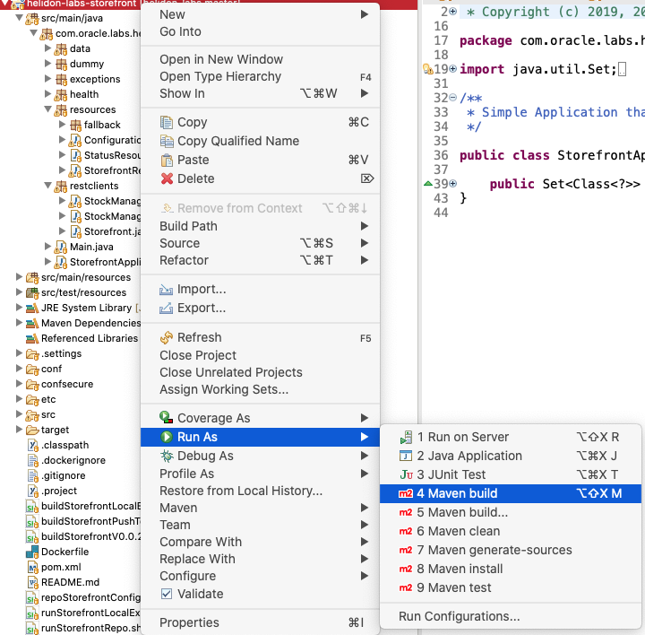

[Go to Helidon for Cloud Native Page](../Helidon-labs.md)


# Migration of Monolith to Cloud Native

## A. Helidon for Cloud Native

## 4. Helidon and Open API
This is an optional module for the Helidon lab, but you will need to complete it if you are going to run the API Gateway section of the cloud infrastructure lab


<details><summary><b>Self guided student - video introduction</b></summary>
<p>

This video is an introduction to the Helidon Open API (ex Swagger) lab. Once you've watched it please press the "Back" button on your browser to return to the labs.

[](https://youtu.be/A_gVG2cb308 "Helidon Open APIlab introduction video")

</p>
</details>

---

This module is how to get Helidon to self-describe the REST API you are offering. There are several use cases for this, some of those are :

1/ You need the API description in a consistent machine readable form that can be processed by other applications, for example you are using an API gateway and need to define rules for certain endpoints

2/ You want to ensure that the documentation of the REST API actually reflects the implementation, it's not uncommon for documentation and implementation to be out of sync if they are separately maintained through manual processes.

3/ You can't find the documentation for a service, or it is a service where you have the jar file, but the documentation was on a since removed website and not even the internet archive can help !

4/ You want to automatically create client code based on the API (or server code, but that gives rise to an initial Catch 22 situation)
 
To address this the idea of self describing API end points was developed, originally this was developed by an application having a "well known" URL that just returned a manually maintained text document that was distributed as part of the jar file. It then evolved into machine readable data formats, for example the Swagger REST API description format based on JSON, which has since been donated to the community under the name Open API and is now the de-facto data format. For a more detailed history see the Wikipedia [Open API page.](https://en.wikipedia.org/wiki/OpenAPI_Specification)

OpenAPI describes the data format, but there has also been the development of tooling and programming approaches to the automatic runtime generation of the OpenAPI data based on information in the source code. This means that the OpenAPI docuemntation delivered by the service is automatically in sync with the actuall code of the service itself.

In the case of Microprofile (and this Helidon as a Microprofile implementation) this was done through the MicroProfile OpenAPI specification which defines annotations to be used when generating the OpenAPI documents and associated the control mechanisms (for example to exclude API elements that are not intended to be publicly exposed)

## Defining the API documentation in your code

<details><summary><b>A Note on annotation processing and jandex</b></summary>
When a system like Helidon MP runs the annotations you've applied to your code need to be identified so they can be processed. This is done automatically for you by the runtime, and annotation processors are called to perform whatever actions you have specified (e.g. setting up a start / stop on a timer on entry / exit form a method)

There are two ways to identify the annotations in your code:

1/ The runtime can search through every class and method to find them each time the program is started, this can be time consuming if you have a lot of code

2/ When the service is built the build process creates an index (usually packaged into the jar file) that is processed when the service starts, and each annotation can be immediately identified. This means that the code scanning process only happens once at build time and results in a faster startup, though it does mean a slightly longer build phase and also a slightly larger deployment.

In general the costs of building and storing an index are way smaller than those of scanning each time, and this is the approach that Helidon uses when packaging a service, though when running within Eclipse it does a scan as otherwise you'd have to build the index each time you saved a file which would slow down the development process (This is why you may see warning messages about missing jandex.idx files when running the micro-servcies in Eclipse)

To build the index Heldion uses a tool called jandex (Java ANnotaiton inDEXer) to build the index, This is done for you automatically when you package a service, but the OpenAPI code for some reason only seems to search the jandex index file, and not scan the code. This is why you will be running the maven build target process-classes later on.

Because running JANDEX can take a lot of time (relatively speaking) you don't want to run it each time you make a change to a source code file in Eclipse, so it needs to be specifically run to generate the index when operating in Eclipse. We will shortly see how that is done.
</p></details>

---

## What we're going to do
In this module we will be adding annotations to describe the storefront service and the data it consumes and returns. In a production environment you may chose to limit what's documented and restrict it to only the public API elements intended to be seen outside your project (this will of course be up to you how you do this, but in general it's good practice not to document something that can't be seen externally)

You may of course chose to document other services, for example the stockmanager would normally not publicly visible outside the Kubernetes cluster, but you may chose to document it's API to help building internal clients of the service.

### Accessing the OpenAPI documentation
The generated OpenAPI documentation can be accessed using curl
 - `curl http://localhost:8080/openapi`

```yaml
info: 
  title: Generated API
  version: '1.0'
openapi: 3.0.1
paths: {}
```

Of course at the moment we haven't actually build anything in it (if you see output other than the above it means you've already created the index)

### Defining the Service itself

Firstly we shall define what the top level service provides, this can be done on any of the classes managed by the content and dependency injection syb-system, but it seems most relevant to place the annotations on the StorefrontApplication class.

- Open the **StorefrontApplication.java file**, and add the following @OpenAPIDefiniton annotation on the *class declaration* itself:
  - ```java
    @OpenAPIDefinition(info = @Info(title = "StorefrontApplication", description = "Acts as a simple stock level tool for a post room or similar", version = "0.0.1"))
    ```

The resulting class declaration should look like

```java
@ApplicationScoped
@ApplicationPath("/")
@OpenAPIDefinition(info = @Info(title = "StorefrontApplication", description = "Acts as a simple stock level tool for a post room or similar", version = "0.0.1"))
public class StorefrontApplication extends Application {
```

<details><summary><b>Java Imports</b></summary>
<p>

You may need to add the following import to the class

```java
import org.eclipse.microprofile.openapi.annotations.OpenAPIDefinition;
```

---
</p></details>

<details><summary><b>Explanation of the annotations</b></summary>
<p>

The `@OpenAPIDefinition` indicates that this is defining the API top level details for this project. The `@Info` is an annotation that defines what that information actually is.

The title, description and version fields are I hope self explanatory 
</p>
</details>
---

### Creating the index
Before we can see the updates to the OpenAPI spec we need to build an index of the annotations

Unlike the server processing annotations the OpenAPI processing only operates against a jandex index, and won't scan for OpenAPI annotations in the class files (I'm not sure if this is a bug or a feature)

Because of this the jandex index needs to be built to reflect the OpenAPI annotations. To do this you can manually run maven in Eclispe with the process-classes goal.

First we need to create a run configuration to create this goal

Select the helidon-labs-storefront project, click right -> Run As -> Maven Build .... 


Update the popup with the following

- set the name to be `helidon-labs-storefront (process-classes)` (if you chose something else it's fine, just remember to use that later on)

- In the goals enter `process-classes`

- Click `Apply` then `Close`


Now to run a build with this target.

- Click right on the **project** name (helidon-labs-storefront) in Eclipse, then chose `Run As` then `Maven build`  (This is the version **without** the three dots !)



Depending on the precise eclispe configuration there **may** be a resulting popup window, do not worry if this is not displayed and the build just continues

- If there is a popup then chose the process-classes option.


Then click the OK button

In the console tab you'll see output similar to the following

```
[INFO] Scanning for projects...
[INFO] ------------------------------------------------------------------------
[INFO] Detecting the operating system and CPU architecture
[INFO] ------------------------------------------------------------------------
[INFO] os.detected.name: osx
[INFO] os.detected.arch: x86_64
[INFO] os.detected.version: 10.15
[INFO] os.detected.version.major: 10
[INFO] os.detected.version.minor: 15
[INFO] os.detected.classifier: osx-x86_64
[INFO] 
[INFO] -----------------< com.oracle.labs.helidon:storefront >-----------------
[INFO] Building storefront 0.0.1
[INFO] --------------------------------[ jar ]---------------------------------
[INFO] 
[INFO] --- maven-resources-plugin:2.7:resources (default-resources) @ storefront ---
[INFO] Using 'UTF-8' encoding to copy filtered resources.
[INFO] Copying 3 resources
[INFO] 
[INFO] --- maven-compiler-plugin:3.8.1:compile (default-compile) @ storefront ---
[INFO] Nothing to compile - all classes are up to date
[INFO] 
[INFO] --- jandex-maven-plugin:1.0.6:jandex (make-index) @ storefront ---
[INFO] ------------------------------------------------------------------------
[INFO] BUILD SUCCESS
[INFO] ------------------------------------------------------------------------
[INFO] Total time:  1.233 s
[INFO] Finished at: 2020-08-17T18:40:22+01:00
[INFO] ------------------------------------------------------------------------

```

Note that the version numbers may differ.

Towards the end of the output you can see that the Maven jandex plugin is run.

### Viewing the initial OpenAPI spec
Now we've added an annotation covering the initial contents let's look at it. You must have created the jandex index as described above and stopped any existing instances (there is no need to have the stockmanager running, but if it already is don't worry)

- Start the storefront service running using the Main class as before, this will cause the jandex.idx file to be read.

- In a terminal window type 
    - `curl  http://localhost:8080/openapi`

```yaml
components: 
  schemas:
    ItemDetails: 
      required:
      - itemCount
      - itemName
      properties:
        itemCount: 
          description: The number of items listed as being available
          example: '10'
          format: int32
          type: integer
        itemName: 
          description: The name of the item
          example: Pencil
          type: string
      description: Details of the item in the database
      example: '{"itemCount": 10, "itemName": "Pencil"}'
      type: object
    ItemRequest: 
      properties:
        requestedCount: 
          format: int32
          type: integer
        requestedItem: 
          type: string
      type: object
info: 
  description: Acts as a simple stock level tool for a post room or similar
  title: StorefrontApplication
  version: 0.0.1
openapi: 3.0.1
paths:
  /minimumChange: 
    post: 
      requestBody: 
        content:
          application/json: 
            schema: 
              format: int32
              type: integer
      responses:
        '200': 
          description: OK
    get: 
      responses:
        '200': 
          description: OK
  /status: 
    get: 
      responses:
        '200': 
          content:
            application/json: 
              schema: 
                type: object
          description: OK
  /store/reserveStock: 
    post: 
      requestBody: 
        content:
          application/json: 
            schema: 
              $ref: '#/components/schemas/ItemRequest'
      responses:
        '200': 
          content:
            application/json: 
              schema: 
                $ref: '#/components/schemas/ItemDetails'
          description: OK
  /store/stocklevel: 
    get: 
      responses:
        '200': 
          content:
            application/json: 
              schema: 
                items: 
                  $ref: '#/components/schemas/ItemDetails'
                type: array
          description: OK

```

<details><summary><b>If you didn't see similar to the output above</b></summary>

If you just saw the basic info that was returned when you initially did a curl to this URN the probability is that you hadn't completed the maven build on the process-class goal before you re-started the storefront service. Stop the storefront service, make sure you've correctly run and finished the maven build on the process-class goal and the console reports that the jandex has run and the build has been a success, then re-start the storefront application.

</p></details>
---

#### What does this output mean ?
In summary it means that adding the @OpenAPIDefinition triggered Helidon to scan the jandex index for classes references by the application, looking for REST endpoints (@GET, @POST etc. annotations.) Helidon then builds a OpenAPI document that returns the YAML description. Note that the precise order of the major sections may change (it depends on the order the annotations are processed) so you may see the `components:` section before or after the `info: or `path` section

First locate the `info:` section. 

```yaml
info: 
  description: Acts as a simple stock level tool for a post room or similar
  title: StorefrontApplication
  version: 0.0.1
```

This contains the information you supplied to the `@OpenAPIDefinition` annotation.

Now let's look at the `components:` section.

```yaml
components: 
  schemas:
    ItemDetails: 
      required:
      - itemCount
      - itemName
      properties:
        itemCount: 
          description: The number of items listed as being available
          example: '10'
          format: int32
          type: integer
        itemName: 
          description: The name of the item
          example: Pencil
          type: string
      description: Details of the item in the database
      example: '{"itemCount": 10, "itemName": "Pencil"}'
      type: object
    ItemRequest: 
      properties:
        requestedCount: 
          format: int32
          type: integer
        requestedItem: 
          type: string
      type: object
```

The `schemas:` section defines the objects that are passed back and forth (there are other possible sections under `components:` but they are not covered here.) Look at the `ItemRequest:` section, it defines the basic information in the ItemRequest object, this basically describes the ItemRequest class, with a requectedCount of type int32 (a Java int) and a requectedItem of a Java String

<details><summary><b>Why is there more information for the ItemDetails ?</b></summary>
To speed up the lab I've already provided the OpenAPI annotations to the ItemDetails class, as its in a different project and I didn't want to make this module to complex switching back and forwards between projects and building them.

The helidon-labs-common project defines the ItemDetails class, and jandex was run on that package to produce its own jandex.idx file when that package was built and installed into the Maven repository. 

Helidon will scan for jandex.idx files across multiple jar files, and bring in the annotations from all of them. The classes in those files that are referenced by the service REST API will be included in the OpenAPI documentation as required.
</p></details>

The `openapi: 3.0.1` simply defines what version of the OpenAPI document specification this document conforms to.

Lastly let's look at the `paths` section

```yaml
paths:
  /minimumChange: 
    post: 
      requestBody: 
        content:
          application/json: 
            schema: 
              format: int32
              type: integer
      responses:
        '200': 
          description: OK
    get: 
      responses:
        '200': 
          description: OK
  /status: 
    get: 
      responses:
        '200': 
          content:
            application/json: 
              schema: 
                type: object
          description: OK
  /store/reserveStock: 
    post: 
      requestBody: 
        content:
          application/json: 
            schema: 
              $ref: '#/components/schemas/ItemRequest'
      responses:
        '200': 
          content:
            application/json: 
              schema: 
                $ref: '#/components/schemas/ItemDetails'
          description: OK
  /store/stocklevel: 
    get: 
      responses:
        '200': 
          content:
            application/json: 
              schema: 
                items: 
                  $ref: '#/components/schemas/ItemDetails'
                type: array
          description: OK

```

The `paths:` section defines the REST endpoints offered by the service, in this case `/minimumChange`, `/status`, `/store/reserveStock` and `/store/stocklevel` for each path it defines the method used (`get`, `post`) the parameters to the request and the response. Thus we can see that the /store/stocklevel path returns an array of ItemDetails objects.

<details><summary><b>Want the output in JSON ?</b></summary>
Helidon can generate the OpenAPI document in yaml (the default) or in JSON. To generate JSON use the Accept header.
 - In a terminal window type:

   - `curl -i -H "Accept:application/json" http://localhost:8080/openapi`

```json
HTTP/1.1 200 OK
Content-Type: application/json;charset=UTF-8
Date: Wed, 11 Mar 2020 17:25:21 GMT
connection: keep-alive
content-length: 2964

 {
  "components":  {
    "schemas": {
      "ItemDetails":  {
        "required": [
          "itemCount",
          "itemName"]
        ,
        "properties": {
          "itemCount":  {
            "description": "The number of items listed as being available",
            "example": "10",
            "format": "int32",
            "type": "integer"
          },
          "itemName":  {
            "description": "The name of the item",
            "example": "Pencil",
            "type": "string"
          }
        },
        "description": "Details of the item in the database",
        "type": "object"
      },
      "ItemRequest":  {
        "properties": {
          "requestedCount":  {
            "format": "int32",
            "type": "integer"
          },
          "requestedItem":  {
            "type": "string"
          }
        },
        "type": "object"
      }
    }
  },
  "info":  {
    "description": "Acts as a simple stock level tool for a post room or similar",
    "title": "StorefrontApplication",
    "version": "0.0.1"
  },
  "openapi": "3.0.1",
  "paths": {
    "/minimumChange":  {
      "post":  {
        "requestBody":  {
          "content": {
            "application/json":  {
              "schema":  {
                "format": "int32",
                "type": "integer"
              }
            }
          }
        },
        "responses": {
          "200":  {
            "description": "OK"
          }
        }
      },
      "get":  {
        "responses": {
          "200":  {
            "description": "OK"
          }
        }
      }
    },
    "/status":  {
      "get":  {
        "responses": {
          "200":  {
            "content": {
              "application/json":  {
                "schema":  {
                  "type": "object"
                }
              }
            },
            "description": "OK"
          }
        }
      }
    },
    "/store/reserveStock":  {
      "post":  {
        "requestBody":  {
          "content": {
            "application/json":  {
              "schema":  {
                "$ref": "#/components/schemas/ItemRequest"
              }
            }
          }
        },
        "responses": {
          "200":  {
            "content": {
              "application/json":  {
                "schema":  {
                  "$ref": "#/components/schemas/ItemDetails"
                }
              }
            },
            "description": "OK"
          }
        }
      }
    },
    "/store/stocklevel":  {
      "get":  {
        "responses": {
          "200":  {
            "content": {
              "application/json":  {
                "schema":  {
                  "items":  {
                    "$ref": "#/components/schemas/ItemDetails"
                  },
                  "type": "array"
                }
              }
            },
            "description": "OK"
          }
        }
      }
    }
  }
}

```

For the rest of the lab documentation I'm going to stick with yaml as it's a bit shorter, but feel free to use JSON if you prefer.
</b></details>
---


### To many paths, how do we hide private ones ?
This has given us the entire API, but the /status is probably not relevant to external callers. (As we'll see in the Kubernetes sections it's more for the internal operation of the cluster and availability than something an client would call. So we need a way to remove some end-points from the output.

- Open the src/main/resources/META-INF/microprofile-config.properties file
  - Uncomment the line `mp.openapi.scan.exclude.classes=com.oracle.labs.helidon.storefront.resources.StatusResource,com.oracle.labs.helidon.storefront.resources.ConfigurationResource`
 
(It's the last line, so it may be a bit hidden)
 
This tells Helidon to ignore any paths it finds in the StatusResource and ConfigurationResource classes when generating the Open API document.

<details><summary><b>Other configuration settings for OpenAPI</b></summary>
The Helidon runtime supports a large number of configuration settings that can be used to control the generation of the OpenAPI document, this include the ability to specify packages as well as classes to include / exclude, or if you need finer grained control you can even define filter and model classes that chose exactly which paths will be included or removed. 

See the OpenAPI documentation (link at the bottom of this module) for the full details. 
</b></details>

<details><summary><b>Why use the microprofile-config.properties file</b></summary>
It is of course possible to apply this exclusion in any of the config files, but this is an example of a setting that as a developer you probably want to have applied by default in every deployment, after all you're suppressing internal information. The microprofile-config.properties file is embedded into the class path, so that will ensure that the default behavior is what you want. If someone want's to they can of course override that in a local file system based config file such as conf/storefront-config.yaml
</b></details>

Let's see how this looks, there is no need to re-build the index this time as the change was in the config file, not annotations in the source code.

- Restart the storefront service (have to do this as the microprofile-config.propeties file isn't one of the ones that's checked for changes)

- Check out the updated documentation that's generated

  - ` curl -i http://localhost:8080/openapi`
  
```yaml
HTTP/1.1 200 OK
Content-Type: application/vnd.oai.openapi;charset=UTF-8
Date: Wed, 11 Mar 2020 18:16:56 GMT
connection: keep-alive
content-length: 1428


components: 
  schemas:
    ItemDetails: 
      required:
      - itemCount
      - itemName
      properties:
        itemCount: 
          description: The number of items listed as being available
          example: '10'
          format: int32
          type: integer
        itemName: 
          description: The name of the item
          example: Pencil
          type: string
      description: Details of the item in the database
      example: '{"itemCount": 10, "itemName": "Pencil"}'
      type: object
    ItemRequest: 
      properties:
        requestedCount: 
          format: int32
          type: integer
        requestedItem: 
          type: string
      type: object
info: 
  description: Acts as a simple stock level tool for a post room or similar
  title: StorefrontApplication
  version: 0.0.1
openapi: 3.0.1
paths:
  /store/reserveStock: 
    post: 
      requestBody: 
        content:
          application/json: 
            schema: 
              $ref: '#/components/schemas/ItemRequest'
      responses:
        '200': 
          content:
            application/json: 
              schema: 
                $ref: '#/components/schemas/ItemDetails'
          description: OK
  /store/stocklevel: 
    get: 
      responses:
        '200': 
          content:
            application/json: 
              schema: 
                items: 
                  $ref: '#/components/schemas/ItemDetails'
                type: array
          description: OK
```

This looks much better, we can see the details of the core REST API we want to expose, and we're not polluting it with end-points that in a production system would not be exposed.
  
Strictly speaking this is all that you need to be able to use the API from a caller perspective, you know what to send and what to expect in return, but it's not very detailed information, and it doesn't actually tell you much about what those end-points do (of course this is not completely true here because as a good programmer I've tried to use meaningful names.)

### Defining the inputs and outputs

We've got basic information on the ItemRequest (and of course full info on ItemDetails as that was documented in a separate project.) let's see how we can document the ItemRequest in more details.

- Open the ItemRequest class in the com.oracle.labs.helidon.storefront.data package and add @Schema annotations

- Add the following annotation to the class definition itself
  - ```java
    @Schema(name = "ItemRequest", description = "Details of a Item reservation request")
    ```
- Add the following annotation to the requestedItem field
  - ```java
    @Schema(required = true, description = "Name of the item being requested", example = "Pencil")
    ```
- Add the following annotation to the requestedCount field
  - ```java
    @Schema(name = "ItemRequest", description = "Details of a Item reservation request", example = "{\"requestedItem\", \"Pin\", \"requestedCount\",5}")
    ```

The resulting class looks like :

```java
@Data
@NoArgsConstructor
@AllArgsConstructor
@Schema(name = "ItemRequest", description = "Details of a Item reservation request")
public class ItemRequest {
	@Schema(required = true, description = "Name of the item being requested", example = "Pencil")
	private String requestedItem;
	@Schema(name = "ItemRequest", description = "Details of a Item reservation request", example = "{\"requestedItem\", \"Pin\", \"requestedCount\",5}")
	private int requestedCount;
}
```

<details><summary><b>Java Imports</b></summary>
<p>

You may need to add the following import to the class

```java
import org.eclipse.microprofile.openapi.annotations.media.Schema;
```

---
</p></details>

<details><summary><b>Explaining the annotations</b></summary>

`@Schema` is a commonly used annotation with OpenAPI, it basically is used to identify data objects and their fields. 

There are a *very* large number of attributes that can be added to a `@Schema` annotation, and you can see common (and I hope self explanatory) ones here. There are also attributes that define minimum and maximum values of an attribute, or define the allowable fields of an enum. These could be used to enable client code to apply data validation checks itself before they get to the service itself.

Some annotations like `required` might seem a bit strange, after all in Java there is no concept of optional attributes on a class or method, however it's important to remember that this relates to data being **transfered**, not to data at rest. The Helidon framework will create the **instance** of the class and it's quite reasonable that a class may have a default value for a field. In that case it's not going to be **required** as the REST API request defines a value for that field unless the request want's to override the default.

Full details of the `@Schema` annotation are in the Microprofile OpenAPI documentation linked to at the end of this module.

</b></details>
---

Let's look at the updated REST APi description 

- Stop the existing instance of storefront

- Rebuild the jandex.idx file following the create index process (described above)

- **Once the index has been rebuilt** then start the storefront service again

- Get the updated documentation, in a terminal window type

  - `curl -i http://localhost:8080/openapi`

```yaml
HTTP/1.1 200 OK
Content-Type: application/vnd.oai.openapi;charset=UTF-8
Date: Wed, 11 Mar 2020 19:04:05 GMT
connection: keep-alive
content-length: 1766


components: 
  schemas:
    ItemDetails: 
      required:
      - itemCount
      - itemName
      properties:
        itemCount: 
          description: The number of items listed as being available
          example: '10'
          format: int32
          type: integer
        itemName: 
          description: The name of the item
          example: Pencil
          type: string
      description: Details of the item in the database
      example: '{"itemCount": 10, "itemName": "Pencil"}'
      type: object
    ItemRequest: 
      required:
      - requestedCount
      - requestedItem
      properties:
        requestedCount: 
          description: Number of the items being requested, this must be larger than
            the minimumChange
          example: '5'
          format: int32
          type: integer
        requestedItem: 
          description: Name of the item being requested
          example: Pin
          type: string
      description: Details of a Item reservation request
      example: '{"requestedItem", "Pin", "requestedCount",5}'
      type: object
info: 
  description: Acts as a simple stock level tool for a post room or similar
  title: StorefrontApplication
  version: 0.0.1
openapi: 3.0.1
paths:
  /store/reserveStock: 
    post: 
      requestBody: 
        content:
          application/json: 
            schema: 
              $ref: '#/components/schemas/ItemRequest'
      responses:
        '200': 
          content:
            application/json: 
              schema: 
                $ref: '#/components/schemas/ItemDetails'
          description: OK
  /store/stocklevel: 
    get: 
      responses:
        '200': 
          content:
            application/json: 
              schema: 
                items: 
                  $ref: '#/components/schemas/ItemDetails'
                type: array
          description: OK
 ```
 
Brilliant, the `component.schemas.ItemRequest` section is now as nicely documented (though I accept this is subjective) as the ItemDetails section.
 
### OpenAPI annotations on the REST Methods
 
We've up until now only put OpenAPI related annotations onto the data objects, we should also describe the actual REST API endpoints themselves.
 
As we've excluded the StartResource and ConfigurationResource on the basis that in this case they would not normally be externally visible we only need to document the StorefrontResource.
 
- Open the StorefrontResource.java file

- Add `@Operation` and `@APIResponse` annotations as below to the listAllStock method

The result will look like

```java

    @Operation(summary = "List stock items", description = "Returns a list of all of the stock items currently held in the database (the list may be empty if there are no items)")
	@APIResponse(description = "A set of ItemDetails representing the current data in the database", responseCode = "200", content = @Content(schema = @Schema(implementation = ItemDetails.class, type = SchemaType.ARRAY, example = "[{\"itemCount\": 10, \"itemName\": \"Pencil\"},"
			+ "{\"itemCount\": 50, \"itemName\": \"Eraserl\"}," + "{\"itemCount\": 4600, \"itemName\": \"Pin\"},"
			+ "{\"itemCount\": 100, \"itemName\": \"Book\"}]")))
	public Collection<ItemDetails> listAllStock() {
	....
```

<details><summary><b>Java Imports</b></summary>
<p>

You may need to add the following imports to the class

```java
import org.eclipse.microprofile.openapi.annotations.Operation;
import org.eclipse.microprofile.openapi.annotations.responses.APIResponse;
import org.eclipse.microprofile.openapi.annotations.enums.SchemaType;
import org.eclipse.microprofile.openapi.annotations.media.Content;
```

---
</p></details>

<details><summary><b>Explaining the annotations</b></summary>

`@Operation` is basically a description of the REST end point itself, most of the attributes should be self explanatory.

There is one useful attribute for the `@Operation` annotation which is the `hidden` attribute. If `hidden` is set to true, for example  `@Operation(hidden = true)` then this REST end point will not be included in the generated OpenAPI documentation. This means that you can hide some REST end points in a class without hiding all of them, so in effect a per method version of the `mp.openapi.scan.exclude.classes` property.

`@APIResponse` defines what the results of the operation are, hopefully the responseCode indicates the HTTP status code this defines (more on different codes later) For reasons that are unclear this is defined as a String rather than a numeric code, or a StatusType value, I suspect this means you could use the response name rather than just the numeric code, but as most code generators would use the numeric value this seems a bit odd.

The content attribute of the `@APIResponse` defines what the method returns, in this case an array of instances of ItemDetails.


---
</b></details>

Let's look at the updated REST API description 

- Stop the existing instance of storefront

- Rebuild the jandex.idx file following the create index process (described above)

- **Once the index has been rebuilt** then start the storefront service again

- Get the updated documentation, in a terminal window type

  - `curl -i http://localhost:8080/openapi`
  
(The following has been truncated to only include the `paths:` section)

```yaml
paths:
  /store/reserveStock: 
    post: 
      requestBody: 
        content:
          application/json: 
            schema: 
              $ref: '#/components/schemas/ItemRequest'
      responses:
        '200': 
          content:
            application/json: 
              schema: 
                $ref: '#/components/schemas/ItemDetails'
          description: OK
  /store/stocklevel: 
    get: 
      description: Returns a list of all of the stock items currently held in the
        database (the list may be empty if there are no items)
      responses:
        '200': 
          content:
            application/json: 
              schema: 
                example: '[{"itemCount": 10, "itemName": "Pencil"},{"itemCount": 50,
                  "itemName": "Eraserl"},{"itemCount": 4600, "itemName": "Pin"},{"itemCount":
                  100, "itemName": "Book"}]'
                items: 
                  required:
                  - itemCount
                  - itemName
                  properties:
                    itemCount: 
                      description: The number of items listed as being available
                      example: '10'
                      format: int32
                      type: integer
                    itemName: 
                      description: The name of the item
                      example: Pencil
                      type: string
                  description: Details of the item in the database
                  example: '{"itemCount": 10, "itemName": "Pencil"}'
                  type: object
                type: array
          description: A set of ItemDetails representing the current data in the database
```

We can now see the details of the `/store/stocklevel` end point. 

Let's now add annotations to the `/store/reserveStock` method that let's us describe the arguments to the end point


- Open the StorefrontResource.java file

- Add the following annotations to the reserveStock method
  - ```java
    @Operation(summary = "Reserves a number of stock items", description = "reserves a number of stock items in the database. The number of stock items being reserved must be greater than the defined minimum change")
	@APIResponse(description = "The updated stock details for the item", responseCode = "200", content = @Content(schema = @Schema(implementation = ItemDetails.class, example = "{\"itemCount\": 10, \"itemName\": \"Pencil\"}")))
    ```
- Add the following annotation to the reserveStock method itemRequest parameter
  - ```java
    @RequestBody(description = "The details of the item being requested", required = true, content = @Content(schema = @Schema(implementation = ItemRequest.class, example = "{\"requestedItem\", \"Pin\", \"requestedCount\",5}")))
    ```

The updated method declaration should now look like the following. Note that other annotations for metrics, timers etc. may not be as displayed here depending on what sections of the lab you've done. Comments have been omitted to simplify the text

```java
	@POST
	@Path("/reserveStock")
	@Produces(MediaType.APPLICATION_JSON)
	@Consumes(MediaType.APPLICATION_JSON)
	@Timed(name = "reserveStockTimer")
	@Fallback(StorefrontFallbackHandler.class)
	@Operation(summary = "Reserves a number of stock items", description = "reserves a number of stock items in the database. The number of stock items being reserved must be greater than the defined minimum change")
	@APIResponse(description = "The updated stock details for the item", responseCode = "200", content = @Content(schema = @Schema(implementation = ItemDetails.class, example = "{\"itemCount\": 10, \"itemName\": \"Pencil\"}")))
	public ItemDetails reserveStockItem(
			@RequestBody(description = "The details of the item being requested", required = true, content = @Content(schema = @Schema(implementation = ItemRequest.class, example = "{\"requestedItem\", \"Pin\", \"requestedCount\",5}"))) ItemRequest itemRequest)
			throws MinimumChangeException, UnknownItemException, NotEnoughItemsException {
```

<details><summary><b>Java Imports</b></summary>
<p>

You may need to add the following imports to the class

```java
import org.eclipse.microprofile.openapi.annotations.parameters.RequestBody;
```

---
</p></details>

- Stop the storefront instance, rebuild the index as usual and once that's done re-start the storefront service

- Get the updated documentation, in a terminal window type

  - `curl -i http://localhost:8080/openapi`
  
(The following has been truncated to only include the reserveStock path in the `paths:` section)

```yaml
paths:
  /store/reserveStock: 
    post: 
      description: reserves a number of stock items in the database. The number of
        stock items being reserved must be greater than the defined minimum change
      requestBody: 
        content:
          application/json: 
            schema: 
              required:
              - requestedCount
              - requestedItem
              properties:
                requestedCount: 
                  description: Number of the items being requested, this must be larger
                    than the minimumChange
                  example: '5'
                  format: int32
                  type: integer
                requestedItem: 
                  description: Name of the item being requested
                  example: Pin
                  type: string
              description: Details of a Item reservation request
              example: '{"requestedItem", "Pin", "requestedCount",5}'
              type: object
        description: The details of the item being requested
        required: true
      responses:
        '200': 
          content:
            application/json: 
              schema: 
                required:
                - itemCount
                - itemName
                properties:
                  itemCount: 
                    description: The number of items listed as being available
                    example: '10'
                    format: int32
                    type: integer
                  itemName: 
                    description: The name of the item
                    example: Pencil
                    type: string
                description: Details of the item in the database
                example: '{"itemCount": 10, "itemName": "Pencil"}'
                type: object
          description: The updated stock details for the item
      summary: Reserves a number of stock items

```

We can see that there is a lot more into on the `/store/reserveStock` REST endpoint, and also on the argument, we can see that it's required and also a description.

### Documenting the error status codes 
Of course not every REST API call returns successfully, there may be problems, for example in the case of the `reserveStock` method it might throw a `UnknownItemException` In an earlier module we put an `@Fallback` annotation on the method directing Helidon to pass exceptions a handler class which convertc them into relevant http status codes, in this case an `UnknownItemException` is converted into a 404 / Not Found status. But we need a way to document this and the other returns a client may reasonably be expected to handle.

- Add the following additional `@APIResponse` annotations to the reserveStock method
  - ```java
    @APIResponse(description = "The requested item does not exist", responseCode = "404")
	@APIResponse(description = "The requested change does not meet the minimum level required for the change (i.e. is <= the minimumChange value)", responseCode = "406")
	@APIResponse(description = "There are not enough of the requested item to fulfil your request", responseCode = "409")
    ```

The updated method declaration should now look like this (comments omitted for clarity)

```java
	@POST
	@Path("/reserveStock")
	@Produces(MediaType.APPLICATION_JSON)
	@Consumes(MediaType.APPLICATION_JSON)
	@Timed(name = "reserveStockTimer")
	@Fallback(StorefrontFallbackHandler.class)
	@Operation(summary = "Reserves a number of stock items", description = "reserves a number of stock items in the database. The number of stock items being reserved must be greater than the defined minimum change")
	@APIResponse(description = "The updated stock details for the item", responseCode = "200", content = @Content(schema = @Schema(implementation = ItemDetails.class, example = "{\"itemCount\": 10, \"itemName\": \"Pencil\"}")))
	@APIResponse(description = "The requested item does not exist", responseCode = "404")
	@APIResponse(description = "The requested change does not meet the minimum level required for the change (i.e. is <= the minimumChange value)", responseCode = "406")
	@APIResponse(description = "There are not enough of the requested item to fulfil your request", responseCode = "409")
	public ItemDetails reserveStockItem(
			@RequestBody(description = "The details of the item being requested", required = true, content = @Content(schema = @Schema(implementation = ItemRequest.class, example = "{\"requestedItem\", \"Pin\", \"requestedCount\",5}"))) ItemRequest itemRequest)
			throws MinimumChangeException, UnknownItemException, NotEnoughItemsException {
		log.info("Requesting the reservation of " + itemRequest.getRequestedCount() + " items of "
				+ itemRequest.getRequestedItem());
```

- Stop the storefront, rebuild the index, and re-start the storefront service as usual

- Get the updated documentation, in a terminal window type

  - `curl -i http://localhost:8080/openapi`
  
(The following has been truncated to only include the reseve stock path in the `paths:` section)

```yaml
paths:
  /store/reserveStock: 
    post: 
      description: reserves a number of stock items in the database. The number of
        stock items being reserved must be greater than the defined minimum change
      requestBody: 
        content:
          application/json: 
            schema: 
              required:
              - requestedCount
              - requestedItem
              properties:
                requestedCount: 
                  description: Number of the items being requested, this must be larger
                    than the minimumChange
                  example: '5'
                  format: int32
                  type: integer
                requestedItem: 
                  description: Name of the item being requested
                  example: Pin
                  type: string
              description: Details of a Item reservation request
              example: '{"requestedItem", "Pin", "requestedCount",5}'
              type: object
        description: The details of the item being requested
        required: true
      responses:
        '404': 
          description: The requested item does not exist
        '406': 
          description: The requested change does not meet the minimum level required
            for the change (i.e. is <= the minimumChange value)
        '409': 
          description: There are not enough of the requested item to fulfil your request
        '200': 
          content:
            application/json: 
              schema: 
                required:
                - itemCount
                - itemName
                properties:
                  itemCount: 
                    description: The number of items listed as being available
                    example: '10'
                    format: int32
                    type: integer
                  itemName: 
                    description: The name of the item
                    example: Pencil
                    type: string
                description: Details of the item in the database
                example: '{"itemCount": 10, "itemName": "Pencil"}'
                type: object
          description: The updated stock details for the item
      summary: Reserves a number of stock items
```

We now have OpenAPI documentation that defines the reasonable error conditions that may be generated.

<details><summary><b>What API Responses to document ?</b></summary>
<p>

As a general rule of thumb you should only document the http status responses your end point might reasonably throw, in the case above that's 200 (OK), 404 / Not Found (when a request is made to reserve an item not in the database) 409 / CONFLICT (when there are not enough items available to reserve) and 406 / Not Acceptable (when the number of items to be reserved is not acceptable due to minimum change restrictions.)

We have added `@APIResponse` annotations to deal with those as any client could reasonably expect to encounter them, but for codes that may be generated due to internal problems, for example the catch all 500 / Internal Server error and it's related 5xx series of codes we have not documented as a client would not expect to encounter them under normal operation of the call.

Here we have documented a the typical set of http status codes that the method can reasonably return, though of course exactly which ones are included in the documentation will vary by end point and your development standards.
</p></details>

## More information
The Microprofile OpenAPI specification is available from the [Microprofile open api guthub project page.](https://github.com/eclipse/microprofile-open-api)

---


[Go to *Helidon for Cloud Native* overview Page](../Helidon-labs.md)