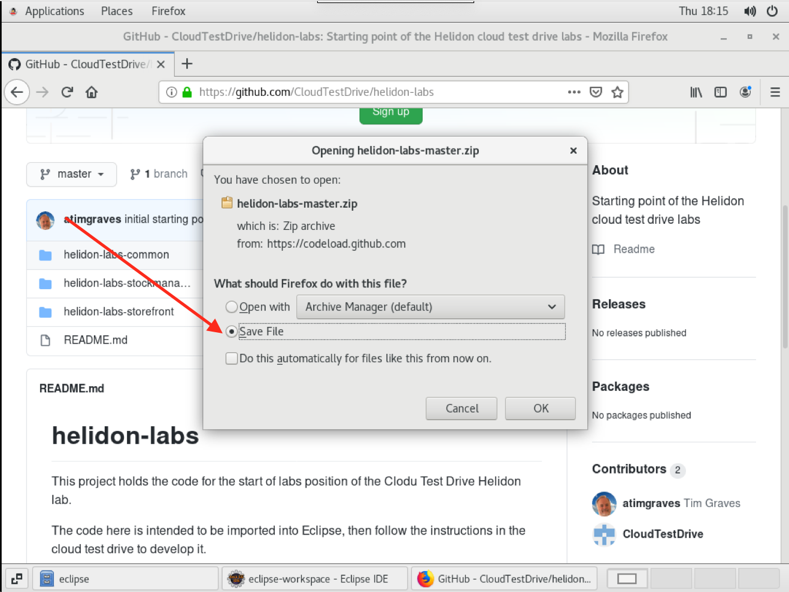
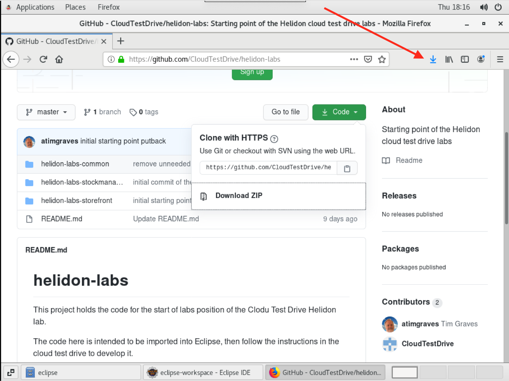
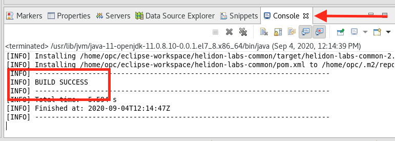

[Go to Overview Page](../README.md)


# Migration of Monolith to Cloud Native

## 1. Configuring the VM hosts file.

To make it easier to switch to the Kubernetes environment we are using hostnames rather than P addresses to locate the various services.

The cloud-native-support project you downloaded during the initial setup has a script that will do this for you.

- Click right on the Virtual Machine desktop and chose the `Open Terminal` option


In the terminal switch to the script directory

- `cd $HOME/workspace/cloud-native-setup/scripts/helidon-basics`

run the script to update the hosts file for us

- `bash add-helidon-basics-hosts.sh`

```
Testing if zipkin is in /etc/hosts
Updating hosts file to add zipkin as localhost aliases
Added zipkin to /etc/hosts
Testing if stockmanager is in /etc/hosts
Updating hosts file to add stockmanager as localhost aliases
Added stockmanager to /etc/hosts
Testing if storefront is in /etc/hosts
Updating hosts file to add storefront as localhost aliases
Added storefront to /etc/hosts
```

The script will update the host file, Note that in some versions of the VM these entries already exist, in which case the script will just confirm they are there.

- Close the terminal using the `x` on the windows upper right corner.

Please **do not** run any other scripts you may find in these directories until instructed to do so, or you may end up with your environment in an unexpected state !

## 2. Importing our template code

### 2a. Downloading the code zip file.

- Open the Firefox web browser in the virtual machine - Click `Applications` then `Internet` then `Firefox`


- Go to the URL `https://github.com/CloudTestDrive/helidon-labs` - Do this in the browser **in the virtual machine**

- Click the `Code` button


- Click the `Download ZIP` option


A save options menu may be displayed

- Click the `Save file` option, then `OK`



When the download is complete the Firefox download icon will turn completely blue



### 2b. Importing the downloaded zip file

- Switch back to Eclipse

- Click the `File` menu, then `Import`


- Open the `General` node, then chose the `Existing projects into Workspace` option. Click `Next`


- Chose the `Select archive file` radio button, then click `Browse` on that row


- On the left menu chose `Downloads` then in the resulting list chose the download you just made - it should be called `helidon-labs-master.zip` Note that though the image here only shows a single file in your VM there may be other files depending on which other steps you have already done.

- Click the `Open` button


- Click `Select All` to make sure all the projects are imported, then click the `Finish` button


Eclipse will import the projects and start importing the Maven dependencies. Note that depending on the steps yu have already taken you may see other projects in the projects list.


This may take a few mins. **Do not worry if you see errors during this process** (usually indicated by a white cross in a red box.) These are to be expected as Eclipse imports the code, then updates the Maven configuration and other elements. Once the building indicator (lower right) has gone away the errors should have gone. Expect to see yellow warnign triangles though - these are telling about unused code that we will be completing during the lab modules.

### 2c. Building the helidon-labs-common project

The `helidon-labs-common` project contains classes that are used by both the storefront and stockmanager projects. We need to build that project to the Maven repository so it can be used later on.

- Click right on the `helidon-labs-common` project, then chose the `Run as` menu option, then `Maven install`


Eclipse will use Maven to build and install the project. The progress will be shown in the `Console` tab, and you'll be able to see the `Build Success` message when it finishes (usually after 5 - 10 seconds, but it may take longer.)



## 3. Configuring to use the Wallet file

The Wallet file will have been downloaded to $HOME/Downloads, we want to place it in the right location for the labs and with the right name. It is **very** important that you follow the exact instructions below to ensure you are in the right directory as otherwise you may delete the lab files !

You need to open a terminal window in the Development VM

- Click **right** on the red background of the desktop in the development VM (you may need to shrink or move other windows to get this.

- In the popup menu chose `Open Terminal`


- Delete any existing wallet information
  - `rm -rf $HOME/workspace/helidon-labs-stockmanager/Wallet_ATP`

- Create a new wallet directory
  - `mkdir -p $HOME/workspace/helidon-labs-stockmanager/Wallet_ATP`

- Navigate to the stock manager folder
  - `cd $HOME/workspace/helidon-labs-stockmanager/Wallet_ATP`

- Move the downloaded wallet file from the downloads to the folder
  - `cp $HOME/Downloads/Wallet_*.zip .`

- Unpack the wallet 
  - `unzip Wallet_*.zip`

We now need to locate the wallet connection details.

- Look at the contents of the tnsnames.ora file to get the database connection name

  - `cat tnsnames.ora`

  ```
  tg_high = (description= (retry_count=20)(retry_delay=3)(address=(protocol=tcps)(port=1522)(host=adb.eu-frankfurt-1.oraclecloud.com))(connect_data=(service_name=cgipkrq1hwcdlkv_tg_high.atp.oraclecloud.com))(security=(ssl_ser
  ver_cert_dn="CN=adwc.eucom-central-1.oraclecloud.com,OU=Oracle BMCS FRANKFURT,O=Oracle Corporation,L=Redwood City,ST=California,C=US")))
  
  tg_low = (description= (retry_count=20)(retry_delay=3)(address=(protocol=tcps)(port=1522)(host=adb.eu-frankfurt-1.oraclecloud.com))(connect_data=(service_name=cgipkrq1hwcdlkv_tg_low.atp.oraclecloud.com))(security=(ssl_serve
  r_cert_dn="CN=adwc.eucom-central-1.oraclecloud.com,OU=Oracle BMCS FRANKFURT,O=Oracle Corporation,L=Redwood City,ST=California,C=US")))
  
  tg_medium = (description= (retry_count=20)(retry_delay=3)(address=(protocol=tcps)(port=1522)(host=adb.eu-frankfurt-1.oraclecloud.com))(connect_data=(service_name=cgipkrq1hwcdlkv_tg_medium.atp.oraclecloud.com))(security=(ssl
  _server_cert_dn="CN=adwc.eucom-central-1.oraclecloud.com,OU=Oracle BMCS FRANKFURT,O=Oracle Corporation,L=Redwood City,ST=California,C=US")))
  
  tg_tp = (description= (retry_count=20)(retry_delay=3)(address=(protocol=tcps)(port=1522)(host=adb.eu-frankfurt-1.oraclecloud.com))(connect_data=(service_name=cgipkrq1hwcdlkv_tg_tp.atp.oraclecloud.com))(security=(ssl_server_
  cert_dn="CN=adwc.eucom-central-1.oraclecloud.com,OU=Oracle BMCS FRANKFURT,O=Oracle Corporation,L=Redwood City,ST=California,C=US")))
  
  tg_tpurgent = (description= (retry_count=20)(retry_delay=3)(address=(protocol=tcps)(port=1522)(host=adb.eu-frankfurt-1.oraclecloud.com))(connect_data=(service_name=cgipkrq1hwcdlkv_tg_tpurgent.atp.oraclecloud.com))(security=
  (ssl_server_cert_dn="CN=adwc.eucom-central-1.oraclecloud.com,OU=Oracle BMCS FRANKFURT,O=Oracle Corporation,L=Redwood City,ST=California,C=US")))
  ```

- Locate the "high" connection and take a note of the name, in the example above this is tg_high **Your file will contain different names**

- Be sure to write down the database connection name you have just found, you will need it later


## End of the setup

Congratulations, you have successfully setup your VM with the template code. 

Hit the **Back** button of your browser to return to the top level of the helidon labs and start working through the labs !


------

[Go to Overview Page](../README.md)
