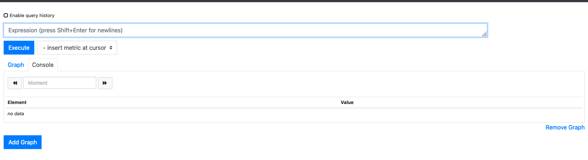
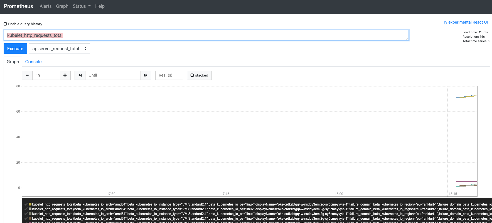
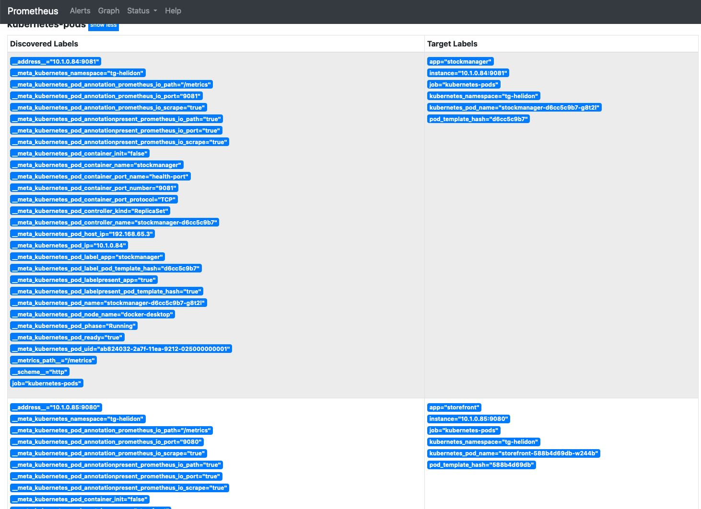
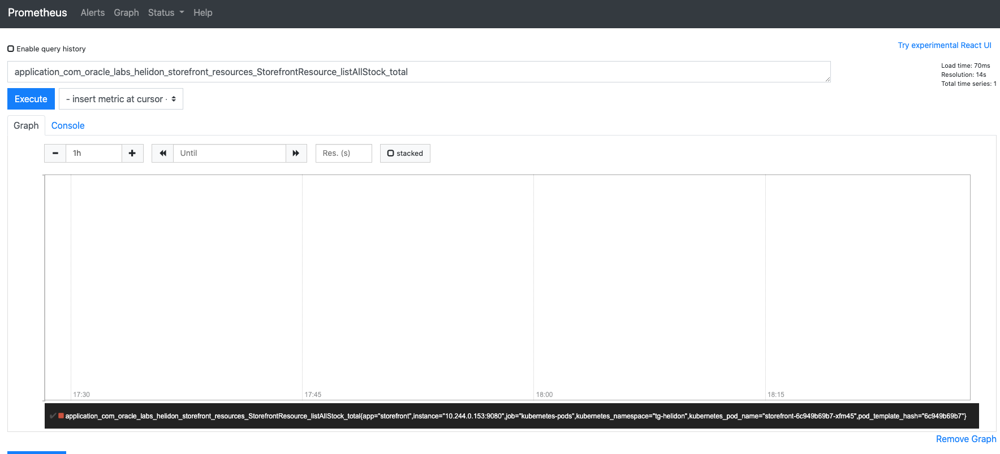

[Go to Overview Page](../Kubernetes-labs.md)


# Migration of Monolith to Cloud Native

## C. Deploying to Kubernetes
## Optional 1a. Monitoring with Prometheus

<details><summary><b>Self guided student - video introduction</b></summary>
<p>

This video is an introduction to the Monitoring microservcies with Prometheus lab. Once you've watched it please press the "Back" button on your browser to return to the labs.

[](https://youtu.be/qnDzZ2eOy0E "Gathering metrics with Prometheus lab introduction video")

</p>
</details>

---

### **Introduction**

Monitoring a service in Kubernetes involves three components

**1. Generating the monitoring data**
This is mostly done by the service itself, the metrics capability we created when building the Helidon labs are an example of this.

Core Kubernetes services may also provide the ability to generate data, for example the Kubernetes DNS service can report on how many lookups it's performed.

**2. Capturing the data**
Just because the data is available something needs to extract it from the services, and store it. 

**3. Processing and Visualizing the data**
Once you have the data you need to be able to process it to visualize it and also report any alerts of problems.


### Monitoring and visualization software
For this lab we are going to use a very simple monitoring, using the metrics in our microservices and the standard capabilities in the Kubernetes core services to generate data.  Then we'll use the Prometheus to extract the data and Grafana to display it.

These tools are of course not the only ones, but they are very widely used, and are available as Open Source projects.

#### Namespace for the monitoring and visualization software
To separate the monitoring services from the  other services we're going to put them into a new namespace. 

- Type the following to create the namespace:
  -  `kubectl create namespace monitoring`

      ```
      namespace/monitoring created
      ```


### Prometheus

<details><summary><b>Older versions of Kubernetes than 1.17.9</b></summary>
<p>
We assume you are using Kubernetes 1.17.9 (the most recent version supported by the Oracle Kubernetes Environment at the time of writing these instructions) in which case the version of the prometheus helm charts (11.12.1 at the time of writing) were found to work. If you were using an older version of Kubernetes you may need to specify a particular version of the helm chart as follows :

Kubernetes 1.16.9 Promteheus helm chart 11.6.8 worked for us

Kubernetes 1.15.7 Prometheus helm chart 9.7.4 worked for us

Kubernetes 1.14.8 Prometheus helm chart 9.7.1 worked for us

To specify a specific older version use the version keyword in your help command, e.g. `--version 9.1.0`

</p></details>

\---

Installing Prometheus is simple, we just use helm.

- In the OCI Cloud Shell type
  -  `helm install prometheus stable/prometheus --namespace monitoring --set server.service.type=LoadBalancer --version 11.12.1`
  

```
NAME: prometheus
LAST DEPLOYED: Wed Jul  1 18:18:10 2020
NAMESPACE: monitoring
STATUS: deployed
REVISION: 1
TEST SUITE: None
NOTES:
The Prometheus server can be accessed via port 80 on the following DNS name from within your cluster:
prometheus-server.monitoring.svc.cluster.local


Get the Prometheus server URL by running these commands in the same shell:
  NOTE: It may take a few minutes for the LoadBalancer IP to be available.
        You can watch the status of by running 'kubectl get svc --namespace monitoring -w prometheus-server'

  export SERVICE_IP=$(kubectl get svc --namespace monitoring prometheus-server -o jsonpath='{.status.loadBalancer.ingress[0].ip}')
  echo http://$SERVICE_IP:80


The Prometheus alertmanager can be accessed via port 80 on the following DNS name from within your cluster:
prometheus-alertmanager.monitoring.svc.cluster.local


Get the Alertmanager URL by running these commands in the same shell:
  export POD_NAME=$(kubectl get pods --namespace monitoring -l "app=prometheus,component=alertmanager" -o jsonpath="{.items[0].metadata.name}")
  kubectl --namespace monitoring port-forward $POD_NAME 9093
#################################################################################
######   WARNING: Pod Security Policy has been moved to a global property.  #####
######            use .Values.podSecurityPolicy.enabled with pod-based      #####
######            annotations                                               #####
######            (e.g. .Values.nodeExporter.podSecurityPolicy.annotations) #####
#################################################################################


The Prometheus PushGateway can be accessed via port 9091 on the following DNS name from within your cluster:
prometheus-pushgateway.monitoring.svc.cluster.local


Get the PushGateway URL by running these commands in the same shell:
  export POD_NAME=$(kubectl get pods --namespace monitoring -l "app=prometheus,component=pushgateway" -o jsonpath="{.items[0].metadata.name}")
  kubectl --namespace monitoring port-forward $POD_NAME 9091

For more information on running Prometheus, visit:
https://prometheus.io/
```

Note the name given to the Prometheus server within the cluster, in this case `prometheus-server.monitoring.svc.cluster.local`  and also the alert manager's asigned name, in this case `prometheus-alertmanager.monitoring.svc.cluster.local`

The Helm chart will automatically create a couple of small persistent volumes to hold the data it captures. If you want to see more on the volume in the dashboard (namespace monitoring) look at the Config and storage section / Persistent volume claims section, chose the prometheus-server link to get more details, then to locate the volume in the storage click on the Volume link in the details section) Alternatively in the Workloads / Pods section click on the prometheus server pod and scroll down to see the persistent volumes assigned to it.

For the purposes of the lab we've set this up using a load balancer, but Prometheus itself does not provide any login or authentication mechanism to access the UI. Because of this in production you would not expose it without security measures to the public internet using an Ingress or load balancer (neither of which apply authentication rules, but delegate that to the underlying services.) 

When we used Helm we asked it to setup a load balancer for us on the service, we just need to get the IP address

- Run this command
  - `kubectl get services -n monitoring`

```
NAME                            TYPE           CLUSTER-IP      EXTERNAL-IP       PORT(S)        AGE
prometheus-alertmanager         ClusterIP      10.96.92.158    <none>            80/TCP         2m43s
prometheus-kube-state-metrics   ClusterIP      10.96.43.62     <none>            8080/TCP       2m43s
prometheus-node-exporter        ClusterIP      None            <none>            9100/TCP       2m43s
prometheus-pushgateway          ClusterIP      10.96.16.206    <none>            9091/TCP       2m42s
prometheus-server               LoadBalancer   10.96.216.217   132.145.227.187   80:30280/TCP   2m43s
```

On the `prometheus-server` line you can see the external IP address the load balancer has allocated. In this case it's 132.145.227.187, but of course that will differ in your environment.

If the external IP is <pending> then Kubernetes is still starting the Prometheus environment. Wait a short while (a few mins) and try again.

Let's go to the service web page
  - In your web browser open up (replace <Ip address> with the IP you got **for the prometheus server**)
    - `http://<prometheus ip address>/graph`
 
You'll see the Initial prometheus graph page as below.



Let's check that Prometheus is scraping some data. 

- Click the "Insert Metric At Cursor" button
  - you will see a *lot* of possible choices exploring the various servcies built into Kubernetes (Including apiserver, Core DNS, Container stats, the number of various kubernetes objects like secrets, pods, configmaps and so on.)

- In the dropdown select `kubelet_http_requests_total`  
- Click the **Execute** button. 

Alternatively rather than selecting from the list you can just start to type `kubelet_http_requests_total` into the Expression box, as you type a drop down will appear showing the possible metrics that match your typing so far, once the list of choices is small enough to see it chose `kubelet_http_requests_total` from the list (or just finish typing the entire name and press return to select it) 

You will be presented with either console text data


or a graph


- Click the "Graph" or "Console" buttons to switch between them

The Kubelet is the code that runs in the worker nodes to perform management actions like starting pods and the like, we can therefore be reasonably confident it'll be available to select.

Note that the precise details shown will of course vary, especially if you've only recently started Prometheus.

- Click the + and - buttons next to the duration (default is 1 hour) to expand or shrink the time window of the data displayed
- Use the << and >> buttons to move the time window around within the overall data set (of course these may not be much use if you haven't got much data, but have a play if you like)

### Specifying services to scrape
The problem we have is that (currently) Prometheus is not collecting any data from our services. Of course we may find info on the clusters behavior interesting, but our own services would be more interesting !

We can see what services Prometheus is currently scraping :

- Click on the Status menu (top of the screen) :


- Then select Service Discovery


- Click on the "Show More" button next to the Kubernetes-pods line (this is the 2nd reference to kubernetes pods, the 1st is just a link that takes you to the 2nd one it it's not on the screen)

You will be presented with a list of all of the pods in the system and the information that Prometheus has gathered about them (it does this by making api calls to the api server in the same way kubectl does)


- Scroll down to find the entries for the storefront and stockmanager pods. 

If the pod is exposing multiple ports there may be multiple entries for the same pod as Prometheus is checking every port it can to see if there are metrics available.  The image below shows the entries for the storefront on ports 8080 and 9080:


We know that Prometheus can see our pods, the question is how do we get it to scrape data from them ?

The answer is actually very simple. In the same way that we used annotations on the Ingress rules to let the Ingress controller know to scan them we use annotations on the pod descriptions to let Prometheus know to to scrape them (and how to do so)

We can use kubectl to get the pod id, using a label selector to get pods with a label **app** and a value **storefront**, then we're using jsonpath to get the specific details from the JSON output here
don't actually do this, this is just to show how you could modify a live pod with kubectl

Example only:

```
$ kubectl get pods -l "app=storefront" -o jsonpath="{.items[0].metadata.name}"
storefront-588b4d69db-w244b
```

Now we could use kubectl to add a few annotations to the pod (this is applied immediately, and Prometheus will pick up on it in a few seconds)

Example only:

```
$ kubectl annotate pod storefront-588b4d69db-w244b prometheus.io/scrape=true --overwrite
pod/storefront-588b4d69db-w244b annotated
$ kubectl annotate pod storefront-588b4d69db-w244b prometheus.io/path=/metrics --overwrite
pod/storefront-588b4d69db-w244b annotated
$ kubectl annotate pod storefront-588b4d69db-w244b prometheus.io/port=9080 --overwrite
pod/storefront-588b4d69db-w244b annotated
```

We can see what annotations there would be on the pod with kubectl (this works even if you setup the annotations using the deployment yaml file.)

Example only:

```
$  kubectl get pod storefront-588b4d69db-w244b -o jsonpath="{.metadata..annotations}"
map[prometheus.io/path:/metrics prometheus.io/port:9080 prometheus.io/scrape:true]
```

***However***
In most cases we don't want these to be a temporary change, we want the Prometheus to monitor our pods if they restart (or we re-deploy)

- Navigate to the helidon-kubernetes folder 
- Edit the file **storefront-deployment.yaml**
- Locate the pod annotations (part of the spec / template / metadata section) which are currently commented out :

```
   metadata:
      labels:
        app: storefront
#      annotations:
#        prometheus.io/path: /metrics
#        prometheus.io/port: "9080"
#        prometheus.io/scrape: "true"
    spec:
      containers:
      - name: storefront
```

- Remove the comment symbol (the #) in front of the annotations so the section now looks like

```
   metadata:
      labels:
        app: storefront
      annotations:
        prometheus.io/path: /metrics
        prometheus.io/port: "9080"
        prometheus.io/scrape: "true"
    spec:
      containers:
      - name: storefront
```
Be **very** careful to only remove the # character and **no other whitespace**.

- Save the changes in this file
- Edit the file **stockmanager-deployment.yaml** so it now has a pod annotations section that looks like 

```
 template:
    metadata:
      labels:
        app: stockmanager
      annotations:
        prometheus.io/path: /metrics
        prometheus.io/port: "9081"
        prometheus.io/scrape: "true"
    spec:
      containers:
      - name: stockmanager
```

- Now run the script **undeploy.sh** to remove the deployments
  -  `bash undeploy.sh`

``` 
Deleting storefront deployment
deployment.apps "storefront" deleted
Deleting stockmanager deployment
deployment.apps "stockmanager" deleted
Deleting zipkin deployment
deployment.apps "zipkin" deleted
Kubenetes config is
NAME                               READY   STATUS    RESTARTS   AGE
pod/stockmanager-bd44bbbb7-qk6g9   1/1     Running   0          8h
pod/storefront-564dd99db9-fzf8s    1/1     Running   0          8h
pod/zipkin-88c48d8b9-tjvcg         1/1     Running   0          8h

NAME                   TYPE        CLUSTER-IP       EXTERNAL-IP   PORT(S)             AGE
service/stockmanager   ClusterIP   10.100.156.12    <none>        8081/TCP,9081/TCP   8h
service/storefront     ClusterIP   10.110.88.187    <none>        8080/TCP,9080/TCP   8h
service/zipkin         ClusterIP   10.101.129.223   <none>        9411/TCP            8h

NAME                                     DESIRED   CURRENT   READY   AGE
replicaset.apps/stockmanager-bd44bbbb7   1         1         1       8h
replicaset.apps/storefront-564dd99db9    1         1         1       8h
replicaset.apps/zipkin-88c48d8b9         1         1         1       8h
```
This script just does a kubectl delete -f on each of the deployments. 

- Now recreate the deployments: 
  -  `bash deploy.sh `

```
Creating zipkin deployment
deployment.apps/zipkin created
Creating stockmanager deployment
deployment.apps/stockmanager created
Creating storefront deployment
deployment.apps/storefront created
Kubenetes config is
NAME                               READY   STATUS              RESTARTS   AGE
pod/stockmanager-d6cc5c9b7-f9dnf   0/1     ContainerCreating   0          1s
pod/storefront-588b4d69db-vnxgg    0/1     ContainerCreating   0          1s
pod/zipkin-88c48d8b9-x8b6t         0/1     ContainerCreating   0          1s

NAME                   TYPE        CLUSTER-IP       EXTERNAL-IP   PORT(S)             AGE
service/stockmanager   ClusterIP   10.100.156.12    <none>        8081/TCP,9081/TCP   8h
service/storefront     ClusterIP   10.110.88.187    <none>        8080/TCP,9080/TCP   8h
service/zipkin         ClusterIP   10.101.129.223   <none>        9411/TCP            8h

NAME                           READY   UP-TO-DATE   AVAILABLE   AGE
deployment.apps/stockmanager   0/1     1            0           1s
deployment.apps/storefront     0/1     1            0           1s
deployment.apps/zipkin         0/1     1            0           1s

NAME                                     DESIRED   CURRENT   READY   AGE
replicaset.apps/stockmanager-d6cc5c9b7   1         1         0       1s
replicaset.apps/storefront-588b4d69db    1         1         0       1s
replicaset.apps/zipkin-88c48d8b9         1         1         0       1s
```

This script just does a kubectl apply -f on each of the deployments. 

If we use kubectl to get the status after a short while (the pods may have to wait for their readiness probes to be operational) we'll see everything is working as expected and the pods are Running

- View status: `kubectl get all`

```
NAME                               READY   STATUS    RESTARTS   AGE
pod/stockmanager-d6cc5c9b7-f9dnf   1/1     Running   0          79s
pod/storefront-588b4d69db-vnxgg    1/1     Running   0          79s
pod/zipkin-88c48d8b9-x8b6t         1/1     Running   0          79s

NAME                   TYPE        CLUSTER-IP       EXTERNAL-IP   PORT(S)             AGE
service/stockmanager   ClusterIP   10.100.156.12    <none>        8081/TCP,9081/TCP   8h
service/storefront     ClusterIP   10.110.88.187    <none>        8080/TCP,9080/TCP   8h
service/zipkin         ClusterIP   10.101.129.223   <none>        9411/TCP            8h

NAME                           READY   UP-TO-DATE   AVAILABLE   AGE
deployment.apps/stockmanager   1/1     1            1           79s
deployment.apps/storefront     1/1     1            1           79s
deployment.apps/zipkin         1/1     1            1           79s

NAME                                     DESIRED   CURRENT   READY   AGE
replicaset.apps/stockmanager-d6cc5c9b7   1         1         1       79s
replicaset.apps/storefront-588b4d69db    1         1         1       79s
replicaset.apps/zipkin-88c48d8b9         1         1         1       79s
```

Note we are doing an undeploy and deploy to ensure we have a known state. If we'd just re-done the deploy only, Kubernetes would have acted like it was an upgrade of the deployments and we'd have seen pods terminating, while new ones were being created and additional replica sets. We saw how this actually works in the rolling upgrade lab.

- Return to the browser and reload the Prometheus page

You will see that there are 2 pods showing as being discovered, previously it was 0


- Click on the **show more** button next to the kubernetes-pods label

You can see that the storefront pod (port 9080) and stockmanager (port 9081) pods are no longer being dropped and there is now data in the target labels column. The actual data services for storefont (port 8080) and stockmanager (port 8081) are however still dropped.



### Let's look at our captured data
Now we have configured Prometheus to scrape the data from our services we can look at the data it's been capturing.

- Return to the Graph page in the Prometheus web page
- Click on the Graph button at the top of the page.

- In the Expression box use the auto complete function by typing the start of `application_com_oracle_labs_helidon_storefront_resources_StorefrontResource_listAllStock_total` or select it from the list under the **Insert metric at cursor** button.

- Click the Execute button.

If you're on the graph screen you'll probabaly see a pretty boring graph



- Look at the **console view** to see a bit more information:


If we look at the data we can see that the retrieved value is 0 (it may be another number, depends on how often you made the call to list the stock in previous labs) of course our graph looks boring, since we setup prometheus we haven't actually done anything)

Let's make a few calls to list the stock and see what we get

- Execute the following command a few times, **replacing <external IP> with your Ingress endpoint (not the prometheus IP):**
  -  `curl -i -k -X GET -u jack:password https://<external IP>/store/stocklevel`

```
HTTP/2 200 
server: nginx/1.17.8
date: Fri, 27 Mar 2020 10:05:52 GMT
content-type: application/json
content-length: 220
strict-transport-security: max-age=15724800; includeSubDomains

[{"itemCount":4980,"itemName":"rivet"},{"itemCount":4,"itemName":"chair"},{"itemCount":981,"itemName":"door"},{"itemCount":25,"itemName":"window"},{"itemCount":20,"itemName":"handle"}]
```

- Go back to the Prometheus browser window
- Reload the page and make sure you're on the console tab

We see that our changes have been applied.  Note it may take up to 60 seconds for Prometheus to get round to scraping the metrics form the service, it doesn't do it continuously as that may put a significant load on the services it's monitoring.

In the console we can see the number of requests we have made


And in the Graph we can see the data history


In this case you can see a set of 9 requests, you may of course have done a different number, or had a break between requests, so what you see will vary.

When we did the Helidon labs we actually setup the metrics on the call to list stock to not just generate an absolute count of calls, but to also calculate how man calls were begin made over a time interval. 

Make a few more curl requests to ensure we have some data groupings, take a short break and then make a few more.

- Change the metric from `application_com_oracle_labs_helidon_storefront_resources_StorefrontResource_listAllStock_total` to `application_listAllStockMeter_one_min_rate_per_second`

We can see the number of calls to list all stock per second averaged over 1 min. This basically provides us with a view of the number of calls made to the system over time, and we can use it to identify peak loads.


Prometheus can also produce multi value graphs. For example in addition to the counting metrics we also setup a timer on the listAllStock method to see how long calls to it took. If we now generate a graph on the timer we see in the Console view that instead of just seeing a single entry representing the latest data, that there are actually 6 entries representing different breakdowns of the data (0.5 being the most common data, 0.999 being the least common) Of course the data you see may vary depending on your situation and how much you've already been using the services.

- Change the metrif to `application_com_oracle_labs_helidon_storefront_resources_StorefrontResource_listAllStockTimer_seconds`


We can see that 50% of the requests are within 0.12 seconds, and 99.9% are within 0.47 seconds.

The graph is also a lot more interesting, especially if we enabled the stacked mode


It's not possible to show in a static window but as you move your mouse over the legend the selected data is highlighted, and if you click on a line in the legend only that data is displayed.

Prometheus has a number of mathematical functions we can apply to the graphs it produces, these are perhaps not so much use if there's only a single pod servicing requests, but if there are multiple pods all generating the same statistics (perhaps because of a replica set providing multiple pods to a service for horizontal scaling) then when you gather information such as call rates (the  `application_listAllStockMeter_one_min_rate_per_second` metric) instead of just generating and displaying the data per pod you could also generate data such as `sum(application_listAllStockMeter_one_min_rate_per_second)` which would tell you the total number of requests across ***all*** the pods providing the service.

It's also possible to do things like separate out pods that are being used for testing (say they have a deployment type of test rather than production) or many other parameters. If you want more details there is a link to the Prometheus Query language description in the further-information document

### But it's not a very good visualization
Prometheus was not designed to be a high end graphing tool, the graphs cannot for instance be saved so you can get back to them later. For that we need to move on to the next lab and have a look at the capabilities of Grafana

---

## Tidying up the environment

If you are going to do the [Visualizing with Gafana module](VisualizingWithGrafanaLab.md) please do **not** do the following, but [click here](VisualizingWithGrafanaLab.md) or click the back button on your browser to return to the main [Kubernetes labs document.](../Kubernetes-labs.md) 

** ONLY** do the following if you no longer want the Prometheus environment. **DO NOT** do this if you are planning on running the Visualising with Grafana module.

If you are in a trial tenancy there are limitations on how many Load Balancers and other resources you can have in use at any time, and you may need them for other modules. The simplest way to release the resources used in his module (including the load balancer) is to delete the entire namespace.

To delete the monitoring namespace **Only do this if you want to delete the entire monitoring environment and will not be doing the Visualising with Grafana module** 

Do the following

- In the OCI Cloud shell type 
  - `kubectl delete namespace monitoring`
  
```
namespace "monitoring" deleted
```

---

You have reached the end of this lab !!

Use your **back** button to return to the **C. Deploying to Kubernetes** section