[Go to Overview Page](../Kubernetes-labs.md)


# Migration of Monolith to Cloud Native

## C. Deploying to Kubernetes
## Optional 1b. Visualizing using Grafana


<details><summary><b>Self guided student - video introduction</b></summary>
<p>

This video is an introduction to the Visualizing metrics with Grafana lab. Once you've watched it please press the "Back" button on your browser to return to the labs.

[](https://youtu.be/upAhbUQ0K7s "Visualizing metrics with Grafana lab introduction video")

</p>
</details>

---

### **Introduction**

If you are going to do this lab module you must have completed the [**Monitoring with Prometheus** module](MonitoringWithPrometheusLab.md)

As we've seen while Prometheus can gather lots of data, it is not exactly the most powerful visualization mechanism.

Grafana on the other hand is a very powerful open source visualization engine and it can take data from many sources, including Prometheus.  The core engine of Grafana is Open source.  However some of the additional component features (for example specific dashboard configurations, plugins for graph types etc.) are not open source and are chargeable.

For this lab we will use a small subset of the open source features only.

### Installing Grafana
Like many other Kubernetes services Grafana can be installed using helm. By default the helm chart does not create a volume for the storage of the grafana configuration. This would be a problem in a production environment, so we're going to use the persistent storage option defined inthe helm chart for Grafana to create a storage volume. 

- Create the Helm repository entry for Grafana
  - `helm repo add bitnami https://charts.bitnami.com/bitnami`

```
"bitnami" has been added to your repositories
```

- Update the repository cache
  - `helm repo update`

```
Hang tight while we grab the latest from your chart repositories...
...Successfully got an update from the "kubernetes-dashboard" chart repository
...Successfully got an update from the "bitnami" chart repository
...Successfully got an update from the "stable" chart repository
Update Complete. ⎈ Happy Helming!⎈ 
```
  
- In the OCI Cloud Shell type following command:
  - `helm install grafana  bitnami/grafana --version 3.4.3 --namespace  monitoring  --set persistence.enabled=true --set service.type=LoadBalancer`

```
NAME: grafana
LAST DEPLOYED: Mon Oct  5 14:28:49 2020
NAMESPACE: monitoring
STATUS: deployed
REVISION: 1
TEST SUITE: None
NOTES:
** Please be patient while the chart is being deployed **

1. Get the application URL by running these commands:
     NOTE: It may take a few minutes for the LoadBalancer IP to be available.
           You can watch the status of by running 'kubectl get --namespace monitoring svc -w grafana'
    export SERVICE_IP=$(kubectl get svc --namespace monitoring grafana -o jsonpath='{.status.loadBalancer.ingress[0].ip}')
    echo http://$SERVICE_IP:3000

2. Get the admin credentials:

    echo "User: admin"
    echo "Password: $(kubectl get secret grafana-admin --namespace monitoring -o jsonpath="{.data.GF_SECURITY_ADMIN_PASSWORD}" | base64 --decode)"
```
  -  `helm install grafana --namespace monitoring stable/grafana --set persistence.enabled=true --set service.type=LoadBalancer --version 5.0.26`

Note that normally you would not expose Grafana directly, but would use a ingress or other front end. However to do that requires setting up a reverse proxy with DNS names and getting security certificates, which can take time. Of course you'd do that in production, but for this lab we want to focus on the core Kubernetes learning stream, so we're taking the easier approach of just creating a load balancer.
 
```

NAME: grafana
LAST DEPLOYED: Tue Dec 31 11:59:27 2019
NAMESPACE: monitoring
STATUS: deployed
REVISION: 1
NOTES:
1. Get your 'admin' user password by running:

   kubectl get secret --namespace monitoring grafana -o jsonpath="{.data.admin-password}" | base64 --decode ; echo

2. The Grafana server can be accessed via port 80 on the following DNS name from within your cluster:

   grafana.monitoring.svc.cluster.local

   Get the Grafana URL to visit by running these commands in the same shell:

     export POD_NAME=$(kubectl get pods --namespace monitoring -l "app=grafana,release=grafana" -o jsonpath="{.items[0].metadata.name}")
     kubectl --namespace monitoring port-forward $POD_NAME 3000

3. Login with the password from step 1 and the username: admin
```

Like many helm charts the output has some useful hints in it, specifically in this case how to get the admin password and setup port-forwarding using Kubectl.

- Now get the login password. In a window type :
  - `kubectl get secret grafana-admin --namespace monitoring -o jsonpath="{.data.GF_SECURITY_ADMIN_PASSWORD}" | base64 --decode`
  
```
OFR3aOHBVj
```

Of course **your** password will vary
  -  `kubectl get secret --namespace monitoring grafana -o jsonpath="{.data.admin-password}" | base64 --decode ; echo`

```
wzuiF89rmm2g671fdAkeyZ7GxGrpK71rdCD6YxBd
```

- **Copy and paste** the password into a text editor so you can use it later.

We need some data to look at, so :

- Make a few requests using curl to generate some new data (replace <external IP> with that of the ingress controller you were using earlier)
  -  `curl -i -k -X GET -u jack:password https://<external IP>/store/stocklevel`

We need to open a web page to the Grafana service. To do that we need to get the IP address of the load balancer.

- Run the following command (here we are limiting to just the grafana service)
  - `kubectl get service grafana -n monitoring`

```
NAME      TYPE           CLUSTER-IP      EXTERNAL-IP      PORT(S)        AGE
grafana   LoadBalancer   10.96.161.234   130.61.205.103   80:32261/TCP   4m57s
```
Note the External IP address (130.61.201.103 in this case)

If the external IP address says <pending> then Kubernetes hasn't finished starting the service. wait a short while and run the command again.

- Open a web page (replace `<external IP>`) with the one you just got for the grafana service.
  - `http://<external ip>:3000`
  
I have found that for some versions of Firefox that grafana complains about reverse-proxy settings. You may find that you need to use chrome or safari to access the grafana page.

- If the browser prompts you about using a self signed certificate accept it.
  - In Safari you will be presented with a page saying "This Connection Is Not Private" Click the "Show details" button, then you will see a link titled `visit this website` click that, then click the `Visit Website` button on the confirmation pop-up. To update the security settings you may need to enter a password, use Touch ID or confirm using your Apple Watch.
  - In Firefox once the security risk page is displayed click on the "Advanced" button, then on the "Accept Risk and Continue" button
  - In Chrome once the "Your connection is not private" page is displayed click the advanced button, then you may see a link titled `Proceed to ....(unsafe)` click that. 
  
We have had reports that some versions of Chrome will not allow you to override the page like this, for Chrome 83 at least one solution is to click in the browser window and type the words `thisisunsafe` (copy and past doesn't seem to work, you need to actually type it.) Alternatively use a different browser.


You'll be presented with the Grafana login window


- Enter **admin** as the user name and then use the Grafana password you copied a few moments ago. 
- Press enter to login and go to the Grafana initial config page


Before we can do anything useful with Grafana we need to provide it with some data. 

- Click the **Add Your First Data Source** icon to start this process


- Select **Prometheus**  from the list, then when the UI displays it click the `Select` button


In the URL field we need to enter the details we got then we installed prometheus. 

- Enter the URL :
  -  `http://prometheus-server.monitoring.svc.cluster.local`

- Leave the other values unchanged

- Scroll down and click the **Save & Test** button at the bottom of the screen. 


- Click the grafana logo  at the top left to return to the Grafana home page


We now need to configure a dashboard that will display data for us.

- Click the **Create your first dashboard** button to start the process


- In the new Panel click the **Add new panel** button to define the data we want to retrieve


- In the Metrics dropdown select `application`, then `application_listAllStockMeter_one_min_rate_per_second` (The list is ordered, so it will probably be a way down)

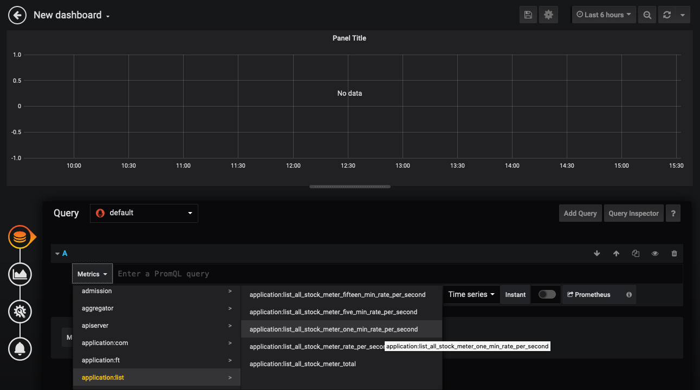

You may recall that this it the data set for the number of list stock requests made per second averaged over a minute.

Once you've selected it then the display will update with the graph you've selected


If you don't have any data displayed then make a few requests 

- If needed use curl to generate some new data (replace <external IP> with that of the ingress controller you were using earlier)
  -  `curl -i -k -X GET -u jack:password https://<external IP>/store/stocklevel`

You can refresh the graph using the refresh icon if you added some new data

- Click the time drop down and chose a time period where you have data


Once you've clicked the time the graph will update

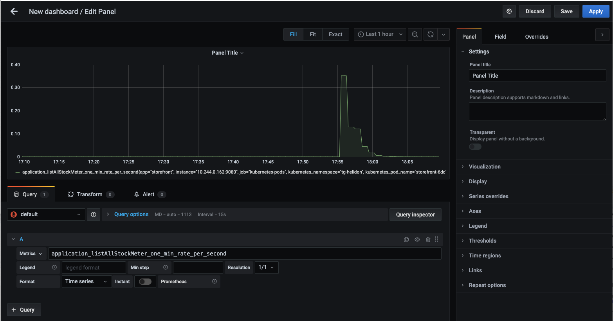


You may see multiple pods listed in the legend (above one as a green line in the chart, the other as orange.) Do not worry of you can only see one, it depends on the exact flow and timing of the labs which will vary between participants.

Grafana allows us to combine the data using the Prometheus query language, by using the ***SUM*** function in the language to combine all of these.  If you only have one pod do the following anyway, just so see how to use functions)

- Click in the metrics box and change it to :
  - `sum(application_listAllStockMeter_one_min_rate_per_second)` 
  - then press return


Now any pod that provides the `application_listAllStockMeter_one_min_rate_per_second` data will be part of the total, giving us the total rate across all of the pods.

- Click the `Apply` button on the upper right.


- Make a few requests using curl to generate some new data (replace <external IP> with that of the ingress controller you were using earlier)
  -  `curl -i -k -X GET -u jack:password https://1<external IP/store/stocklevel`

```
HTTP/2 200 
server: nginx/1.17.8
date: Fri, 27 Mar 2020 10:06:39 GMT
content-type: application/json
content-length: 220
strict-transport-security: max-age=15724800; includeSubDomains

[{"itemCount":4980,"itemName":"rivet"},{"itemCount":4,"itemName":"chair"},{"itemCount":981,"itemName":"door"},{"itemCount":25,"itemName":"window"},{"itemCount":20,"itemName":"handle"}]
```

After a bit of time for Helidon to update it's metrics (this is an average over 1 min) Prometheus to get round to scraping them and for Grafana to get round to retrieving them click the refresh icon on the upper right 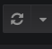 (We'll look at auto refresh in a bit.)


If it hasn't updated after a bit you can force the screen to update, click the refresh icon on the upper right  

This is only a visuals update, if the scraping hasn't retrieved the updated data then you'll just have to wait for it to happen.

Once we've defined the query then we can look at the way it's displayed. 

Let's go back and edit the visuals

- Click the `Panel Title` then chose `Edit`


On the right expand the Visualization section

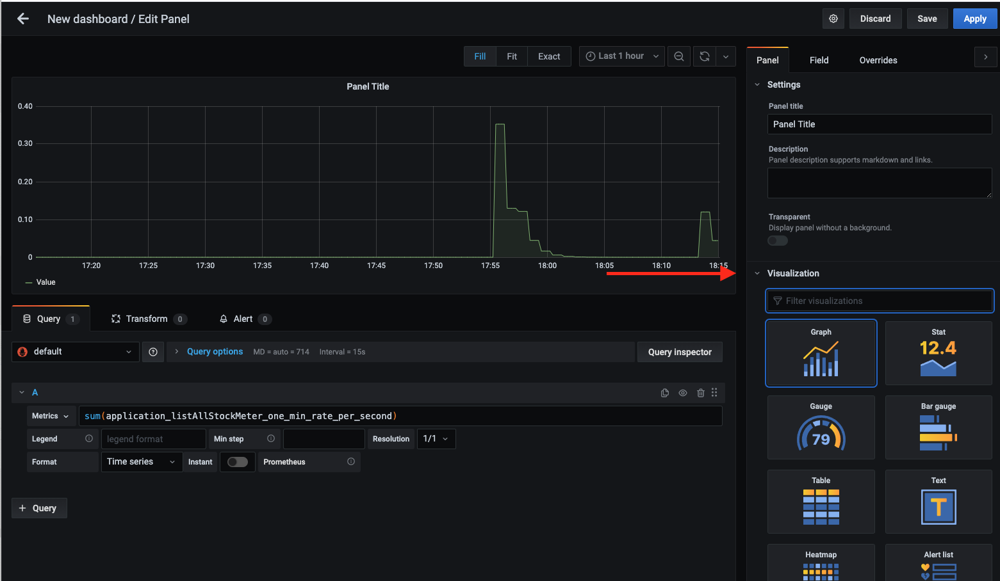

You can chose the visualization type you want

- Click the Graph icon next to the "Visualization" label  to see the selection appear in a grid. 

For now we're going to leave this as a Graph, but if you want try clicking on some of the other options to see what they display, not all data makes sense in all visualization types though.

For now (as there is only a single set of numeric data) we are going to leave this as a line graph, but we'll make it a little more interesting.

- Shrink the `Visualization` section and expand the `Display` section on the right


- In the Draw options make sure that Bars and Points are turned off and Lines is turned on. 

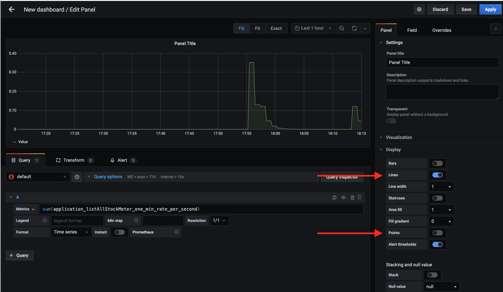

- In Mode options set Area Fill to 3, Fill Gradient to 10 and Line Width to 2.

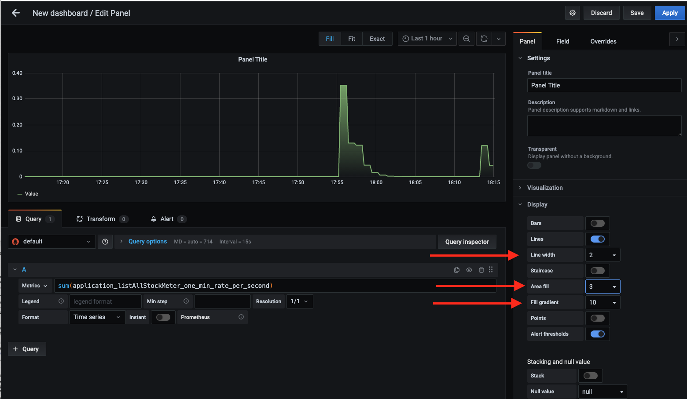

- Close the `Display` section of the right hand panel.

- Scroll to the top of the right hand panel.

- In the Panel Title field enter a suitable title, for example  `Stock Listing Requests per second`


- Click the `Apply` button at the top right to return to the New Dashboard

Now we see our dashboard with a graph panel


Of course this looks pretty basic, It's good to see how many requests we're getting, but let's add an additional panel to give us a history of how many requests we've had . 

- Click on the Add Panel icon on the upper right 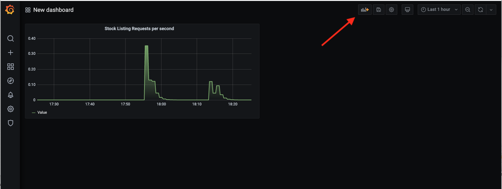 


- Click the `Add new panel` button

- In the metrics field, enter following (you can copy and paste if you wish)

  - `avg(application_com_oracle_labs_helidon_storefront_resources_StorefrontResource_listAllStockTimer_mean_seconds)` 


- In the Visualization section on the right hand menu 
  - If it's not already selected chose **Graph**s as the type
- In the Display section on the right hand menu
  - Set the Draw Modes to have both **Bars** and **Lines** enabled


- Move to the Settings section at the top of the right hand menu 
- Title the panel **Response Times**


- Hit the Apply button to return to the New Dashboard


We're going to add a 3rd panel with a different visualization type, using a dial graph that gives us a view of the most recent data.

- Click the add panel icon then the `Add New Panel` button

- Enter for **metrics**:
  -  `application_com_oracle_labs_helidon_storefront_resources_StorefrontResource_listAllStockTimer_mean_seconds`


On the Visualizations section of the right hand menu we're going for a different visualization type. 

- In the Visualization section on the right hand menu 

- Chose the **Gauge** option, the display will update to show a gauge.


- In the Display section make sure that both Labels and Markers are enabled


We now need to define the fields and thresholds. At the top of the right hand menu select `Field`


- In the field section set the  title to be `Current Response Time` the Unit to be seconds (under time in the dropdown) and set the Min to be 0 and Max to be 5


- In the Threshold section, click the `Add threshold` button

You can see there are now three thresholds

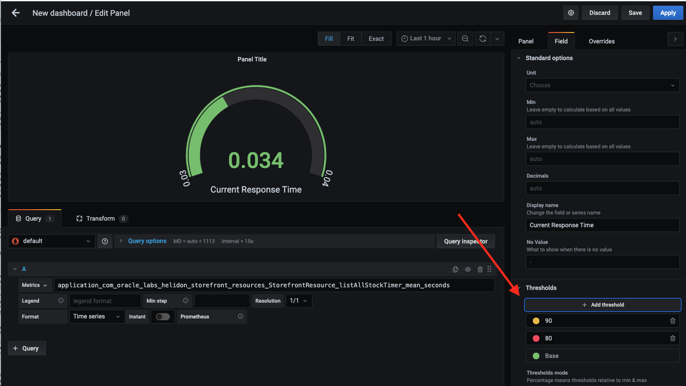

- In the text boxes representing the thresholds 
  - Set the Red threshold to be 0.1 
  - Set the yellow threshold to be 0.05

Note that as you enter the values the order of the boxes may change.


- At the top of the right menu switch back to the `Panel`

- Remove any text in the panel title


- Click the Apply to return to the New Dashboard

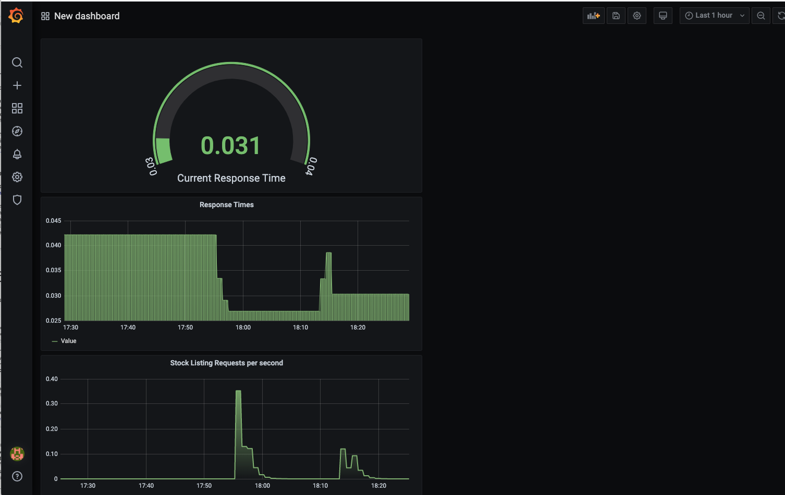

- Let's Re-arrange the panels a bit. 

  - Click on the working of the middle panels title (Response Times) and drag it to the right of the gauge panel.


We need to rename our panel, after all "New dashboard" is not especially descriptive. 

- Click on the dashboard settings icon  on the upper right of the window

- In the settings page give it a name, let's use `Stock Listing performance`, provide a description, and *disable* the editing option

- Then click the `Save Dashboard` button


- In the popup name the dashboard `Stock Listing performance` then chose to save it 


Confirm if prompted (Note you cannot save to the name of an existing dashboard)

- Click the Back Arrow to exit the settings


No we have our dashboard let's set the auto refresh so as new data becomes available it will be displayed.

- Next to the refrech icon click the menu to open up the auto-refresh options list

- Chose 1 min


- Make a few requests using curl to generate some new data (replace <external IP> with that of the ingress controller you were using earlier)
  -  `curl -i -k -X GET -u jack:password https://1<external IP/store/stocklevel`
  
Within a min or two (remember Helidon, Prometheus and Grafana need to capture and process their data) the UI will update with the requests you've just made


Let's look in a bit more close up

- Using the duration dropdown in the upper right change the duration to be the last 5 mins 

Now we can see more details


### More complex dashboards
This is a fairly simple dashboard, far more complex ones are easily achievable using a combination or Prometheus and Grafana. As an example we're going to look at a prebuilt dashboard.

- Click the Grafana logo  on the upper left. 

- On the left side menu click the settings "cog", and then Datasources.


- Click the entry for `Prometheus`


To get the list of dashboards

- Click the `Dashboards` tab


- Click on the"import" button for each dashboard, 

The dashbaords will be imported (there will be a quick "I'm doing an import" message after each click) after which we can see they are all imported

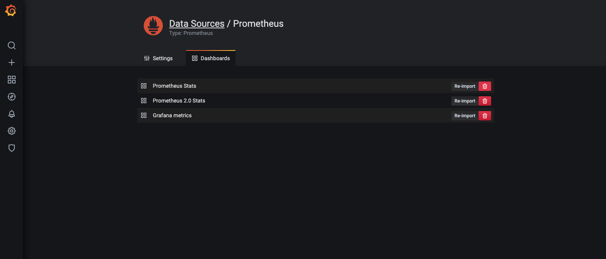

- Click the Grafana logo  on the upper left. 
- Click the Home menu  to get a list of available dashboards

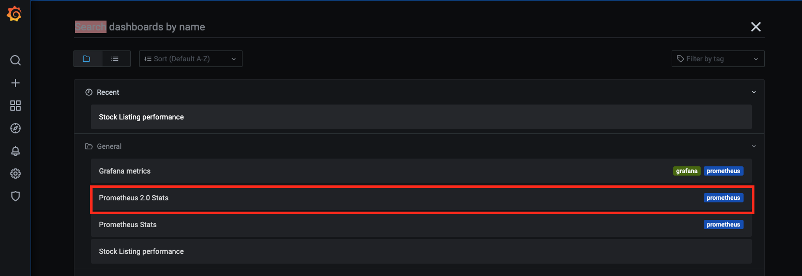


- Click on the Prometheus 2.0 Stats option to see an example dashboard of stats for Prometheus


## Tidying up the environment

If you are in a trial tenancy there are limitations on how many Load Balancers and other resources you can have in use at any time, and you may need them for other modules. The simplest way to release the resources used in his module (including the load balancer) is to delete the entire namespace.

To delete the monitoring namespace do the following

- In the OCI Cloud shell type 
  - `kubectl delete namespace monitoring`
  
```
namespace "monitoring" deleted
```

---

You have reached the end of this lab !!

Use your **back** button to return to the **C. Deploying to Kubernetes** section