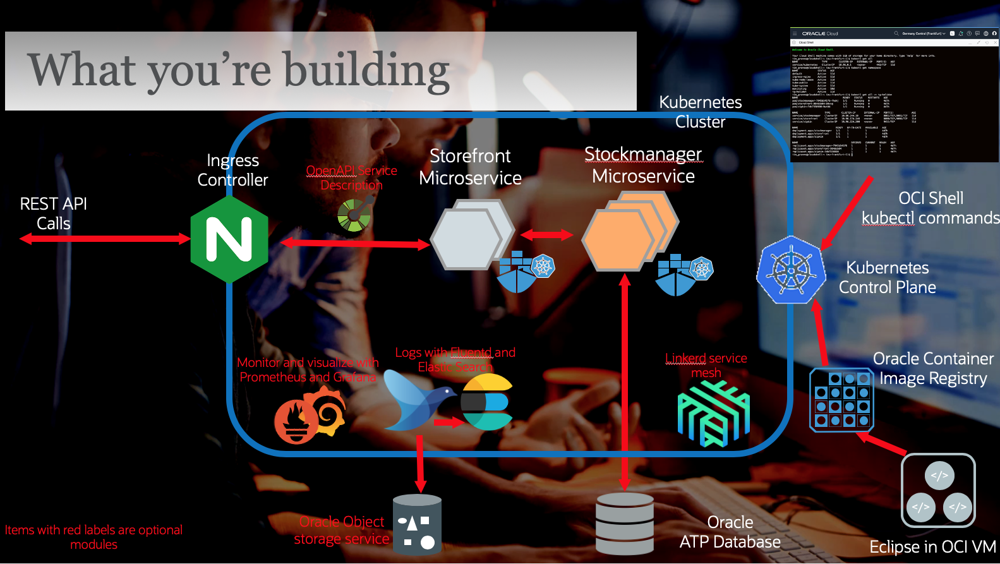

[Go to the Cloud Test Drive Welcomer Page](../../readme.md)

# Migration of Monolith to Cloud Native architecture

## Overview

This set of labs cover the cloud native part of application development. The core lab flow is build around the process of creating some microservices from a monolithic application, packaging it using Docker and deploying in Kubernetes. 

There are a number of additional lab modules which can be run by themselves or as optional parts of the core lab flow.

## Introduction

The Migration of a Monolith (well actually quite a simple "Monolith" web app that provides a REST API and a basic database service) into a web service comprised of two microservices using the Helidon framework. The microservices are then extended to provide monitoring capabilities such as metrics and tracing, then to prepare them for cloud native capabilities such as health checks, automatic service restart etc. 

The Helidon part of the lab has optional modules on extracting request information (for example the user details) and using the Open API to create a self describing microservice.

The next part of the lab goes through the process of **packaging those services up into Docker containers** and externalizing configuration such as the database connection details and pushing to a docker repository.

Then we look at how to **run the docker containers in Kubernetes**, examining how to set up a Kubernetes cluster with basic capabilities, then creating a basic deployment of the services behind an Ingress controller. The labs then examine how to make use of cloud native capabilities in Kubernetes such as horizontal scaling and using the support in Helidon for things like service liveness, readiness and how those combine to enable continuous service delivery using rolling upgrades.

The Kubernetes lab also has several optional lab modules you can do which cover the use of monitoring tools such as Prometheus and Grafana, deployment activities such as capturing log data and sending it to a data store for analysis, and installing and using a service mesh for monitoring, troubleshooting and canary deployments.

For reference, this is the architecture you'll be building (if you do all of the modules)

### Lab conventions

This is a rather long lab, therefore we used a few layout tricks to make the reading of this tutorial more intuitive : 

- If you see a "Bullet" sign, this means **you** need to perform some sort of **action**.  This can be 
  - Opening a window and navigating to some point in a file system
  - Executing some command on the command line of a terminal window :
    -  For example : `ls -al`

As we cover quite some theoretical concepts, we included pretty verbose explanations.  To make the lab easier to grasp, we placed the longer parts in *Collapsibles*:

---

<b>Click this part to expand !</b>

If you feel you are already pretty familiar with a specific concept, you can just skip it, or read quickly through the text, then re-collapse the text section by re-clicking on the title. 

---

## Video introductions

These labs were designed in part to be delivered in a classroom environment where we would do a short presentation to introduce the labs, and also each section.

To support those who are doing the labs in a self-guided mode we have created an introduction video to the entire labs, and short videos for each lab section. If you are doing the labs with an instructor you don't need to review these, but for self guided students we **strongly** recommend that you review the videos.

Each video is in a expandable section, see the one below. If you are a self guided student (you are **not** part of an instructor led lab) expand it and click on the video image to be taken to the video streaming web site where you can play it. Once you've finished just click the back button to return to these instructions.

<b>Self guided student - video introduction</b>

This video is an introduction to this lab. Once you've watched it please press the "Back" button on your browser to return to the labs.

Note. The current videos were recorded during the lock down, hence the poor sound quality, you may need to turn up the volume on your computer to hear them properly.

---

## The lab environment

You will be running these labs on an Oracle Cloud Infrastructure (OCI) tenancy.  This allows us to provide you with a consistent environment. 

Components we will be using : 

- A Linux VM with a Linux Desktop, accessible through a VNC viewer.  This environment will contain Eclipse, Maven and Docker, tools you will need to run the **Helidon** and **Docker** modules
- An ATP database to allow our application to store data in a persistent manner.
- A Kubernetes cluster to deploy you microservices on for the **Kubernetes** module. 

The basic principles will however run in any Java IDE or Kubernetes environment, however you may need to adjust some aspects, for example if you were to build on this lab by installing a local MySQL database and Kubernetes cluster on your laptop the configuration details would be different than when using an Autonomous Transaction Processing database in the Oracle cloud, however the coding and operating the cluster details would be the same.

# Preparing your environment

There are some steps you need to take to prepare the environment for your own individual use.

- You can run the Helidon  parts of this lab on a **Oracle Free Tier** account, You can run the Helidon, Docker and Kubernetes parts in your own tenancy (Trial or paid.)  In this case you need to perform some extra preparation steps, [explained in detail on this page](ManualSetup/FullSetupFreeTier.md).

- If you are part of **an instructor-led lab**, in some cases your instructor might provide Cloud Tenancy for you, minimizing the setup to [these few steps to connect to a remote desktop](ManualSetup/CreateClientVm.md).

# A. Helidon labs
The Helidon part of the labs show how to split the Monolith into microservices using Helidon REST, to access data and to extend the microservices to suppport cloud native capabilities

To do these labs you must be familiar with Java at a basic lavel (able to understand classes, constructors, methods etc.) and a bit familiar with the Eclipse IDE

Follow the link to [the Helidon labs](Helidon/Helidon-labs.md) to get started !

# B. Using Docker
The Docker part of the labs covers how we use JIB to create a docker image, run it, then to move the configuration and secrets externally to the docker image, finally we look at how to push the docker image to a repository

Go to [the Docker Labs](Docker/DockerLabs.md)

# C. Deploying in Kubernetes
These labs cover how to deploy our docker continers in Kubernetes and how to make use of the cloud native capabilities of Kubernetes.

Go to [the Kubernetes Labs](Kubernetes/Kubernetes-labs.md)

---

[Go to the Cloud Test Drive Welcomer Page](../../readme.md)

#### [License](../../LICENSE)

Copyright (c) 2014, 2020 Oracle and/or its affiliates
The Universal Permissive License (UPL), Version 1.0
