# Configuring OCI security for DevOps

## Introduction

The Oracle Cloud Infrastructure (OCI) provides a comprehensive set of security mechanisms to control actions within tenancies. One core element of this approach is that security is enabled by default, so to take actions users need to be granted permissions. The tenancy admin of course has full capabilities when the tenancy is setup.

To make calls for uploading code to the git repos we will shortly be creating we need to configure 

Even though tenancy admins may have full admin rights the DevOps service itself needs to be able to manage other resources, for example to run a build it needs a compute instance and to deploy it needs to be able issue commands against the deployment target (Functions, Kubernetes etc.) so we need to configure policies to allow this.

### Objectives

Using we will :
  
  - Create ssh keys and upload them to the OCI to digitally sign API requests
  
  - Configure out OCI CLoud Shell ssh client to use that ssh key when connecting to the OCI Code repository service
  
  - Create dynamic groups defining the DevOps service elements
  
  - Define policies allowing the DevOps service elements to manipulate other services within the compartment.
  
As these steps are not really specific to getting experience with the DevOps service itself we will use a script to do this, though if you want you can do this manually.
  
### Prerequisites

For setting up the dynamic groups and policies you will need to be a user with administrative rights to define policies, dynamic groups and create and manage user groups. If you are using a free trial then you will almost certainly be the admin of that tenancy and have full rights. If you are operating in a commercial or other tenancy then you may not have the admin rights, and may need to ask your tenancy administrator to manually configure the tenancy security (Expand the **I want to configure groups and policies by hand** expansion section at the end of this document for details)

Any user can setup ssh keys and upload them to their tenancy, however should you not want to use the script (we recommend you do use it) and want to set these up by hand then the instructions to do so are in the **I want to setup my ssh keys by hand** expansion at the end of this module.

You are assumed to have the latest version of the scripts in the `$HOME/helidon-kubernetes` folder, you will probably have checked this earlier in the lab.

## Task 1: Running the security setup script.

<details><summary><b>What does this script actually do ?</b></summary>  

The script first of all checks the `$HOME/hk8sLabsSettings` file to see if you've already setup groups, policies and ssh key. It will also try and check if there are sufficient resources to complete the tasks. 

It then creates an ssh key (in $HOME/ssh, not the usual .ssh to help avoid overwriting any existing keys you may have) and uploads it to the OCI security system for use when authenticating with SSH, it also configures the $HOME/.ssh/config file to use this key when connecting to the OCI code repos.

Next it will try and create dynamic groups which identify the various services used in the labs, these groups will be used to setup the policies that allow these services to manage other servcies running in your complartment, for example the devops service needs to be able to create compute instances to run the buld process.

It will save the OCID's of the resources created so that they can be removed later if desired.

---

</details>

  1. Make sure you are in the right directory, in the OCI Cloud shell
  
  ```bash
  <copy>cd $HOME/helidon-kubernetes/setup/devops-labs</copy>
  ```  
  
  2. Run the security setup script, in the OCI Cloud shell
  
  ```bash
  <copy>bash ./security-setup.sh</copy>
  ```  
  
  ```
  Loading existing settings information
SSH key setup starting
Loading existing settings information
SSH API Key for devops not previously configured, setting up
Loading existing settings information
No saved SSH key information, continuing.
Did not find any parts of the id_rsa_devops key pair in /home/atimgraves/ssh will create and upload
Generating ssh kep pair
Generating public/private rsa key pair.
Your identification has been saved in /home/atimgraves/ssh/id_rsa_devops.
Your public key has been saved in /home/atimgraves/ssh/id_rsa_devops.pub.
The key fingerprint is:
SHA256:U2iaTviYW0SAWfGWF0efwHh0hzmaNOxNqRDWqK8N/r4 atimgraves@3dcbda3c15f1
The key's randomart image is:
+---[RSA 2048]----+
|   ++.  +X= .+.  |
|  o  o o++B+*o   |
|      =.+=.Bo.   |
|     +.= .= .    |
|    . =.S        |
|     B. ..       |
|    o.++         |
|     oo .        |
|    .  oE.       |
+----[SHA256]-----+
Generating PEM file from public key file
Located public key file
Loading existing settings information
No saved API key information, continuing.
Uploaded key with fingerprint ea:b2:91:27:28:29:18:b9:8d:a7:79:e2:13:b8:c2:ba
Configuring SSH to use key
Are you running in a free trial environment or running with administrator rights to the compartment Tenancy root (y/n) ? 
  ```
As usual the precise output will vary from the example above
  
  3. The script will setup your SSH keys for use with git repo and upload to OCI then configure tour ssh config file (the keys are named `id_rsa_devops` to minimize the chance of conflict with other keys you may have). You are now asked if you are running in a free trial or have admin rights. If you are in a free trial account just enter `y` to proceed. If you are in a paid tenancy and are a tenancy administrator with full admin rights enter `y` to proceed. If you do not have full admin rights then enter `n` then contact your tenancy administrator and ask them to configure the groups and policies described in the **I want to configure groups and policies by hand** expansion at the end of this module. 
  
  ```
  OK, starting security groups and policy setup
Loading existing settings information
Loading existing settings information
No reuse info for dynamic group atgBuildDynamicGroup
Checking for existing dynamic group named atgBuildDynamicGroup
No existing dynamic group found, creating
Action completed. Waiting until the resource has entered state: ('ACTIVE',)
Loading existing settings information
No reuse info for dynamic group atgCodeReposDynamicGroup
Checking for existing dynamic group named atgCodeReposDynamicGroup
No existing dynamic group found, creating
Action completed. Waiting until the resource has entered state: ('ACTIVE',)
Loading existing settings information
No reuse info for dynamic group atgDeployDynamicGroup
Checking for existing dynamic group named atgDeployDynamicGroup
No existing dynamic group found, creating
Action completed. Waiting until the resource has entered state: ('ACTIVE',)
Loading existing settings information
Loading existing settings information
No reuse info for dynamic group atgDevOpsCodeRepoPolicy
Checking for existing policy named atgDevOpsCodeRepoPolicy in compartment Tenancy root
No existing policy found, creating
Action completed. Waiting until the resource has entered state: ('ACTIVE',)
Loading existing settings information
No reuse info for dynamic group atgDevOpsBuildPolicy
Checking for existing policy named atgDevOpsBuildPolicy in compartment Tenancy root
No existing policy found, creating
Action completed. Waiting until the resource has entered state: ('ACTIVE',)
Loading existing settings information
No reuse info for dynamic group atgDevOpsDeployPolicy
Checking for existing policy named atgDevOpsDeployPolicy in compartment Tenancy root
No existing policy found, creating
Action completed. Waiting until the resource has entered state: ('ACTIVE',)
```

  The script will now setup the dynamic groups and associated required policies to enable the various DevOps service elements to manage resources on your compartment.
  
  Note. As an administrator you have full rights to run services, so we don't need to specifically grant those rights to you. If you were not an administrator you would need to create a user group and be assigned to it, then a policy defined to let members of that group use the DevOps service - for tenancies using a federated identity this would mean setting up the user group in the federated identity system and then mapping the group to a tenancy specific group.

<details><summary><b>I want to setup my ssh keys by hand</b></summary>

### Task 1: Creating an ssh key

To interact with the OCI DevOps Code Repository we will soon be creating we need to authenticate ourselves to OCI using an authentication token, this will be based on your **Users** SSH key. 

**IMPORTANT** The SSH based API authentication we will be doing is not the same as the SSH setup used when accessing a virtual machine using SSH. If you already have setup a SSH key for **User** API access **In the OCI Cloud Shell** then you can skip the following steps and go to the **.ssh/config** session below. If you are doing this lab in a free trial account it is unlikely that you will have configured SSH access.

<details><summary><b>How do I access the OCI Cloud Shell ?</b></summary>

In many places through this lab we will be using the OCI Cloud Shell to provide an environment where we can execute commands. The OCI Cloud Shell is a small Linux based instance you access from the OCI Web Interface and it runs within the OCI environment, already logged in and authenticated as you. This means we don't need to configure your local environment to use the **oci** command, but more importantly it ensures that everyone doing the lab will have an environment to use which has all of the commands we need ready to use.

To open this click the Cloud Shell Icon  you find this at the upper right of any OCI Web Interface screen

  


The cloud shell will open at the bottom of the screen

You may have a short delay while the OCI infrastructure gets your home directory, creates an instance for you and connects to it, you can see it in the lower part of the page.

  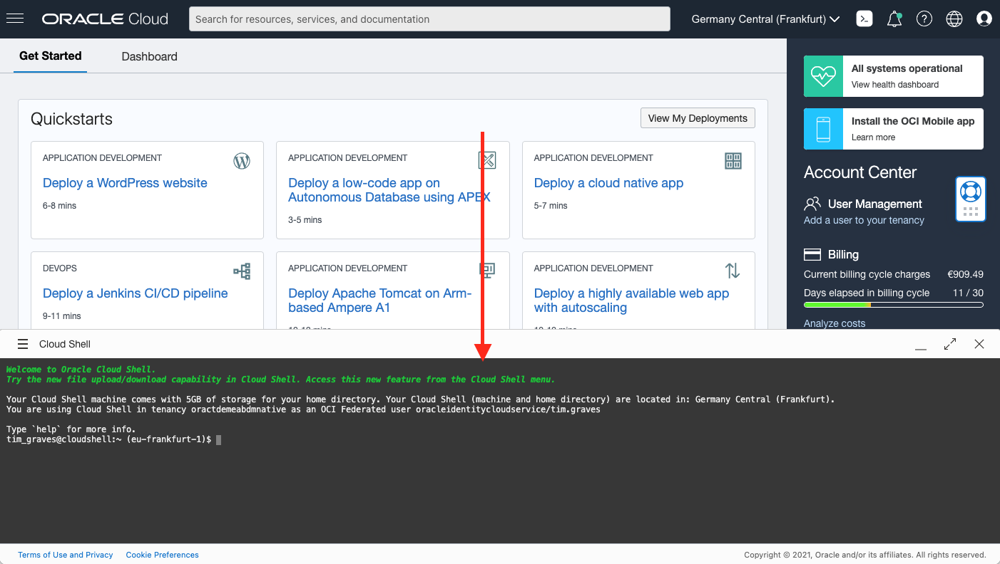

Once open you can do normal things like minimize / maximize / restore / close the Cloud Shell using the icons 

  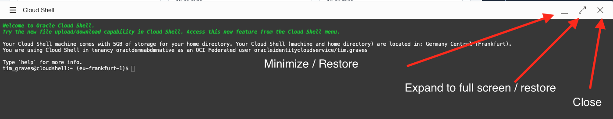

</details>

  1. Go to the OCI Cloud shell

  2. Create the .ssh directory to hold the keys we are about to create.

  ```bash
  <copy>mkdir -p $HOME/.ssh</copy>
  ```  
  
  3. Switch to that directory

  ```bash
  <copy>cd $HOME/.ssh</copy>
  ```  

Now we can create the keys to use, we are going to do this rather than let the web UI do it as this means we don't have to transfer them over from your computer. Note that if you have already got ssh API keys configured for authentication which were not created in the OCI cloud Shell you can just place them into id_rsa and id_rsa.pub files in this folder (use `cat > id_rsa` and then past the contents then do Control-D to finish the cat). If you prefer to use new keys please do so, but remember than you can only have three API Keys in each account.

  4. Run the following command in the OCI Cloud Shell to create a key pair, when prompted for a pass phrase just press return (a pass phrase can be used to secure access to the generated key, but that requires some additional setup so in the interests of time not going to use that here). Please replace `[email address]` with the email address for your user (for a free tenancy this is usually the one you provided during the sign-up process)

  ```
  ssh-keygen -t rsa -f $HOME/.ssh/id_rsa -C "[email address]" 
  ```

  ```
Generating public/private rsa key pair.
Enter passphrase (empty for no passphrase): 
Enter same passphrase again: 
Your identification has been saved in id_rsa.
Your public key has been saved in id_rsa.pub.
The key fingerprint is:
SHA256:aeAiZrPoYTT3EtPg8Yq2JDvIovLR0syh/wN3RI8em1M tim_graves@4d82c9745b49
The key's randomart image is:
+---[RSA 2048]----+
|                 |
|        .        |
|   . ... o       |
|  . +...+.E      |
| o=Xo..+S=       |
|++oX*.o.*        |
|===S== . .       |
|B *+o .          |
|o+......         |
+----[SHA256]-----+
```

  5. Now we need to get the public part of the key into PEM format so OCI can process it

  ```bash
  <copy>ssh-keygen -f ~/.ssh/id_rsa.pub -e -m pkcs8</copy>
  ```  

   ```
-----BEGIN PUBLIC KEY-----
MIIBIjANBgkqhkiG9w0BAQEFAAOCAQ8AMIIBCgKCAQEAxkHgmQxKd2jGBK5m3ym0
p5CnvKye0nkMwmE3vXbEwJwfHF16m+eTjpKxRsu6xZE4r4CHtyMm1cE8Tk9Ud8kI
e5RrslqWlPgQhzla7dmB1PiHvPdP2CXpWz5ijlOVayKZ7/yP3W1AtRoMsAgigfLf
v9Kepvaa+6o5846SAS1KcYBxCmNBTvUCRSBCPXNkydtf2z2t071jQP8ZxBw+Tse2
y4mAl0BXd2zThIYd1imkAh/LBcczE8dSXqZUn2070jpjaFzccpzKNNI7KcB/cQsd
tcl+Vi2ZjhRxBQE7Vtrgzgj15cBeWUEFW+5w4vshgnIpP9V+PvsXDvmY0ZmAht++
xwIDAQAB
-----END PUBLIC KEY-----
```

  6. Copy the resulting text *including the `-----BEGIN PUBLIC KEY-----` and `-----END PUBLIC KEY-----` lines and save it in a note pad or something.

### Task 2: Adding the key to your account

Let's set this up as an API key in your account.

  1. Navigate to your user details page
  
  - Click the "Shadow person" on the upper right
  
  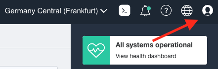
  
  - In the resulting menu click on your user name to get to your user details page this images shows my username, yours of course will be different.
  
  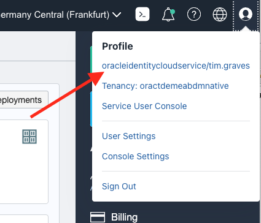
  
This will open your user details page.

  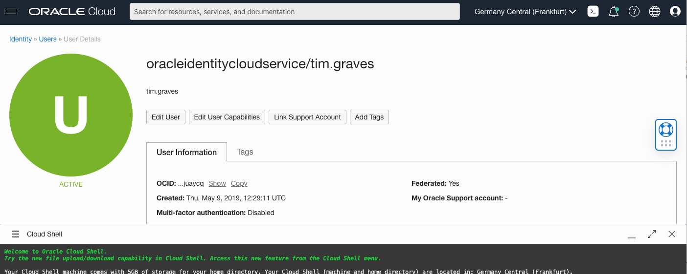

  2. Go your API Key details

  - On the left side Under `Resoures` click  `API Keys` - You may need to scroll down the page a little to see this.
  
  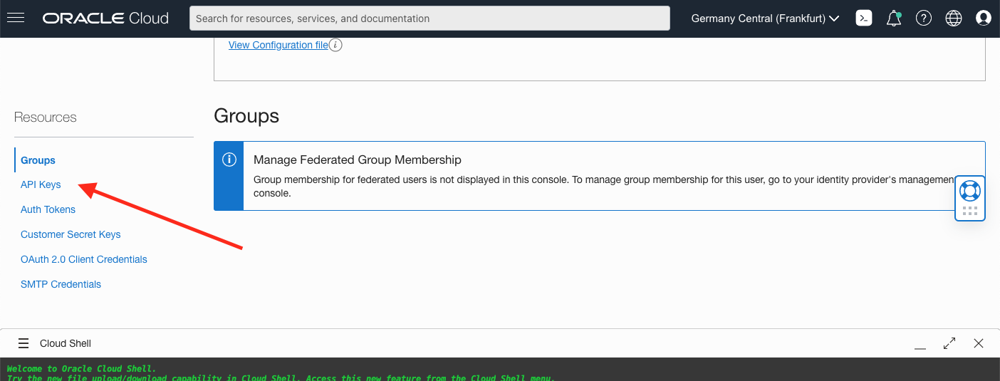
  
This will show the **API Keys** view of your user profile.

  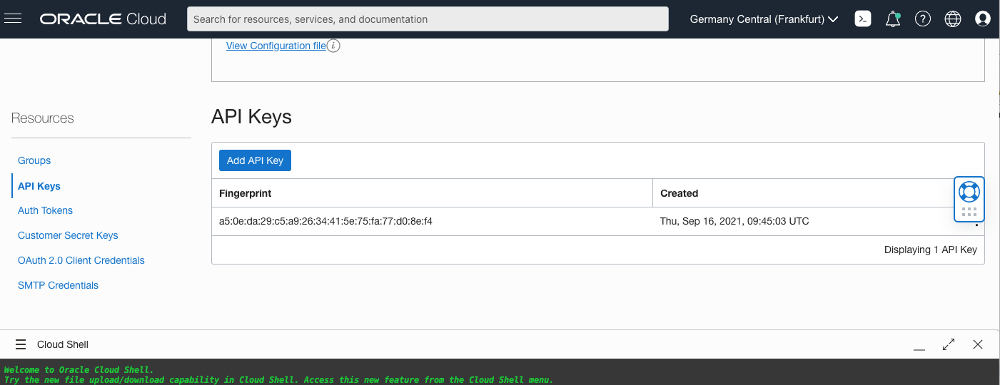

Depending on what other work you have done in your account you may have between zero and three keys listed, in this case I have one.

Provided you have less than three API keys listed you can proceed with adding your new key, if you do have three keys then you will either have to delete an existing key, or locate the private key that matches one of the existing keys.

  3. Add the API key to your profile

  - Click the **Add API Key** button
  
  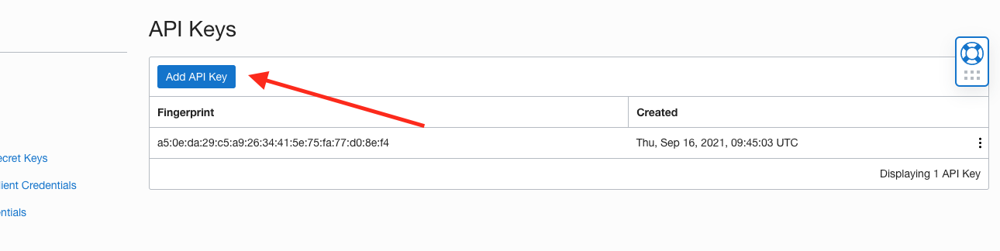
  
This will open the **Add a key** popup

  - Click **Paste public key**
  
  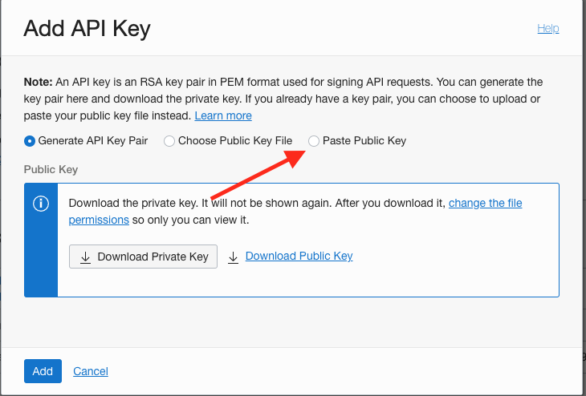
  
The UI will change slightly to provide a text box

  - Copy the **entire** output we just got above **including** the Begin and End lines into the box

  - Click the **Add** button
  
  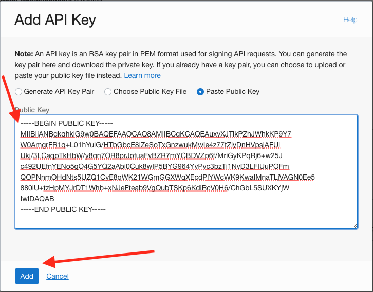
  
The UI will update to show a confirmation box, in this case we will be using the key we just added with ssh, do we don;t need to use the configuration information it's presenting.

  - Click the **Close** button
  
  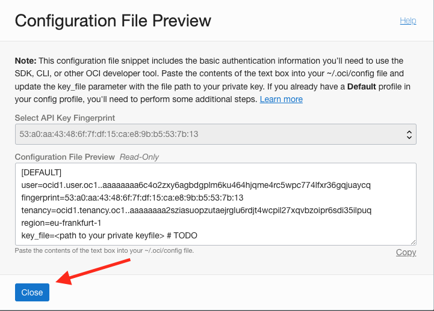

The UI will update to show the summary info for the newly added key.

  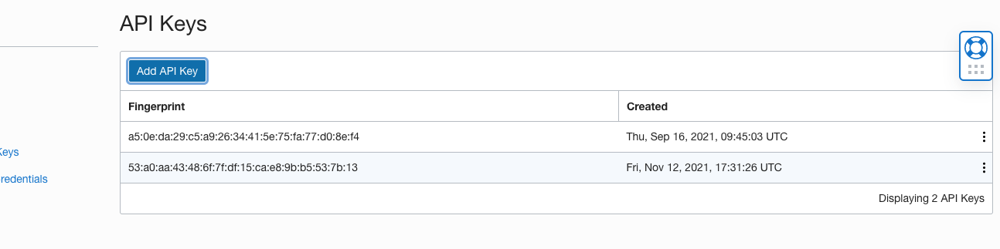
  
### Task 3: Updating your ssh confguration

Next we need to setup our SSH configuration file, to do that we need to get some further information.

  1. Getting your username

  - Click the "Shadow person" Icon, but this time just display the menu
  
  

  - Locate and copy the user name from the top of the user details page we're still on, in my case that's `oracleidentitycloudservice/tim.graves@oracle.com` (as I'm using an account with a federated identity the name of the identity system is also part of my user name) but for users in a non federated system (which will be most free trial users) that's going to be just the user name you used when creating the account.
  
  

  - Locate your tenancy information if you click the little "shaddow person" you can see that, in may case it's `oractdemeadbmnative`, though of course yours will vary, for a free trial account it's often based on the name you gave when setting up the account.
  
  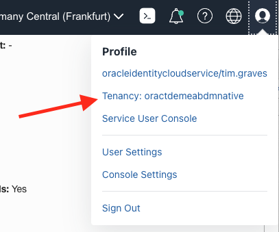
  
  - Open the cloud shell and using your preferred editor edit the file `$HOME/.ssh/config` (vim, vi, emacs and nano are available, there may be others)

  - Add the following details, substitute your username and tenancy name which you just retrieved
  
```
Host devops.scmservice.*.oci.oraclecloud.com
  User \<your username\>@\<tenancy name\>
  IdentityFile ~/.ssh/id_rsa
```

As an example mine looks like this - but yours of course will differ

```
Host devops.scmservice.*.oci.oraclecloud.com
  User oracleidentitycloudservice/tim.graves@oracle.com@oractdemeadbmnative
  IdentityFile ~/.ssh/id_rsa
```

</details>

<details><summary><b>I want to configure groups and policies by hand</b></summary>

### Task 1: Gathering information

IMPORTANT unless otherwise told you **MUST** run the setup steps and actual devops lab in the same compartment as the OKE cluster.

If you are doing this lab in a free trial tenancy as part of an Oracle event then you will be the tenancy administrator so can do all of the following yourself, if however you are in a shared or paid tenancy then you may need to get the tenancy administrator (or someone who has the ability to make changed assigned to them) to do these steps. 

In the following instructions you will need to make some substitutions where you see `<YOUR INITIALS>` in the text please replace them with your initials **in lower case**, for example If you were named `John Smith` you'd use `js`. If you think there will be multiple people using the same tennancy (in a lab using free trial accounts this is unlikely to be the case) with the same initials then please decide between yourselves on different ones to use. We do this so if you are running this lab in a shared tenancy then each user will have their own setup. If you used the scripts to create the environment these will have been the initials you used when running the `get-initials.sh` script.

You will also need to substitute `<compartment name>` with the name of the compartment you are using, in a lab using free trial accounts this is likely to be `CTDOKE` is however you are using a corporate or Oracle internal tenancy then this may be different. If you used the script to setup the environment this will be the name you gave to the `compartment-setup.sh` script.

Finally you will need to substitute `<Your Compartment OCID>` with the OCID of your compartment. If you used the scripts to setup the compartment you will have seen this in the `compartment-setup.sh` script output.

#### Task 1a: Getting your compartments OCID

Compartment information is held with in the Identity and Access management service.

  1. Open the OCI Web console, Click on the "Hamburger" menu, then **Identity & Security** then **Compartments**
  
  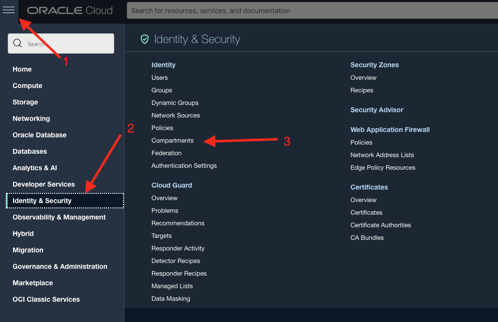
  
  2. Locate your compartment in the list (`don't click on it) , If your compartment was created as a sub compartment of another you will need to navigate to it by clicking on the names in the hierarchy as if you were using a file manager.
  
  3. Click on the **OCID** for your compartment (for this list there are many compartments, I've chosen the `CTDOKE` one as that was what I used when setting up the compartment in  the earlier instructions). A small popup will display the full OCID, click the **Copy** to copy it to your system
  
  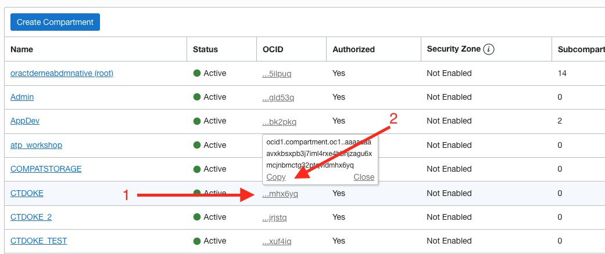
  
  4. Save the OCID you've just copied into a notepad or similar, you will need this later.
  

### Task 2: Defining a group of DevOps users

We need to define a group of users, we will later use this group to create a OCI Security policy that allows users to create, manage and use the Dev Ops service.

  1. Open the OCI Web console, Click on the "shadow" user icon on the upper right, note the user name that's displayed. In this case that's `oracleidentitycloudservice/tim.graves` but if you are the administrator of a trial tenancy (highly likely if you are in a Oracle guided lab) you're user name will will include your email address, for example `oracleidentitycloudservice/john.doe@somewhere.com`.
  
  
  
  The next steps will be to create a devops group and assign your user to it. If you are in a free trial tenancy (where you are the administrator) then you can do this yourself, if however you are in a commercial tenancy or using a federated identity system you may not have the rights to do this, in which case you will need to get a the identity administrator to create the group and add you. 
  
  2. Click on the "Hamburger" menu, then **Identity & Security** then **Groups**
  
  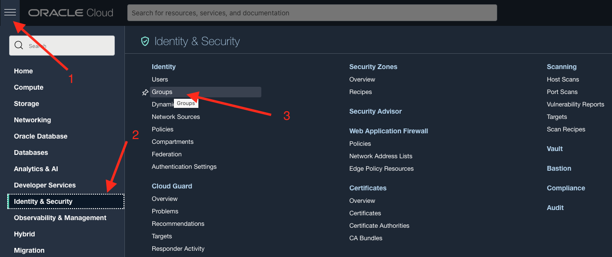
  
  Note that the tenancy I'm using to get the images had a number of pre-existing groups, it's likely that a free trial tenancy will not, so ignore the other groups in the list shown here.
  
  3. Start creating the group - click the **Create Group** button

  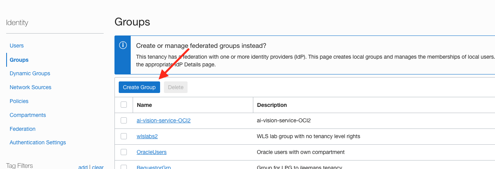
  
  4. In the resulting "popup" form, In the **name** field name the group `<your initials>DevOpsUsersGroup` (so for me that would be `tgDevOpsUsersGroup`and in the **Description** put `Users allowed to run the DevOps service` (or anything else you like that describes the group) Click the **Create** button. The group will be created.
  
  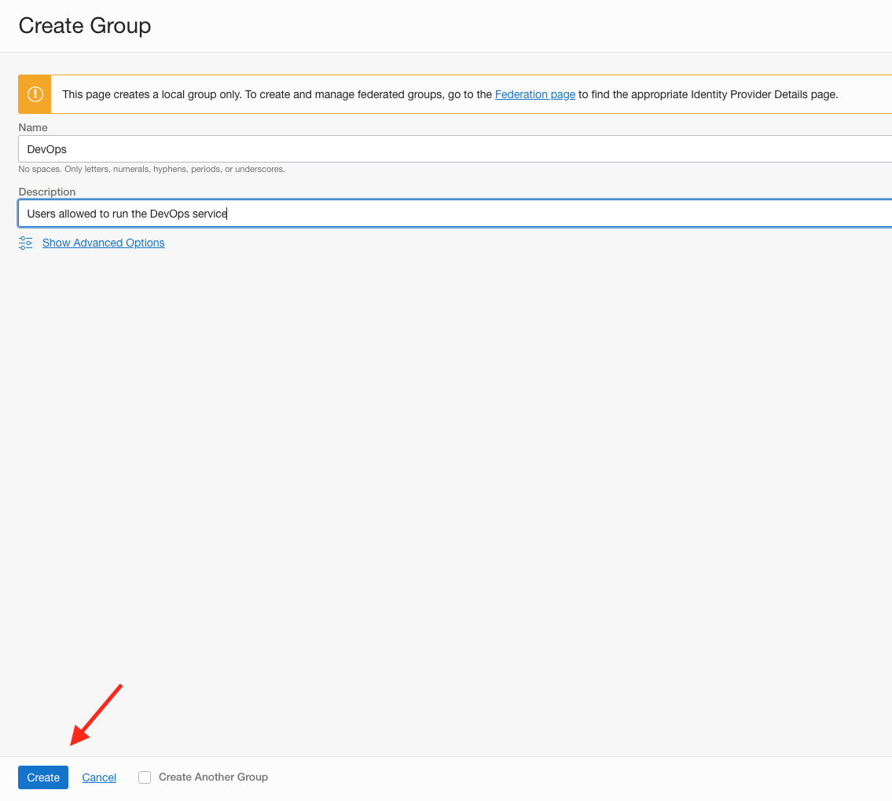
  
  5. Click on the newly created `DevOps` group in the list, then click the **Add User to Group** button
  
  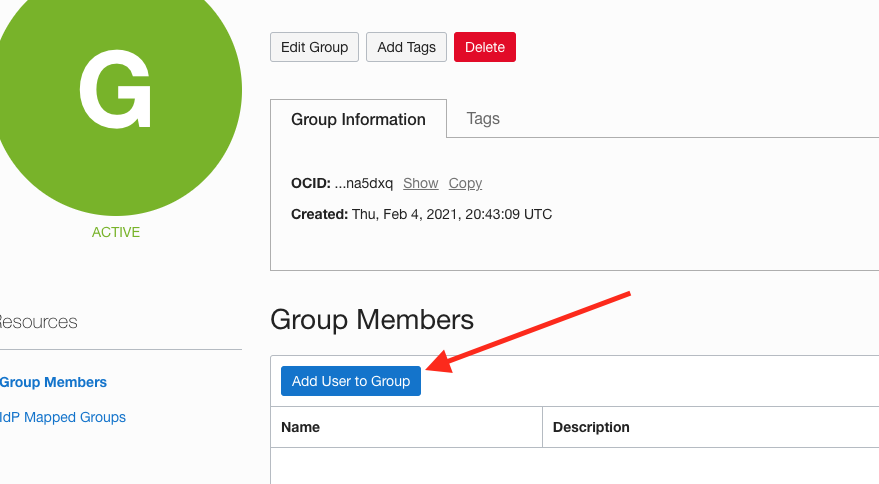
  
  6. Click in the **Users** field, a list of all users will be shown, start typing your username and as you type the list will update to only include the matches, in this case I'm using a different user name to show you how this works. **Click on your user from the list of options to select it**. In the image below the tenancy I'm in has many pre-existing users, your user is going to be identified by the email address.
  
  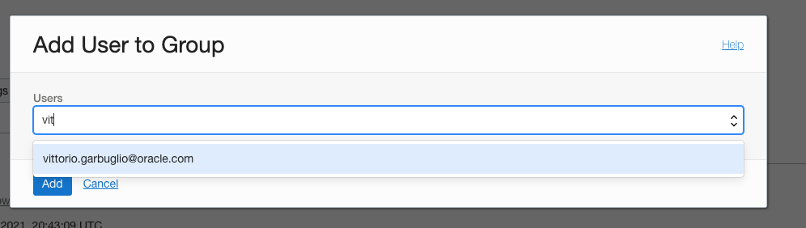
  
  7. It is critical that you actually click on the user name in the list otherwise it won't be selected. Click on the **Add** button to add your user to the list.
  
  
  
  Your user will now be shown in the list of group members
  
  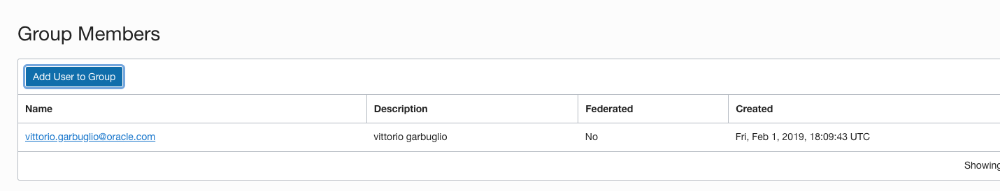
  
### Task 2: Creating the dynamic groups

In OCI there are multiple types of groups, we've seen a group based on users, but it's also possible to create a **dynamic group** which represents resources within OCI itself,usually based on resources in a compartment, and can be further limited to a specific resource type. It's called a **dynamic group** because it matches on any resource, regardless of if the resource was created after the group was created. This means that we can define the group now, and then create the resources it matches against later on.

We are going to create three dynamic groups for identifying the code repositories, the build service and the deploy service
  
  1. Open the OCI Web based interface, Navigate to the dynamic groupspage - Click on the "Hamburger" menu, then **Identity & Security** then **Groups**
  
  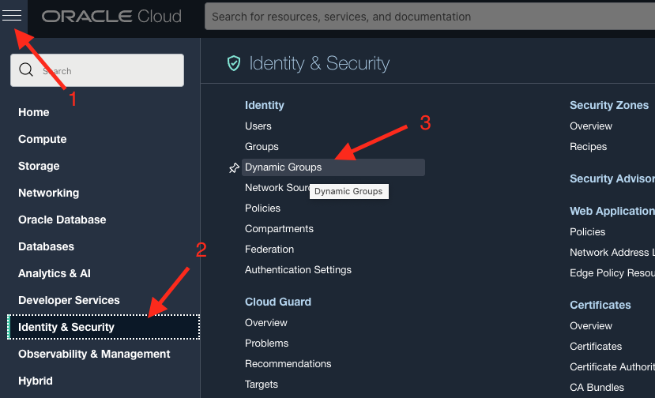
  
  In this tenancy there are already a lot of dynamic groups, if you are in a free trial tenancy tere will probabaly not be any in the list.

  2. Click the **Create Dynamic Group** button to start the process
  
  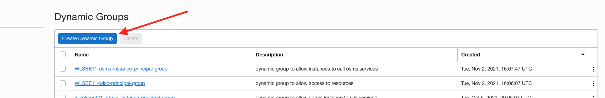
  
  3. In the **Name** field name it `<YOUR INITIALS>BuildDynamicGroup`, In the **Description** enter `This dynamic group identifies the DevOps Build Pipelines`, in the rules section enter this into the **Rule 1** field, replace `<Your Copartment OCID` with the OCID your got earlier for your compartment. `ALL {resource.type = 'devopsbuildpipeline', resource.compartment.id = '<Your Compartment OCID>'}` Click the **Create** button.
  
  Of course in the image below I'm using **my** compartment ID, yours will be different !
  
  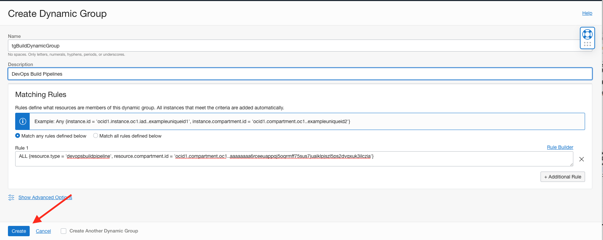
  
  4. The Dynamic group will be created and you'll be taken to it's page. Return to the Dynamic groups list by clicking **Dynamic groups** in the "Breadcrumb" path at the upper right.
  
  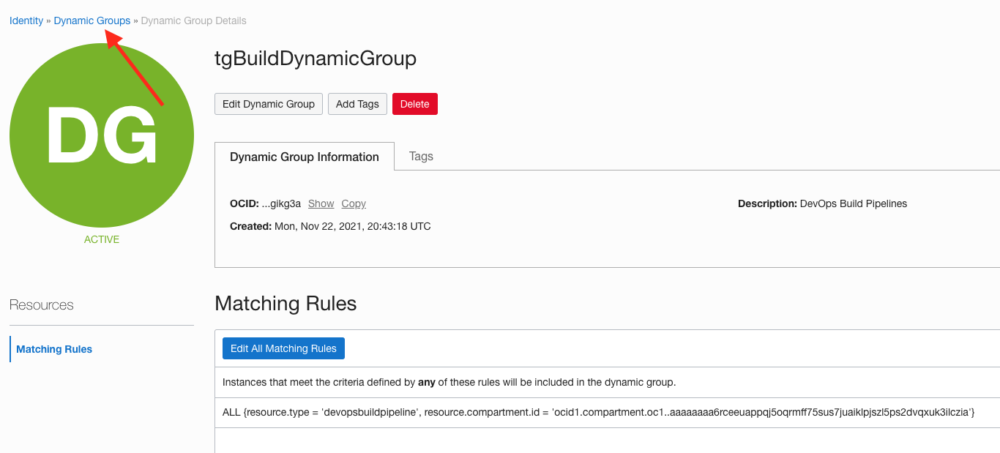
  
  5. Follow the above process, to create two more groups as described below, remember to replace `<YOUR INITIALS` and `<Your Compartment OCID>` in these groups.
  
  Code dynamic group:

  - Name it `<YOUR INITIALS>CodeReposDynamicGroup`

  - Description is `This dynamic group identifies the OCI code repositories resources`

  - Set the rule to `ALL {resource.type = 'devopsrepository', resource.compartment.id = '<Your Compartment OCID>'}`

  Deployment dynamic group:
  
  - Name It `<YOUR INITIALS>DeployDynamicGroup`

  - Description is `This dynamic group identifies the deployment tools resources`

  - Set the rule to `ALL {resource.type = 'devopsdeploypipeline', resource.compartment.id = '<Your Compartment OCID>'}`
  
  Once you have created the three dynamic groups you will see them in dynamic groups list. It is **critical** that you followed the instructions above and in particular remembered to use the OCID of **your** compartment.
  
  
  
### Task 4: Define the policies

OCI Security uses policies to determine what groups can do. We need to setup policies that will allow our groups to perform operations within OCI. **IMPORTANT** We will be doing this based on your compartment, not on the entire tenancy (which would be a bad thing to do). 

Policies are applied in the parent of the compartment you are operating in, (or actually anything in the hierarchy, but it's easiest to just use the parent). In a free trial tenancy where you created the `CTDOKE` compartment in the tenancy root that means you will be applying the policies in the tenancy root (and these instructions will use that in the examples). However if for some reason you created your compartment as a sub compartment of another compartment you will need to remember to apply the policies in the parent compartment that contains the compartment you created. Of course if you chose a different compartment name you will need to use that instead of `CTDOKE`

  1. Open the OCI Web console, Now create the policies. Click the "Hamburger" menu, then Go to Identity & Security then Policies
  
  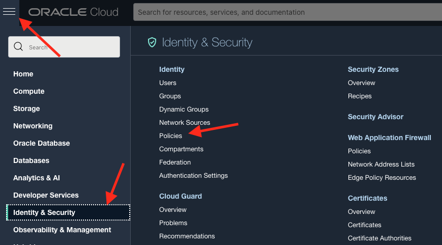
  
  2. On the left side of the page locate the **Compartment** selector, In the image be low there are lots of compartments, the list (size and also names) will be different in your case. Click in it and *make certain* that you have selected the *parent* compartment of the compartment you created. If you created the `CTDOKE` compartment in the root (this is what you probably will have done if you are using a free trial and following the instructions) then select the *root*. If for example you had created the `TimGraves` compartment in the `Users-compartment` (this of course is my setup, yours may vary) then you will need to select `Users-Compartment` as that's the parent of the `TimGraves` compartment.
  
  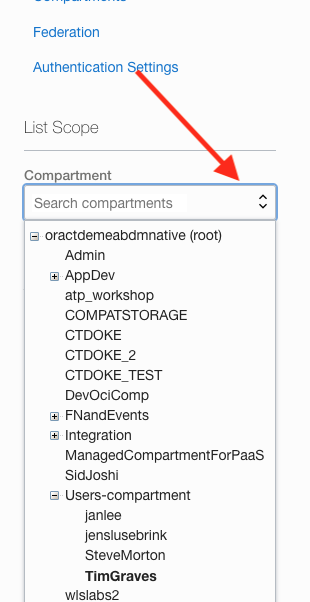
  
  3. Click on the `parent` of your compartment, the dropdown will collapse to show it's selected as per the image below. Now click on **Create Policy** to open the Create policy form. (This tenancy has lots of policies already existing in the root compartment, yours probably will not)
  
  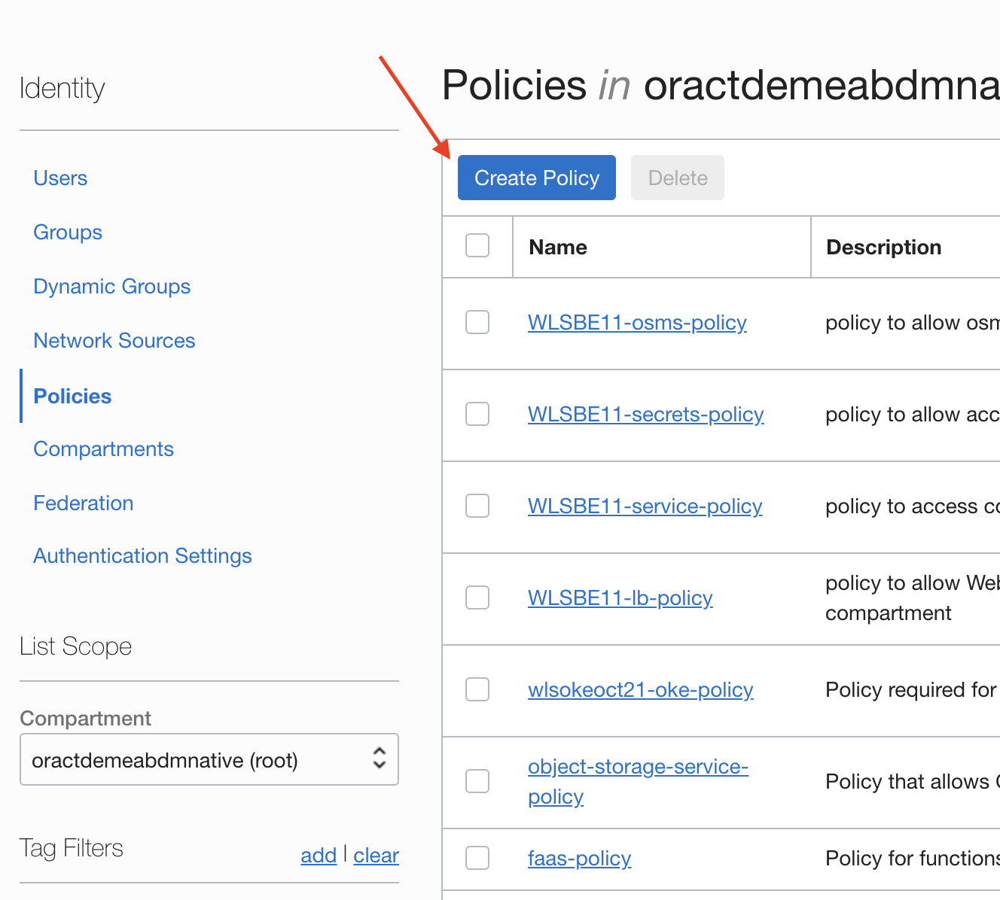
  
  4. Name the policy `<Your initials>DevOpsUsersPolicy` Of course you should replace `<Your initials>` with your initials, so as my initials are `tg` in the example image below I've named the group `tgDevopsUsersPolicy` Set the description to be `This policy allows members of the DevOps user group to interact with the DevOps services`. 
  
  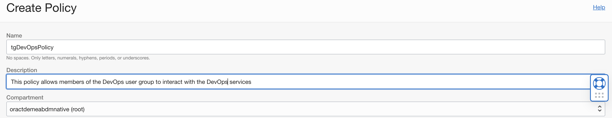
  
  5. Click the **Manual editor** button if it's not already enabled (it will be grey if not enabled and blue if enabled). In the Policy builder box paste the following AFTER substituting your initials (tg in this image) and your compartment name CTDOKE in this image `Allow group <YOUR INITIALS>DevOpsUsersGroup to manage devops-family in compartment <compartment name>` Then click the **Create** button
  
  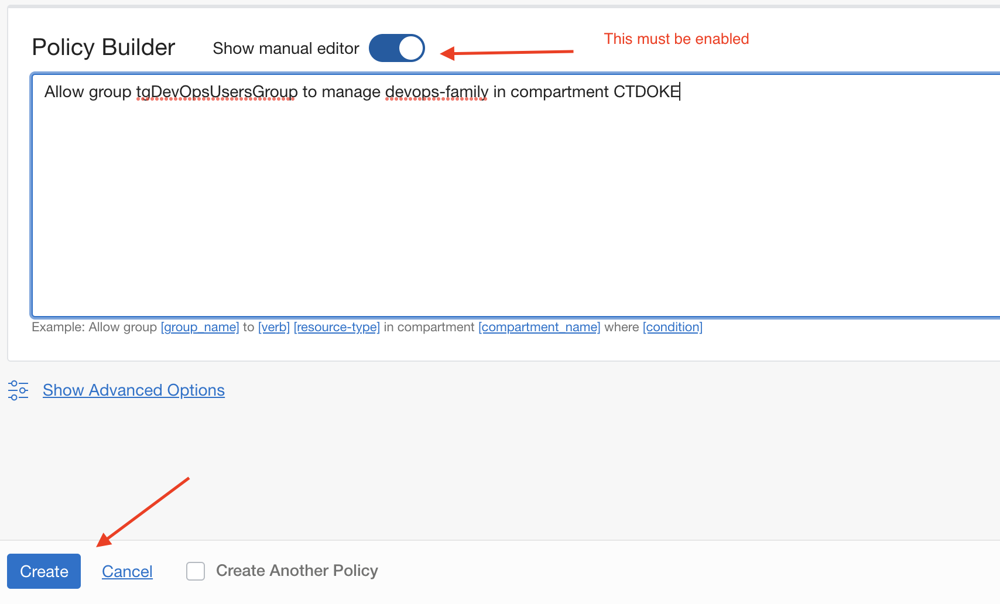
  
  6. The details of your new policy will show up in the UI click **Policies**  in the "Breadcrumb" trail to return to the policies list
  
  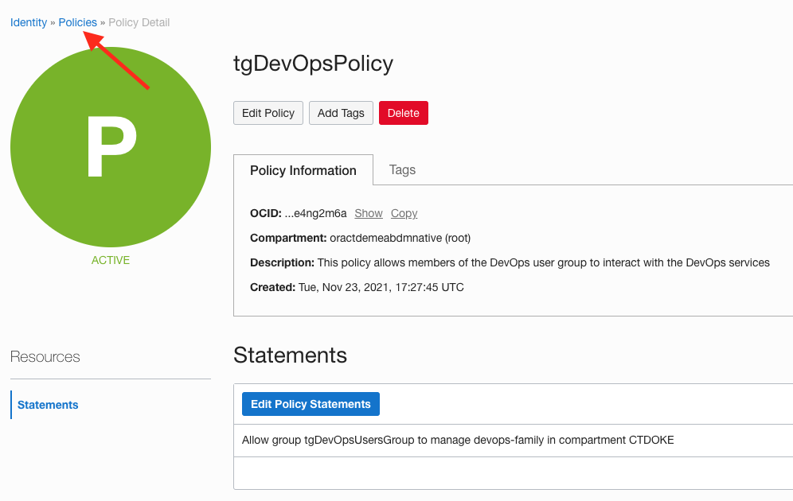
  
  7. Follow the process above to create policies that will allow the build, deploy and code repos dynamic group members (these are built using dynamic groups which will contain resources rather than users) to manage everything in the tenancy (it would be possible to put specific policy approvals in place on specific resources, but for a lab this is easier). Remember you will need to replace `<Your initials>` and `<compartment name>` and also you will need to create these in the **parent** compartment of your compartment.
  
  This allows the code repositories to trigger a build when you do a git push:
  
  - Name `<YOUR INITIALS>DevOpsCodeRepoPolicy`
  
  - Description `This policy allows the dynamic group of code repo resources resources to create trigger the build process`
  
  - Policy text `Allow dynamic-group <YOUR INITIALS>CodeReposDynamicGroup to manage all-resources in compartment <compartment name>`
  
  This allows the Build pipelines to create the build runners when you run a build 
  
  - Name `<YOUR INITIALS>DevOpsBuildPolicy`
  
  - Description `This policy allows the dynamic group of build resources resources to create build runners, and trigger deployments`

  - Policy text `Allow dynamic-group <YOUR INITIALS>BuildDynamicGroup to manage all-resources in compartment <compartment name>`
  
  This allows the deploy pipelines to manipulate the environments they are deloying to
  
  - Name `<YOUR INITIALS>DevOpsDeployPolicy`

  - Description `This policy allows the deployment tooling to interact with the destination systems (OKE, Functions etc.)`
  
  - Policy Text `Allow dynamic-group <YOUR INITIALS>DeployDynamicGroup to manage all-resources in compartment <compartment name>`
  
  Once you have created all the policies if you return to the policies list one more time (Use the "breadcrumb" on the upper left) you will see something like the following
  
  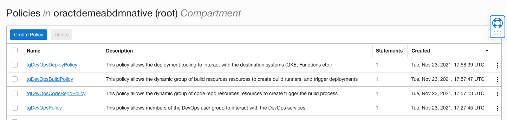
  
  Of course these all use my initials !
  
</details>

## Acknowledgements

* **Author** - Tim Graves, Cloud Native Solutions Architect, Oracle EMEA Cloud Native Application Development specialists Team
* **Last Updated By** - Tim Graves, May 2023