# Creating a build pipeline

## Introduction

We're now ready to create the actual build pipeline, this is what will run the build process.


### Objectives

Using the OCI Browser User Interface we will :

  - Create the build pipeline.

  - Add a build stage to the pipeline
  
  - Run a test build

 
### Prerequisites

You have create the DevOps project, the code repository, secrets in the vault and update the build_spec.yaml file

## Task 1: Creating the build pipeline

The build pipelines exist within your project, for this lab they are created using the OCI Web interface graphical editor, but of course you could script this using Terraform or the OCI command line

  1. Navigate to your projects home page. If you need to you can do this by : Click the "Hamburger" menu select **Developer Services** click on **Projects** (in the DevOps section) and selecting your project from the list.

  2. In the Resources section on the left side of the page click the **Build Pipelies** option
  
  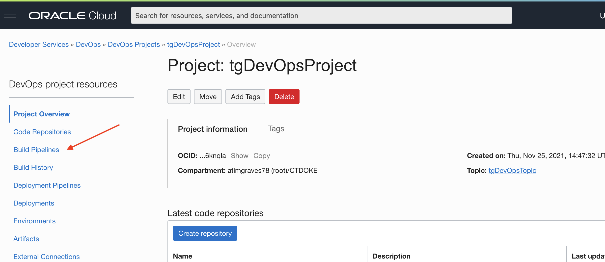

  3. Click **Create build pipeline** to open the create pipeline popup
  
  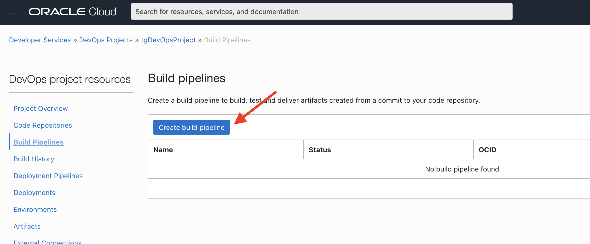
  
  4. In the create build pipeline popup name it `BuildStorefront`, provide a description `Builds the storefront service`. Click the **Create** button

  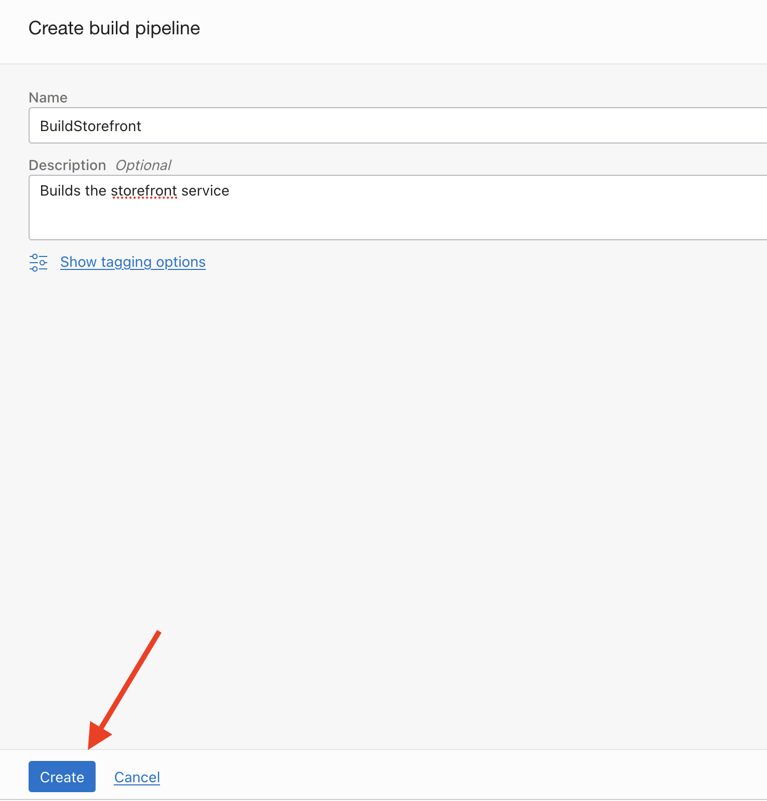

  After a short while your newly created pipeine will be displayed in the list
  
  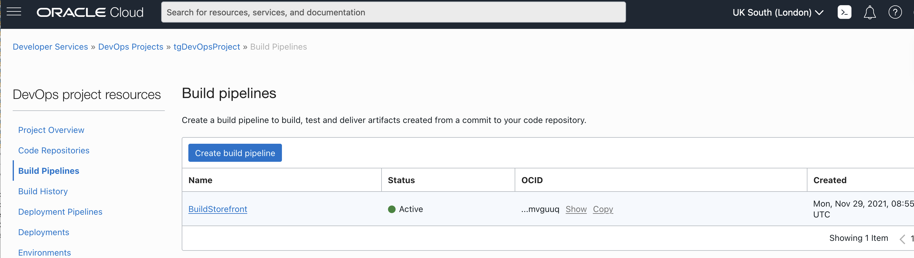
  
## Task 2: Adding a build stage

We're now going to add a build stage. A build stage runs in it's build runner (each stage has it's own runner)

  1. Open your build pipeline by clicking the name `BuildStorefront` in the list
  
  
  
  2. Click the + icon then **Add Build Stage** Then click **Add Stage** in the resulting menu to open the new build stage popup
  
  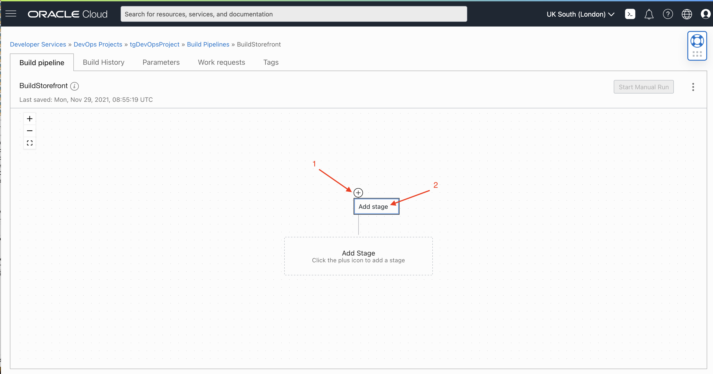

  3. There are multiple types of build stages, The  stage types are described in their boxes, but initially we will be creating a **Managed Build** stage will actually be used to process our build_spec.yaml file. Click the **Managed Build** option, then the **Next** button at the bottom of the page to move to the next part of the add stage process.
  
  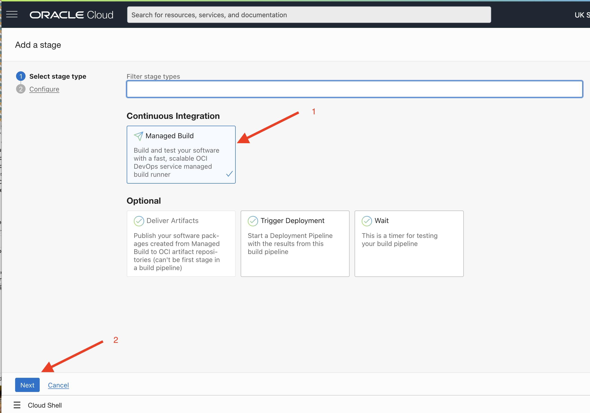

  4. Name the stage `BuildStorefront`, Enter a description if you like, Leave the **Base container image** unchanged, set the **Build Spec File Path** blank
  
  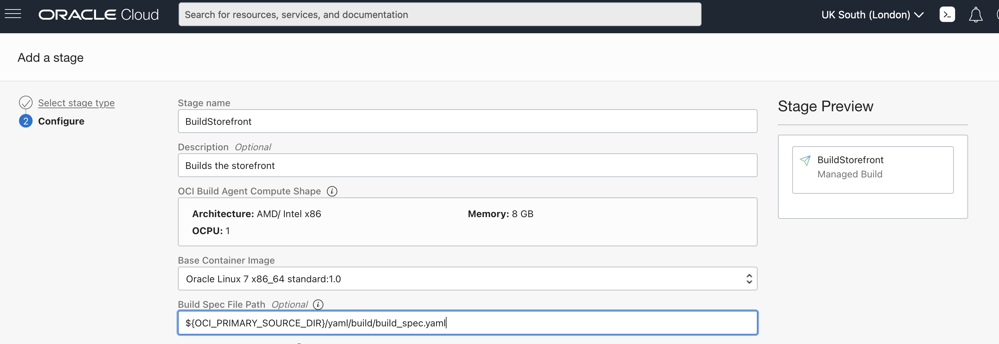

<details><summary><b>I don't want the build_spec.yaml in the repo root ?</b></summary>

You can specify the location as the build_spec.yaml if it is not in the root of the project to relative location in the primary repo, so for the cloudnative-helidon-storefront you could set the build spec as `helidon-storefront-full/yaml/build/build_spec.yaml` if you wanted to use that version of the file (but don't do that in this lab !)

---
</details>

  5. Click the **Select** button in the **Primary Code Repository** section to open the repository selection form 
  
  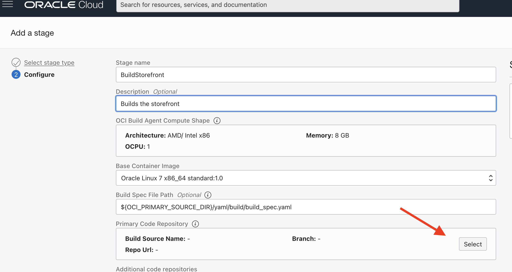
  
  6. In the selection type dropdown chose **OCI Code Repository** then once the list has updated and select `cloudnative-helidon-storefront` - the git repo you created for this project, In the **Select Branch** field make sure that `my-lab-branch` is selected in the **Build Source Name** enter `Storefront`. Now Click the **Save** button to return the the stage form
  
  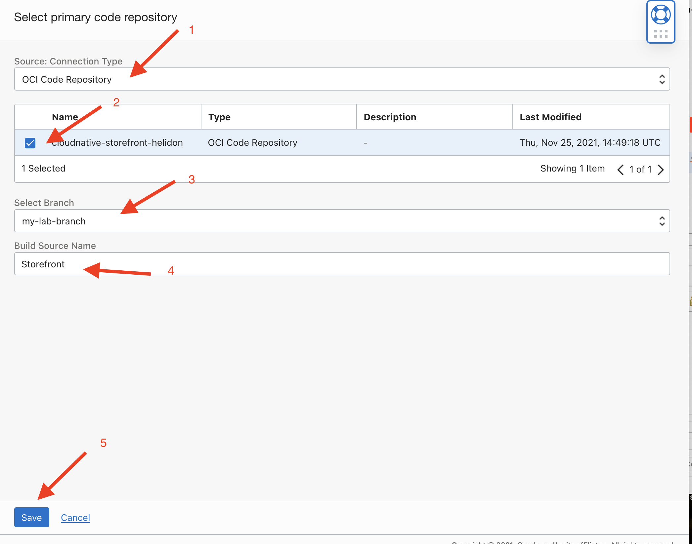
  
  7. Back on the **Add a stage** form leave the **Timeout** blank, Click the **Add** button
  
  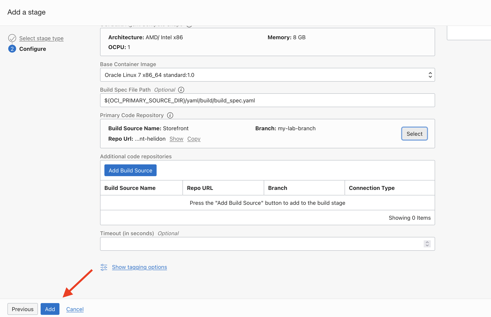
  
<details><summary><b>What if my project has multiple git repo ?</b></summary>

For this lab we are only using a single git repo which contains all of the code as well as the Kubernetes Manifests, However it's perfectly reasonable for a build to have multiple git repositories, for example if the code and Kubernetes manifests were held in separate repositories (which could with careful pipeline design result in a faster CI/CD process if only the manifests were changed)

---
</details>

<details><summary><b>Can I optimize my build with parallel stages ?</b></summary>

For this lab we're only going to create a simple linear pipeline, but if appropriate you can have parallel stages, perhaps you are building multiple library files first which can all be built independently, then combining them all in a last deploy stage and linking the intermediate artifacts with outputArtifact / inputArtifact entries in their build specs.

---
</details>

The build stage will show in the editor

  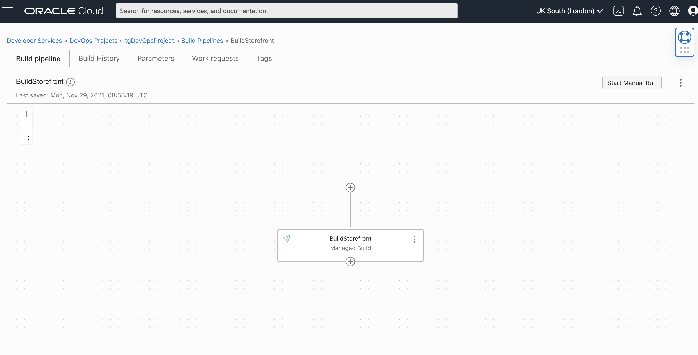

## Task 3: Running our first pipeline 

Let's see this in action, 

  1. Click the **Start Manual Run** button on the upper right of the pipeline editor
  
  


  A window will appear, you can change the Build run name it you needed to, but for now just leave it with the current value. The parameters box should be empty, as for this part of the lab we have not defined any parameters (we will look into this in a little bit) We only using using variables which get their values from inside the build pipeline, from the vault secrets (e.g. `OCIR_HOST_VAULT`), are determined inside the build stage (e.g. `STOREFRONT_VERSION`), or are set for us by the build pipeline infrastructure itself (e.g. `OCI_PRIMARY_SOURCE_DIR`)

  2. Click the **Start Manual Run** button on the lower left to start the build process.
  
  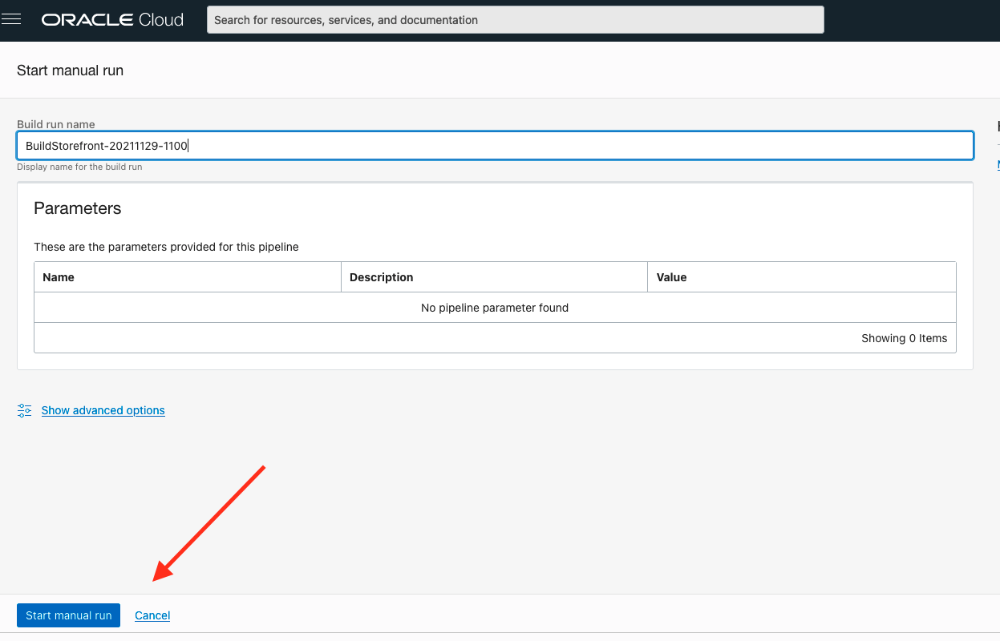

  We can now see several aspects on the page
  
  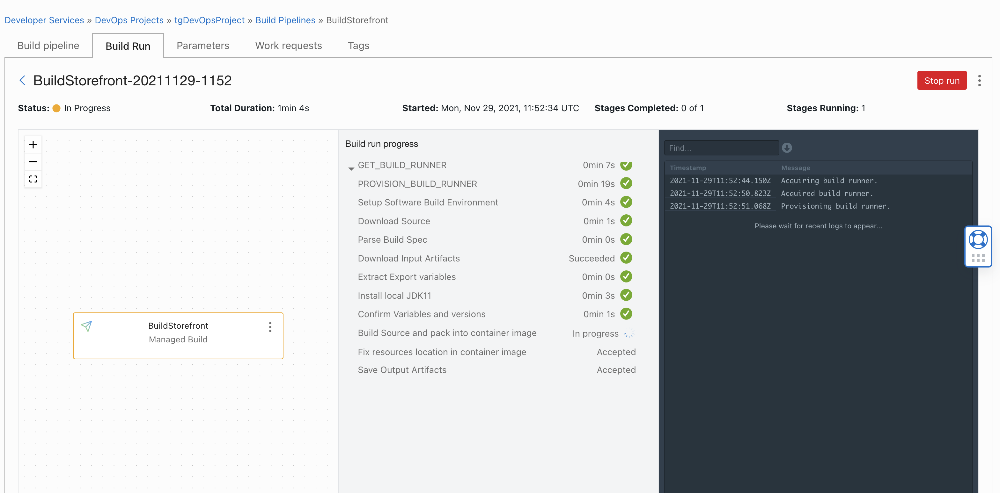

On the left is the build pipeline, at the moment there's only one stage, but if there were multiple the color coding would indicate the progress with completed stages being in green and in progress stages in Amber and pending stages in grey.

In the centre section you will see the list of stages, if you click the arrow to the left of the stage name you will see the individual steps in the stage (these correspond to the steps in your `build_spec.yaml` file. As each stage completed a green checkmark will be displayed next to it

Finally on the right you will see the logs from the build stages, note that if there are multiple steps in a build stage they will all be displayed in the logs for the stage. It can take a while for the logs to start being displayed as they do not update immediately, they can lag by 30 seconds or more between the data being generated and displayed. 

The build process can take a few minutes to run, please be patient.

<details><summary><b>End timebefore start time warning ?</b></summary>

If you see a warning about end time cannot be before start time do not worry, that's just the log viewer getting a little confused as the build process is initialized, it will sort itself out once the log data starts arriving.

---
</details>

## Task 4: Navigating the build output.

Though it's not that apparent (on Safari at least) there is a scroll bar on the left of the logs, also you can enter text in the **Find** field at the top of the log viewer, currently this highlights the entries rather than jumping to them (so you need to then scroll in most cases). Next to the **Find** field there is an arrow to enable you to download the logs to your own machine, personally I find this the easiest way to browse the logs once the stage has finished - I just load them into a text editor (or on the Mac there is also the console log viewer). The logs can get quite big - even this simple build stage generates over 1MB of log data, though most of that is just updates from Maven as it downloads the jar files specified in the pom.xml file.

  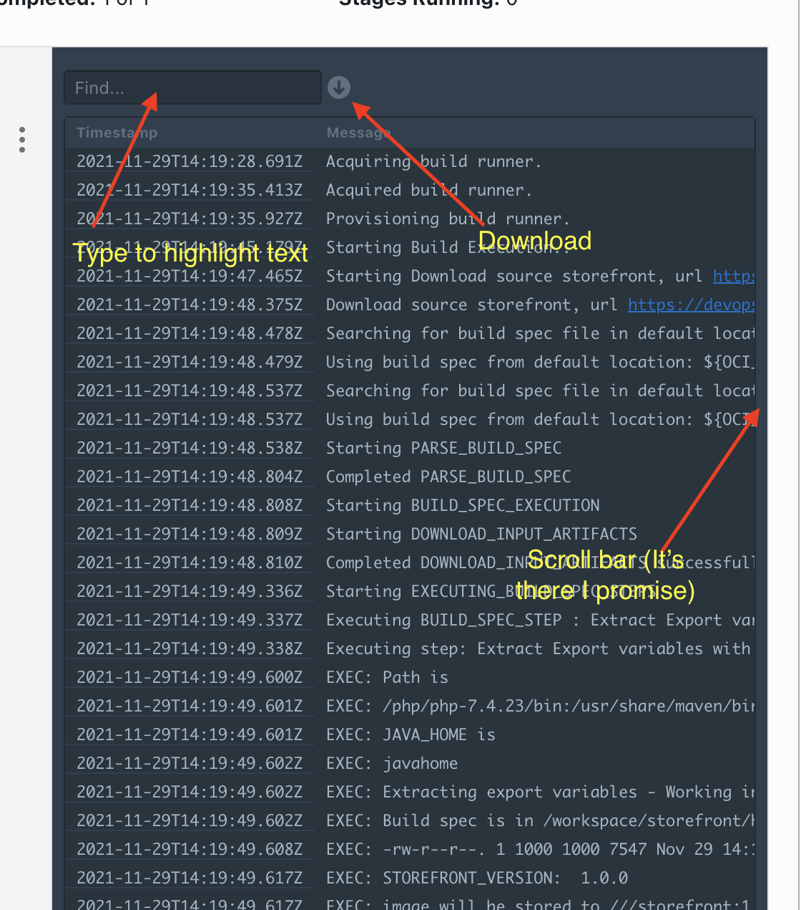
  
There is also the "three dots" menu to the right of each build stage, clicking on that opens a "popup" where you can see the details of the build runner as well as the logs for that stage.

  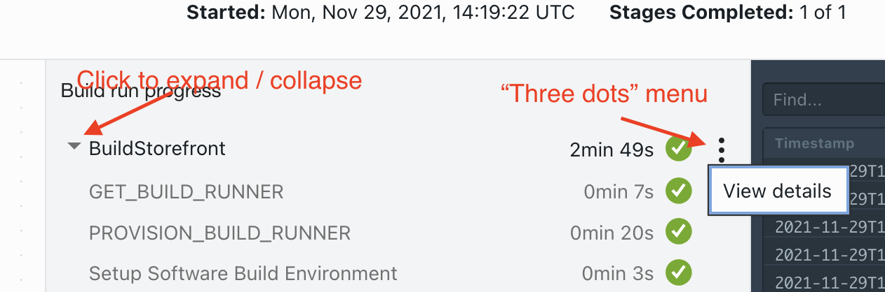
  
  Once in the details page you can click the **Close** button to get rid of it
  
  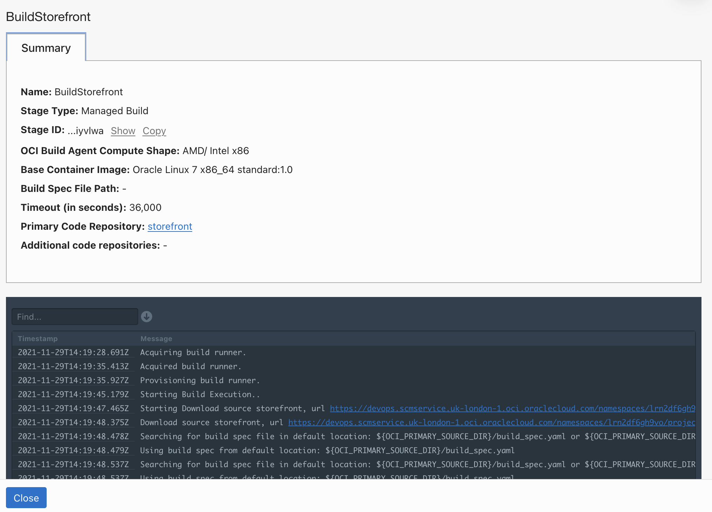

One point here, you can (as long as the logs are preserved - usually that's within the period specified when you Enabled logging for the project (there is a 1 month minimum) go back at any time to look at the output. There are several ways to do this, but if you are already in the build pipeline then the simplest is to click on the **Build History** tab. If this isn't visible (currently it only seems to display if you are not viewing a build run's output) Click the **Build pipeline** tab then the **Build History** should be displayed. 

  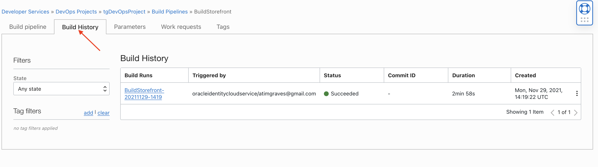

The other way to access the build history is to use the "Breadcrumb" trail at the top of the window and click on your project name, then on the left in the **Resources** section click **Build History** to see the list of **all** builds that have been run in thie project, but just the ones for the specific build pipeline.

  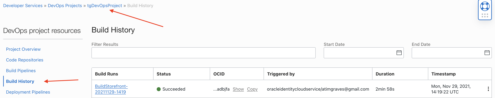

Admittedly at the moment you probably only have a single build, named something like `BuildStorefront-20211101-21-37` If it's not obvious `BuildStorefront` is the build pipeline name, the `20211101` references the date of the build in YYMMDD format and the `21-37` references the time of the build though I personally find looking at the **Timestamp** column to be easier. Also note that the **Triggerd by** column only contains `-`  this indicates a build process you started manually, it's possible (as we shall see later) to automatically trigger a build pipeline based on a git commit, in that case the **Build Runs** column will include the name of the trigger and the **Triggerd by** will contain the OCID of the trigger (the OCID is unique, wheras a name could be re-used, so this makes traceability easier).

Hopefully, unless there was an error in the `build_spec.yaml` file the build will complete, either using the log viewer or if you prefer by downloading to your own machine and opening it there let's have a look at the build log output.

The initial phases cover the creation and allocation of the build runner to the build stage - remember each build stage will have it's own runner.

```
2021-11-29T14:19:28.691Z Acquiring build runner.
2021-11-29T14:19:35.413Z Acquired build runner.
2021-11-29T14:19:35.927Z Provisioning build runner.
2021-11-29T14:19:45.179Z Starting Build Execution..
2021-11-29T14:19:47.465Z Starting Download source storefront, url https://devops.scmservice.uk-london-1.oci.oraclecloud.com/namespaces/lrn2df6gh9vo/projects/tgDevOpsProject/repositories/cloudnative-storefront-helidon, repoId ocid1.devopsrepository.oc1.uk-london-1.amaaaaaak6me2vyajgwoyrekxcjjl7klc2ufq4edp7gt5q2ambuxfp4juoia and ref: my-lab-branch.
2021-11-29T14:19:48.375Z Download source storefront, url https://devops.scmservice.uk-london-1.oci.oraclecloud.com/namespaces/lrn2df6gh9vo/projects/tgDevOpsProject/repositories/cloudnative-storefront-helidon, repoId ocid1.devopsrepository.oc1.uk-london-1.amaaaaaak6me2vyajgwoyrekxcjjl7klc2ufq4edp7gt5q2ambuxfp4juoia and ref: my-lab-branch successful.
2021-11-29T14:19:48.478Z Searching for build spec file in default location: ${OCI_PRIMARY_SOURCE_DIR}/build_spec.yaml or ${OCI_PRIMARY_SOURCE_DIR}/build_spec.yml
2021-11-29T14:19:48.479Z Using build spec from default location: ${OCI_PRIMARY_SOURCE_DIR}/build_spec.yaml
2021-11-29T14:19:48.537Z Searching for build spec file in default location: ${OCI_PRIMARY_SOURCE_DIR}/build_spec.yaml or ${OCI_PRIMARY_SOURCE_DIR}/build_spec.yml
2021-11-29T14:19:48.537Z Using build spec from default location: ${OCI_PRIMARY_SOURCE_DIR}/build_spec.yaml
2021-11-29T14:19:48.538Z Starting PARSE_BUILD_SPEC
2021-11-29T14:19:48.804Z Completed PARSE_BUILD_SPEC
```
Once the build runner is ready then the build runtime does some parsing of the `build_spec.yaml` file. If there is a problem in processing the build spec (e.g. corrupt yaml, or trying to do something like export a vault variable) then it will be flagged here and the build process will stop.

```
2021-11-29T14:19:48.809Z Starting DOWNLOAD_INPUT_ARTIFACTS
2021-11-29T14:19:48.810Z Completed DOWNLOAD_INPUT_ARTIFACTS successfully
```

We then see the build process doing a phase **DOWNLOAD_INPUT_ARTIFACTS** This is basically a empty phase as in our build spec we didn't define any input artifacts, but if there had been multiple build phases in our pipeline (for example creating library files in one build phase, then using them in a subsequent phase) this would allow the import of those artifacts form the previous stage into the current one - that's important because each phase get's it's own brand new runner, which of course initially doesn't know about what has happened in previous stages, so we need a way to transfer resulting artifacts between the stages.

```
2021-11-29T14:19:49.337Z Executing BUILD_SPEC_STEP : Extract Export variables
2021-11-29T14:19:49.338Z Executing step: Extract Export variables with shell type: bash, user: root, timeout: 10000
2021-11-29T14:19:49.600Z EXEC: Path is
2021-11-29T14:19:49.601Z EXEC: /php/php-7.4.23/bin:/usr/share/maven/bin:/usr/local/sbin:/usr/local/bin:/usr/sbin:/usr/bin:/sbin:/bin:/root/bin:/usr/lib/gradle/gradle-7.1/bin:/node/node-v14.17.6-linux-x64/bin:/golang/go/bin
2021-11-29T14:19:49.601Z EXEC: JAVA_HOME is
2021-11-29T14:19:49.602Z EXEC: javahome
2021-11-29T14:19:49.602Z EXEC: Extracting export variables
2021-11-29T14:19:49.617Z EXEC: STOREFRONT_VERSION:  1.0.0
2021-11-29T14:19:49.617Z EXEC: image will be stored to ///storefront:1.0.0
2021-11-29T14:19:49.618Z EXEC: transferring the OCIR_HOST and OCIR_STORAGE_NAMESPACE vault variables
2021-11-29T14:19:49.618Z EXEC: OCIR_HOST is lon.ocir.io
2021-11-29T14:19:49.618Z EXEC: OCIR_STORAGE_NAMESPACE is lrn2df6gh9vo
2021-11-29T14:19:49.641Z BUILD_SPEC_STEP : Extract Export variables execution completed.
```

Now we see the actual build steps we defined start running, these are executed in the order defined in the `build_spec.yaml` file, so the first stage is `Extract Export variables` We can see it displaying the various variables we used `echo` for in the buld step, along with the `STOREFRONT_VERSION:` being set to a value that the script extracted from the source code (`1.0.0` which is what we updated the version to)


```
2021-11-29T14:19:49.643Z Executing step: Install local JDK11 with shell type: bash, user: root, timeout: 10000000
2021-11-29T14:19:54.681Z EXEC: total 183220
2021-11-29T14:19:54.682Z EXEC: drwxr-xr-x. 8 root root      4096 Nov 29 14:19 jdk-11
2021-11-29T14:19:54.682Z EXEC: -rw-r--r--. 1 root root 187611826 Aug 23  2018 openjdk-11+28_linux-x64_bin.tar.gz
2021-11-29T14:19:54.683Z EXEC: Path is
2021-11-29T14:19:54.683Z EXEC: /root/InstalledSoftware/jdk-11/bin:/php/php-7.4.23/bin:/usr/share/maven/bin:/usr/local/sbin:/usr/local/bin:/usr/sbin:/usr/bin:/sbin:/bin:/root/bin:/usr/lib/gradle/gradle-7.1/bin:/node/node-v14.17.6-linux-x64/bin:/golang/go/bin
2021-11-29T14:19:54.684Z EXEC: JAVA_HOME is
2021-11-29T14:19:54.684Z EXEC: /root/InstalledSoftware/jdk-11
2021-11-29T14:19:54.744Z EXEC: openjdk version "11" 2018-09-25
2021-11-29T14:19:54.745Z EXEC: OpenJDK Runtime Environment 18.9 (build 11+28)
2021-11-29T14:19:54.746Z EXEC: OpenJDK 64-Bit Server VM 18.9 (build 11+28, mixed mode)
2021-11-29T14:19:54.803Z BUILD_SPEC_STEP : Install local JDK11 execution completed.
```
A little further down we see the output for the `Install local JDK11` stage, her we can see the output of the commands used to download and install the version of the JDK we wish to use, along with some confirmation output including the updated `PATH` variable, the value assigned to `JAVA_HOME` the output form `java --version` and so on.

```
2021-11-29T14:19:55.509Z Executing BUILD_SPEC_STEP : Build Source and pack into container image
2021-11-29T14:19:55.510Z Executing step: Build Source and pack into container image with shell type: bash, user: root, timeout: 400000
2021-11-29T14:19:55.936Z EXEC: Running maven package - Working in /workspace/storefront/helidon-storefront-full
2021-11-29T14:19:57.404Z EXEC: [INFO] Scanning for projects...
2021-11-29T14:19:57.789Z EXEC: Downloading from central: https://repo.maven.apache.org/maven2/io/helidon/applications/helidon-mp/2.3.4/helidon-mp-2.3.4.pom
2021-11-29T14:19:58.072Z EXEC: Progress (1): 2.7/6.2 kB
2021-11-29T14:19:58.100Z EXEC: Progress (1): 5.5/6.2 kBProgress (1): 6.2 kB                        Downloaded from central: https://repo.maven.apache.org/maven2/io/helidon/applications/helidon-mp/2.3.4/helidon-mp-2.3.4.pom (6.2 kB at 20 kB/s)Downloading from central: https://repo.maven.apache.org/maven2/io/helidon/applications/helidon-applications-project/2.3.4/helidon-applications-project-2.3.4.pom
2021-11-29T14:19:58.107Z EXEC: Progress (1): 2.7/10 kB
2021-11-29T14:19:58.131Z EXEC: Progress (1): 5.5/10 kBProgress (1): 8.2/10 kBProgress (1): 10 kB  
...
...
...
Lot's and lot's of Maven output         
```

The next stage contains a lot of output - it's actually executing the build process and as it useds Maven to do this we get all of the output from the `mvn` command as it downloads first it's own jar files, then the ones specified in the `pom.xml` file for building the image and the jar files to run `jib` which packages the resulting code into a container image. This is a *lot* of output and makes up date build of the output for this stage.

Rather than going through the output page by page in the log viewer just use the scroll bar (or whatever navigation option you chose if looking at this on your own machine) to go to the bottom of the output.

```
2021-11-29T14:21:01.937Z Starting SAVE_OUTPUT_ARTIFACTS
2021-11-29T14:21:32.043Z Artifact storefront_container_image in build spec file with location storefront:latest successfully saved.
2021-11-29T14:21:32.075Z Artifact service_yaml in build spec file from location ${OCI_PRIMARY_SOURCE_DIR}/helidon-storefront-full/yaml/deployment/serviceStorefront.yaml successfully saved.
2021-11-29T14:21:32.103Z Artifact ingressRules_yaml in build spec file from location ${OCI_PRIMARY_SOURCE_DIR}/helidon-storefront-full/yaml/deployment/ingressStorefrontRules.yaml successfully saved.
2021-11-29T14:21:32.131Z Artifact deployment_yaml in build spec file from location ${OCI_PRIMARY_SOURCE_DIR}/helidon-storefront-full/yaml/deployment/storefront-deployment.yaml successfully saved.
2021-11-29T14:21:32.132Z Completed SAVE_OUTPUT_ARTIFACT
```

Here you will see the output of the phase `SAVE_OUTPUT_ARTIFACTS` if you don't see this then you may need to scroll up a little in the log output (it should be within around 5-15 lines from the bottom of the output for this stage)

This phase is the build runner copying the artifacts that we specified in the `outputArtifacts` section of the `build _spec.yaml` out of the build runner and storing them somewhere so they can be picked up by the next stage (I'm guessing they are stored in bit of objects storage private to the build process, but it doesn't really matter) the artifact names are the ones you specified in the `outputArtifacts` section and *must* match the names you use for the artifact in subsequent build phases.

```
2021-11-29T14:21:32.132Z Starting SAVE_EXPORTED_VARIABLES [OCIR_STORAGE_NAMESPACE, OCIR_HOST, STOREFRONT_VERSION]
2021-11-29T14:21:32.167Z Completed SAVE_EXPORTED_VARIABLES
2021-11-29T14:22:02.517Z Completed Build stage.
```

Lastly we see the phase `SAVE_EXPORTED_VARIABLES` This phase is extracting the variables that we specified in the `vars.exportVariables` section in the `build_spec.yaml` file, as tith the output artifacts if we didn't do this they would die when the stage completes (along with everything else not copied out of the the build runner). By requiring the explicit identification of the output from a build stage we avoid polluting subsequent stages with unexpected artifacts and variables - and remember that the people designing one build stage may be different than those designing another, so coordination between the teams designing a build phase is essential to ensure that the expected variables and artifacts (and only those) are transfered between stages.

## End of the Module, what's next ?

So we've seen how to setup the build pipeline and how the `build_spec.yaml` is processed by the build runner, but all this has done is shown us the compilation process and how to look at the results. The next stage is to look at how to get the artifacts we have created out of the pipeline and into a longer term storage so they can be used for a deployment.

## Acknowledgements

* **Author** - Tim Graves, Cloud Native Solutions Architect, EMEA OCI Centre of Excellence
* **Last Updated By** - Tim Graves, November 2021