# Creating a deployment pipeline

## Introduction

We're got our build process running, and have saved the artifacts it outputs, we could of course now manually deploy it (or use other tools like ArgoCD) but as the DevOps service includes other tooling to manage deployments we are going to use that, with the additional benefit that DevOps continuous deployment tooling is integrated with the continuous integration tooling we've just been using. 

In this deployment section we will create a deployment pipeline which will deploy the Storefront service (in the artifacts we've just built) into the OKE environment, replacing the one that already exists in the OKE cluster.

<details><summary><b>Why are we not using the deployment pipelines to deploy the entire services stack ?</b></summary>

There are a few reasons which relate that we are working in a lab that is composed of multiple modules. 

Firstly there are several elements to the already existing deployment (for example the database wallet secrets) which are unique to each user and are potentially shared across services. While we absolutely could setup vault secrets with each of files in the database wallet and then setup a config map that of course would result in the vault secrets being tied to the deployment (and having to maintain and update them as the database access credentials changed over time)

The next reason is that the configuration information may well need to be updated independently of deploying new versions of the code, for example configuring destinations for tracing.

Another reason specifically to do with the database is that with the Oracle Service Operator for Kubernetes you would dynamically retrieve the database configuration, and thus there would be no need to bring it in as part of each individual deployment, admittedly the service operator manifest used to identify the database could be part of a deployment.

However for this lab the main reason is that this lab is part of a larger set of interconnected labs, and in those we show how to install the database credentials as a Kubernetes secret, and I need to maintain consistency between the labs.

---

</details>

### Objectives

Using the OCI Browser User Interface we will :

  - Create a deployment environment.

  - Create a deployment pipeline.
  
  - Add deployment stages to deploy the artifacts
  
  - Integrate the build and deployment pipelines
  
  - Run a test build
  
  - Test the updates are deployed.

 
### Prerequisites

You have your basic build pipeline running the build process and generating output artifacts, you have the deployment environment created and running it's initial services (storefront and stock manager).

## Task 1: Creating the deployment environment

Before we can create a deployment pipeline we need to create a target for the deployment, this is called an environment. The OCI DevOps service can currently deploy into instance groups (VM / Bare metal), Oracle Functions and Oracle Kubernetes Engine. In this lab we're going to use OKE.
 
 1. Navigate to your devops projects home page, Click the "Hamburger" menu select **Developer Services** Click **Projects** (Under DevOps) then Chose your project from the list
 
 
 
 2. In the **Resources** menu on the left of the page click **Environments** to go to the Environments page
 
 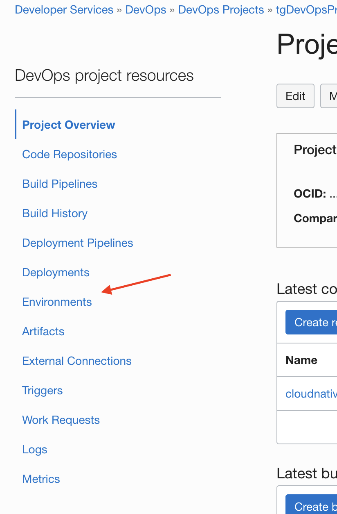
 
 3. Click the **Create environment** to open the Create environment form
 
 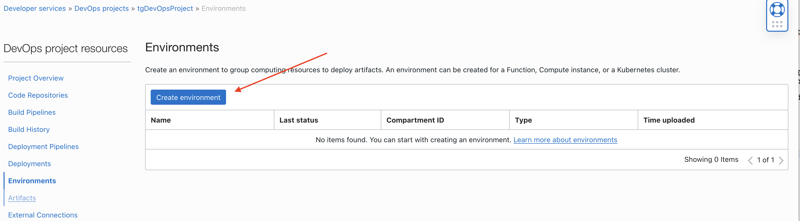
 
 4. Select **Oracle Kubernetes Engine**, Name this `<YOUR INITIALS>`_OKE in my case that's going to be `TG_OKE` but of course you probably have different initials than I do, so remember to use yours! If you like add a description of your choice. Click **Next** at the bottom of the form to progress to the next page.
 
 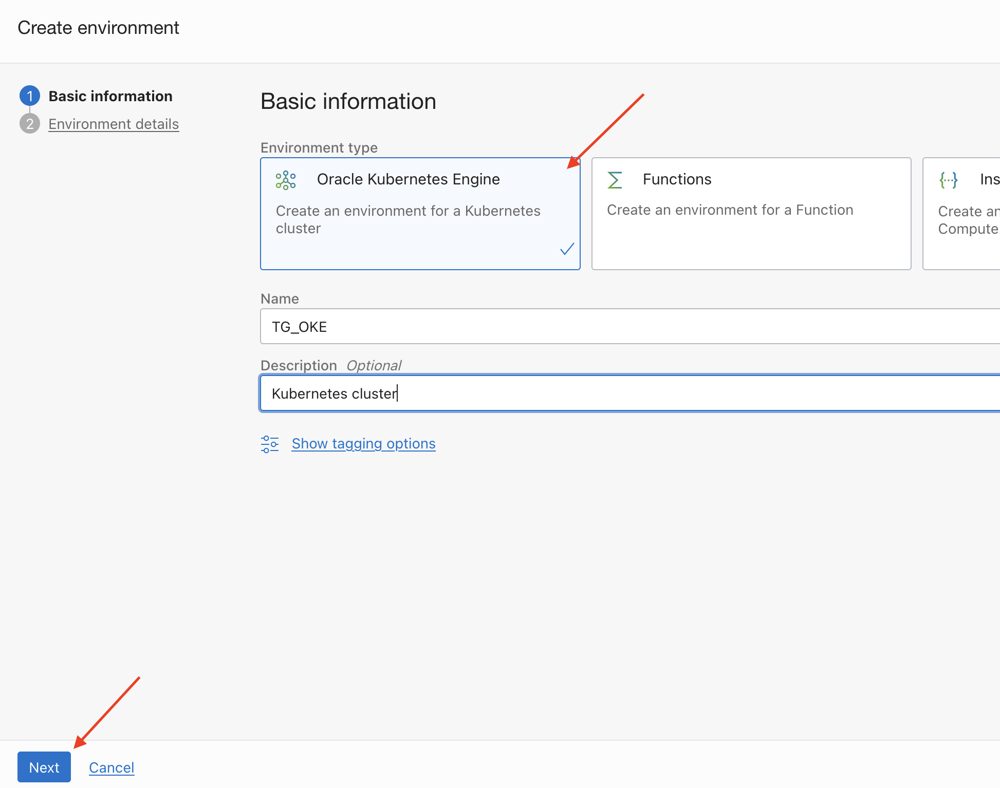
  
 5. On the **Environment details** page select the region your OKE cluster is in, this is probably the region you're already using and it may already have been selected as the default, Check that the **Compartment** is the compartment you are using for the OKE cluster - this should be the same as the one you're using for this lab, Click `Select a cluster` in the **Cluster**  field and chose your OKE cluster, remember that in some labs there may be multiple people using the same environment, so be sure to double check it's your cluster, not someone elses. Click **Create environment** at the bottom of the page, after a short while you will be taken to the page for this environment.
 
 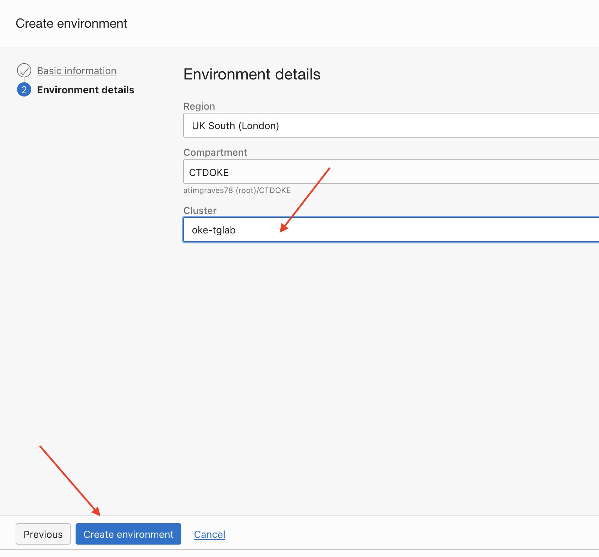
 
 6. Return to your projects home page (The easiest way to do this is using the navigation trail at the top of the page and just clicking on your projects name, `tgDevOpsProject` in this case, but yours will probably be different)
 
 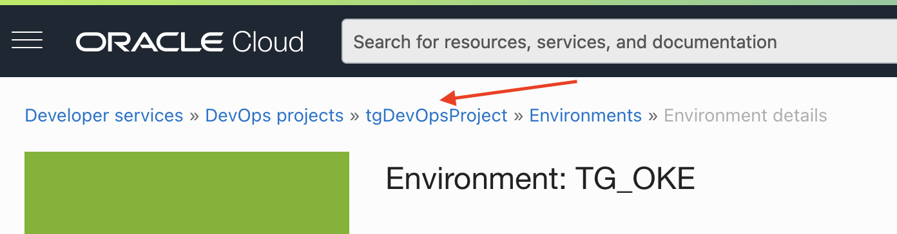
 
## Task 2: Creating the deploment pipeline

Now we have an environment we can start to build the deployment pipeline it will target.
 
 1. In the left menu (Resources) click on **Deployment Pipelines**
 
 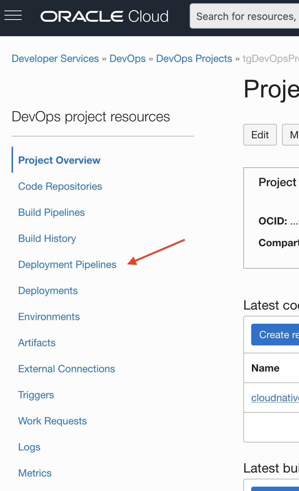
 
 2. On the Deployment pipelines page click **Create pipeline** to access the create pipeline form
 
 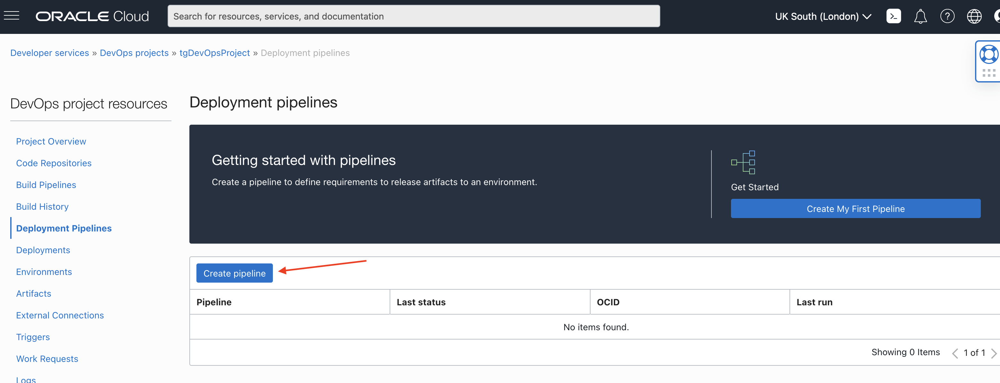
 
 3. In the Create pipeline popup window Name your pipeline `StorefrontDeploy`. Give it a description if you want.Ensure that the pipeline type is **Create a deployment** (currently there is only one option anyway, so this should be selected). Click the **Create pipeline** button at the bottom to create the pipeline and take you to it's page.
 
 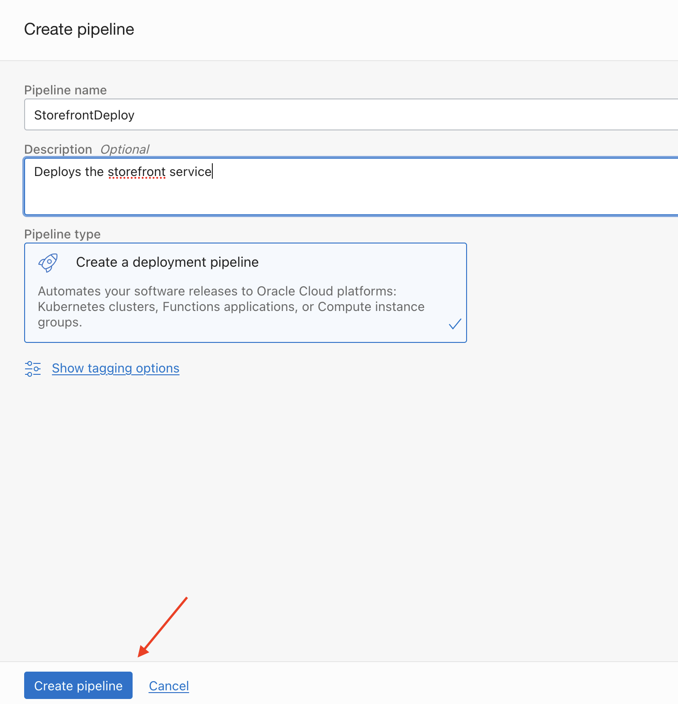
 
## Task 3: Add deployment stages to deploy the artifacts

We are going to create two deployment stages to deploy the storefront project.

The first stage will do the actual OKE deployment, 

The second stage will create an OKE service object that matches to the deployment, this is done after the deployment is complete to ensure that there is something to send requests to.

The last stage will apply the Kubernetes manifest to create the ingress rule. As the ingress rule will route traffic using the service object. We do this once the service and deployment are in place so the ingress rule has something to forward requests to.

### Task 3a: Adding the deployment stage

  1. Once you are on the Deployment pipeline page make sure you are on the **Pipeline** tab, then click the **+** button. In the popup menu click **Add Stage** to open the Add stage form
  
  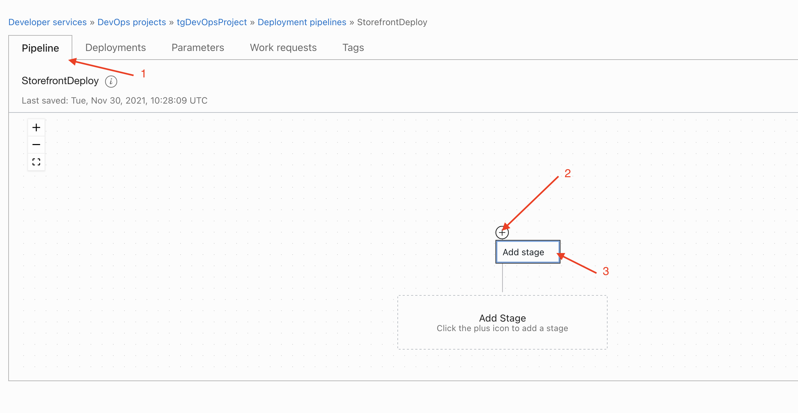

  2. In the **Deploy** Section click **Apply manifest to your Kubernetes Cluster** then click **Next** at the bottom of the add stage form.
  
  

  3. Name this stage `StorefrontDeployDeployment` (it's unwieldy I know, but like good variable names it's helpful to name things by their use). Add a description if you wish. In the **Environment** field select the environment you created earlier (`TG_OKE` in my case, yours will probably be different) this is the environment the stage will deploy to. Click the **Select Artifact** button.
  
  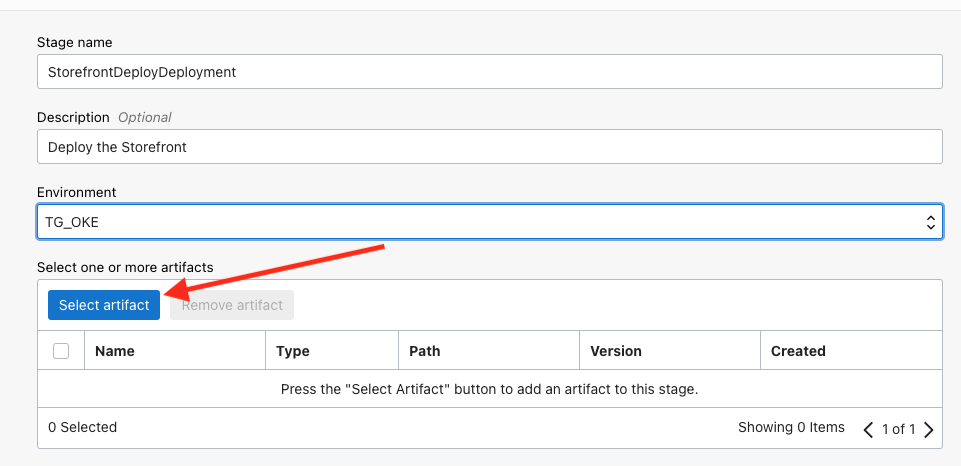

 4. In the resulting popout form select StorefrontDeploymentYAML - notice that this has it's version specified as `${STOREFRONT_VERSION}` This will be substituted with the value of the variable which will come from the build pipeline phase when we have it trigger the deploy. Click the **Save changes** button
 
 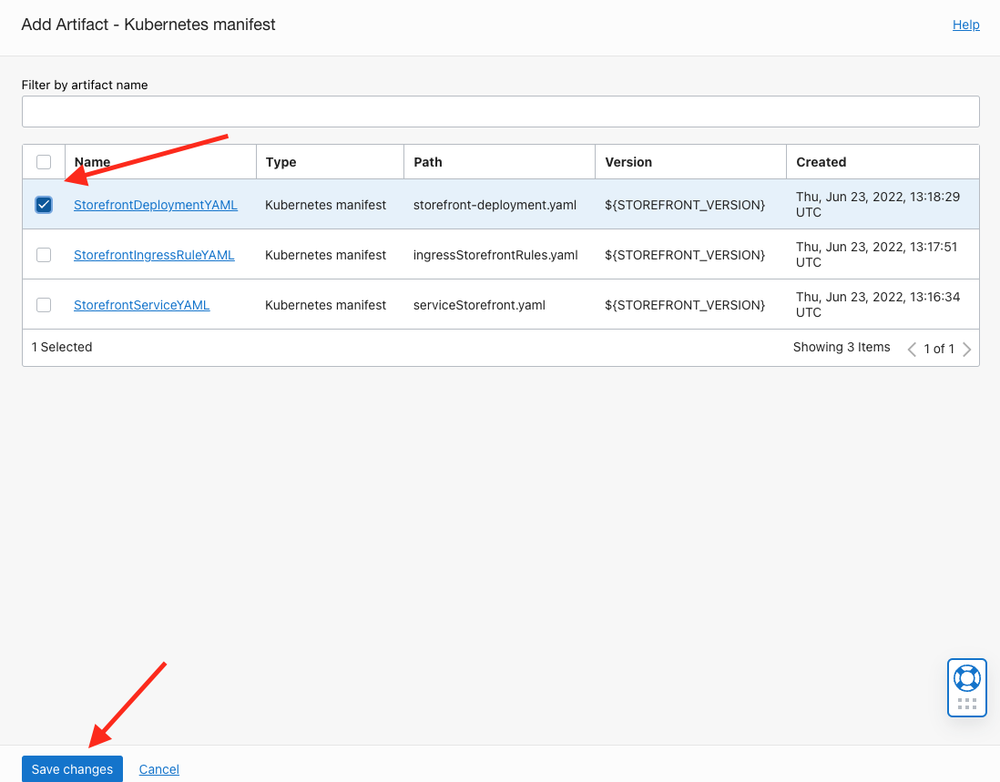

  5. Now we're back on the stage form, Leave the **Override Kubernetes namespace** field blank (the YAML files will set this using a build pipeline parameter). Set the **If validation fails, automatically rollback to the last successful version** option to be `Yes`. Click the **Add** button at the lower left of the page, this will add the stage and return to the pipeline designer.
  
  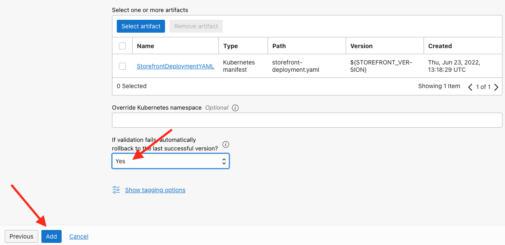
  
  Our new stage has been added to the pipeline

  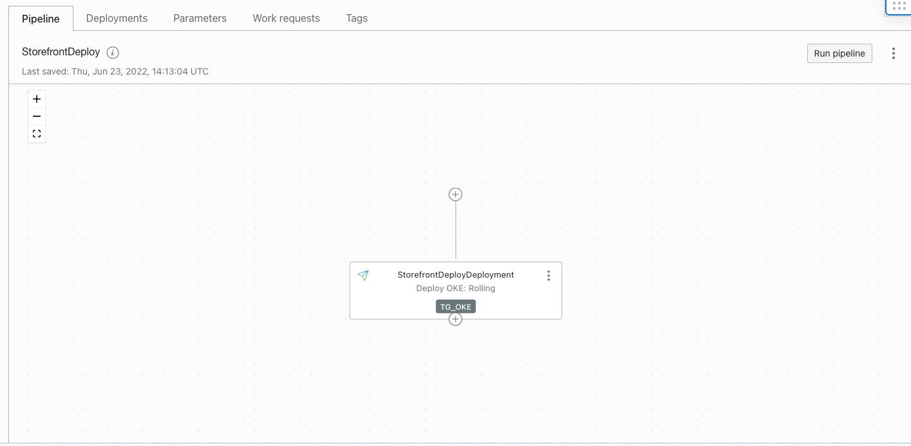
  
### Task 3b: Adding the service stage

  1. Now we're going to add a Kubernetes service, amongst other things a service sets up the internal DNS to allow the deployment to be located. Make sure you are on the **Pipeline** tab, then click the **+** button at the bottom of the deploy stage you just added. In the popup menu click **Add Stage** to open the Add stage form
  
  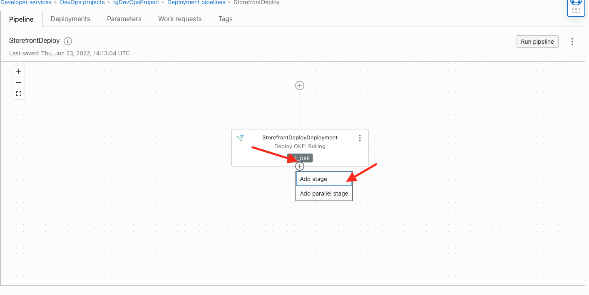

  2. In the **Deploy** Section click **Apply manifest to your Kubernetes Cluster** then click **Next** at the bottom of the add stage form.
  
  

  3. Name this stage `StorefrontServiceDeployment` . Add a description if you wish. In the **Environment** field select the environment you created earlier (`TG_OKE` in my case, yours will probably be different). Click the **Select Artifact** button.
  
  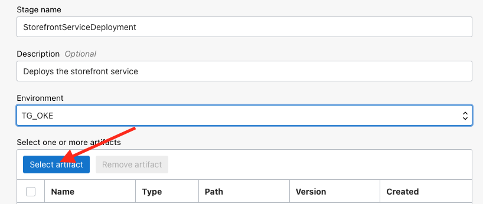

 4. In the resulting popout form enter `Service` in the **Filter by artifact name** field - the list of artifacts will update and only artifacts that contain the works `Service` will be shown - filtering is useful to help you find artifacts easily if you have a long list of them. select StorefrontServiceYAML.s with the deployment YAML this also has it's version specified as `${STOREFRONT_VERSION}`. Click the **Save changes** button
 
 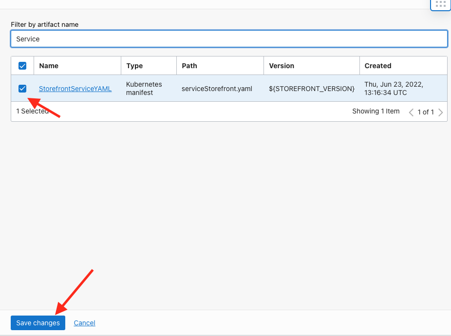

  5. Now we're back on the stage form, Leave the **Override Kubernetes namespace** field blank (the YAML files will set this using a build pipeline parameter). Set the **If validation fails, automatically rollback to the last successful version** option to be `Yes`. Click the **Add** button at the lower left of the page, this will add the stage and return to the pipeline designer.
  
  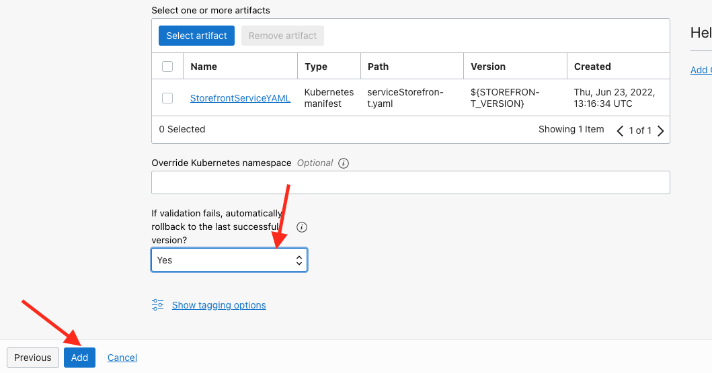
  
  Our new stage has been added to the pipeline

  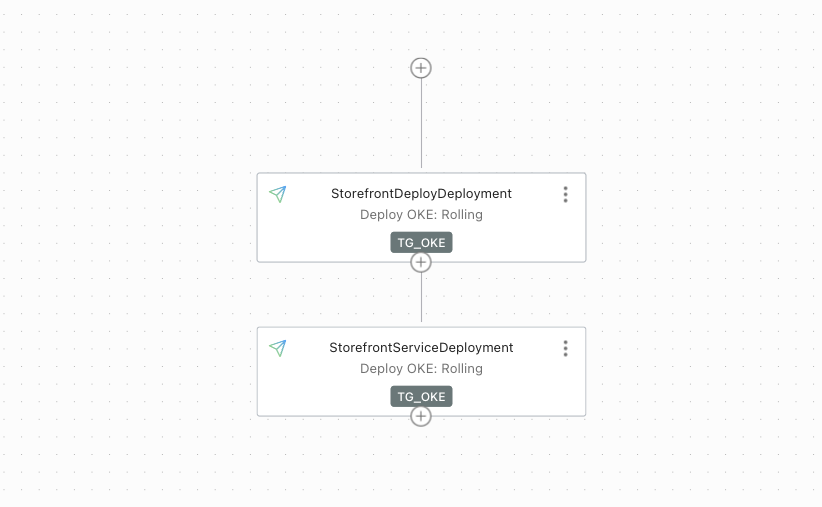


### Task 3c: Adding the ingress rules stage

The stages that apply the manifests for the deployment and service will wait for their actions to complete before handing on  control to the next stage, so once they are done we know that they have been rolled out

Let's add a stage that will deploy the ingress rule to the OKE cluster.

  1. **Below** the stage we just added click the **+** symbol, Then in the menu select **Add stage**
  
  

  2. In the **Deploy** Section click **Apply manifest to your Kubernetes Cluster** then click **Next** at the bottom of the add stage form.
  
  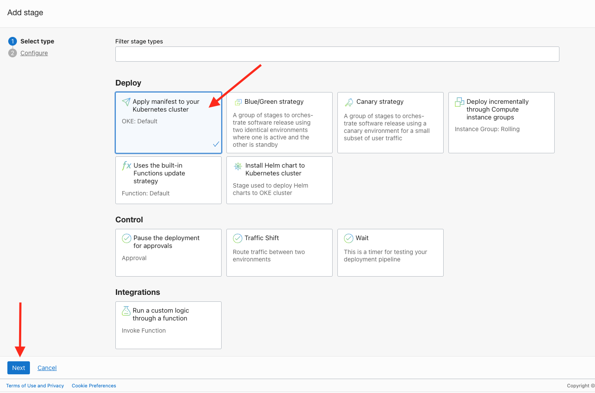

  3. In the form Name this stage `StorefrontIngressDeployment`, Add a description if you wish. In the **Environment** field select the environment you created earlier (`TG_OKE` in my case, yours will probabaly be different) Click the **Select Artifact** button 

 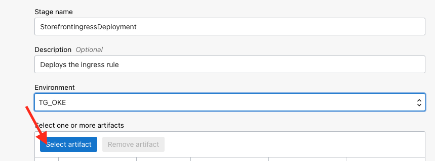
 
 4. In the resulting popout form select `StorefrontIngressRuleYAML` (use the filter if you like) - as with the deployment and service this also uses `${STOREFRONT_VERSION}` to ensure we get the appropriate version for the deployment. Click the **Save changes** button.
 
 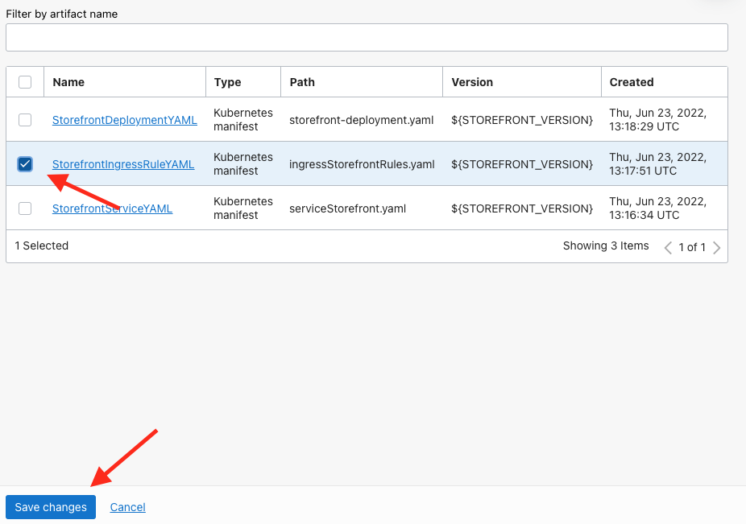

  5. On returning to the stage definition form Leave the **Override Kubernetes namespace** field blank (the YAML files will set this). Set the **If validation fails, automatically rollback to the last successful version** option to be `Yes`. Click the **Add** button at the lower left of the page
  
  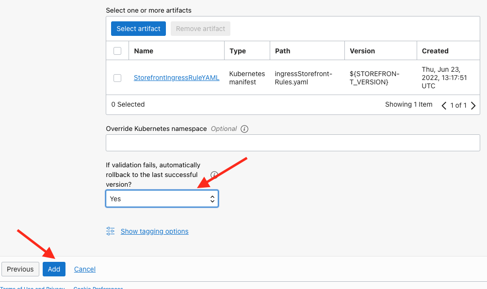
  
  You've now setup all three stages. 
  
  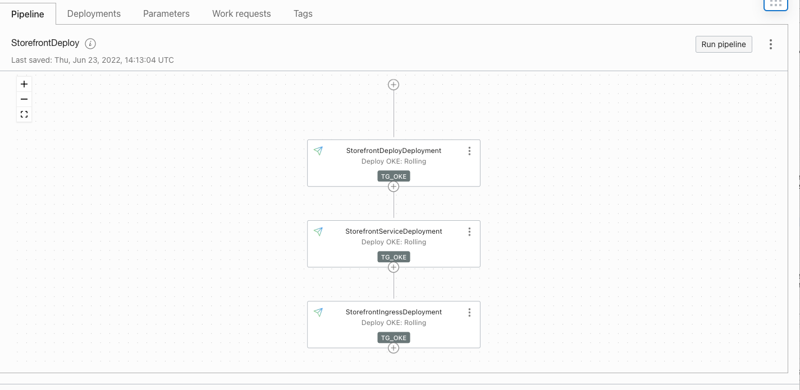

<details><summary><b>What about the container image ?</b></summary>

We don't need to add the container image here as it's specified in the deployment file, with suitable parameters to set the location and version information (which will be substituted during the deployment). So by deploying the deployment manifest we are automatically applying the container image.

---
</details>
<details><summary><b>What are the other stage types ?</b></summary>

Note - other types of stage are :
Deploy types Deploy to Oracle Functions and OCI Instance groups (this allows for deployment into virtual machines and bare metal services)
Control types : Pause the deployment for approvals  - allow for a manual approval stage (perhaps to confirm before deploying to a production environment) 
Traffic Shift - when used with a multiple deployment environments with a front end load balancer can gradually shift traffic from one back end to another enabling a controlled roll-out
Wait - introduces a delay in the pipeline running, perhaps to enable long running activities in a previous stage to complete
Integrations types : Run a custom logic through a function allows you to trigger external code running using the Oracle Functions service, this could do pretty much anything, for example examining the results of a container image scan to ensure there are no critical vulnerabilities discovered before processing, or simply triggering an async action to record details of the process

---
</details>

## Task 4: The deploy pipeline parameters

Now we have our deployment pipeline ready to run, but there are a couple of parameters that we need, specifically `KUBERNETES_NAMESPACE` and `EXTERNAL_IP` Those are very specific to deployments into OKE, and are not set in the build pipeline - We need to set them.

  1. First we are going to gather the information we need. There are to possible ways to do this depending on how you setup your microservices in Kubernetes, please open the expansion section below that matches the approach you took for instructions
  
<details><summary><b>If you used the automated scripts in the kubernetes-lab directory to setup the microservices in Kubernetes</b></summary>

  - Open the OCI cloud shell 

The automated scripts will create a script file `$HOME/clusterSettings.one` this can be executed using the shell built in `source` to set the EXTERNAL_IP variable for you.

  ```bash
  <copy>source $HOME/clusterSettings.one</copy>
  ```
  
```
EXTERNAL_IP set to 139.185.45.98
NAMESPACE set to tims
```

  Of course the actual IP address and namespace will almost certainly be different from the example here !
  
---

</details>

<details><summary><b>If you manually setup the Kubernetes namespace and ingress services using helm</b></summary>

In this case as you manually set this up you will need to get the information from Kubernetes itself


  - Open the OCI cloud shell 

  - You are going to get the value of the `EXTERNAL_IP` for your environment. This is used to identify the DNS name used by an incoming connection. In the OCI cloud shell type

  ```bash
  <copy>kubectl get services -n ingress-nginx</copy>
  ```

```
NAME                                 TYPE           CLUSTER-IP      EXTERNAL-IP      PORT(S)                      AGE
ingress-nginx-controller             LoadBalancer   10.96.182.204   130.162.40.241   80:31834/TCP,443:31118/TCP   2h
ingress-nginx-controller-admission   ClusterIP      10.96.216.33    <none>           443/TCP                      2h
```

  - Look for the `ingress-nginx-controller` line and note the IP address in the `EXTERNAL-IP` column, in this case that's `130.162.40.121` but it's almost certain that the IP address you have will differ. IMPORTANT, be sure to use the IP in the `EXTERNAL-IP` column, ignore anything that looks like an IP address in any other column as those are internal to the OKE cluster and not used externally. 

  - IN the OCI CLoud shell type the following, replacing `[external ip]` with the IP address you retrieved above.
  
  ```
  export EXTERNAL_IP=[external ip]`
  ```
  
  Now we are going to get the namespace used by your current deployments, as we are going to be replacing an existing deployment it's critical that we get this correct. When you did the original Kubernetes lab, you specified this when you created the namespace.

  - List all of the Kubernetes namespaces so identify the one you created. In the OCI Cloud Shell type

  ```bash
  <copy>kubectl get namespaces</copy>
  ```

```
NAME              STATUS   AGE
default           Active   13d
ingress-nginx     Active   13d
kube-node-lease   Active   13d
kube-public       Active   13d
kube-system       Active   13d
tims              Active   13d
```

In this case the namespace I created is `tims`. If you are in doubt as to which namespace in the list relates to you please ignore any namespace starting with `kube`, `ingress`, and `default`. If you have done the Kubernetes lab and completed the other optional modules you may also have namespaces for `logging`, `monitoring` or starting with `linkerd` ignore those as well.
  
</details>


Now we have the values for our parameters we will go and set them in the Deployment pipeline. We're doing this really to show that the deploy pipeline supports parameters, we could have set them on the build pipeline.

  2. In the Deploy pipeline editor page click the `Parameters` tab to access the parameters form.
  
  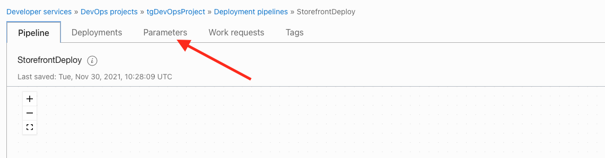

  3. First we will define the `EXTERNAL_IP` parameter, In the **Name** field enter `EXTERNAL_IP` In the **Default Value** field enter the IP address for the ingress-controller you retrieved above. In the **description** field enter `Ingress controller external IP` (For some reason in this case you have to specify a description). Click the **+** button to save this parameter

  In this screenshot the IP address I used is of course for my deployment, yours will almost certainly differ.

  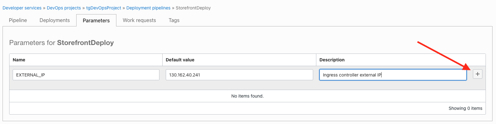

<details><summary><b>Why do we need the IP address ?</b></summary>

Normally a DNS name would not include an IP address, but setting up a DNS entry requires several steps, many of which take time, and then setting up a security certificate using it can take longer, especially if you need to prove that you have the authority from your organization do get certificates in their name. 

Because of this in the OKE labs we use a DNS service called nip.io This is basically a special DNS server that doesn't hold any DNS to IP mappings at all, what it does do is look for an IP address in the DNS name it's asked to resolve, and it then returns that as if it were a real DNS mapping. For example if asked to resolve a DNS name of `myservice.123.456.789.123.nip.io` you will have `123.456.789.123` returned for the IP address.
 
Doing this does however mean that you do need to include the IP address in the DNS name. As an ingress rule uses DNS names to determine which security certificate to use for the incoming connection, and what hostnames to use when determining where to send an incoming request that of course means that we will need to update the artifact containing the ingress rule (`StorefrontIngressRuleYAML` in this case) with the IP address

---
</details>

  
  4. Now we will create a parameter for the Kubernetes namespace the manifests use to specify where the deployment will go. In the **Name** field enter `KUBERNETES_NAMESPACE` In the **Default value** field enter the namespace you identified above for your deployments (in my case that's `tims` yours will be different). In the **Description** field enter `OKE Deployment namespace` Click the **+** button.

  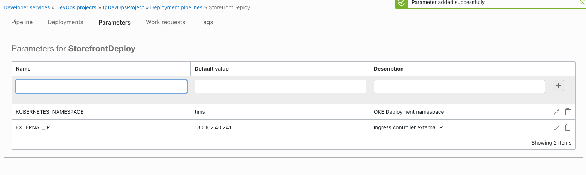
  
<details><summary><b>What happens if the same parameter is defined in both pipelines ?</b></summary>

If a parameter is defined in both the build and a deploy pipeline it triggers then the value from the build pipeline takes priority.

---
</details>

## End of the Module, what's next ?

In the next module we will look at how to have a successful build trigger the deployment pipeline we have just created.

## Acknowledgements

* **Author** - Tim Graves, Cloud Native Solutions Architect, Oracle EMEA Cloud Native Application Development specialists Team
* **Last Updated By** - Tim Graves, May 2023
