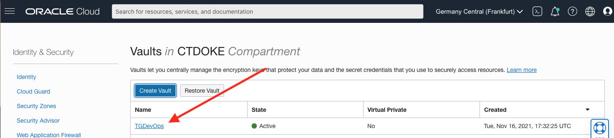
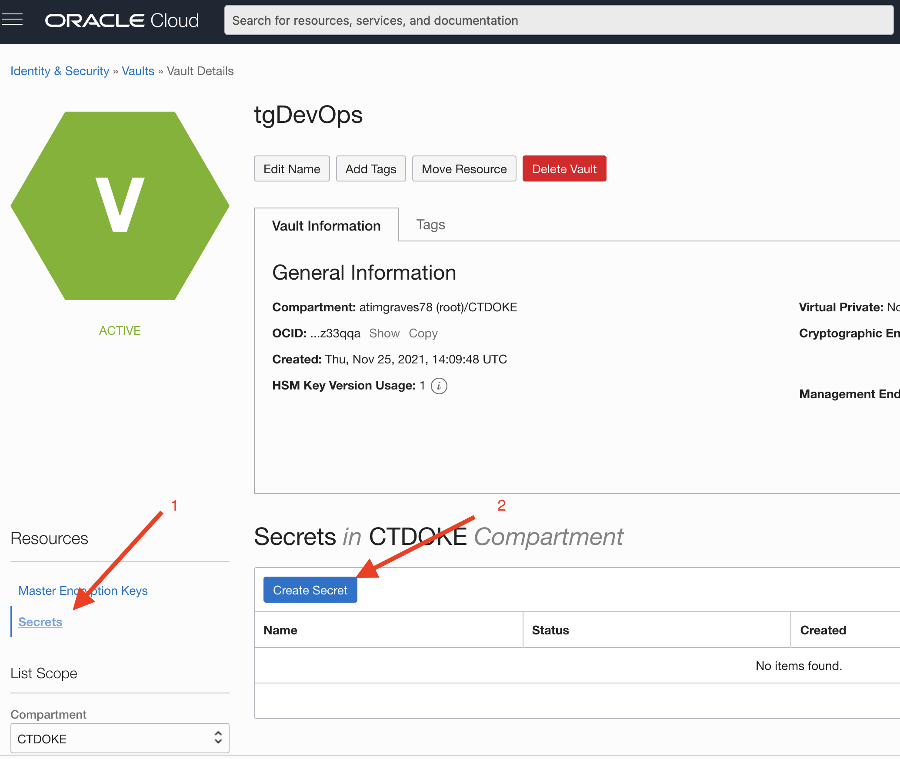
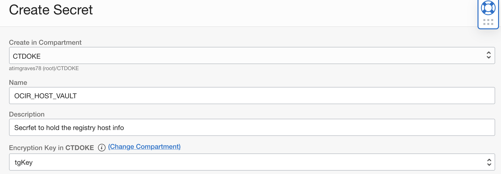
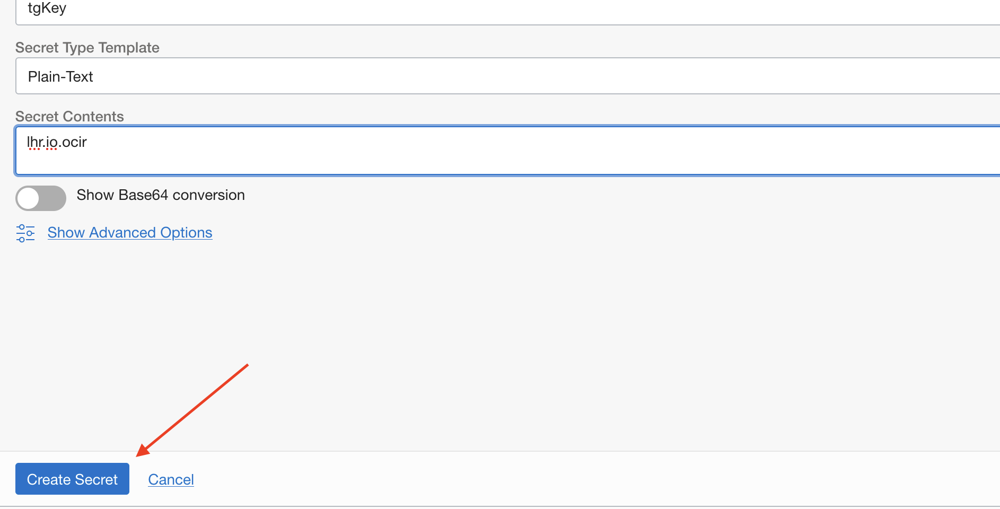
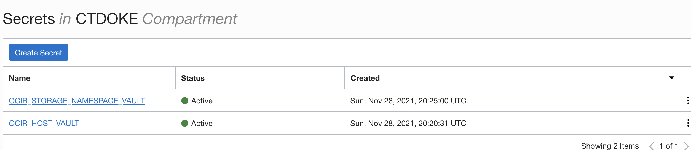
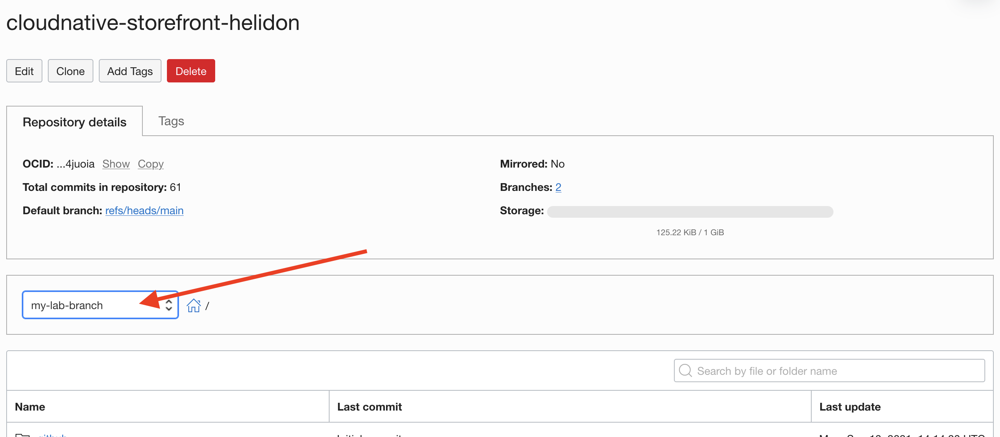
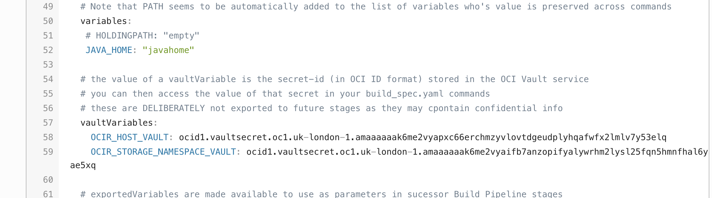

# DevOps The Build spec, what is it and what does it do ?

## Introduction

To build code we generally need a set of instructions that tells ue what to build. In the good old days this would have been something called a makefile, but over the years many different build tools and processes have evolved, some of which use graphical build tools, and others still using a text file.


### Objectives

Using the OCI Cloud shell and Browser User Interface we will :

  - Look at the build_spec.yaml file and understand it's structure.

  - Update the build_spec.yaml locally with vault variables
  
  - Change the version number in StatusResource.java
  
  - Use Git to upload the changed build_spec.yaml and StatusResource.java to the git repo in your devops project
  
 
### Prerequisites

Ensure that you have Created your Kubernetes environment, your devops project, your OCI code repo and uploaded the sample code.

## Task 1: Exploring the build_spec.yaml

  1. Open the OCI Code repo (called `cloudnative-storefront-helidon`) you created in your project, navigate to the `helidon-storefront-full/yaml/build` directory, open the `build_spec.yaml` file
  
  2. Scroll down past the Copyright text

Let's explain the build pipeline, this is sadly in YAML (I loathe YAML because it's whitespace sensitive, virtually every problem I've had with a YAML file has been because of that, it'a like going back to my very early days of programming at university when I had to use punch cards for Fortran before being allowed to use the CRT terminals - but at least punch cards always reserved 8 characters for the line number and didn't vary that indentation) 

### General header

```yaml
version: 0.1

component: build

timeoutInSeconds: 6000

runAs: root

shell: bash
```

This content provides the basic information needed by the build system, defining the version of the build spec used, how long the entire build process should take before being stopped, the user running the build (at the time of writing this is limited to root) and what shell should be used when execuring commands.
 
### Environment / Variables

In the `env` block we have three sections, `variables`, `vaultVariables` and `exportedVariables`

#### The variable block 

```yaml
  variables:
   JAVA_HOME: "javahome"
```

The variables specified in this section persist across build steps, but not across pipeline stages unless explicitly exported, this allows you to set a variable (for example the setting the location of the JDK when installing it) and reuse that later in another part of the build_spec.

#### The vaultVariables block

```yaml
  vaultVariables:
    OCIR_HOST_VAULT: Needs your host secrets OCID
    OCIR_STORAGE_NAMESPACE_VAULT: Needs your storage namespace OCID
 ```
The vaultVariables are replaced with the content of the vault secrets we will setup soon, these also persist across steps, but they cannot be exported outside the build_spec to prevent leakage of confidential information like logins and so on that are often stored in these variables. The "Needs ... OCID" text is just a placeholder for now, later in this module we will setup the variables in the vauld and will replace the placeholder text with the OCID of the vault secrets.


#### The exportedVariables block

```yaml
  exportedVariables:
    - STOREFRONT_VERSION
    - OCIR_HOST
    - OCIR_STORAGE_NAMESPACE
```

The exportedVariables are passed out of the build process to the following stages, ONLY variables named here are exported, so if you want a standard variable to be exported to a subsequent build stage you need to specify it here.

A variable defined here is automatically transfered between build stages as if it were defined in the `variables:` block.

You can't export a vaultVariable for security reasons, so if you want to do that you have to crate another variable to export, then in one of the stages transfer the values over. This is why there is a vaultVariable names `OCID_HOST_VAULT` and an exportedVariable called `OCIR_HOST`

Note that it's also possible to define parameters that you can set when the pipeline is run, those are processed as ${VARIABLE_NAME} we'll look at how to set them up later on

### The Steps section

```yaml
steps:        
  - type: Command
    name: "Extract Export variables"
    timeoutInSeconds: 10
    command: |
      echo Path is
      echo $PATH
      echo JAVA_HOME is
      echo $JAVA_HOME
      cd ${OCI_PRIMARY_SOURCE_DIR}
      echo Extracting export variables - Working in `pwd`
      export STOREFRONT_VERSION=`grep "VERSION = " helidon-storefront-full/src/main/java/com/oracle/labs/helidon/storefront/resources/StatusResource.java  | awk '{print $7}' | sed -e 's/"//g' -e s'/;//'`
      echo "STOREFRONT_VERSION: " $STOREFRONT_VERSION
      echo image will be stored to ${OCIR_HOST}/${OCIR_STORAGE_NAMEPACE}/${YOUR_INITIALS}/storefront:${STOREFRONT_VERSION}
      echo transferring the OCIR_HOST and OCIR_STORAGE_NAMESPACE vault variables
      export OCIR_HOST=$OCIR_HOST_VAULT
      echo OCIR_HOST is $OCIR_HOST
      export OCIR_STORAGE_NAMESPACE=$OCIR_STORAGE_NAMESPACE_VAULT
      echo OCIR_STORAGE_NAMESPACE is $OCIR_STORAGE_NAMESPACE
    onFailure:
      - type: Command
        timeoutInSeconds: 40
        command: |
          echo "Handling Failure"
          echo "Failure successfully handled"
        timeoutInSeconds: 400
        runAs: root
```


Steps are the individual stages executed by the build pipeline, the run in the same OS instance, BUT not in the same shell instance. If you want a variable to persist across steps you need to specify it in the variables section. Note that some variables like PATH are automatically persisted across sessions for you and you don't need to specify them.
Each step has a name and timeout (in case the step hands for some reason) unless otherwise specified it will run as root
The core of the step is the commands that it runs, 

In our step 1 "Extract Export variables" we setup the variables and extract the version information from the code, other ways to get the version are of course available, we could even feed it into the pipeline and then modify the code to match the version if we wanted !
Note that we also "transfer" the values from our vaultVariables OCIR_HOST_VAULT to the exported variable OCIR_HOST and OCIR_STORAGE_NAMESPACE_VAULT to OCIR_STORAGE_NAMESPACE, this is because vaultVariables cannot be exported (as mentioned earlier they coudl contain confidential information so we don;t want any accidental leakage of their contents - deliberate transfer is of course acceptable !) but we can of course create another variable that is exported and deliberately copy the value over and that's what we're doing here.
Notice the cd ${OCI_PRIMARY_SOURCE_DIR} - this is how we make sure we are in the location for the git project that has been automatically imported into the build pipeline for us. OCI_PRIMARY_SOURCE_DIR contains the location in the build image of that git repo.

One other section that's important is the onFailure section. There can be many reasons for a failure, in the case of this pipeline everything is handled in the build instance, but in some cases there may be external side effects and cleanup may need to be done. The onFaliure section allows us to specify what to do, though in this case it's just displaying a message, Like the main step a failure handler can also have a time out and may need to run as a specific user.

Let's have a look at the other steps, note that from now on I won't include the error handling as its basically all the same.

```
 - type: Command
    name: "Install local JDK11"
    timeoutInSeconds: 10000
    command: |
      cd ~
      mkdir InstalledSoftware
      cd InstalledSoftware
      wget -q https://download.java.net/openjdk/jdk11/ri/openjdk-11+28_linux-x64_bin.tar.gz
      tar -xf openjdk-11+28_linux-x64_bin.tar.gz
      ls -l
      export JAVA_HOME=~/InstalledSoftware/jdk-11
      export PATH=$JAVA_HOME/bin:$PATH
      echo Path is
      echo $PATH
      echo JAVA_HOME is
      echo $JAVA_HOME
      java -version
```

The 2nd step named "Install local JDK11" this has the same structure as the previous step, but it downloads and installs a JDK for us. We need to do this to ensure that we know exactly what JDK is used to run the build. The image used to run the buiuld process does have a JDK in it, but it may not be the one we expect, so this way we know wehat we're getting

As you can see this updates  JAVA_HOME which we defined earlier as a variable so it will be automatically transfered between build stages. The PATH is automatically transfered


```
 - type: Command
    name: "Confirm Variables and versions"
    timeoutInSeconds: 10
    command: |
      echo PATH is $PATH
      echo JAVA_HOME is $JAVA_HOME
      echo STOREFRONT_VERSION is $STOREFRONT_VERSION
      echo OCIR_HOST is $OCIR_HOST
      echo OCIR_STORAGE_NAMEPACE is $OCIR_STORAGE_NAMEPACE
      echo OCI_PRIMARY_SOURCE_DIR is ${OCI_PRIMARY_SOURCE_DIR}
      echo This is the Java version, it should be Java 11
      java -version
      echo This is the maven version
      mvn -v 
```
        
Step 3 "Confirm Variables and versions" it really there to enable us to confirm what the settings are, it's not needed for the build, but it helps to diagnose potential problems due to wrong versions should they occur


```
 - type: Command
    name: "Build Source and pack into container image"
    timeoutInSeconds: 400
    command: |
      cd ${OCI_PRIMARY_SOURCE_DIR}/helidon-storefront-full
      echo Running maven package - Working in `pwd`
      mvn package  
      docker images
```
Step 4 "Build Source and pack into container image" is what does the actual work, this really just calls mvn, we should really have installed the version of mvn as well, but as mvn is basically a framework that doenloads it's own build engine (using the version specified in the pom.xml file) for now that's not critical - and I don't want to spend all day downloading stuff !
The mvn package process uses a tool called JIB (Java Image Builder) that will create a local docker image called jib-storefront (have a look at the pom.xml file to see more on how that's configured) we'll see the images in the output of the docker images command which is run once the mvn command has finished.

```
  - type: Command
    name: "Fix resources location in container image"
    timeoutInSeconds: 60
    command: |
      cd ${OCI_PRIMARY_SOURCE_DIR}/helidon-storefront-full
      echo Running docker update - Working in `pwd`
      docker build  --tag storefront:latest --file Dockerfile . 
      echo images are
      docker images
```

Step 5 "Fix resources location in container image" is needed because jib doesn't put the resouces in the locations expected by the Helidon framework and the Java run time (in theory the location is correct, but if you just use that image the code fails as it can't find the resoiurces, I'm still trying to resolve that one)
This step runs a small docker file which copies the commands to the correct location in the image then deletes the old resources location 

Notice that we didn't do a docker push to upload the image to the container registry, we could have, but that woudl mean getting the users login credentials in to the image, and fortunately for us the devops tooling provides a way to avoid doing that using the outputArtifacts section.


```
outputArtifacts:
  - name: storefront_container_image
    type: DOCKER_IMAGE
    location: storefront:latest
  - name: service_yaml
    type: BINARY
    location: ${OCI_PRIMARY_SOURCE_DIR}/helidon-storefront-full/yaml/deployment/serviceStorefront.yaml
  - name: ingressRules_yaml
    type: BINARY
    location: ${OCI_PRIMARY_SOURCE_DIR}/helidon-storefront-full/yaml/deployment/ingressStorefrontRules.yaml
  - name: deployment_yaml
    type: BINARY
    location: ${OCI_PRIMARY_SOURCE_DIR}/helidon-storefront-full/yaml/deployment/storefront-deployment.yaml
```
outputArtifacts tells the build pipline what the results of the build are, once it's completed the steps you specified the pipeline will automatically extract the items specified in the output artifacts section and save them away for later use in the next staged of the pipeline, thois could be another build stage (in which case the build_spec of that stage will define input artifacts that match the ones you've just outputted)

Note that the output artifacts include not only the container image we build, but alto the YAML files containing the Kubernetes manifests. We're not modifying those in the build pipeline, but as we want to use them later on we need to specify that they are also output artifacts

## Task 2: Getting the values for the vaultVariables

We're going to setup some secrets in the OCI vault, we created the vault and the master encryption key earlier so we can just setup the secrets

Before we can do this however we need to work out what values we will be using for those secrets which will be the region code for the OCI Registry (where the container images will be stored) and your tenancy storage namespace

### Task 2a: Determining the Oracle Cloud Infrastructure Registry region code

The OCIR region code is based on the IATA code for the city hosting the region, for example Frankfurt has an IATA core of `fra` and Amsterdam is `ams`. Unfortunately some cities (e.g. London) have multiple airports, in others the IATA airport code refers to an old name for the city, or the airport itself is not directly named after the city it serves, so we need to look the right code up based on our region.

  1. To determine your region look at the top of your Oracle Cloud GUI in the web browser and you'll see your current region.

  

  2. If you click on the name you'll get a list of regions enabled for your tenancy and your home region

  

You can see here in this example we're using the Frankfurt region, which is also our home region.

  3. Now go to the [OCIR Availability By Region list.](https://docs.cloud.oracle.com/en-us/iaas/Content/Registry/Concepts/registryprerequisites.htm#Availab)

  4. Locate your region on the list and then to the right identify the region code, for example we can see below in the case of Frankfurt the OCIR region code to use is `fra` for Sydney it's `syd`

  

  5. In this case it means that for the OCIR hostnamne I will be using `fra.ocir.io` If my region has been Sydney it would be `syd.ocir.io` and so on. Note down the OCIR hostname you have just determined.
  
  
### Task 2b: Determining your tenancy Object Storage Namespace

  1. Click the shadow person image on the upper right of any page

  2. Click on the entry in the menu for the tennancy

   

  3. Note down the **Object Storage Namespace** of your tenancy, in the example above this is `frjqogy3byob` **but yours will be different** (this is what we mean when we say tenancy storage namespace in these labs)
  
### Task 3 Creating the vault variables

  1. In the OCI browser UI go to the vault. Click on the "Hamburger" menu select **Identity and security** click on **Vault**
  
  

  2. Click on the name of your vault in the list (If it's not showing be cure to check you are in the right compartment using the compartment selector on the left of the page) In my case the vault is called `tgDevOps` but yours will probably be different.
  
  

  3. In the Resource section on the left of the page click **Secrets**, then click **Create Secret**
  
  

  4. Confirm the compartment is the one you are using, Name the secret `OCIR_HOST_VAULT`. Provide a description `Secret to hold the registry host info`. In the encryption key chose the master key you created earlier. 
  
  
  
  5. In the **Secret Template Type** be sure it's set to plain text. In the **Secret Contents** enter the name you determined for the OCIR in your region, for example in this case that's `lhr.ocir.io` please only enter the host name, you don't need to put in `https://`  (I know previously I was using Frankfurt, but I had to change regions while writing the lab) but of course it may be different for you if you are in a different region. Click the **Create Secret** button
  
  

It will take a short while to create the secret, but you can carry on while that's happening.

  6. Click the three dots on the left of the row containing your secret, take the **Copy OCID** option, paste the OCID into a note pad or something, being sure to identify it so you know its for the `OCIR_HOST_VAULT` secret

  7. Follow the steps above to create a `OCIR_STORAGE_NAMESPACE_VAULT` secret, with a description `Secret to hold the storage namespace info` but in this case the contents will be the tenancy storage namespace you determined earlier from the tenancy web page (it's not the OCIR host name) remember when you save its OCID away to identify it as the tenancy storage OCID.
  
  Once you have finished you will have two secrets in your vault.
  
  


## Task 3: Updating the build_spec.yaml

We're about to be making changes to the code, so let's create a new git branch to hold these so we don't modify with the underlying main branch (if you wanted you could always delete this branch later on and revert the main branch to return the environment in the cloud shell to it's original condition, git is useful like that !)


  1. Go to the OCI Cloud shell (open it if needed) and make sure you are in the cloud-native-storefront directory that contains the git repo we downloaded earlier

  - `cd $HOME/cloudnative-helidon-storefront`
  
  2. In the OCI Cloud shell type
  
  - `git checkout -b my-lab-branch`
  
  ```
  Switched to a new branch 'my-lab-branch'
  ```

  3. Let's check this change has happened as expected, In the OCI Cloud shell type

  - `git branch --list`
  
  ```
    main
  * my-lab-branch
```

Note that your new my-lab-branch branch is the one currently checked out (is has a `*` in front of it)

  4. Copy the build_spec.yaml file to the root of the project, this is where the build tools loook for it by default.
  
  - `cp helidon-storefront-full/yaml/build/build_spec.yaml .`


  5. Edit the new `$HOME/cloudnative-helidon-storefront/build_spec.yaml` file in the OCI cloud shell (vi and nano are available), locate the `vaultVariables` section in the YAML and REPLACE the current `OCI_HOST_VAULT` value (`Needs your host secrets OCID`) with the OCID of the `OCIR_HOST_VAULT` secret you just created. For the and `OCIR_STORAGE_NAMEPACE_VAULT` variable REPLACE its current value (`Needs your storage namespace OCID`) with the OCID of the `OCIR_STORAGE_NAMESPACE_VAULT` you just created. The example below if my file, but of course yours will be different.
  
  **IMPORTANT** Make certain you use the right OCID from the vault to match the variables names in the build_spec.yaml, If you get this wrong (getting them reversed is not uncommon) there will be unusual errors later on. 
  
  ```yaml
  env:
  # these are local variables to the build config, we need to declare them here so thet will follow on in subsequent build stages
  # Note that PATH seems to be automatically added to the list of variables who's value is preserved across commands
  variables:
   # HOLDINGPATH: "empty"
   JAVA_HOME: "javahome"

  # the value of a vaultVariable is the secret-id (in OCI ID format) stored in the OCI Vault service
  # you can then access the value of that secret in your build_spec.yaml commands
  # these are DELIBERATELY not exported to future stages as they may cpontain confidential info
  vaultVariables:
    OCIR_HOST_VAULT: ocid1.vaultsecret.oc1.uk-london-1.amaaaaaak6me2vyapxc66erchmzyvlovtdgeudplyhqafwfx2lmlv7y53elq
    OCIR_STORAGE_NAMESPACE_VAULT: ocid1.vaultsecret.oc1.uk-london-1.amaaaaaak6me2vyaifb7anzopifyalywrhm2lysl25fqn5hmnfhal6yae5xq

  # exportedVariables are made available to use as parameters in sucessor Build Pipeline stages
  ```

  Save the modified `build_spec.yaml` file using whatever sequence your chosen editor provides
  
## Task 4: Updating your version number

To enable us to confirm the updated when we push a new version through the DevOps build and deploy pipelines we're going to change the version number, in the code. As this is automatically extracted when we run a build (the first build step does this) we will see the new version number being used in a number of places.

  1.  In the OCI Cloud shell edit the file `$HOME/cloudnative-helidon-storefront/helidon-storefront-full/src/main/java/com/oracle/labs/helidon/storefront/resources/StatusResource.java`
  
  2.  Scroll past the copyright and Locate the line `public final static String VERSION = "0.0.1";` and change the version string to `"1.0.0"` Be careful not to remove any quotes or other characters that would mean it won't compile.
  
  ```java
  public class StatusResource {
        public final static String VERSION = "1.0.0";
        private static final JsonBuilderFactory JSON = Json.createBuilderFactory(Collections.emptyMap());
        private String storename = "Not set";
  ```
  
  3. Save the file and exit the editor
  
##  Task 5: Uploading your changes

  1. Add the build_spec we just created to the repo
  
  - `git add .`
  
  2. Let's commit these changes to your local git repo (the one in the cloud shell you are using). In the OCI Cloud shell type

  - `git commit -a -m 'Set secret OCIDs and updated version'`
  
  ```
  [my-lab-branch 9d34518] Set secret OCIDs and updated version
  2 files changed, 4 insertions(+), 4 deletions(-)
 ```

  3. Now push the repo branch to the OCI Code repo you created earlier. In the OCI Cloud shell type

  - `git push devops my-lab-branch`

```
FIPS mode initialized
Counting objects: 31, done.
Delta compression using up to 2 threads.
Compressing objects: 100% (9/9), done.
Writing objects: 100% (16/16), 1.14 KiB | 0 bytes/s, done.
Total 16 (delta 6), reused 0 (delta 0)
remote: Resolving deltas: 100% (6/6)
To ssh://devops.scmservice.uk-london-1.oci.oraclecloud.com/namespaces/lrn2df6gh9vo/projects/tgDevOpsProject/repositories/cloudnative-storefront-helidon
 * [new branch]      my-lab-branch -> my-lab-branch
 ```
 
Our changes (including the creation of the new branch) have now been uploaded to the OCI Code repo.

  4. Navigate to the `cloud-native-storefront` Code Repository in your project, be sure to select the `my-lab-branch` in the branch selector - your changes are in this banch, not the main branch.
  
  
  
  5. Once in the code repo open the `build_spec.yaml` file (this is the new one in the repo root). You'll see the updated values (of course these are mine, yours will be different)

  
  
<details><summary><b>What about the Kubernetes manifest files ?</b></summary>

For this project the original Kubernetes manifest files are also in the same git repo (`helidon-storefront-full/yaml/deployment`) The use of a single git repo is for convenience setting up the lab, but there is no requirement to have them in  the same git repo, you could have them in a different repo and bring them in to the process, or just upload them directly to the artifact repository and not tough them in the build pipelines at all. Ultimately you need to decide what's best given your environment.

---
</details>

## End of the Module, what's next ?

Congratulations, you've updated the sample content to your OCI Code repo.

## Acknowledgements

* **Author** - Tim Graves, Cloud Native Solutions Architect, EMEA OCI Centre of Excellence
* **Last Updated By** - Tim Graves, November 2021