# Combining build and deploy pipelines, and automated triggering

## Introduction

We now have a build pipeline that builds the code and uploads the resulting artifacts, and the deployment pipeline is ready to go, though admittedly we haven't run it yet.

We could if we wanted have run the deploy pipeline we just created in a previous module, though we would have has to define a few more parameters (e.g. `STOREFRONT_VERSION`,`OCIR_HOST` etc.) but as this is a lab showing how the use of continuous integration and continuous deployment let's show how to connect the two and run a full CI/CD process.

### Objectives

In this module we will combine the build and deployment pipelines to have a successfully build pipeline automatically trigger a deploy pipeline for us, thus showing how the DevOps service can deliver a continuous integration and continuous deployment process.

### Prerequisites

You must have created and run the build pipeline to confirm you have the settings right, and have created the deploy pipeline.

## Task 1: Adding a deployment trigger to the build pipeline

We will need to update the build pipeline to have it trigger a deploy pipeline on successful completion. First we will add a stage to the build pipeline that will trigger the deployment

  1. Go to the home page of your DevOps project (click on it's name in the "breadcrumb" trail at the top of the page, in my case that's `tgDevOpsProject` but yours may differ)
  
  

  2. Scroll down the page a little to see the **Latest build pipelines** section, and click on your build pipeline (probably called `BuildStorefront`) in the list.
  
  

  3. This will open the pipeline designer page. Click the **+** at the bottom of the `UploadStorefrontArtifacts` stage, and in the resulting menu chose **Add stage**, This will open the new stage form.
  
  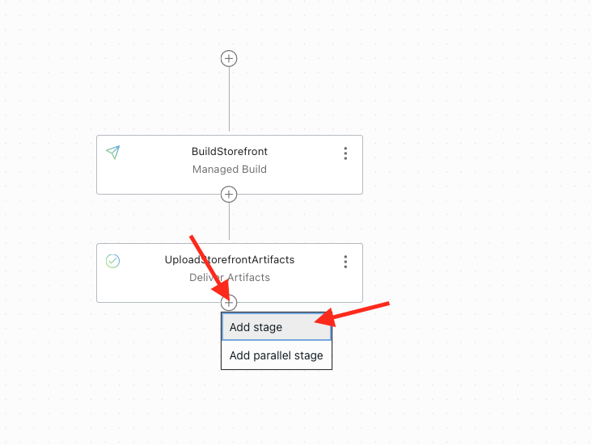

  4. In the **Optional** section click the **Trigger Deployment** stage type, then click the **Next** button on the lower left of the form to go to the next page.
  
  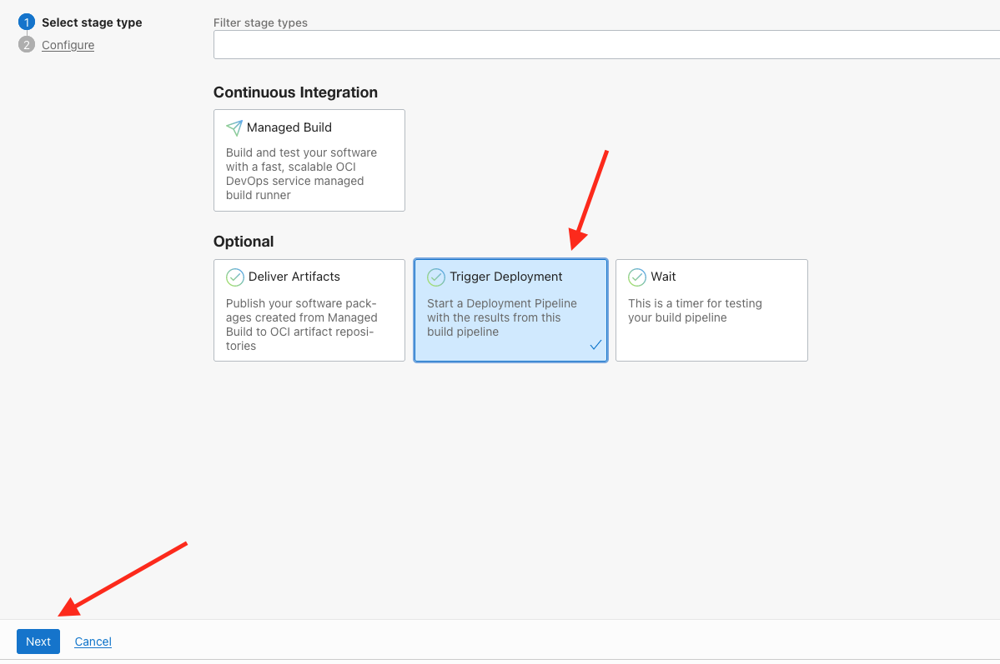

  5. Enter `StartStorefrontDeployment` in the stage name, enter a description if you want to. Click the **Select deployment pipeline** button, this will open a popup listing the deployment pipelines.
  
  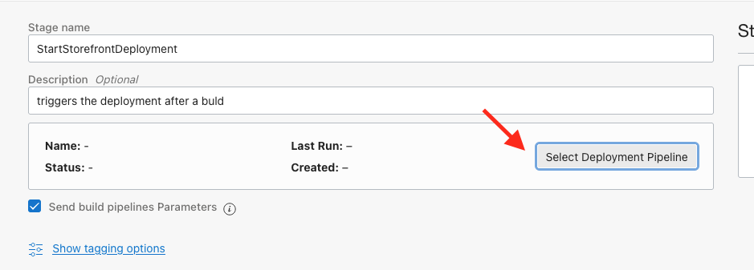

  6. In the Select deployment pipeline popup chose the one you created (We suggested you call it `StorefrontDeploy`) from the list, then click the **Save** button on the popup to exit this popup. 
  
  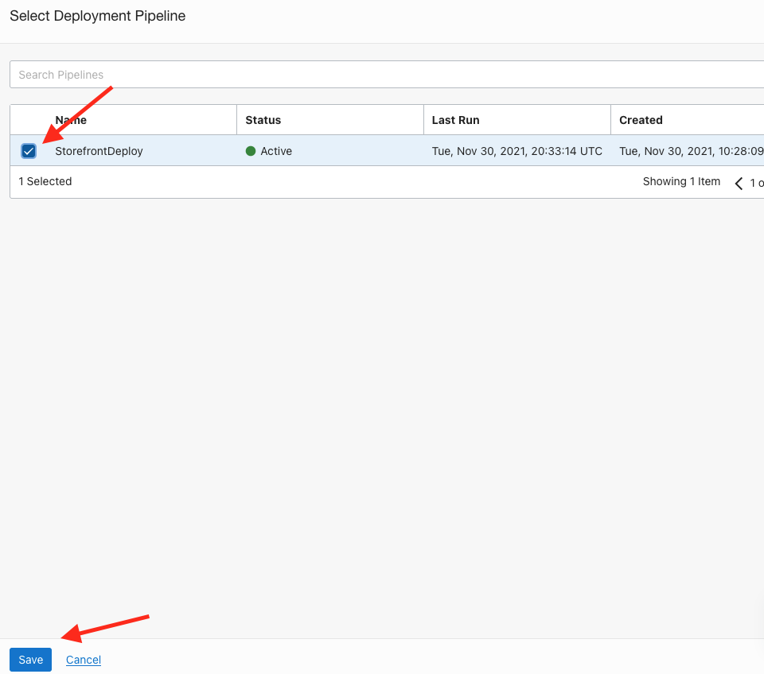
  
  7. Once saved the add stage form will update with information on the pipeline. Make sure that the **Send build pipelines Parameters** check box is selected - if you don't then your deployment won't know about the parameters you set or created in the build pipeline, and the deployment needs those to work out the artifact versions and container image location. You don't need to do anything with the details in the **Deployment Pipeline Parameters** section, they are there for your reference. Click the **Add** button on the lower left of the page
  
  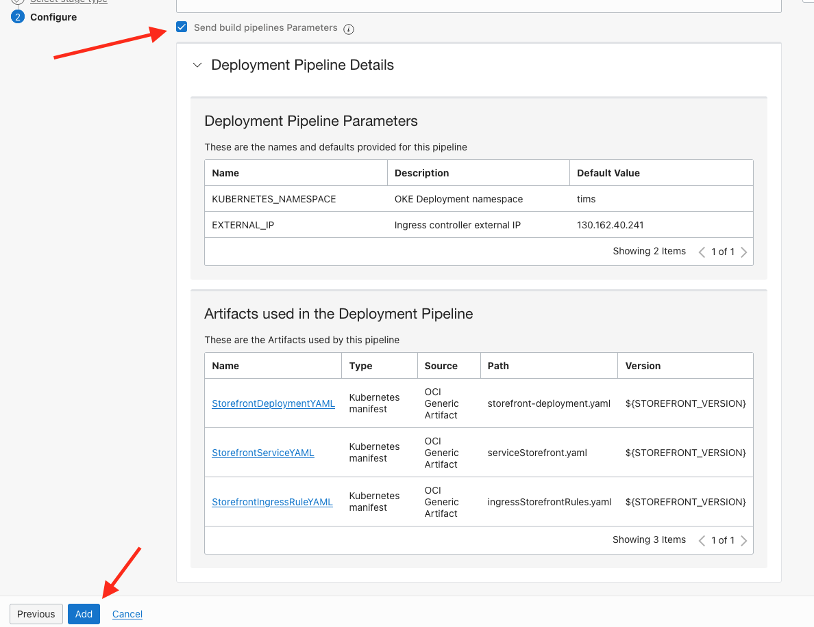

We have now updated the build pipeline to trigger our deployment process. 

  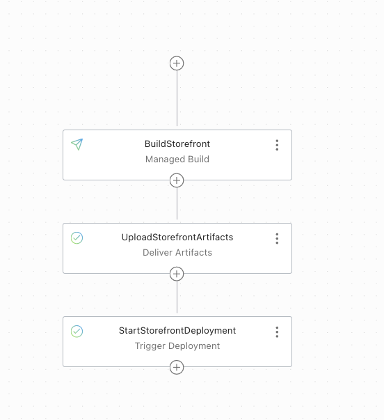
  
## Task 2: Checking the current deployed storefront version.

Before we update the pipeline let's check the version that's currently running - remember that though we have done builds we haven't yet done a deployment, so the service will be whatever was there before you started this lab.

  1. We need to define the cloud shell environment variable `EXTERNAL_IP` There are a couple of ways to do this, expand the appropriate section below
  
<details><summary><b>If you used the automated scripts in the kubernetes-lab directory to setup the microservices in Kubernetes</b></summary>

  - Open the OCI cloud shell 

The automated scripts will create a script file `$HOME/clusterSettings.one` this can be executed using the shell built in `source` to set the EXTERNAL_IP variable for you.

  ```bash
  <copy>source $HOME/clusterSettings.one</copy>
  ```
  
```
EXTERNAL_IP set to 139.185.45.98
NAMESPACE set to tg
```

  Of course the actual IP address and namespace will almost certainly be different from the example here !
  
---

</details>

<details><summary><b>If you manually setup the Kubernetes ingress services using helm</b></summary>

In this case as you manually set this up you will need to get the information from Kubernetes itself


  - Open the OCI cloud shell 

  - You are going to get the value of the `EXTERNAL_IP` for your environment. This is used to identify the DNS name used by an incoming connection. In the OCI cloud shell type

  ```bash
  <copy>`kubectl get services -n ingress-nginx</copy>
  ```

```
NAME                                 TYPE           CLUSTER-IP      EXTERNAL-IP      PORT(S)                      AGE
ingress-nginx-controller             LoadBalancer   10.96.182.204   130.162.40.241   80:31834/TCP,443:31118/TCP   2h
ingress-nginx-controller-admission   ClusterIP      10.96.216.33    <none>           443/TCP                      2h
```

  - Look for the `ingress-nginx-controller` line and note the IP address in the `EXTERNAL-IP` column, in this case that's `130.162.40.121` but it's almost certain that the IP address you have will differ. IMPORTANT, be sure to use the IP in the `EXTERNAL-IP` column, ignore anything that looks like an IP address in any other column as those are internal to the OKE cluster and not used externally. 

  - IN the OCI CLoud shell type the following, replacing `[external ip]` with the IP address you retrieved above.
  
  ```
  export EXTERNAL_IP=[external ip]
  ```
  
</details>


  2. Let's use this variable to confirm that we can talk to the storefront service status REST API

  - In the OCI Cloud shell type
  
  ```bash
  <copy>curl -i -k -X GET https://store.$EXTERNAL_IP.nip.io/sf/status</copy>
  ```
  
  ```
  HTTP/1.1 200 OK
Date: Thu, 11 Nov 2021 18:12:55 GMT
Content-Type: application/json
Content-Length: 87
Connection: keep-alive
Strict-Transport-Security: max-age=15724800; includeSubDomains

{"name":"My Shop","alive":true,"version":"1.0.0","timestamp":"2021-11-11 18:12:55.354"}
```

Depending on what other labs you may have run against the cluster the version may be `0.0.1` or `0.0.2`

## Task 3: Testing the integrated pipelines process

When we setup the vault variables in the build_spec.yaml we also changed the Version so it would be version `1.0.0`, let's run the build to push that version out

  1. Let's give it a go. Click the **Start manual run** on the upper left of the **Build pipeline** tab
  
  

  2. We know that the value of the `YOUR_INITIALS` is correct from the previous runs, so just click the **Start manual run** button on the lower left of the page
  
  

  3. This time in the stages list note that in addition to the previous two stages we have a the third stage we just added - `StartStorefrontDeployment`
  
  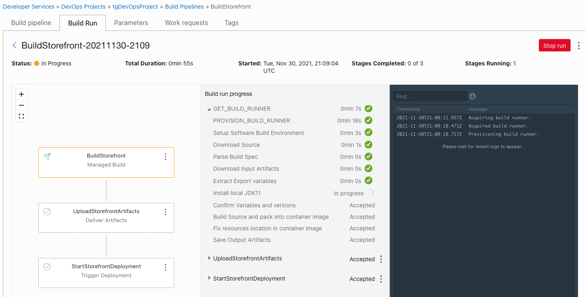
  
  
After a while (usually around 3 or 4 minutes) the build pipeline should complete with the green checkmarks on all stages.

**Important** The `StartStorefrontDeployment` stage just triggers the deployment process, it's considered to have successfully run if the deployment starts, *a green checkmark in the build pipeline for the deployment only means that the deployment was started, not that the deployment has succeeded* 

  4. To see the state of the deployment click the "three dot's" menu for the deployment stage then select the **View deployment** option. This will show you the deployment pipeline and it's progress.
  
  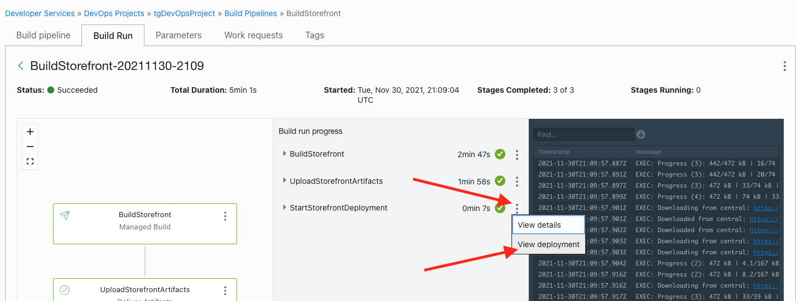

  This will open a new tab with the output from the deploy stages
  
  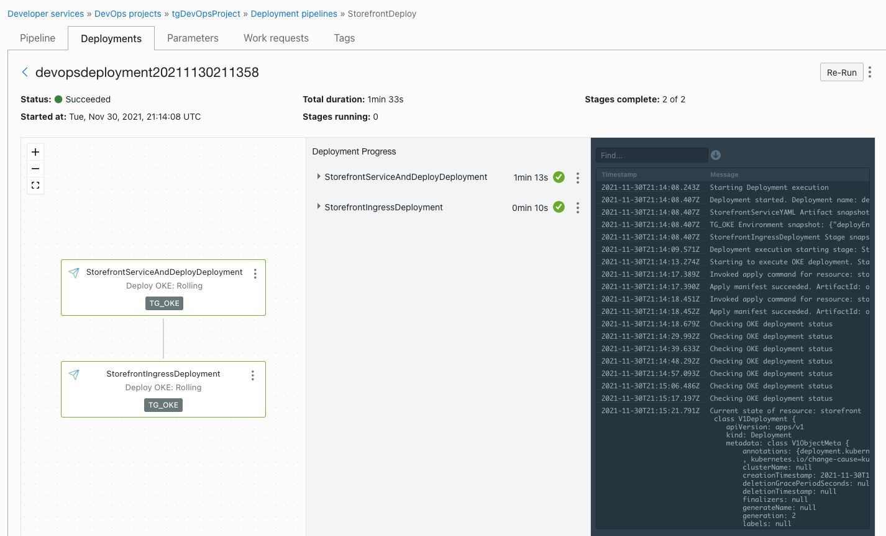


You can confirm that this is indeed a new deployment by looking at the running pods

  - In the OCI Cloud shell type
  
  ```bash
  <copy>kubectl get pods</copy>
  ```
  
  ```
  NAME                            READY   STATUS    RESTARTS   AGE
stockmanager-6b759ddcd7-rz2jm   1/1     Running   0          177m
storefront-74d6d55dcc-bt4cv     1/1     Running   0          3m
zipkin-7f4676fdcc-rkfsd         1/1     Running   0          177m
```

Notice that the storefront pod is very young compared to the other pods, this is because when making a Kubernetes deployment the pod itself is recreated.

The service is however running, you can check that it's there using the OCI cloud shell.

  5. Let's talk to the status service to see if the version number has updated, Make sure you are using the OCI Cloud shell instance where you set the EXTERNAL_IP environment variable. Type
  
  ```bash
  <copy>curl -i -k -X GET https://store.$EXTERNAL_IP.nip.io/sf/status</copy>
  ```
  
  ```
  HTTP/1.1 200 OK
Date: Thu, 11 Nov 2021 18:34:12 GMT
Content-Type: application/json
Content-Length: 87
Connection: keep-alive
Strict-Transport-Security: max-age=15724800; includeSubDomains

{"name":"My Shop","alive":true,"version":"1.0.0","timestamp":"2021-11-11 18:34:12.523"}
```

Notice that we now have out version as `1.0.0` which is the version we set earlier in the lab. The name and timestamp will be different for you of course.

## Task 4: Triggering the build automatically

We are still manually starting the build process, this is what's wanted in some situations, but in may cases you will want the process to happen automatically when code is committed into the git repository, let's see how we can arrange for that to happen.

  1. Make sure you are on the main page of your devops project
  
  2. Click the **Triggers** menu option on the left side in the **Resources** menu
  
  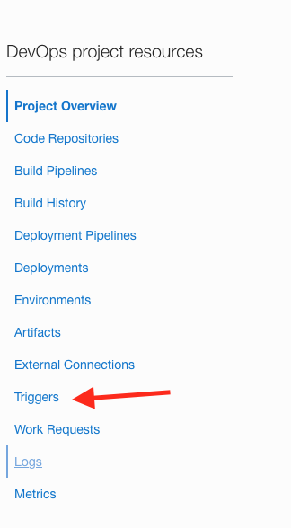
  
  3 Click the **Create Trigger** button
  
  
  
  4. In the form Name the trigger `StorefrontTrigger`. Provide a description if you wish. Click in the **Source connection** field and chose **OCI Code Repository** (the UI will update with some new fields). Click the **Select** option in the **Select code repository** box, this will open the Select Code Repository popup
  
  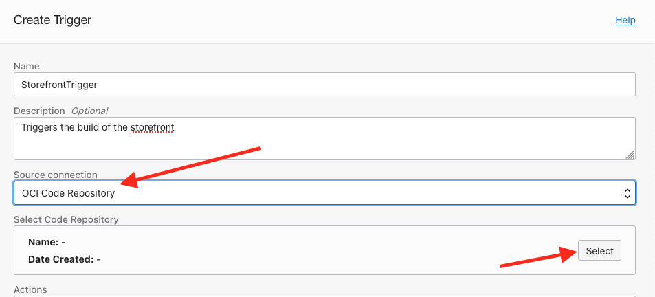
  
  5. In the popup if it's not already selected click the checkbox for your OCI Code Repository in the list. Click the **Save** button to exit the selection page.
  
  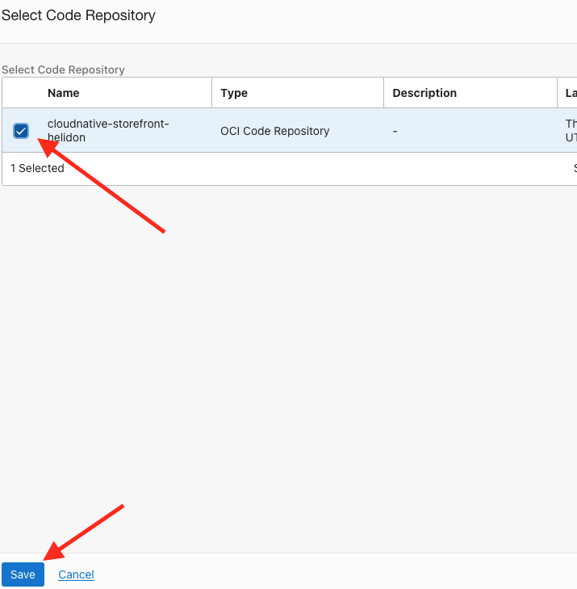
  
  6. Back on the create trigger form In the **Actions** box click the **Add Action** button. This will open a popup
  
  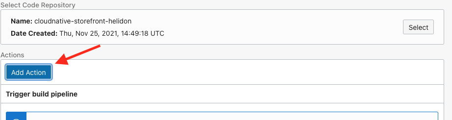
  
  7. In the Add action form In the **Select Build pipeline** box click the **Select** button. This will open a popup over the first
  
  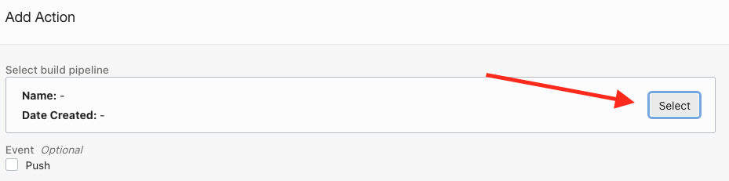
  
  8. In the Select build pipeline form Use the checkbox to mark your build pipeline from the list, then click the **Save** button to return to the previous popup
  
  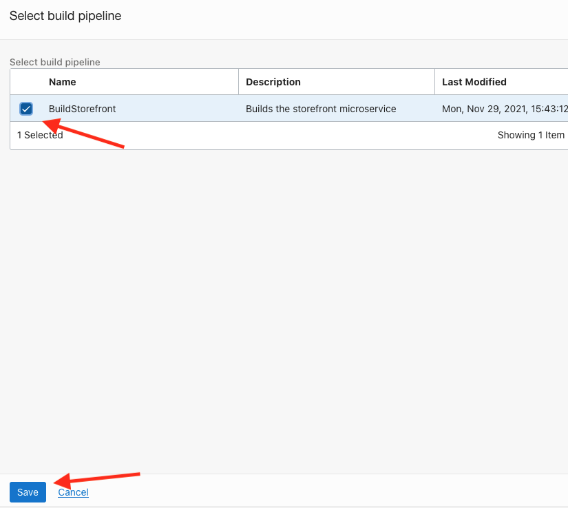
  
  9. In the **Event** section Click the **Push** checkbox. In the source branch enter `my-lab-branch` This will cause the trigger to only work on this branch. Click the **Save** button to close this popup
  
  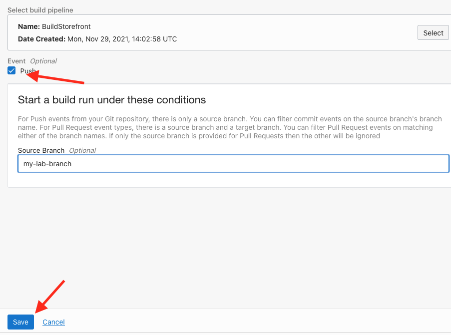
  
  10. Click the **Create** button to create the trigger.
  
  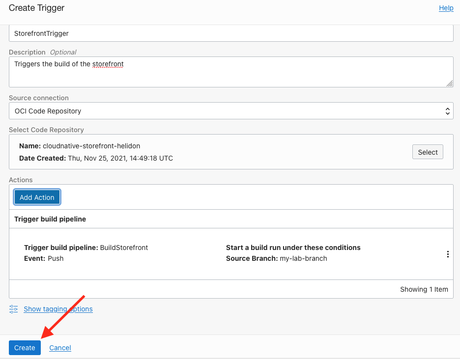
  
  The trigger has been created and it's page is displayed.
  
  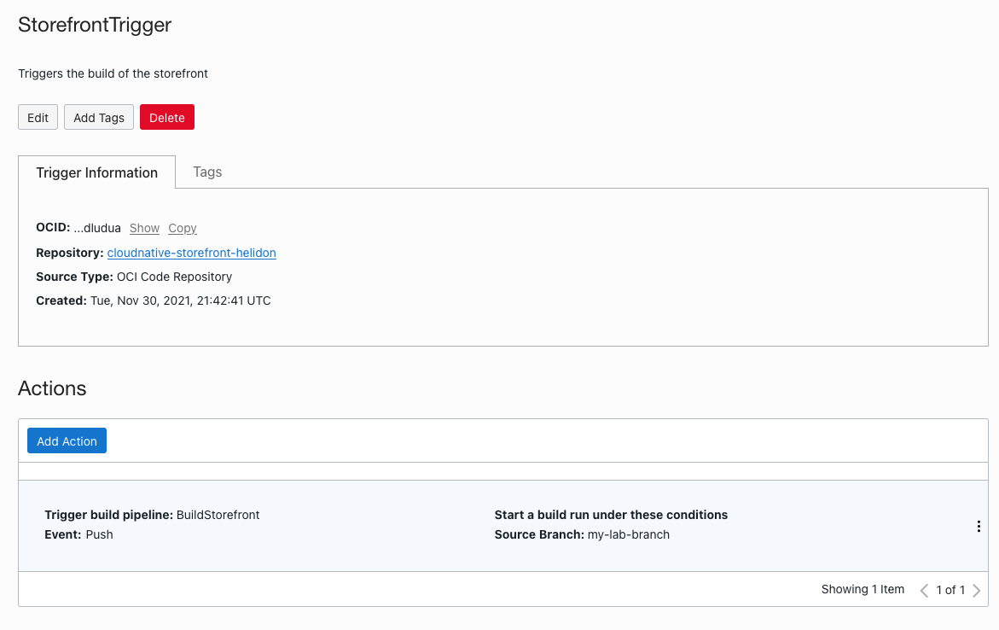

<details><summary><b>Why chose a branch ?</b></summary>

This mechanism allows you to have different build pipelines for different situations, for example a push to the `main` branch may trigger pipelines that goes through a full and rigorous testing process, whereas a push to a dev related branch may just allow it to progress relying on any unit testing you have defined in your build tools.

---
</details>

## Task 5: Testing the trigger

Now we are going to make a change to our code, to show the process working.

  1. Open the OCI CLoud shell, make sure you are in the local code repo
  
  ```bash
  <copy>cd $HOME/cloudnative-helidon-storefront</copy>
  ```

  1. In the OCI Cloud shell edit the StatusRecource file (I'm using vi here, but use a different editor if you want)
  
  ```bash
  <copy>vi $HOME/cloudnative-helidon-storefront/helidon-storefront-full/src/main/java/com/oracle/labs/helidon/storefront/resources/StatusResource.java</copy>
  ```
  
  2. Locate the line `public final static String VERSION = "1.0.0";` and change the version string to `"1.0.1"` Save the updated file. Be careful not to remove any quotes or make any other changes that would mean it won't compile. The new line will look like
  
  ```java
  public class StatusResource {
        public final static String VERSION = "1.0.1";
        private static final JsonBuilderFactory JSON = Json.createBuilderFactory(Collections.emptyMap());
  ```
  
  3. Commit these changes to your local git repo (the one in the cloud shell you are using). In the OCI Cloud shell type
  
  ```bash
  <copy>git commit -a -m 'Updated version number'</copy>
  ```
  
  ```  
[my-lab-branch 0d9128c] Updated version number
 1 file changed, 1 insertion(+), 1 deletion(-)
 ```

  4. Now push the repo branch to the OCI Code repo you created. In the OCI cloud shell type

  ```bash
  <copy>git push devops my-lab-branch</copy>
  ```
  
  ```
  FIPS mode initialized
Counting objects: 25, done.
Delta compression using up to 2 threads.
Compressing objects: 100% (7/7), done.
Writing objects: 100% (13/13), 845 bytes | 0 bytes/s, done.
Total 13 (delta 5), reused 0 (delta 0)
remote: Resolving deltas: 100% (5/5)
To ssh://devops.scmservice.uk-london-1.oci.oraclecloud.com/namespaces/lrn2df6gh9vo/projects/tgDevOpsProject/repositories/cloudnative-storefront-helidon
   1ce5f06..0d9128c  my-lab-branch -> my-lab-branch
   ```

This will automatically start the build process, let's go and see that in action

  5. Go to the project main page. On the left in the Resource section select **Build History**
  
  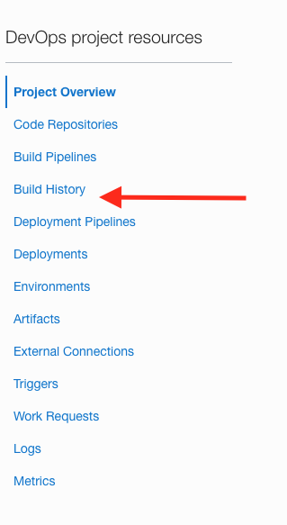
  
  6.  In the build history list you'll see a build with a status of `Accepted` (will have a grey dot) or maybe `In Progress` (will have a green dot) that has a name starting `StorefrontTrigger` or similar. This was started by the trigger (the other entries will start `BuildStorefront` which is the name of the pipeline, both names will include a timestamp, but personally I find the **Timestamp** column easier easier to understand).
  
  
  
  7. Click on the name of your trigger started build, to watch it go through it's steps
  
Once the build and deploy pipelines have finished (remember that the deploy stage in the build pipeline onluy means that the build has started, in the build progress section you need to click right on the three dots menu for the deploy stage, then **View Details** to go to the associated deploy pipeline proigress)  we can check that our update version has in fact been deployed, we'll use the status endpoint to check

  - In the OCI Cloud shell type
  
  ```bash
  <copy>curl -i -k -X GET https://store.$EXTERNAL_IP.nip.io/sf/status</copy>
  ```
  
  ```
  HTTP/1.1 200 OK
Date: Thu, 11 Nov 2021 19:12:25 GMT
Content-Type: application/json
Content-Length: 87
Connection: keep-alive
Strict-Transport-Security: max-age=15724800; includeSubDomains

{"name":"My Shop","alive":true,"version":"1.0.1","timestamp":"2021-11-11 19:12:25.231"}
```

The version number has updated to `1.0.1` so the pipelines we automatically triggered with the git commit have done this work.
  
<details><summary><b>But what if there's problems with my code, I don't want to just deploy something that is broken!</b></summary>


There are several approaches here :

Firstly you should ensure that your build tools run tests (Maven does this automatically for you as it builds your code) and that you write tests to be run (in Java many people use the JUnit testing framework, though others are available. Other languages will have their own testing frameworks. Generally most testing frameworks will exist with an error if the unit tests do not all complete successfully, this of course will result in the build pipeline stopping as well.

Whatever approach you take we would suggest that you consider putting in a manual confirmation step in the deployment pipeline before deploying to the production environment, you could combine this by having the deployment pipeline initially deploy to a test system where you can run more detailed (and potentially intensive tests) allowing you to extent the unit testing and additionally look for non fatal errors such as performance regressions.

If you are deploying into Kubernetes you may chose to miss the final production deployment step, and instead use a tool like Spinaker or ArgoCD to do the deployment, these can work with a service mesh like Linkerd to do a gradual roll out or a canary deployment, enabling a small portion of your traffic to test the new version first before expanding it to all customers. Currently this would be done using a Function to trigger that process.

</details>

## End of the Lab, what's next ?

Though this lab has focused on deploying into Kubernetes other mechanisms are available, you can deploy into functions and also instance groups which allows you to work on virtual machines and bare metal servers.

This has been a quick overview, we encourage you to explore the DevOps service and the other OCI services we havebeen using in more detail.

## Acknowledgements

* **Author** - Tim Graves, Cloud Native Solutions Architect, Oracle EMEA Cloud Native Application Development specialists Team
* **Last Updated By** - Tim Graves, May 2023

