# Getting artifacts from your build pipeline

## Introduction

We're got our build process running, but what about the results of it, how do we get them out of the pipeline and into longer term storage ?


### Objectives

Using the OCI Browser User Interface we will :

  - Create a container repository to hold the docker images.

  - Create an artifact registry to hold the yaml files.
  
  - Add parameters to the build pipeline
  
  - Update the build pipeline to save it's outputs using the build parameters for naming.
  
  - Run a test build
  
  - Check that the outputs were saved.

 
### Prerequisites

You have your basic build pipeline running the build process.

## Task 1: Creating the container repo

We could have done a docker push in the build pipeline, but that yud have required docker logins and so on, it's certainly possible to pass the required parameters into the build runners, and the `oci` command is installed in the build runners for us, so we can manipulate the OCI environment, but there is a far easier way to handle the container image we created and that's to use the deliver artifacts stage. That will allow us to define the artifacts in the artifact and container repos, and to map the build pipeline outputs to the repo locations.

We're going to create the container repo first, this will give us a location to upload the container images.

  1. Navigate to the OCIR service page - Click the "Hamburger" menu, then selct **Developer Services** then click on **Container Registry**
  
  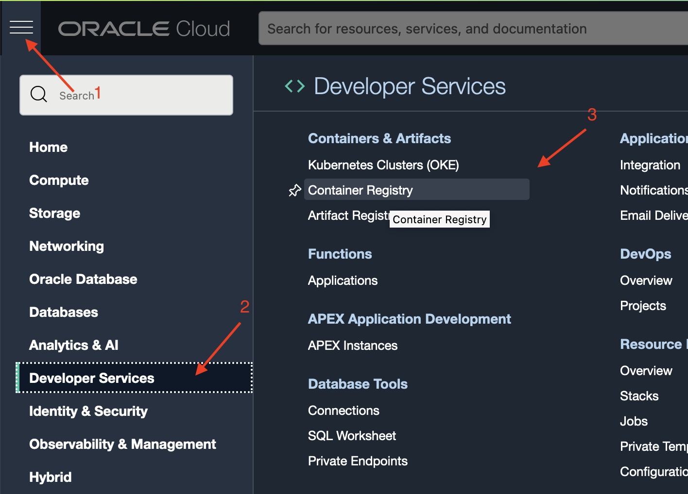
  
  2. Check that the compartment on the left is your compartment, Note that there may be existing repos in the compartment which will contain the basic images created during the environment setup process. Click the **Create Repository** button to open the create repository popup

  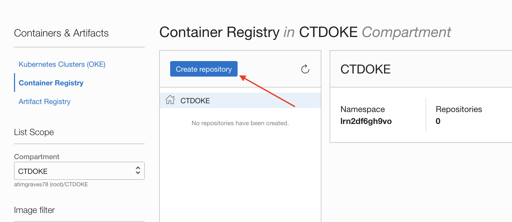
  
  3. Create the repo `<YOUR_INITIALS>devops/storefront` (remembering to replace `<your initials>` which need to be in lower case) Click the **Public** checkbox (in the example below I've used my initials, yours will of course probably be different), Click the **Create repository** button to complete the process
  
  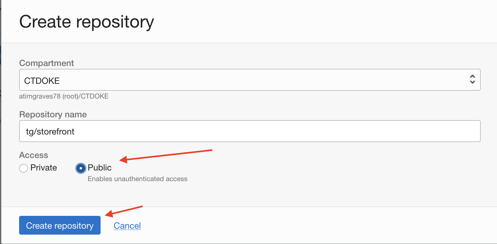
  
We'd need one of these for each container image you will upload (but not for each version, the repository can hold multiple versions of an image). For this lab we'll only be doing this with the storefront deployment, so that's the only one we need to create.

  

## Task 2: Creating the Artifact registry

Now we'll create  the artifact registry, this will hold the Kubernetes manifests output from the build process.

  1. Navigate to the Artifact registry service page - Click the "Hamburger" menu, then selct **Developer Services** then click on **Artifact Registry**
  
  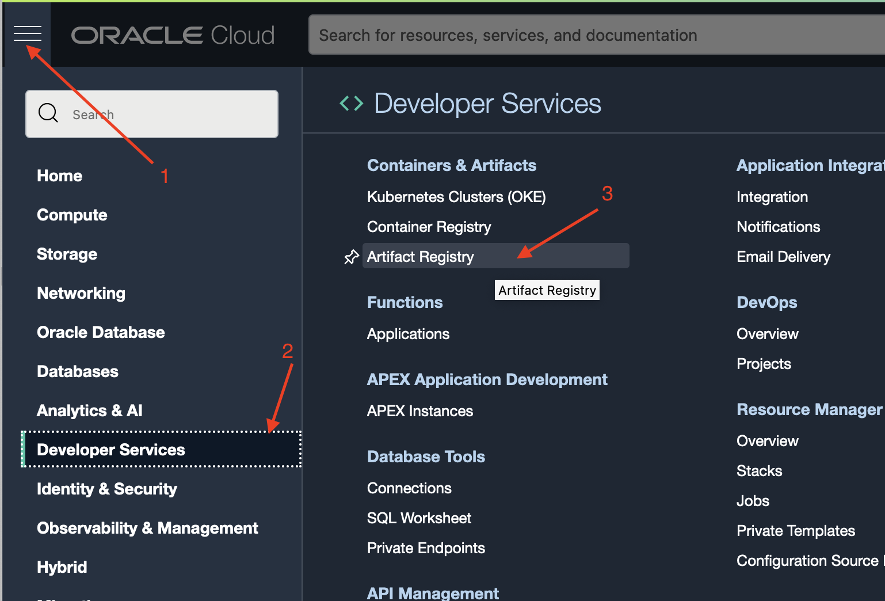
  
  2. Check that the compartment is correct on the left side, click the **Create repository** button to open the create popup
  
  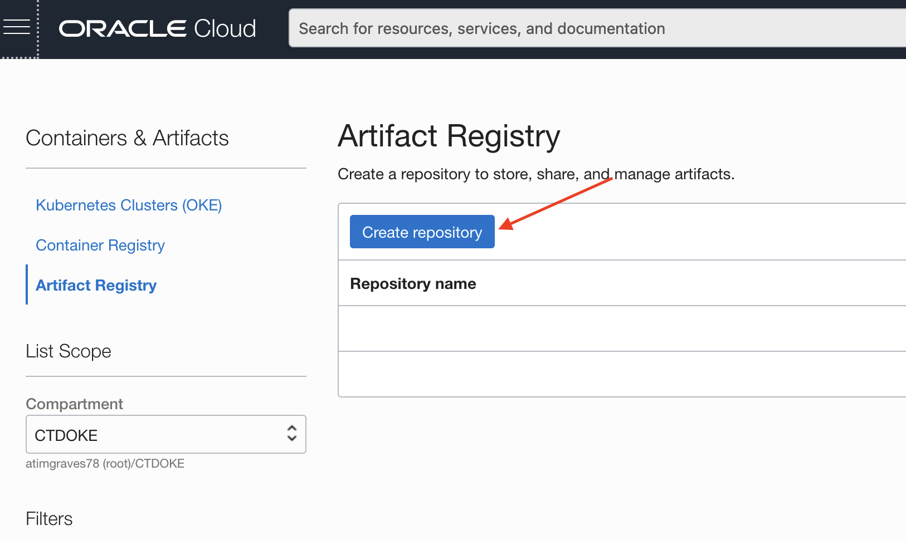
  
  3. In the **Create repository** popup name it <Your initials>DevOps, **CRITICAL** set the immutable to be off, in production you  wouldn't do this as immutable artifacts can never be re-used (this is for security purposes, and also to ensure that deployments are reproducible) but for the lab where you will be doing multiple runs that would just make things difficult as we'd need to update the version everytime we did a run, so we'll allow for artifacts to be changed for now. Click the **Create** button.
  
  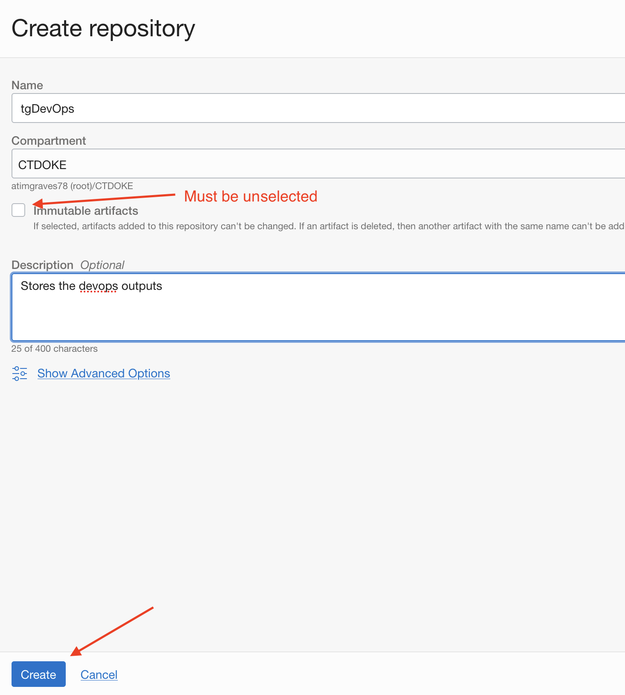
  
  The details page for your newly created artifact repo will be displayed
  
  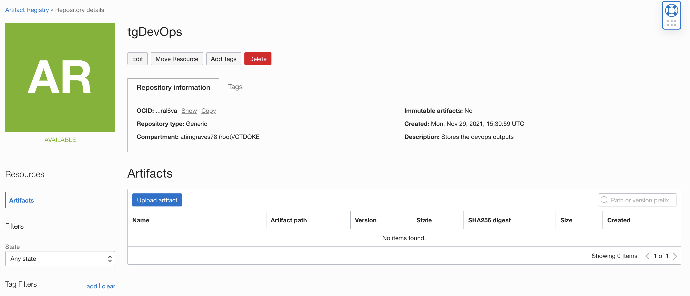
  
## Task 3: Passing parameters into the build pipeline

We will next define some paramaters for the build pipeline. These are automatically made available to the build stages, they can also be used to name the outputs of the build process.

  1. Go to the DevOps service page - Click the "Hamburger" menu select **Developer Services** click **Projects** (in the DevOps section) 
  
  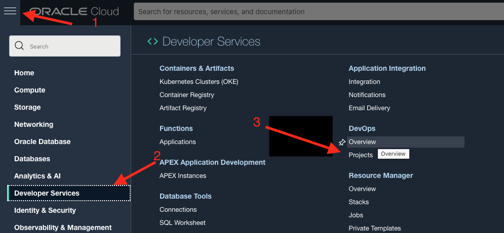
  
  2. Select your project from the list (your name may be different of course)
  
  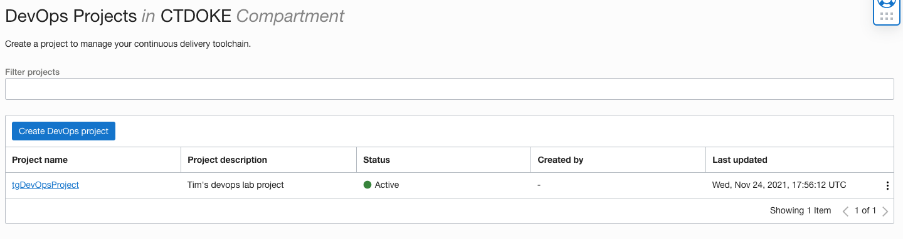
  

  2. On this page in the **Latest Build Pipelines** section click on the your build pipeline. Alternatively if you were in production and had lots of build pipelines you could select **Build Pipelines** from the resources on the left, then chose your current build pipeline.
  
  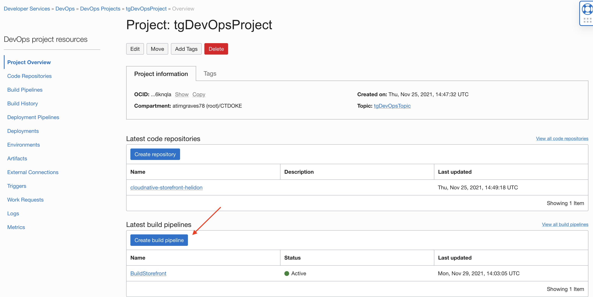

  3. Click on the **Parameters** tab, we're going to explore another way to pass information into the build pipeline.
  
  [](images/build-pipelines-select-params-tab-no-params-yet.png)

  4. In the **Name** field enter `YOUR_INITIALS` (this is the actual words, do not substitute this). Set the default value to be `<your initials> `(for this second field substitute the ones you used when you created the container repo as these will be used by the output artifacts stage we are about to create to upload the container image to that OCIR repo, add a description then to "commit" the param we need to click the + button on the right of the row, this will save the details away **IMPORTANT** you do need to save the params with **+**, if you don't it will be lost. There is no mechanism to specify params for each stage so we need to do it on the entire build pipeline.
  
  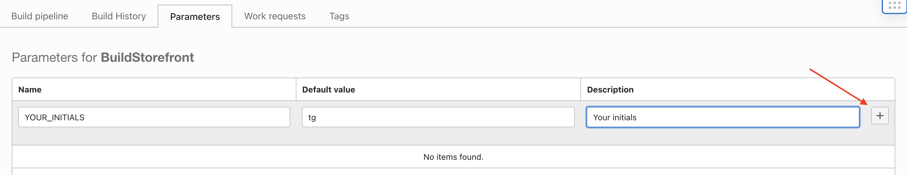
  
  Once you have clicked the **+** button the parameter will be saved, and you are given another line to enter more (though here we won't do that)
  
  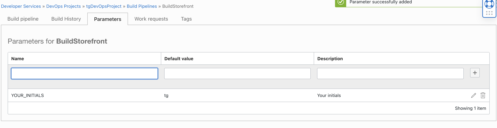
  
## Task 4: Setting up the output artifacts.

Now we have the places to store the artifacts we need to extract them from the build pipeline, the artifacts are currently "hanging around" as the outputArtifacts stage of the build process saved them somewhere in the build pipeline, but that's not permanent, they are just held for other pipeline stages (which have their own runner) to import if needed. To make use of them in a deployment we need to upload them to a permanent location, in this case the OCIR and the artifact registries we just created.

<details><summary><b>Why can't I just use them from the OCIR Code repo ?</b></summary>

I appreciate that this as an additional stage is a bit of an irritation - esp for artifacts that are in effect being copied from the git repo, but this is needed because the deploy processes don't know about the git repo, they only know about OCIR and the artifact repo, so if the container image / YAML files aren't there then the deploy engine can't deploy them. Equally the deploy pipeline (we'll get to that soon) is a separate pipeline from the build pipeline, so it can't just use the "stashed" outputs. One reason that it doesn't know about them is that the deployment pipelines can run independently of the build pipelines, some customers may use a different build tool like Jenkins, but then upload the outputs to the registries and then use the DevOps CD tooling for the final delivery, so we have to have an architecture that can handle many combinations of tooling, not all of which may be in the DevOps managed service.

---
</details>

The output artifacts stage  is where we do the tagging and so on, here we will use the build pipeline variables (e.g. the exported variables like `STOREFRONT_VERSION`) as well as pipeline parameters (like the `YOUR_INIATIALS`) as part of the naming when artifacts are uploaded. There is not need to use both, but I wanted so show you how you can in case you want to  do so at some point.

  1. Click the **Build Pipeline** to switch to the pipeline designer tab.
  
  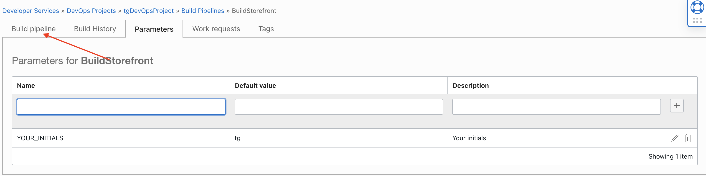

  2. On the bottom of the `BuildStorefront` stage we created earlier there is a **+** button, click that to add and chose **Add Stage** to create a new stage which will run **after** the `BuildStorefront` stage.
  
  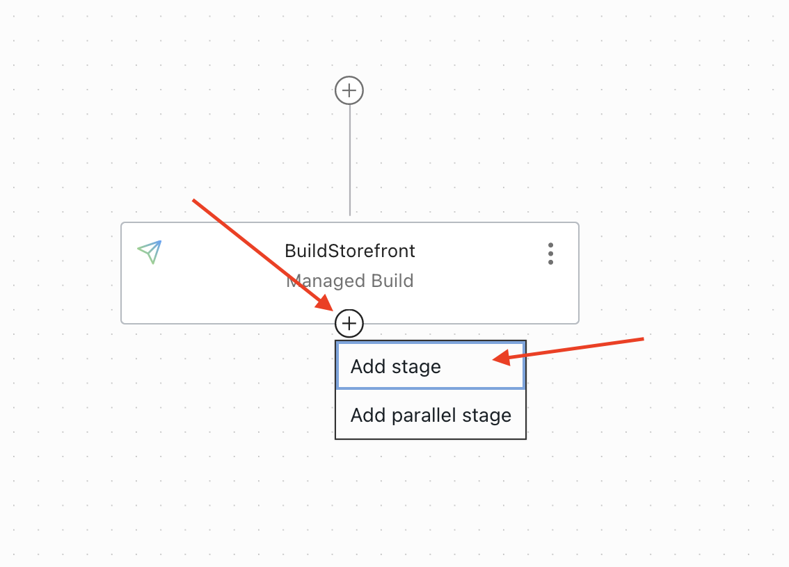

<details><summary><b>What's with the Parallel stage option ?</b></summary>

ou may have also seen an option for **Add parallel stage** Please con't chose that here, it's used for defining parallel stages (what a surprise) which can be used if you have two (or more) build stages that can proceed in parallel, for example maybe you are creating multiple sets of jar files to create a library you will then use later. With parallel stages all of the parallel stages must complete successfully before the next stage starts, but if one parallel stage fails the others can continue running to their completion (or failure) even though the subsequent stage will not run.

Of course in this case we can't use a parallel stage as we need to have the container image built before it can be uploaded.

---
</details>

  3. In the list of stages select the **Deliver Artifact** stage type, click the **Next** button.
  
  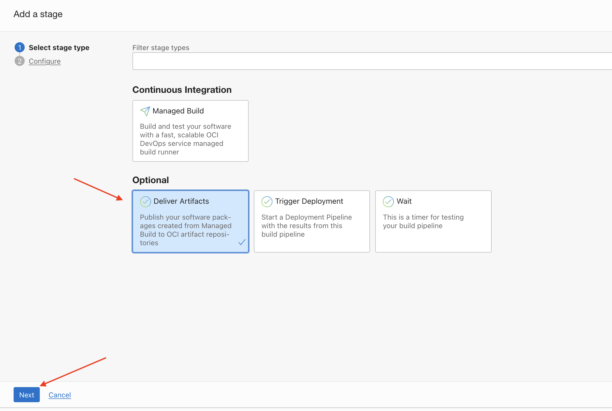

  4. Name it `UploadStorefrontArtifacts`, add a description if you like
   
  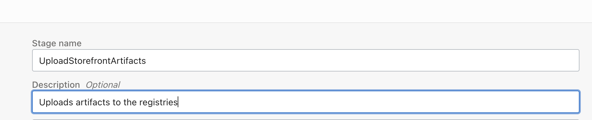

We need to specify the artifacts to extract and store

First we're going to do the YAML files, yes I know that having to transfer the Kubernetes manifests from the git repo into the pipeline and then to the artifact repository is a pain, but there are two reason for this. Firstly we need deploys to be reproducible and auditable, so we need to know exactly what was deployed, that means it needs to be held somewhere where it can't be changed (esp if using immutable artifacts). Secondly remember the deploy pipelines only use the artifact repo and don't know about the git repo (hopefully that will change) so we have to copy them across. 

Now we need to define the artifact. We could have previously defined the artifacts description, but for now we'll do that here. Remember that here we are is defining a "template" specifying where the build output will be stored, this is not accessing an already uploaded artifact in the registry, the output artifacts stage will use this template to upload the artifact making it "real" and then the deploy stage can use that artifact

  5. Click the **Create artifact** button to get the create artifact popup.
  
  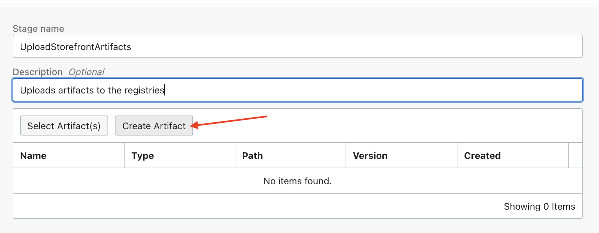

  6. In the popup Set the name to be `StorefrontServiceYAML`, Set the type to be Kubernetes manifest - this will update the UI with some different fields.In the (newly displayed) Artifact source section click **Select** to open the registry selector.
  
  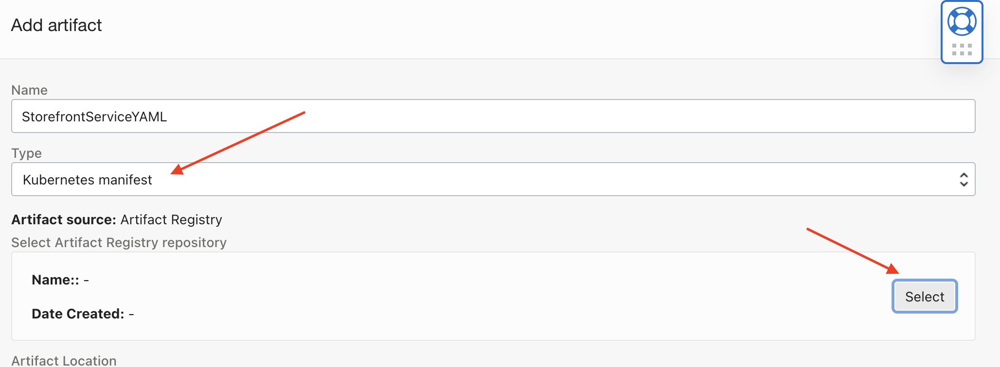
  
  7. Set the artifact registry to be the one you just created (check the name, region and compartment to be sure) Click **Select**
  
  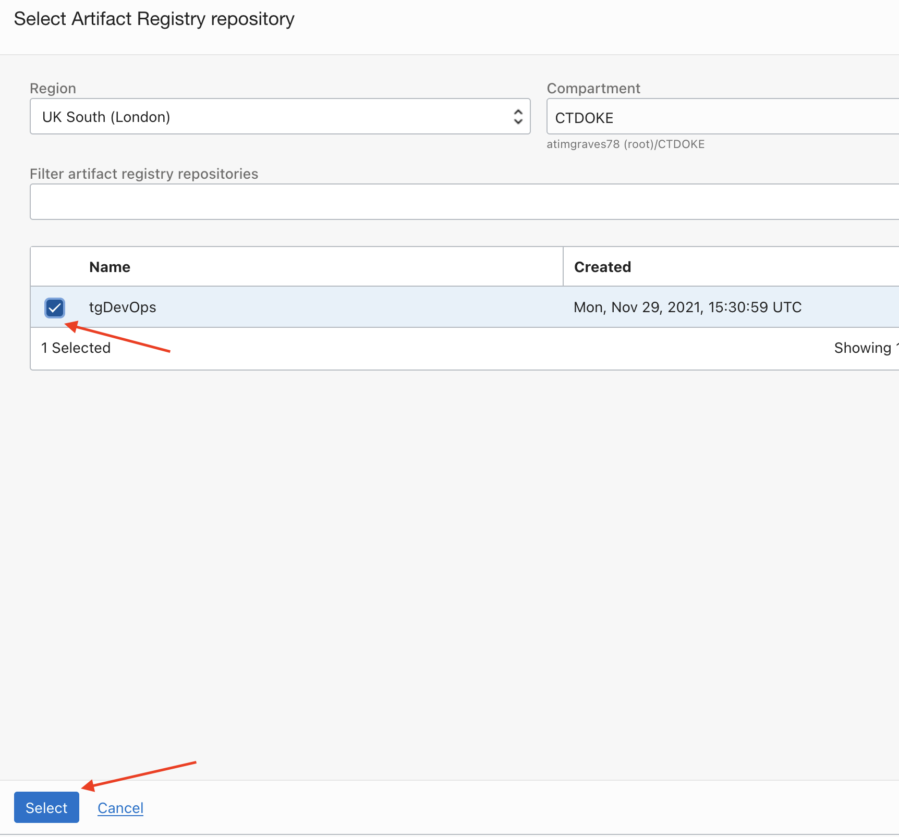
  
  8. Once you've selected your artifact registry then carry on with the add artifact form. Set the **Artifact location** to be `Set a custom artifact location and version` Set the path to be `serviceStorefront.yaml`, Set the version to be `${STOREFRONT_VERSION}` This is a param exported from the build process (in the build process we extract it from the source code, this means that we know we are matching the image and YAML versions with the code version). Make sure that replace parameters is set to Yes, substitute placeholders - this will mean that the variables we have specified like `${STOREFRONT_VERSION}` will be replaced during the artifact creation phase with their values, currently the `StatusResource.java` file specifies the version as `0.0.1`, but we will change that later to see how everything updates when we do a build with the new version. Click the **Add** button.
  
  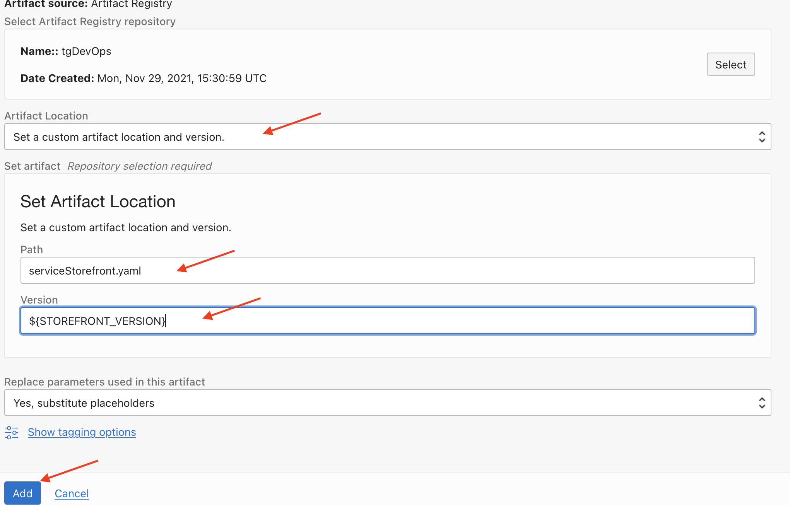
  
  9. Follow the bove process to create two more YAML artifacts. All have the same settings except name and path
  
  Ingress artifact
  
  - Name `StorefrontIngressRuleYAML`
  
  - Path is `ingressStorefrontRules.yaml`
  
  Deploment Artifact
  
  - Name `StorefrontDeploymentYAML`
  
  - Path `storefront-deployment.yaml`
  
  When you have finished that section of the form will contain three artifacts
  
  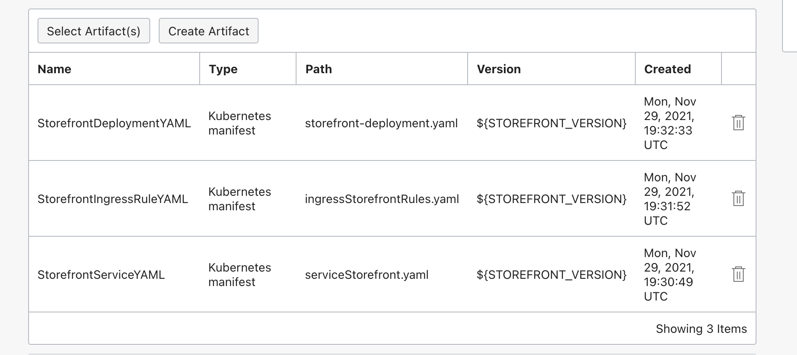

  10. Now let's setup the container image location, this is slightly different as the container image will be stored in OCIR, not the Artifact Repository. In the artifacts section Click **Create artifact**

  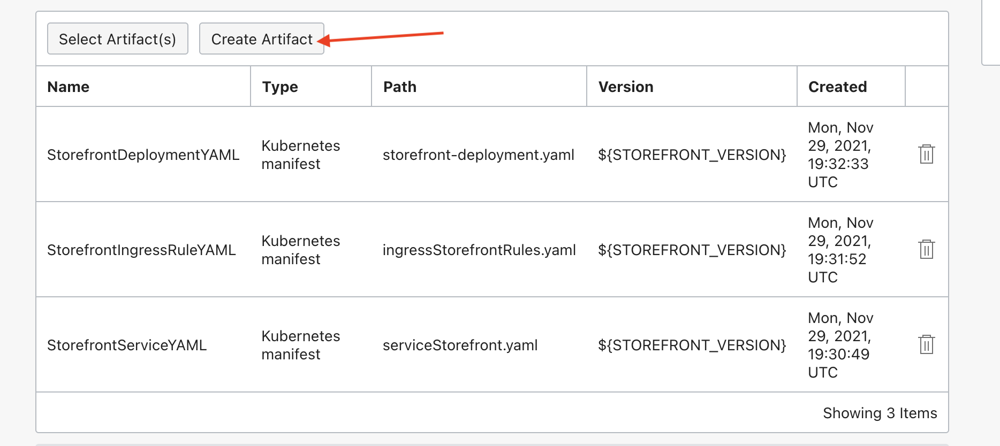
  
  11. Name it `StorefrontContainer`, This time the type should **Container image repository**, Artifact source is `${OCIR_HOST}/${OCIR_STORAGE_NAMESPACE}/${YOUR_INITIALS}devops/storefront:${STOREFRONT_VERSION}`, Make sure that **Replace parameters used in this artifact** is set to `Yes substitute placeholders`. Click the **Add** button.

  

<details><summary><b>What's with all of those variables ?</b></summary>

Note that OCIR_HOST and OCIR_STORAGE_NAMEPACE are variables specified in the build file as coming from the vault secrets, they specify the region for the OCIR service and the tenancy storage namespace which uniquely identifies storage used by this tenancy.
STOREFRONT_VERSION is generated within the build spec and is marked as an exported variable, so it's available to subsequent stages.
YOUR_INITIALS is a param we pass to the build process, though it could of course come from the vault we use YOUR_INITIALS so that if there are multiple people running the lab in the same tenancy we have a good chance to keep things separate !

---
</details>

<details><summary><b>Can I reuse the artifacts ?</b></summary>

The artifacts we have defined here could in theory be used by other pipelines in the project (or even other projects using the repo) but be careful with this, often they are unique to a deployment, so be careful if you re-use them, and be especially careful to ensure that you have all of the parameters available for the outputArtifacts stage to process the paths and version information.

---
</details>

   Now we have the 4 artifacts defined 
   
   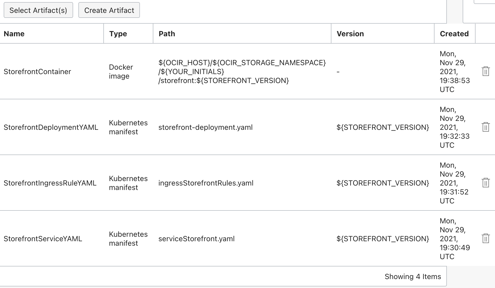

  12. We have defined where the artifacts are going, but we haven't connected the outputArtifacts held in the build pipeline to the ultimate destinations yet. In the stage section scroll down to the **Associate Artifacts with Build Result** section
  
  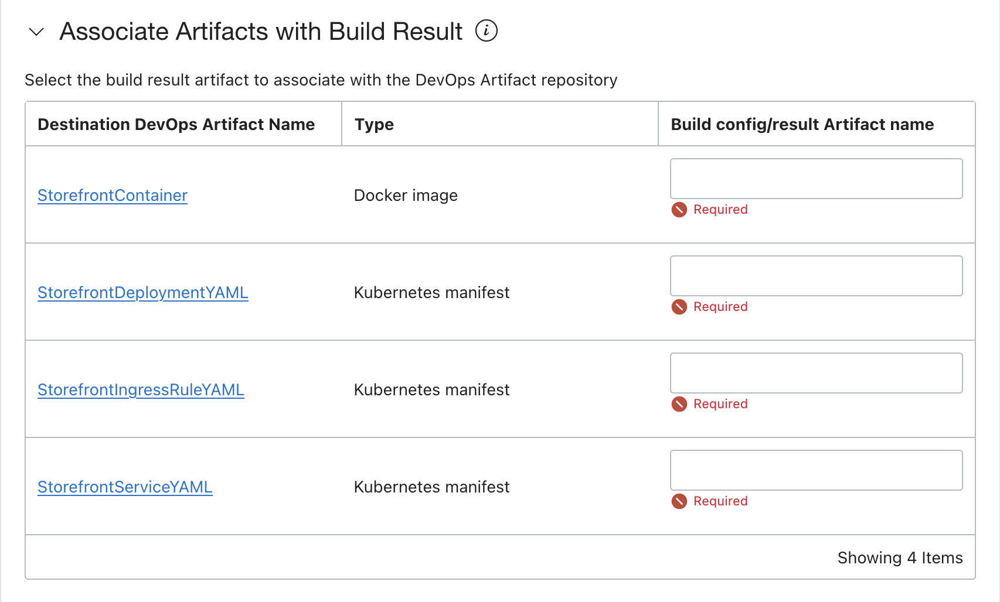

  13. You can see the artifacts that are in the list, we now need to specify the names in the build outputs for each artifact. In the **Build config/result Artifact name** field for each artifact please enter the output artifact names (these names were defined in the outputArtifacts of the build_spec.yaml file)

  - `StorefrontServiceYAML` maps to `service_yaml`
  
  - `StorefrontIngressRuleYAML` maps to `ingressRules_yaml`
  
  - `StorefrontDeploymentYAML` maps to `deployment_yaml`
  
  - `StorefrontContainer` maps to `storefront_container_image`
  
  The mappings come from the names we gave to the outputArtifacts in the build_spec.yaml
  
```
  outputArtifacts:
  - name: storefront_container_image
    type: DOCKER_IMAGE
    location: storefront:latest
  - name: service_yaml
    type: BINARY
    location: ${OCI_PRIMARY_SOURCE_DIR}/helidon-storefront-full/yaml/deployment/serviceStorefront.yaml
  - name: ingressRules_yaml
    type: BINARY
    location: ${OCI_PRIMARY_SOURCE_DIR}/helidon-storefront-full/yaml/deployment/ingressStorefrontRules.yaml
  - name: deployment_yaml
    type: BINARY
    location: ${OCI_PRIMARY_SOURCE_DIR}/helidon-storefront-full/yaml/deployment/storefront-deployment.yaml
 
 ```

  14. Click the **Add** button at the bottom of the Add stage form to add it to the pipeline.

  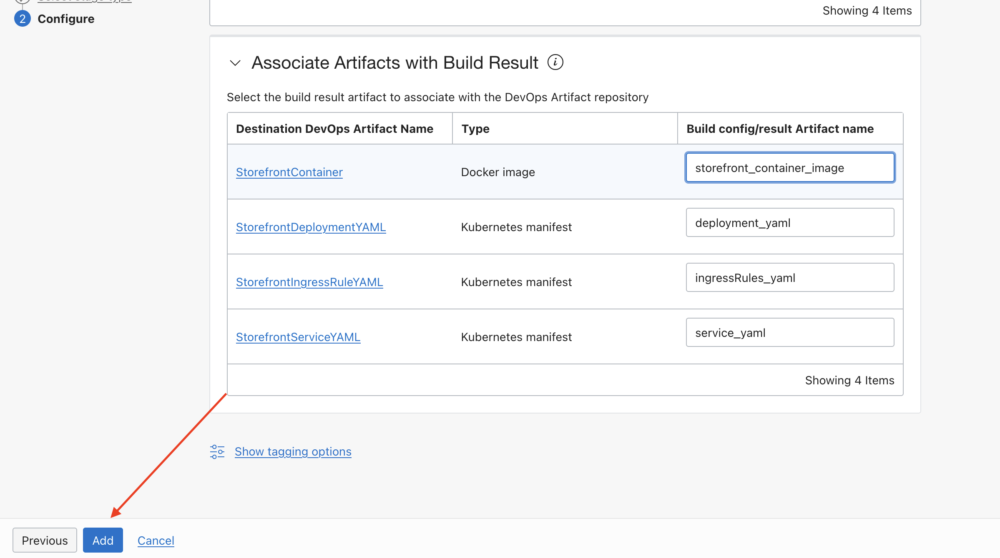

<details><summary><b>Is this the only way to define the artifacts ?</b></summary>

Here we created the artifacts as part of defining the stage, we could of course have done this in advance using the artifacts side tab

---
</details>

Note that we have not provided any OCI credentials, this is a major advantage of using the upload artifacts process, if we had done this within the build_spec.yaml we'd have had to do docker logins and so on as part of the build process, though a maybe a little counter intuitive at the moment this is far easier overall !

  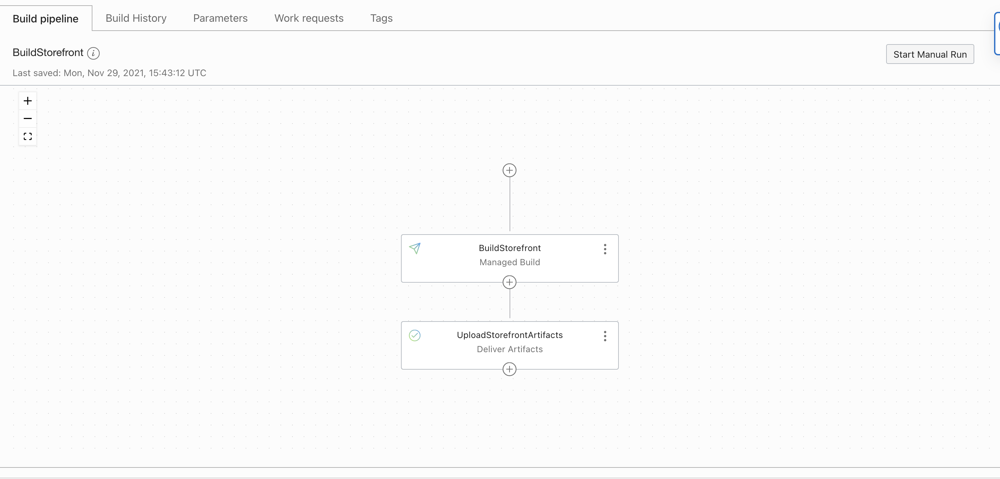

<details><summary><b>How do I use the parameters to specify the image in my deployment ?</b></summary>

The YAML files themselves contain parameters. If you want to see what this looks like go the Code repository for this project and navigate to `helidon-storefront-full/yaml/deployment/storefront-deployment.yaml` file and see the namespace used for the deployment is set to `$KUBERNETES_NAMESPACE` and the image location is `${OCIR_HOST}/${OCIR_STORAGE_NAMESPACE}/${YOUR_INITIALS}/storefront:${STOREFRONT_VERSION}` matching the definition in the outputArtifacs stage) 

Clearly at some point the parameters actual values need to be set in the various Kubernetes manifests, but we haven't done that yet. Ths param substitution **within** the artifacts happens in the deployment pipeline, not the build pipelines.

We haven't specified the `$KUBERNETES_NAMESPACE` variable, we'll do that shortly in the deploy pipeline.

---
</details>

## Task 5: Running our updated build pipeline

Let's run this with the Upload Artifacts stage now

  1. Click the **Start Manual run** button to start the process on the pipeline tab
  
  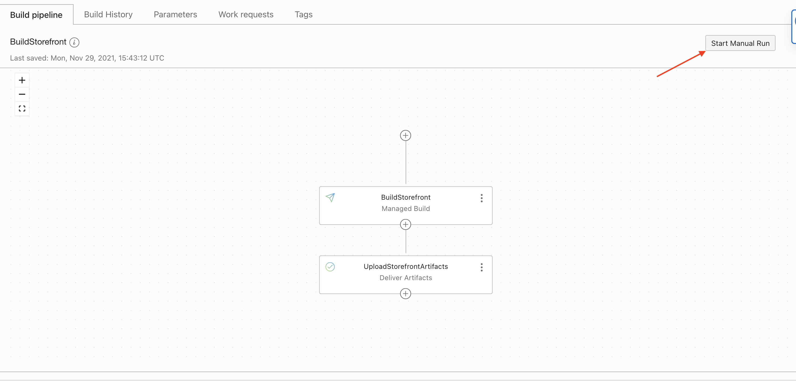
  
  2. On the manual run form note that you have the option to change the value of the `YOUR_INITIALS` parameter - hopefully you correctly set the default value to be your actual initials as used when you created the OCIR repository, but if you got that wrong now you have an opportunity to set the value you want to use. Click the **Start Manual Run** button
  
  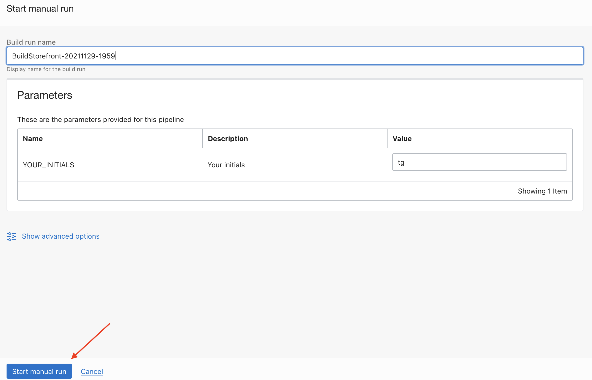

<details><summary><b>How do I use the parameters to specify the image in my deployment ?</b></summary>

Note that all build pipeline parameters *must* have a default value, this is because if the pipeline was triggered automatically (we will look at this later in the lab) there is no direct human involvement, but of course we do need a value for steps and stages that use it, so this way there is always a value provided.

---
</details>

This run will take around 5 mins to complete .

There are now two stages listed in the **Build run progress**, the log file will hold all of them, but you can click on the three dot's to the right of each stage to see the stage specific outputs. 

The `BuldStorefront` stage should progress as before (we haven't changed anything that might impact it yet) but once both stages of the build pipeline have completed there will now be output from the `UploadStorefrontArtifacts` stage similar to below

```
2021-11-01T18:24:13.454Z Provisioning environment for delivering the artifacts.   
2021-11-01T18:24:31.517Z Starting UPLOAD_ARTIFACT service_yaml   
2021-11-01T18:24:32.741Z Starting upload UIM artifact service_yaml   
2021-11-01T18:24:33.183Z Upload UIM artifact path serviceStorefront.yaml, version 1.0.0 completed successfully.   
2021-11-01T18:24:33.188Z Completed UPLOAD_ARTIFACT service_yaml successfully to the deploy artifact ocid1.devopsdeployartifact.oc1.eu-frankfurt-1.amaaaaaa4g77oeyav46meckg46hhyb3vzffc6m762tern5y4qnvtezi7cuiq   
2021-11-01T18:24:33.190Z Starting UPLOAD_ARTIFACT ingressRules_yaml   
2021-11-01T18:24:33.442Z Starting upload UIM artifact ingressRules_yaml   
2021-11-01T18:24:33.750Z Upload UIM artifact path ingressStorefrontRules.yaml, version 1.0.0 completed successfully.   
2021-11-01T18:24:33.750Z Completed UPLOAD_ARTIFACT ingressRules_yaml successfully to the deploy artifact ocid1.devopsdeployartifact.oc1.eu-frankfurt-1.amaaaaaa4g77oeyaiabfpdbwaq52xkwnzprdfvejh7slbzpwon55h2j7axgq   
2021-11-01T18:24:33.751Z Starting UPLOAD_ARTIFACT deployment_yaml   
2021-11-01T18:24:33.861Z Starting upload UIM artifact deployment_yaml   
2021-11-01T18:24:34.178Z Upload UIM artifact path storefront-deployment.yaml, version 1.0.0 completed successfully.   
2021-11-01T18:24:34.179Z Completed UPLOAD_ARTIFACT deployment_yaml successfully to the deploy artifact ocid1.devopsdeployartifact.oc1.eu-frankfurt-1.amaaaaaa4g77oeyae53hxpr555m4i6tjub6onmtbxm33q6e7gu3uw5c3vdtq   
2021-11-01T18:24:34.179Z Starting UPLOAD_ARTIFACT storefront_container_image   
2021-11-01T18:24:46.588Z Starting OCIR upload for artifact storefront_container_image, image uri: lhr.ocir.io/oraseemeatechse/tgdevops/storefront:1.0.0  
2021-11-01T18:25:43.515Z Completed UPLOAD_ARTIFACT storefront_container_image successfully to the deploy artifact ocid1.devopsdeployartifact.oc1.eu-frankfurt-1.amaaaaaa4g77oeyamuwi6xqkqaapflh2xajo2l6mscxqy7wzjrat2lkajmpq   
2021-11-01T18:25:55.601Z Completed Deliver Artifact stage.   
```

A couple of interesting things to note, for the UIM uploads (these are the yaml files being transfered to the artifact repository) you'll see that it's uploading `version 1.0.0` this is based on the `${STOREFRONT_VERSION}` we specified for the version in the upload stage, and of course the actual value of `${STOREFRONT_VERSION}` is the variable we extracted from the source code in the initial steps of the `build_spec.yaml` file (other approaches to identifying the version are of course possible). It is of course critical that we had said that this variable was to be exported form the build stage as otherwise we wouldn't have had a value to use in the `UploadStorefrontArtifacts` stage.

A similar thing has also happened in the container image upload step (the last few lines above) in this case the `OCIR_HOST` variable value was `lhr.ocir.io`, the `OCIR_STORAGE_NAMESPACE` variable value was `oraseemeatechse` (both of these were transfered from the vault variables which got their values from the contents of the secrets in the vault) and `YOUR_INITIALS` you set as a pipeline parameter  (of course your values will differ) the `STOREFRONT_VERSION` is extracted from the source code as described above.

## Task 6: Examining the resulting artifacts

Let's go and look at what our pipeline has produced

  1. Navigate to the OCIR registry, Click on the "Hamburger" menu select `Developer Services` then click on `Container Registry`
  
  
  
  2. Expand the repository `<YOUR_INITIALS>/storefront`, you'll see that the version `1.0.0` image you just built and uploaded is now in the list.
  
  
  

  3. On the left of the page click **Artifact Registry** page (or navigate to it via the Hamburger menu -> Developer services -> Artifact registry) Click on the name of your repository in the list

  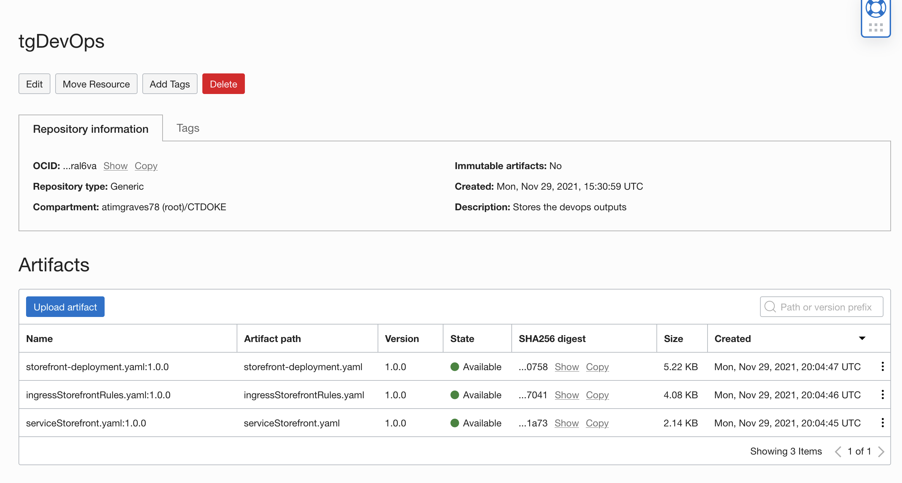

  4. You'll see the artifacts you just created in there. Click the "three dot's" menu on the right side of the `storefront-deployment.yaml:0.0.1` row and select download to download this to your computer. 

  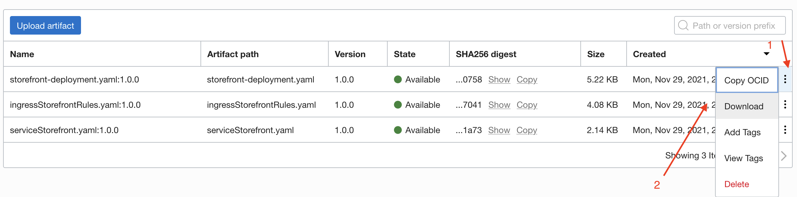
  
  Once it's downloaded open the file in a notepad or some form of text editor

  5. Locate the `namespace` section - it still refers to `${KUBERNETES_NAMESPACE}` 

```yaml
  metadata:
  name: storefront
  namespace: ${KUBERNETES_NAMESPACE}
spec:
```
 
   6. Locate  the container image, it  still refers to `${OCIR_HOST}/${OCIR_STORAGE_NAMESPACE}/${YOUR_INITIALS}devops/storefront:${STOREFRONT_VERSION}`. The parameters we specified for the artifact name and version have been substituted, but not the parameters within the actuall artifacts themselves. Clearly this will need to be done - after all Kubernetes has no idea where an image location of `${OCIR_HOST}/${OCIR_STORAGE_NAMESPACE}/${YOUR_INITIALS}devops/storefront:${STOREFRONT_VERSION}` would be !
   
```yaml
   containers:
      - name: storefront
        # This needs to match the artifact details is using OCI DevOps
        image: ${OCIR_HOST}/${OCIR_STORAGE_NAMESPACE}/${YOUR_INITIALS}/storefront:${STOREFRONT_VERSION}
        imagePullPolicy: Always
        ports:
```

Fortunately for us the deployment pipelines can do this when they run, which takes is neatly to the next section on how to deploy the artifacts into a deployment environment, Kubernetes in this case.

## End of the Module, what's next ?

We can now extract out artifacts form the build process, the next step is to define a deployment pipeline and have the build pipeline run it automatically when it completes.

## Acknowledgements

* **Author** - Tim Graves, Cloud Native Solutions Architect, EMEA OCI Centre of Excellence
* **Last Updated By** - Tim Graves, November 2021