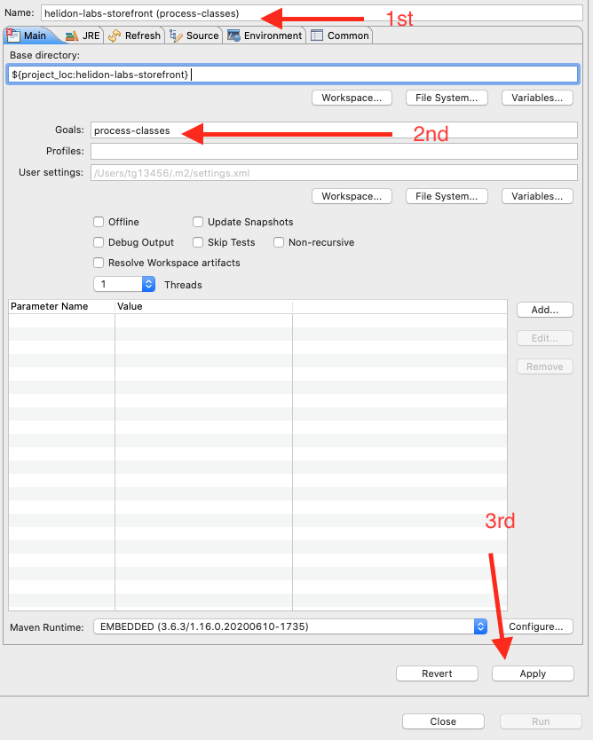

# Specifying OpenAPI information with Helidon

This is an optional module for the Helidon lab. It is currently not required that this module be completed to enable other optional modules.

<details><summary><b>Self guided student - video introduction</b></summary>


This video is an introduction to the Helidon Open API (ex Swagger) lab. Depending on your browser settings it may open in this tab / window or open a new one. Once you've watched it please return to this page to continue the labs.

[](https://youtu.be/A_gVG2cb308 "Helidon Open APIlab introduction video")

---

</details>

## Introduction

This is an optional module with coding.

**Estimated module duration** 20 mins.

### Objectives

This module shows us how Helidon supports the creation of OpenAPI documents based on the actual specific configuration of the Helidon microservices, enabling you to be sure that you can get the current API description and not require manual maintenance of the information.

### Prerequisites

You need to have completed the **Cloud Native support in Helidon** module.

## Task 1: Why have a self describing API ?

This module is how to get Helidon to self-describe the REST API you are offering. There are several use cases for this, some of those are :

A/ You need the API description in a consistent machine readable form that can be processed by other applications, for example you are using an API gateway and need to define rules for certain endpoints

B/ You want to ensure that the documentation of the REST API actually reflects the implementation, it's not uncommon for documentation and implementation to be out of sync if they are separately maintained through manual processes.

C/ You can't find the documentation for a service, or it is a service where you have the jar file, but the documentation was on a since removed website and not even the internet archive can help!

D/ You want to automatically create code based on the API.

To address this the idea of self describing API end points was developed, originally this was developed by an application having a "well known" URL that just returned a manually maintained text document that was distributed as part of the jar file. It then evolved into machine readable data formats, for example the Swagger REST API description format based on JSON, which has since been donated to the community under the name Open API and is now the de-facto data format. For a more detailed history see the Wikipedia [Open API page.](https://en.wikipedia.org/wiki/OpenAPI_Specification)

OpenAPI describes the data format, but there has also been the development of tooling and programming approaches to the automatic runtime generation of the OpenAPI data based on information in the source code. This means that the OpenAPI documentation delivered by the service is automatically in sync with the actual code of the service itself.

In the case of Microprofile (and this Helidon as a Microprofile implementation) this was done through the MicroProfile OpenAPI specification which defines annotations to be used when generating the OpenAPI documents and associated the control mechanisms (for example to exclude API elements that are not intended to be publicly exposed)

## Task 2: Defining the API documentation in your code

When a system like Helidon MP runs the annotations you've applied to your code need to be identified so they can be processed. This is done automatically for you by the runtime, and annotation processors are called to perform whatever actions you have specified (e.g. setting up a start / stop on a timer on entry / exit form a method)

There are two ways to identify the annotations in your code:

A/ The runtime can search through every class and method to find them each time the program is started, this can be time consuming if you have a lot of code

B/ When the service is built the build process creates an index (usually packaged into the jar file) that is processed when the service starts, and each annotation can be immediately identified. This means that the code scanning process only happens once at build time and results in a faster startup, though it does mean a slightly longer build phase and also a slightly larger deployment.

In general the costs of building and storing an index are way smaller than those of scanning each time, and this is the approach that Helidon uses when packaging a service using Maven builds, though when working with within Eclipse (which has it's own built in version of Maven) the compile process only does a scan as otherwise you'd have to build the index each time you saved a file which would slow down the development process (This is why you may see warning messages about missing jandex.idx files when running the micro-servcies in Eclipse)

<details><summary><b>How do I enable the OpenAPI support in Helidon</b></summary>

To use OpenAPI you need to include the right jar files in your build. That's already been done for you in the Maven pom.xml file when the Helidon parent project was imported, so you don;t need to do anything.
 
</details>

To build the index Heldion uses a tool called jandex (Java ANnotaiton inDEXer) to build the index. We will see later in this section how that's run.

## Task 3: Annotating the Storefront

In this module we will be adding annotations to describe the storefront service and the data it consumes and returns. In a production environment you may chose to limit what's documented and restrict it to only the public API elements intended to be seen outside your project (this will of course be up to you how you do this, but in general it's good practice not to document something that can't be seen externally)

You may of course chose to document other services, for example the stockmanager would normally not publicly visible outside the Kubernetes cluster, but you may chose to document it's API to help building internal clients of the service.

### Task 3a: Accessing the OpenAPI documentation

  1. Make sure that the storefront microservice is running.
  
  2. Check you can access the generated OpenAPI documentation using curl

  ```bash
  <copy>curl http://localhost:8080/openapi</copy>
  ```

  ```yaml
info: 
  title: Generated API
  version: '1.0'
openapi: 3.0.3
paths:
  /minimumChange: 
    post: 
      requestBody: 
        content:
          application/json: 
            schema: 
              format: int32
              type: integer
      responses:
        '200': 
          description: OK
    get: 
      responses:
        '200': 
          description: OK
  /status: 
    get: 
      responses:
        '200': 
          content:
            application/json: 
              schema: 
                type: object
          description: OK
  /store/reserveStock: 
    post: 
      requestBody: 
        content:
          application/json: 
            schema: 
              type: object
      responses:
        '200': 
          content:
            application/json: 
              schema: 
                type: object
          description: OK
  /store/stocklevel: 
    get: 
      responses:
        '200': 
          content:
            application/json: 
              schema: 
                items:  {}
                type: array
          description: OK

```

The Open API looks at the code and builds a set of responses based on using Java introspection on the resources, technically this provides information about what the API looks like, but it's not that useful, for example we don't know the details of the JSON objects returned, or in what conditions a given response is generated. Also as it uses introspection which is not that efficient, as we will see later we can create an index at compile time that avoids the introspection and is thus more efficient.

### Task 3b: Defining the Service itself

Firstly we shall define what the top level service provides, this can be done on any of the classes managed by the content and dependency injection syb-system, but it seems most relevant to place the annotations on the StorefrontApplication class.

  1. Open the **StorefrontApplication.java file**, and add the following @OpenAPIDefiniton annotation on the *class declaration* itself:
  
  ```java
   <copy>@OpenAPIDefinition(info = @Info(title = "StorefrontApplication", description = "Acts as a simple stock level tool for a post room or similar", version = "0.0.1"))</copy>
```

The resulting class declaration should look like

  ```java
@ApplicationScoped
@ApplicationPath("/")
@OpenAPIDefinition(info = @Info(title = "StorefrontApplication", description = "Acts as a simple stock level tool for a post room or similar", version = "0.0.1"))
public class StorefrontApplication extends Application {
```

<details><summary><b>Java Imports</b></summary>


You may need to add the following import to the class

```java
<copy>import org.eclipse.microprofile.openapi.annotations.OpenAPIDefinition;</copy>
```

---

</details>

<details><summary><b>Explanation of the annotations</b></summary>

The `@OpenAPIDefinition` indicates that this is defining the API top level details for this project. The `@Info` is an annotation that defines what that information actually is.

The title, description and version fields are I hope self explanatory 

---

</details>

  3. Save the file and restart the storefront Check you can access the generated OpenAPI documentation using curl

  ```bash
  <copy>curl http://localhost:8080/openapi</copy>
  ```

  ```yaml
info: 
  description: Acts as a simple stock level tool for a post room or similar
  title: StorefrontApplication
  version: 0.0.1
openapi: 3.0.3
paths:
  /minimumChange: 
    post: 
      requestBody: 
.....
<the rest of the output>
```

This has now told us what the application itself does - this is a pretty good start.

<details><summary><b>Didn't see the updates ?</b></summary>

This means that you probably already have a index file, in some situations this can be created if you did a Maven build. For now we're going to just remove it and rely on introspection - we'll see how to create the index file itself for more efficient use later on.

  - To remove the index file open the Home directory in the desktop. then open the workspace
  
  - Click right in the window and chose the "Open Terminal here" option
  
  - In the terminal run the following command, be sure to run it exactly as it is below
  
  ```bash
  <copy>find . -name jandex.idx -print -exec rm \{\} \;</copy>
  ```
  
  You may see some output like `./target/classes/META-INF/jandex.idx` this means it has located an index file and deleted it.
  
---

</details>


## Task 4:  The default OpenAPI document

Now we've added an annotation covering the application description let's look at basic document. There is no need to have the stockmanager running, but if it already is don't worry.


### Task 4a: What does this output mean ?
In summary it means that adding the `@OpenAPIDefinition` triggered Helidon to scan for classes references by the application, looking for REST endpoints (`@GET`, `@POST` etc. annotations). Helidon then builds a OpenAPI document that returns the YAML description. Note that the precise order of the major sections may change (it depends on the order the annotations are processed) so you may see the `info:` section before or after the `path:` section

  1. First locate the `info:` section. 

  ```yaml
info: 
  description: Acts as a simple stock level tool for a post room or similar
  title: StorefrontApplication
  version: 0.0.1
```

This contains the information you supplied to the `@OpenAPIDefinition` annotation.

  2. The `openapi: 3.0.3` simply defines what version of the OpenAPI document specification this document conforms to.

  3. Now let's look at the `paths` section

  ```yaml
paths:
  /minimumChange: 
    post: 
      requestBody: 
        content:
          application/json: 
            schema: 
              format: int32
              type: integer
      responses:
        '200': 
          description: OK
    get: 
      responses:
        '200': 
          description: OK
  /status: 
    get: 
      responses:
        '200': 
          content:
            application/json: 
              schema: 
                type: object
          description: OK
  /store/reserveStock: 
    post: 
      requestBody: 
        content:
          application/json: 
            schema: 
              type: object
      responses:
        '200': 
          content:
            application/json: 
              schema: 
                type: object
          description: OK
  /store/stocklevel: 
    get: 
      responses:
        '200': 
          content:
            application/json: 
              schema: 
                items:  {}
                type: array
          description: OK

```

The `paths:` section defines the REST endpoints offered by the service, in this case `/minimumChange`, `/status`, `/store/reserveStock` and `/store/stocklevel` for each path it defines the method used (`get`, `post`) the parameters to the request and the response. Thus we can see that the `/store/stocklevel` path returns an array of objects of type `application/json`.

<details><summary><b>Want the output in JSON ?</b></summary>

Helidon can generate the OpenAPI document in yaml (the default) or in JSON. To generate JSON use the Accept header.
 - In a terminal window type:

  ```bash
  <copy>curl -i -H "Accept:application/json" http://localhost:8080/openapi</copy>
  ```
  

```json
 {
  "info":  {
    "description": "Acts as a simple stock level tool for a post room or similar",
    "title": "StorefrontApplication",
    "version": "0.0.1"
  },
  "openapi": "3.0.3",
  "paths": {
    "/minimumChange":  {
      "post":  {
        "requestBody":  {
          "content": {
            "application/json":  {
              "schema":  {
                "format": "int32",
                "type": "integer"
              }
            }
          }
        },
        "responses": {
          "200":  {
            "description": "OK"
          }
        }
      },
      "get":  {
        "responses": {
          "200":  {
            "description": "OK"
          }
        }
      }
    },
    "/status":  {
      "get":  {
        "responses": {
          "200":  {
            "content": {
              "application/json":  {
                "schema":  {
                  "type": "object"
                }
              }
            },
            "description": "OK"
          }
        }
      }
    },
    "/store/reserveStock":  {
      "post":  {
        "requestBody":  {
          "content": {
            "application/json":  {
              "schema":  {
                "type": "object"
              }
            }
          }
        },
        "responses": {
          "200":  {
            "content": {
              "application/json":  {
                "schema":  {
                  "type": "object"
                }
              }
            },
            "description": "OK"
          }
        }
      }
    },
    "/store/stocklevel":  {
      "get":  {
        "responses": {
          "200":  {
            "content": {
              "application/json":  {
                "schema":  {
                  "items":  {
                    },
                  "type": "array"
                }
              }
            },
            "description": "OK"
          }
        }
      }
    }
  }
}


```

For the rest of the lab documentation I'm going to stick with yaml as it's a bit shorter, but feel free to use JSON if you prefer.

---

</details>


### Task 4b: To many paths, how do we hide private ones ?
This has given us the entire API, but we may not want people to be using `/minimumChange` and `/status` is probably not relevant to external callers, and  either. (As we'll see in the Kubernetes sections it's more for the internal operation of the cluster and availability than something an client would call). So we need a way to remove some end-points from the output.

  1. Open the src/main/resources/META-INF/microprofile-config.properties file

  2. Uncomment the line `mp.openapi.scan.exclude.classes=com.oracle.labs.helidon.storefront.resources.StatusResource,com.oracle.labs.helidon.storefront.resources.ConfigurationResource`
 
(It's the last line, so it may be a bit hidden)
 
This tells Helidon to ignore any paths it finds in the `StatusResource` and `ConfigurationResource` classes when generating the Open API document.

<details><summary><b>What about the Rest Client interfaces ? They have matching annotations </b></summary>

Many microservices also talk to other microservices, and so their code may include interfaces representing those microservices.  Those annotations may of course include annotations that make it look as it they are a REST endpoint, for example the interface will have `@Path` annotations. Of course you don't want them to be included in the OpenAPI spec of your service (interfaces are after all internal implementation mechanisms, not part of your public API). 

Fortunately Helidon's OpenAPI implementation seems to automatically ignore any interfaces annotated with RegisterRestClient so you don't have to exclude those by hand. You may have noticed that you haven't seen anything relating to the StockManager interface in the OpenAPI output.

---

</details>

<details><summary><b>Other configuration settings for OpenAPI</b></summary>

The Helidon runtime supports a large number of configuration settings that can be used to control the generation of the OpenAPI document, this include the ability to specify packages as well as classes to include / exclude, or if you need finer grained control you can even define filter and model classes that chose exactly which paths will be included or removed. 

See the OpenAPI documentation (link at the bottom of this module) for the full details. 

---

</details>

<details><summary><b>Why use the microprofile-config.properties file</b></summary>

It is of course possible to apply this exclusion in any of the config files, but this is an example of a setting that as a developer you probably want to have applied by default in every deployment, after all you're suppressing internal information that you probabaly wouldn't want to be visible to non developers. The microprofile-config.properties file is embedded into the class path, so that will ensure that the default behavior is what you want. If someone want's to they can of course override that in a local file system based config file such as conf/storefront-config.yaml

---

</details>

Let's see how this looks.

  3. Restart the storefront service (this will cause the the microprofile-config.propeties file to be re-read - it isn't one of the ones that we configured to be checked for changes)

  4. Check out the updated documentation that's generated

  ```bash
  <copy>curl -i http://localhost:8080/openapi</copy>
  ```
  
  ```yaml
info: 
  description: Acts as a simple stock level tool for a post room or similar
  title: StorefrontApplication
  version: 0.0.1
openapi: 3.0.3
paths:
  /store/reserveStock: 
    post: 
      requestBody: 
        content:
          application/json: 
            schema: 
              type: object
      responses:
        '200': 
          content:
            application/json: 
              schema: 
                type: object
          description: OK
  /store/stocklevel: 
    get: 
      responses:
        '200': 
          content:
            application/json: 
              schema: 
                items:  {}
                type: array
          description: OK
```

This looks much better, we can see the details of the core REST API we want to expose, and we're not polluting it with end-points that in a production system would not be exposed.
  
Strictly speaking this is all that you need to be able to use the API from a caller perspective, you know what to send and what to expect in return, but it's not very detailed information, and it doesn't actually tell you much about what those end-points do (of course this is not completely true here because as a good programmer I've tried to use meaningful names).

 
## Task 5: OpenAPI annotations on the REST Methods

### Task 5a: Documenting the methods
 
We should also describe the actual REST API endpoints themselves.
 
As we've excluded the StartResource and ConfigurationResource on the basis that in this case they would not normally be externally visible we only need to document the StorefrontResource.
 
  1. Open the StorefrontResource.java file

  2. Add `@Operation` and `@APIResponse` annotations as below to the listAllStock method

The result will look like

  ```java
	@Metered(name = "listAllStockMeter", absolute = true)
	@Operation(summary = "List stock items", description = "Returns a list of all of the stock items currently held in the database (the list may be empty if there are no items)")
	@APIResponse(description = "A set of ItemDetails representing the current data in the database", responseCode = "200", content = @Content(schema = @Schema(name = "ItemDetails", implementation = ItemDetails.class, type = SchemaType.ARRAY), example = "[{\"itemCount\": 10, \"itemName\": \"Pencil\"},"
			+ "{\"itemCount\": 50, \"itemName\": \"Eraser\"}," + "{\"itemCount\": 4600, \"itemName\": \"Pin\"},"
			+ "{\"itemCount\": 100, \"itemName\": \"Book\"}]"))
	public Collection<ItemDetails> listAllStock() {
	....
```

<details><summary><b>Java Imports</b></summary>


You may need to add the following imports to the class

```java
<copy>import org.eclipse.microprofile.openapi.annotations.Operation;
import org.eclipse.microprofile.openapi.annotations.responses.APIResponse;
import org.eclipse.microprofile.openapi.annotations.enums.SchemaType;
import org.eclipse.microprofile.openapi.annotations.media.Content;</copy>
```

---

</details>

<details><summary><b>Explaining the annotations</b></summary>

`@Operation` is basically a description of the REST end point itself, most of the attributes should be self explanatory.

There is one useful attribute for the `@Operation` annotation which is the `hidden` attribute. If `hidden` is set to true, for example  `@Operation(hidden = true)` then this REST end point will not be included in the generated OpenAPI documentation. This means that you can hide some REST end points in a class without hiding all of them, so in effect a per method version of the `mp.openapi.scan.exclude.classes` property.

`@APIResponse` defines what the results of the operation are, hopefully the responseCode indicates the HTTP status code this defines (more on different codes later) For reasons that are unclear this is defined as a String rather than a numeric code, or a StatusType value, I suspect this means you could use the response name rather than just the numeric code, but as most code generators would use the numeric value this seems a bit odd.

The content attribute of the `@APIResponse` defines what the method returns, in this case an array of instances of ItemDetails (we specify the name and that will be used later to refer to the ItemDetails, I'm unclear why it can't just extract the name automatically from the implementation class if a name isn't provided though). Note that it also shows some example text, This can be used by some code generation tools to auto generate a "stub" response for you.

---

</details>

Let's look at the updated REST API description 

  3. Stop the existing instance of storefront and restart it, this will do it's usual scan and the new annotations will be recognized.

  4. Get the updated documentation, in a terminal window type

  ```bash
  <copy>curl -i http://localhost:8080/openapi</copy>
  ```
  
(The following has been truncated to only include the `/store/stocklevel` part of the `paths:` section)

  ```yaml
  /store/stocklevel: 
    get: 
      description: Returns a list of all of the stock items currently held in the
        database (the list may be empty if there are no items)
      responses:
        '200': 
          content:
            application/json: 
              example: '[{"itemCount": 10, "itemName": "Pencil"},{"itemCount": 50,
                "itemName": "Eraser"},{"itemCount": 4600, "itemName": "Pin"},{"itemCount":
                100, "itemName": "Book"}]'
              schema: 
                items: 
                  type: object
                type: array
          description: A set of ItemDetails representing the current data in the database
      summary: List stock items

```

We can now see the details of the `/store/stocklevel` end point. 

Let's now add annotations to the `/store/reserveStock` method that let's us describe the arguments to the end point


  5. Open the StorefrontResource.java file

  6. Add the following annotations to the reserveStock method

  ```java
    	<copy>@Operation(summary = "Reserves a number of stock items", description = "reserves a number of stock items in the database. The number of stock items being reserved must be greater than the defined minimum change")
	@APIResponse(description = "The updated stock details for the item", responseCode = "200", content = @Content(schema = @Schema(name = "ItemDetails", implementation = ItemDetails.class), example = "{\"itemCount\": 10, \"itemName\": \"Pencil\"}"))</copy>
```

  9. Add the following annotation to the reserveStock method itemRequest parameter

  ```java
    <copy>@RequestBody(description = "The details of the item being requested", required = true, content = @Content(schema = @Schema(name = "ItemRequest", implementation = ItemRequest.class), example = "{\"requestedItem\",\"Pencil\",\"requestedCount\",5}"))</copy>
```

The updated method declaration should now look like the following. Note that other annotations for metrics, timers etc. may not be as displayed here depending on what sections of the lab you've done. Comments have been omitted to simplify the text

  ```java
    @POST
	@Path("/reserveStock")
	@Produces(MediaType.APPLICATION_JSON)
	@Consumes(MediaType.APPLICATION_JSON)
	@Timed(name = "reserveStockTimer")
	@Fallback(StorefrontFallbackHandler.class)
	@Operation(summary = "Reserves a number of stock items", description = "reserves a number of stock items in the database. The number of stock items being reserved must be greater than the defined minimum change")
	@APIResponse(description = "The updated stock details for the item", responseCode = "200", content = @Content(schema = @Schema(name = "ItemDetails", implementation = ItemDetails.class), example = "{\"itemCount\": 10, \"itemName\": \"Pencil\"}"))
	public ItemDetails reserveStockItem(
			@RequestBody(description = "The details of the item being requested", required = true, content = @Content(schema = @Schema(name = "ItemRequest", implementation = ItemRequest.class), example = "{\"requestedItem\",\"Pencil\",\"requestedCount\",5}")) ItemRequest itemRequest)
			throws MinimumChangeException, UnknownItemException, NotEnoughItemsException {
```

<details><summary><b>Java Imports</b></summary>


You may need to add the following imports to the class

```java
<copy>import org.eclipse.microprofile.openapi.annotations.parameters.RequestBody;</copy>
```

---

</details>

  10. To re-scan for the annotations stop then restart the storefront instance.

  11. Get the updated documentation, in a terminal window type

  ```bash
  <copy>curl -i http://localhost:8080/openapi</copy>
  ```
  
(The following has been truncated to only include the reserveStock path in the `paths:` section)

  ```yaml
  /store/reserveStock: 
    post: 
      description: reserves a number of stock items in the database. The number of
        stock items being reserved must be greater than the defined minimum change
      requestBody: 
        content:
          application/json: 
            example: '{"requestedItem","Pencil","requestedCount",5}'
            schema: 
              type: object
        description: The details of the item being requested
        required: true
      responses:
        '200': 
          content:
            application/json: 
              example: '{"itemCount": 10, "itemName": "Pencil"}'
              schema: 
                type: object
          description: The updated stock details for the item
      summary: Reserves a number of stock items

```

We can see that there is a lot more info on the `/store/reserveStock` REST endpoint, and also on the argument, we can see that it's required and also a description, but we don't actually see the details of the 

### Task 5c: Documenting the error status codes 

Of course not every REST API call returns successfully, there may be problems, for example in the case of the `reserveStock` method it might throw a `UnknownItemException` In an earlier module we put an `@Fallback` annotation on the method directing Helidon to pass exceptions a handler class which converts them into relevant http status codes, in this case an `UnknownItemException` is converted into a 404 / Not Found status. But we need a way to document this and the other returns a client may reasonably be expected to handle.

  1. In the StorefrontResource class Add the following additional `@APIResponse` annotations to the reserveStock method

  ```java
    <copy>@APIResponse(description = "The requested item does not exist", responseCode = "404")
	@APIResponse(description = "The requested change does not meet the minimum level required for the change (i.e. is <= the minimumChange value)", responseCode = "406")
	@APIResponse(description = "There are not enough of the requested item to fulfil your request", responseCode = "409")</copy>
```

The updated method declaration should now look like this (comments omitted for clarity)

  ```java
	@POST
	@Path("/reserveStock")
	@Produces(MediaType.APPLICATION_JSON)
	@Consumes(MediaType.APPLICATION_JSON)
	@Timed(name = "reserveStockTimer")
	@Fallback(StorefrontFallbackHandler.class)
	@Operation(summary = "Reserves a number of stock items", description = "reserves a number of stock items in the database. The number of stock items being reserved must be greater than the defined minimum change")
	@APIResponse(description = "The updated stock details for the item", responseCode = "200", content = @Content(schema = @Schema(name = "ItemDetails", implementation = ItemDetails.class), example = "{\"itemCount\": 10, \"itemName\": \"Pencil\"}"))
	@APIResponse(description = "The requested item does not exist", responseCode = "404")
	@APIResponse(description = "The requested change does not meet the minimum level required for the change (i.e. is <= the minimumChange value)", responseCode = "406")
	@APIResponse(description = "There are not enough of the requested item to fulfil your request", responseCode = "409")
	public ItemDetails reserveStockItem(
			@RequestBody(description = "The details of the item being requested", required = true, content = @Content(schema = @Schema(name = "ItemRequest", implementation = ItemRequest.class), example = "{\"requestedItem\",\"Pencil\",\"requestedCount\",5}")) ItemRequest itemRequest)
			throws MinimumChangeException, UnknownItemException, NotEnoughItemsException {
```

  2. Stop the storefront, re-start it as usual

  3. Get the updated documentation, in a terminal window type

  ```bash
  <copy>curl -i http://localhost:8080/openapi</copy>
  ```
  
(The following has been truncated to only include the `/store/reserveStock` path in the `paths:` section)

  ```yaml
  /store/reserveStock: 
    post: 
      description: reserves a number of stock items in the database. The number of
        stock items being reserved must be greater than the defined minimum change
      requestBody: 
        content:
          application/json: 
            example: '{"requestedItem","Pencil","requestedCount",5}'
            schema: 
              type: object
        description: The details of the item being requested
        required: true
      responses:
        '200': 
          content:
            application/json: 
              example: '{"itemCount": 10, "itemName": "Pencil"}'
              schema: 
                type: object
          description: The updated stock details for the item
        '404': 
          description: The requested item does not exist
        '406': 
          description: The requested change does not meet the minimum level required
            for the change (i.e. is <= the minimumChange value)
        '409': 
          description: There are not enough of the requested item to fulfil your request
      summary: Reserves a number of stock items

```

We now have OpenAPI documentation that defines the reasonable error conditions that may be generated.

<details><summary><b>What API Responses to document ?</b></summary>


As a general rule of thumb you should only document the http status responses your end point might reasonably throw, in the case above that's 200 (OK), 404 / Not Found (when a request is made to reserve an item not in the database) 409 / CONFLICT (when there are not enough items available to reserve) and 406 / Not Acceptable (when the number of items to be reserved is not acceptable due to minimum change restrictions).

We have added `@APIResponse` annotations to deal with those as any client could reasonably expect to encounter them, but for codes that may be generated due to internal problems, for example the catch all 500 / Internal Server error and it's related 5xx series of codes we have not documented as a client would not expect to encounter them under normal operation of the call.

Here we have documented a the typical set of http status codes that the method can reasonably return, though of course exactly which ones are included in the documentation will vary by end point and your development standards.

---

</details>


## Task 6: Defining our data

You may have noticed that we don;t ac tually have any details of the data being transfered though, the content schema type is just object.

  1. Open the ItemRequest class in the com.oracle.labs.helidon.storefront.data package and add @Schema annotations

  2. Add the following annotation to the class definition itself
  
  ```java
   <copy>@Schema(name = "ItemRequest", description = "Details of a Item reservation request")</copy>
```

  3. Add the following annotation to the requestedItem field
  
  ```java
    <copy>@Schema(required = true, description = "Name of the item being requested", example = "Pencil")</copy>
```

  4. Add the following annotation to the requestedCount field

  ```java
    <copy>@Schema(name = "ItemRequest", description = "Details of a Item reservation request", example = "{\"requestedItem\", \"Pin\", \"requestedCount\",5}")</copy>
```

The resulting class looks like :

```java
@Data
@NoArgsConstructor
@AllArgsConstructor
@Schema(name = "ItemRequest", description = "Details of a Item reservation request")
public class ItemRequest {
	@Schema(required = true, description = "Name of the item being requested", example = "Pencil")
	private String requestedItem;
	@Schema(name = "ItemRequest", description = "Details of a Item reservation request", example = "{\"requestedItem\", \"Pin\", \"requestedCount\",5}")
	private int requestedCount;
}
```

<details><summary><b>Java Imports</b></summary>


You may need to add the following import to the class

```java
<copy>import org.eclipse.microprofile.openapi.annotations.media.Schema;</copy>
```

---

</details>

<details><summary><b>Explaining the annotations</b></summary>

`@Schema` is a commonly used annotation with OpenAPI, it basically is used to identify data objects and their fields. 

There are a *very* large number of attributes that can be added to a `@Schema` annotation, and you can see common (and I hope self explanatory) ones here. There are also attributes that define minimum and maximum values of an attribute, or define the allowable fields of an enum. These could be used to enable client code to apply data validation checks itself before they get to the service itself.

Some annotations like `required` might seem a bit strange, after all in Java there is no concept of optional attributes on a class or method, however it's important to remember that this relates to data being **transfered**, not to data at rest. The Helidon framework will create the **instance** of the class and it's quite reasonable that a class may have a default value for a field. In that case it's not going to be **required** as the REST API request defines a value for that field unless the request want's to override the default.

Full details of the `@Schema` annotation are in the Microprofile OpenAPI documentation linked to at the end of this module.

---

</details>

The ItemDetails class has already been updated for you with the same annotations


  1. Stop the storefront, re-start it as usual

  2. Get the updated documentation, in a terminal window type

  ```bash
  <copy>curl -i http://localhost:8080/openapi</copy>
  ```
  
  3. Note that it is the same as before - the `@Schema` entries are not showing !
  
  
## Task 7: The index file

Where is the data we just added ? When we run the storefront and look in the OpenAPI output for anything on ItemDetail and ItemRequest it's not there! It turns out that we need an index file as the OpenAPI introspection can only take us so far, and doesn't look at non REST API classes.

We've been relying on Java introspection to generate the index used for the OpenAPI documentation, though this is effective (up to a point), and means that the returned OpenAPI document represents your input it's not that efficient, or complete. In fact you may have noticed content similar to the following in your output

```
2022.03.03 11:07:55.801 INFO io.helidon.microprofile.openapi.OpenApiCdiExtension !thread!: OpenAPI support could not locate the Jandex index file META-INF/jandex.idx so will build an in-memory index.
This slows your app start-up and, depending on CDI configuration, might omit some type information needed for a complete OpenAPI document.
Consider using the Jandex maven plug-in during your build to create the index and add it to your app.
```

In a production environment where we care less about the ease of seeing our changes and more about efficient operation we need to build an index of the annotations. As we just saw we also need to do this to ensure that we get all of the OpenAPI annotations processed - not just those relating to the REST API's.

Unlike the REST processing annotations the OpenAPI processing only operates against a jandex index for non REST API methods, and won't scan for OpenAPI annotations in the class files (I'm not sure if this is a bug or a feature)

Because of this the jandex index needs to be built to reflect the OpenAPI annotations. To do this you can manually run maven in Eclispe with the process-classes goal. If you run a full maven build it will also get built. To make the development process faster when we save a file in Eclipse we have disabled the creation of the jandex index (Eclipse runs it's own internal maven processing every time a source code file is saved). This means that the jandex.idx file is not created on file save.

To be more efficient for now we will create a run configuration to run this processing and not run the entire build and packaging process.

### Task 7a: Creating the index file

  1. Select the helidon-labs-storefront project (this is the project title in the explorer) click right -> Run As -> Maven Build .... (Chose the version with the dots)

  

Update the popup with the following

  2. set the **Name** to be `helidon-labs-storefront (process-classes)` (if you chose something else it's fine, just remember to use that later on)

  3. In the **Goals** enter `process-classes`

  4. Click **Apply** then `Close`

  

Now to run a build with this target.

  3. Click right on the **project** name (helidon-labs-storefront) in Eclipse, then chose `Run As` then `Maven build`  (This is the version **without** the three dots!)

  

Depending on the precise eclispe configuration there **may** be a resulting popup window, do not worry if this is not displayed and the build just continues

  4. If there is a popup then chose the process-classes option.

  

  5. Then click the OK button

In the console tab you'll see output similar to the following

  ```
[INFO] ------------------------------------------------------------------------
[INFO] Detecting the operating system and CPU architecture
[INFO] ------------------------------------------------------------------------
[INFO] os.detected.name: osx
[INFO] os.detected.arch: x86_64
[INFO] os.detected.version: 12.2
[INFO] os.detected.version.major: 12
[INFO] os.detected.version.minor: 2
[INFO] os.detected.classifier: osx-x86_64
[INFO] 
[INFO] -----------------< com.oracle.labs.helidon:storefront >-----------------
[INFO] Building storefront 2.4.1
[INFO] --------------------------------[ jar ]---------------------------------
[INFO] 
[INFO] --- maven-resources-plugin:2.7:resources (default-resources) @ storefront ---
[INFO] Using 'UTF-8' encoding to copy filtered resources.
[INFO] Copying 3 resources
[INFO] 
[INFO] --- maven-compiler-plugin:3.8.1:compile (default-compile) @ storefront ---
[INFO] Nothing to compile - all classes are up to date
[INFO] 
[INFO] --- jandex-maven-plugin:1.0.6:jandex (make-index) @ storefront ---
[INFO] ------------------------------------------------------------------------
[INFO] BUILD SUCCESS
[INFO] ------------------------------------------------------------------------
[INFO] Total time:  13.783 s
[INFO] Finished at: 2022-03-03T11:09:19Z
[INFO] ------------------------------------------------------------------------

```

The version numbers may differ.

Towards the end of the output you can see that the Maven jandex plugin is run.

---

</details>

### Task 7b: Using the index file

Now we have created the index file we can use it.

One key point here, the index file will always be used if it's present abd the code will not use introspection, this means that now you've created it if you make changes to the OpenAPI annotations unless you re-build the jandex.idx file (or delete it) then you will not get your updates changes. To re-build it just run the maven build again with the process-classes target.

  1. Run the storefront again
  
  2. Note that this time you don't get any warning in the output about a missing jandex.idx file
  
  3. Get the updated documentation, in a terminal window type

  ```bash
  <copy>curl -i http://localhost:8080/openapi</copy>
  ```
  
  Note that there is a new section now called `components` as shown below

```yaml
components: 
  schemas:
    ItemDetails: 
      required:
      - itemCount
      - itemName
      properties:
        itemCount: 
          description: The number of items listed as being available
          example: 10
          format: int32
          type: integer
        itemName: 
          description: The name of the item
          example: Pencil
          type: string
      description: Details of the item in the database
      example:
        itemCount: 10
        itemName: Pencil
      type: object
    ItemRequest: 
      required:
      - requestedCount
      - requestedItem
      properties:
        requestedCount: 
          description: Number of the items being requested, this must be larger than
            the minimumChange
          example: 5
          format: int32
          type: integer
        requestedItem: 
          description: Name of the item being requested
          example: Pin
          type: string
      description: Details of a Item reservation request
      example: '{"requestedItem", "Pin", "requestedCount",5}'
      type: object

```

The `components` section included details of the classes we use to transfer the data using the `@Schema` information we provided.

   4. Look at the `paths` section for `/store/reserveStock`
   
```yaml
  /store/reserveStock: 
    post: 
      description: reserves a number of stock items in the database. The number of
        stock items being reserved must be greater than the defined minimum change
      requestBody: 
        content:
          application/json: 
            example: '{"requestedItem","Pencil","requestedCount",5}'
            schema: 
              $ref: '#/components/schemas/ItemRequest'
        description: The details of the item being requested
        required: true
      responses:
        '200': 
          content:
            application/json: 
              example: '{"itemCount": 10, "itemName": "Pencil"}'
              schema: 
                $ref: '#/components/schemas/ItemDetails'
          description: The updated stock details for the item
        '404': 
          description: The requested item does not exist
        '406': 
          description: The requested change does not meet the minimum level required
            for the change (i.e. is <= the minimumChange value)
        '409': 
          description: There are not enough of the requested item to fulfil your request
      summary: Reserves a number of stock items
```

Note that the description of the request now has a schema field that refers into the components section (using the name we provided in the`@Schema`). The `200` response also does the same.

## Task 8 Documenting your security requirements

The OpenAPI document doesn't specify what's required security wise. Let's add the annotations to do that

  1. At the start of the Storefront class add the following annotations on the Storefront class

```java
<copy>@SecurityScheme(securitySchemeName = "httpBasic", type = SecuritySchemeType.HTTP, scheme = "Basic")
@SecurityRequirement(name = "httpBasic")</copy>
```

The class should now have the following annotations (commends have been removed for brevity

```java
@Path("/store")
@RequestScoped
@Counted
@Authenticated
@Timeout(value = 15, unit = ChronoUnit.SECONDS)
@Slf4j
@NoArgsConstructor
@SecurityScheme(securitySchemeName = "httpBasic", type = SecuritySchemeType.HTTP, scheme = "Basic")
@SecurityRequirement(name = "httpBasic")
public class StorefrontResource {
```

<details><summary><b>Explaining the annotations</b></summary>

`@SecurityScheme` is used to provide a re-usable definition, in this case named `http-basic` whic used the `HTTP` headers as the type of scheme and `Basic` as the actually type. There are many other types available including OAUTH, it's possible to define multiple security schemes inside a `@SecuritySchemes` annotation.  This may be needed if some parts of your code use differing sc hemes, for example some may use OAUTH but others basic http.

 `@SecurityRequirement` specifies the scheme to be used, the name must map onto a SecurityScheme. In this case it applies to the entire class, but it could also be used for a specific method. You can document the need for multiple security schemes using the `@SecurityResuirements` annotation which lets you define multiple schemes of which any can match or `@SecurityRequirementsSets` in which case all the requirements must be satisfied.

---

</details>

  2. Save the Storefront.java fail and rebuild **using the Maven build sequence** (right click on the project then Run As -> Maven Build ....) as described above in Task 7a
  
  3. Run the code again
  
  4. Get the updated documentation, in a terminal window type

  ```bash
  <copy>curl -i http://localhost:8080/openapi</copy>
  ```
  
  Note that there is a new section in the `components` section 
  
  ```yaml
  components: 
  securitySchemes:
    httpBasic: 
      scheme: Basic
      type: http
```

  This describes the security options for the storefront class as a whole.
  
  If you look at the paths section for one of the paths you will see that it now has a security section that referes tot he security scheme we defineds
  
  ```yaml
  
  /store/reserveStock: 
    post: 
      security:
      - httpBasic: []
      description: reserves a number of stock items in the database. The number of
        stock items being reserved must be greater than the defined minimum change
```
 
   

## More information

The Microprofile OpenAPI specification is available from the [Microprofile open api guthub project page.](https://github.com/eclipse/microprofile-open-api)

---

## End of the module, what's next ?

You have finished the optional lab **Self documenting API support in Helidon**. 

This is the end of the Helidon labs.

If you are doing the "mega" lab then the next module is the **Docker** module

If you are only doing the Helidon labs then thank you for your time and attention

## Acknowledgements

* **Author** - Tim Graves, Cloud Native Solutions Architect, Oracle EMEA Cloud Native Application Development specialists Team
* **Contributor** - Jan Leemans, Director Business Development, EMEA Divisional Technology
* **Last Updated By** - Tim Graves, May 2023

